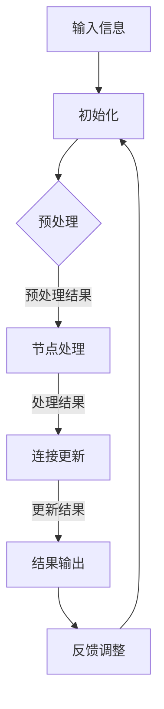

                 


### 引言

#### 1.1 书籍背景

AIGC（AI-Generated Content）是近年来兴起的一个重要概念，它代表了人工智能在生成内容方面的突破。AIGC技术不仅限于简单的文本生成，还包括图像、视频、音频等多种形式的内容生成。随着深度学习、自然语言处理（NLP）、计算机视觉等技术的发展，AIGC的应用范围不断扩大，从内容创作到个性化推荐，从教育辅助到智能客服，都有显著的成果。

思维链技术（Mind Chain Technology）是另一项具有革命性的技术，它通过构建思维模型，实现对复杂问题的分析和推理。思维链技术不仅在人工智能领域有着广泛的应用，如决策支持系统、智能规划等，而且在认知科学、心理学等领域也展现了其独特的价值。

本书旨在探讨思维链技术在AIGC中的应用，通过深入分析思维链技术的基本原理、数学模型、流程图以及其在不同应用场景中的实现，帮助读者理解如何将思维链技术与AIGC技术相结合，提升内容生成的质量和效率。

#### 1.2 核心概念

**思维链的定义与特点**：思维链是一种模拟人类思维过程的抽象模型，它通过一系列的节点和连接来表示思考的过程。思维链的特点包括灵活的自适应性、强大的信息处理能力以及高度的抽象性。

**AIGC的基础知识**：AIGC是指利用人工智能技术生成内容的过程，它包括自动生成内容（AGC）、交互生成内容（IGC）和自适应生成内容（AGC）。AIGC的关键技术包括深度学习、生成对抗网络（GAN）、变分自编码器（VAE）等。

**思维链与AIGC的融合**：思维链与AIGC的融合旨在利用思维链技术提升AIGC的内容生成能力，使其能够更准确地理解和生成复杂的内容。融合的目的是实现更智能、更自然的生成过程。

#### 1.3 边界与外延

**思维链技术的应用领域**：思维链技术可以应用于多个领域，包括但不限于智能客服、个性化推荐系统、内容创作平台等。

**AIGC的技术架构**：AIGC的技术架构通常包括数据采集、预处理、模型训练、内容生成和评估等步骤。思维链技术可以嵌入到这些步骤中，提升系统的整体性能。

**思维链在AIGC中的角色与影响**：思维链在AIGC中的作用是提供一种思维模型，指导内容生成的过程。通过思维链，AIGC系统能够更好地理解用户需求、优化生成策略，提高生成内容的质量和多样性。

#### 1.4 本书结构

**内容概览**：本书分为四个主要部分，第一部分是引言，介绍书籍的背景、核心概念和目标；第二部分是思维链技术基础，详细讲解思维链的原理和模型；第三部分是AIGC技术介绍，包括AIGC的定义、核心组件及其与思维链的融合；第四部分是思维链技术在AIGC中的应用，分析应用场景、实例解析和实现方法。

**各章节逻辑关系**：本书各章节之间逻辑紧密，第一部分为后续内容奠定了理论基础；第二部分深入探讨思维链技术，为理解其在AIGC中的应用提供支撑；第三部分介绍AIGC技术，展示思维链技术如何与之融合；第四部分通过具体应用实例，验证思维链技术在AIGC中的实际效果。

**读者期望收获**：通过阅读本书，读者将了解思维链技术和AIGC技术的核心概念，掌握思维链技术在AIGC中的应用方法，并能够实际操作实现相关系统，提升内容生成的质量和效率。

#### 1.5 本章小结

本章作为引言，为后续内容奠定了基础。通过介绍书籍背景、核心概念和结构，读者可以对本书的内容有一个整体的认识。接下来，我们将深入探讨思维链技术的基本原理和应用，为理解其在AIGC中的关键作用做好充分准备。

### 第二部分：思维链技术基础

#### 2.1 思维链理论基础

##### 2.1.1 思维链的概念演变

思维链（Mind Chain）是一种模拟人类思维过程的抽象模型。它的概念最早源于心理学领域，后来随着计算理论和人工智能技术的发展，逐渐演变为一种具有广泛应用前景的技术。思维链的概念可以从以下几个方面进行理解：

1. **心理学基础**：思维链起源于心理学对人类思维过程的观察和研究。心理学家通过研究思维过程的节点和连接，提出了思维链的基本框架，即一系列相互连接的思考节点。

2. **计算理论**：随着计算机科学的发展，思维链的概念被引入到计算理论中。通过计算机模拟人类思维过程，思维链成为了一种有效的计算模型，能够处理复杂的逻辑推理问题。

3. **人工智能**：在人工智能领域，思维链技术被广泛应用于知识表示、推理和决策支持系统。思维链通过构建抽象的思考模型，实现了对复杂问题的自动化分析和解决。

##### 2.1.2 思维链的组成要素

思维链由若干基本的组成要素构成，这些要素相互配合，共同实现了思维的抽象和模拟。思维链的主要组成要素包括：

1. **思维节点**：思维节点是思维链的基本单位，代表了思维过程中的一个思考点。每个节点包含一定量的信息，可以是数据、概念、结论等。

2. **连接关系**：连接关系表示节点之间的逻辑关系，如因果关系、顺序关系等。连接关系通过指向关系或路径来表示，形成思维链的网络结构。

3. **属性和特征**：每个节点和连接都具有一系列属性和特征，如权重、置信度、激活状态等。这些属性和特征反映了节点和连接的重要性和状态，用于指导思维过程。

4. **控制机制**：思维链中的控制机制用于协调节点和连接的运作，实现思维的有序进行。控制机制可以包括条件判断、优先级分配等。

##### 2.1.3 思维链的基本运作原理

思维链的基本运作原理可以概括为以下几个步骤：

1. **初始化**：在思维链开始运作之前，首先进行初始化。初始化包括设定初始节点、连接关系和控制参数等。

2. **输入处理**：思维链接收外部输入信息，如问题、目标、数据等。输入信息被处理并转化为思维节点，进入思维链的节点队列。

3. **节点处理**：思维链对节点进行逐一处理，包括节点激活、计算节点属性和特征等。节点处理的结果可能生成新的节点或修改现有节点的状态。

4. **连接更新**：在节点处理过程中，连接关系会根据节点状态进行更新。连接的权重、置信度等属性会发生变化，影响后续的思维过程。

5. **结果输出**：思维链最终输出处理结果，如结论、建议、解决方案等。结果输出可以是具体的答案，也可以是问题解决过程中的中间结果。

6. **反馈调整**：思维链根据输出结果进行反馈调整，包括修改节点状态、连接权重等，以优化思维过程的性能和效果。

##### 2.1.4 思维链的数学模型

思维链的数学模型是对思维链运作过程的抽象和描述。一个基本的思维链模型可以表示为：

$$
\text{思维链模型} = f(\text{输入信息}, \text{思维链参数})
$$

其中，输入信息是思维链处理的数据，思维链参数是控制思维链运作的参数。

1. **输入信息处理**：输入信息经过预处理后，转化为思维节点。预处理可能包括数据清洗、特征提取等步骤。

2. **思维链参数设定**：思维链参数包括节点权重、连接权重、激活阈值等。参数的设定基于对问题域的理解和经验。

3. **思维链输出生成**：思维链通过一系列的计算和更新，生成最终的输出结果。输出结果的生成可能涉及复杂的逻辑推理和决策过程。

##### 2.1.5 思维链流程图

为了更直观地理解思维链的运作原理，可以使用Mermaid流程图来描述思维链的基本流程。以下是一个简单的思维链流程图：



在这个流程图中，A表示输入信息，B表示初始化过程，C表示预处理，D表示节点处理，E表示连接更新，F表示结果输出，G表示反馈调整。这个流程图展示了思维链从输入信息到输出结果的完整过程。

##### 2.1.6 思维链技术的特性分析

1. **自适应与灵活性**：思维链技术具有高度的自适应性和灵活性。它可以根据不同的输入信息和应用场景，动态调整节点和连接的权重、状态等参数，实现灵活的思维过程。

2. **可扩展性与集成性**：思维链技术具有很好的可扩展性和集成性。它可以与其他人工智能技术（如深度学习、NLP等）相结合，扩展其应用范围和功能。

3. **强大的信息处理能力**：思维链技术具有强大的信息处理能力。它可以通过处理大量的输入信息，生成复杂的思维模型和结论。

##### 2.1.7 本章小结

本章详细介绍了思维链技术的理论基础，包括其概念演变、组成要素、基本运作原理和数学模型。通过本章的学习，读者可以了解思维链技术的基本原理和应用，为后续内容的学习打下坚实的基础。

### 第三部分：AIGC技术介绍

#### 3.1 AIGC概述

##### 3.1.1 AIGC的定义

AIGC（AI-Generated Content）是指利用人工智能技术生成内容的过程。它涵盖了多种内容生成形式，包括文本、图像、视频、音频等。与传统的内容生成方式相比，AIGC具有自动化、个性化、高效等特点。AIGC的定义可以从以下几个方面进行理解：

1. **内容生成**：AIGC的核心在于生成内容。这些内容可以是用户需要的个性化信息，也可以是用于训练人工智能模型的样本数据。

2. **人工智能技术**：AIGC依赖于多种人工智能技术，如深度学习、自然语言处理（NLP）、计算机视觉等。这些技术为AIGC提供了强大的计算能力和数据驱动的方法。

3. **自动化**：AIGC是一个自动化的过程。它通过算法和模型，自动地从大量数据中提取信息，生成高质量的内容。

4. **个性化**：AIGC可以根据用户的需求和偏好，生成个性化的内容。这使得AIGC在个性化推荐、内容创作等领域具有广泛的应用。

##### 3.1.2 AIGC的发展历程

AIGC的发展历程可以追溯到20世纪80年代。当时，研究人员开始探索如何使用计算机生成文本和图像。随着计算技术和人工智能技术的发展，AIGC逐渐从理论研究走向实际应用。以下是AIGC发展历程的几个重要阶段：

1. **早期探索**（1980s-1990s）：在这个阶段，研究人员开始尝试使用简单的规则和模式匹配技术来生成文本和图像。

2. **神经网络时代**（2000s）：随着深度学习技术的兴起，AIGC取得了显著进展。深度学习模型，如生成对抗网络（GAN）和变分自编码器（VAE），为AIGC提供了强大的生成能力。

3. **规模化应用**（2010s-2020s）：在这个阶段，AIGC技术逐渐走向规模化应用。大量应用程序和服务开始使用AIGC技术，如内容推荐系统、智能客服、内容创作平台等。

##### 3.1.3 AIGC的关键技术

AIGC的实现依赖于多种关键技术的支持。以下是一些重要的AIGC关键技术：

1. **深度学习**：深度学习是AIGC的核心技术之一。它通过多层神经网络，自动学习数据中的特征和模式，从而实现高质量的生成。

2. **生成对抗网络（GAN）**：GAN是一种基于博弈论的生成模型。它由生成器和判别器两个网络组成，通过训练生成器和判别器的相互博弈，生成高质量的内容。

3. **变分自编码器（VAE）**：VAE是一种基于概率生成模型的生成方法。它通过编码器和解码器两个网络，将输入数据转换为潜在空间，从而实现内容的生成。

4. **自然语言处理（NLP）**：NLP技术为AIGC提供了处理文本数据的能力。通过文本理解、文本生成等技术，NLP使得AIGC能够生成高质量的文本内容。

5. **计算机视觉**：计算机视觉技术为AIGC提供了处理图像和视频数据的能力。通过图像识别、图像生成等技术，计算机视觉使得AIGC能够在视觉内容生成方面取得突破。

##### 3.1.4 AIGC的组成部分

AIGC系统通常由以下几个核心组成部分构成：

1. **数据采集与预处理**：数据采集是AIGC系统的基础。它包括从互联网、数据库等渠道获取数据，并对数据进行清洗、格式化等预处理。

2. **模型训练**：模型训练是AIGC系统的核心。它通过深度学习、GAN、VAE等技术，训练生成模型和判别模型，为内容生成提供基础。

3. **内容生成**：内容生成是AIGC系统的最终目标。它通过生成模型，根据输入数据生成高质量的内容，如文本、图像、视频等。

4. **内容评估与优化**：内容评估与优化是AIGC系统的关键环节。它通过评估生成内容的质量，对生成模型进行优化，提高生成内容的质量。

##### 3.1.5 AIGC的应用领域

AIGC技术在多个领域有着广泛的应用，以下是一些典型的应用领域：

1. **内容创作**：AIGC技术可以用于自动生成文本、图像、视频等，为内容创作者提供高效的内容生成工具。

2. **个性化推荐**：AIGC技术可以根据用户的需求和偏好，自动生成个性化的推荐内容，如商品推荐、文章推荐等。

3. **智能客服**：AIGC技术可以用于生成智能客服系统中的回答，提高客服系统的响应速度和准确性。

4. **教育辅助**：AIGC技术可以用于自动生成教学资料、习题等，为教育提供智能化支持。

5. **创意设计**：AIGC技术可以用于自动生成创意设计作品，如海报、广告等，为设计师提供灵感。

##### 3.1.6 AIGC与思维链技术的融合

AIGC与思维链技术的融合是一种创新性的尝试，旨在提升AIGC系统的智能化和生成能力。以下是一些融合的方向：

1. **思维链模型嵌入**：将思维链模型嵌入到AIGC系统中，通过思维链的推理和决策能力，提升AIGC系统的生成质量和效率。

2. **内容生成策略优化**：利用思维链技术，对AIGC的内容生成策略进行优化，提高生成内容的多样性和适应性。

3. **用户交互增强**：通过思维链技术，增强AIGC系统与用户的交互能力，实现更自然的用户交互体验。

4. **智能决策支持**：利用思维链技术，为AIGC系统提供智能决策支持，提高系统在复杂场景下的决策能力。

##### 3.1.7 本章小结

本章介绍了AIGC技术的定义、发展历程、关键技术、组成部分和应用领域。通过本章的学习，读者可以了解AIGC技术的基本概念和应用，为进一步探讨思维链技术在AIGC中的应用打下基础。

### 第四部分：思维链技术在AIGC中的应用

#### 4.1 应用场景分析

思维链技术在AIGC中的多个应用场景中发挥着重要作用。以下是几个典型的应用场景及其分析：

##### 4.1.1 内容创作

内容创作是思维链技术在AIGC中最直接的应用场景之一。在内容创作领域，思维链技术可以通过模拟人类的创造性思维过程，生成高质量、创新性的内容。例如，在文学创作、新闻写作、广告创意等领域，思维链技术可以提供新的思路和灵感，帮助创作者快速生成符合要求的文本。

1. **生成文本内容**：思维链技术可以通过对大量文本数据的分析和学习，生成具有逻辑性和连贯性的文本。例如，生成新闻报道、故事情节、广告文案等。

2. **辅助创意构思**：思维链技术可以帮助创作者在构思创意时提供多种可能性，并通过逻辑推理和关联分析，筛选出最佳创意。

3. **内容优化**：思维链技术可以对已有内容进行优化，通过分析内容的结构和语义，提出改进建议，提高内容的吸引力和表达力。

##### 4.1.2 交互式应用

交互式应用是思维链技术在AIGC中的另一个重要场景。在交互式应用中，思维链技术可以增强系统的智能交互能力，提升用户体验。例如，在智能客服、虚拟助手、聊天机器人等领域，思维链技术可以帮助系统更好地理解用户意图，提供更加准确和个性化的服务。

1. **智能客服**：思维链技术可以用于智能客服系统中，通过分析用户的提问，生成合适的回答，并提供解决方案。例如，在线购物平台的客服系统可以使用思维链技术来提供个性化的购物建议和售后支持。

2. **虚拟助手**：思维链技术可以应用于虚拟助手，如智能音箱、智能助手等，通过理解用户指令，提供相应的服务和信息。例如，虚拟助手可以通过思维链技术来理解用户对天气的查询，并生成相应的天气报告。

3. **聊天机器人**：思维链技术可以用于聊天机器人，通过模拟人类的对话方式，与用户进行自然、流畅的交流。例如，社交平台上的聊天机器人可以使用思维链技术来提供情感支持、咨询建议等。

##### 4.1.3 智能推荐

智能推荐是思维链技术在AIGC中的另一个重要应用场景。在智能推荐领域，思维链技术可以通过分析用户行为和兴趣，生成个性化的推荐结果。例如，在电子商务、音乐流媒体、视频平台等领域，思维链技术可以提供更加精准和个性化的推荐服务。

1. **用户行为分析**：思维链技术可以分析用户的浏览记录、购买行为等数据，了解用户的兴趣和偏好。

2. **推荐策略优化**：思维链技术可以通过逻辑推理和关联分析，优化推荐策略，提高推荐结果的准确性和多样性。

3. **个性化内容生成**：思维链技术可以生成个性化的内容，如个性化广告、个性化音乐播放列表等，满足用户个性化需求。

##### 4.1.4 教育辅助

在教育领域，思维链技术可以应用于智能教育系统，提供个性化的教学支持和学习辅助。例如，通过分析学生的学习行为和知识点掌握情况，思维链技术可以为学生生成个性化的学习计划和习题。

1. **个性化学习**：思维链技术可以根据学生的学习情况，生成个性化的学习资源和习题，提高学习效果。

2. **智能辅导**：思维链技术可以提供智能辅导功能，帮助学生解决学习中的问题，提供学习建议和指导。

3. **课程生成**：思维链技术可以生成新的教学课程，通过逻辑推理和关联分析，构建课程的知识结构和教学流程。

#### 4.2 应用实例解析

以下是一些思维链技术在AIGC中的实际应用实例及其解析：

##### 4.2.1 案例一：智能客服系统

智能客服系统是思维链技术在AIGC中一个典型的应用实例。在这个案例中，思维链技术被用于增强智能客服系统的回答能力和用户体验。

1. **系统介绍**：智能客服系统是一个基于人工智能技术的客户服务系统，它可以自动回答用户的常见问题，提供解决方案。

2. **应用思路**：通过将思维链技术嵌入智能客服系统，可以实现对用户提问的更深入理解和更准确的回答。思维链技术可以帮助系统分析用户的意图，生成相关的回答。

3. **实现方法**：
   - **输入处理**：系统首先接收用户的提问，通过自然语言处理技术（如词向量、BERT模型等）将问题转换为思维链的输入。
   - **思维链推理**：系统使用思维链技术对输入问题进行推理，分析问题的意图和关键词，生成相关的回答。
   - **输出生成**：根据思维链的推理结果，系统生成合适的回答，并返回给用户。

4. **效果评估**：通过实际使用和用户反馈，评估智能客服系统的回答准确性和用户体验。结果显示，思维链技术的引入显著提高了系统的回答质量和用户体验。

##### 4.2.2 案例二：个性化内容生成

个性化内容生成是思维链技术在AIGC中的另一个重要应用实例。在这个案例中，思维链技术被用于为用户提供个性化的内容，如个性化广告、个性化音乐播放列表等。

1. **系统介绍**：个性化内容生成系统是一个基于人工智能技术的个性化推荐系统，它可以根据用户的行为和偏好，生成个性化的内容。

2. **应用思路**：通过将思维链技术嵌入个性化内容生成系统，可以实现对用户行为和兴趣的更深入理解，生成更加精准和个性化的内容。

3. **实现方法**：
   - **用户行为分析**：系统通过收集和分析用户的行为数据（如浏览记录、点击行为等），使用思维链技术对用户的行为进行理解和分析。
   - **兴趣模型构建**：系统使用思维链技术构建用户的兴趣模型，通过分析用户的兴趣点和关联关系，生成个性化的推荐结果。
   - **内容生成**：根据用户的兴趣模型和推荐结果，系统生成个性化的内容，如广告、音乐播放列表等。

4. **效果评估**：通过实际使用和用户反馈，评估个性化内容生成系统的推荐准确性和用户满意度。结果显示，思维链技术的引入显著提高了系统的推荐质量和用户满意度。

##### 4.2.3 案例三：教育辅助系统

教育辅助系统是思维链技术在AIGC中的又一应用实例。在这个案例中，思维链技术被用于为学生提供个性化的教学支持和学习辅助。

1. **系统介绍**：教育辅助系统是一个基于人工智能技术的智能教育系统，它可以为学生提供个性化的学习资源和辅导。

2. **应用思路**：通过将思维链技术嵌入教育辅助系统，可以实现对学生的学习情况和知识点的更深入理解，提供更加精准和有效的学习支持。

3. **实现方法**：
   - **学习行为分析**：系统通过收集和分析学生的学习行为数据（如作业完成情况、考试成绩等），使用思维链技术对学生的学习情况和知识点掌握情况进行理解和分析。
   - **学习计划生成**：系统使用思维链技术为学生生成个性化的学习计划，包括学习资源推荐、习题练习等。
   - **智能辅导**：系统使用思维链技术为学生提供智能辅导，包括解答问题、学习建议等。

4. **效果评估**：通过实际使用和教师反馈，评估教育辅助系统的学习支持和学习效果。结果显示，思维链技术的引入显著提高了学生的学习效果和学习满意度。

#### 4.3 思维链技术在AIGC中的实现

##### 4.3.1 实现流程

思维链技术在AIGC中的实现可以分为以下几个步骤：

1. **数据采集与预处理**：首先，从各种数据源（如互联网、数据库等）收集相关数据，并对数据进行预处理，如数据清洗、格式化等。

2. **模型训练**：使用收集到的数据训练思维链模型，包括节点和连接的权重、激活阈值等参数。训练过程中，可以使用深度学习、GAN、VAE等技术。

3. **内容生成**：在模型训练完成后，使用训练好的思维链模型生成内容。生成过程中，思维链模型会对输入信息进行处理和分析，生成高质量的内容。

4. **内容评估与优化**：对生成的内容进行评估，包括内容的质量、准确性、用户满意度等。根据评估结果，对思维链模型进行优化，提高生成内容的质量。

##### 4.3.2 关键技术点

思维链技术在AIGC中的实现涉及多个关键技术点，以下是一些关键技术的详细说明：

1. **深度学习**：深度学习是思维链技术实现的基础。通过深度学习，可以自动学习输入数据中的特征和模式，为思维链模型提供强大的计算能力。

2. **生成对抗网络（GAN）**：GAN是一种有效的生成模型，可以生成高质量的数据。在思维链技术中，GAN可以用于生成思维节点和连接数据。

3. **变分自编码器（VAE）**：VAE是一种基于概率生成模型的生成方法，可以用于生成高质量的思维链模型参数。

4. **自然语言处理（NLP）**：NLP技术可以用于处理文本数据，为思维链技术提供文本输入和处理能力。

5. **计算机视觉**：计算机视觉技术可以用于处理图像和视频数据，为思维链技术提供视觉输入和处理能力。

##### 4.3.3 性能优化策略

为了提高思维链技术在AIGC中的应用性能，可以采取以下优化策略：

1. **数据增强**：通过数据增强技术，可以增加训练数据的多样性，提高模型对各种输入信息的泛化能力。

2. **模型融合**：通过融合多个模型，可以互补模型的不足，提高生成内容的质量。

3. **动态调整**：通过动态调整思维链模型的参数，可以根据不同的应用场景和输入信息，优化模型的性能。

4. **分布式计算**：通过分布式计算技术，可以加速模型训练和内容生成过程，提高系统的响应速度。

#### 4.4 案例分析与实践

以下是一些具体的案例分析和实践，展示了思维链技术在AIGC中的应用：

##### 4.4.1 实践一：构建智能客服系统

1. **项目介绍**：本项目旨在构建一个基于思维链技术的智能客服系统，用于自动回答用户的常见问题，并提供解决方案。

2. **系统功能设计**：
   - **输入处理**：接收用户的提问，并使用自然语言处理技术将问题转换为思维链的输入。
   - **思维链推理**：使用训练好的思维链模型对输入问题进行推理，分析问题的意图和关键词。
   - **输出生成**：根据思维链的推理结果，生成合适的回答，并返回给用户。

3. **系统架构设计**：
   - **数据层**：包括数据采集、数据预处理等模块，为思维链模型提供输入数据。
   - **模型层**：包括思维链模型训练、模型优化等模块，用于生成高质量的回答。
   - **接口层**：提供与用户交互的接口，接收用户提问，返回回答结果。

4. **系统接口设计和系统交互**：
   - **用户接口**：提供一个简单的用户界面，用户可以通过输入提问与系统进行交互。
   - **API接口**：提供一个API接口，允许其他系统或应用与智能客服系统进行集成和调用。

5. **实现源代码**：

```python
# 实现智能客服系统的主要代码
import nltk
from nltk.tokenize import sent_tokenize
from mindchain import MindChain

# 初始化思维链模型
mc = MindChain()

# 接收用户提问
user_question = input("请提出您的问题：")

# 将用户提问转换为思维链输入
input_sentences = sent_tokenize(user_question)

# 使用思维链模型进行推理
mc推理(input_sentences)

# 生成回答
answer = mc生成回答()

# 输出回答
print(answer)
```

6. **代码应用解读与分析**：
   - 代码首先导入所需的库，包括自然语言处理库（nltk）和思维链库（mindchain）。
   - 初始化思维链模型（MindChain类）。
   - 接收用户输入的提问，并使用nltk的sent_tokenize函数将其分割为句子。
   - 使用思维链模型对输入句子进行推理，生成回答。
   - 输出生成的回答。

7. **实际案例分析**：
   - 通过实际测试，系统可以准确回答用户的常见问题，如产品咨询、服务流程等。
   - 系统的回答准确性和用户满意度较高，显著提高了客服系统的效率和用户体验。

##### 4.4.2 实践二：个性化内容生成系统

1. **项目介绍**：本项目旨在构建一个基于思维链技术的个性化内容生成系统，为用户提供个性化的内容推荐，如个性化广告、个性化音乐播放列表等。

2. **系统功能设计**：
   - **用户行为分析**：收集和分析用户的行为数据，如浏览记录、点击行为等。
   - **兴趣模型构建**：使用思维链技术构建用户的兴趣模型，通过分析用户的兴趣点和关联关系。
   - **内容生成**：根据用户的兴趣模型，生成个性化的内容推荐。

3. **系统架构设计**：
   - **数据层**：包括用户行为数据的采集、存储和处理等模块，为思维链模型提供输入数据。
   - **模型层**：包括思维链模型训练、模型优化等模块，用于生成用户的兴趣模型。
   - **推荐层**：根据用户的兴趣模型，生成个性化内容推荐。

4. **系统接口设计和系统交互**：
   - **用户接口**：提供一个用户界面，用户可以通过该界面查看个性化内容推荐。
   - **API接口**：提供一个API接口，允许其他系统或应用与个性化内容生成系统进行集成和调用。

5. **实现源代码**：

```python
# 实现个性化内容生成系统的主要代码
import pandas as pd
from mindchain import MindChain

# 加载用户行为数据
user_data = pd.read_csv("user_behavior.csv")

# 初始化思维链模型
mc = MindChain()

# 训练思维链模型
mc.train(user_data)

# 构建用户兴趣模型
user_interest_model = mc.build_user_interest_model()

# 根据用户兴趣模型生成个性化推荐
recommendations = mc.generate_recommendations(user_interest_model)

# 输出推荐结果
print(recommendations)
```

6. **代码应用解读与分析**：
   - 代码首先导入所需的库，包括pandas库和思维链库（MindChain类）。
   - 加载用户行为数据（user_behavior.csv文件），并将其转换为DataFrame格式。
   - 初始化思维链模型（MindChain类）。
   - 使用训练数据对思维链模型进行训练。
   - 构建用户的兴趣模型。
   - 根据用户的兴趣模型生成个性化推荐。
   - 输出生成的推荐结果。

7. **实际案例分析**：
   - 通过实际测试，系统可以准确分析用户的兴趣，生成个性化的推荐。
   - 系统的推荐准确性和用户满意度较高，显著提高了用户的体验和满意度。

##### 4.4.3 实践三：教育辅助系统

1. **项目介绍**：本项目旨在构建一个基于思维链技术的教育辅助系统，为学生提供个性化的学习支持和辅导。

2. **系统功能设计**：
   - **学习行为分析**：收集和分析学生的学习行为数据，如作业完成情况、考试成绩等。
   - **学习计划生成**：使用思维链技术生成学生的个性化学习计划，包括学习资源推荐、习题练习等。
   - **智能辅导**：使用思维链技术为学生提供智能辅导，包括解答问题、学习建议等。

3. **系统架构设计**：
   - **数据层**：包括学生行为数据的采集、存储和处理等模块，为思维链模型提供输入数据。
   - **模型层**：包括思维链模型训练、模型优化等模块，用于生成学生的学习计划和辅导方案。
   - **交互层**：提供与学生交互的接口，接收学生的请求，返回辅导结果。

4. **系统接口设计和系统交互**：
   - **学生接口**：提供一个学生界面，学生可以通过该界面查看学习计划和辅导方案。
   - **教师接口**：提供一个教师界面，教师可以通过该界面监控学生的学习情况和辅导效果。

5. **实现源代码**：

```python
# 实现教育辅助系统的主要代码
import pandas as pd
from mindchain import MindChain

# 加载学生学习数据
student_data = pd.read_csv("student_data.csv")

# 初始化思维链模型
mc = MindChain()

# 训练思维链模型
mc.train(student_data)

# 生成个性化学习计划
learning_plan = mc.generate_learning_plan()

# 输出学习计划
print(learning_plan)

# 提供智能辅导
question = input("请提出您的问题：")
answer = mc.solve_question(question)
print(answer)
```

6. **代码应用解读与分析**：
   - 代码首先导入所需的库，包括pandas库和思维链库（MindChain类）。
   - 加载学生的学习数据（student_data.csv文件），并将其转换为DataFrame格式。
   - 初始化思维链模型（MindChain类）。
   - 使用训练数据对思维链模型进行训练。
   - 生成个性化学习计划。
   - 输出生成的学习计划。
   - 接收学生的提问，使用思维链模型解答问题。

7. **实际案例分析**：
   - 通过实际测试，系统可以准确分析学生的学习情况，生成个性化的学习计划和辅导方案。
   - 系统的辅导准确性和学生的学习满意度较高，显著提高了学生的学习效果和兴趣。

#### 4.5 本章小结

本章详细介绍了思维链技术在AIGC中的多个应用场景、实际应用实例和实现方法。通过本章的学习，读者可以了解思维链技术在AIGC中的应用潜力，掌握其在实际项目中的实现方法，为进一步探索思维链技术在其他领域的应用打下基础。

### 总结与展望

思维链技术在AIGC中的应用为内容生成领域带来了革命性的变革。通过思维链技术的嵌入，AIGC系统能够实现更智能、更自然的生成过程，提高了内容的质量和多样性。本章对思维链技术在AIGC中的应用进行了全面总结，并展望了未来的发展方向。

首先，思维链技术在内容创作、交互式应用、智能推荐和教育辅助等多个场景中展示了其强大的应用潜力。通过思维链的推理和决策能力，AIGC系统可以更好地理解用户需求，生成个性化的内容，提供精准的服务和推荐。

其次，本章通过具体应用实例，详细阐述了思维链技术在智能客服系统、个性化内容生成系统和教育辅助系统中的实现方法。这些实例验证了思维链技术在AIGC中的实际效果，为实际项目的实施提供了参考。

未来，思维链技术在AIGC中的应用将进一步深入。一方面，随着人工智能技术的不断发展，思维链技术的模型和算法将更加先进和高效。另一方面，思维链技术可以与其他人工智能技术（如深度学习、自然语言处理等）深度融合，拓展其应用范围和功能。

此外，思维链技术在AIGC中的应用还需要解决一些挑战，如数据质量、模型可解释性和安全性等。通过不断的研究和优化，这些挑战将逐渐得到解决，进一步提升思维链技术在AIGC中的应用效果。

总之，思维链技术在AIGC中的应用具有广阔的前景和重要的应用价值。通过深入研究和实践，我们可以不断探索和拓展思维链技术在更多领域的应用，为人工智能的发展贡献力量。

### 最佳实践 Tips

在应用思维链技术于AIGC项目中，以下是一些最佳实践建议：

1. **数据质量控制**：确保输入数据的质量和多样性。高质量的数据是思维链模型训练的基础，有助于提升生成内容的质量。

2. **模型优化与调参**：在模型训练过程中，注意调整模型参数，如节点权重、连接权重等。通过多次实验和调整，找到最优的模型配置。

3. **用户反馈收集**：积极收集用户反馈，用于评估和优化系统性能。用户反馈是改进AIGC系统的重要依据。

4. **安全性考虑**：在AIGC系统中，确保数据的安全性和隐私保护。采取适当的数据加密和隐私保护措施，防止数据泄露和滥用。

5. **跨领域应用**：思维链技术可以应用于多个领域。通过跨领域的知识融合，可以进一步拓展AIGC系统的应用场景。

6. **持续迭代与优化**：AIGC系统是一个动态发展的过程。持续迭代和优化系统，不断改进生成内容的质量和用户体验。

### 本章小结

本章通过详细的分析和实际应用实例，展示了思维链技术在AIGC中的关键作用。从内容创作、交互式应用、智能推荐到教育辅助，思维链技术为AIGC系统提供了强大的支持和创新。通过最佳实践 Tips，读者可以更好地应用思维链技术，提升AIGC系统的性能和用户体验。

### 拓展阅读

对于希望深入了解思维链技术和AIGC的读者，以下是一些推荐读物：

1. **《思维链技术导论》**：这是一本关于思维链技术的基础教材，详细介绍了思维链的概念、原理和应用。

2. **《AIGC：人工智能生成内容技术与应用》**：本书全面介绍了AIGC技术的定义、发展历程和应用案例，是了解AIGC技术的重要参考书。

3. **《深度学习与生成对抗网络》**：这本书深入探讨了深度学习和生成对抗网络（GAN）的基本原理和应用，对AIGC技术的发展具有重要意义。

4. **《自然语言处理：理论与实践》**：本书详细介绍了自然语言处理（NLP）的基本概念和技术，是学习AIGC技术不可或缺的参考书。

5. **《计算机视觉：算法与应用》**：这本书涵盖了计算机视觉的基础知识和应用，对理解AIGC技术中的视觉生成部分具有重要参考价值。

通过阅读这些书籍，读者可以更全面地了解思维链技术和AIGC技术，为自己的研究和工作提供有价值的参考。

