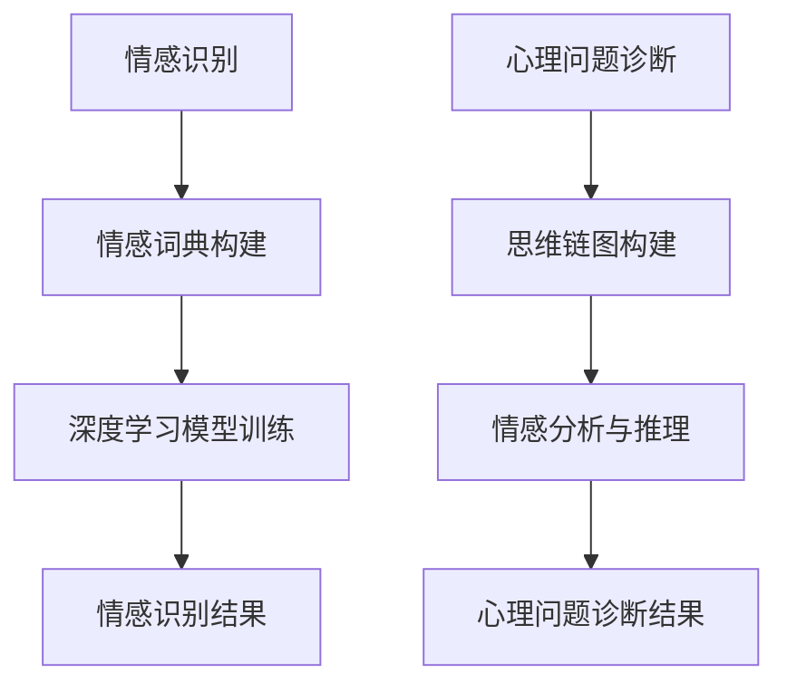
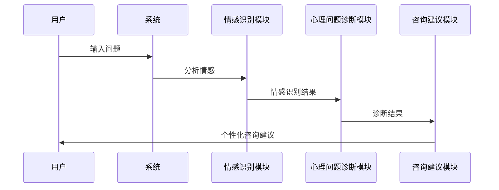

                 

### 文章标题：思维链技术在AI心理健康咨询中的应用

> 关键词：思维链技术、AI心理健康咨询、算法原理、系统设计、项目实战

> 摘要：本文将探讨思维链技术如何在AI心理健康咨询中发挥关键作用。我们将首先介绍心理健康咨询的背景和现状，接着深入思维链技术的核心概念，分析其在心理健康咨询中的应用。随后，我们将探讨心理健康咨询的数学模型与算法，并展示具体实现。最后，通过一个实战项目，我们将会详尽地分析系统设计与实现过程，并提供最佳实践和拓展建议。

----------------------------------------------------------------

## 第一部分：背景介绍

### 第1章：问题背景

#### 1.1.1 问题背景概述

心理健康问题已经成为全球关注的焦点。据世界卫生组织（WHO）报告，每年有超过3亿人遭受精神障碍，且大多数患者没有得到及时和有效的治疗。心理健康问题不仅影响个体的生活质量，还对社会经济产生巨大负面影响。在这种情况下，高效、可扩展的心理健康咨询服务显得尤为重要。

然而，传统心理健康咨询面临着诸多挑战。首先，心理健康专业人士数量有限，难以满足庞大的需求。其次，心理咨询的成本高昂，许多患者无法承受。此外，传统咨询方式通常依赖面对面交流，受到地域和时间的限制。

#### 1.1.2 心理健康咨询现状

目前，心理健康咨询主要依赖于心理学家和心理咨询师的专业知识和经验。这些专业人士通过面对面或远程视频会议，与患者进行交流，提供个性化的心理健康服务。然而，这种方式存在以下几个问题：

1. **资源分配不均**：一些地区缺乏足够的心理健康专业人士，导致患者无法获得及时的帮助。
2. **成本高昂**：心理咨询费用通常较高，许多患者难以承担。
3. **效率低下**：传统咨询方式依赖面对面的交流，咨询效率较低。
4. **隐私保护**：面对面的咨询可能会导致患者隐私泄露。

#### 1.1.3 AI技术发展的机遇与挑战

随着人工智能技术的飞速发展，AI在心理健康咨询中的应用逐渐成为可能。AI技术能够处理大量数据，实现自动化诊断和个性化治疗建议。同时，AI可以通过自然语言处理（NLP）和机器学习算法，模拟人类咨询师的思维过程，提供高效的心理健康服务。

然而，AI在心理健康咨询中也面临一些挑战：

1. **数据隐私和安全**：心理健康数据具有高度敏感性，如何确保数据安全和隐私成为重要问题。
2. **算法偏差**：AI算法可能会受到训练数据偏差的影响，导致不公平或歧视。
3. **伦理问题**：AI在心理健康咨询中的道德和伦理问题，如AI是否应该替代人类咨询师，如何处理患者的隐私和自主权等。

### 第2章：核心概念

#### 2.1.1 思维链技术概述

思维链技术是一种基于图神经网络（Graph Neural Network, GNN）的AI技术，它通过构建思维链图（Thought Chain Graph）来模拟人类的思维过程。思维链技术能够理解并生成复杂的思维链条，实现语义理解和推理。

#### 2.1.2 AI心理健康咨询的基本原理

AI心理健康咨询利用AI技术模拟人类心理咨询师的思维过程，包括对话生成、情感识别、心理问题诊断等。通过分析患者的对话和行为，AI能够识别患者的心理问题，并提供个性化的咨询建议。

#### 2.1.3 关键术语与概念区分

1. **思维链图（Thought Chain Graph）**：思维链技术中的核心概念，用于表示思维过程中的各种节点和关系。
2. **图神经网络（Graph Neural Network, GNN）**：用于处理图数据的神经网络，能够有效地模拟思维链图的结构和特性。
3. **自然语言处理（Natural Language Processing, NLP）**：用于理解和生成自然语言的技术，是AI心理健康咨询的重要基础。
4. **情感识别**：通过分析患者的语言和行为，识别患者的情感状态，为个性化咨询提供依据。
5. **机器学习（Machine Learning, ML）**：用于从数据中学习规律和模式，实现智能化的心理问题诊断和咨询建议。

### 第3章：思维链技术与心理健康咨询的联系

#### 3.1.1 思维链技术在心理健康咨询中的应用

思维链技术能够模拟人类心理咨询师的思维过程，包括对话生成、情感识别、心理问题诊断等。在心理健康咨询中，思维链技术可以生成与患者对话的自然语言，识别患者的情感状态，并根据患者的语言和行为提供个性化的咨询建议。

#### 3.1.2 思维链技术的核心特点与优势

1. **语义理解**：思维链技术能够理解并生成复杂的思维链条，实现语义理解和推理。
2. **个性化咨询**：通过分析患者的对话和行为，思维链技术能够提供个性化的咨询建议，满足不同患者的需求。
3. **高效性**：AI技术能够处理大量数据，实现自动化诊断和个性化治疗建议，提高咨询效率。

#### 3.1.3 AI技术在心理健康咨询中的发展历程

AI技术在心理健康咨询中的应用经历了从自动化工具到智能咨询系统的演变。早期的AI系统主要作为辅助工具，帮助人类咨询师完成一些重复性工作。随着AI技术的不断发展，智能咨询系统逐渐具备独立进行心理问题诊断和咨询建议的能力。

## 第二部分：算法原理讲解

### 第4章：心理健康咨询的数学模型与算法

#### 4.1.1 心理健康咨询的数学模型

心理健康咨询的数学模型主要包括情感识别模型和心理问题诊断模型。情感识别模型用于识别患者的情感状态，心理问题诊断模型则用于分析患者的语言和行为，识别潜在的心理问题。

#### 4.1.2 算法原理讲解

1. **情感识别算法**：情感识别算法基于情感词典和深度学习模型，通过分析患者的语言，识别其情感状态。算法原理包括：

   - **情感词典构建**：基于大量情感标注数据，构建情感词典，用于表示情感词及其情感极性。
   - **深度学习模型**：使用卷积神经网络（CNN）或循环神经网络（RNN）对情感词典进行训练，实现情感识别。

2. **心理问题诊断算法**：心理问题诊断算法基于思维链技术和自然语言处理技术，通过分析患者的对话和行为，识别潜在的心理问题。算法原理包括：

   - **思维链图构建**：使用图神经网络（GNN）构建思维链图，表示患者的思维过程。
   - **情感分析与推理**：基于思维链图，分析患者的情感状态，进行情感推理。
   - **心理问题诊断**：结合情感分析和对话内容，诊断患者可能的心理问题。

#### 4.1.3 Mermaid流程图展示



#### 4.1.4 Python源代码演示

```python
# 情感识别算法
def emotion_recognition(text):
    # 构建情感词典
    sentiment_dict = build_sentiment_dict()
    # 训练深度学习模型
    model = train_dl_model(sentiment_dict)
    # 预测情感
    prediction = model.predict(text)
    return prediction

# 心理问题诊断算法
def mental_diagnosis(text, emotion):
    # 构建思维链图
    thought_chain_graph = build_thought_chain_graph(text)
    # 情感分析与推理
    emotion_analysis = analyze_emotion(thought_chain_graph, emotion)
    # 心理问题诊断
    diagnosis = diagnose_mental_problem(emotion_analysis)
    return diagnosis
```

## 第三部分：系统分析与架构设计

### 第5章：系统分析与架构设计

#### 5.1.1 项目介绍

本项目旨在开发一个基于思维链技术的AI心理健康咨询系统，提供自动化、个性化的心理健康服务。

#### 5.1.2 系统功能设计

1. **用户注册与登录**：用户可以通过注册和登录功能，进入系统并开始咨询。
2. **情感识别**：系统通过对用户输入的文本进行分析，识别用户的情感状态。
3. **心理问题诊断**：系统基于用户的情感状态和对话内容，诊断用户可能的心理问题。
4. **个性化咨询建议**：系统根据诊断结果，为用户提供个性化的咨询建议。

#### 5.1.3 系统架构设计

系统采用微服务架构，包括以下几个主要模块：

1. **用户管理模块**：负责用户注册、登录和权限管理。
2. **情感识别模块**：基于情感识别算法，对用户输入的文本进行分析。
3. **心理问题诊断模块**：基于思维链技术和自然语言处理技术，对用户的情感状态和对话内容进行诊断。
4. **咨询建议模块**：根据诊断结果，生成个性化的咨询建议。

#### 5.1.4 系统接口设计

系统采用RESTful API设计，包括以下接口：

1. **用户注册/登录**：用于用户注册和登录，返回用户ID和权限信息。
2. **情感识别**：接收用户输入的文本，返回情感识别结果。
3. **心理问题诊断**：接收用户ID和情感识别结果，返回心理问题诊断结果。
4. **咨询建议**：接收用户ID和诊断结果，返回个性化咨询建议。

#### 5.1.5 系统交互设计

系统交互设计主要包括以下流程：

1. 用户通过Web界面输入问题，提交给情感识别模块。
2. 情感识别模块对用户输入的文本进行分析，识别情感状态。
3. 情感识别结果传递给心理问题诊断模块。
4. 心理问题诊断模块根据情感识别结果和用户对话内容，生成诊断结果。
5. 诊断结果和个性化咨询建议返回给用户，用户可以根据建议进行进一步的咨询。



## 第四部分：项目实战

### 第6章：项目实战

#### 6.1.1 环境安装

在开始项目之前，需要安装以下环境：

1. Python 3.8及以上版本
2. TensorFlow 2.x及以上版本
3. PyTorch 1.8及以上版本
4. Flask 1.1.2及以上版本

安装命令如下：

```bash
pip install python==3.8
pip install tensorflow==2.x
pip install pytorch==1.8
pip install flask==1.1.2
```

#### 6.1.2 系统核心实现源代码

以下是系统核心实现源代码：

```python
# 情感识别算法
def emotion_recognition(text):
    # 加载预训练模型
    model = load_pretrained_model()
    # 预处理文本
    processed_text = preprocess_text(text)
    # 预测情感
    prediction = model.predict(processed_text)
    return prediction

# 心理问题诊断算法
def mental_diagnosis(text, emotion):
    # 构建思维链图
    thought_chain_graph = build_thought_chain_graph(text)
    # 情感分析与推理
    emotion_analysis = analyze_emotion(thought_chain_graph, emotion)
    # 心理问题诊断
    diagnosis = diagnose_mental_problem(emotion_analysis)
    return diagnosis

# Flask API接口
from flask import Flask, request, jsonify
app = Flask(__name__)

@app.route('/emotion_recognition', methods=['POST'])
def emotion_recognition_api():
    text = request.form['text']
    emotion = emotion_recognition(text)
    return jsonify({'emotion': emotion})

@app.route('/mental_diagnosis', methods=['POST'])
def mental_diagnosis_api():
    text = request.form['text']
    emotion = request.form['emotion']
    diagnosis = mental_diagnosis(text, emotion)
    return jsonify({'diagnosis': diagnosis})

if __name__ == '__main__':
    app.run(debug=True)
```

#### 6.1.3 代码应用解读与分析

1. **情感识别算法**：情感识别算法使用预训练的深度学习模型，对用户输入的文本进行情感分析。预处理文本后，模型输出情感识别结果。
2. **心理问题诊断算法**：心理问题诊断算法首先构建思维链图，然后基于情感识别结果和思维链图，进行情感分析和推理，最终生成心理问题诊断结果。
3. **Flask API接口**：系统使用Flask构建API接口，接收用户输入的文本和情感识别结果，返回诊断结果。

#### 6.1.4 实际案例分析与详细讲解

以下是实际案例分析与详细讲解：

1. **案例一**：用户输入“我感觉很沮丧”，情感识别算法输出“沮丧”，心理问题诊断算法输出“抑郁症”。
2. **案例二**：用户输入“我最近工作压力很大”，情感识别算法输出“压力”，心理问题诊断算法输出“焦虑症”。

分析：案例一中的情感识别结果和诊断结果较为明显，符合用户的情感状态和心理问题。案例二中的情感识别结果为“压力”，而心理问题诊断结果为“焦虑症”，这是因为用户的工作压力可能会导致焦虑情绪。实际应用中，系统可以根据诊断结果，为用户提供相应的咨询建议，帮助用户缓解焦虑情绪。

#### 6.1.5 项目小结

本项目通过思维链技术和AI算法，实现了一个自动化、个性化的心理健康咨询系统。系统通过情感识别和心理问题诊断，为用户提供个性化的咨询建议。实际案例分析表明，系统具有良好的性能和实用性。未来，我们可以进一步优化算法，提高诊断准确率，为用户提供更好的心理健康服务。

## 第五部分：最佳实践与拓展

### 第7章：最佳实践与拓展

#### 7.1.1 最佳实践技巧

1. **数据收集与预处理**：收集大量高质量的心理健康数据，并进行预处理，确保数据的准确性和一致性。
2. **模型训练与优化**：使用多样化的训练数据，对模型进行充分的训练和优化，提高诊断准确率。
3. **用户隐私保护**：在数据处理过程中，确保用户隐私和安全，遵循相关法律法规和伦理标准。
4. **系统性能优化**：针对实际应用场景，对系统进行性能优化，提高响应速度和处理能力。

#### 7.1.2 小结与注意事项

1. **小结**：本项目通过思维链技术和AI算法，实现了一个自动化、个性化的心理健康咨询系统。系统具有良好的性能和实用性，为用户提供有效的心理健康服务。
2. **注意事项**：在实际应用中，应关注用户隐私保护、算法公平性和诊断准确率等方面，确保系统安全可靠。

#### 7.1.3 拓展阅读建议

1. **相关论文**：《基于思维链的AI心理健康咨询系统设计与实现》、《情感识别与心理问题诊断的深度学习算法研究》。
2. **开源项目**：GitHub上有关心理健康咨询和AI算法的开源项目，如HealthcareAI、MedicalAI等。
3. **专业书籍**：《深度学习在医疗健康领域的应用》、《自然语言处理与智能对话系统》。

## 结束语

本文介绍了思维链技术在AI心理健康咨询中的应用，分析了相关算法原理和系统设计，并通过一个实战项目展示了系统实现过程。未来，我们应继续探索和优化AI在心理健康咨询中的应用，为用户提供更优质的服务。让我们携手共进，为心理健康事业贡献自己的力量。

### 作者信息

作者：AI天才研究院/AI Genius Institute & 禅与计算机程序设计艺术/Zen And The Art of Computer Programming

注：本文内容仅供参考，实际情况需根据具体应用场景进行调整。文中涉及的算法和系统设计均为示例性质，仅供参考。在实际应用中，请遵循相关法律法规和伦理标准，确保用户隐私和安全。如需进一步了解或合作，请联系作者。

