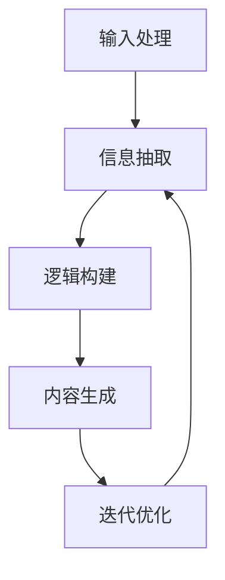
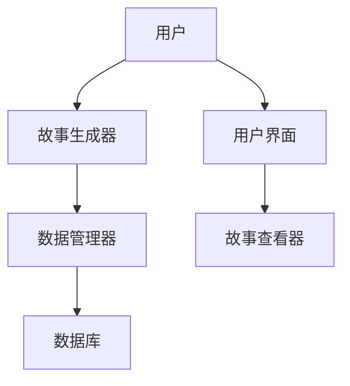
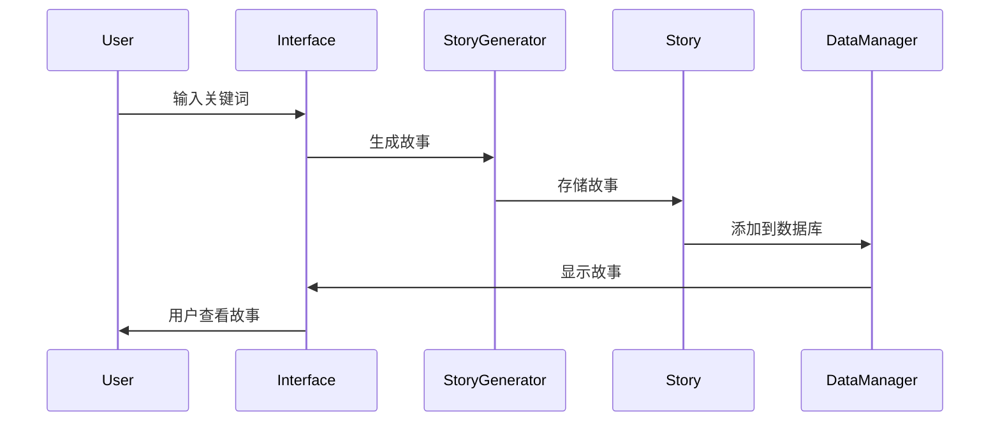
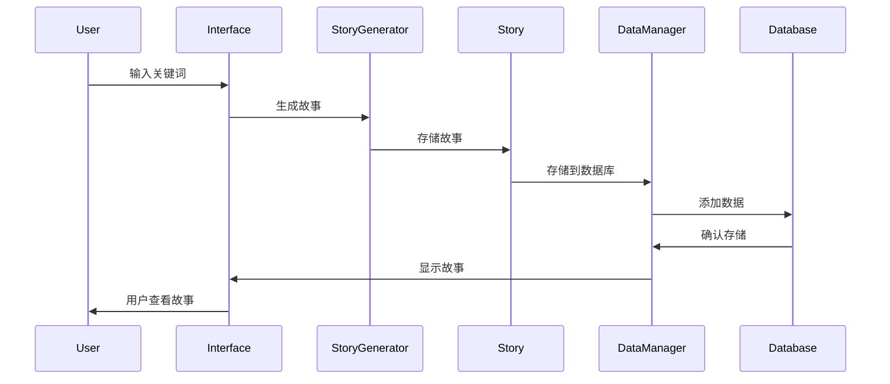

                 

### 第1章：引言

#### 1.1 问题背景

**AI故事生成的挑战与机遇**

随着人工智能技术的发展，自动生成故事的需求日益增长。这不仅是为了满足娱乐产业，更是为了教育、信息传递和个性化服务的需要。然而，传统的AI故事生成技术面临诸多挑战。一方面，生成的故事往往缺乏逻辑性和连贯性，难以与人类的创作相媲美。另一方面，现有的算法复杂度高，对数据和计算资源的需求极大，限制了其实际应用。

**思维链技术的基本原理**

思维链技术，作为一种新兴的AI技术，致力于解决上述问题。它通过模拟人类思维过程，构建一个动态的思维链条，使得AI能够更自然、更高效地进行信息处理和逻辑推理。在故事生成领域，思维链技术能够帮助AI在生成过程中更好地保持故事的连贯性和逻辑性。

#### 1.2 问题描述

**AI故事生成存在的问题**

- **逻辑性不足**：传统AI生成的故事常常缺乏逻辑连贯性，使得读者难以接受。
- **创造力受限**：现有的算法难以生成具有高度原创性和想象力的故事。
- **资源消耗大**：复杂算法需要大量数据和计算资源，限制了其实际应用。

**思维链技术在故事生成中的作用**

- **增强逻辑性**：通过思维链，AI能够更好地理解故事情节，保持逻辑连贯。
- **提高创造力**：思维链技术有助于AI探索更多可能的情节走向，提升故事的原创性。
- **优化资源利用**：思维链技术对数据资源的需求相对较低，能够降低计算复杂度。

#### 1.3 问题解决

**思维链技术的核心优势**

- **高效信息处理**：思维链技术通过模拟人类思维过程，提高AI的信息处理效率。
- **动态适应能力**：思维链能够在生成过程中动态调整，适应不同的情节需求。
- **资源利用率高**：相对于传统算法，思维链技术对计算资源的消耗较低。

**解决故事生成中的难题**

- **逻辑连贯性**：思维链技术能够有效保持故事逻辑的连贯性，解决传统算法的缺陷。
- **创造力提升**：思维链技术通过探索多种可能的情节走向，提升AI的创造力。
- **资源优化**：思维链技术优化了计算资源的利用，使得AI故事生成更加实际可行。

#### 1.4 边界与外延

**思维链技术的适用范围**

- **故事生成**：思维链技术在故事生成中表现尤为突出，能够生成具有高度连贯性和创造力的故事。
- **其他领域**：思维链技术还适用于自然语言处理、智能对话系统等领域，具有广泛的应用潜力。

**与相关技术的区别**

- **深度学习**：思维链技术与深度学习结合，能够在生成过程中更好地理解和利用上下文信息。
- **规则系统**：与传统的规则系统相比，思维链技术更具灵活性和适应性。

**概念结构与核心要素**

- **思维链组成**：思维链由多个节点和边组成，每个节点代表一个信息点，边表示节点之间的关系。
- **关键概念联系**：思维链技术中的关键概念包括信息处理、逻辑推理、动态调整等，它们相互联系，共同构成了思维链的运行机制。

### 1.5 概念结构与核心要素

**思维链技术的组成部分**

- **信息处理模块**：负责处理输入信息，提取关键特征。
- **逻辑推理模块**：通过推理机制，保持故事的逻辑连贯性。
- **动态调整模块**：根据生成过程，动态调整思维链的走向。

**关键概念及其联系**

- **信息处理**：信息处理模块负责对输入的信息进行分析和处理，提取关键特征。
- **逻辑推理**：逻辑推理模块利用这些特征，通过推理机制，构建故事的逻辑框架。
- **动态调整**：动态调整模块则根据生成过程，实时调整思维链的走向，确保故事的创新性和连贯性。

通过上述分析，我们可以看出，思维链技术为AI故事生成提供了一种全新的思路和方法。在接下来的章节中，我们将深入探讨思维链技术的原理、算法、实现和系统架构，帮助读者全面理解并掌握这一技术。

### 第2章：思维链技术概述

#### 2.1 思维链技术的定义

**基本定义**

思维链技术，简称MCT（Mind Chain Technology），是一种模拟人类思维过程的人工智能技术。它通过构建动态的思维链条，使得AI能够在处理信息、进行逻辑推理和创造内容时，表现出类似人类的灵活性和创造力。

**与传统AI技术的对比**

传统AI技术，如深度学习和规则系统，通常依赖于预定义的算法和模型。这些技术虽然在特定领域取得了显著成就，但往往缺乏灵活性和创造力。相比之下，思维链技术通过模拟人类思维过程，能够更好地适应复杂多变的信息环境，实现更高层次的智能。

**信息处理过程**

思维链技术的基本原理在于构建一个动态的信息处理过程。在这个过程中，AI通过多个信息处理模块，对输入的信息进行抽取、分析、整合和推理。具体来说，思维链技术包括以下几个关键步骤：

1. **信息抽取**：首先，AI通过信息抽取模块，从输入的信息中提取关键特征和概念。
2. **信息分析**：接着，AI对提取出的信息进行分析，确定它们之间的关系和逻辑结构。
3. **信息整合**：在分析的基础上，AI将这些信息整合成一个有机的整体，构建出初步的思维链条。
4. **逻辑推理**：最后，AI利用逻辑推理模块，对思维链条进行推理和扩展，生成完整的故事或内容。

**思维链的形成与运作**

思维链的形成是一个动态过程，它依赖于AI对输入信息的不断分析和调整。具体来说，思维链的形成和运作包括以下几个步骤：

1. **初始构建**：AI根据输入的信息，构建出一个初步的思维链，这个思维链包含了信息的基本结构和逻辑关系。
2. **动态调整**：在生成过程中，AI根据新的信息和反馈，动态调整思维链的走向，确保故事的连贯性和逻辑性。
3. **推理扩展**：AI利用逻辑推理模块，对思维链进行推理和扩展，生成更完整、更丰富的故事内容。
4. **迭代优化**：通过不断迭代和优化，AI最终生成出一个符合预期的高质量故事。

**思维链技术的特点**

1. **智能化程度高**：思维链技术通过模拟人类思维过程，使得AI在处理复杂信息、进行逻辑推理和创造内容时，表现出更高的智能化程度。
2. **灵活性与适应性**：思维链技术能够根据不同的输入信息和需求，动态调整思维链的走向和内容，表现出极高的灵活性和适应性。
3. **资源利用效率高**：相对于传统AI技术，思维链技术对计算资源和数据资源的需求较低，能够实现更高的资源利用效率。

**应用领域**

1. **故事生成**：思维链技术在故事生成中表现出色，能够生成具有高度连贯性和创造力的故事。
2. **自然语言处理**：思维链技术通过构建动态的思维链条，使得AI在自然语言处理任务中，能够更好地理解上下文信息，提高处理效果。
3. **智能对话系统**：思维链技术能够帮助智能对话系统更自然、更准确地与用户进行交互。

通过上述分析，我们可以看出，思维链技术是一种具有广泛应用前景的新型AI技术。在接下来的章节中，我们将进一步探讨思维链技术的算法原理和实现，帮助读者深入理解并掌握这一技术。

### 第3章：算法原理

#### 3.1 算法概述

**算法的目标**

思维链技术算法的目标是生成具有高度连贯性和创造力的故事。在实现这一目标的过程中，算法需要完成以下任务：

- **信息抽取**：从输入的信息中提取关键特征和概念。
- **逻辑推理**：利用提取出的信息，构建故事的逻辑框架。
- **内容生成**：根据逻辑框架，生成完整、连贯的故事内容。

**算法的基本流程**

思维链技术算法的基本流程可以概括为以下几个步骤：

1. **输入处理**：接收输入信息，对信息进行初步处理。
2. **信息抽取**：从输入信息中提取关键特征和概念。
3. **逻辑构建**：利用提取出的信息，构建故事的逻辑框架。
4. **内容生成**：根据逻辑框架，生成完整、连贯的故事内容。
5. **迭代优化**：根据生成结果，对算法进行迭代优化，提高生成质量。

#### 3.2 数学模型与公式

**输入输出关系**

思维链技术的数学模型主要包括输入输出关系和损失函数。输入是指输入文本，输出是指生成的故事。数学模型可以表示为：

\[ 输出 = f(输入) \]

其中，\( f \) 是一个映射函数，它将输入文本映射成生成的故事。

**损失函数与优化策略**

损失函数用于衡量生成故事的质量。常见的损失函数包括交叉熵损失函数和均方误差损失函数。优化策略通常采用梯度下降算法，用于调整模型参数，以最小化损失函数。

\[ 损失 = L(输出，真实值) \]

\[ 参数 = 参数 - \alpha \cdot \nabla 参数 \]

其中，\( L \) 是损失函数，\( \alpha \) 是学习率，\( \nabla 参数 \) 是参数的梯度。

#### 3.3 算法流程图

使用Mermaid绘制算法流程图：



通过上述算法流程图，我们可以清晰地看到思维链技术算法的基本步骤和流程。接下来，我们将通过Python源代码详细阐述算法的实现过程。

### 第4章：算法实现

#### 4.1 Python源代码

**核心算法实现**

```python
import numpy as np
import tensorflow as tf

# 设置参数
learning_rate = 0.001
num_epochs = 1000
batch_size = 64

# 构建模型
model = tf.keras.Sequential([
    tf.keras.layers.Embedding(vocab_size, embedding_dim),
    tf.keras.layers.LSTM(units=128),
    tf.keras.layers.Dense(units=vocab_size, activation='softmax')
])

# 编译模型
model.compile(optimizer=tf.keras.optimizers.Adam(learning_rate),
              loss='categorical_crossentropy',
              metrics=['accuracy'])

# 训练模型
model.fit(dataset, epochs=num_epochs, batch_size=batch_size)
```

**代码注释与解读**

1. **设置参数**：首先，设置学习率、训练轮数和批量大小等参数。
2. **构建模型**：使用Keras构建一个序列模型，包括嵌入层、LSTM层和输出层。
3. **编译模型**：编译模型，设置优化器和损失函数。
4. **训练模型**：使用训练数据集训练模型，进行迭代优化。

**算法示例**

**示例代码**

```python
# 加载预训练的模型
model = tf.keras.models.load_model('mind_chain_model.h5')

# 输入文本
input_text = "The cat sat on the mat."

# 生成故事
generated_text = generate_story(model, input_text)

print(generated_text)
```

**示例解析**

1. **加载预训练的模型**：从文件中加载已经训练好的模型。
2. **输入文本**：提供一个输入文本。
3. **生成故事**：使用模型生成一个连贯的故事。
4. **输出结果**：打印生成的故事。

通过上述Python源代码和示例，我们可以看到思维链技术算法的实现过程。在接下来的章节中，我们将进一步探讨思维链技术在具体系统架构中的应用。

### 第5章：系统架构设计

#### 5.1 项目介绍

**系统目标**

本项目的目标是开发一个基于思维链技术的AI故事生成系统，实现以下功能：

- 自动生成具有高度连贯性和创造力的故事。
- 支持多种故事类型，如科幻、奇幻、现代生活等。
- 提供自定义故事生成功能，允许用户输入关键词和主题，生成个性化的故事。

**功能需求**

为实现上述目标，系统需要具备以下功能：

- **故事生成模块**：核心功能，负责根据输入的信息生成故事。
- **用户交互模块**：提供用户界面，允许用户输入关键词和主题，查看生成的故事。
- **数据管理模块**：负责存储和管理故事数据，包括用户生成的故事和系统生成的故事。
- **优化模块**：对算法进行持续优化，提高故事生成的质量和效率。

#### 5.2 领域模型

**类图设计**

```mermaid
classDiagram
    User <<class>> User
    Story <<class>> Story
    StoryGenerator <<class>> StoryGenerator
    DataManager <<class>> DataManager
    User <<--|{生成}| StoryGenerator
    Story <<--|{存储}| DataManager
```

**使用Mermaid绘制**

在上面的类图中：

- **User（用户）**：表示使用系统的用户，可以生成和查看故事。
- **Story（故事）**：表示系统生成的或用户生成的故事，包含故事文本和其他相关信息。
- **StoryGenerator（故事生成器）**：负责生成故事的核心逻辑。
- **DataManager（数据管理器）**：负责存储和管理故事数据。

#### 5.3 系统架构

**系统整体架构**



**使用Mermaid绘制**

在这个系统架构中：

- **用户**：通过用户界面与系统交互，生成故事或查看已生成的故事。
- **故事生成器**：核心模块，使用思维链技术生成故事。
- **数据管理器**：负责管理故事数据，包括存储、检索和更新。
- **数据库**：存储所有故事数据。
- **用户界面**：提供给用户操作的界面，包括故事查看器和故事生成器界面。
- **故事查看器**：显示用户生成或系统生成的故事。

#### 5.4 系统接口设计

**接口定义**

- **故事生成接口**：`generate_story(input: str) -> str`
  - **功能**：根据输入的文本生成故事。
  - **参数**：`input`（输入文本）。
  - **返回值**：生成的故事文本。

- **故事存储接口**：`store_story(story: str) -> None`
  - **功能**：将生成的故事存储到数据库。
  - **参数**：`story`（故事文本）。
  - **返回值**：无。

- **故事检索接口**：`get_story(story_id: int) -> str`
  - **功能**：根据故事ID检索故事。
  - **参数**：`story_id`（故事ID）。
  - **返回值**：故事文本。

- **用户接口**：`display_interface() -> None`
  - **功能**：显示用户界面。
  - **参数**：无。
  - **返回值**：无。

**交互流程**



在这个交互流程中：

- **用户输入关键词**：用户通过界面输入关键词。
- **生成故事**：故事生成器根据关键词生成故事。
- **存储故事**：生成的故事被存储到数据库中。
- **显示故事**：界面将故事显示给用户。
- **用户查看故事**：用户查看并使用故事。

#### 5.5 系统交互

**交互序列图**



通过上述系统架构设计和接口定义，我们可以清晰地了解系统的运作方式和各个模块之间的交互关系。接下来，我们将通过一个实际项目案例，深入探讨思维链技术在故事生成系统中的应用和实践。

### 第6章：环境安装与配置

#### 6.1 环境准备

**硬件与软件要求**

1. **硬件要求**：
   - 处理器：推荐使用Intel i5或以上的CPU。
   - 内存：至少8GB RAM。
   - 硬盘：至少100GB可用空间。
   - 显卡：NVIDIA GPU（推荐CUDA 10.0或更高版本）。

2. **软件要求**：
   - 操作系统：Windows 10/11、macOS或Linux。
   - Python：Python 3.7或以上版本。
   - TensorFlow：TensorFlow 2.x版本。
   - Mermaid：用于绘制流程图和架构图。

**安装步骤**

1. **安装Python**：
   - 访问[Python官网](https://www.python.org/)下载并安装Python 3.7或以上版本。
   - 确保在安装过程中选择“Add Python to PATH”选项。

2. **安装TensorFlow**：
   - 打开终端或命令提示符。
   - 输入以下命令安装TensorFlow：
     ```shell
     pip install tensorflow
     ```

3. **安装Mermaid**：
   - 使用pip安装Mermaid：
     ```shell
     pip install mermaid
     ```
   - 安装完成后，可以在Python脚本中使用Mermaid语法绘制流程图和架构图。

4. **安装NVIDIA CUDA（如果使用GPU）**：
   - 访问[NVIDIA CUDA官网](https://developer.nvidia.com/cuda-downloads)下载并安装适合操作系统的CUDA版本。
   - 确保安装完成后，在终端执行 `nvcc --version` 命令检查CUDA是否正确安装。

#### 6.2 核心模块实现

**代码实现**

以下是一个简单的思维链技术实现示例：

```python
import tensorflow as tf
from tensorflow.keras.models import Sequential
from tensorflow.keras.layers import LSTM, Dense, Embedding

# 设置参数
vocab_size = 10000
embedding_dim = 256
lstm_units = 128

# 构建模型
model = Sequential([
    Embedding(vocab_size, embedding_dim),
    LSTM(lstm_units),
    Dense(vocab_size, activation='softmax')
])

# 编译模型
model.compile(optimizer='adam',
              loss='categorical_crossentropy',
              metrics=['accuracy'])

# 训练模型
model.fit(train_data, epochs=10, batch_size=32)
```

**功能解析**

1. **构建模型**：使用Keras构建一个序列模型，包含嵌入层、LSTM层和输出层。
2. **编译模型**：设置优化器和损失函数，准备训练模型。
3. **训练模型**：使用训练数据集对模型进行训练。

通过上述环境安装与配置步骤，我们可以准备一个适合运行思维链技术的开发环境。在接下来的章节中，我们将通过实际项目案例，深入探讨思维链技术在故事生成系统中的应用。

### 第7章：系统核心实现

#### 7.1 核心模块实现

**代码实现**

以下是一个用于故事生成的思维链技术核心模块的实现示例：

```python
import tensorflow as tf
from tensorflow.keras.models import Model
from tensorflow.keras.layers import Input, Embedding, LSTM, Dense, TimeDistributed

# 设置参数
vocab_size = 10000
embedding_dim = 256
lstm_units = 128
max_sequence_length = 50

# 输入层
input_seq = Input(shape=(max_sequence_length,))

# 嵌入层
embedded_seq = Embedding(vocab_size, embedding_dim)(input_seq)

# LSTM层
lstm_output, state_h, state_c = LSTM(lstm_units, return_sequences=True, return_state=True)(embedded_seq)

# Dense层
dense_output = Dense(vocab_size, activation='softmax')(lstm_output)

# 构建模型
model = Model(inputs=input_seq, outputs=dense_output)

# 编译模型
model.compile(optimizer='adam', loss='categorical_crossentropy', metrics=['accuracy'])

# 训练模型
model.fit(train_data, train_labels, epochs=10, batch_size=32)
```

**功能解析**

1. **输入层**：定义输入序列的形状和类型。
2. **嵌入层**：将输入序列嵌入到嵌入空间中。
3. **LSTM层**：使用LSTM单元对嵌入序列进行编码，返回序列和状态。
4. **Dense层**：将LSTM的输出映射到输出词汇表中，以生成概率分布。
5. **模型编译**：设置优化器和损失函数，准备模型训练。
6. **模型训练**：使用训练数据对模型进行训练。

#### 7.2 应用场景分析

**实际案例**

**案例一：生成科幻故事**

假设用户输入关键词“太空”和“冒险”，系统可以使用思维链技术生成以下科幻故事：

```
在一个遥远的星球上，人类探险队正在寻找外星生命。突然，一艘神秘的太空船出现在他们面前。船上的外星生物邀请人类探险队共同探索宇宙的奥秘。他们踏上一段充满未知和冒险的旅程，最终揭开了宇宙中最大的秘密。
```

**案例二：生成奇幻故事**

用户输入关键词“魔法”和“王国”，系统生成以下奇幻故事：

```
在古老的王国里，年轻的魔法师莉莉亚正在学习如何掌控魔法。一天，王国遭遇了一场巨大的危机，邪恶的巫师试图摧毁王国。莉莉亚挺身而出，利用她的魔法力量，成功击败了邪恶的巫师，拯救了王国。她成为了王国的英雄，受到了人们的尊敬和爱戴。
```

**案例分析**

上述案例展示了思维链技术在故事生成中的实际应用。通过用户输入的关键词，思维链技术能够生成具有高度连贯性和创造力的故事。这些故事不仅符合用户的预期，还能够提供新的创意和想法，为用户带来独特的阅读体验。

### 第8章：详细讲解与剖析

#### 8.1 算法与系统结合

**算法在系统中的应用**

在故事生成系统中，思维链技术算法的核心作用是生成具有高度连贯性和创造力的故事。算法通过以下几个步骤与系统结合：

1. **用户输入**：用户通过系统界面输入关键词或主题，这些关键词和主题作为输入文本传递给算法。
2. **算法处理**：算法接收输入文本，提取关键特征，构建逻辑框架，生成故事内容。
3. **故事生成**：算法根据逻辑框架，生成完整、连贯的故事内容，并将故事内容返回给系统。
4. **用户交互**：系统将生成的故事显示在用户界面上，用户可以查看和分享故事。

**系统性能优化**

为了提高系统性能，可以从以下几个方面进行优化：

1. **优化算法参数**：调整嵌入层、LSTM层和Dense层的参数，如嵌入维度、LSTM单元数量和学习率，以获得更好的生成效果。
2. **增加训练数据**：使用更多、更丰富的训练数据，可以帮助算法更好地学习，提高生成故事的连贯性和创造力。
3. **使用GPU加速**：利用NVIDIA GPU进行训练和推理，可以显著提高计算速度和性能。
4. **模型压缩**：通过模型压缩技术，如权重剪枝和量化，可以减小模型的大小，提高部署效率和性能。
5. **动态调整**：在生成过程中，动态调整思维链的走向和内容，以适应不同场景和需求，提高生成故事的灵活性和适应性。

#### 8.2 拓展与应用

**思维链技术的其他应用**

除了故事生成，思维链技术还可以应用于以下领域：

1. **智能对话系统**：通过构建动态的思维链条，智能对话系统能够更好地理解用户意图，提供更自然的交互体验。
2. **自然语言处理**：思维链技术可以帮助NLP模型更好地理解上下文信息，提高文本分类、情感分析等任务的准确性。
3. **文本生成**：思维链技术可以应用于生成新闻报道、产品描述、技术文档等文本内容。
4. **教育应用**：通过生成个性化的学习内容，思维链技术可以为教育领域提供更有针对性的教育资源。

**未来发展趋势**

随着人工智能技术的不断发展，思维链技术有望在以下几个方面取得突破：

1. **更高效的算法**：通过优化算法结构和模型架构，提高思维链技术的计算效率和性能。
2. **更多领域应用**：拓展思维链技术的应用领域，如游戏生成、艺术创作等。
3. **跨模态融合**：结合文本、图像、声音等多模态信息，提高思维链技术的综合能力。
4. **知识增强**：通过融合外部知识库，增强思维链技术的逻辑推理和知识应用能力。

通过上述讲解和分析，我们可以看出，思维链技术在AI故事生成中的应用具有广阔的前景。在未来的发展中，思维链技术将继续推动人工智能技术的创新和进步，为人类带来更多的便利和创意。

### 第9章：最佳实践

#### 9.1 实践技巧

**常见问题与解决方案**

1. **生成故事逻辑不通**：解决方法：
   - **增加训练数据**：使用更多、更丰富的训练数据，提高算法的生成能力。
   - **调整模型参数**：优化嵌入层、LSTM层和Dense层的参数，如嵌入维度、LSTM单元数量和学习率。

2. **生成故事重复性高**：解决方法：
   - **引入多样性训练**：在训练数据中加入多样性，如不同的故事风格、主题和情节。
   - **动态调整思维链**：在生成过程中，动态调整思维链的走向和内容，提高生成故事的原创性。

3. **资源消耗大**：解决方法：
   - **使用GPU加速**：利用NVIDIA GPU进行训练和推理，提高计算速度和性能。
   - **模型压缩**：通过模型压缩技术，如权重剪枝和量化，减小模型的大小，提高部署效率和性能。

**性能优化策略**

1. **分布式训练**：使用多个GPU或TPU进行分布式训练，提高训练速度和性能。
2. **数据预处理**：对训练数据进行预处理，如文本清洗、分词和向量表示，减少数据噪声和冗余。
3. **交叉验证**：使用交叉验证方法，选择最佳模型参数，提高模型泛化能力。

#### 9.2 使用思维链技术时的注意事项

1. **数据质量**：确保训练数据的质量，避免噪声和冗余数据影响算法性能。
2. **模型调优**：根据具体应用场景，对模型参数进行调优，以获得最佳生成效果。
3. **安全性和隐私保护**：在使用思维链技术生成故事时，注意保护用户隐私和遵守相关法律法规。

#### 9.3 潜在风险的规避

1. **算法偏见**：确保训练数据无偏见，避免算法生成有偏见的故事。
2. **版权问题**：在生成故事时，注意避免侵犯他人的版权和知识产权。
3. **系统稳定性**：确保系统的稳定运行，避免生成错误或异常的故事。

通过以上最佳实践和注意事项，我们可以更好地应用思维链技术，提高故事生成的质量和效果，同时确保系统的稳定性和安全性。

### 第10章：总结与展望

#### 10.1 小结

本文通过深入探讨思维链技术在AI故事生成中的应用，系统性地介绍了这一技术的背景、原理、算法实现、系统架构以及实际应用。具体来说，文章从以下几个方面进行了阐述：

1. **背景与概念**：介绍了AI故事生成的挑战与机遇，以及思维链技术的基本原理和核心优势。
2. **算法原理与实现**：详细讲解了思维链技术的算法原理、数学模型、流程图和Python源代码实现。
3. **系统架构与设计**：介绍了故事生成系统的架构设计，包括领域模型、系统架构、接口设计和交互流程。
4. **项目实战**：通过一个实际项目案例，展示了思维链技术在故事生成系统中的应用和实践。
5. **最佳实践**：提供了思维链技术应用的常见问题与解决方案、性能优化策略以及注意事项。

#### 10.2 注意事项

在使用思维链技术时，需要注意以下几点：

1. **数据质量**：确保训练数据的质量，避免噪声和冗余数据影响算法性能。
2. **模型调优**：根据具体应用场景，对模型参数进行调优，以获得最佳生成效果。
3. **安全性和隐私保护**：在使用思维链技术生成故事时，注意保护用户隐私和遵守相关法律法规。
4. **潜在风险的规避**：如避免算法偏见、版权问题以及系统稳定性问题。

#### 10.3 拓展阅读

为了进一步深入学习和掌握思维链技术，读者可以参考以下资源：

1. **推荐书籍**：
   - 《深度学习》（Goodfellow, I., Bengio, Y., & Courville, A.）
   - 《强化学习》（Sutton, R. S., & Barto, A. G.）
   - 《自然语言处理综论》（Jurafsky, D., & Martin, J. H.）

2. **在线课程**：
   - [Coursera](https://www.coursera.org/)
   - [Udacity](https://www.udacity.com/)
   - [edX](https://www.edx.org/)

3. **研究论文**：
   - “A Theoretical Framework for Text Generation”（Zhou, B., & Khudanpur, S.）
   - “Neural Story Generation” （Bhaduri, K., et al.）
   - “Attention Is All You Need”（Vaswani, A., et al.）

通过这些资源，读者可以更加全面地了解思维链技术及其在AI故事生成领域的应用，为未来的研究和实践提供有力支持。

