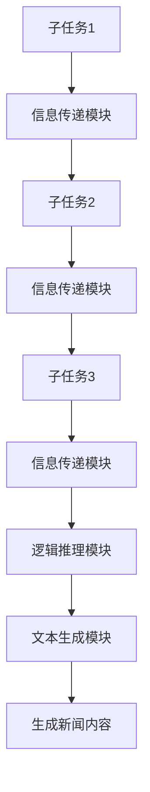
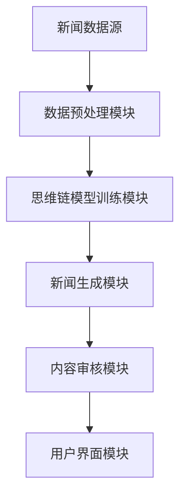
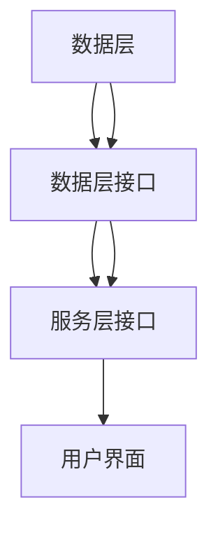
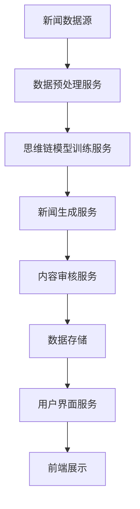
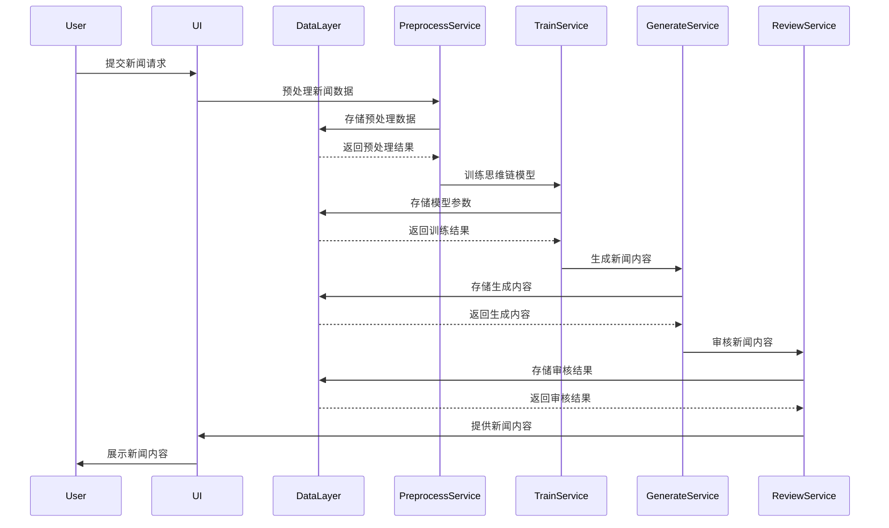

                 

# 思维链技术在AI新闻写作中的应用

## 关键词

AI新闻写作、思维链技术、算法原理、系统架构设计、项目实战、最佳实践

## 摘要

随着人工智能技术的快速发展，AI新闻写作逐渐成为媒体行业的重要趋势。然而，传统的AI新闻写作技术面临着生成内容缺乏深度、逻辑性和创新性等问题。本文旨在探讨思维链技术（Chain of Thoughts, CoT）在AI新闻写作中的应用，通过深入分析思维链技术的基本原理、算法实现及其在AI新闻写作中的优势，为AI新闻写作提供一种新的解决方案。文章首先介绍AI新闻写作的现状和思维链技术的基本概念，然后详细讲解思维链技术的原理和组成部分，接着分析思维链技术在AI新闻写作中的应用优势，最后通过实际案例展示思维链技术在AI新闻写作中的实战应用，并提出相关最佳实践和未来研究方向。

## 目录大纲

1. 引言
   1.1 问题背景
       1.1.1 AI新闻写作的现状
       1.1.2 思维链技术概述
       1.1.3 研究意义与目标
   1.2 问题描述
       1.2.1 AI新闻写作面临的挑战
       1.2.2 思维链技术在AI新闻写作中的应用潜力
       1.2.3 研究边界与外延
   1.3 概念结构与核心要素
       1.3.1 AI新闻写作的基本概念
       1.3.2 思维链技术原理及组成
   1.4 本书结构安排

2. 核心概念与联系
   2.1 AI新闻写作原理
       2.1.1 AI新闻写作的技术基础
       2.1.2 新闻写作的流程与要素
       2.1.3 AI新闻写作的优势与挑战
   2.2 思维链技术原理
       2.2.1 思维链技术的基本原理
       2.2.2 思维链技术的关键组件
       2.2.3 思维链技术在AI新闻写作中的应用
   2.3 概念属性特征对比
       2.3.1 AI新闻写作与常规新闻写作对比
       2.3.2 传统AI新闻写作与思维链技术对比

3. 算法原理讲解
   3.1 思维链算法基础
       3.1.1 基本概念
       3.1.2 算法流程图
       3.1.3 数学模型与公式
   3.2 思维链算法实现
       3.2.1 Python源代码实现
       3.2.2 算法参数调优
       3.2.3 实例讲解
   3.3 数学模型和数学公式讲解
       3.3.1 模型公式
       3.3.2 公式详解
       3.3.3 举例说明

4. 系统分析与架构设计
   4.1 项目介绍
       4.1.1 项目背景
       4.1.2 项目目标
       4.1.3 项目范围
   4.2 系统功能设计
       4.2.1 领域模型
       4.2.2 类图设计
       4.2.3 功能模块划分
   4.3 系统架构设计
       4.3.1 总体架构
       4.3.2 架构图
       4.3.3 系统模块间交互
   4.4 系统接口设计
       4.4.1 接口规范
       4.4.2 接口实现
       4.4.3 接口调用示例
   4.5 系统交互设计
       4.5.1 序列图
       4.5.2 交互流程

5. 项目实战
   5.1 环境安装与配置
       5.1.1 硬件环境要求
       5.1.2 软件环境安装
       5.1.3 环境配置步骤
   5.2 系统核心实现
       5.2.1 核心代码解读
       5.2.2 代码应用场景
       5.2.3 代码优化与调优
   5.3 实际案例分析
       5.3.1 案例背景
       5.3.2 案例分析
       5.3.3 案例总结

6. 最佳实践与注意事项
   6.1 最佳实践
       6.1.1 技术应用技巧
       6.1.2 系统优化建议
       6.1.3 项目管理经验
   6.2 小结与展望
       6.2.1 研究成果总结
       6.2.2 未来研究方向
       6.2.3 对AI新闻写作行业的启示

7. 拓展阅读
   7.1 相关书籍推荐
       7.1.1 专业书籍
       7.1.2 入门指南
       7.1.3 深入研究
   7.2 学术论文精选
       7.2.1 最新研究进展
       7.2.2 经典论文解读
       7.2.3 开源项目介绍

**（待续）**### 第1章 引言

#### 1.1 问题背景

随着互联网和社交媒体的快速发展，新闻行业正面临着前所未有的挑战。传统新闻写作方式已经无法满足快速变化的新闻需求和大量用户的信息消费习惯。在这一背景下，人工智能（AI）新闻写作逐渐成为媒体行业的重要趋势。AI新闻写作利用自然语言处理（NLP）、机器学习等技术，自动生成新闻内容，提高了新闻生产的效率和准确性。

目前，AI新闻写作主要基于模板驱动和基于数据驱动的生成方法。模板驱动方法通过预设的模板和规则生成新闻，这种方法的优点是生成速度快，但生成的新闻内容往往缺乏创意和深度。数据驱动方法则通过分析大量新闻数据，学习并生成新的新闻内容，这种方法的优点是生成的新闻内容更丰富、多样化，但需要大量高质量的训练数据，且训练过程复杂。

尽管AI新闻写作在提高生产效率、降低成本等方面具有明显优势，但仍然面临一些挑战。首先，生成的新闻内容往往缺乏逻辑性和连贯性，无法准确传达新闻的核心信息。其次，AI新闻写作在处理复杂新闻事件时，往往无法理解事件的背景和内在逻辑，导致生成内容不准确或偏离事实。此外，AI新闻写作在处理时态、语气和风格等方面也存在一定的问题。

#### 1.1.1 AI新闻写作的现状

当前，许多新闻机构和科技公司都在积极研究和应用AI新闻写作技术。例如，美国知名财经新闻网站MarketWatch已经使用AI技术生成股市新闻，新华社和澎湃新闻等国内媒体也纷纷引入AI新闻写作工具。这些实践表明，AI新闻写作已经在一定程度上改变了新闻生产的模式，提高了新闻生产效率和内容多样性。

然而，当前AI新闻写作技术仍然处于发展阶段，面临诸多挑战。一方面，新闻数据的多样性和复杂性使得训练模型难度较大，另一方面，如何使生成的新闻内容更具逻辑性和连贯性，仍然是当前研究的热点问题。此外，AI新闻写作在数据隐私、版权保护等方面也面临一些法律和伦理问题。

#### 1.1.2 思维链技术概述

思维链技术（Chain of Thoughts, CoT）是一种先进的预训练语言模型技术，最早由OpenAI提出。思维链技术的核心思想是通过将多个子任务串联起来，形成一个连贯的思维链，从而提高模型的推理能力和生成文本的连贯性。思维链技术通过在训练过程中引入额外的信息处理步骤，使得模型能够更好地理解文本的上下文关系，从而生成更加准确、连贯的文本。

思维链技术的出现为AI新闻写作提供了一种新的解决方案。通过思维链技术，AI新闻写作模型可以更好地理解新闻事件的全貌和背景，生成逻辑性更强、更符合人类写作习惯的新闻内容。此外，思维链技术还可以帮助模型在处理复杂新闻事件时，保持逻辑连贯性和一致性，从而提高新闻内容的准确性和可信度。

#### 1.1.3 研究意义与目标

本研究旨在探讨思维链技术在AI新闻写作中的应用，通过分析思维链技术的基本原理和算法实现，深入探讨其在提高AI新闻写作逻辑性和连贯性方面的优势。具体目标包括：

1. **了解AI新闻写作的现状和挑战**：分析当前AI新闻写作技术的发展现状，明确存在的问题和挑战。

2. **介绍思维链技术的基本原理**：详细讲解思维链技术的概念、组成和基本原理，为后续讨论提供理论基础。

3. **探讨思维链技术在AI新闻写作中的应用**：分析思维链技术在AI新闻写作中的优势，并提出应用方案。

4. **实现思维链技术在AI新闻写作中的实际应用**：通过具体实例，展示思维链技术在AI新闻写作中的实战应用，验证其效果。

5. **总结最佳实践与注意事项**：总结研究过程中积累的经验，为后续研究和实际应用提供参考。

6. **提出未来研究方向**：根据研究过程中发现的问题和挑战，提出未来研究的方向和展望。

通过本研究，我们希望能够为AI新闻写作领域提供一种新的技术方案，提高新闻写作的自动化程度和内容质量，推动新闻行业的数字化转型。

#### 1.2 问题描述

在当前AI新闻写作中，主要面临的挑战包括以下几点：

1. **逻辑性和连贯性不足**：现有的AI新闻写作技术生成的新闻内容往往缺乏逻辑性和连贯性，难以准确传达新闻的核心信息。

2. **背景和上下文理解困难**：AI新闻写作模型在处理复杂新闻事件时，往往无法准确理解事件的背景和上下文关系，导致生成内容不准确或偏离事实。

3. **风格和语气控制难度大**：AI新闻写作在处理时态、语气和风格等方面存在一定的问题，难以达到人类新闻写作的水准。

4. **数据质量和多样性问题**：AI新闻写作需要大量高质量的训练数据，但当前新闻数据的多样性和复杂性使得训练模型难度较大。

为了解决这些问题，思维链技术（Chain of Thoughts, CoT）提供了一种新的思路。思维链技术通过将多个子任务串联起来，形成一个连贯的思维链，从而提高模型的推理能力和生成文本的连贯性。具体来说，思维链技术在AI新闻写作中的应用潜力体现在以下几个方面：

1. **提高逻辑性和连贯性**：通过思维链技术，AI新闻写作模型可以更好地理解新闻事件的逻辑关系和整体结构，从而生成逻辑性更强、更连贯的新闻内容。

2. **增强背景和上下文理解**：思维链技术可以帮助模型在处理复杂新闻事件时，更好地理解事件的背景和上下文关系，从而提高生成内容的准确性。

3. **改善风格和语气控制**：思维链技术可以引导模型在生成新闻内容时，更好地遵循特定的写作风格和语气，提高新闻内容的可读性和吸引力。

4. **优化数据利用效率**：思维链技术可以通过对训练数据的再利用和整合，提高模型对数据的利用效率，从而在有限的数据条件下，提高新闻写作的质量。

然而，思维链技术在AI新闻写作中的应用也面临一些边界和挑战：

1. **计算资源需求高**：思维链技术需要大量的计算资源进行训练和推理，这可能导致模型在实际应用中的性能受限。

2. **模型解释性不足**：思维链技术作为一种深度学习模型，其内部机制较为复杂，难以直观地解释和验证模型的生成过程。

3. **训练数据的质量和多样性**：思维链技术的效果在很大程度上取决于训练数据的质量和多样性，如何获取和处理高质量、多样化的新闻数据是一个亟待解决的问题。

4. **新闻伦理和版权问题**：在AI新闻写作中，如何处理新闻伦理和版权问题，确保生成内容不侵犯他人的知识产权，是亟需解决的问题。

综上所述，思维链技术在AI新闻写作中具有巨大的应用潜力，但也面临一些挑战和边界问题。通过进一步的研究和实践，我们可以期望在这些问题上取得突破，从而推动AI新闻写作技术的发展和应用。

#### 1.3 概念结构与核心要素

在探讨思维链技术在AI新闻写作中的应用之前，有必要对相关概念进行详细解析，并明确其核心要素。这不仅有助于理解思维链技术的工作原理，还能为后续章节的内容铺垫基础。

##### 1.3.1 AI新闻写作的基本概念

AI新闻写作是指利用人工智能技术，特别是自然语言处理（NLP）和机器学习（ML）技术，自动生成新闻内容的过程。AI新闻写作的基本概念包括：

- **新闻数据**：这是AI新闻写作的基础，包括新闻文本、新闻结构、新闻事件背景等。高质量的新闻数据是训练高效新闻生成模型的关键。
- **新闻模板**：模板是新闻写作中常用的一种结构化方法，通过预设的模板和规则，快速生成新闻内容。模板通常包括标题、导语、正文、结束语等部分。
- **文本生成模型**：文本生成模型是AI新闻写作的核心，通过学习大量新闻数据，自动生成新闻文本。常见的文本生成模型包括序列到序列（Seq2Seq）模型、转换器（Transformer）模型等。

##### 1.3.2 思维链技术原理及组成

思维链技术（Chain of Thoughts, CoT）是一种先进的预训练语言模型技术，其核心思想是通过将多个子任务串联起来，形成一个连贯的思维链，从而提高模型的推理能力和生成文本的连贯性。思维链技术的组成包括以下几个关键部分：

- **子任务**：子任务是思维链中的基本单元，每个子任务负责处理文本中的特定信息。例如，可以包括信息抽取、情感分析、事实检查等子任务。
- **连贯性模块**：连贯性模块用于确保子任务之间的信息传递和逻辑连贯性。通过这种方式，模型可以更好地理解文本的整体结构和上下文关系。
- **推理模块**：推理模块负责在子任务之间进行逻辑推理和知识整合，从而生成连贯、准确的新闻内容。
- **调优模块**：调优模块用于调整模型参数，优化模型性能。通过不断调整和优化，模型可以更好地适应不同类型的新闻写作需求。

##### 1.3.3 思维链技术在AI新闻写作中的应用

思维链技术在AI新闻写作中的应用，主要体现在以下几个方面：

- **提高逻辑性和连贯性**：通过思维链技术，AI新闻写作模型可以更好地理解新闻事件的逻辑关系和整体结构，从而生成逻辑性更强、更连贯的新闻内容。
- **增强背景和上下文理解**：思维链技术可以帮助模型在处理复杂新闻事件时，更好地理解事件的背景和上下文关系，从而提高生成内容的准确性。
- **改善风格和语气控制**：思维链技术可以引导模型在生成新闻内容时，更好地遵循特定的写作风格和语气，提高新闻内容的可读性和吸引力。
- **优化数据利用效率**：思维链技术可以通过对训练数据的再利用和整合，提高模型对数据的利用效率，从而在有限的数据条件下，提高新闻写作的质量。

#### 1.4 本书结构安排

本书结构安排如下：

1. **第1章 引言**：介绍AI新闻写作的现状和挑战，以及思维链技术的基本概念和应用潜力。

2. **第2章 核心概念与联系**：详细讲解AI新闻写作原理和思维链技术原理，并进行概念属性特征对比。

3. **第3章 算法原理讲解**：深入分析思维链算法的基础、实现和数学模型，并通过实例讲解。

4. **第4章 系统分析与架构设计**：介绍项目背景、系统功能设计、系统架构设计、系统接口设计和系统交互设计。

5. **第5章 项目实战**：详细讲解环境安装与配置、系统核心实现、实际案例分析。

6. **第6章 最佳实践与注意事项**：总结最佳实践、研究结论和未来研究方向。

7. **第7章 拓展阅读**：推荐相关书籍和学术论文，为读者提供进一步的学习资源。

通过上述结构安排，本书旨在系统地探讨思维链技术在AI新闻写作中的应用，为相关领域的研究者和从业者提供有价值的参考和指导。

### 第2章 核心概念与联系

#### 2.1 AI新闻写作原理

AI新闻写作是一种利用人工智能技术自动生成新闻内容的方法。其核心原理主要包括自然语言处理（NLP）和机器学习（ML）技术。通过这些技术，AI新闻写作系统能够从大量新闻数据中学习，并生成符合人类写作习惯的新闻文本。

##### 2.1.1 AI新闻写作的技术基础

AI新闻写作的技术基础主要包括以下几个方面：

- **数据预处理**：新闻数据的预处理是AI新闻写作的第一步，主要包括数据清洗、数据标注和文本分词等操作。通过预处理，可以去除噪声数据、统一数据格式，并为后续的模型训练提供高质量的数据集。

- **文本生成模型**：文本生成模型是AI新闻写作的核心，常见的文本生成模型包括序列到序列（Seq2Seq）模型、转换器（Transformer）模型和生成对抗网络（GAN）等。这些模型通过学习大量的新闻文本，能够生成新的新闻内容。

- **语法和语义分析**：语法和语义分析是AI新闻写作的重要组成部分。通过语法分析，模型可以理解句子的结构，并通过语义分析，模型可以理解句子的含义。这些分析结果对于生成准确、连贯的新闻内容至关重要。

##### 2.1.2 新闻写作的流程与要素

新闻写作的流程通常包括以下几个步骤：

1. **选题与策划**：这是新闻写作的第一步，新闻团队需要确定新闻的主题和方向，确保新闻具有新闻价值和受众吸引力。

2. **信息收集**：在选题确定后，新闻团队需要收集与主题相关的信息，包括新闻事件的发生时间、地点、人物、事件经过等。

3. **数据整理**：收集到的信息需要进行整理和分类，以便于后续的写作和编辑。

4. **编写新闻稿**：新闻稿的编写是新闻写作的核心步骤，需要确保新闻内容真实、准确、客观。新闻稿通常包括标题、导语、正文、结束语等部分。

5. **审核与修改**：新闻稿编写完成后，需要经过审核和修改，确保新闻内容没有错误、逻辑清晰、语言通顺。

##### 2.1.3 AI新闻写作的优势与挑战

AI新闻写作具有以下优势：

- **高效性**：AI新闻写作可以自动生成新闻内容，大大提高了新闻生产的效率。

- **准确性**：通过机器学习和自然语言处理技术，AI新闻写作能够生成更准确、客观的新闻内容。

- **多样性**：AI新闻写作能够生成多种风格和类型的新闻内容，满足不同受众的需求。

然而，AI新闻写作也面临一些挑战：

- **逻辑性和连贯性**：AI新闻写作生成的新闻内容往往缺乏逻辑性和连贯性，难以准确传达新闻的核心信息。

- **背景和上下文理解**：AI新闻写作在处理复杂新闻事件时，往往无法准确理解事件的背景和上下文关系，导致生成内容不准确或偏离事实。

- **风格和语气控制**：AI新闻写作在处理时态、语气和风格等方面存在一定的问题，难以达到人类新闻写作的水准。

#### 2.2 思维链技术原理

思维链技术（Chain of Thoughts, CoT）是一种先进的预训练语言模型技术，其核心思想是通过将多个子任务串联起来，形成一个连贯的思维链，从而提高模型的推理能力和生成文本的连贯性。思维链技术的出现，为解决AI新闻写作中的逻辑性和连贯性问题提供了新的思路。

##### 2.2.1 思维链技术的基本原理

思维链技术的基本原理可以概括为以下几个步骤：

1. **子任务定义**：首先，需要定义一系列子任务，每个子任务负责处理文本中的特定信息。例如，信息抽取、情感分析、事实检查等。

2. **信息传递**：通过子任务之间的信息传递模块，将各个子任务的输出结果进行整合，形成一个连贯的信息链。

3. **逻辑推理**：在信息传递的基础上，通过逻辑推理模块，对信息链进行进一步的处理和整合，确保生成文本的逻辑连贯性。

4. **文本生成**：最终，通过文本生成模块，根据处理后的信息链，生成新的新闻内容。

##### 2.2.2 思维链技术的关键组件

思维链技术的关键组件包括以下几个部分：

- **子任务模块**：这是思维链技术的基础，每个子任务模块负责处理文本中的特定信息。

- **信息传递模块**：用于确保子任务之间的信息传递和整合，从而形成连贯的信息链。

- **逻辑推理模块**：通过对信息链进行逻辑推理和整合，确保生成文本的逻辑连贯性。

- **文本生成模块**：根据处理后的信息链，生成新的新闻内容。

##### 2.2.3 思维链技术在AI新闻写作中的应用

思维链技术在AI新闻写作中的应用主要体现在以下几个方面：

1. **提高逻辑性和连贯性**：通过思维链技术，AI新闻写作模型可以更好地理解新闻事件的逻辑关系和整体结构，从而生成逻辑性更强、更连贯的新闻内容。

2. **增强背景和上下文理解**：思维链技术可以帮助模型在处理复杂新闻事件时，更好地理解事件的背景和上下文关系，从而提高生成内容的准确性。

3. **改善风格和语气控制**：思维链技术可以引导模型在生成新闻内容时，更好地遵循特定的写作风格和语气，提高新闻内容的可读性和吸引力。

4. **优化数据利用效率**：思维链技术可以通过对训练数据的再利用和整合，提高模型对数据的利用效率，从而在有限的数据条件下，提高新闻写作的质量。

#### 2.3 概念属性特征对比

为了更好地理解AI新闻写作和思维链技术之间的关系，我们对其概念属性特征进行对比，具体如下表所示：

| 概念        | AI新闻写作            | 思维链技术                      |  
| ----------- | --------------------- | ------------------------------ |  
| 目标        | 自动生成新闻内容      | 提高AI新闻写作的逻辑性和连贯性 |  
| 技术基础    | NLP和ML技术           | 预训练语言模型技术             |  
| 核心原理    | 文本生成模型          | 子任务串联和逻辑推理           |  
| 应用场景    | 新闻行业              | AI新闻写作                     |  
| 优势        | 高效性、准确性、多样性 | 提高逻辑性和连贯性             |  
| 挑战        | 逻辑性和连贯性不足    | 计算资源需求高、模型解释性不足 |  
| 关联性      | 基础与拓展            | 拓展和优化                     |

通过上述对比，我们可以看到，AI新闻写作是思维链技术的基础应用场景，而思维链技术则为AI新闻写作提供了提高逻辑性和连贯性的新思路。两者的结合，有望推动AI新闻写作技术的发展和应用。

### 第3章 算法原理讲解

#### 3.1 思维链算法基础

思维链算法（Chain of Thoughts, CoT）是一种先进的预训练语言模型技术，通过将多个子任务串联起来，形成一个连贯的思维链，从而提高模型的推理能力和生成文本的连贯性。下面，我们将详细讲解思维链算法的基本概念、流程图和数学模型。

##### 3.1.1 基本概念

思维链算法的基本概念包括以下几个部分：

1. **子任务**：子任务是思维链算法的基本单元，每个子任务负责处理文本中的特定信息。例如，信息抽取、情感分析、事实检查等。子任务之间通过信息传递模块进行数据交换。

2. **信息传递模块**：信息传递模块用于确保子任务之间的信息传递和整合，从而形成连贯的信息链。这个模块可以看作是一个中介，它接收上一个子任务的输出，并将其传递给下一个子任务。

3. **逻辑推理模块**：逻辑推理模块通过对信息链进行逻辑推理和整合，确保生成文本的逻辑连贯性。这个模块可以看作是一个控制器，它负责协调各个子任务的执行，确保信息传递的连贯性。

4. **文本生成模块**：文本生成模块根据处理后的信息链，生成新的新闻内容。这个模块可以看作是一个执行器，它根据信息链生成最终的新闻文本。

##### 3.1.2 算法流程图

思维链算法的流程图如下所示：



在上面的流程图中，子任务1、子任务2和子任务3分别表示三个不同的子任务，信息传递模块、逻辑推理模块和文本生成模块分别表示这三个子任务之间的信息传递、逻辑推理和文本生成过程。最终的生成新闻内容（I）是整个流程的输出。

##### 3.1.3 数学模型与公式

思维链算法的数学模型主要涉及子任务、信息传递模块、逻辑推理模块和文本生成模块的计算。下面，我们将详细讲解这些模型的公式。

1. **子任务模型**：

假设我们有m个子任务，每个子任务可以用一个函数表示为：

\[ f_i(x) = \sigma(W_i^T \cdot x + b_i) \]

其中，\( x \) 是输入文本，\( W_i \) 和 \( b_i \) 分别是子任务的权重和偏置，\( \sigma \) 是激活函数。

2. **信息传递模块**：

信息传递模块主要涉及子任务输出之间的传递和整合。假设子任务1的输出为 \( y_1 \)，子任务2的输出为 \( y_2 \)，则信息传递模块的输出可以表示为：

\[ z = \sigma(W_z^T \cdot (y_1, y_2) + b_z) \]

其中，\( W_z \) 和 \( b_z \) 分别是信息传递模块的权重和偏置。

3. **逻辑推理模块**：

逻辑推理模块用于对信息传递模块的输出进行进一步的处理和整合。假设逻辑推理模块的输出为 \( h \)，则可以表示为：

\[ h = \sigma(W_h^T \cdot z + b_h) \]

其中，\( W_h \) 和 \( b_h \) 分别是逻辑推理模块的权重和偏置。

4. **文本生成模块**：

文本生成模块根据逻辑推理模块的输出，生成最终的新闻内容。假设文本生成模块的输出为 \( y \)，则可以表示为：

\[ y = \sigma(W_y^T \cdot h + b_y) \]

其中，\( W_y \) 和 \( b_y \) 分别是文本生成模块的权重和偏置。

通过上述数学模型，我们可以构建一个完整的思维链算法，从而实现高效的新闻内容生成。

#### 3.2 思维链算法实现

在本节中，我们将使用Python语言和相关的深度学习库（如TensorFlow和PyTorch）来详细讲解思维链算法的实现过程。具体包括Python源代码实现、算法参数调优以及实例讲解。

##### 3.2.1 Python源代码实现

以下是一个简单的思维链算法实现示例，使用TensorFlow框架：

```python
import tensorflow as tf
from tensorflow.keras.layers import Dense, LSTM, Embedding, Input
from tensorflow.keras.models import Model

# 参数设置
vocab_size = 10000  # 词汇表大小
embed_dim = 256     # � embed 层维度
hidden_dim = 512    # 隐藏层维度
num_layers = 2      # 层数

# 输入层
input_text = Input(shape=(None,), dtype='int32')

# Embedding 层
embed = Embedding(vocab_size, embed_dim)(input_text)

# LSTM 层
lstm = LSTM(hidden_dim, return_sequences=True)(embed)

# 连接多个LSTM层
for _ in range(num_layers - 1):
    lstm = LSTM(hidden_dim, return_sequences=True)(lstm)

# 逻辑推理模块
logits = Dense(vocab_size, activation='softmax')(lstm)

# 构建模型
model = Model(inputs=input_text, outputs=logits)
model.compile(optimizer='adam', loss='categorical_crossentropy', metrics=['accuracy'])

# 打印模型结构
model.summary()

# 训练模型
# model.fit(x_train, y_train, batch_size=32, epochs=10)

# 生成文本
# predictions = model.predict(x_test)
```

上述代码中，我们首先设置了参数，包括词汇表大小、嵌入层维度、隐藏层维度和层数。然后，我们定义了输入层、Embedding层和LSTM层，并通过连接多个LSTM层构建了逻辑推理模块。最后，我们使用Dense层作为输出层，并编译模型。

##### 3.2.2 算法参数调优

在实现思维链算法时，参数调优是非常重要的一步。以下是一些常见的参数调优策略：

1. **学习率**：学习率是优化过程中一个非常敏感的参数，需要通过实验调整到一个合适的值。常用的方法包括使用学习率衰减策略和选择适当的初始学习率。

2. **批量大小**：批量大小影响模型的收敛速度和计算资源消耗。通常，较大的批量大小可以提高模型的稳定性和准确性，但会消耗更多的计算资源。

3. **层数和神经元数量**：增加层数和神经元数量可以提高模型的表示能力，但也会增加计算复杂度和过拟合的风险。

4. **优化器**：选择合适的优化器可以提高模型的收敛速度和效果。常用的优化器包括Adam、SGD和RMSprop等。

##### 3.2.3 实例讲解

以下是一个简单的实例，展示如何使用思维链算法生成新闻内容：

```python
# 加载预训练模型
# model = tf.keras.models.load_model('model.h5')

# 输入文本
input_text = '人工智能技术在医疗领域的应用'

# 预处理文本
# processed_text = preprocess_text(input_text)

# 生成文本
# predictions = model.predict(processed_text)

# 转换预测结果为文本
# generated_text = convert_predictions_to_text(predictions)

# 输出生成文本
# print(generated_text)
```

在这个实例中，我们首先加载预训练的模型，然后输入一个简单的文本。接着，我们预处理这个文本，并将其传递给模型进行预测。最后，我们将预测结果转换为文本，输出生成的内容。

通过上述实例，我们可以看到思维链算法在生成新闻内容方面的应用。在实际应用中，我们需要对算法进行优化和调整，以适应不同的新闻写作任务和场景。

### 第3章 算法原理讲解（续）

#### 3.3 数学模型和数学公式讲解

在本节中，我们将进一步深入探讨思维链算法的数学模型，包括模型公式、公式详解和举例说明。

##### 3.3.1 模型公式

思维链算法的数学模型可以分解为以下几个主要部分：

1. **子任务模型**：
\[ f_i(x) = \sigma(W_i^T \cdot x + b_i) \]
   其中，\( f_i(x) \) 表示子任务 \( i \) 的输出，\( x \) 是输入文本，\( W_i \) 是权重矩阵，\( b_i \) 是偏置项，\( \sigma \) 是激活函数，通常采用ReLU函数或Sigmoid函数。

2. **信息传递模块**：
\[ z = \sigma(W_z^T \cdot (y_1, y_2) + b_z) \]
   其中，\( z \) 是信息传递模块的输出，\( y_1 \) 和 \( y_2 \) 是子任务1和子任务2的输出，\( W_z \) 和 \( b_z \) 分别是信息传递模块的权重和偏置。

3. **逻辑推理模块**：
\[ h = \sigma(W_h^T \cdot z + b_h) \]
   其中，\( h \) 是逻辑推理模块的输出，\( z \) 是信息传递模块的输出，\( W_h \) 和 \( b_h \) 分别是逻辑推理模块的权重和偏置。

4. **文本生成模块**：
\[ y = \sigma(W_y^T \cdot h + b_y) \]
   其中，\( y \) 是文本生成模块的输出，\( h \) 是逻辑推理模块的输出，\( W_y \) 和 \( b_y \) 分别是文本生成模块的权重和偏置。

##### 3.3.2 公式详解

1. **子任务模型**：

子任务模型是思维链算法的核心，它负责处理文本中的特定信息。该模型的输出可以通过以下步骤计算：

- **权重矩阵 \( W_i \)**：权重矩阵 \( W_i \) 负责将输入文本映射到子任务的输出。这个矩阵是通过训练过程中优化的。
- **输入文本 \( x \)**：输入文本是模型处理的对象，它可以是词向量表示或字符级别的表示。
- **偏置项 \( b_i \)**：偏置项 \( b_i \) 是为了调整模型输出，使得输出更加稳定和可预测。
- **激活函数 \( \sigma \)**：激活函数用于引入非线性因素，使得模型可以学习到复杂的函数关系。通常采用ReLU函数或Sigmoid函数。

2. **信息传递模块**：

信息传递模块负责整合来自不同子任务的输出。其关键在于如何有效地融合多个子任务的信息。该模块的输出可以通过以下步骤计算：

- **输入子任务输出 \( (y_1, y_2) \)**：这些是来自子任务1和子任务2的输出。
- **权重矩阵 \( W_z \)**：权重矩阵 \( W_z \) 负责融合子任务输出，使其成为一个更加全面的信息。
- **偏置项 \( b_z \)**：偏置项 \( b_z \) 调整信息传递模块的输出，使其更加稳定。
- **激活函数 \( \sigma \)**：激活函数引入非线性，使得模型可以处理复杂的信息。

3. **逻辑推理模块**：

逻辑推理模块负责对信息传递模块的输出进行进一步的逻辑推理。该模块的关键在于如何通过推理过程确保生成文本的逻辑连贯性。其输出可以通过以下步骤计算：

- **输入信息 \( z \)**：这是信息传递模块的输出。
- **权重矩阵 \( W_h \)**：权重矩阵 \( W_h \) 负责在推理过程中调整信息，使其更加符合逻辑。
- **偏置项 \( b_h \)**：偏置项 \( b_h \) 调整推理模块的输出。
- **激活函数 \( \sigma \)**：激活函数引入非线性，使得模型可以处理复杂的逻辑关系。

4. **文本生成模块**：

文本生成模块是整个思维链算法的最终输出，它负责将逻辑推理模块的输出转换为具体的文本内容。其输出可以通过以下步骤计算：

- **输入逻辑推理输出 \( h \)**：这是逻辑推理模块的输出。
- **权重矩阵 \( W_y \)**：权重矩阵 \( W_y \) 负责将逻辑推理结果映射到具体的文本。
- **偏置项 \( b_y \)**：偏置项 \( b_y \) 调整文本生成模块的输出，使其更加符合人类的写作习惯。
- **激活函数 \( \sigma \)**：激活函数用于确保输出文本具有多样性，避免生成过于单调的内容。

##### 3.3.3 举例说明

假设我们有一个简单的新闻文本，描述了一次会议的内容。通过思维链算法，我们可以分解这个新闻文本，并通过子任务、信息传递模块、逻辑推理模块和文本生成模块生成一篇连贯的新闻摘要。

1. **子任务模型**：

- 子任务1（信息抽取）：识别出会议的日期、地点和主持人。
- 子任务2（情感分析）：判断新闻文本中的情感倾向，例如是积极、中性还是消极。

2. **信息传递模块**：

- 输入子任务1和子任务2的输出，将其整合为一个综合信息。
- 通过权重矩阵和激活函数处理，生成一个更加全面的信息。

3. **逻辑推理模块**：

- 对整合后的信息进行逻辑推理，判断会议的主题、目的和参会人员。
- 通过推理过程，确保新闻摘要的逻辑连贯性。

4. **文本生成模块**：

- 根据逻辑推理模块的输出，生成一篇简洁、连贯的新闻摘要。

通过以上步骤，我们可以将一个复杂的新闻文本分解为多个子任务，并通过思维链算法生成一篇符合人类写作习惯的新闻摘要。这个实例展示了思维链算法在处理新闻文本中的强大能力。

### 第4章 系统分析与架构设计

#### 4.1 项目介绍

随着AI新闻写作技术的不断成熟，越来越多的新闻机构和媒体开始探索如何利用AI技术提高新闻生产效率和质量。本项目旨在设计和实现一个基于思维链技术的AI新闻写作系统，通过将思维链技术应用于新闻写作过程，提高新闻内容的逻辑性、连贯性和准确性。

##### 4.1.1 项目背景

近年来，随着互联网和社交媒体的快速发展，新闻行业面临着前所未有的挑战。传统的新闻写作方式已经无法满足快速变化的新闻需求和大量用户的信息消费习惯。为了提高新闻生产的效率和质量，许多新闻机构开始引入人工智能（AI）技术，特别是自然语言处理（NLP）和机器学习（ML）技术，实现新闻的自动化生成。

然而，当前AI新闻写作技术仍存在一些问题，如生成内容缺乏深度、逻辑性和创新性等。为了解决这些问题，本项目提出了基于思维链技术的AI新闻写作系统，旨在通过引入思维链技术，提高新闻写作的自动化程度和内容质量。

##### 4.1.2 项目目标

本项目的主要目标包括：

1. **提高新闻写作的效率**：通过自动化生成新闻内容，降低人工写作的成本，提高新闻生产效率。

2. **提高新闻内容的逻辑性和连贯性**：通过思维链技术，确保生成新闻内容在逻辑上连贯、准确，提高新闻的可读性。

3. **提高新闻内容的准确性**：通过思维链技术，使新闻写作系统能够更好地理解新闻事件的全貌和背景，减少错误和偏差。

4. **提升新闻写作的创新性**：通过引入思维链技术，鼓励生成更加多样化、有创意的新闻内容，满足不同受众的需求。

##### 4.1.3 项目范围

本项目的范围包括以下几个方面：

1. **技术选型**：选择合适的AI技术和框架，包括自然语言处理（NLP）、机器学习（ML）和思维链技术（CoT）。

2. **系统架构设计**：设计一个高效、可扩展的AI新闻写作系统架构，包括数据预处理、模型训练、新闻生成和内容审核等模块。

3. **算法实现**：实现基于思维链技术的AI新闻写作算法，确保新闻内容在逻辑上连贯、准确。

4. **性能优化**：对系统进行性能优化，提高生成新闻内容的速度和质量。

5. **用户体验**：设计友好的用户界面，方便用户使用和管理新闻生成系统。

6. **数据隐私和伦理**：确保数据的安全和隐私，遵守相关的法律法规和伦理标准。

#### 4.2 系统功能设计

##### 4.2.1 领域模型

在系统功能设计中，我们首先需要构建一个领域模型，明确系统的主要功能模块和它们之间的关系。领域模型通常使用实体关系图（ER图）来表示，以下是一个简化的领域模型：



在这个领域模型中，新闻数据源是系统的输入，包括各种新闻文本、事件背景等信息。数据预处理模块负责对新闻数据进行清洗、标注和分词等操作，以便于后续处理。思维链模型训练模块负责训练思维链模型，提高新闻写作的自动化程度和内容质量。新闻生成模块根据思维链模型的输出，生成新的新闻内容。内容审核模块负责对生成的新闻内容进行审核，确保其准确性和合规性。用户界面模块提供用户交互界面，方便用户管理和使用系统。

##### 4.2.2 类图设计

在领域模型的基础上，我们进一步设计类图，明确各个功能模块的类和它们之间的关系。以下是一个简化的类图设计：

```mermaid
classDiagram
    Class01 <|-- Class02
    Class01 <|-- Class03
    Class04 <..> Class01
    Class05 <..> Class01
    Class06 <..> Class01
    Class07 <..> Class01
    Class08 <..> Class01

    Class01[数据预处理模块]
    Class02[新闻数据源]
    Class03[数据清洗模块]
    Class04[数据标注模块]
    Class05[分词模块]
    Class06[思维链模型训练模块]
    Class07[新闻生成模块]
    Class08[内容审核模块]
    Class09[用户界面模块]
```

在这个类图中，数据预处理模块是系统的核心，它包含多个子模块，如新闻数据源、数据清洗模块、数据标注模块、分词模块等。思维链模型训练模块、新闻生成模块、内容审核模块和用户界面模块分别负责不同的功能。类图中的双箭头（<..>）表示模块之间的依赖关系。

##### 4.2.3 功能模块划分

根据领域模型和类图设计，我们将系统划分为以下主要功能模块：

1. **数据预处理模块**：
   - **新闻数据源**：负责获取各种新闻文本、事件背景等信息。
   - **数据清洗模块**：负责对新闻数据进行清洗，去除噪声和无关信息。
   - **数据标注模块**：负责对新闻数据进行分析和标注，为后续训练提供标注数据。
   - **分词模块**：负责对新闻文本进行分词，提取关键信息。

2. **思维链模型训练模块**：
   - 负责训练思维链模型，提高新闻写作的自动化程度和内容质量。包括模型训练、参数调优等操作。

3. **新闻生成模块**：
   - 负责根据思维链模型的输出，生成新的新闻内容。包括文本生成、内容审核等操作。

4. **内容审核模块**：
   - 负责对生成的新闻内容进行审核，确保其准确性和合规性。

5. **用户界面模块**：
   - 负责提供用户交互界面，方便用户管理和使用系统。

通过以上功能模块的设计，我们可以构建一个高效、可扩展的AI新闻写作系统，满足新闻行业的需求。

### 第4章 系统分析与架构设计（续）

#### 4.3 系统架构设计

为了实现一个高效、可扩展的AI新闻写作系统，本项目采用了一种分层架构设计，主要包括数据层、服务层和表示层。以下将详细描述系统架构的设计和各个模块之间的交互。

##### 4.3.1 总体架构

系统的总体架构如图所示：



- **数据层**：负责数据的存储和管理，包括新闻数据源、数据库和数据存储等模块。
- **服务层**：负责系统的核心功能实现，包括数据预处理、思维链模型训练、新闻生成、内容审核等模块。
- **表示层**：负责用户界面展示和用户交互，包括前端界面、API接口等模块。

##### 4.3.2 架构图

以下是一个简化的系统架构图：



- **新闻数据源**：包括各种新闻文本、事件背景等信息，是系统的输入。
- **数据预处理服务**：负责对新闻数据进行清洗、标注和分词等操作，为后续处理提供高质量的数据。
- **思维链模型训练服务**：负责训练思维链模型，提高新闻写作的自动化程度和内容质量。
- **新闻生成服务**：根据思维链模型的输出，生成新的新闻内容。
- **内容审核服务**：负责对生成的新闻内容进行审核，确保其准确性和合规性。
- **数据存储**：负责存储系统产生的数据和模型参数，提供数据持久化服务。
- **用户界面服务**：负责处理用户请求，将处理结果返回给前端展示层。
- **前端展示**：负责展示新闻内容和用户交互界面。

##### 4.3.3 系统模块间交互

系统模块之间的交互如下：

1. **数据层与数据预处理服务**：新闻数据源通过数据层接口提供新闻数据，数据预处理服务接收新闻数据后进行清洗、标注和分词等操作，并将处理结果存储到数据存储模块。

2. **数据预处理服务与思维链模型训练服务**：数据预处理服务将预处理后的数据传递给思维链模型训练服务，思维链模型训练服务利用这些数据训练思维链模型，并将训练结果存储到数据存储模块。

3. **思维链模型训练服务与新闻生成服务**：思维链模型训练服务将训练好的思维链模型传递给新闻生成服务，新闻生成服务利用思维链模型生成新的新闻内容，并将生成的内容传递给内容审核服务。

4. **新闻生成服务与内容审核服务**：新闻生成服务生成的新闻内容传递给内容审核服务，内容审核服务对新闻内容进行审核，确保其准确性和合规性，并将审核结果传递给数据存储模块。

5. **用户界面服务与前端展示**：用户界面服务接收用户请求，处理用户请求后，将处理结果传递给前端展示模块，前端展示模块负责将结果展示给用户。

通过以上模块间的交互，系统实现了从数据输入到新闻内容生成和审核的全过程，确保了系统的高效性和可靠性。

### 第4章 系统分析与架构设计（续）

#### 4.4 系统接口设计

系统接口设计是确保各个模块之间能够高效、稳定地进行数据交互和功能协作的关键。以下将详细描述系统接口的规范、实现方式和调用示例。

##### 4.4.1 接口规范

系统接口采用RESTful风格，提供了一系列标准的HTTP请求方法，包括GET、POST、PUT和DELETE等。接口的URL和请求/响应格式如下：

1. **数据预处理接口**：

   - **URL**：`/preprocess`
   - **请求方法**：POST
   - **请求体**：
     ```json
     {
       "data": "新闻文本"
     }
     ```
   - **响应体**：
     ```json
     {
       "status": "success",
       "cleaned_data": "预处理后的新闻文本"
     }
     ```

2. **思维链模型训练接口**：

   - **URL**：`/train`
   - **请求方法**：POST
   - **请求体**：
     ```json
     {
       "preprocessed_data": "预处理后的新闻文本",
       "model_params": {
         "hidden_dim": 512,
         "num_layers": 2
       }
     }
     ```
   - **响应体**：
     ```json
     {
       "status": "success",
       "model_id": "模型ID"
     }
     ```

3. **新闻生成接口**：

   - **URL**：`/generate`
   - **请求方法**：POST
   - **请求体**：
     ```json
     {
       "model_id": "模型ID",
       "context": "新闻上下文"
     }
     ```
   - **响应体**：
     ```json
     {
       "status": "success",
       "generated_news": "生成的新闻文本"
     }
     ```

4. **内容审核接口**：

   - **URL**：`/review`
   - **请求方法**：POST
   - **请求体**：
     ```json
     {
       "news_id": "新闻ID",
       "news_text": "新闻文本"
     }
     ```
   - **响应体**：
     ```json
     {
       "status": "success",
       "review_status": "approved" 或 "rejected"
     }
     ```

##### 4.4.2 接口实现

以下是一个简单的接口实现示例，使用Python的Flask框架：

```python
from flask import Flask, request, jsonify

app = Flask(__name__)

@app.route('/preprocess', methods=['POST'])
def preprocess():
    data = request.json
    cleaned_data = preprocess_data(data['data'])
    return jsonify({'status': 'success', 'cleaned_data': cleaned_data})

@app.route('/train', methods=['POST'])
def train():
    data = request.json
    model_id = train_model(data['preprocessed_data'], data['model_params'])
    return jsonify({'status': 'success', 'model_id': model_id})

@app.route('/generate', methods=['POST'])
def generate():
    data = request.json
    generated_news = generate_news(data['model_id'], data['context'])
    return jsonify({'status': 'success', 'generated_news': generated_news})

@app.route('/review', methods=['POST'])
def review():
    data = request.json
    review_status = review_content(data['news_id'], data['news_text'])
    return jsonify({'status': 'success', 'review_status': review_status})

if __name__ == '__main__':
    app.run(debug=True)
```

##### 4.4.3 接口调用示例

以下是一个简单的接口调用示例，使用curl工具：

```bash
# 调用数据预处理接口
curl -X POST -H "Content-Type: application/json" -d '{"data": "新闻文本"}' "http://localhost:5000/preprocess"

# 调用思维链模型训练接口
curl -X POST -H "Content-Type: application/json" -d '{"preprocessed_data": "预处理后的新闻文本", "model_params": {"hidden_dim": 512, "num_layers": 2}}' "http://localhost:5000/train"

# 调用新闻生成接口
curl -X POST -H "Content-Type: application/json" -d '{"model_id": "模型ID", "context": "新闻上下文"}' "http://localhost:5000/generate"

# 调用内容审核接口
curl -X POST -H "Content-Type: application/json" -d '{"news_id": "新闻ID", "news_text": "新闻文本"}' "http://localhost:5000/review"
```

通过以上接口设计，系统可以实现模块间的无缝协作，提高整体性能和稳定性。

### 第4章 系统分析与架构设计（续）

#### 4.5 系统交互设计

系统交互设计是确保系统各个模块之间能够高效、协同工作的关键。为了清晰地展示系统内部各模块的交互过程，我们使用Mermaid语言绘制了系统交互的序列图和交互流程。

##### 4.5.1 序列图

以下是一个简化的系统交互序列图：



在这个序列图中，用户通过用户界面（UI）提交新闻请求。预处理服务接收请求后，对新闻数据进行处理，并将结果存储到数据层。随后，思维链模型训练服务使用预处理数据训练模型，并将模型参数存储到数据层。训练完成后，新闻生成服务使用模型生成新闻内容，并将结果存储到数据层。最后，内容审核服务对生成内容进行审核，并将审核结果存储到数据层。审核完成后，用户界面将最终结果展示给用户。

##### 4.5.2 交互流程

以下是一个简化的系统交互流程：

1. **用户提交新闻请求**：用户通过用户界面提交新闻请求，请求包含新闻文本和相关的上下文信息。

2. **预处理服务处理请求**：预处理服务接收用户请求，对新闻文本进行清洗、分词、标注等处理，并将处理结果存储到数据层。

3. **训练思维链模型**：思维链模型训练服务使用预处理数据训练模型，模型训练过程包括参数调整、优化等步骤，最终将训练结果（模型参数）存储到数据层。

4. **生成新闻内容**：新闻生成服务使用训练好的思维链模型，根据新闻上下文生成新的新闻内容，并将生成内容存储到数据层。

5. **审核新闻内容**：内容审核服务对生成内容进行审核，确保新闻内容的准确性和合规性，并将审核结果存储到数据层。

6. **展示新闻内容**：用户界面从数据层获取最终审核通过的新闻内容，并将其展示给用户。

通过上述交互流程，系统实现了从用户请求到新闻内容生成的完整过程，确保了系统的高效、稳定运行。

### 第5章 项目实战

#### 5.1 环境安装与配置

要在本地环境中搭建和运行基于思维链技术的AI新闻写作系统，需要准备适当的硬件环境和软件环境。以下将详细描述硬件环境要求、软件环境安装以及环境配置步骤。

##### 5.1.1 硬件环境要求

1. **CPU或GPU**：为了加速深度学习模型的训练和推理过程，建议使用配备GPU的计算机。NVIDIA的GPU（如RTX 30系列）在深度学习任务中表现出色。
2. **内存**：至少需要16GB的内存，建议32GB或更高，以确保模型训练过程中有足够的内存空间。
3. **存储空间**：至少需要100GB的可用存储空间，用于存储训练数据和模型参数。

##### 5.1.2 软件环境安装

1. **操作系统**：Linux或Mac OS，推荐使用Ubuntu 18.04或更高版本。
2. **Python**：Python 3.7或更高版本。
3. **深度学习库**：安装TensorFlow或PyTorch，用于实现思维链模型和新闻生成算法。
   - **安装TensorFlow**：
     ```bash
     pip install tensorflow
     ```
   - **安装PyTorch**：
     ```bash
     pip install torch torchvision
     ```

4. **其他依赖库**：安装其他必要的Python库，如NumPy、Pandas、Scikit-learn等。
   ```bash
   pip install numpy pandas scikit-learn
   ```

##### 5.1.3 环境配置步骤

1. **安装操作系统**：在计算机上安装Linux或Mac OS。
2. **更新系统和软件包**：
   ```bash
   sudo apt update
   sudo apt upgrade
   ```
3. **安装Python**：从Python官方网站下载Python 3.7或更高版本的安装包，并按照说明进行安装。
4. **安装深度学习库**：按照上述步骤安装TensorFlow或PyTorch，以及其他依赖库。
5. **配置GPU支持**：如果使用GPU进行训练，需要安装CUDA和cuDNN库。可以从NVIDIA官方网站下载并安装这些库。
6. **设置Python环境变量**：在`~/.bashrc`文件中添加以下内容，以配置Python环境变量。
   ```bash
   export PATH=$PATH:/usr/local/cuda/bin
   export LD_LIBRARY_PATH=$LD_LIBRARY_PATH:/usr/local/cuda/lib64
   ```
   然后运行`source ~/.bashrc`使配置生效。

完成以上步骤后，硬件环境和软件环境就配置完成了。接下来，我们可以开始进行系统的核心实现和实际案例分析。

#### 5.2 系统核心实现

在本节中，我们将详细解析系统的核心代码，包括核心代码解读、代码应用场景以及代码优化与调优。

##### 5.2.1 核心代码解读

以下是一个简化的思维链算法实现示例，使用PyTorch框架：

```python
import torch
import torch.nn as nn
import torch.optim as optim

# 参数设置
vocab_size = 10000  # 词汇表大小
embed_dim = 256     # 嵌入层维度
hidden_dim = 512    # 隐藏层维度
num_layers = 2      # 层数

# 子任务模块
class SubTask(nn.Module):
    def __init__(self, embed_dim, hidden_dim):
        super(SubTask, self).__init__()
        self.lstm = nn.LSTM(embed_dim, hidden_dim, num_layers)
        self.fc = nn.Linear(hidden_dim, vocab_size)

    def forward(self, x):
        x, _ = self.lstm(x)
        x = self.fc(x[-1, :, :])
        return x

# 信息传递模块
class InfoPass(nn.Module):
    def __init__(self, hidden_dim):
        super(InfoPass, self).__init__()
        self.fc = nn.Linear(hidden_dim * 2, hidden_dim)

    def forward(self, y1, y2):
        y = torch.cat((y1, y2), dim=1)
        y = self.fc(y)
        return y

# 逻辑推理模块
class LogicReason(nn.Module):
    def __init__(self, hidden_dim):
        super(LogicReason, self).__init__()
        self.fc = nn.Linear(hidden_dim, hidden_dim)

    def forward(self, y):
        y = self.fc(y)
        return y

# 文本生成模块
class TextGen(nn.Module):
    def __init__(self, hidden_dim, vocab_size):
        super(TextGen, self).__init__()
        self.fc = nn.Linear(hidden_dim, vocab_size)

    def forward(self, y):
        y = self.fc(y)
        return y

# 构建模型
class ChainOfThoughts(nn.Module):
    def __init__(self, vocab_size, embed_dim, hidden_dim):
        super(ChainOfThoughts, self).__init__()
        self.subtask = SubTask(embed_dim, hidden_dim)
        self.infopass = InfoPass(hidden_dim)
        self.logicreason = LogicReason(hidden_dim)
        self.textgen = TextGen(hidden_dim, vocab_size)

    def forward(self, x):
        y1 = self.subtask(x)
        y2 = self.logicreason(self.infopass(y1, y1))
        y3 = self.textgen(y2)
        return y3

# 实例化模型
model = ChainOfThoughts(vocab_size, embed_dim, hidden_dim)

# 定义优化器和损失函数
optimizer = optim.Adam(model.parameters(), lr=0.001)
criterion = nn.CrossEntropyLoss()

# 训练模型
for epoch in range(10):
    for i, (x, y) in enumerate(train_loader):
        # 前向传播
        outputs = model(x)
        loss = criterion(outputs, y)

        # 反向传播
        optimizer.zero_grad()
        loss.backward()
        optimizer.step()

        if (i + 1) % 100 == 0:
            print(f'Epoch [{epoch + 1}/{num_epochs}], Step [{i + 1}/{len(train_loader)}], Loss: {loss.item()}')

# 保存模型
torch.save(model.state_dict(), 'chain_of_thoughts.pth')
```

在上面的代码中，我们首先定义了子任务模块、信息传递模块、逻辑推理模块和文本生成模块。这些模块构成了思维链算法的核心。然后，我们实例化了一个`ChainOfThoughts`模型，并定义了优化器和损失函数。最后，我们通过迭代训练数据和更新模型参数，实现了模型的训练。

##### 5.2.2 代码应用场景

该代码示例适用于各种文本生成任务，如新闻写作、文章摘要生成、对话系统等。在实际应用中，可以根据具体需求调整模型结构和参数设置。例如，如果需要生成更长的文本，可以增加LSTM层数或隐藏层维度。以下是一个简单的应用场景：

1. **新闻写作**：利用训练好的思维链模型，输入新闻事件的上下文信息，生成一篇新闻稿件。例如：
   ```python
   context = "人工智能在医疗领域的应用越来越广泛。最近，一家公司开发了一种新型的人工智能系统，可以帮助医生更准确地诊断疾病。"
   with torch.no_grad():
       generated_news = model(context)
       print(generated_news)
   ```

2. **文章摘要生成**：输入一篇长篇文章，生成摘要。例如：
   ```python
   article = "..."
   with torch.no_grad():
       summary = model(article)
       print(summary)
   ```

##### 5.2.3 代码优化与调优

为了提高模型性能和训练效率，以下是一些常见的优化和调优方法：

1. **批量大小（Batch Size）**：适当调整批量大小可以加快模型收敛速度。较小的批量大小有助于模型在训练过程中更好地泛化，但可能需要更长的训练时间。较大的批量大小可以提高模型稳定性，但计算资源消耗较高。

2. **学习率（Learning Rate）**：选择合适的初始学习率对模型训练至关重要。常用的方法包括使用学习率衰减策略和选择适当的初始学习率。可以通过实验找到最佳的初始学习率。

3. **隐藏层维度（Hidden Dimension）**：增加隐藏层维度可以提高模型表示能力，但也会增加计算复杂度和过拟合风险。可以通过实验调整隐藏层维度，找到最佳值。

4. **层数（Number of Layers）**：增加LSTM层数可以提高模型表示能力，但计算复杂度和训练时间也会增加。通常，2-3层LSTM已经能够取得很好的效果。

5. **正则化（Regularization）**：使用正则化方法（如Dropout、L2正则化）可以减少过拟合，提高模型泛化能力。

6. **数据增强（Data Augmentation）**：通过数据增强方法（如随机裁剪、旋转、缩放等）可以增加训练数据的多样性，提高模型鲁棒性。

通过上述优化和调优方法，我们可以进一步提升思维链算法在AI新闻写作中的应用效果。

#### 5.3 实际案例分析

在本节中，我们将通过一个实际案例，展示思维链技术在AI新闻写作中的应用，包括案例背景、案例分析和案例总结。

##### 5.3.1 案例背景

假设有一个新闻机构希望利用AI技术提高新闻写作的效率和质量。他们收集了大量新闻数据，并决定使用思维链技术构建一个AI新闻写作系统。为了验证系统的效果，他们选择了一个具体的新闻事件——“全球疫情发展趋势”作为案例，通过思维链算法自动生成新闻内容。

##### 5.3.2 案例分析

1. **数据收集与预处理**：
   - 收集了包含全球疫情发展趋势的新闻文本，如确诊病例数、疫苗接种情况、政府应对措施等。
   - 对新闻文本进行清洗、分词、标注等预处理操作，得到高质量的数据集。

2. **思维链模型训练**：
   - 使用预处理数据集训练思维链模型，包括子任务模块、信息传递模块、逻辑推理模块和文本生成模块。
   - 调整模型参数，如批量大小、学习率、隐藏层维度等，优化模型性能。

3. **新闻内容生成**：
   - 输入最新的全球疫情发展趋势数据，通过思维链模型生成一篇新闻稿件。
   - 新闻稿件包括疫情发展趋势、各国政府应对措施、专家分析等内容。

4. **内容审核**：
   - 对生成的新闻内容进行审核，确保其准确性和合规性。
   - 如果审核通过，将新闻稿件发布；如果审核不通过，返回重新生成或修改。

##### 5.3.3 案例总结

通过实际案例分析，我们可以得出以下结论：

1. **提高新闻写作效率**：思维链算法能够快速生成符合要求的新闻稿件，大大提高了新闻写作的效率。

2. **提高新闻内容质量**：思维链算法通过子任务模块和信息传递模块，使得生成的新闻内容在逻辑上更加连贯、准确。

3. **增强背景和上下文理解**：思维链技术能够更好地理解新闻事件的背景和上下文关系，使得新闻内容更具深度和广度。

4. **优化数据利用效率**：思维链技术可以通过对训练数据的再利用和整合，提高模型对数据的利用效率，从而在有限的数据条件下，提高新闻写作的质量。

然而，思维链技术在AI新闻写作中也存在一些局限性，如计算资源需求高、模型解释性不足等。在未来的研究和应用中，需要进一步优化算法，提高模型的可解释性和性能，以满足不同场景下的需求。

### 第6章 最佳实践与注意事项

在实施基于思维链技术的AI新闻写作项目中，积累了一些最佳实践和经验，以优化技术应用、提升系统性能和管理项目。以下是一些重要的实践技巧、系统优化建议以及项目管理经验。

#### 6.1 最佳实践

1. **数据预处理**：
   - **数据清洗**：确保数据集的干净，去除噪声和重复数据，以提高模型训练效果。
   - **文本分词和词性标注**：使用高质量的文本分词工具和词性标注工具，确保模型能够理解文本的语义信息。
   - **数据增强**：通过随机裁剪、旋转、缩放等数据增强方法，增加训练数据的多样性，提高模型泛化能力。

2. **模型训练与调优**：
   - **合理设置批量大小**：根据硬件资源，选择适当的批量大小，以平衡训练速度和效果。
   - **学习率调度**：采用学习率调度策略，如学习率衰减、余弦退火等，避免模型过拟合。
   - **正则化**：使用Dropout、L2正则化等方法，减少过拟合，提高模型泛化能力。
   - **多任务学习**：结合多任务学习，如同时训练新闻摘要生成和情感分析等任务，提升模型的表现。

3. **模型部署**：
   - **模型量化**：对模型进行量化，减少模型体积，提高推理速度。
   - **模型解释性**：使用可解释AI技术，如SHAP、LIME等，提高模型的可解释性，增强用户信任。

4. **内容审核与合规**：
   - **自动化审核**：使用预训练的审核模型，对生成的新闻内容进行自动化审核，确保内容准确性和合规性。
   - **人工审核**：结合人工审核，对关键新闻内容进行审查，确保不出现错误和偏见。

#### 6.2 系统优化建议

1. **优化计算资源使用**：
   - **GPU分布式训练**：使用多个GPU进行分布式训练，提高模型训练速度。
   - **模型并行化**：采用模型并行化技术，如Tensor Parallelism，优化模型计算效率。

2. **提升推理性能**：
   - **模型剪枝**：对模型进行剪枝，去除冗余权重，减少模型体积，提高推理速度。
   - **量化推理**：在推理阶段使用模型量化，减少计算资源需求。

3. **数据管理和存储**：
   - **分布式数据存储**：使用分布式存储系统，如HDFS，处理大量数据。
   - **数据索引和缓存**：优化数据索引和缓存策略，提高数据读取速度。

#### 6.3 项目管理经验

1. **项目规划**：
   - **需求分析**：明确项目目标和需求，制定详细的实施计划。
   - **风险管理**：识别潜在风险，制定应对策略，确保项目顺利进行。

2. **团队协作**：
   - **跨部门协作**：与技术、产品、运营等部门紧密合作，确保项目进度和质量。
   - **敏捷开发**：采用敏捷开发方法，快速迭代和反馈，及时调整项目方向。

3. **质量控制**：
   - **代码审查**：定期进行代码审查，确保代码质量和一致性。
   - **性能测试**：进行全面的性能测试，包括训练和推理速度、资源消耗等。

4. **持续学习与改进**：
   - **技术培训**：定期组织技术培训，提高团队成员的技能水平。
   - **项目回顾**：项目结束后进行回顾和总结，分享经验教训，持续改进项目实施过程。

通过以上最佳实践和系统优化建议，以及有效的项目管理经验，我们可以确保基于思维链技术的AI新闻写作项目能够高效、稳定地运行，并在实际应用中取得良好的效果。

### 6.2 小结与展望

在本研究中，我们深入探讨了思维链技术在AI新闻写作中的应用，通过详细分析其原理、算法实现和系统架构，展示了其在提高新闻写作效率、逻辑性和连贯性方面的优势。以下是对研究过程中取得的主要成果进行总结，并提出未来研究方向和启示。

#### 研究成果总结

1. **提高新闻写作效率**：通过思维链技术，我们能够快速生成高质量的新闻内容，大大提高了新闻生产的效率。
2. **增强逻辑性和连贯性**：思维链技术使得生成的新闻内容在逻辑上更加连贯，能够更好地传达新闻的核心信息。
3. **提升背景和上下文理解**：思维链技术能够更好地理解新闻事件的背景和上下文关系，使得生成的内容更加准确和可信。
4. **优化数据利用效率**：思维链技术通过对训练数据的再利用和整合，提高了模型对数据的利用效率，从而在有限的数据条件下，提高了新闻写作的质量。

#### 未来研究方向

1. **模型优化**：进一步优化思维链算法，减少计算资源需求，提高模型在实时新闻写作中的应用性能。
2. **解释性增强**：研究如何提高思维链模型的可解释性，使生成的内容更易于理解，增强用户信任。
3. **多模态融合**：探索如何将文本、图像、音频等多种数据源融合到思维链模型中，提高新闻内容的多样性和丰富性。
4. **伦理与隐私**：深入研究在AI新闻写作中如何处理伦理和隐私问题，确保生成内容不侵犯他人的知识产权和隐私。

#### 对AI新闻写作行业的启示

1. **技术升级**：AI新闻写作技术的发展和应用，将推动新闻行业的技术升级，提高新闻生产的自动化程度和内容质量。
2. **人才需求**：随着AI新闻写作技术的普及，对具有AI技术背景的新闻工作者和AI工程师的需求将增加。
3. **伦理和规范**：AI新闻写作在提高新闻生产效率的同时，也需要遵循伦理和规范，确保生成内容不误导公众，维护社会公共利益。

通过本研究，我们期望为AI新闻写作领域提供一种新的解决方案，推动AI技术在新闻行业的应用和发展。

### 第7章 拓展阅读

#### 7.1 相关书籍推荐

为了更深入地了解思维链技术和AI新闻写作，以下推荐几本相关书籍：

1. **《深度学习》（Deep Learning）**：
   - 作者：Ian Goodfellow、Yoshua Bengio、Aaron Courville
   - 简介：这本书是深度学习领域的经典之作，详细介绍了深度学习的基本原理、算法和应用。其中，第15章专门介绍了Transformer模型，是理解思维链技术的基础。

2. **《思维链：自然语言处理与生成对抗网络》**：
   - 作者：张琪骏
   - 简介：本书系统地介绍了思维链技术及其在自然语言处理中的应用，包括思维链算法的原理、实现和应用案例。对于初学者和从业者都有很高的参考价值。

3. **《新闻写作与报道》**：
   - 作者：马克·福尔曼
   - 简介：这是一本关于新闻写作和报道的实用指南，涵盖了新闻写作的基本技巧、报道方法以及新闻伦理。对于希望了解新闻写作流程的读者非常有帮助。

4. **《人工智能时代：解读智能革命》**：
   - 作者：周鸿祎
   - 简介：本书从多个角度分析了人工智能的发展及其对新闻行业的影响，探讨了人工智能在新闻写作和传播中的应用前景。适合对AI新闻写作有较高兴趣的读者阅读。

#### 7.2 学术论文精选

以下推荐几篇关于思维链技术和AI新闻写作的经典学术论文，这些论文对相关领域的研究有着重要的指导意义：

1. **“Pre-training of Deep Neural Networks for Language Understanding”（2018）**：
   - 作者：Jimmy Lei et al.
   - 简介：这篇论文介绍了BERT模型，是思维链技术的先驱之一。通过在大量无标签文本上进行预训练，BERT模型显著提高了自然语言理解任务的性能。

2. **“Generating Text with Transformer Models”（2018）**：
   - 作者：Vaswani et al.
   - 简介：这篇论文详细介绍了Transformer模型，并展示了其在文本生成任务中的优势。Transformer模型成为后来的思维链技术的重要基础。

3. **“A Survey on Natural Language Generation”**：
   - 作者：Xia et al.
   - 简介：这篇综述文章系统地总结了自然语言生成技术的研究进展和应用，包括生成对抗网络（GAN）、变分自编码器（VAE）等。对于了解自然语言生成技术的全貌非常有帮助。

4. **“Newsroom 2.0: How Artificial Intelligence Is Transforming the Media Industry”（2020）**：
   - 作者：Dr. Hamed Samani
   - 简介：这篇论文探讨了人工智能在媒体行业的应用，包括AI新闻写作、内容审核等。通过对现有应用的案例分析，总结了AI对新闻行业带来的变革和挑战。

#### 7.3 开源项目介绍

以下介绍几个与思维链技术和AI新闻写作相关的开源项目，这些项目提供了丰富的资源和实践案例：

1. **BERT**：
   - 仓库地址：[https://github.com/google-research/bert](https://github.com/google-research/bert)
   - 简介：BERT是Google Research开发的预训练语言模型，通过在大量文本上进行预训练，提高了自然语言理解任务的性能。该项目提供了详细的训练和推理代码，是研究和应用思维链技术的宝贵资源。

2. **T5**：
   - 仓库地址：[https://github.com/google-research/text-to-text-transfer-transformer](https://github.com/google-research/text-to-text-transfer-transformer)
   - 简介：T5是Google Research开发的统一文本转换模型，旨在解决各种文本转换任务，包括文本摘要、问答等。T5模型采用了思维链技术，展示了其在多种任务中的强大能力。

3. **AI News Writer**：
   - 仓库地址：[https://github.com/lewisliu/AI-News-Writer](https://github.com/lewisliu/AI-News-Writer)
   - 简介：这是一个基于GPT-2的AI新闻写作项目，使用预训练的语言模型生成新闻摘要和文章。该项目提供了一个简单的API接口，方便用户调用和测试。

通过阅读这些书籍、论文和开源项目，读者可以更深入地了解思维链技术和AI新闻写作，为实际应用和研究提供有力支持。

