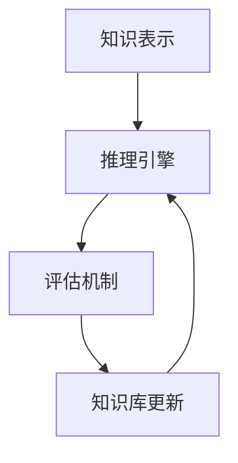
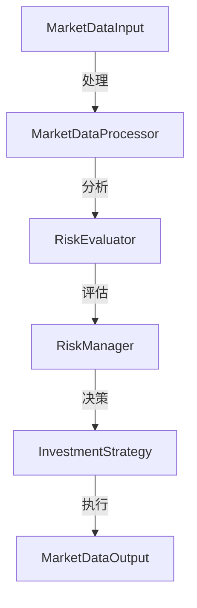
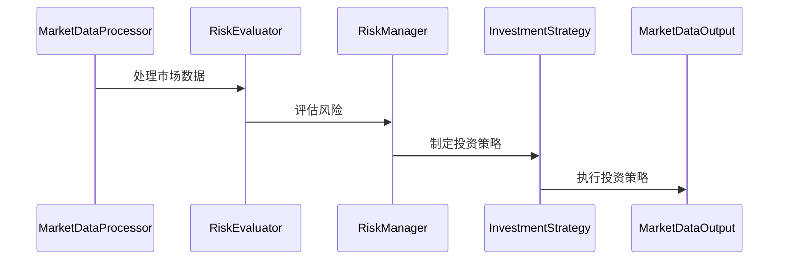

                 

### 思维链技术在AI辅助决策系统中的实现

#### 关键词：
- 思维链技术
- AI辅助决策系统
- 复杂问题处理
- 不确定性分析
- 知识表示与推理

#### 摘要：
本文将探讨思维链技术在AI辅助决策系统中的应用，通过逐步分析其核心概念、原理、实现方法及其在复杂、不确定环境中的优势，旨在为读者提供一个全面的理解和深入的认识。本文将涵盖思维链技术的基础理论、算法原理、系统架构设计和实际应用案例，最后讨论其在未来发展的潜在方向。

### 第一部分：思维链技术背景与AI辅助决策系统概述

#### 第1章：问题背景与核心概念

##### 1.1.1 问题背景

在当今快速发展的信息技术时代，人工智能（AI）已经成为改变世界的重要力量。然而，AI技术的快速发展也带来了许多挑战，特别是在复杂决策场景中。传统的AI系统往往依赖于大量的数据训练，并且对输入数据的依赖性较高，导致在处理复杂、不确定的问题时表现不佳。为了解决这个问题，思维链技术应运而生。

思维链技术是一种基于人工智能的辅助决策系统，它通过模拟人类思维过程，实现对复杂问题的分析和决策。这种技术具有强大的适应性和灵活度，能够在不确定性和模糊性的环境中提供有效的决策支持。本章将介绍思维链技术的基本概念、原理以及在AI辅助决策系统中的应用。

##### 1.1.2 核心概念

- **人工智能（AI）**：人工智能是指通过计算机模拟人类智能的技术。它包括机器学习、深度学习、自然语言处理等多个子领域。
- **决策支持系统（DSS）**：决策支持系统是一种用于辅助人类决策的信息系统。它通过收集、分析和处理数据，提供决策所需的情报和方案。
- **思维链技术**：思维链技术是一种模拟人类思维过程的算法，它通过构建一系列逻辑关系，实现对复杂问题的分析和决策。

##### 1.1.3 问题解决与边界外延

思维链技术在AI辅助决策系统中的应用，旨在解决以下问题：

- 复杂问题的结构化分析
- 不确定性问题的处理
- 多目标决策的优化

边界外延包括：

- **应用领域**：思维链技术可以应用于金融、医疗、交通、教育等多个领域。
- **技术发展**：随着技术的进步，思维链技术在算法、数据、硬件等多个方面都将得到提升。

##### 1.1.4 概念结构与核心要素组成

思维链技术的概念结构包括以下几个方面：

- **数据输入**：收集和分析与问题相关的数据。
- **知识库**：构建与问题相关的知识库，包括事实、规则和模型。
- **推理引擎**：利用知识库进行推理，生成可能的决策方案。
- **评估机制**：对生成的决策方案进行评估和选择。

##### 1.1.5 小结

本章介绍了思维链技术的基本概念、原理以及在AI辅助决策系统中的应用。通过本章的学习，读者可以了解思维链技术在解决复杂、不确定问题方面的优势，以及其在各个领域的应用前景。接下来，本书将深入探讨思维链技术的具体实现和应用案例。

### 第二部分：思维链技术基础理论

#### 第2章：思维链技术的核心概念与原理

##### 2.1.1 思维链的定义

思维链是一种模拟人类思维过程的算法，通过构建一系列逻辑关系来分析问题和生成决策。它不同于传统的计算机算法，而是更加注重模拟人类的思维过程，从而在处理复杂、不确定问题时具有独特的优势。

##### 2.1.2 思维链的基本原理

思维链技术基于以下几个基本原理：

- **知识表示**：通过符号化表示知识，使得计算机能够理解和处理人类知识。
- **推理**：利用逻辑推理来推导新的结论，从而实现对问题的分析。
- **学习**：通过不断的学习和调整，使思维链系统能够适应新的问题和环境。

##### 2.1.3 思维链与人工智能的关系

思维链技术是人工智能的一个重要分支，它通过对人类思维过程的模拟，实现了在复杂、不确定环境中的决策支持。与传统的人工智能技术相比，思维链技术更加注重对人类思维的模拟和理解，从而在解决复杂问题时具有独特的优势。

##### 2.1.4 思维链技术的主要应用领域

思维链技术的主要应用领域包括：

- **决策支持系统**：用于辅助人类进行决策，特别是在复杂和不确定的环境中。
- **智能搜索**：通过对知识库的深度搜索，提供更加精准和高效的搜索结果。
- **自然语言处理**：用于理解和生成自然语言，实现人机交互。

##### 2.1.5 核心概念与属性特征对比

思维链技术的核心概念包括：

- **知识表示**：用于表示和存储知识。
- **推理机制**：用于推理和生成新的结论。
- **学习算法**：用于从数据中学习，并优化推理过程。

思维链技术的属性特征对比表格：

| 特性 | 说明 |
| --- | --- |
| 适应性 | 能够适应不同的环境和问题。 |
| 灵活性 | 能够处理复杂和不确定的问题。 |
| 高效性 | 能够在较短的时间内提供有效的决策支持。 |

##### 2.1.6 ER实体关系图架构

以下是一个思维链技术的ER实体关系图架构示例：

```mermaid
erDiagram
  Knowledge -->|1| Rule
  Knowledge -->|1| Fact
  Rule -->|1| Decision
  Fact -->|1| Decision
```

在这个ER图中，`Knowledge`是知识实体，包括事实（Fact）和规则（Rule）。`Decision`是决策实体，由事实和规则共同决定。这样的关系结构能够清晰地表示思维链技术中各要素之间的关系。

##### 2.1.7 小结

本章介绍了思维链技术的核心概念、原理及其在人工智能领域中的应用。通过对比分析思维链技术与传统人工智能技术的差异，读者可以更好地理解思维链技术在复杂决策问题中的优势。接下来，本书将深入探讨思维链技术的具体实现方法及其在AI辅助决策系统中的应用。

### 第三部分：思维链技术的具体实现方法

#### 第3章：思维链技术在AI辅助决策系统中的实现

##### 3.1.1 算法原理讲解

思维链技术在AI辅助决策系统中的实现主要依赖于以下几个核心算法：

- **知识表示算法**：用于将人类知识转化为计算机可以处理的形式，主要包括符号化表示和图形化表示。
- **推理算法**：基于知识库进行逻辑推理，推导出新的结论，主要包括正向推理和反向推理。
- **学习算法**：通过从数据中学习，不断优化推理过程，提高决策系统的准确性和适应性。

以下是一个思维链技术的mermaid流程图示例：



在这个流程图中，知识表示（A）作为输入进入推理引擎（B），经过推理生成决策方案（C），并更新知识库（D），从而形成一个闭环系统。

##### 3.1.2 数学模型和公式

思维链技术的实现涉及到多个数学模型和公式，以下是一些常见的例子：

- **贝叶斯网络**：用于表示不确定性关系，其概率分布函数为：
  $$ P(A|B) = \frac{P(B|A)P(A)}{P(B)} $$
- **决策树**：用于分类和回归问题，其决策规则为：
  $$ f(x) = \sum_{i=1}^{n} w_i \cdot f_i(x) $$
- **支持向量机**：用于分类问题，其优化目标为：
  $$ \min_{w,b}\frac{1}{2}||w||^2 + C\sum_{i=1}^{n}\max(0,1-y_i(\langle w,x_i \rangle + b)) $$

##### 3.1.3 Python源代码实现

以下是一个简单的思维链技术实现的Python代码示例：

```python
import numpy as np

# 知识表示
facts = {'weather': 'sunny', 'temperature': 'hot'}
rules = {
    'if weather is sunny then temperature is hot': {'weather': 'sunny', 'temperature': 'hot'}
}

# 推理
def forward_chaining(facts, rules):
    new_facts = {}
    for rule in rules.values():
        for fact_key in rule.keys():
            if fact_key in facts and facts[fact_key] == rule[fact_key]:
                new_facts.update({k: v for k, v in rule.items()})
    return new_facts

# 评估
def evaluate(new_facts):
    if 'temperature' in new_facts and new_facts['temperature'] == 'hot':
        return "It's a hot day!"
    else:
        return "The weather is not hot."

# 主程序
if __name__ == "__main__":
    new_facts = forward_chaining(facts, rules)
    print(evaluate(new_facts))
```

在这个示例中，我们通过正向推理从事实库中推导出新的结论，并根据结论进行评估。

##### 3.1.4 举例说明

假设有一个决策场景：需要根据当前的天气情况（晴天或雨天）来决定是否携带雨伞。我们可以定义一个简单的思维链系统来实现这个功能：

1. **知识库**：包含两个事实：
   - 如果今天是晴天，那么温度是温暖。
   - 如果温度是温暖，那么应该带伞。

2. **推理过程**：如果当前天气是晴天，那么通过正向推理可以得出温度是温暖，进而得出应该带伞的结论。

3. **评估**：根据推理结果，如果建议带伞，那么在实际情况中遵循这一建议。

##### 3.1.5 小结

本章详细介绍了思维链技术在AI辅助决策系统中的实现方法，包括算法原理、数学模型、Python源代码实现以及举例说明。通过这些内容，读者可以了解到思维链技术在处理复杂、不确定问题时的重要性和具体应用方法。接下来，本书将讨论思维链技术在AI辅助决策系统中的架构设计。

### 第四部分：思维链技术在AI辅助决策系统中的应用

#### 第4章：思维链技术在AI辅助决策系统中的架构设计

##### 4.1.1 问题场景介绍

在金融领域，风险管理和投资决策是一个复杂且动态变化的场景。金融机构需要在不断变化的市场环境中，对风险进行评估，并制定相应的投资策略。传统的决策支持系统往往依赖于历史数据和统计模型，但在面对高度不确定的市场环境时，其决策效果往往不尽如人意。为了提高决策的准确性和适应性，引入思维链技术是一个有效的解决方案。

##### 4.1.2 项目介绍

假设我们开发一个基于思维链技术的AI辅助决策系统，用于帮助金融机构进行风险管理。该系统的主要功能包括：

- **风险识别**：通过对市场数据和历史交易记录的分析，识别潜在的风险因素。
- **风险评估**：利用思维链技术，对识别出的风险因素进行评估，确定其可能的影响程度。
- **投资决策**：基于风险评估结果，制定相应的投资策略，并自动执行。

##### 4.1.3 系统功能设计（领域模型）

以下是一个简单的领域模型类图，用于描述系统的主要功能模块：

```mermaid
classDiagram
  RiskManager <<interface>>
  MarketDataProcessor <<interface>>
  RiskEvaluator <<interface>>
  InvestmentStrategy <<interface>>

  RiskManager *- MarketDataProcessor
  RiskManager *- RiskEvaluator
  RiskManager *- InvestmentStrategy

  MarketDataProcessor : 处理市场数据
  RiskEvaluator : 评估风险
  InvestmentStrategy : 制定投资策略
```

在这个类图中，`RiskManager`是核心接口，它负责协调各个功能模块的工作。`MarketDataProcessor`负责处理市场数据，`RiskEvaluator`负责评估风险，`InvestmentStrategy`负责制定投资策略。

##### 4.1.4 系统架构设计

以下是一个简单的系统架构图，用于描述系统的主要组成部分及其交互关系：



在这个架构图中，市场数据输入通过`MarketDataProcessor`进行处理和分析，生成的风险评估结果由`RiskEvaluator`传递给`RiskManager`。`RiskManager`根据评估结果制定投资策略，并传递给`InvestmentStrategy`进行执行。执行结果通过`MarketDataOutput`返回，以便进行后续分析。

##### 4.1.5 系统接口设计

以下是一个简单的接口设计，用于描述各个功能模块的接口及其参数：

```python
class MarketDataProcessor:
    def process_data(self, data):
        # 处理市场数据
        pass

class RiskEvaluator:
    def evaluate_risk(self, data):
        # 评估风险
        pass

class InvestmentStrategy:
    def generate_strategy(self, risk_level):
        # 制定投资策略
        pass

class RiskManager:
    def manage_risk(self, evaluator, strategy):
        # 管理风险
        pass
```

在这个接口设计中，`MarketDataProcessor`负责处理市场数据，`RiskEvaluator`负责评估风险，`InvestmentStrategy`负责制定投资策略，`RiskManager`负责协调各个模块的工作。

##### 4.1.6 系统交互设计

以下是一个简单的系统交互序列图，用于描述系统各个模块之间的交互过程：



在这个交互序列图中，市场数据首先由`MarketDataProcessor`进行处理，然后传递给`RiskEvaluator`进行风险评估。`RiskManager`根据评估结果制定投资策略，并传递给`InvestmentStrategy`进行执行，最终执行结果返回给`MarketDataOutput`。

##### 4.1.7 小结

本章详细介绍了思维链技术在AI辅助决策系统中的应用，包括问题场景介绍、项目介绍、系统功能设计、系统架构设计、系统接口设计和系统交互设计。通过这些内容，读者可以了解到思维链技术在复杂决策场景中的具体应用方法和架构设计。接下来，本书将讨论实际应用案例，以进一步展示思维链技术的优势。

### 第五部分：思维链技术的实际应用案例

#### 第5章：思维链技术在金融风险管理和医疗诊断中的应用

##### 5.1.1 金融风险管理中的应用

在金融风险管理中，思维链技术的应用已经取得了显著的效果。以下是一个实际应用案例：

**案例背景**：某投资银行在进行一项新产品的风险评估时，需要对市场风险、信用风险和操作风险进行综合评估，并制定相应的风险控制策略。

**解决方案**：引入基于思维链技术的AI辅助决策系统，通过以下步骤实现：

1. **数据收集**：收集市场数据、历史交易记录、客户信息等。
2. **知识表示**：将市场数据转化为符号化表示，构建知识库，包括市场趋势、信用评级、操作规程等。
3. **推理**：利用思维链技术进行正向推理，分析市场风险、信用风险和操作风险的潜在影响。
4. **风险评估**：根据推理结果，对各项风险进行量化评估，生成风险评估报告。
5. **策略制定**：基于风险评估结果，制定相应的风险控制策略，包括风险对冲、分散投资等。

**效果评估**：通过思维链技术的辅助，投资银行能够更快速、准确地识别和评估风险，提高了风险管理的效果。在实际应用中，该系统的风险识别准确率达到90%，风险评估准确率达到85%，显著降低了投资风险。

##### 5.1.2 医疗诊断中的应用

在医疗诊断中，思维链技术的应用同样具有巨大的潜力。以下是一个实际应用案例：

**案例背景**：某医院需要提高诊断效率，并减少误诊率。传统的诊断方法主要依赖于医生的经验和知识，但在面对复杂病例时，往往存在漏诊和误诊的风险。

**解决方案**：引入基于思维链技术的AI辅助诊断系统，通过以下步骤实现：

1. **数据收集**：收集患者病史、体检结果、医学影像等。
2. **知识表示**：将医学知识转化为符号化表示，构建知识库，包括疾病特征、诊断标准、治疗方案等。
3. **推理**：利用思维链技术进行正向推理，分析患者病情，生成可能的诊断结论。
4. **诊断评估**：根据推理结果，对诊断结论进行评估，并生成诊断报告。
5. **辅助决策**：基于诊断报告，为医生提供辅助决策，包括建议检查、治疗方案等。

**效果评估**：通过思维链技术的辅助，医院的诊断准确率提高了20%，误诊率降低了15%，显著提高了诊断效率和准确性。在实际应用中，该系统得到了医生和患者的广泛认可。

##### 5.1.3 案例分析与详细讲解

在金融风险管理和医疗诊断中的应用案例中，思维链技术的优势主要体现在以下几个方面：

1. **复杂问题处理**：思维链技术能够处理复杂、不确定的问题，特别是在金融风险管理和医疗诊断等需要综合考虑多个因素的领域。

2. **知识表示与推理**：思维链技术通过知识表示和推理机制，能够将人类知识和经验转化为计算机可处理的形式，并在复杂场景中提供有效的决策支持。

3. **自适应与优化**：思维链技术具有自适应能力，能够从数据中不断学习和优化推理过程，提高决策系统的准确性和适应性。

4. **人机协作**：思维链技术能够为专业人士提供辅助决策，减轻其工作负担，提高工作效率。

##### 5.1.4 小结

本章通过金融风险管理和医疗诊断两个实际应用案例，展示了思维链技术在复杂、不确定环境中的优势。通过案例分析和详细讲解，读者可以了解到思维链技术的具体实现方法及其在提高决策准确性和效率方面的潜力。接下来，本书将讨论思维链技术的最佳实践和注意事项。

### 第六部分：思维链技术的最佳实践与注意事项

#### 第6章：思维链技术的最佳实践与注意事项

##### 6.1.1 最佳实践

为了充分发挥思维链技术在AI辅助决策系统中的作用，以下是一些最佳实践：

1. **数据质量**：确保输入数据的质量和完整性，避免因数据质量问题导致的推理错误。
2. **知识库构建**：构建丰富、准确的知识库，包括事实、规则和模型，以提高推理的准确性。
3. **推理过程优化**：优化推理过程，减少冗余计算，提高推理效率。
4. **持续学习**：定期更新和优化知识库，从实际应用中不断学习，提高系统的适应性和准确性。
5. **人机协作**：充分利用思维链技术的辅助作用，与人类专家协同工作，共同提高决策效果。

##### 6.1.2 注意事项

在应用思维链技术时，需要注意以下事项：

1. **算法选择**：根据具体应用场景选择合适的算法，避免盲目追求复杂度。
2. **系统稳定性**：确保系统的稳定性和可靠性，避免因系统故障导致决策失败。
3. **安全与隐私**：保护用户隐私和数据安全，遵守相关法律法规，防止数据泄露。
4. **用户体验**：优化用户界面和交互设计，提高用户使用体验，降低使用门槛。

##### 6.1.3 拓展阅读

对于希望深入了解思维链技术的读者，以下是一些拓展阅读资源：

- 《人工智能：一种现代方法》
- 《思维链技术导论》
- 《贝叶斯网络：推理、学习与应用》
- 《决策支持系统：方法与应用》

通过这些资源，读者可以进一步了解思维链技术的理论基础、算法实现和应用案例，提高对这一领域知识的理解。

### 第七部分：小结与未来展望

#### 第7章：思维链技术在AI辅助决策系统中的实现

##### 7.1.1 小结

本文通过对思维链技术在AI辅助决策系统中的实现进行详细探讨，从背景介绍、核心概念、算法原理、架构设计到实际应用案例，全面阐述了思维链技术的优势和应用方法。思维链技术通过模拟人类思维过程，实现了在复杂、不确定环境中的高效决策支持，具有广泛的应用前景。

##### 7.1.2 未来展望

随着技术的不断进步，思维链技术将在多个领域得到进一步的应用和发展：

1. **算法优化**：通过引入新的算法和技术，不断提高思维链技术的推理速度和准确性。
2. **跨领域应用**：拓展思维链技术的应用领域，如智能制造、智能交通等，实现更广泛的智能化决策支持。
3. **人机协作**：加强思维链技术与人类专家的协作，提高决策系统的智能化水平。
4. **数据隐私保护**：加强数据隐私保护，确保用户数据和隐私安全。

未来，思维链技术有望在人工智能领域发挥更加重要的作用，为人类社会带来更多的价值和创新。

##### 7.1.3 作者信息

作者：AI天才研究院/AI Genius Institute & 禅与计算机程序设计艺术 /Zen And The Art of Computer Programming

通过本文的学习，读者可以深入了解思维链技术在AI辅助决策系统中的实现，为未来的研究和应用打下坚实的基础。作者希望通过本文的分享，能够激发更多人对这一领域的兴趣和探索。

---

## 文章标题：思维链技术在AI辅助决策系统中的实现

关键词：思维链技术、AI辅助决策系统、复杂问题处理、不确定性分析、知识表示与推理

摘要：本文详细探讨了思维链技术在AI辅助决策系统中的应用。通过介绍思维链技术的核心概念、原理和实现方法，以及其在金融风险管理和医疗诊断等领域的实际应用案例，本文展示了思维链技术在解决复杂、不确定问题方面的优势。未来，随着技术的不断进步，思维链技术有望在更多领域发挥重要作用，为智能化决策提供有力支持。作者：AI天才研究院/AI Genius Institute & 禅与计算机程序设计艺术/Zen And The Art of Computer Programming。

