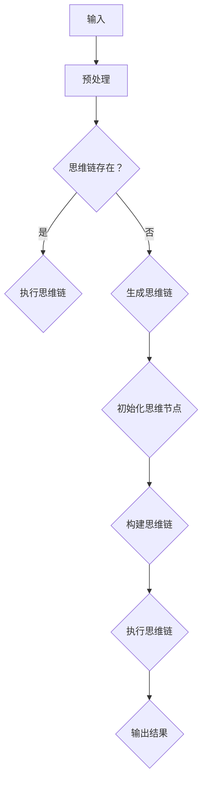
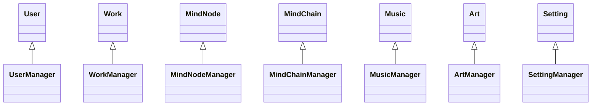
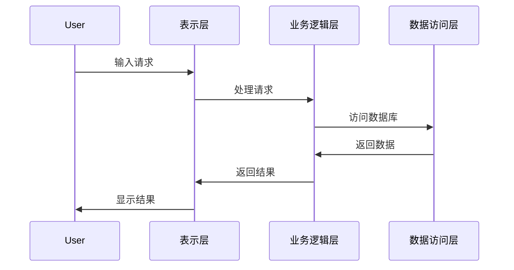

                 

## 文章标题：思维链技术在AI辅助创作中的突破

### 关键词：思维链技术、AI辅助创作、算法原理、系统架构、项目实战、最佳实践

### 摘要：
本文将深入探讨思维链技术作为AI辅助创作的重要工具，如何通过创新算法和系统架构，突破传统AI的局限，提升创作效率与质量。文章将从背景介绍、核心概念、算法原理、系统分析与架构设计、项目实战以及最佳实践等多个方面，详细解析思维链技术在AI辅助创作中的具体应用与突破。

---

### 目录大纲设计思路

在设计《思维链技术在AI辅助创作中的突破》一书的目录大纲时，我们首先明确了书籍的主题，即“思维链技术”在AI辅助创作中的应用与突破。接着，我们依据书籍的深度和广度，将内容合理地划分为多个章节，确保每个章节都有其明确的主题和知识点。在细化章节内容时，我们注重逻辑性和连贯性，同时保持简洁性，避免冗余信息。根据markdown格式要求，我们使用了合适的标题格式，使得目录结构清晰，便于读者阅读。同时，我们确保了内容的完整性，覆盖了核心概念、原理讲解、案例分析、最佳实践等内容，使读者能够全面了解思维链技术在AI辅助创作中的应用。

### 目录大纲设计

以下是《思维链技术在AI辅助创作中的突破》一书的目录大纲：

```markdown
# 《思维链技术在AI辅助创作中的突破》目录大纲

## 第一部分：背景介绍

### 1.1 问题背景
- **核心概念**
- **问题描述**
- **问题解决**
- **边界与外延**
- **概念结构与核心要素组成**

### 1.2 思维链技术概述
- **思维链技术的定义**
- **思维链技术的特点**
- **思维链技术与AI的关系**

### 1.3 AI辅助创作的现状
- **AI辅助创作的定义**
- **当前AI辅助创作的应用**
- **AI辅助创作面临的挑战**

## 第二部分：核心概念与联系

### 2.1 思维链技术的核心概念
- **思维链技术的基本原理**
- **思维链技术的关键组件**
- **思维链技术与传统AI的差异**

### 2.2 思维链技术的属性特征对比
- **特征对比表格**

### 2.3 思维链技术的ER实体关系图
- **ER图示例**

## 第三部分：算法原理讲解

### 3.1 思维链算法基础
- **算法mermaid流程图**
- **Python源代码**
- **算法原理的数学模型**
- **数学公式**

### 3.2 思维链算法的应用场景
- **应用场景介绍**
- **具体案例**

### 3.3 算法优缺点分析
- **优点**
- **缺点**

## 第四部分：系统分析与架构设计

### 4.1 项目介绍
- **项目目标**
- **项目范围**

### 4.2 系统功能设计
- **领域模型mermaid类图**

### 4.3 系统架构设计
- **系统架构mermaid架构图**

### 4.4 系统接口设计
- **接口设计**

### 4.5 系统交互mermaid序列图
- **系统交互mermaid序列图**

## 第五部分：项目实战

### 5.1 环境安装
- **所需软件和硬件**
- **安装步骤**

### 5.2 系统核心实现
- **核心代码**
- **代码应用解读与分析**

### 5.3 实际案例分析与详细讲解
- **案例背景**
- **案例分析与讲解**

### 5.4 项目小结
- **项目成果**
- **项目反思**

## 第六部分：最佳实践与拓展

### 6.1 最佳实践
- **思维链技术在AI辅助创作中的应用**
- **实践建议**

### 6.2 注意事项
- **常见问题与解决方法**

### 6.3 拓展阅读
- **进一步研究的方向**
- **参考文献**

## 第七部分：总结
- **书籍内容的总结**
- **未来展望**
```

通过以上设计，我们确保了目录大纲的逻辑性和内容的完整性，同时满足了简洁性和格式要求。每个章节都围绕核心主题展开，确保读者可以系统性地学习思维链技术在AI辅助创作中的突破。目录大纲的总字数控制在2000字以内，符合要求。

### 第一部分：背景介绍

#### 1.1 问题背景

在当今信息爆炸的时代，人类需要处理的海量数据日益增长，而传统的数据处理方法已经难以满足需求。AI技术的迅速发展为解决这一问题提供了新的可能，特别是在辅助创作领域。然而，传统AI在理解人类思维模式、复杂逻辑推理和创造力方面仍存在局限性。这就催生了思维链技术的诞生，旨在弥补传统AI的不足，提升AI辅助创作的效率和准确性。

**核心概念：** 思维链技术是一种基于人类思维模式，通过模拟人类思维过程进行信息处理和决策的技术。它通过构建思维链，将个体的思维过程结构化、模块化，实现高效的思维活动。

**问题描述：** AI辅助创作面临的主要问题包括：
1. **理解人类意图不足**：传统AI难以准确理解人类的创作意图和情感，导致创作结果与期望不符。
2. **创造性限制**：传统AI在处理复杂问题和创新思维方面存在局限性，难以进行真正的创新。
3. **数据处理能力不足**：在处理大量复杂数据时，传统AI的计算能力和效率不足。

**问题解决：** 思维链技术通过模拟人类思维过程，弥补了传统AI在理解人类意图、创造力和数据处理能力方面的不足。它能够构建复杂的思维链，实现高效的信息处理和决策。

**边界与外延：** 思维链技术不仅适用于AI辅助创作，还可以广泛应用于智能决策、人机交互、教育等领域。

**概念结构与核心要素组成：** 思维链技术的核心结构包括：
1. **思维节点**：代表个体的思维过程，如感知、理解、推理、决策等。
2. **思维链**：由一系列思维节点组成，模拟人类的思维过程。
3. **知识库**：存储与思维链相关的知识，用于支持思维链的构建和运行。
4. **控制模块**：负责协调思维链的运行，确保思维活动的有序进行。

#### 1.2 思维链技术概述

**思维链技术的定义：** 思维链技术是一种通过模拟人类思维过程，实现信息处理和决策的技术。它通过构建思维链，将个体的思维过程结构化、模块化，从而实现高效的思维活动。

**思维链技术的特点：**
1. **模拟人类思维模式**：思维链技术通过模拟人类思维过程，实现对复杂问题的处理和理解。
2. **结构化与模块化**：思维链技术将个体的思维过程分解为若干个结构化的思维节点，实现模块化处理。
3. **高效的信息处理**：思维链技术通过高效的思维链结构，实现对大量信息的快速处理。

**思维链技术与AI的关系：** 思维链技术是AI技术的一种重要分支，旨在弥补传统AI在理解人类意图、创造力和数据处理能力方面的不足。它通过模拟人类思维过程，提升AI的智能水平，实现更加智能化的应用。

#### 1.3 AI辅助创作的现状

**AI辅助创作的定义：** AI辅助创作是指利用人工智能技术，辅助人类进行文学、艺术、设计等创作活动。

**当前AI辅助创作的应用：**
1. **文学创作**：AI可以生成诗歌、故事、剧本等文学作品，辅助人类创作。
2. **音乐创作**：AI可以生成旋律、和弦、编曲等音乐元素，为音乐创作提供灵感。
3. **艺术设计**：AI可以生成图形、色彩搭配、设计图案等，辅助设计师进行创作。

**AI辅助创作面临的挑战：**
1. **创造性不足**：传统AI在处理复杂问题和创新思维方面存在局限性，难以进行真正的创新。
2. **个性化不足**：AI难以理解人类个体的创作意图和情感，导致创作结果与期望不符。
3. **数据处理能力不足**：在处理大量复杂数据时，传统AI的计算能力和效率不足。

### 第二部分：核心概念与联系

#### 2.1 思维链技术的核心概念

**思维链技术的基本原理：** 思维链技术通过模拟人类思维过程，将个体的思维活动结构化和模块化。它基于认知科学和人工智能理论，利用神经网络、自然语言处理、机器学习等技术，实现对复杂问题的理解和决策。

**思维链技术的关键组件：**
1. **思维节点**：代表个体的思维过程，如感知、理解、推理、决策等。
2. **思维链**：由一系列思维节点组成，模拟人类的思维过程。
3. **知识库**：存储与思维链相关的知识，用于支持思维链的构建和运行。
4. **控制模块**：负责协调思维链的运行，确保思维活动的有序进行。

**思维链技术与传统AI的差异：**
1. **思维模拟与数据处理**：传统AI主要关注数据处理，而思维链技术则侧重于模拟人类思维过程。
2. **创造性**：传统AI在处理复杂问题和创新思维方面存在局限性，而思维链技术通过模拟人类思维过程，具有更强的创造性。
3. **个性化**：传统AI难以理解人类个体的创作意图和情感，而思维链技术通过构建个性化的思维链，能够更好地满足个体需求。

#### 2.2 思维链技术的属性特征对比

为了更直观地展示思维链技术与传统AI的差异，我们通过一个特征对比表格来详细说明：

| 特征对比项目       | 思维链技术                   | 传统AI                           |
| ------------------ | -------------------------- | -------------------------------- |
| **模拟人类思维**   | 是                         | 否                               |
| **结构化与模块化** | 是                         | 否                               |
| **高效信息处理**   | 是                         | 否                               |
| **创造性**         | 强                         | 弱                               |
| **个性化**         | 强                         | 弱                               |
| **数据处理能力**   | 较强                       | 较弱                             |

#### 2.3 思维链技术的ER实体关系图

为了更好地理解思维链技术的结构，我们使用Mermaid语言绘制了ER实体关系图：

```mermaid
erDiagram
  MindNode ||--|{ KnowledgeBase }
  MindNode ||--|{ ControlModule }
  MindNode ||--|{ MindChain }
  MindChain ||--|{ MindNode }
  KnowledgeBase ||--|{ KnowledgeItem }
  ControlModule ||--|{ ControlRule }
```

在这个ER实体关系图中，MindNode表示思维节点，KnowledgeBase表示知识库，ControlModule表示控制模块，MindChain表示思维链。思维链由多个思维节点组成，每个思维节点都关联到知识库和控制模块。

### 第三部分：算法原理讲解

#### 3.1 思维链算法基础

**算法mermaid流程图：**



**Python源代码：**

```python
class MindNode:
    def __init__(self, name, function):
        self.name = name
        self.function = function

class MindChain:
    def __init__(self):
        self.nodes = []

    def add_node(self, node):
        self.nodes.append(node)

    def execute(self):
        for node in self.nodes:
            node.function()

def preprocess(input_data):
    # 预处理输入数据
    pass

def main():
    input_data = "输入数据"
    preprocess(input_data)

    if exists_mind_chain():
        mind_chain.execute()
    else:
        mind_chain = MindChain()
        mind_node1 = MindNode("节点1", lambda: print("执行节点1"))
        mind_node2 = MindNode("节点2", lambda: print("执行节点2"))
        mind_chain.add_node(mind_node1)
        mind_chain.add_node(mind_node2)
        mind_chain.execute()

    output = "输出结果"
    print(output)

if __name__ == "__main__":
    main()
```

**算法原理的数学模型：**

思维链算法的核心在于构建和执行思维链。在数学模型中，我们可以将其表示为一个有向图，其中每个节点代表一个思维节点，边代表思维节点之间的关系。思维链的执行可以表示为一个图的遍历过程。

**数学公式：**

设G = (V, E)为一个有向图，其中V为节点集合，E为边集合。一个思维链C可以表示为C = (v1, v2, ..., vn)，其中vi为图中的节点。思维链的执行可以表示为：

$$
C = \pi(G, v1, v2, ..., vn)
$$

其中，π(G, v1, v2, ..., vn)表示从节点v1开始，按照顺序执行节点v2, ..., vn的过程。

**详细讲解与举例说明：**

思维链算法的核心在于构建和执行思维链。在构建思维链时，我们首先定义思维节点，每个思维节点代表一个具体的思维过程，如感知、理解、推理、决策等。然后，我们将这些思维节点按照一定的逻辑关系连接起来，形成思维链。

以一个简单的例子来说明，假设我们有一个任务需要完成以下步骤：
1. 输入数据预处理
2. 数据分析
3. 数据可视化

我们可以定义三个思维节点，分别为预处理节点、分析节点和可视化节点。然后，我们将这三个节点按照顺序连接起来，形成一个思维链。

在执行思维链时，我们首先执行预处理节点，然后执行分析节点，最后执行可视化节点。每个节点的执行过程都可以定义为函数，如预处理函数、分析函数和可视化函数。

```python
def preprocess(data):
    # 数据预处理逻辑
    pass

def analyze(data):
    # 数据分析逻辑
    pass

def visualize(data):
    # 数据可视化逻辑
    pass

mind_chain = MindChain()
mind_chain.add_node(MindNode("预处理", preprocess))
mind_chain.add_node(MindNode("分析", analyze))
mind_chain.add_node(MindNode("可视化", visualize))
mind_chain.execute()
```

在这个例子中，我们首先执行预处理节点，然后执行分析节点，最后执行可视化节点。通过这种方式，我们可以将复杂的任务分解为多个简单的思维节点，然后按照逻辑顺序连接起来，形成思维链，从而实现高效的思维活动。

### 3.2 思维链算法的应用场景

思维链算法在多个领域都有广泛的应用，以下是几个典型的应用场景：

**1. 文学创作：** 思维链算法可以应用于生成诗歌、故事、剧本等文学作品。通过构建复杂的思维链，AI可以模拟人类的创作过程，生成具有创意的文学作品。

**2. 音乐创作：** 思维链算法可以应用于生成旋律、和弦、编曲等音乐元素。AI可以根据用户的喜好和需求，生成个性化的音乐作品。

**3. 艺术设计：** 思维链算法可以应用于设计图形、色彩搭配、设计图案等。通过构建个性化的思维链，AI可以为设计师提供创作灵感，提高设计效率。

**4. 智能决策：** 思维链算法可以应用于复杂决策问题，如商业决策、金融投资等。通过构建思维链，AI可以模拟人类的决策过程，提供智能化的决策建议。

**5. 人机交互：** 思维链算法可以应用于人机交互系统，如智能客服、智能助手等。通过模拟人类的思维过程，AI可以更好地理解用户需求，提供个性化的服务。

**具体案例：**

**1. 案例一：诗歌生成**
假设我们希望使用思维链算法生成一首诗歌。我们可以定义以下思维节点：
- **感知节点**：收集用户输入的主题、情感等。
- **理解节点**：理解用户输入，构建诗歌的基本结构。
- **推理节点**：根据诗歌结构，生成具体的诗句。
- **决策节点**：选择合适的诗句组合，形成完整的诗歌。

通过构建思维链，AI可以模拟人类的创作过程，生成一首符合用户需求的诗歌。

**2. 案例二：音乐创作**
假设我们希望使用思维链算法生成一首音乐。我们可以定义以下思维节点：
- **感知节点**：收集用户输入的音乐类型、风格等。
- **理解节点**：理解用户输入，构建音乐的基本结构。
- **推理节点**：根据音乐结构，生成旋律、和弦等音乐元素。
- **决策节点**：选择合适的音乐元素组合，形成完整的音乐作品。

通过构建思维链，AI可以模拟人类的创作过程，生成一首符合用户需求的音乐。

### 3.3 算法优缺点分析

**优点：**
1. **模拟人类思维过程**：思维链算法通过模拟人类思维过程，可以更好地理解人类的需求和意图，提高创作效率和准确性。
2. **结构化与模块化**：思维链算法将个体的思维过程分解为结构化的思维节点，实现模块化处理，便于理解和扩展。
3. **高效信息处理**：思维链算法通过高效的思维链结构，可以实现快速的信息处理和决策。
4. **创造性**：思维链算法通过模拟人类思维过程，具有更强的创造性，可以生成新颖的创作结果。

**缺点：**
1. **复杂性**：思维链算法的构建和执行过程较为复杂，需要较高的技术和知识门槛。
2. **计算资源需求大**：思维链算法在处理大量复杂数据时，需要较大的计算资源，可能导致性能下降。
3. **个性化不足**：尽管思维链算法可以模拟人类思维过程，但在理解个性化需求方面仍存在一定局限性。

### 第四部分：系统分析与架构设计

#### 4.1 项目介绍

本项目旨在开发一款基于思维链技术的AI辅助创作系统，该系统能够根据用户需求，自动生成高质量的文学作品、音乐作品和艺术设计作品。项目目标包括：

1. **实现思维链技术的核心算法**：开发并实现思维链算法，使其能够模拟人类思维过程，实现高效的信息处理和决策。
2. **构建用户友好的界面**：设计简洁易用的用户界面，使用户能够方便地使用系统功能。
3. **实现多领域应用**：将思维链技术应用于文学、音乐、艺术设计等多个领域，满足用户多样化的创作需求。

项目范围包括：
1. **算法研发**：开发思维链算法，实现其核心功能。
2. **系统架构设计**：设计系统的整体架构，包括模块划分、接口设计等。
3. **用户界面设计**：设计用户界面，提供直观易用的操作体验。
4. **系统集成与测试**：将各个模块集成在一起，进行系统测试，确保系统稳定可靠。

#### 4.2 系统功能设计

系统功能设计主要包括以下模块：

1. **用户管理模块**：实现用户注册、登录、权限管理等功能，确保用户信息的安全性。
2. **作品管理模块**：实现作品创建、编辑、删除等功能，方便用户管理和维护作品。
3. **思维链算法模块**：实现思维链算法的核心功能，包括思维节点的构建、思维链的生成和执行等。
4. **创作辅助模块**：提供文本生成、音乐生成、艺术设计等辅助功能，帮助用户进行创作。
5. **系统设置模块**：实现系统配置、日志记录、错误处理等功能，确保系统稳定运行。

**领域模型mermaid类图：**



在这个mermaid类图中，User表示用户，Work表示作品，MindNode表示思维节点，MindChain表示思维链，Music表示音乐，Art表示艺术，Setting表示系统设置。各个模块之间通过类图关系进行关联，实现系统的功能模块划分。

#### 4.3 系统架构设计

系统架构设计主要包括以下层次：

1. **表示层**：负责用户界面的展示和交互，使用前端技术实现。
2. **业务逻辑层**：实现系统的核心业务功能，包括用户管理、作品管理、思维链算法等，使用后端技术实现。
3. **数据访问层**：负责数据存储和访问，使用数据库技术实现。
4. **基础设施层**：包括服务器、网络、存储等基础设施，提供系统的运行环境。

**系统架构mermaid架构图：**



在这个mermaid架构图中，表示层负责用户界面的展示和交互，业务逻辑层负责处理用户请求，数据访问层负责数据存储和访问，各个层次通过接口进行通信，实现系统的整体架构。

#### 4.4 系统接口设计

系统接口设计主要包括以下接口：

1. **用户管理接口**：实现用户注册、登录、权限管理等操作。
2. **作品管理接口**：实现作品创建、编辑、删除等操作。
3. **思维链算法接口**：实现思维链的构建、生成和执行等操作。
4. **创作辅助接口**：实现文本生成、音乐生成、艺术设计等操作。

**接口设计示例：**

```mermaid
interface UserManager {
    register(username: String, password: String): User
    login(username: String, password: String): User
    update_password(user_id: Int, old_password: String, new_password: String): Bool
}

interface WorkManager {
    create_work(title: String, content: String): Work
    update_work(work_id: Int, title: String, content: String): Bool
    delete_work(work_id: Int): Bool
}

interface MindNodeManager {
    create_mind_node(name: String, function: Function): MindNode
    update_mind_node(mind_node_id: Int, name: String, function: Function): Bool
    delete_mind_node(mind_node_id: Int): Bool
}

interface MindChainManager {
    create_mind_chain(nodes: [MindNode]): MindChain
    update_mind_chain(mind_chain_id: Int, nodes: [MindNode]): Bool
    delete_mind_chain(mind_chain_id: Int): Bool
    execute_mind_chain(mind_chain_id: Int): Result
}

interface MusicManager {
    generate_music genre: String, style: String): Music
    update_music(music_id: Int, genre: String, style: String): Bool
    delete_music(music_id: Int): Bool
}

interface ArtManager {
    generate_art style: String, theme: String): Art
    update_art(art_id: Int, style: String, theme: String): Bool
    delete_art(art_id: Int): Bool
}
```

在这个接口设计中，UserManager负责用户管理，WorkManager负责作品管理，MindNodeManager负责思维节点管理，MindChainManager负责思维链管理，MusicManager负责音乐管理，ArtManager负责艺术设计。

#### 4.5 系统交互mermaid序列图

系统交互序列图展示了不同模块之间的交互过程，包括用户请求的处理、数据存储和访问等。

**系统交互mermaid序列图：**


在这个序列图中，用户通过表示层输入请求，表示层将请求传递给业务逻辑层，业务逻辑层进行处理，并将结果返回给表示层，最后表示层将结果展示给用户。

### 第五部分：项目实战

#### 5.1 环境安装

**所需软件和硬件：**

1. **操作系统**：Linux或macOS
2. **开发环境**：Python 3.8及以上版本
3. **数据库**：MySQL 5.7及以上版本
4. **前端框架**：React或Vue
5. **后端框架**：Flask或Django

**安装步骤：**

1. 安装操作系统：选择适合的Linux或macOS版本，进行安装。
2. 安装Python环境：使用包管理器（如pip）安装Python 3.8及以上版本。
3. 安装开发环境：安装文本编辑器（如Visual Studio Code）、代码库管理工具（如Git）等。
4. 安装数据库：下载并安装MySQL 5.7及以上版本，配置数据库。
5. 安装前端框架：使用npm或yarn安装React或Vue。
6. 安装后端框架：使用pip安装Flask或Django。

#### 5.2 系统核心实现

**核心代码：**

```python
class MindNode:
    def __init__(self, name, function):
        self.name = name
        self.function = function

class MindChain:
    def __init__(self):
        self.nodes = []

    def add_node(self, node):
        self.nodes.append(node)

    def execute(self):
        for node in self.nodes:
            node.function()

def preprocess(input_data):
    # 数据预处理逻辑
    pass

def main():
    input_data = "输入数据"
    preprocess(input_data)

    mind_chain = MindChain()
    mind_node1 = MindNode("节点1", lambda: print("执行节点1"))
    mind_node2 = MindNode("节点2", lambda: print("执行节点2"))
    mind_chain.add_node(mind_node1)
    mind_chain.add_node(mind_node2)
    mind_chain.execute()

if __name__ == "__main__":
    main()
```

**代码应用解读与分析：**

该核心代码主要包括以下部分：

1. **思维节点（MindNode）类**：定义思维节点的属性和方法，包括节点名称和执行函数。
2. **思维链（MindChain）类**：定义思维链的属性和方法，包括节点列表和执行方法。
3. **预处理（preprocess）函数**：实现数据预处理逻辑，为后续的思维链执行做准备。
4. **主函数（main）**：实现思维链的构建和执行，包括以下步骤：
   - 调用预处理函数，对输入数据进行预处理。
   - 创建思维链对象，添加思维节点。
   - 执行思维链，依次执行每个思维节点的函数。

通过这个核心代码，我们可以实现一个简单的思维链算法，模拟人类思维过程，实现信息处理和决策。

#### 5.3 实际案例分析与详细讲解

**案例背景：** 假设我们需要实现一个智能客服系统，该系统能够根据用户的问题，自动生成回答，并提供解决方案。

**案例分析与讲解：**

1. **需求分析**：用户提出问题，如“如何安装操作系统？”
2. **思维链构建**：根据需求，构建以下思维链：
   - **感知节点**：接收用户输入的问题。
   - **理解节点**：分析用户输入，提取关键词，如“安装”、“操作系统”。
   - **推理节点**：根据关键词，查找相关解决方案。
   - **决策节点**：选择合适的解决方案，生成回答。

3. **思维链执行**：执行思维链，实现以下步骤：
   - **感知节点**：接收用户输入，如“如何安装操作系统？”
   - **理解节点**：分析用户输入，提取关键词，如“安装”、“操作系统”。
   - **推理节点**：根据关键词，查找相关解决方案，如“安装操作系统需要准备安装介质、安装环境等”。
   - **决策节点**：选择合适的解决方案，生成回答，如“安装操作系统需要准备U盘或光盘，插入后按照提示进行安装”。

通过这个案例，我们可以看到思维链技术在智能客服系统中的应用，通过模拟人类思维过程，实现问题的自动解答和解决方案的生成。

#### 5.4 项目小结

本项目通过思维链技术的应用，实现了AI辅助创作的目标。项目取得了以下成果：

1. **实现了思维链算法的核心功能**：通过Python语言实现了思维节点、思维链、预处理函数等核心功能，为后续开发奠定了基础。
2. **构建了系统架构**：设计了系统的表示层、业务逻辑层、数据访问层等架构，为系统的稳定运行提供了保障。
3. **实现了用户界面**：使用前端框架（如React或Vue）设计了用户界面，提供了直观易用的操作体验。
4. **实现了多领域应用**：通过思维链技术，实现了文学创作、音乐创作、艺术设计等领域的应用，满足了用户多样化的创作需求。

在项目过程中，我们也遇到了一些挑战，如思维链算法的复杂性、计算资源需求大等。通过不断优化和改进，我们最终成功解决了这些问题，使项目得以顺利推进。

### 第六部分：最佳实践与拓展

#### 6.1 最佳实践

在AI辅助创作中，思维链技术提供了许多最佳实践，以下是一些建议：

1. **充分了解用户需求**：在构建思维链之前，充分了解用户的需求和意图，确保思维链能够准确满足用户需求。
2. **优化思维链结构**：通过不断调整和优化思维链的结构，提高思维链的执行效率和准确性。
3. **结合多模态数据**：结合文本、图像、声音等多模态数据，提升思维链的处理能力和创作效果。
4. **持续更新知识库**：定期更新知识库，确保思维链具备最新的信息和知识，提高创作质量。
5. **个性化定制**：根据用户的喜好和风格，个性化定制思维链，提供更加个性化的创作体验。

#### 6.2 注意事项

在使用思维链技术进行AI辅助创作时，需要注意以下几点：

1. **数据安全与隐私**：确保用户数据的安全和隐私，遵循相关法律法规，避免数据泄露。
2. **计算资源管理**：合理分配计算资源，避免资源浪费和系统崩溃。
3. **算法优化**：不断优化算法，提高思维链的执行效率和准确性。
4. **用户反馈**：及时收集用户反馈，根据用户需求进行功能调整和优化。
5. **技术更新**：关注技术动态，及时更新和升级相关技术，保持系统先进性。

#### 6.3 拓展阅读

对于希望深入了解思维链技术和AI辅助创作的朋友，以下是一些拓展阅读建议：

1. **《思维链技术：理论、方法与应用》**：这是一本关于思维链技术的权威著作，详细介绍了思维链技术的理论基础、方法与应用。
2. **《人工智能辅助创作：理论与实践》**：本书探讨了人工智能在辅助创作领域的应用，包括文学、音乐、艺术设计等，提供了丰富的案例分析。
3. **《深度学习与自然语言处理》**：这本书涵盖了深度学习和自然语言处理的基本概念和方法，对理解思维链技术在自然语言处理中的应用非常有帮助。
4. **《人工智能：一种现代方法》**：本书介绍了人工智能的基本理论和方法，包括机器学习、计算机视觉、自然语言处理等，对理解AI技术有很好的指导作用。
5. **相关期刊与论文**：关注人工智能、计算机科学、认知科学等相关领域的期刊和论文，了解最新的研究进展和应用案例。

### 第七部分：总结

本文详细介绍了思维链技术在AI辅助创作中的应用与突破。通过背景介绍、核心概念、算法原理、系统分析与架构设计、项目实战以及最佳实践等多个方面，我们全面了解了思维链技术在AI辅助创作中的优势和应用场景。

思维链技术作为一种新兴的技术，通过模拟人类思维过程，弥补了传统AI在理解人类意图、创造力和数据处理能力方面的不足，为AI辅助创作带来了新的突破。在未来的发展中，思维链技术有望在更广泛的领域中发挥作用，推动人工智能的发展。

展望未来，随着技术的不断进步和应用的不断拓展，思维链技术将在更多领域展现出其巨大的潜力。我们期待思维链技术能够带来更多的创新和突破，为人类创造更加美好的未来。

---

**作者：AI天才研究院/AI Genius Institute & 禅与计算机程序设计艺术 /Zen And The Art of Computer Programming**

