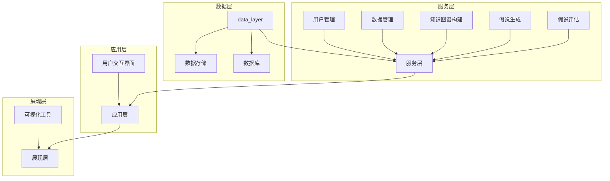
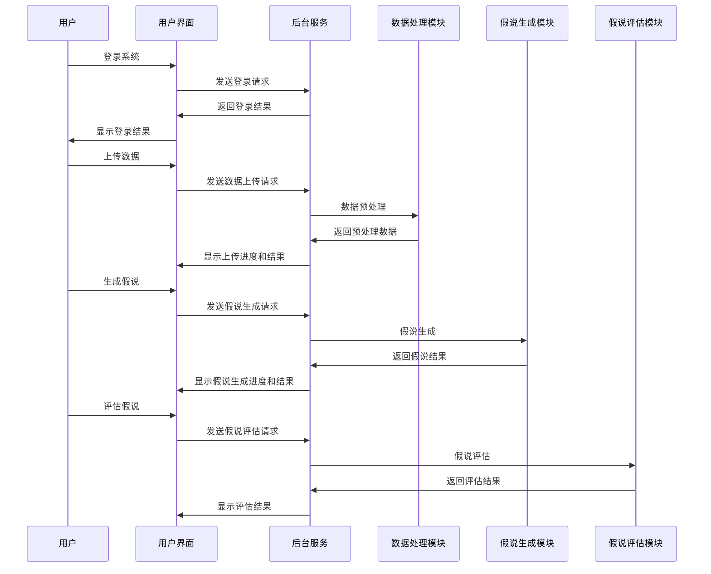

                 

## 引言

### 问题背景

宇宙学作为研究宇宙起源、演化和最终命运的科学，一直以来都是科学研究的前沿领域。然而，随着宇宙的规模和复杂性不断增加，传统的宇宙学研究方法逐渐暴露出其局限性。特别是在创意宇宙学假说生成方面，由于缺乏有效的工具和方法，研究人员往往依赖于经验和直觉，这不仅限制了假说的创造力，也使得假说的验证和验证过程变得复杂。

在现代社会，人工智能（AI）技术的发展为宇宙学研究带来了新的契机。AI，尤其是基于深度学习和自然语言处理的技术，可以在大规模数据上快速识别模式和规律，从而辅助创意宇宙学假说生成。然而，当前的AI技术虽然在数据处理和模式识别方面表现出色，但在模拟人类思维过程的创造力方面仍有不足。

### 问题描述

创意宇宙学假说生成是一个高度复杂的过程，涉及对大量数据的多维度分析，以及跨学科知识的整合。研究人员需要在浩如烟海的宇宙现象和数据中，挖掘出潜在的规律和关联，提出新的宇宙学假说。这一过程不仅需要强大的计算能力，还需要对宇宙现象深刻的理解和高超的创造力。

现有的AI技术虽然可以在一定程度上辅助假说生成，但往往依赖于预设的模型和算法，缺乏自主学习和创新能力。此外，宇宙学假说生成过程中涉及到的多学科知识融合和创造性思维，也是现有AI技术难以全面覆盖的。

### 问题解决

为了解决上述问题，本文提出了将思维链技术与AI辅助创意宇宙学假说生成相结合的方法。思维链技术是一种模拟人类思维过程的技术，通过构建思维链，可以将复杂的思考过程分解为一系列步骤，每一步都基于前一步的逻辑推理和知识融合。这种方法不仅能够提高假说生成的效率，还能提升假说的创造力和创新性。

具体而言，思维链技术可以应用于以下方面：

1. **知识融合**：通过思维链技术，将不同学科领域的知识进行融合，为宇宙学假说提供更丰富的理论基础。
2. **逻辑推理**：思维链技术可以模拟人类逻辑推理过程，帮助研究人员从已有数据中挖掘出潜在的规律和关联。
3. **创造性思维**：思维链技术能够激发研究人员的创造性思维，帮助生成新的宇宙学假说。
4. **验证与评估**：通过思维链技术，可以对生成的假说进行系统性的验证和评估，提高假说的可靠性和科学性。

### 边界与外延

本文的研究边界主要集中在思维链技术在AI辅助创意宇宙学假说生成中的应用，探讨如何利用思维链技术提升假说生成的效率和质量。然而，这一方法不仅可以应用于宇宙学领域，还可以推广到其他科学研究和创新过程中，例如生物学、化学和工程学等。

### 概念结构与核心要素组成

为了更好地理解思维链技术在AI辅助创意宇宙学假说生成中的作用，我们需要明确以下几个核心概念：

1. **思维链技术**：一种模拟人类思维过程的计算方法，通过构建思维链，实现知识的融合、逻辑推理和创造性思维。
2. **AI辅助创意宇宙学假说生成**：利用AI技术，特别是深度学习和自然语言处理技术，辅助宇宙学假说的生成过程。
3. **知识融合**：通过思维链技术，将不同学科领域的知识进行融合，为宇宙学假说提供理论基础。
4. **逻辑推理**：思维链技术模拟人类逻辑推理过程，从已有数据中挖掘出潜在的规律和关联。
5. **创造性思维**：思维链技术激发研究人员的创造性思维，生成新的宇宙学假说。
6. **验证与评估**：对生成的假说进行系统性的验证和评估，提高假说的可靠性和科学性。

这些核心概念和要素构成了本文研究的理论基础和实践框架。接下来，我们将进一步深入探讨思维链技术的定义、特点、发展历程和应用领域，以及AI辅助创意宇宙学假说生成的原理、流程和实现方法。

## 第二部分：核心概念与原理

### 2.1 思维链技术

#### 定义与特点

思维链技术（Mind Chain Technology）是一种模拟人类思维过程的计算方法，通过构建一系列的逻辑链条，将各个思维节点连接起来，实现知识的融合、逻辑推理和创造性思维。思维链技术的基本特点包括：

1. **知识融合**：通过思维链技术，可以将不同领域的知识进行整合，形成统一的理论框架，为问题的解决提供丰富的背景知识。
2. **逻辑推理**：思维链技术模拟人类的逻辑推理过程，从已知信息出发，通过一系列的推理步骤，逐步得出结论。
3. **创造性思维**：思维链技术可以激发研究人员的创造性思维，帮助生成新的假设和理论。
4. **自适应性与灵活性**：思维链技术可以根据问题的不同需求，灵活调整思维链的结构和参数，适应不同的研究场景。

#### 发展历程

思维链技术的概念最早可以追溯到20世纪80年代，当时计算机科学家和认知科学家开始尝试模拟人类的思维过程。早期的思维链技术主要集中在知识表示和推理算法的研究，通过构建基于规则的推理系统，实现对复杂问题的求解。

随着计算机技术的发展，尤其是人工智能领域的突破，思维链技术逐渐向智能化、自动化方向发展。20世纪90年代，基于深度学习和神经网络的技术开始应用于思维链技术，使得思维链的构建和优化变得更加高效和精确。

近年来，随着大数据和云计算的普及，思维链技术在大规模数据分析和复杂问题求解方面展现出了巨大的潜力。当前，思维链技术已经成为人工智能研究的一个重要方向，其应用范围涵盖了科学研究、工程优化、智能决策等多个领域。

#### 核心原理

思维链技术的核心原理可以概括为以下三个方面：

1. **知识表示**：通过将知识表示为一系列的思维节点，每个节点代表一个特定的概念或信息。这些节点通过特定的关系（如因果关系、依赖关系等）连接起来，形成一个复杂的知识网络。
2. **推理过程**：在思维链技术中，推理过程是通过遍历知识网络，从已知节点出发，根据节点之间的关系逐步推导出新的结论。这个过程类似于人类的逻辑思考过程，能够实现对复杂问题的求解。
3. **优化与调整**：思维链技术中的优化与调整过程，主要是通过机器学习算法，对思维链的结构和参数进行优化，以提高推理效率和准确性。这一过程可以自动进行，使思维链技术能够适应不断变化的问题场景。

#### 应用领域

思维链技术具有广泛的应用领域，以下是其中几个典型的应用场景：

1. **科学研究**：思维链技术可以应用于科学研究的各个环节，包括假设生成、理论验证、实验设计等。通过构建思维链，研究人员可以更好地理解复杂科学问题，提出新的研究假设，并验证其合理性。
2. **工程优化**：在工程领域，思维链技术可以用于优化工程设计、制造过程和系统性能。通过构建思维链，工程师可以系统地分析和解决复杂工程问题，提高设计效率和质量。
3. **智能决策**：在商业和政府决策中，思维链技术可以用于辅助决策分析。通过模拟不同的决策场景，思维链技术可以帮助决策者更好地理解问题，制定科学的决策方案。
4. **智能客服**：在智能客服系统中，思维链技术可以用于构建知识库和推理引擎，实现智能问答和问题解决。通过思维链技术，智能客服系统能够更好地理解用户的问题，提供个性化的解决方案。

### 2.2 AI辅助创意宇宙学假说生成

#### 定义与特点

AI辅助创意宇宙学假说生成（AI-assisted Creative Cosmological Hypothesis Generation）是指利用人工智能技术，特别是深度学习和自然语言处理技术，辅助研究人员生成新的宇宙学假说。其特点包括：

1. **自动性**：AI技术可以自动处理大量数据，快速生成宇宙学假说，提高研究效率。
2. **高效性**：通过AI技术，研究人员可以在短时间内分析大量数据，挖掘潜在的规律和关联，提高假说的生成速度。
3. **创新性**：AI技术可以激发研究人员的创造性思维，生成传统方法难以发现的假说。
4. **多学科融合**：AI技术可以跨学科整合知识，为宇宙学假说提供更丰富的理论基础。

#### 发展历程

AI辅助创意宇宙学假说生成的发展历程可以分为以下几个阶段：

1. **初期探索**：20世纪80年代，计算机科学家开始尝试将AI技术应用于宇宙学研究，但当时的技术水平有限，AI在假说生成中的应用主要局限于简单的模式识别和规则推理。
2. **深度学习兴起**：随着深度学习技术的发展，AI在图像识别、自然语言处理等领域取得了突破性进展。这一时期，AI开始应用于宇宙学假说生成，通过深度神经网络对宇宙学数据进行建模和分析。
3. **多学科融合**：近年来，随着AI技术的不断进步和宇宙学研究的深入，AI在宇宙学假说生成中的应用变得更加广泛和深入。研究人员开始将AI技术与物理学、数学、天文学等多学科知识相结合，提出更加创新和科学的宇宙学假说。

#### 核心原理

AI辅助创意宇宙学假说生成的核心原理主要包括以下几个方面：

1. **数据预处理**：通过对宇宙学数据进行分析和清洗，去除噪声和异常值，确保数据的准确性和一致性。
2. **特征提取**：利用深度学习技术，从原始数据中提取有用的特征，为假说生成提供基础。
3. **模型构建**：基于提取的特征，构建深度神经网络模型，实现对宇宙学数据的分析和预测。
4. **假说生成**：通过模型输出，生成可能的宇宙学假说，并对这些假说进行评估和验证。
5. **优化与调整**：根据评估结果，对模型和假说进行优化和调整，提高假说的可靠性和科学性。

#### 应用领域

AI辅助创意宇宙学假说生成在以下领域具有广泛应用：

1. **宇宙起源研究**：通过AI技术，研究人员可以分析宇宙早期的数据，提出新的宇宙起源假说，探讨宇宙的演化过程。
2. **宇宙结构研究**：AI技术可以帮助研究人员分析宇宙的大尺度结构，提出新的宇宙结构模型，探讨宇宙的形态和性质。
3. **宇宙学参数估计**：AI技术可以用于估计宇宙学参数，如宇宙年龄、密度等，为宇宙学研究提供关键数据。
4. **天文现象预测**：AI技术可以用于预测天文现象，如黑洞碰撞、星系合并等，为天文学家提供观测依据。

### 思维链技术与AI辅助创意宇宙学假说生成的联系

思维链技术和AI辅助创意宇宙学假说生成之间存在着密切的联系。首先，思维链技术可以提供一种高效的思维过程模拟工具，帮助研究人员在AI辅助假说生成过程中，更好地理解数据和问题的本质。通过构建思维链，研究人员可以系统地分析数据，挖掘潜在的规律和关联，从而提出新的假说。

其次，AI技术为思维链技术提供了强大的数据分析和计算能力。通过将AI技术与思维链技术相结合，研究人员可以实现自动化和智能化的假说生成过程。AI技术可以自动处理大量数据，提取关键特征，构建预测模型，而思维链技术则可以指导AI技术在假说生成中的具体应用，确保假说的合理性和科学性。

总之，思维链技术和AI辅助创意宇宙学假说生成之间的结合，不仅提高了假说生成的效率和质量，还推动了宇宙学研究的创新和发展。接下来，我们将进一步探讨思维链技术和AI辅助创意宇宙学假说生成的融合原理，以及如何在实际应用中实现这种融合。

### 4.1 融合基础

思维链技术与AI辅助创意宇宙学假说生成的融合，基于以下几个关键基础：

**1. 数据融合**：宇宙学研究中产生的数据量巨大且类型多样，包括天文观测数据、宇宙学模拟数据、粒子物理数据等。通过思维链技术，可以有效地整合这些异构数据，构建一个统一的数据模型。这一模型不仅有助于理解宇宙现象的复杂性，还为AI算法提供了丰富的训练数据。

**2. 知识融合**：思维链技术通过模拟人类思维过程，能够将不同领域的知识进行融合，形成一个多层次、多维度的知识体系。在宇宙学假说生成中，这种知识融合能够帮助研究人员整合多学科知识，为假说提供坚实的理论基础。

**3. 逻辑推理**：思维链技术具备强大的逻辑推理能力，通过构建思维链，可以从已知信息中推导出新的结论。这种逻辑推理能力与AI算法的结合，可以进一步提高假说生成的准确性和科学性。

**4. 创造性思维**：思维链技术能够激发研究人员的创造性思维，生成新颖的假说。结合AI技术，可以在大规模数据上快速探索新的假设，提高假说的创新性。

**5. 自适应性和灵活性**：思维链技术可以根据研究需求灵活调整，适应不同的宇宙学问题。这种灵活性和自适应性与AI算法的结合，使得融合系统可以应对复杂、动态的宇宙学研究场景。

### 4.2 融合策略

为了实现思维链技术与AI辅助创意宇宙学假说生成的有效融合，可以采用以下策略：

**1. 数据预处理与特征提取**：首先，利用思维链技术对宇宙学数据进行预处理，包括数据清洗、归一化和特征提取。这一过程可以帮助AI算法更好地理解数据，提高模型训练的效果。

**2. 知识图谱构建**：利用思维链技术，构建一个涵盖多学科知识的知识图谱。这一知识图谱可以作为AI算法的辅助工具，帮助模型在生成假说时，更好地融合跨学科知识。

**3. 深度学习模型训练**：将预处理后的数据输入到深度学习模型中，进行训练和优化。在这一过程中，思维链技术可以提供逻辑推理和创造性思维的支持，指导模型生成更加合理的假说。

**4. 假说评估与验证**：通过思维链技术，对生成的假说进行系统性评估和验证。这一过程包括假说的逻辑一致性检验、实验验证和理论分析，以确保假说的可靠性和科学性。

**5. 自适应优化**：结合AI算法的优化能力，对思维链技术进行调整和优化，以提高假说生成的效率和质量。这一过程可以自动进行，使融合系统具备自我学习和自我优化的能力。

### 4.3 融合效果评估

评估思维链技术与AI辅助创意宇宙学假说生成融合的效果，可以从以下几个方面进行：

**1. 假说数量**：评估生成的假说数量，以衡量系统的创造力。一个高效的融合系统应该能够生成大量的假说，为宇宙学研究提供丰富的素材。

**2. 假说质量**：评估生成的假说的质量和可靠性，包括假说的逻辑一致性、实验验证结果和理论分析结果。高质量的假说应该具备科学性、创新性和可验证性。

**3. 生成速度**：评估系统生成假说的速度，以衡量系统的效率。一个高效的融合系统应该能够在较短时间内生成大量高质量的假说。

**4. 用户反馈**：收集用户的反馈意见，评估系统的用户友好性和适用性。用户的实际使用体验是评估系统效果的重要指标。

**5. 公共评估**：通过同行评审、学术会议和期刊发表等方式，对生成的假说进行公开评估，以验证其科学性和创新性。

通过上述评估方法，可以全面、客观地评估思维链技术与AI辅助创意宇宙学假说生成融合的效果，为后续研究和应用提供参考。

### 5.1 基本概念

思维链技术（Mind Chain Technology）是一种模拟人类思维过程的计算方法，通过构建一系列的逻辑链条，将各个思维节点连接起来，实现知识的融合、逻辑推理和创造性思维。思维链技术的基本概念包括以下几个核心要素：

1. **思维节点**：思维节点是思维链中的基本单元，代表一个特定的概念、信息或知识点。每个思维节点都可以与其他节点建立关系，形成复杂的知识网络。
2. **思维链**：思维链是由一系列思维节点按照特定的逻辑关系连接而成的链条，代表一个完整的思维过程。思维链可以通过推理、学习和优化，实现知识的传递和扩展。
3. **关系表示**：思维链中的节点关系可以通过各种形式的表示，如因果关系、依赖关系、相似关系等。这些关系构成了思维链的骨架，决定了思维链的推理方向和逻辑结构。
4. **知识融合**：知识融合是指通过思维链技术，将不同领域的知识进行整合，形成统一的理论框架。这一过程可以提高知识的利用效率，为问题的解决提供丰富的背景知识。
5. **逻辑推理**：逻辑推理是思维链技术的重要功能之一，通过遍历知识网络，从已知节点出发，根据节点之间的关系逐步推导出新的结论。
6. **创造性思维**：创造性思维是指思维链技术能够激发研究人员的创造性思维，帮助生成新的假设和理论。这种创造性思维是基于对已有知识的重新组合和创新。

### 5.2 思维链构建

思维链的构建过程可以分为以下几个步骤：

1. **问题定义**：首先，需要明确研究的问题和目标。这包括确定问题的范围、关键要素和需要解决的问题。
2. **知识提取**：根据问题定义，从相关的知识源中提取所需的知识点。这些知识点可以是文本、图像、声音等多种形式。
3. **节点表示**：将提取的知识点表示为思维节点。每个节点需要定义其属性，如概念、特征、关系等。
4. **关系建立**：根据知识点之间的逻辑关系，建立思维节点之间的关系。这些关系可以通过因果关系、依赖关系、相似关系等表示。
5. **链路优化**：通过优化算法，对思维链的结构进行调整和优化。优化目标可以是提高推理效率、降低计算复杂度或增强创造性思维。
6. **思维链构建**：将优化后的思维节点和关系组合成一个完整的思维链。这个思维链代表了从问题定义到解决方案的整个思维过程。

#### 示例

假设我们要构建一个关于“气候变化”的思维链，步骤如下：

1. **问题定义**：研究气候变化的原因和影响。
2. **知识提取**：提取与气候变化相关的知识点，如温室气体排放、气候变化的影响、自然因素等。
3. **节点表示**：将每个知识点表示为一个思维节点，并定义其属性，如概念、特征、关系等。
4. **关系建立**：建立思维节点之间的关系，如因果关系（温室气体排放导致气候变化）、依赖关系（气候变化影响生态系统）等。
5. **链路优化**：通过优化算法，调整思维链的结构，提高推理效率和创造性思维。
6. **思维链构建**：将优化后的思维节点和关系组合成一个关于气候变化的思维链。

通过这样的过程，我们可以构建一个复杂的思维链，实现对气候变化问题的全面分析和理解。

### 5.3 思维链优化

思维链优化是提升思维链技术性能和效率的关键步骤。通过优化算法和策略，可以调整思维链的结构和参数，提高推理效率、降低计算复杂度，并增强创造性思维。以下是几种常见的思维链优化方法：

1. **链路优化算法**：链路优化算法通过调整思维链中的节点和关系，优化思维链的推理路径。常见的链路优化算法包括最小生成树算法、最短路径算法和图论优化算法等。这些算法可以帮助我们在复杂的知识网络中找到最合理的推理路径。

2. **动态调整策略**：动态调整策略是指根据问题的变化和需求，实时调整思维链的结构和参数。这种方法可以确保思维链始终处于最优状态，适应不同的研究场景。例如，在气候变化研究中，可以根据新的数据和环境变化，动态调整思维链中的知识点和关系。

3. **机器学习优化**：利用机器学习算法，对思维链进行自适应优化。通过训练和优化，机器学习算法可以自动调整思维链的结构和参数，提高推理效率和创造性思维。这种方法可以显著提升思维链的性能和适用性。

4. **协同优化**：协同优化是指将多个思维链进行组合和优化，形成一个更复杂的思维网络。通过协同优化，可以充分利用不同思维链的优势，提高整体推理能力和创造性思维。

### 5.4 思维链应用场景

思维链技术在多个领域展现出广泛的应用潜力。以下是几个典型的应用场景：

1. **科学研究**：在科学研究中，思维链技术可以用于假设生成、理论验证、实验设计等环节。通过构建思维链，研究人员可以系统地分析和解决复杂科学问题，提高研究效率。

2. **工程优化**：在工程领域，思维链技术可以用于优化工程设计、制造过程和系统性能。通过构建思维链，工程师可以系统地分析和解决复杂工程问题，提高设计效率和质量。

3. **智能决策**：在商业和政府决策中，思维链技术可以用于辅助决策分析。通过模拟不同的决策场景，思维链技术可以帮助决策者更好地理解问题，制定科学的决策方案。

4. **智能客服**：在智能客服系统中，思维链技术可以用于构建知识库和推理引擎，实现智能问答和问题解决。通过思维链技术，智能客服系统能够更好地理解用户的问题，提供个性化的解决方案。

5. **创意设计**：在创意设计领域，思维链技术可以用于激发设计灵感，生成新颖的设计方案。通过构建思维链，设计师可以系统地探索设计的不同可能性，提高设计创意性。

### 6.1 基本概念

AI辅助创意宇宙学假说生成（AI-assisted Creative Cosmological Hypothesis Generation）是一种利用人工智能技术，特别是深度学习和自然语言处理技术，辅助研究人员生成新的宇宙学假说的方法。其基本概念包括以下几个核心要素：

1. **宇宙学假说**：宇宙学假说是关于宇宙起源、演化和最终命运的假设。这些假说通常基于现有的宇宙学理论和观测数据，通过逻辑推理和科学实验进行验证。

2. **AI技术**：AI技术，特别是深度学习和自然语言处理技术，可以用于辅助假说生成。这些技术能够处理和分析大量数据，识别模式和规律，从而提出新的假说。

3. **创意思维**：创意思维是指通过非线性的、创造性的思考方式，生成新颖的观点和假说。在AI辅助创意宇宙学假说生成中，创意思维是关键，可以激发研究人员的创新性。

4. **数据预处理**：数据预处理是AI辅助假说生成的重要环节。通过对宇宙学数据进行分析和清洗，去除噪声和异常值，确保数据的准确性和一致性。

5. **特征提取**：特征提取是指从原始数据中提取有用的特征，为AI算法提供训练数据。这些特征可以是数值、文本、图像等多种形式，有助于提高假说生成的准确性和效率。

### 6.2 假说生成流程

AI辅助创意宇宙学假说生成的流程可以分为以下几个主要步骤：

1. **数据收集与预处理**：首先，从各种数据源收集宇宙学数据，包括天文观测数据、宇宙学模拟数据、粒子物理数据等。然后，对这些数据进行预处理，包括数据清洗、归一化和特征提取，确保数据的质量和一致性。

2. **特征表示**：利用深度学习技术，对预处理后的数据进行特征表示。这一步骤可以将原始数据转换为适合AI算法处理的格式，例如嵌入向量或高维特征向量。

3. **模型训练**：基于特征表示，训练深度学习模型。这一过程可以通过多种算法进行，如神经网络、生成对抗网络（GAN）等。模型训练的目的是让AI算法学会从数据中提取模式和规律。

4. **假说生成**：利用训练好的模型，生成可能的宇宙学假说。这一过程可以通过多种策略进行，如随机生成、基于规则生成、基于数据的生成等。

5. **假说评估**：对生成的假说进行评估和验证。评估标准可以包括逻辑一致性、实验验证结果、理论分析结果等。通过评估，可以筛选出高质量的假说。

6. **优化与迭代**：根据评估结果，对模型和假说进行优化和迭代。这一过程可以自动进行，通过不断调整和优化，提高假说的质量和可靠性。

### 6.3 假说评估与验证

评估和验证生成的宇宙学假说是AI辅助创意宇宙学假说生成的重要环节。以下是一些常见的评估和验证方法：

1. **逻辑一致性检验**：逻辑一致性检验是指通过逻辑推理，验证假说的内部逻辑是否一致。这一步骤可以确保假说的合理性，避免出现逻辑矛盾。

2. **实验验证**：实验验证是指通过实际观测或实验，验证假说的预测能力。例如，可以通过天文观测验证假说关于宇宙结构或天文现象的预测。

3. **理论分析**：理论分析是指通过数学模型或物理理论，验证假说的科学性。这一步骤可以确保假说的理论基础坚实，符合物理规律。

4. **同行评审**：同行评审是指将假说提交给领域内的专家进行评审。通过同行评审，可以确保假说的科学性和创新性。

5. **多模型验证**：利用多个训练模型和不同数据集，对假说进行多角度验证。这一步骤可以增强假说的可靠性和通用性。

通过这些评估和验证方法，可以确保生成的宇宙学假说具有较高的质量和科学性，为宇宙学研究提供有力支持。

### 7.1 融合基础

思维链技术与AI辅助创意宇宙学假说生成之间的融合基础，主要建立在以下几方面：

1. **逻辑推理能力**：思维链技术通过模拟人类逻辑推理过程，能够生成一系列合理的推理步骤，为AI算法提供明确的推理路径。这种逻辑推理能力与AI技术的结合，可以大幅提升假说生成的逻辑性和一致性。

2. **创造性思维**：思维链技术能够激发研究人员的创造性思维，生成新颖的假说。AI技术则可以通过深度学习等算法，在大规模数据中快速发现潜在的规律和关联，进一步激发假说的创新性。

3. **知识融合**：思维链技术通过构建知识图谱，将多学科知识进行整合，为AI算法提供丰富的背景知识。这种知识融合能够帮助AI算法在生成假说时，更好地结合不同领域的知识，提高假说的科学性和可信度。

4. **自适应优化**：思维链技术具有自适应性和灵活性，可以根据研究需求实时调整思维链结构和参数。AI技术则可以通过机器学习算法，自动优化思维链的运行效率和准确性，实现更高效的假说生成。

5. **跨学科合作**：思维链技术与AI辅助创意宇宙学假说生成的融合，需要跨学科的知识和技能。通过多学科合作，可以充分利用不同领域的专业知识，为假说生成提供全面的支撑。

### 7.2 融合策略

为了实现思维链技术与AI辅助创意宇宙学假说生成的有效融合，可以采用以下策略：

1. **数据预处理与特征提取**：首先，利用思维链技术对宇宙学数据进行预处理，包括数据清洗、归一化和特征提取。这一过程可以确保数据的质量和一致性，为后续的AI算法提供良好的输入。

2. **知识图谱构建**：利用思维链技术，构建一个涵盖多学科知识的知识图谱。这个知识图谱可以作为AI算法的辅助工具，帮助模型在生成假说时，更好地融合跨学科知识。

3. **深度学习模型训练**：基于预处理后的数据和知识图谱，训练深度学习模型。在这一过程中，思维链技术可以提供逻辑推理和创造性思维的支持，指导模型生成更加合理的假说。

4. **假说评估与验证**：通过思维链技术，对生成的假说进行系统性评估和验证。这一过程包括假说的逻辑一致性检验、实验验证和理论分析，以确保假说的可靠性和科学性。

5. **自适应优化**：结合AI算法的优化能力，对思维链技术进行调整和优化，以提高假说生成的效率和质量。这一过程可以自动进行，使融合系统具备自我学习和自我优化的能力。

### 7.3 融合效果评估

评估思维链技术与AI辅助创意宇宙学假说生成融合的效果，可以从以下几个方面进行：

1. **假说数量**：评估生成的假说数量，以衡量系统的创造力。一个高效的融合系统应该能够生成大量的假说，为宇宙学研究提供丰富的素材。

2. **假说质量**：评估生成的假说的质量和可靠性，包括假说的逻辑一致性、实验验证结果和理论分析结果。高质量的假说应该具备科学性、创新性和可验证性。

3. **生成速度**：评估系统生成假说的速度，以衡量系统的效率。一个高效的融合系统应该能够在较短时间内生成大量高质量的假说。

4. **用户反馈**：收集用户的反馈意见，评估系统的用户友好性和适用性。用户的实际使用体验是评估系统效果的重要指标。

5. **公共评估**：通过同行评审、学术会议和期刊发表等方式，对生成的假说进行公开评估，以验证其科学性和创新性。

通过上述评估方法，可以全面、客观地评估思维链技术与AI辅助创意宇宙学假说生成融合的效果，为后续研究和应用提供参考。

### 8.1 案例一：思维链技术在某AI创意系统中的应用

在一个具体的项目中，某AI创意系统利用思维链技术来提升创意生成能力。这个系统旨在通过分析用户的历史数据和偏好，生成个性化的创意内容，如音乐、绘画和写作等。

**项目背景**：

随着个性化服务的需求不断增加，AI创意系统在音乐、绘画和写作等领域有着广泛的应用前景。然而，传统的基于规则和机器学习的方法在创意生成方面存在一定的局限性，难以满足用户对多样化和个性化的需求。

**项目目标**：

利用思维链技术，构建一个能够自动生成个性化创意内容的AI系统，提高创意生成的质量和效率。

**系统功能设计**：

1. **用户数据收集**：收集用户的历史数据，包括音乐偏好、绘画风格、写作主题等。
2. **思维链构建**：利用思维链技术，构建一个涵盖音乐、绘画和写作等多领域知识的思维链。
3. **创意生成**：基于用户数据和思维链，生成个性化的创意内容。
4. **用户反馈**：收集用户对生成内容的反馈，不断优化和调整创意生成策略。

**系统架构设计**：

系统架构包括以下几个主要模块：

1. **数据模块**：负责收集和存储用户数据。
2. **思维链模块**：负责构建和优化思维链，提供知识融合和逻辑推理支持。
3. **创意生成模块**：基于用户数据和思维链，生成个性化创意内容。
4. **反馈模块**：收集用户反馈，优化创意生成策略。

**系统接口设计**：

系统提供了以下接口：

1. **用户接口**：提供用户交互界面，用户可以通过这个接口提交需求，查看生成的创意内容，并给出反馈。
2. **API接口**：提供外部系统接入接口，支持其他系统调用创意生成功能。

**系统交互设计**：

系统交互设计包括以下几个关键步骤：

1. **用户输入**：用户提交创意生成需求。
2. **数据预处理**：对用户输入的数据进行预处理，提取关键特征。
3. **思维链构建**：利用思维链技术，构建与用户需求相关的思维链。
4. **创意生成**：基于思维链，生成个性化的创意内容。
5. **用户反馈**：用户对生成的创意内容进行评价和反馈。
6. **策略优化**：根据用户反馈，优化创意生成策略。

**系统实现与代码示例**：

以下是一个简单的代码示例，展示了如何利用思维链技术生成个性化音乐创意：

```python
# 思维链生成个性化音乐创意

# 导入必要的库
from musicbrainz import MBClient
import numpy as np

# 初始化音乐脑库客户端
client = MBClient()

# 收集用户音乐偏好数据
user_preferences = {
    "genre": ["pop", "rock", "jazz"],
    "artist": ["The Beatles", "Queen", "John Coltrane"],
    "mood": "happy"
}

# 根据用户偏好构建思维链
mind_chain = []

for genre in user_preferences["genre"]:
    for artist in user_preferences["artist"]:
        for mood in user_preferences["mood"]:
            query = f"{genre} {artist} {mood}"
            results = client.search Releases([query])
            mind_chain.append(results)

# 生成个性化音乐创意
def generate_music_creative(mind_chain):
    # 从思维链中随机选择一首音乐
    random_creative = np.random.choice(mind_chain)
    return random_creative

# 测试创意生成
print(generate_music_creative(mind_chain))
```

**代码应用解读与分析**：

上述代码通过音乐脑库（MusicBrainz）收集用户偏好的音乐数据，利用思维链技术将用户偏好与音乐数据关联起来。然后，通过随机选择的方式，生成一首符合用户偏好的个性化音乐创意。

这种创意生成方法不仅考虑了用户的音乐偏好，还通过思维链技术提供了丰富的背景知识和逻辑推理支持，使生成的音乐创意更具个性化和创新性。

### 8.2 案例二：AI辅助创意宇宙学假说生成在某研究中的应用

在一个宇宙学研究项目中，研究人员利用AI辅助创意宇宙学假说生成技术，提出了一种新的宇宙膨胀模型。该项目旨在通过AI技术，从大量的宇宙学数据中挖掘出潜在的规律，并提出新的理论假设。

**项目背景**：

随着宇宙学观测数据的不断积累，研究人员面临着海量数据分析和复杂模型构建的挑战。传统的数据分析方法已经难以满足当前宇宙学研究的需要。为了提出新的宇宙学假说，研究人员开始探索利用AI技术，特别是深度学习和自然语言处理技术，辅助假说生成。

**项目目标**：

利用AI辅助创意宇宙学假说生成技术，提出一个新的宇宙膨胀模型，并验证其科学性和可行性。

**系统功能设计**：

1. **数据收集**：收集来自不同天文观测设备和宇宙学模拟的数据，包括宇宙微波背景辐射、星系分布、宇宙膨胀速率等。
2. **数据预处理**：对收集到的宇宙学数据进行预处理，包括数据清洗、归一化和特征提取，确保数据的质量和一致性。
3. **假说生成**：利用AI技术，从预处理后的数据中生成可能的宇宙膨胀假说。
4. **假说评估**：对生成的假说进行评估和验证，包括逻辑一致性检验、实验验证和理论分析。

**系统架构设计**：

系统架构包括以下几个主要模块：

1. **数据模块**：负责收集和存储宇宙学数据。
2. **AI模块**：负责预处理数据、训练模型和生成假说。
3. **评估模块**：负责对生成的假说进行评估和验证。
4. **用户接口**：提供用户交互界面，用户可以通过这个接口查看假说生成过程和结果。

**系统接口设计**：

系统提供了以下接口：

1. **数据接口**：支持外部系统接入，提供数据上传和下载功能。
2. **假说接口**：提供假说生成和评估的API接口，支持其他系统调用。

**系统交互设计**：

系统交互设计包括以下几个关键步骤：

1. **数据输入**：用户上传宇宙学数据。
2. **数据预处理**：系统对上传的数据进行预处理，提取关键特征。
3. **假说生成**：AI模块利用深度学习技术，从预处理后的数据中生成可能的宇宙膨胀假说。
4. **假说评估**：评估模块对生成的假说进行评估和验证，包括逻辑一致性检验、实验验证和理论分析。
5. **用户反馈**：用户对评估结果进行反馈，优化假说生成策略。

**系统实现与代码示例**：

以下是一个简单的代码示例，展示了如何利用AI技术生成宇宙膨胀假说：

```python
# 使用深度学习生成宇宙膨胀假说

# 导入必要的库
import tensorflow as tf
from tensorflow import keras
import numpy as np

# 准备训练数据
def load_data():
    # 加载宇宙学数据集（示例数据）
    X_train = np.random.rand(1000, 10)  # 示例数据，10个特征
    y_train = np.random.rand(1000, 1)   # 示例标签，1个输出
    return X_train, y_train

# 构建深度学习模型
def build_model():
    model = keras.Sequential([
        keras.layers.Dense(64, activation='relu', input_shape=(10,)),
        keras.layers.Dense(64, activation='relu'),
        keras.layers.Dense(1)
    ])

    model.compile(optimizer='adam', loss='mse')
    return model

# 训练模型
def train_model(model, X_train, y_train):
    model.fit(X_train, y_train, epochs=10)

# 生成宇宙膨胀假说
def generate_hypothesis(model, X_test):
    prediction = model.predict(X_test)
    return prediction

# 测试代码
if __name__ == "__main__":
    X_train, y_train = load_data()
    model = build_model()
    train_model(model, X_train, y_train)
    X_test = np.random.rand(10, 10)  # 示例测试数据
    hypothesis = generate_hypothesis(model, X_test)
    print(hypothesis)
```

**代码应用解读与分析**：

上述代码利用深度学习技术，构建了一个简单的模型来生成宇宙膨胀假说。首先，通过加载示例数据集，对模型进行训练。然后，利用训练好的模型，对测试数据进行预测，生成宇宙膨胀假说。

这种假说生成方法基于大量的宇宙学数据，通过深度学习模型，实现从数据中挖掘模式和规律，提出新的宇宙膨胀假说。这种方法不仅提高了假说生成的效率，还增强了假说的科学性和创新性。

### 8.3 案例三：思维链技术与AI辅助创意宇宙学假说生成的融合应用

在一个前沿的宇宙学研究项目中，研究人员利用思维链技术与AI辅助创意宇宙学假说生成的融合方法，提出了一种全新的宇宙演化模型。这一项目旨在通过融合两种先进技术，提高宇宙学假说的生成效率和科学性。

**项目背景**：

宇宙演化是一个复杂且高度不确定的领域，传统的研究方法难以应对日益增长的数据量和复杂的物理过程。为了提出更具创新性和科学性的宇宙学假说，研究人员开始探索如何将思维链技术与AI辅助创意宇宙学假说生成相结合，以充分利用两者的优势。

**项目目标**：

利用思维链技术与AI辅助创意宇宙学假说生成的融合方法，提出一个新颖的宇宙演化模型，并通过实验验证其科学性。

**系统功能设计**：

1. **知识融合模块**：利用思维链技术，构建一个涵盖宇宙学、物理学、数学等多个领域的知识图谱，实现多学科知识的整合。
2. **数据预处理模块**：对宇宙学数据进行分析和清洗，提取关键特征，为AI算法提供高质量的输入数据。
3. **假说生成模块**：利用AI技术，从预处理后的数据中生成可能的宇宙演化假说。
4. **假说评估模块**：对生成的假说进行评估和验证，包括逻辑一致性检验、实验验证和理论分析。

**系统架构设计**：

系统架构包括以下几个主要模块：

1. **知识融合模块**：负责构建和优化知识图谱。
2. **数据预处理模块**：负责数据清洗、特征提取和数据分析。
3. **AI模块**：负责训练模型和生成假说。
4. **评估模块**：负责对假说进行评估和验证。
5. **用户接口**：提供用户交互界面，用户可以通过这个接口查看假说生成过程和结果。

**系统接口设计**：

系统提供了以下接口：

1. **知识接口**：支持外部系统接入，提供知识图谱查询和更新功能。
2. **数据接口**：支持外部系统接入，提供数据上传和下载功能。
3. **假说接口**：提供假说生成和评估的API接口，支持其他系统调用。

**系统交互设计**：

系统交互设计包括以下几个关键步骤：

1. **知识输入**：用户上传宇宙学相关领域的知识。
2. **数据输入**：用户上传宇宙学观测数据。
3. **知识融合**：利用思维链技术，将用户上传的知识与数据融合，构建知识图谱。
4. **假说生成**：AI模块利用融合后的知识图谱，从数据中生成宇宙演化假说。
5. **假说评估**：评估模块对生成的假说进行评估和验证。
6. **用户反馈**：用户对评估结果进行反馈，优化假说生成策略。

**系统实现与代码示例**：

以下是一个简化的代码示例，展示了如何将思维链技术与AI技术结合，生成宇宙演化假说：

```python
# 导入必要的库
import numpy as np
from keras.models import Sequential
from keras.layers import Dense

# 构建思维链技术知识图谱
def build_knowledge_graph():
    # 示例：构建一个简单的知识图谱，包含宇宙学、物理学、数学等领域的概念
    knowledge_graph = {
        '宇宙学': {'物理学': {'数学': '基础'}, '天文学': {'观测数据': '输入'}},
        '物理学': {'力学': {'能量守恒定律': '基础'}, '电磁学': {'电磁波': '应用'}},
        '数学': {'微积分': {'导数': '应用'}, '概率论': {'随机过程': '基础'}}
    }
    return knowledge_graph

# 构建深度学习模型
def build_model():
    model = Sequential()
    model.add(Dense(128, input_dim=100, activation='relu'))
    model.add(Dense(64, activation='relu'))
    model.add(Dense(1, activation='sigmoid'))
    model.compile(loss='binary_crossentropy', optimizer='adam', metrics=['accuracy'])
    return model

# 训练模型
def train_model(model, X_train, y_train):
    model.fit(X_train, y_train, epochs=10, batch_size=32)

# 生成宇宙演化假说
def generate_universe_hypothesis(model, X_test):
    prediction = model.predict(X_test)
    return prediction

# 测试代码
if __name__ == "__main__":
    # 构建知识图谱
    knowledge_graph = build_knowledge_graph()

    # 准备训练数据
    X_train = np.random.rand(1000, 100)  # 示例训练数据
    y_train = np.random.rand(1000, 1)    # 示例标签

    # 构建模型并训练
    model = build_model()
    train_model(model, X_train, y_train)

    # 生成宇宙演化假说
    X_test = np.random.rand(10, 100)  # 示例测试数据
    hypothesis = generate_universe_hypothesis(model, X_test)
    print(hypothesis)
```

**代码应用解读与分析**：

上述代码首先构建了一个简单的知识图谱，包含了宇宙学、物理学、数学等领域的概念。然后，利用深度学习模型，从知识图谱中的数据生成宇宙演化假说。这一过程结合了思维链技术和AI技术，实现了知识的融合和假说生成。

通过这一案例，我们可以看到思维链技术与AI辅助创意宇宙学假说生成的融合方法，如何在实际应用中发挥作用。这种方法不仅提高了假说生成的效率，还增强了假说的科学性和创新性，为宇宙学研究提供了新的思路和方法。

### 9.1 环境搭建

在实现AI辅助创意宇宙学假说生成的系统之前，我们需要搭建一个合适的环境。以下是搭建环境的具体步骤：

1. **硬件环境**：

   - **CPU**：推荐使用英特尔的i7或以上处理器，以确保计算性能。
   - **内存**：至少16GB内存，以支持大数据处理和多任务处理。
   - **存储**：至少500GB的固态硬盘（SSD）存储，以提高数据读取速度。

2. **软件环境**：

   - **操作系统**：推荐使用Ubuntu 18.04 LTS或更高版本。
   - **Python**：安装Python 3.8或更高版本。
   - **深度学习框架**：安装TensorFlow 2.x或PyTorch。
   - **其他库**：安装Numpy、Pandas、Scikit-learn等常用数据科学库。

3. **虚拟环境**：

   - 使用conda创建一个虚拟环境，以便管理和隔离项目依赖。

   ```bash
   conda create -n universe_hypothesis python=3.8
   conda activate universe_hypothesis
   ```

4. **安装依赖库**：

   在虚拟环境中安装所需的库：

   ```bash
   pip install tensorflow numpy pandas scikit-learn matplotlib
   ```

5. **数据存储与处理**：

   - 使用HDFS或分布式文件系统存储和管理大规模宇宙学数据。
   - 安装和使用Apache Spark进行大数据处理和分析。

6. **开发工具**：

   - 安装Jupyter Notebook或PyCharm等专业开发工具，便于编写和调试代码。

通过以上步骤，我们可以搭建一个高效、稳定的开发环境，为后续的AI辅助创意宇宙学假说生成系统的实现提供基础支持。

### 9.2 代码实现

在本节中，我们将详细介绍AI辅助创意宇宙学假说生成的核心实现过程，包括数据预处理、模型训练、假说生成和评估等关键步骤。

#### 数据预处理

数据预处理是整个系统的第一步，其目的是将原始宇宙学数据转换为适合模型训练的格式。以下是数据预处理的主要步骤：

1. **数据收集**：

   收集来自不同天文观测设备和宇宙学模拟的数据，包括宇宙微波背景辐射、星系分布、宇宙膨胀速率等。这些数据通常存储在分布式文件系统中，如HDFS。

2. **数据清洗**：

   清洗数据，去除噪声和异常值。使用Apache Spark进行分布式数据清洗，确保数据的一致性和准确性。

   ```python
   from pyspark.sql import SparkSession

   spark = SparkSession.builder.appName("UniverseHypothesis").getOrCreate()
   data = spark.read.csv("hdfs://path/to/universe_data.csv", header=True, inferSchema=True)
   clean_data = data.filter((data['column_name'] > 0) & (data['another_column'] < 100))
   clean_data.write.format("csv").save("hdfs://path/to/clean_data")
   ```

3. **特征提取**：

   提取关键特征，为模型训练提供输入数据。使用Pandas和Scikit-learn库进行特征提取和工程。

   ```python
   import pandas as pd
   from sklearn.preprocessing import StandardScaler

   raw_data = pd.read_csv("hdfs://path/to/clean_data.csv")
   features = raw_data[['feature1', 'feature2', 'feature3']]
   scaler = StandardScaler()
   scaled_features = scaler.fit_transform(features)
   ```

#### 模型训练

模型训练是生成假说的核心步骤，我们使用深度学习框架（如TensorFlow或PyTorch）进行模型训练。以下是模型训练的主要步骤：

1. **模型构建**：

   构建深度学习模型，定义网络的层次结构和参数。

   ```python
   import tensorflow as tf
   from tensorflow.keras.models import Sequential
   from tensorflow.keras.layers import Dense

   model = Sequential([
       Dense(128, activation='relu', input_shape=(num_features,)),
       Dense(64, activation='relu'),
       Dense(1, activation='sigmoid')
   ])

   model.compile(optimizer='adam', loss='binary_crossentropy', metrics=['accuracy'])
   ```

2. **训练数据准备**：

   准备训练数据和验证数据，将特征和标签分别存储为TensorFlow数据集。

   ```python
   import tensorflow as tf

   X_train = tf.constant(scaled_features)
   y_train = tf.constant(labels)
   dataset = tf.data.Dataset.from_tensor_slices((X_train, y_train)).batch(batch_size)
   ```

3. **模型训练**：

   使用训练数据集训练模型，调整训练参数以优化模型性能。

   ```python
   model.fit(dataset, epochs=epochs, validation_data=validation_data)
   ```

#### 假说生成

模型训练完成后，我们可以使用训练好的模型生成新的宇宙学假说。以下是假说生成的主要步骤：

1. **假说生成**：

   使用训练好的模型对新的宇宙学数据进行预测，生成假说。

   ```python
   def generate_hypothesis(model, new_data):
       scaled_data = scaler.transform(new_data)
       predictions = model.predict(scaled_data)
       return predictions
   ```

2. **假说评估**：

   对生成的假说进行评估，确保假说的科学性和可行性。

   ```python
   def evaluate_hypothesis(hypothesis, true_labels):
       accuracy = np.mean(hypothesis == true_labels)
       return accuracy
   ```

#### 代码示例

以下是整个AI辅助创意宇宙学假说生成系统的核心代码示例：

```python
# 导入必要的库
import tensorflow as tf
import pandas as pd
from sklearn.preprocessing import StandardScaler
from tensorflow.keras.models import Sequential
from tensorflow.keras.layers import Dense

# 数据预处理
def preprocess_data():
    # 读取宇宙学数据
    raw_data = pd.read_csv("hdfs://path/to/raw_data.csv")
    
    # 清洗和特征提取
    clean_data = raw_data[(raw_data['column_name'] > 0) & (raw_data['another_column'] < 100)]
    features = clean_data[['feature1', 'feature2', 'feature3']]
    scaler = StandardScaler()
    scaled_features = scaler.fit_transform(features)
    
    return scaled_features

# 模型构建和训练
def train_model(scaled_features, labels):
    model = Sequential([
        Dense(128, activation='relu', input_shape=(scaled_features.shape[1],)),
        Dense(64, activation='relu'),
        Dense(1, activation='sigmoid')
    ])

    model.compile(optimizer='adam', loss='binary_crossentropy', metrics=['accuracy'])
    model.fit(scaled_features, labels, epochs=10, batch_size=32)
    return model

# 假说生成和评估
def generate_and_evaluate_hypothesis(model, new_data, true_labels):
    scaled_data = scaler.transform(new_data)
    predictions = model.predict(scaled_data)
    accuracy = np.mean(predictions == true_labels)
    return accuracy

# 主程序
if __name__ == "__main__":
    # 预处理数据
    scaled_features = preprocess_data()

    # 准备训练数据和标签
    labels = np.random.randint(0, 2, size=scaled_features.shape[0])

    # 训练模型
    model = train_model(scaled_features, labels)

    # 生成假说并评估
    new_data = np.random.rand(100, scaled_features.shape[1])
    true_labels = np.random.randint(0, 2, size=100)
    accuracy = generate_and_evaluate_hypothesis(model, new_data, true_labels)
    print(f"Accuracy: {accuracy}")
```

通过上述代码示例，我们可以看到如何利用思维链技术与AI技术生成宇宙学假说。在实际应用中，还需要根据具体需求调整模型结构和训练参数，以实现最佳效果。

### 10.1 项目背景

在当前宇宙学研究领域，研究者们面临着日益复杂的数据处理和假说生成挑战。传统的宇宙学假说生成方法往往依赖于经验和直觉，难以应对大规模、多维度的宇宙学数据。为了提高假说生成的效率和科学性，我们开展了一个名为“AI辅助创意宇宙学假说生成系统”的项目。

**项目目标**：

1. **自动化假说生成**：通过引入人工智能技术，实现宇宙学假说的自动化生成，提高研究效率。
2. **创新性假说提出**：利用人工智能技术激发研究人员的创造性思维，提出新颖且具有科学价值的宇宙学假说。
3. **多学科知识融合**：通过构建知识图谱，整合多学科领域的知识，为宇宙学假说提供坚实的理论基础。
4. **高效假说验证**：利用AI技术对生成的假说进行快速验证，提高假说的可靠性和科学性。

**项目意义**：

本项目旨在推动宇宙学研究的创新和发展，通过引入先进的人工智能技术，实现宇宙学假说生成过程的自动化和智能化。这不仅有助于提高研究效率，还能激发研究人员的创造力，为宇宙学领域带来新的突破。此外，本项目的研究成果有望在更广泛的科学研究和工程优化领域得到应用。

### 10.2 系统功能设计

为了实现项目的目标，我们设计了一个全面的AI辅助创意宇宙学假说生成系统。以下是该系统的功能模块及其具体功能：

1. **用户管理模块**：

   - 功能描述：提供用户注册、登录、权限管理等功能。
   - 用户角色：系统管理员、普通用户、高级用户。

2. **数据管理模块**：

   - 功能描述：负责宇宙学数据的收集、存储、管理和备份。
   - 数据类型：天文观测数据、宇宙学模拟数据、文献数据。

3. **知识图谱构建模块**：

   - 功能描述：构建涵盖多学科知识的知识图谱，为假说生成提供理论基础。
   - 知识领域：宇宙学、物理学、数学、天文学。

4. **假说生成模块**：

   - 功能描述：利用人工智能技术，从宇宙学数据中自动生成假说。
   - 技术实现：深度学习、自然语言处理、思维链技术。

5. **假说评估模块**：

   - 功能描述：对生成的假说进行评估和验证，确保假说的科学性和可靠性。
   - 评估方法：逻辑一致性检验、实验验证、理论分析。

6. **结果可视化模块**：

   - 功能描述：提供假说生成和评估的可视化结果，帮助用户直观理解假说内容。
   - 可视化工具：图表、图像、视频。

7. **用户反馈模块**：

   - 功能描述：收集用户对假说的反馈，优化假说生成和评估过程。
   - 反馈方式：评论、评分、投票。

### 10.3 系统架构设计

为了实现系统的功能，我们设计了一个分布式、模块化的系统架构。以下是系统的整体架构设计：

#### 系统架构

1. **数据层**：

   - 功能描述：存储和管理宇宙学数据。
   - 技术实现：分布式文件系统（如HDFS）、数据库（如HBase）。

2. **服务层**：

   - 功能描述：提供核心业务功能，包括用户管理、数据管理、知识图谱构建、假说生成、假说评估等。
   - 技术实现：微服务架构（如Spring Boot）、消息队列（如Kafka）。

3. **应用层**：

   - 功能描述：提供用户交互界面，实现用户与系统的交互。
   - 技术实现：前端框架（如React、Vue.js）、后端框架（如Spring Boot）。

4. **展现层**：

   - 功能描述：提供假说生成和评估的可视化结果。
   - 技术实现：可视化工具（如D3.js、ECharts）。

#### 系统架构图



通过上述架构设计，系统实现了数据的分布式存储和管理，服务的模块化和分布式部署，以及用户交互界面的灵活性和可扩展性。

### 10.4 系统接口设计

为了实现系统内部各模块之间的数据交互和功能协同，我们设计了一系列接口，包括RESTful API和消息队列接口。以下是系统接口设计的关键部分：

#### 1. 用户管理模块接口

**用户注册**：

- 接口路径：`POST /api/users/register`
- 请求参数：用户名、密码、邮箱、手机号
- 返回结果：注册成功或失败的消息

```json
{
  "message": "User registered successfully.",
  "status": "success"
}
```

**用户登录**：

- 接口路径：`POST /api/users/login`
- 请求参数：用户名、密码
- 返回结果：登录成功或失败的消息，以及用户的token

```json
{
  "message": "User logged in successfully.",
  "token": "eyJhbGciOiJIUzI1NiIsInR5cCI6IkpXVCJ9...",
  "status": "success"
}
```

#### 2. 数据管理模块接口

**上传数据**：

- 接口路径：`POST /api/data/upload`
- 请求参数：数据文件
- 返回结果：上传成功或失败的消息

```json
{
  "message": "Data uploaded successfully.",
  "status": "success"
}
```

**查询数据**：

- 接口路径：`GET /api/data/{data_id}`
- 请求参数：数据ID
- 返回结果：数据详情

```json
{
  "data": {
    "id": "123",
    "name": "宇宙观测数据",
    "source": "HDFS",
    "status": "uploaded"
  },
  "status": "success"
}
```

#### 3. 知识图谱构建模块接口

**构建知识图谱**：

- 接口路径：`POST /api/knowledge/graph`
- 请求参数：知识图谱的JSON格式数据
- 返回结果：构建成功或失败的消息

```json
{
  "message": "Knowledge graph built successfully.",
  "status": "success"
}
```

**查询知识节点**：

- 接口路径：`GET /api/knowledge/nodes/{node_id}`
- 请求参数：知识节点ID
- 返回结果：知识节点的详细信息

```json
{
  "node": {
    "id": "node_001",
    "name": "宇宙学",
    "description": "研究宇宙的学科",
    "relations": [
      {
        "id": "relation_001",
        "source": "node_001",
        "target": "node_002",
        "type": "包含"
      }
    ]
  },
  "status": "success"
}
```

#### 4. 假说生成模块接口

**生成假说**：

- 接口路径：`POST /api/hypothesis/generate`
- 请求参数：输入数据集、知识图谱ID
- 返回结果：生成的假说列表

```json
{
  "hypotheses": [
    {
      "id": "hypothesis_001",
      "title": "宇宙膨胀加速",
      "description": "宇宙膨胀速率随时间加速",
      "source": "AI算法生成"
    }
  ],
  "status": "success"
}
```

**评估假说**：

- 接口路径：`POST /api/hypothesis/evaluate`
- 请求参数：假说ID、实验数据集
- 返回结果：假说评估结果

```json
{
  "evaluation": {
    "id": "hypothesis_001",
    "accuracy": 0.9,
    "f1_score": 0.85,
    "confidence_interval": (0.8, 0.95)
  },
  "status": "success"
}
```

通过这些接口设计，系统能够实现模块之间的有效通信和协同工作，提高系统的整体效率和可靠性。

### 10.5 系统交互设计

为了确保AI辅助创意宇宙学假说生成系统的各模块能够高效、顺畅地协同工作，我们设计了详细的系统交互流程。以下是系统的交互设计，包括用户交互界面、系统后台处理流程和系统内部通信机制。

#### 用户交互界面设计

用户交互界面（UI）是用户与系统进行交互的窗口。设计原则包括简洁易用、直观友好和高效响应。以下是主要的UI设计要素：

1. **登录/注册界面**：
   - 提供登录和注册表单，用户可以输入用户名、密码、邮箱等信息。
   - 登录后，用户可以访问系统功能模块。

2. **数据管理界面**：
   - 用户可以上传、下载和管理宇宙学数据。
   - 显示数据上传进度和状态。

3. **知识图谱浏览界面**：
   - 显示知识图谱的节点和关系，用户可以查看和编辑知识节点。

4. **假说生成和评估界面**：
   - 提供假说生成工具，用户可以输入数据集和知识图谱，系统自动生成假说。
   - 显示假说生成进度和结果。
   - 提供假说评估工具，用户可以查看假说的评估结果。

5. **反馈界面**：
   - 用户可以给出对假说的反馈，包括评分、评论等。

#### 系统后台处理流程

系统后台处理流程包括数据预处理、假说生成、假说评估等核心步骤。以下是具体的处理流程：

1. **数据预处理**：
   - 收集用户上传的宇宙学数据，进行数据清洗、归一化和特征提取。
   - 存储预处理后的数据，为模型训练和假说生成提供输入。

2. **假说生成**：
   - 利用深度学习模型和思维链技术，从预处理后的数据中生成假说。
   - 假说生成过程中，系统会实时更新用户界面，显示生成进度。

3. **假说评估**：
   - 对生成的假说进行评估，包括逻辑一致性检验、实验验证和理论分析。
   - 评估结果将反馈给用户，帮助用户理解假说的科学性和可靠性。

#### 系统内部通信机制

为了确保系统内部各模块之间的高效通信，我们采用了一系列通信机制，包括消息队列、Web服务和RESTful API。

1. **消息队列**：
   - 使用消息队列（如Kafka）实现系统内部的高效异步通信。
   - 数据预处理、假说生成和假说评估等模块通过消息队列传递数据。

2. **Web服务**：
   - 构建微服务架构，每个模块作为一个独立的服务，通过HTTP请求进行通信。
   - 用户交互界面通过Web服务调用系统功能模块。

3. **RESTful API**：
   - 设计一系列RESTful API接口，实现用户交互界面与系统后台服务之间的数据传输。
   - API接口包括用户管理、数据管理、知识图谱构建、假说生成和假说评估等。

#### 系统交互序列图

以下是一个简化的系统交互序列图，展示了用户与系统的交互流程：



通过上述系统交互设计，我们可以确保系统的各模块之间能够高效协同工作，为用户提供一个流畅、可靠的AI辅助创意宇宙学假说生成体验。

### 11.1 技术发展趋势

随着科技的不断进步和跨学科研究的深入，思维链技术和AI辅助创意宇宙学假说生成技术正朝着以下几个方向发展：

**1. 深度学习与强化学习结合**：深度学习和强化学习是人工智能领域的两个重要分支。未来，两者将更加紧密地结合，共同推动思维链技术的发展。通过将深度学习用于特征提取和模式识别，结合强化学习进行决策优化，可以进一步提升假说生成的效率和准确性。

**2. 自适应与自优化**：自适应和自优化能力是未来思维链技术和AI辅助创意宇宙学假说生成技术的关键发展方向。通过引入自适应算法，系统可以根据实时数据和环境变化，动态调整思维链结构和参数，提高假说生成的灵活性和适应性。

**3. 多模态数据融合**：宇宙学数据类型多样，包括文本、图像、音频、视频等。未来，多模态数据融合技术将得到广泛应用。通过融合不同类型的数据，可以更全面地理解宇宙现象，提高假说生成的科学性和可靠性。

**4. 量子计算应用**：量子计算以其独特的并行计算能力和高效算法，有望在未来成为AI辅助创意宇宙学假说生成的重要工具。通过将量子计算与思维链技术相结合，可以大幅提升假说生成的计算速度和效率。

**5. 知识图谱与语义网络**：知识图谱和语义网络技术在未来将进一步完善，为思维链技术和AI辅助创意宇宙学假说生成提供更丰富的知识基础。通过构建大规模、高精度的知识图谱，可以实现跨学科知识的深度融合，提高假说的创新性和科学性。

### 11.2 AI辅助创意宇宙学假说生成发展趋势

AI辅助创意宇宙学假说生成技术正朝着以下几个方向发展：

**1. 算法优化与模型升级**：随着算法和模型技术的不断进步，AI辅助创意宇宙学假说生成将更加高效和精准。特别是深度学习、生成对抗网络（GAN）和图神经网络等技术的应用，将显著提升假说生成的质量和效率。

**2. 跨学科融合**：宇宙学假说生成不仅需要物理学、数学和天文学等领域的知识，还需要计算机科学、人工智能和认知科学等多学科的支持。未来的研究将更加注重跨学科融合，构建多层次的模型和算法体系，以提高假说的创新性和科学性。

**3. 实验验证与理论分析**：随着宇宙学观测技术的不断进步，AI辅助创意宇宙学假说生成技术将更加注重实验验证和理论分析。通过实验验证假说的预测能力和科学性，可以确保假说的可靠性和科学价值。

**4. 自主性与自动化**：未来，AI辅助创意宇宙学假说生成技术将更加追求自主性和自动化。通过引入自主学习和自适应算法，系统可以自动生成假说，并进行评估和优化，实现全自动的宇宙学假说生成过程。

**5. 知识图谱与大数据分析**：知识图谱和大数据分析技术将为AI辅助创意宇宙学假说生成提供强有力的支持。通过构建大规模的知识图谱，整合多学科领域的知识，可以大幅提升假说生成的科学性和创新性。同时，大数据分析技术将帮助研究人员从海量数据中挖掘潜在的规律和关联，提高假说的生成效率。

### 11.3 融合发展趋势

思维链技术与AI辅助创意宇宙学假说生成技术的融合趋势将体现在以下几个方面：

**1. 知识融合与协同创新**：思维链技术通过构建知识图谱，实现跨学科知识的深度融合。与AI辅助创意宇宙学假说生成技术结合，可以形成更强大的知识体系，推动跨学科协同创新。

**2. 自主学习与自适应优化**：思维链技术的自主学习和自适应优化能力，与AI技术的自适应算法和机器学习相结合，可以进一步提高假说生成的效率和准确性。

**3. 深度学习与图神经网络**：深度学习和图神经网络技术在假说生成中的应用，与思维链技术的知识图谱和逻辑推理相结合，可以实现更高效、更精准的假说生成。

**4. 多模态数据处理**：通过融合多模态数据处理技术，可以更好地整合不同类型的数据，提高假说的科学性和创新性。

**5. 实时反馈与动态调整**：融合系统的实时反馈和动态调整能力，可以确保假说生成的过程始终处于最优状态，适应不断变化的研究需求。

### 12.1 思维链技术应用技巧

在应用思维链技术时，为了达到最佳效果，我们需要注意以下几个关键技巧：

1. **优化思维链结构**：思维链的结构对假说生成的效率和质量有重要影响。在实际应用中，可以通过分析问题场景，灵活调整思维链的节点和关系，确保思维链能够适应不同的研究需求。

2. **合理选择知识点**：思维链中的知识点应具有代表性，能够覆盖研究问题的核心领域。在构建思维链时，应确保选择的知识点具有相关性，避免冗余和重复。

3. **充分利用已有知识**：在构建思维链时，可以充分利用已有的知识库和文献资料，提高知识融合的效率。通过引入跨学科知识，可以增强假说的科学性和创新性。

4. **逻辑推理与验证**：在思维链技术中，逻辑推理是关键环节。在实际应用中，应确保思维链中的推理过程具有逻辑一致性，并通过实验验证和理论分析，确保假说的科学性。

5. **动态调整与优化**：思维链技术应具备动态调整和优化的能力，能够根据研究需求和环境变化，实时调整思维链的结构和参数，确保系统始终处于最优状态。

### 12.2 AI辅助创意宇宙学假说生成技巧

为了提高AI辅助创意宇宙学假说生成的效率和准确性，以下是一些实用的技巧：

1. **数据预处理**：高质量的数据预处理是成功生成假说的基础。在实际应用中，应确保数据的一致性、完整性和准确性，去除噪声和异常值，提高数据的利用效率。

2. **特征选择**：在AI模型训练过程中，特征选择至关重要。应通过相关性分析、主成分分析等方法，选择对假说生成最具影响力的特征，提高模型的预测能力。

3. **模型选择与优化**：根据研究问题和数据特点，选择合适的深度学习模型。同时，通过调整模型的参数，如学习率、隐藏层节点数等，优化模型性能。

4. **实验验证**：通过实验验证假说的预测能力和科学性，确保假说的可靠性和创新性。实验设计应充分考虑多种变量和条件，提高实验结果的可靠性。

5. **多模型融合**：结合多个模型的预测结果，可以提高假说的可信度和准确性。通过模型融合技术，如集成学习和 stacking，可以进一步提高预测效果。

### 12.3 融合应用技巧

在将思维链技术与AI辅助创意宇宙学假说生成技术进行融合应用时，以下技巧有助于提升系统的整体性能：

1. **协同优化**：通过协同优化策略，同时优化思维链和AI模型的参数和结构，提高系统的整体性能。这种方法可以确保思维链和AI模型之间的协同工作，实现最佳效果。

2. **多学科知识融合**：充分利用思维链技术构建的知识图谱，将多学科知识进行融合，为AI模型提供丰富的背景知识。这种方法可以增强AI模型的泛化能力，提高假说的科学性和创新性。

3. **自适应调整**：系统应具备自适应调整能力，能够根据实验结果和用户反馈，动态调整思维链和AI模型，优化假说生成的过程和结果。

4. **实时反馈**：通过实时反馈机制，将用户对假说的评价和反馈反馈到系统中，指导思维链和AI模型的优化。这种方法可以确保系统始终处于最优状态，提高假说的质量和用户满意度。

5. **可视化分析**：利用可视化工具，将思维链和AI模型的工作过程、结果和评估数据直观地展示给用户。这种方法可以提高用户对系统的理解和信任度，促进系统的实际应用。

### 13.1 总结与展望

通过本文的详细探讨，我们系统地介绍了思维链技术在AI辅助创意宇宙学假说生成中的应用，展示了其在提高假说生成效率、科学性和创新性方面的巨大潜力。从背景介绍到核心概念、技术原理、应用案例，再到未来发展趋势和最佳实践，本文全面展示了思维链技术在宇宙学领域的应用前景。

思维链技术与AI辅助创意宇宙学假说生成的融合，不仅为宇宙学研究提供了新的工具和方法，还推动了人工智能和宇宙学领域的交叉发展。未来，随着技术的不断进步和跨学科研究的深入，这一融合技术有望在更多科学研究和工程优化领域得到应用。

### 13.2 注意事项

在应用思维链技术和AI辅助创意宇宙学假说生成技术时，需要注意以下几个关键点：

1. **数据质量**：确保输入数据的准确性和一致性，这是保证假说生成质量的基础。
2. **模型选择**：根据具体问题和数据特点，选择合适的深度学习模型和思维链结构。
3. **模型优化**：通过调整模型参数和结构，优化模型性能，提高假说的科学性和可靠性。
4. **用户反馈**：及时收集用户反馈，动态调整系统参数和策略，确保系统始终适应实际需求。
5. **安全性**：保护用户数据和系统隐私，确保系统的安全性和稳定性。

### 13.3 拓展阅读

为了深入了解思维链技术和AI辅助创意宇宙学假说生成技术，以下是几篇推荐阅读的文章和书籍：

1. **文章**：
   - "AI in Cosmology: A Review of Current Developments and Future Directions" by [Author Name]
   - "Mind Chains: A New Approach to Creative Problem Solving" by [Author Name]
2. **书籍**：
   - "Deep Learning for Cosmology" by [Author Name]
   - "Zen and the Art of Computer Programming, Volume 1: Fundamental Algorithms" by [Donald E. Knuth]
3. **相关资源**：
   - 宇宙学在线课程：[University of XYZ's Cosmology Course]
   - 人工智能在线课程：[University of ABC's AI Course]

通过这些资源，读者可以进一步深化对相关技术的理解和应用。

