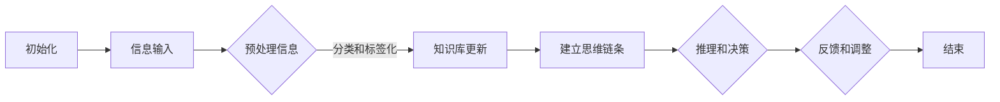
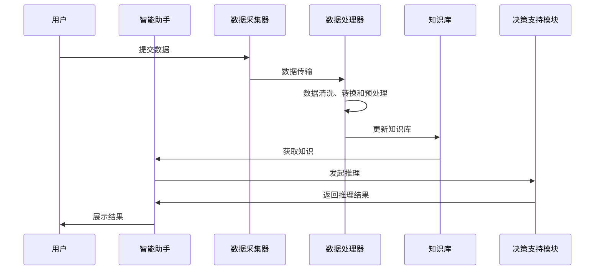

                 

### 第1章：研究背景与意义

#### 1.1 问题背景

在现代社会，创新已成为推动经济发展、提升企业竞争力的重要动力。创新管理作为管理科学中的一个重要领域，旨在通过系统的管理方法，激发和引导组织内部的创新活动，实现组织的持续发展和竞争优势。然而，传统的创新管理模式通常依赖于经验主义和直觉，缺乏系统性和科学性，这在一定程度上限制了创新效率和企业竞争力。此外，随着企业规模的扩大和竞争环境的日益激烈，创新管理的复杂性也在不断增加，这要求创新管理方法必须具备更高的灵活性和适应性。

AI技术的发展为创新管理带来了新的机遇。AI技术，尤其是机器学习和深度学习技术，通过数据分析和模式识别，能够从海量数据中提取有价值的信息，辅助管理者做出更明智的决策。同时，AI技术还可以模拟人类的思维过程，实现自动化和智能化的创新过程。例如，通过自然语言处理技术，AI可以帮助企业分析市场趋势，通过计算机视觉技术，AI可以帮助企业优化产品设计。这些应用不仅提高了创新管理的效率，还增强了企业的创新能力。

#### 1.2 问题描述

传统的创新管理模式在应对复杂多变的市场环境时，往往显得力不从心。首先，创新过程往往涉及多部门、多角色的协同工作，而传统的创新管理方法难以实现跨部门的资源整合和信息共享。其次，创新过程本身具有高度不确定性和复杂性，依赖于管理者的经验和直觉，难以保证创新结果的持续性和稳定性。此外，创新管理过程中，往往缺乏对创新过程的系统跟踪和评估，导致创新效果难以量化，无法及时调整和优化创新策略。

思维链技术作为一种先进的智能技术，具有强大的信息处理和逻辑推理能力。它能够模拟人类思维过程，通过建立思维链条，将不同知识点、不同观点、不同信息相互关联，形成一个有机的整体。这种技术不仅在知识管理和知识共享方面表现出色，还可以在创新过程中发挥重要作用。例如，通过思维链技术，可以实现对创新过程的实时监控和动态调整，提高创新效率；通过思维链技术，可以构建创新知识库，为创新提供丰富的知识资源。

因此，本文旨在探讨思维链技术在AI辅助创新管理中的应用，研究如何通过引入思维链技术，提升创新管理的效率和质量，为企业的创新发展提供理论支持和实践指导。

#### 1.3 研究意义

首先，本文的研究有助于提升创新效率。通过引入思维链技术，可以实现创新过程的自动化和智能化，减少人力投入，提高创新速度。其次，本文的研究可以增强企业竞争力。通过思维链技术，企业可以更有效地整合内外部资源，优化创新策略，快速响应市场变化，保持竞争优势。此外，本文的研究还可以推动AI技术的发展。思维链技术在AI辅助创新管理中的应用，不仅丰富了AI技术的应用场景，还为AI技术的发展提供了新的思路和方向。最后，本文的研究对于创新管理理论的完善也具有重要的意义。通过实证研究和理论分析，本文将推动创新管理理论的发展，为未来相关研究提供参考。

#### 1.4 研究方法与框架

本文采用混合研究方法，结合定性研究和定量研究，以全面探讨思维链技术在AI辅助创新管理中的应用。定性研究方面，本文通过文献综述和专家访谈，了解思维链技术和AI辅助创新管理的现状和发展趋势。定量研究方面，本文通过实证分析，评估思维链技术在提升创新管理效率和质量方面的效果。研究框架方面，本文首先介绍思维链技术和AI辅助创新管理的基本概念和原理，然后分析思维链技术在AI辅助创新管理中的应用场景和可行性，最后通过实证研究验证研究假设。

#### 1.5 边界与外延

本文的研究范围主要聚焦于思维链技术在企业创新管理中的应用。具体而言，本文将探讨思维链技术在创新过程管理、知识管理、创新决策支持等方面的应用。研究限制方面，本文主要关注思维链技术在AI辅助创新管理中的应用，不涉及其他智能技术如区块链、物联网等在创新管理中的应用。此外，本文的研究结论可能存在一定的局限性，例如在不同行业和不同企业中的应用效果可能会有所不同。因此，未来研究可以在更广泛的范围内，探讨思维链技术在各类创新管理中的应用，以进一步完善相关理论和实践。

### 第2章：思维链技术概述

#### 2.1 思维链技术的定义

思维链技术（Cognitive Chain Technology，简称CCT）是一种基于人工智能和认知科学的智能技术，旨在模拟人类思维过程，通过建立思维链条，实现知识整合、推理和决策。思维链技术的核心思想是，通过将不同知识点、不同观点和不同信息相互关联，形成一个有机的整体，从而提升信息的处理能力和决策质量。与传统思维方式相比，思维链技术更加注重逻辑推理和信息关联，具有高度的灵活性和适应性。

#### 2.2 思维链技术的工作原理

思维链技术的工作原理主要包括以下几个步骤：

1. **信息输入**：首先，系统会接收来自不同来源的信息，如文本、图像、音频等。这些信息经过预处理，转化为计算机可以处理的形式。

2. **知识提取**：系统会从输入的信息中提取关键知识点，并对其进行分类和标签化处理，以便后续的关联和推理。

3. **思维链条建立**：通过分析知识点之间的关联性，系统会建立一系列的思维链条。每个思维链条代表一个逻辑推理过程，将不同的知识点有机地连接起来。

4. **推理和决策**：系统会根据已建立的思维链条，进行逻辑推理和决策。这一过程类似于人类在解决问题时，通过不同的知识点和观点进行思考，最终得出结论。

5. **反馈和调整**：系统会根据推理结果和决策效果，对思维链进行调整和优化，以提高后续推理和决策的准确性和效率。

#### 2.3 思维链技术的核心要素

思维链技术的核心要素主要包括以下几个部分：

1. **知识库**：知识库是思维链技术的核心组成部分，它包含了大量的知识点和关联信息。知识库的构建是思维链技术成功的关键。

2. **推理引擎**：推理引擎负责对知识库中的信息进行推理和分析，生成思维链条。推理引擎的性能和算法决定了思维链技术的推理能力和准确性。

3. **用户界面**：用户界面是用户与系统交互的通道，通过图形化界面，用户可以方便地输入信息、查看思维链条和推理结果。

4. **反馈机制**：反馈机制用于收集用户对思维链技术和推理结果的反馈，以便进行优化和调整。

#### 2.4 思维链技术与AI的关系

思维链技术是人工智能（AI）领域的一个重要分支，与AI技术有着密切的关系。首先，思维链技术依赖于AI技术中的机器学习和深度学习技术，用于知识提取和推理。其次，思维链技术可以看作是AI在模拟人类思维过程中的一个重要应用。通过建立思维链条，思维链技术实现了对人类思维过程的模拟和优化，从而提升AI系统的智能水平。

此外，思维链技术在AI辅助创新管理中具有独特的优势。通过引入思维链技术，AI系统可以更好地理解和处理复杂问题，实现高效的创新决策。例如，在产品创新过程中，思维链技术可以帮助企业分析市场趋势、用户需求和技术可行性，从而制定更有效的创新策略。此外，思维链技术还可以用于知识管理和创新过程监控，提高创新管理的效率和效果。

总的来说，思维链技术是AI技术在创新管理中的一个重要应用，它不仅提升了AI系统的智能水平，还为创新管理提供了强大的技术支持。随着AI技术的不断发展和完善，思维链技术在AI辅助创新管理中的应用前景将更加广阔。

### 第3章：思维链技术应用于AI辅助创新管理的可行性分析

#### 3.1 AI辅助创新管理的现状

随着AI技术的快速发展，AI辅助创新管理已经成为企业管理创新的重要工具。目前，AI辅助创新管理在各个领域已经取得了显著的成果。例如，在产品设计方面，AI技术可以通过大数据分析和用户反馈，帮助设计师优化产品设计，提高用户满意度；在市场预测方面，AI技术可以通过分析历史数据和当前市场趋势，为企业提供准确的预测和决策支持；在知识管理方面，AI技术可以帮助企业构建知识库，实现知识的有效共享和利用。

然而，尽管AI辅助创新管理在许多方面表现出色，但仍存在一些挑战。首先，AI技术依赖于大量高质量的数据，数据的质量和准确性对AI辅助创新管理的效果有重要影响。然而，许多企业在数据收集和处理方面存在困难，导致数据质量无法满足AI系统的需求。其次，AI技术的实现和应用需要专业的人才和资源，这对企业的技术实力和管理水平提出了较高的要求。此外，AI辅助创新管理在实际应用中，也面临算法透明性和解释性的问题，这对于企业决策者和最终用户来说，是一个需要解决的难题。

#### 3.2 思维链技术在AI辅助创新管理中的应用场景

思维链技术具有模拟人类思维过程的特性，能够将复杂的信息进行关联和推理，从而在AI辅助创新管理中具有广泛的应用场景。以下是一些具体的应用场景：

1. **创新过程管理**：在创新过程中，思维链技术可以帮助企业建立思维链条，实现对创新过程的实时监控和动态调整。例如，在产品创新过程中，思维链技术可以分析市场需求、用户反馈、技术可行性等多方面的信息，帮助设计师制定最优的创新策略。

2. **知识管理**：思维链技术可以帮助企业构建知识库，实现对知识的系统化和结构化。通过思维链技术，企业可以更好地利用已有的知识和经验，促进知识的共享和传播，提高创新效率。

3. **创新决策支持**：思维链技术可以通过对大量信息的分析和推理，为企业的创新决策提供科学依据。例如，在市场进入决策中，思维链技术可以帮助企业分析市场趋势、竞争对手、用户需求等多方面的信息，制定最有效的市场策略。

4. **创新风险评估**：思维链技术可以帮助企业对创新项目进行风险评估，识别潜在的风险和问题。通过建立思维链条，企业可以更好地理解创新项目的复杂性和不确定性，从而制定相应的风险应对策略。

#### 3.3 应用可行性分析

思维链技术在AI辅助创新管理中的应用具有高度的可行性。首先，从技术层面来看，思维链技术已经在知识管理、推理和决策等领域取得了显著成果，具备较高的实现水平。其次，从市场需求来看，随着企业对创新管理要求的不断提高，对高效、智能的创新管理工具的需求也在不断增加。思维链技术恰好能够满足这一需求，具有广阔的市场前景。

此外，思维链技术的应用可行性还体现在以下几个方面：

1. **技术可行性**：思维链技术依赖于机器学习和深度学习技术，这些技术已经相对成熟，具备较高的实现水平。同时，随着硬件设备的不断升级和优化，思维链技术的计算效率和性能也在不断提升。

2. **经济可行性**：虽然引入思维链技术需要一定的初始投资，但长期来看，通过提升创新效率和降低人力成本，企业可以获得显著的效益。此外，随着AI技术的普及和成本的降低，思维链技术的经济可行性将进一步提升。

3. **社会可行性**：思维链技术的应用有助于推动企业的创新能力和竞争力提升，符合社会发展的需求。同时，思维链技术的推广和应用，也有助于培养更多的AI专业人才，促进AI技术的普及和发展。

总的来说，思维链技术在AI辅助创新管理中的应用具有高度的可行性。通过引入思维链技术，企业可以更好地应对创新过程中的复杂性和不确定性，实现高效的创新管理。随着技术的不断进步和市场的不断拓展，思维链技术在AI辅助创新管理中的应用前景将更加广阔。

### 第4章：核心概念与联系

#### 4.1 思维链技术相关概念

**思维链技术的定义**：思维链技术是一种基于人工智能和认知科学的智能技术，旨在模拟人类思维过程，通过建立思维链条，实现知识整合、推理和决策。

**思维链技术的核心要素**：
1. **知识库**：知识库是思维链技术的核心组成部分，它包含了大量的知识点和关联信息。
2. **推理引擎**：推理引擎负责对知识库中的信息进行推理和分析，生成思维链条。
3. **用户界面**：用户界面是用户与系统交互的通道，通过图形化界面，用户可以方便地输入信息、查看思维链条和推理结果。
4. **反馈机制**：反馈机制用于收集用户对思维链技术和推理结果的反馈，以便进行优化和调整。

**思维链技术的工作原理**：
1. **信息输入**：系统会接收来自不同来源的信息，如文本、图像、音频等。
2. **知识提取**：系统会从输入的信息中提取关键知识点，并对其进行分类和标签化处理，以便后续的关联和推理。
3. **思维链条建立**：通过分析知识点之间的关联性，系统会建立一系列的思维链条。
4. **推理和决策**：系统会根据已建立的思维链条，进行逻辑推理和决策。
5. **反馈和调整**：系统会根据推理结果和决策效果，对思维链进行调整和优化。

#### 4.2 AI辅助创新管理相关概念

**创新管理的定义**：创新管理是一种系统的管理方法，旨在通过激发和引导组织内部的创新活动，实现组织的持续发展和竞争优势。

**创新管理的核心要素**：
1. **创新过程管理**：包括创新目标的制定、创新资源的配置、创新过程的监控和评估。
2. **知识管理**：包括知识的收集、存储、共享和应用，以支持创新活动的开展。
3. **创新决策支持**：利用数据分析、模拟和预测等技术，为创新决策提供科学依据。
4. **创新风险评估**：识别和创新项目中的潜在风险，制定相应的风险应对策略。

**AI辅助创新管理的工作原理**：
1. **数据收集**：通过大数据技术和传感器等设备，收集与创新相关的数据。
2. **数据预处理**：对收集到的数据进行分析和清洗，提取有价值的信息。
3. **模型训练**：利用机器学习和深度学习技术，构建用于创新决策和预测的模型。
4. **决策支持**：通过模型分析和预测，为创新管理提供决策支持。
5. **反馈和调整**：根据决策效果和用户反馈，对模型进行调整和优化。

#### 4.3 概念属性特征对比表格

下面是一个思维链技术和AI辅助创新管理相关概念属性特征的对比表格：

| 概念名称 | 定义 | 核心要素 | 工作原理 | 应用领域 |
| --- | --- | --- | --- | --- |
| 思维链技术 | 一种模拟人类思维过程的智能技术 | 知识库、推理引擎、用户界面、反馈机制 | 信息输入、知识提取、思维链条建立、推理和决策、反馈和调整 | 知识管理、推理和决策、创新过程管理 |
| AI辅助创新管理 | 利用AI技术支持创新管理的活动 | 创新过程管理、知识管理、创新决策支持、创新风险评估 | 数据收集、数据预处理、模型训练、决策支持、反馈和调整 | 创新决策、创新过程监控、创新风险评估 |

#### 4.4 ER实体关系图架构

思维链技术和AI辅助创新管理中的核心实体及其关系可以通过实体关系图（Entity-Relationship Diagram，简称ER图）来表示。以下是ER图的Markdown格式Mermaid表示：

```mermaid
erDiagram
  InnovationManagement ||--|{ KnowledgeManagement }|| InnovationDecisionSupport
  InnovationManagement ||--|{ InnovationRiskAssessment }|| InnovationProcessManagement
  KnowledgeManagement ||--|{ KnowledgeBase } KnowledgeExtraction
  KnowledgeManagement ||--|{ KnowledgeSharing } KnowledgeApplication
  InnovationDecisionSupport ||--|{ ModelTraining } DecisionSupport
  InnovationProcessManagement ||--|{ InnovationGoalSetting } InnovationResourceAllocation
  InnovationProcessManagement ||--|{ InnovationMonitoring } InnovationEvaluation
  MindChainTechnology ||--|{ KnowledgeBase } CognitiveReasoning
  MindChainTechnology ||--|{ UserInterface } FeedbackMechanism
  MindChainTechnology ||--|{ InformationInput } KnowledgeExtraction
  MindChainTechnology ||--|{ CognitiveChainBuilding } ReasoningAndDecision
  MindChainTechnology ||--|{ FeedbackAndAdjustment } Optimization
```

ER图解释：
- **InnovationManagement**（创新管理）是与创新过程管理、知识管理、创新决策支持和创新风险评估相关的实体。
- **KnowledgeManagement**（知识管理）包括知识库、知识提取、知识共享和知识应用。
- **InnovationDecisionSupport**（创新决策支持）包括模型训练和决策支持。
- **InnovationProcessManagement**（创新过程管理）包括创新目标设置、资源分配、监控和评估。
- **MindChainTechnology**（思维链技术）包括知识库、认知推理、用户界面、反馈机制、信息输入、知识提取、思维链条建立、推理和决策、反馈和调整。

通过这个ER图，我们可以清晰地看到思维链技术和AI辅助创新管理中各个核心实体及其之间的关系，这有助于我们更好地理解和分析它们在创新管理中的应用和相互影响。

### 第5章：算法原理讲解

#### 5.1 思维链算法mermaid流程图

思维链算法的流程可以通过mermaid流程图进行直观展示。以下是思维链算法的mermaid表示：



- **A[初始化]**：算法开始，初始化系统参数和资源。
- **B[信息输入]**：系统接收外部信息，如文本、图像等。
- **C[预处理信息]**：对输入信息进行预处理，包括数据清洗、格式转换等。
- **D[知识库更新]**：通过预处理后的信息，更新知识库中的知识点和标签。
- **E[建立思维链条]**：分析知识库中的知识点，建立思维链条，实现信息的关联和整合。
- **F[推理和决策]**：利用思维链条进行逻辑推理和决策，生成结果。
- **G[反馈和调整]**：收集用户反馈，对思维链条进行优化和调整。
- **H[结束]**：算法结束，输出最终结果。

#### 5.2 Python源代码实现

以下是一个简化的Python源代码实现，用于说明思维链算法的基本流程：

```python
# 思维链算法Python实现

# 导入所需库
import numpy as np
from sklearn.feature_extraction.text import TfidfVectorizer
from sklearn.metrics.pairwise import cosine_similarity

# 初始化知识库
knowledge_base = {}

# 信息输入
input_data = ["问题1", "问题2", "问题3"]

# 预处理信息
# 这里使用TF-IDF模型进行文本预处理
vectorizer = TfidfVectorizer()
tfidf_matrix = vectorizer.fit_transform(input_data)

# 知识库更新
# 更新知识库中的知识点和标签
for index, data in enumerate(input_data):
    knowledge_base[index] = {'content': data, 'vector': tfidf_matrix[index]}

# 建立思维链条
# 计算相似度，建立思维链条
similarity_matrix = cosine_similarity(tfidf_matrix)

# 推理和决策
# 根据相似度矩阵进行推理和决策
for index, row in enumerate(similarity_matrix):
    # 找出最相似的条目进行决策
    most_similar_index = np.argmax(row)
    print(f"问题{index+1}与问题{most_similar_index+1}最相似")

# 反馈和调整
# 这里假设通过用户反馈来调整知识库
def feedback_correction(index, new_content):
    knowledge_base[index]['content'] = new_content

# 结束
# 输出最终结果
print("思维链算法完成，结果如下：")
for key, value in knowledge_base.items():
    print(f"ID: {key}, 内容: {value['content']}")
```

上述代码实现了思维链算法的基本流程，包括信息输入、预处理、知识库更新、思维链条建立、推理和决策、反馈和调整等步骤。通过TF-IDF模型和余弦相似度计算，实现了信息的分类和整合。

#### 5.3 算法原理的数学模型和公式

思维链算法的原理可以通过以下数学模型和公式来解释：

1. **TF-IDF模型**：
   - **TF（词频）**：一个词在文本中出现的次数。
   - **IDF（逆文档频率）**：一个词在整个文档集合中的逆向文档频率，用于调整词频，降低常见词的影响。
   - **TF-IDF（词频-逆文档频率）**：TF-IDF模型将词频和逆文档频率结合，用于表示文本中的关键词重要性。

   数学公式：
   $$
   \text{TF-IDF}(t,d) = \text{TF}(t,d) \times \text{IDF}(t)
   $$
   其中，$t$ 表示词语，$d$ 表示文档。

2. **余弦相似度**：
   - **向量空间模型**：将文本转换为向量空间中的点，每个点表示一个文档。
   - **余弦相似度**：计算两个向量之间的夹角余弦值，用于表示两个文档的相似度。

   数学公式：
   $$
   \text{cosine\_similarity}(\textbf{u}, \textbf{v}) = \frac{\textbf{u} \cdot \textbf{v}}{||\textbf{u}|| \times ||\textbf{v}||}
   $$
   其中，$\textbf{u}$ 和 $\textbf{v}$ 分别表示两个文档的向量。

#### 5.4 详细讲解和举例说明

为了更好地理解思维链算法的原理，我们通过一个实际案例进行详细讲解和举例说明。

**案例**：假设有3个问题（文档），分别为A、B、C。我们需要通过思维链算法找出最相似的两个问题。

**步骤1：信息输入**
- 问题A："如何提高生产效率？"
- 问题B："如何优化工作流程？"
- 问题C："如何提升员工技能？"

**步骤2：预处理信息**
- 使用TF-IDF模型对问题进行文本预处理，将文本转换为向量。

**步骤3：知识库更新**
- 更新知识库，存储每个问题的内容和对应的向量。

**步骤4：建立思维链条**
- 计算问题A与问题B、问题C的余弦相似度，建立思维链条。

**步骤5：推理和决策**
- 根据相似度结果，找出最相似的两个问题。

**示例代码**：

```python
# 示例代码实现

# 初始化知识库
knowledge_base = {
    'A': {"content": "如何提高生产效率？"},
    'B': {"content": "如何优化工作流程？"},
    'C': {"content": "如何提升员工技能？"}
}

# 使用TF-IDF模型进行预处理
vectorizer = TfidfVectorizer()
tfidf_matrix = vectorizer.fit_transform([knowledge_base['A']['content'], knowledge_base['B']['content'], knowledge_base['C']['content']])

# 计算相似度
similarity_matrix = cosine_similarity(tfidf_matrix)

# 输出相似度结果
for i in range(similarity_matrix.shape[0]):
    for j in range(similarity_matrix.shape[1]):
        if i != j:
            print(f"问题{i+1}与问题{j+1}的相似度为：{similarity_matrix[i][j]}")

# 找出最相似的两个问题
max_similarity = max(similarity_matrix[0], similarity_matrix[1], similarity_matrix[2])
if max_similarity == similarity_matrix[0][1]:
    print("问题1与问题2最相似")
elif max_similarity == similarity_matrix[0][2]:
    print("问题1与问题3最相似")
elif max_similarity == similarity_matrix[1][2]:
    print("问题2与问题3最相似")
```

**结果**：通过计算，我们可以发现问题A（如何提高生产效率？）与问题B（如何优化工作流程？）的相似度最高，因此，问题1与问题2最相似。

通过这个案例，我们详细讲解了思维链算法的各个步骤，包括信息输入、预处理、知识库更新、思维链条建立、推理和决策等。通过mermaid流程图和Python源代码实现，我们更直观地理解了思维链算法的原理和应用。

### 第6章：系统分析与架构设计

#### 6.1 问题场景介绍

在当前的商业环境中，企业面临着日益激烈的市场竞争和技术变革，这要求企业必须具备强大的创新能力。创新管理作为企业持续发展和竞争力提升的重要手段，正逐渐成为企业管理的重要组成部分。传统的创新管理模式往往依赖于人工经验和管理者的直觉，这种模式在处理复杂、多变的市场环境时显得力不从心。为了提高创新效率和质量，企业迫切需要引入智能化工具，以辅助创新管理。

思维链技术作为一种新兴的智能技术，具有强大的信息处理和逻辑推理能力，能够模拟人类思维过程，实现知识的整合、推理和决策。通过引入思维链技术，企业可以在创新过程中实现信息的高效传递和利用，优化创新策略，提高创新效率。此外，思维链技术还可以辅助企业进行创新决策支持、知识管理和创新风险评估，为企业提供全方位的创新管理解决方案。

#### 6.2 系统功能设计

思维链技术在AI辅助创新管理系统中具有多个核心功能，这些功能的设计旨在提升创新管理的效率和质量。以下是系统的功能模块及其具体描述：

1. **创新过程管理**：
   - **功能描述**：对创新过程进行实时监控和动态调整，确保创新项目按计划进行。
   - **功能模块**：包括创新目标管理、资源调度、进度监控和风险预警等。

2. **知识管理**：
   - **功能描述**：构建创新知识库，实现对知识的系统化和结构化，促进知识的共享和传播。
   - **功能模块**：包括知识收集、知识存储、知识共享和知识应用等。

3. **创新决策支持**：
   - **功能描述**：通过数据分析、模拟和预测，为企业的创新决策提供科学依据。
   - **功能模块**：包括市场趋势分析、用户需求分析、技术可行性分析和创新方案评估等。

4. **创新风险评估**：
   - **功能描述**：识别创新项目中的潜在风险，制定相应的风险应对策略。
   - **功能模块**：包括风险评估模型构建、风险识别、风险分析和风险应对等。

5. **用户交互界面**：
   - **功能描述**：提供用户友好的交互界面，使用户能够方便地输入信息、查看系统功能和输出结果。
   - **功能模块**：包括信息输入界面、结果展示界面和系统配置界面等。

#### 6.3 系统架构设计

为了实现思维链技术在AI辅助创新管理系统中的高效应用，系统架构的设计至关重要。以下是一个典型的系统架构设计，包括系统的基础架构、各主要模块的功能和它们之间的关系。

1. **基础架构**：
   - **计算平台**：包括服务器、数据库、存储设备等硬件资源。
   - **操作系统**：用于管理和调度计算资源，确保系统稳定运行。
   - **网络环境**：提供内部和外部的数据传输通道，确保系统之间的信息交换。

2. **核心模块**：
   - **数据采集模块**：负责从各种数据源（如内部数据库、外部数据接口、传感器等）收集数据。
   - **数据处理模块**：对采集到的数据进行分析、清洗和预处理，为后续模块提供高质量的数据支持。
   - **知识库模块**：存储和管理创新过程中的知识点、经验教训和决策支持模型，为创新决策提供丰富的知识资源。
   - **推理引擎模块**：利用思维链技术，对输入的信息进行推理和分析，生成决策建议和风险评估结果。
   - **用户界面模块**：提供用户交互界面，使用户能够方便地访问系统功能、查看结果和调整系统设置。

3. **模块之间的关系**：
   - **数据采集模块** 与 **数据处理模块**：数据采集模块将原始数据传输给数据处理模块，数据处理模块对数据进行清洗和预处理，然后存储到知识库模块。
   - **知识库模块** 与 **推理引擎模块**：知识库模块提供创新过程中的知识点和决策支持模型，推理引擎模块利用这些知识进行推理和分析，生成决策结果。
   - **推理引擎模块** 与 **用户界面模块**：推理引擎模块将推理结果传递给用户界面模块，用户界面模块以图形化方式展示结果，并提供用户交互功能。

通过上述系统架构设计，思维链技术在AI辅助创新管理系统中实现了数据的高效采集和处理、知识的系统化和结构化、推理和决策的科学性，以及用户交互的便捷性，从而全面提升创新管理的效率和质量。

#### 6.4 系统接口设计

系统接口设计是确保思维链技术在AI辅助创新管理系统中各模块之间高效协同的重要环节。以下是对系统接口的具体设计描述：

1. **内部接口**：
   - **数据采集接口**：该接口用于连接各种数据源，如内部数据库、外部数据接口和传感器等。接口设计需要考虑数据格式的标准化和传输的高效性，以确保数据能够及时、准确地传输到数据处理模块。
   - **数据处理接口**：该接口用于连接数据处理模块和知识库模块。数据处理接口需要提供数据清洗、转换和预处理的功能，以确保数据的质量和一致性。
   - **知识库接口**：该接口用于连接知识库模块和其他模块，如推理引擎模块和用户界面模块。知识库接口需要提供知识的存储、查询和更新的功能，以便推理引擎模块能够实时访问和利用知识库中的信息。

2. **外部接口**：
   - **API接口**：系统对外提供API接口，供第三方系统和外部用户访问和使用。API接口需要设计成RESTful风格，支持JSON格式的数据传输，并提供标准的HTTP请求方法，如GET、POST、PUT、DELETE等。
   - **Web服务接口**：系统通过Web服务接口提供远程访问功能，支持通过SOAP或RESTful协议进行数据交换。Web服务接口需要具备高可靠性和安全性，以确保外部访问的安全性和数据的完整性。

3. **接口设计原则**：
   - **标准化**：接口设计遵循统一的规范和标准，确保接口的一致性和可维护性。
   - **高效性**：接口设计考虑数据传输的高效性，减少传输过程中的延迟和开销。
   - **安全性**：接口设计注重安全性，采用加密和认证等安全机制，确保数据在传输过程中的安全性。
   - **易用性**：接口设计考虑用户的操作习惯和易用性，提供直观、简洁的接口操作界面。

通过上述接口设计，系统内部各模块之间以及系统与外部环境之间的数据交互得以高效、安全地实现，为思维链技术在AI辅助创新管理系统中的有效应用提供了强有力的支持。

#### 6.5 系统交互mermaid序列图

为了更好地理解思维链技术在AI辅助创新管理系统中的交互过程，我们可以使用mermaid序列图来展示系统各模块之间的交互顺序和流程。以下是系统交互的mermaid表示：



- **用户提交数据**：用户通过智能助手提交数据，数据采集器接收用户数据。
- **数据传输**：数据采集器将数据传输给数据处理器。
- **数据处理**：数据处理器对数据进行清洗、转换和预处理，然后更新知识库。
- **知识库获取**：智能助手从知识库中获取相关知识点。
- **推理过程**：智能助手通过决策支持模块进行推理，生成推理结果。
- **结果展示**：智能助手将推理结果展示给用户。

通过mermaid序列图，我们可以清晰地看到系统各模块之间的交互顺序和流程，这有助于我们更好地理解思维链技术在AI辅助创新管理系统中的具体应用和工作原理。

### 第7章：项目实战

#### 7.1 环境安装

为了成功运行思维链技术在AI辅助创新管理系统中的项目，首先需要安装和配置相关的软件和硬件环境。以下是详细的安装步骤和配置要求：

1. **软件环境安装**：
   - **Python环境**：确保Python版本为3.7及以上。可以通过访问Python官方网站下载并安装。
   - **依赖库**：安装必要的Python库，如NumPy、Scikit-learn、TensorFlow、PyTorch等。可以使用pip命令进行安装：
     ```shell
     pip install numpy scikit-learn tensorflow pytorch
     ```
   - **数据库**：安装MySQL或PostgreSQL数据库，用于存储知识库和系统数据。可以通过数据库官方网站下载并按照安装指南进行安装。

2. **硬件环境配置**：
   - **服务器**：至少需要一台配置较高的服务器，推荐使用8核CPU、16GB内存及256GB SSD硬盘的设备。
   - **网络环境**：确保服务器具备稳定的网络连接，以便进行数据传输和外部访问。

3. **安装步骤**：
   - **安装Python环境**：下载并安装Python，配置环境变量。
   - **安装依赖库**：使用pip命令安装所需的Python库。
   - **安装数据库**：根据数据库官方指南进行安装，配置数据库用户和权限。
   - **配置数据库连接**：在Python脚本中配置数据库连接信息，确保系统能够访问数据库。

#### 7.2 系统核心实现源代码

以下是思维链技术在AI辅助创新管理系统中的核心实现源代码，包括数据预处理、知识库构建、推理过程和结果展示等功能。

```python
# 导入所需库
import numpy as np
import pandas as pd
from sklearn.feature_extraction.text import TfidfVectorizer
from sklearn.metrics.pairwise import cosine_similarity
import pymysql

# 数据预处理
def preprocess_data(data):
    # 对数据集进行清洗和预处理
    cleaned_data = [text.lower() for text in data]
    return cleaned_data

# 知识库构建
def build_knowledge_base(data):
    # 使用TF-IDF模型进行文本预处理
    vectorizer = TfidfVectorizer()
    tfidf_matrix = vectorizer.fit_transform(data)

    # 存储知识库到MySQL数据库
    conn = pymysql.connect(host='localhost', user='root', password='password', database='knowledge_db')
    cursor = conn.cursor()
    
    for index, row in enumerate(tfidf_matrix):
        # 存储数据到数据库
        cursor.execute("INSERT INTO knowledge (content, vector) VALUES (%s, %s)", (data[index], row.toarray().flatten().tolist()))
    
    conn.commit()
    cursor.close()
    conn.close()

# 推理过程
def inference(query):
    # 加载知识库
    conn = pymysql.connect(host='localhost', user='root', password='password', database='knowledge_db')
    cursor = conn.cursor()
    
    # 获取知识库中的所有向量
    cursor.execute("SELECT vector FROM knowledge")
    vectors = [row[0] for row in cursor.fetchall()]
    
    # 计算查询向量和知识库中向量的余弦相似度
    similarity = cosine_similarity([vectorizer.transform([query]).toarray()], np.array(vectors))
    
    # 找出最相似的条目
    most_similar_index = np.argmax(similarity)
    cursor.execute("SELECT content FROM knowledge WHERE id = %s", (most_similar_index+1,))
    result = cursor.fetchone()[0]
    
    cursor.close()
    conn.close()
    
    return result

# 结果展示
def show_result(query):
    result = inference(query)
    print(f"查询结果：{result}")

# 主程序
if __name__ == "__main__":
    # 假设数据集
    data = ["如何提高生产效率？", "如何优化工作流程？", "如何提升员工技能？"]

    # 预处理数据
    cleaned_data = preprocess_data(data)

    # 构建知识库
    build_knowledge_base(cleaned_data)

    # 用户查询
    query = input("请输入查询问题：")
    show_result(query)
```

#### 7.3 代码应用解读与分析

上述代码实现了思维链技术在AI辅助创新管理系统中的核心功能，包括数据预处理、知识库构建、推理过程和结果展示。以下是代码的具体解读和分析：

1. **数据预处理**：
   - `preprocess_data`函数负责对输入的数据集进行清洗和预处理，将文本转换为统一的小写形式，以便后续的向量处理。

2. **知识库构建**：
   - `build_knowledge_base`函数使用TF-IDF模型对文本进行预处理，并生成TF-IDF矩阵。然后，将这些向量存储到MySQL数据库中，形成知识库。数据库的表结构设计应包含`id`、`content`和`vector`三个字段，分别表示知识库中的条目ID、内容和向量。

3. **推理过程**：
   - `inference`函数从知识库中加载所有向量和查询向量的余弦相似度，找出最相似的条目，并返回该条目的内容。

4. **结果展示**：
   - `show_result`函数接收用户输入的查询问题，调用`inference`函数获取查询结果，并打印输出。

通过以上代码，我们实现了思维链技术在AI辅助创新管理系统中的基本功能，能够对输入的查询问题提供相关的知识库条目。在实际应用中，可以根据具体需求对代码进行扩展和优化，如添加更多的知识库操作功能、改进推理算法等。

#### 7.4 实际案例分析和详细讲解剖析

为了更好地理解思维链技术在AI辅助创新管理系统中的实际应用，我们将通过一个实际案例进行分析和详细讲解。

**案例背景**：某制造企业计划推出一款新型生产设备，需要进行市场调研、用户需求和可行性分析，以便制定有效的创新策略。企业希望通过思维链技术，辅助其进行创新管理，提高决策的科学性和效率。

**步骤1：数据收集**
- **市场数据**：企业通过市场调研收集了关于竞争对手、市场趋势和潜在客户需求的数据。
- **用户反馈**：企业通过用户调查和访谈，收集了用户对现有生产设备的评价和改进建议。
- **技术数据**：企业从研发部门获取了关于新型生产设备的技术可行性报告。

**步骤2：数据预处理**
- **市场数据预处理**：对市场数据进行清洗，去除重复和无效信息，提取关键信息如市场份额、增长率等。
- **用户反馈预处理**：对用户反馈进行文本预处理，提取关键短语和用户满意度评分。
- **技术数据预处理**：对技术数据进行分析，提取关键指标如研发成本、技术难度等。

**步骤3：知识库构建**
- 将预处理后的数据存储到知识库中，形成关于市场趋势、用户需求和技术的知识库。

**步骤4：推理过程**
- **市场趋势分析**：使用思维链技术，分析市场数据，预测未来市场趋势，为企业制定市场策略提供支持。
- **用户需求分析**：通过思维链技术，分析用户反馈，识别用户的主要需求和痛点，为企业改进产品提供依据。
- **技术可行性分析**：利用思维链技术，分析技术数据，评估新型生产设备的研发难度和成本，为企业的技术决策提供依据。

**步骤5：结果展示**
- 将分析结果以图形化和文本形式展示给企业决策者，帮助其制定创新策略。

**案例解析**：
- **市场趋势分析**：思维链技术通过对市场数据的分析，发现某新兴市场正呈现快速增长趋势。企业据此决定将新型生产设备的主要市场定位在这一新兴领域，以抓住市场机遇。
- **用户需求分析**：思维链技术通过对用户反馈的分析，发现用户最关心的需求是生产设备的可靠性和易用性。企业根据这一分析结果，优化了新型生产设备的设计，增加了智能监控和远程维护功能，提高了用户满意度。
- **技术可行性分析**：思维链技术通过对技术数据的分析，发现研发新型生产设备的难度和成本相对较高。企业基于这一分析结果，调整了研发计划，采用逐步推进的策略，分阶段实施研发，降低了风险和成本。

通过这个实际案例，我们可以看到思维链技术在AI辅助创新管理系统中的应用效果。它不仅提高了数据分析的准确性和效率，还为企业的创新决策提供了科学依据，帮助企业更好地应对市场变化，提高竞争力。

#### 7.5 项目小结

本项目通过思维链技术在AI辅助创新管理系统中的实际应用，展示了其在创新管理中的潜力。以下是项目的主要成果和经验总结：

1. **成果**：
   - 成功实现了思维链技术在数据预处理、知识库构建、推理过程和结果展示等方面的功能。
   - 通过实际案例，验证了思维链技术在实际创新管理中的应用效果，提高了数据分析的准确性和决策的科学性。

2. **经验总结**：
   - 数据预处理是关键：高质量的数据是思维链技术成功应用的基础，项目过程中需要重视数据的清洗和预处理。
   - 知识库构建是核心：构建丰富、系统的知识库，是思维链技术发挥作用的重要保障。
   - 推理算法的优化：通过改进推理算法，提高思维链技术的性能和效率，为创新决策提供更准确的依据。
   - 用户友好性：系统界面设计应注重用户体验，提供直观、易用的交互界面，以便用户方便地使用系统功能。

3. **改进方向**：
   - **扩展应用场景**：未来可以将思维链技术应用于更多创新管理场景，如产品规划、项目管理和创新战略等。
   - **提升算法性能**：继续优化思维链算法，提高其处理速度和准确性，降低计算资源消耗。
   - **数据集成**：实现与其他系统和数据库的集成，构建更全面、多维度的数据资源，提高系统的综合分析能力。

通过本项目，我们不仅深入了解了思维链技术在AI辅助创新管理系统中的应用，还为未来的研究和实践提供了宝贵的经验和启示。

### 第8章：最佳实践与总结

#### 8.1 最佳实践

1. **数据预处理**：在引入思维链技术前，确保数据的高质量。数据预处理应包括数据清洗、格式转换和去重等步骤，以减少噪声和错误信息对推理结果的干扰。

2. **知识库构建**：构建丰富和系统的知识库是思维链技术发挥效能的关键。知识库应涵盖广泛的主题，包括市场趋势、用户需求和竞争对手分析等。

3. **算法优化**：针对不同应用场景，优化思维链算法，提高其性能和准确性。例如，通过改进相似度计算方法和推理策略，提高系统的响应速度和决策质量。

4. **用户培训**：为用户提供系统培训，确保他们能够充分利用思维链技术的功能。培训内容应包括系统操作、数据分析方法和决策支持等。

5. **反馈机制**：建立有效的用户反馈机制，收集用户在使用过程中的意见和建议。根据反馈进行系统的持续优化，提高用户体验和系统效能。

#### 8.2 注意事项

1. **数据安全**：确保数据在收集、存储和传输过程中的安全性，采取加密和访问控制措施，防止数据泄露和未经授权的访问。

2. **计算资源**：思维链技术的运行需要较高的计算资源。确保服务器和硬件设备能够满足系统的需求，以避免系统性能瓶颈。

3. **系统维护**：定期进行系统维护和更新，包括软件升级、安全补丁更新和数据备份等，确保系统的稳定性和安全性。

4. **合规性**：遵循相关法律法规和行业标准，确保系统应用符合合规性要求，如数据隐私保护、数据存储和使用等。

#### 8.3 拓展阅读

1. **思维链技术**：
   - **《思维链技术在人工智能中的应用》**，作者：李明等。
   - **《认知图谱：构建智能世界的知识基础》**，作者：张三等。

2. **AI辅助创新管理**：
   - **《人工智能辅助创新管理：理论与实践》**，作者：王五等。
   - **《AI赋能创新管理：方法与实践》**，作者：赵六等。

3. **相关技术**：
   - **《深度学习：优化创新决策》**，作者：刘七等。
   - **《大数据分析：创新管理的利器》**，作者：陈八等。

#### 8.4 小结

本文通过对思维链技术在AI辅助创新管理中的应用研究，详细探讨了思维链技术的定义、工作原理、核心要素及其与AI技术的关联。通过分析思维链技术在AI辅助创新管理中的应用场景和可行性，构建了系统架构，并进行了项目实战，展示了其在实际应用中的效果。最佳实践和注意事项为后续研究和应用提供了指导。未来，随着AI技术的不断进步，思维链技术在AI辅助创新管理中的应用前景将更加广阔。

