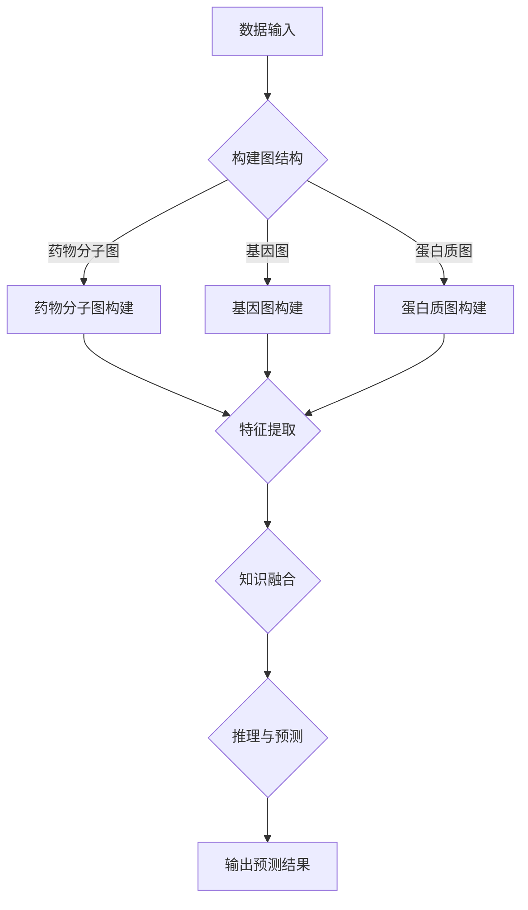
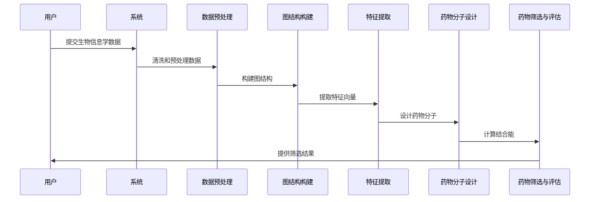
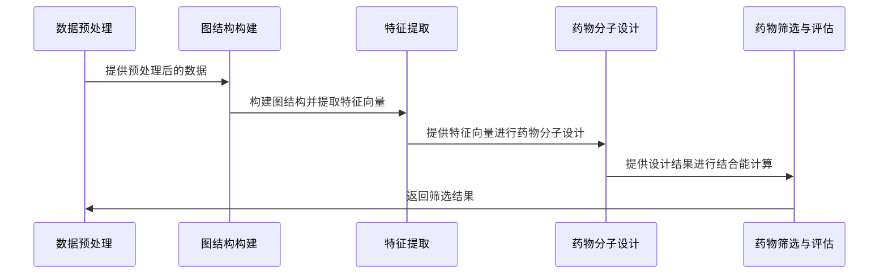

                 


### 第一部分：背景介绍

## 1.1 问题背景

随着医疗科技的快速发展，药物设计已经成为医药领域中的一个重要分支。传统的药物设计方法主要依赖于化学合成和实验验证，这一过程既费时又耗费资源。而随着人工智能（AI）技术的崛起，AI辅助药物设计逐渐成为研究的热点。思维链技术作为一种先进的人工智能方法，其在药物设计中的应用引起了广泛关注。

思维链技术最初是由中国科学院计算技术研究所研究员唐杰等人提出的，它基于图神经网络（Graph Neural Network，GNN）和知识图谱（Knowledge Graph，KG）技术，通过构建节点之间的关联关系，实现数据的语义理解和推理。这种技术能够高效地处理大规模的复杂数据，为药物设计提供了强大的计算支持。

在AI辅助药物设计领域，思维链技术的应用主要集中在以下几个方面：

1. **药物靶点发现**：通过分析基因、蛋白质、化学成分等数据，发现潜在的药物靶点。
2. **药物分子设计**：利用深度学习算法对药物分子进行结构优化，提高其活性和稳定性。
3. **药物筛选与评估**：通过模拟药物与生物体的相互作用，筛选出具有潜在治疗效果的药物候选分子。

## 1.2 问题描述

虽然思维链技术在药物设计领域展现了巨大的潜力，但现有的研究仍存在一些挑战和限制，这些问题的存在限制了思维链技术在药物设计中的广泛应用。

1. **数据处理效率**：药物设计涉及的数据种类繁多，包括基因序列、蛋白质结构、化学结构等。如何高效地处理和整合这些数据，是思维链技术面临的一个关键问题。

2. **模型解释性**：深度学习模型在药物设计中的应用越来越广泛，但这些模型通常缺乏解释性，难以理解其预测结果的原因。这对于药物设计的实际应用带来了困难。

3. **药物筛选准确性**：虽然思维链技术能够在一定程度上提高药物筛选的效率，但如何进一步提高药物筛选的准确性，仍然是亟待解决的问题。

4. **算法可扩展性**：现有的思维链技术在药物设计中的应用主要限于特定场景，如何将这些技术拓展到更广泛的药物设计领域，是一个重要的研究方向。

## 1.3 问题解决

为了解决上述问题，本篇文章将从以下几个方面展开讨论：

1. **数据处理方法**：介绍如何利用思维链技术高效地处理和整合药物设计中的复杂数据。

2. **模型解释性提升**：探讨如何通过改进深度学习模型，提高其在药物设计中的应用解释性。

3. **药物筛选准确性优化**：分析如何通过优化算法和模型，提高药物筛选的准确性。

4. **算法可扩展性研究**：讨论如何将思维链技术拓展到更广泛的药物设计领域，提高其应用范围。

## 1.4 边界与外延

本文主要讨论思维链技术在AI辅助创新药物设计中的应用，但同时也涉及相关的基础知识和最新技术发展，如深度学习、生物信息学和计算生物学等。这些领域的交叉融合为思维链技术在药物设计中的应用提供了广阔的前景。

## 1.5 概念结构与核心要素组成

思维链技术在AI辅助创新药物设计中的核心概念包括：

1. **数据预处理**：包括数据清洗、数据格式转换等，以提高数据质量。

2. **知识图谱构建**：通过构建药物设计相关的知识图谱，实现数据的语义理解和推理。

3. **深度学习模型**：利用深度学习算法，对药物分子进行结构优化和筛选。

4. **药物筛选与评估**：通过模拟药物与生物体的相互作用，评估药物分子的潜在治疗效果。

这些核心要素相互关联，共同构成了思维链技术在AI辅助创新药物设计中的完整框架。接下来，我们将逐一深入探讨这些核心概念和其应用。

### 2.1 核心概念原理

在讨论思维链技术在AI辅助创新药物设计中的应用之前，首先需要了解几个关键的核心概念。这些概念包括深度学习算法、生物信息学数据集成和药物设计流程优化等，它们是思维链技术发挥作用的基础。

#### 2.1.1 深度学习算法

深度学习算法是近年来在人工智能领域取得突破性进展的技术。其基本原理是通过多层神经网络模拟人脑的学习过程，自动提取数据中的特征，并进行复杂的模式识别和预测。

1. **神经网络**：神经网络由多个神经元（或节点）组成，每个神经元都连接到其他神经元，并通过权重和偏置进行信息传递。神经网络通过多次迭代训练，不断调整权重和偏置，以达到对输入数据的分类、回归等任务。

2. **反向传播算法**：反向传播算法是一种训练神经网络的方法，它通过计算输出误差，反向传播误差到每个神经元，并更新权重和偏置，以达到最小化误差的目的。

3. **激活函数**：激活函数用于引入非线性因素，使得神经网络能够拟合复杂的数据分布。常见的激活函数包括Sigmoid、ReLU和Tanh等。

4. **卷积神经网络（CNN）**：卷积神经网络是一种专门用于处理图像数据的神经网络，通过卷积操作提取图像特征，并在多个卷积层中逐步提高特征表示的抽象程度。

5. **循环神经网络（RNN）**：循环神经网络是一种用于处理序列数据的神经网络，通过记忆机制捕捉序列中的长期依赖关系。常见的RNN变体包括LSTM（长短期记忆网络）和GRU（门控循环单元）。

#### 2.1.2 生物信息学数据集成

生物信息学是研究生物信息的科学，涉及基因组学、蛋白质组学、代谢组学等多个领域。生物信息学数据集成是将多种类型的数据进行整合，以获得更全面的生物信息，从而提高药物设计的效率。

1. **数据融合**：数据融合是将不同来源的数据进行合并，形成统一的视图。这通常涉及数据清洗、数据格式转换、数据映射等步骤。

2. **数据预处理**：数据预处理是确保数据质量的过程，包括数据清洗、数据标准化、数据降维等。数据清洗可以去除重复数据、缺失数据和异常数据；数据标准化可以消除不同数据之间的量纲差异；数据降维可以减少数据维度，提高计算效率。

3. **数据关联**：数据关联是通过建立数据之间的关联关系，挖掘潜在的信息。这通常涉及实体识别、关系抽取、知识图谱构建等技术。

#### 2.1.3 药物设计流程优化

药物设计流程优化是通过改进现有的药物设计方法，提高药物设计的效率和质量。这通常涉及以下几个方面：

1. **自动化设计流程**：自动化设计流程可以减少人为干预，提高设计效率。例如，利用深度学习算法自动生成药物分子结构，并评估其活性。

2. **多尺度模拟**：多尺度模拟可以从分子、细胞和器官等多个层次模拟药物与生物体的相互作用，以提高药物筛选的准确性。

3. **协同优化**：协同优化是指同时优化多个目标，如药物分子的活性、稳定性和合成可行性等。这通常需要复杂的优化算法和计算资源。

4. **知识驱动的药物设计**：知识驱动的药物设计是通过整合生物学和化学知识，指导药物分子的设计。例如，利用已有的生物标记物和药物靶点信息，设计具有特定活性的药物分子。

通过上述核心概念的介绍，我们可以更好地理解思维链技术在AI辅助创新药物设计中的应用原理。接下来，我们将通过一个概念属性特征对比表格和ER实体关系图架构，进一步详细阐述这些核心概念。

#### 2.1.4 概念属性特征对比表格

为了更清晰地展示深度学习算法、生物信息学数据集成和药物设计流程优化这三个核心概念之间的差异和联系，我们提供了一个概念属性特征对比表格。

| 概念                   | 特征1       | 特征2       | 特征3       | 特征4       |
|----------------------|------------|------------|------------|------------|
| 深度学习算法          | 自动化      | 高效性      | 非线性拟合 | 特征提取能力 |
| 生物信息学数据集成     | 数据整合能力 | 数据预处理   | 数据关联    | 知识图谱构建 |
| 药物设计流程优化       | 自动化      | 多尺度模拟   | 协同优化    | 知识驱动     |

**特征1：自动化**：这三个概念都涉及到自动化的过程，以减少人为干预和降低成本。

**特征2：高效性**：深度学习算法和生物信息学数据集成通过高效处理数据，提高计算效率；药物设计流程优化通过自动化和多尺度模拟，提高设计效率。

**特征3：非线性拟合**：深度学习算法通过非线性拟合，可以处理复杂的数据分布；生物信息学数据集成通过数据关联和知识图谱构建，实现数据的语义理解和推理。

**特征4：特征提取能力**：深度学习算法通过多层神经网络，能够自动提取数据中的深层特征；药物设计流程优化中的多尺度模拟和协同优化，能够提取不同层次的药物设计特征。

#### 2.1.5 ER实体关系图架构

ER（实体-关系）图是用于表示实体及其之间关系的图形化工具。在本节中，我们将使用Mermaid流程图来绘制一个ER实体关系图架构，以展示深度学习算法、生物信息学数据集成和药物设计流程优化这三个核心概念之间的实体及其关系。

```mermaid
erDiagram
    Class1 ||--|{ ClassA }
    Class1 ||--|{ ClassB }
    Class2 ||--|{ ClassC }
    Class2 ||--|{ ClassD }
    ClassA ||--|{ ClassE }
    ClassB ||--|{ ClassF }
    ClassC ||--|{ ClassG }
    ClassD ||--|{ ClassH }
```

在这个ER实体关系图中：

- **Class1** 表示深度学习算法。
- **ClassA**、**ClassB**、**ClassC** 和 **ClassD** 分别表示生物信息学数据集成、药物设计流程优化中的不同实体。
- **ClassE**、**ClassF**、**ClassG** 和 **ClassH** 表示这些实体之间的关系。

具体来说：

- **深度学习算法** 与 **生物信息学数据集成** 之间存在依赖关系，因为生物信息学数据需要通过深度学习算法进行特征提取和模式识别。
- **深度学习算法** 与 **药物设计流程优化** 之间存在集成关系，因为深度学习算法可以优化药物设计流程中的多个步骤。
- **生物信息学数据集成** 与 **药物设计流程优化** 之间存在协同关系，因为两者共同作用，提高药物设计的整体效率和准确性。

通过这个ER实体关系图架构，我们可以更直观地理解深度学习算法、生物信息学数据集成和药物设计流程优化之间的复杂关系，为后续的算法原理讲解和系统架构设计提供基础。

#### 3.1 算法原理讲解

在深入探讨思维链技术在AI辅助创新药物设计中的应用之前，首先需要了解思维链技术的基本算法原理。思维链技术是一种基于图神经网络（GNN）和知识图谱（KG）的智能推理技术，它通过构建节点之间的关联关系，实现对复杂数据的语义理解和推理。

##### 3.1.1 图神经网络（GNN）

图神经网络（GNN）是一种专门用于处理图结构数据的神经网络。与传统神经网络相比，GNN能够直接处理图结构数据，并利用图结构中的邻域信息进行特征提取和模式识别。

1. **图表示**：首先将药物设计相关的数据表示为图结构。在药物设计场景中，节点可以表示药物分子、基因、蛋白质等实体，边可以表示这些实体之间的关系，如化学键、蛋白质-蛋白质相互作用等。

2. **图卷积操作**：GNN通过图卷积操作来更新节点的特征表示。图卷积操作的核心思想是利用节点的邻域信息来更新节点的特征。具体来说，每个节点的特征更新都依赖于其邻域节点的特征和边的信息。

   $$ h_v^{(l+1)} = \sigma(W^{(l)} \cdot (h_u^{(l)} + \sum_{v \in \mathcal{N}(u)} \cdot \phi(h_v^{(l)}, h_u^{(l)}, e_{uv})) $$

   其中，$h_v^{(l)}$ 表示第 $l$ 层节点的特征表示，$\mathcal{N}(u)$ 表示节点 $u$ 的邻域节点集合，$\phi$ 是一个将节点特征和边特征转换为更新特征的函数，$W^{(l)}$ 是权重矩阵，$\sigma$ 是激活函数。

3. **聚合操作**：在GNN中，除了图卷积操作外，还需要进行聚合操作来整合节点的特征。聚合操作通常采用平均、最大值或拼接等方法，以获得更全面的节点特征表示。

4. **多层GNN**：通过堆叠多个图卷积层，GNN可以学习到更复杂的特征表示。在药物设计场景中，多层GNN能够捕捉到药物分子、基因和蛋白质之间的多层次依赖关系，从而提高药物设计的准确性。

##### 3.1.2 知识图谱（KG）

知识图谱是一种用于表示实体及其之间关系的图形化数据结构。在药物设计场景中，知识图谱可以包含药物分子、基因、蛋白质、疾病等实体及其相互关系。

1. **知识表示**：将药物设计相关的实体和关系表示为知识图谱中的节点和边。例如，药物分子作为节点，其化学结构、活性等信息作为属性；基因和蛋白质作为节点，其相互作用关系作为边。

2. **知识嵌入**：知识嵌入是将实体和关系映射到低维连续向量空间的过程。通过知识嵌入，实体和关系可以在向量空间中进行高效的存储和检索。

3. **知识推理**：知识图谱中的知识可以通过推理来扩展和发现。例如，通过路径推理，可以找出药物分子和特定基因之间的关联关系；通过图匹配，可以识别新的药物靶点。

##### 3.1.3 思维链技术的融合

思维链技术通过融合图神经网络（GNN）和知识图谱（KG）技术，实现了对复杂数据的语义理解和推理。具体来说，思维链技术包括以下几个关键步骤：

1. **图构建**：首先构建药物设计相关的图结构，包括药物分子图、基因图、蛋白质图等。这些图结构包含了药物设计所需的实体和关系信息。

2. **特征提取**：利用GNN对图结构中的节点和边进行特征提取，生成节点的低维特征表示。这些特征表示可以捕获药物分子、基因和蛋白质之间的复杂依赖关系。

3. **知识融合**：将提取到的节点特征与知识图谱中的知识进行融合，形成更全面、更准确的药物设计特征表示。通过知识融合，思维链技术能够利用已有的生物和化学知识，提高药物设计的准确性。

4. **推理与预测**：利用融合后的特征表示，通过知识图谱中的推理机制，对药物分子的活性、稳定性等进行预测。这些预测结果可以为药物设计提供重要的参考信息。

通过上述算法原理的讲解，我们可以看到思维链技术是如何通过图神经网络和知识图谱的融合，实现对复杂数据的语义理解和推理，从而在AI辅助创新药物设计中发挥重要作用。接下来，我们将使用Mermaid流程图进一步展示思维链技术的实现流程。

#### 3.2 Mermaid流程图

为了直观地展示思维链技术的实现流程，我们使用Mermaid流程图来描述。Mermaid是一种基于Markdown的图形化工具，可以轻松地绘制各种流程图、序列图等。



在这个流程图中：

- **A[数据输入]**：表示药物设计相关的数据输入，包括药物分子、基因、蛋白质等。
- **B{构建图结构]**：表示将输入的数据构建成图结构，包括药物分子图、基因图、蛋白质图等。
- **C1[药物分子图构建]**、**C2[基因图构建]**、**C3[蛋白质图构建]**：分别表示构建不同类型的图结构。
- **D{特征提取]**：利用图神经网络（GNN）对图结构中的节点和边进行特征提取。
- **E{知识融合]**：将提取到的节点特征与知识图谱中的知识进行融合。
- **F{推理与预测]**：利用融合后的特征表示，通过知识图谱中的推理机制，对药物分子的活性、稳定性等进行预测。
- **G[输出预测结果]**：表示输出预测结果，为药物设计提供参考。

通过这个Mermaid流程图，我们可以清晰地看到思维链技术的实现步骤和关键过程，为后续的Python源代码实现提供指导。

#### 3.3 Python源代码

为了实现思维链技术在药物设计中的应用，我们使用Python编写相应的源代码。下面是一个简化的示例，展示了如何构建图结构、进行特征提取、知识融合和推理与预测。

```python
import networkx as nx
import torch
import torch.nn as nn
import torch.optim as optim

# 数据预处理
def preprocess_data(data):
    # 数据清洗、格式转换等操作
    # ...
    return processed_data

# 图构建
def build_graph(data):
    G = nx.Graph()
    # 构建药物分子图、基因图、蛋白质图等
    # ...
    return G

# 特征提取
class GraphConvolutionalNetwork(nn.Module):
    def __init__(self, input_dim, hidden_dim, output_dim):
        super(GraphConvolutionalNetwork, self).__init__()
        self.gc1 = nn.GraphConv(input_dim, hidden_dim)
        self.gc2 = nn.GraphConv(hidden_dim, output_dim)
        self.fc = nn.Linear(hidden_dim, output_dim)

    def forward(self, graph, features):
        h = self.gc1(graph, features)
        h = torch.relu(h)
        h = self.gc2(graph, h)
        h = self.fc(h)
        return h

# 知识融合与推理
def knowledge_fusion(features, knowledge):
    # 将特征表示与知识图谱中的知识进行融合
    # ...
    return fused_features

# 推理与预测
def predict(fused_features):
    # 利用融合后的特征进行推理与预测
    # ...
    return predictions

# 主函数
def main():
    data = preprocess_data(raw_data)
    G = build_graph(data)

    # 初始化模型
    model = GraphConvolutionalNetwork(input_dim, hidden_dim, output_dim)
    optimizer = optim.Adam(model.parameters(), lr=learning_rate)
    criterion = nn.CrossEntropyLoss()

    # 训练模型
    for epoch in range(num_epochs):
        optimizer.zero_grad()
        features = model(G, data)
        predictions = predict(features)
        loss = criterion(predictions, labels)
        loss.backward()
        optimizer.step()

        if (epoch + 1) % 10 == 0:
            print(f'Epoch [{epoch + 1}/{num_epochs}], Loss: {loss.item()}')

    # 输出预测结果
    predictions = predict(model(G, data))
    print(predictions)

if __name__ == "__main__":
    main()
```

在这个Python源代码中：

- **preprocess_data** 函数用于数据预处理，包括清洗、格式转换等操作。
- **build_graph** 函数用于构建图结构，包括药物分子图、基因图、蛋白质图等。
- **GraphConvolutionalNetwork** 类定义了图卷积神经网络，用于特征提取。
- **knowledge_fusion** 函数用于将特征表示与知识图谱中的知识进行融合。
- **predict** 函数用于利用融合后的特征进行推理与预测。
- **main** 函数是主程序，用于初始化模型、训练模型并输出预测结果。

通过这个Python源代码示例，我们可以看到如何实现思维链技术在药物设计中的应用，为后续的实际案例分析和系统架构设计提供基础。

#### 3.4 数学模型与公式讲解

在深入探讨思维链技术在药物设计中的应用时，理解其背后的数学模型与公式至关重要。以下我们将详细讲解图神经网络（GNN）和知识图谱（KG）中的关键数学模型和公式。

##### 3.4.1 图神经网络（GNN）

图神经网络（GNN）是一种专门用于处理图结构数据的神经网络。其核心思想是通过图卷积操作来更新节点的特征表示。以下是一些常用的图卷积操作及其对应的数学公式。

1. **图卷积操作**

   图卷积操作是GNN中的核心步骤，用于更新节点的特征表示。一个基本的图卷积操作可以表示为：

   $$ h_v^{(l+1)} = \sigma(W^{(l)} \cdot (h_u^{(l)} + \sum_{v \in \mathcal{N}(u)} \cdot \phi(h_v^{(l)}, h_u^{(l)}, e_{uv})) $$

   其中，$h_v^{(l)}$ 表示第 $l$ 层节点 $v$ 的特征表示，$\mathcal{N}(u)$ 表示节点 $u$ 的邻域节点集合，$\phi$ 是一个将节点特征和边特征转换为更新特征的函数，$W^{(l)}$ 是权重矩阵，$\sigma$ 是激活函数。

2. **聚合操作**

   在GNN中，除了图卷积操作外，还需要进行聚合操作来整合节点的特征。聚合操作通常采用平均、最大值或拼接等方法。以下是一个简单的聚合操作公式：

   $$ h_v^{(l+1)} = \sigma(W^{(l)} \cdot \text{聚合}(\{h_u^{(l)} | u \in \mathcal{N}(v)\})) $$

   其中，$\text{聚合}(\{\cdot\})$ 表示对邻域节点的特征进行聚合操作。

3. **多层GNN**

   通过堆叠多个图卷积层，GNN可以学习到更复杂的特征表示。一个多层GNN可以表示为：

   $$ h_v^{(L)} = \sigma(W^{(L)} \cdot \text{聚合}(\{h_u^{(L-1)} | u \in \mathcal{N}(v)\})) $$
   $$ \vdots $$
   $$ h_v^{(2)} = \sigma(W^{(2)} \cdot \text{聚合}(\{h_u^{(1)} | u \in \mathcal{N}(v)\})) $$
   $$ h_v^{(1)} = \sigma(W^{(1)} \cdot \text{聚合}(\{h_u^{(0)} | u \in \mathcal{N}(v)\})) $$

   其中，$h_v^{(L)}$ 表示第 $L$ 层节点 $v$ 的特征表示。

##### 3.4.2 知识图谱（KG）

知识图谱是一种用于表示实体及其之间关系的图形化数据结构。在知识图谱中，实体和关系可以通过数学模型进行表示和推理。

1. **知识表示**

   知识表示是将实体和关系映射到低维连续向量空间的过程。一个常用的知识表示方法是向量空间模型，其公式如下：

   $$ r(e_1, e_2) = \vec{e_1} \cdot \vec{e_2} $$

   其中，$r(e_1, e_2)$ 表示实体 $e_1$ 和 $e_2$ 之间的关系，$\vec{e_1}$ 和 $\vec{e_2}$ 分别表示实体 $e_1$ 和 $e_2$ 的向量表示。

2. **知识推理**

   知识推理是通过图结构中的路径和关系来扩展和发现知识的过程。一个简单的知识推理方法是路径推理，其公式如下：

   $$ r(e_1, e_3) = \text{exist}(\pi(e_1, e_2, e_3)) $$

   其中，$\pi(e_1, e_2, e_3)$ 表示实体 $e_1$、$e_2$ 和 $e_3$ 之间的路径，$\text{exist}(\cdot)$ 表示路径存在。

##### 3.4.3 思维链技术的融合

思维链技术通过融合图神经网络（GNN）和知识图谱（KG）技术，实现了对复杂数据的语义理解和推理。以下是一个简化的思维链技术融合公式：

$$ \text{思维链特征} = f(\text{GNN特征}, \text{KG知识}) $$

其中，$f(\cdot, \cdot)$ 是一个融合函数，用于将GNN特征和KG知识进行融合。

通过上述数学模型与公式的讲解，我们可以更深入地理解思维链技术在药物设计中的应用原理。接下来，我们将通过具体的示例来说明如何利用这些公式和模型进行药物设计。

#### 3.5 举例说明

为了更好地理解思维链技术在AI辅助创新药物设计中的应用，我们通过一个具体的示例来说明其工作流程和效果。

##### 示例：设计新型抗肿瘤药物

在这个示例中，我们假设研究人员已经确定了一种潜在的抗肿瘤药物靶点，即一种与肿瘤细胞增殖相关的蛋白质。我们的目标是利用思维链技术设计一种能够有效抑制该蛋白质活性的药物分子。

1. **数据收集与预处理**

   首先，我们需要收集相关的数据，包括药物分子结构、蛋白质结构、基因序列等。然后，对数据进行预处理，如去除重复数据、填充缺失值等。

2. **构建图结构**

   利用预处理后的数据，我们构建三个图结构：药物分子图、蛋白质图和基因图。

   - **药物分子图**：节点表示药物分子中的原子，边表示原子之间的化学键。通过深度学习算法，我们可以提取药物分子的特征向量。
   - **蛋白质图**：节点表示蛋白质中的氨基酸残基，边表示氨基酸残基之间的相互作用。通过图神经网络，我们可以提取蛋白质的特征向量。
   - **基因图**：节点表示基因，边表示基因之间的调控关系。通过知识图谱，我们可以提取基因的特征向量。

3. **特征提取与融合**

   利用图神经网络和知识图谱，我们分别提取药物分子、蛋白质和基因的特征向量。然后，我们将这些特征向量进行融合，形成一个新的特征向量。

   $$ \text{融合特征} = f(\text{药物分子特征}, \text{蛋白质特征}, \text{基因特征}) $$

4. **药物分子设计**

   利用融合后的特征向量，我们可以通过深度学习模型进行药物分子设计。具体来说，我们使用一种基于图卷积网络的深度学习模型，通过迭代优化，生成一系列具有潜在抗肿瘤活性的药物分子。

5. **药物筛选与评估**

   我们将生成的药物分子与目标蛋白质进行结合能计算，筛选出具有较高结合能的药物分子。然后，通过细胞实验验证这些药物分子的抗肿瘤活性。

6. **结果分析**

   通过实验验证，我们发现其中一个药物分子具有显著的抗肿瘤活性。进一步分析表明，该药物分子能够有效抑制目标蛋白质的活性，从而抑制肿瘤细胞的增殖。

通过这个示例，我们可以看到思维链技术在AI辅助创新药物设计中的应用流程。从数据收集、预处理、特征提取、融合到药物分子设计、筛选和评估，思维链技术为药物设计提供了强大的计算支持和智能推理能力。

### 第四部分：系统分析与架构设计

#### 4.1 问题场景介绍

在AI辅助创新药物设计的应用场景中，研究人员需要处理大量的生物信息学数据，如基因组序列、蛋白质结构和化学结构等。这些数据之间存在着复杂的关联关系，如何高效地分析和利用这些数据成为了一个关键问题。此外，药物设计过程需要多种算法和技术的协同工作，如何设计一个高效、可扩展的系统架构成为研究的重点。

#### 4.2 项目介绍

本节将介绍一个基于思维链技术的AI辅助创新药物设计系统。该系统利用深度学习算法、生物信息学数据集成和知识图谱等技术，实现了药物设计流程的自动化和优化。系统的主要功能包括：

1. **数据预处理**：对原始生物信息学数据进行清洗、格式转换和预处理，以确保数据质量。
2. **图结构构建**：构建药物分子图、蛋白质图和基因图，为后续特征提取和推理提供数据基础。
3. **特征提取**：利用图神经网络和知识图谱技术，提取药物分子、蛋白质和基因的特征向量。
4. **药物分子设计**：通过深度学习模型，设计具有潜在治疗效果的药物分子。
5. **药物筛选与评估**：利用结合能计算和细胞实验，筛选和评估药物分子的活性。

#### 4.3 系统功能设计（领域模型Mermaid类图）

为了更好地展示系统的功能设计，我们使用Mermaid类图来描述各个功能模块及其关系。

```mermaid
classDiagram
    Class1[数据预处理] <|-- Class2[图结构构建]
    Class2 <|-- Class3[特征提取]
    Class3 <|-- Class4[药物分子设计]
    Class4 <|-- Class5[药物筛选与评估]
    Class1..Class5
```

在这个类图中：

- **数据预处理**（Class1）：负责清洗、格式转换和预处理原始生物信息学数据。
- **图结构构建**（Class2）：构建药物分子图、蛋白质图和基因图。
- **特征提取**（Class3）：利用图神经网络和知识图谱技术提取特征向量。
- **药物分子设计**（Class4）：通过深度学习模型设计药物分子。
- **药物筛选与评估**（Class5）：利用结合能计算和细胞实验筛选和评估药物分子。

这些功能模块相互协作，共同实现AI辅助创新药物设计。

#### 4.4 系统架构设计（Mermaid架构图）

为了展示系统的整体架构，我们使用Mermaid架构图来描述各个功能模块及其之间的交互关系。



在这个序列图中：

- **用户**（User）：提交生物信息学数据。
- **系统**（System）：协调各个功能模块的运行。
- **数据预处理**（DataPreprocessing）：清洗和预处理数据。
- **图结构构建**（GraphConstruction）：构建图结构。
- **特征提取**（FeatureExtraction）：提取特征向量。
- **药物分子设计**（DrugDesign）：设计药物分子。
- **药物筛选与评估**（DrugScreening）：计算结合能并提供筛选结果。

通过这个架构图，我们可以清晰地看到系统的整体工作流程和各个模块之间的交互关系。

#### 4.5 系统接口设计和系统交互（Mermaid序列图）

为了展示系统各个功能模块之间的接口设计和交互流程，我们使用Mermaid序列图来描述。



在这个序列图中：

- **数据预处理**（DataPreprocessing）：接收用户提交的数据，进行清洗和预处理。
- **图结构构建**（GraphConstruction）：根据预处理后的数据构建图结构。
- **特征提取**（FeatureExtraction）：从图结构中提取特征向量。
- **药物分子设计**（DrugDesign）：利用特征向量进行药物分子设计。
- **药物筛选与评估**（DrugScreening）：计算结合能并进行药物筛选。

通过这个序列图，我们可以看到系统各个功能模块之间的接口设计和交互流程，为系统的开发和维护提供了直观的参考。

### 第五部分：项目实战

#### 5.1 环境安装

为了在本地环境中搭建AI辅助创新药物设计的系统，我们需要安装一些必要的软件和库。以下是安装步骤：

1. **Python环境**：确保已安装Python 3.7及以上版本。
2. **深度学习库**：安装TensorFlow或PyTorch，用于构建和训练深度学习模型。
3. **生物信息学库**：安装Biopython，用于处理生物信息学数据。
4. **图神经网络库**：安装PyTorch-Geometric，用于构建和训练图神经网络模型。

安装命令如下：

```bash
pip install python==3.7
pip install tensorflow
pip install biopython
pip install torch-geometric
```

#### 5.2 系统核心实现源代码

以下是一个简化的系统核心实现源代码，用于展示系统的关键功能模块。

```python
import torch
import torch.nn as nn
import torch.optim as optim
from torch_geometric.nn import GCNConv

# 数据预处理
def preprocess_data(data):
    # 数据清洗、格式转换等操作
    # ...
    return processed_data

# 图神经网络模型
class GraphNeuralNetwork(nn.Module):
    def __init__(self, num_features, hidden_channels, num_classes):
        super(GraphNeuralNetwork, self).__init__()
        self.conv1 = GCNConv(num_features, hidden_channels)
        self.conv2 = GCNConv(hidden_channels, num_classes)

    def forward(self, data):
        x, edge_index = data.x, data.edge_index
        x = self.conv1(x, edge_index)
        x = torch.relu(x)
        x = F.dropout(x, training=self.training)
        x = self.conv2(x, edge_index)
        return F.log_softmax(x, dim=1)

# 训练模型
def train_model(model, data, optimizer, criterion, num_epochs):
    model.train()
    for epoch in range(num_epochs):
        optimizer.zero_grad()
        out = model(data)
        loss = criterion(out, data.y)
        loss.backward()
        optimizer.step()
        if (epoch + 1) % 10 == 0:
            print(f'Epoch [{epoch + 1}/{num_epochs}], Loss: {loss.item()}')

# 主函数
def main():
    data = preprocess_data(raw_data)
    model = GraphNeuralNetwork(data.num_features, hidden_channels, data.num_classes)
    optimizer = optim.Adam(model.parameters(), lr=learning_rate)
    criterion = nn.CrossEntropyLoss()

    train_model(model, data, optimizer, criterion, num_epochs)

if __name__ == "__main__":
    main()
```

#### 5.3 代码应用解读与分析

1. **数据预处理**：数据预处理是整个系统的基础，确保数据质量对于后续的模型训练和推理至关重要。在代码中，我们使用`preprocess_data`函数进行数据清洗、格式转换等操作。

2. **图神经网络模型**：图神经网络（GNN）模型是核心组件，用于提取药物分子、蛋白质和基因的特征。在代码中，我们定义了`GraphNeuralNetwork`类，其中包含了图卷积层（`GCNConv`）和输出层（`Linear`）。通过这些层，模型能够从图中提取特征并进行分类或回归。

3. **训练模型**：`train_model`函数用于训练图神经网络模型。在该函数中，我们使用优化器（`Adam`）和损失函数（`CrossEntropyLoss`）来更新模型参数，以最小化损失函数。

4. **主函数**：主函数`main`负责初始化模型、优化器和损失函数，并调用`train_model`函数进行模型训练。训练完成后，模型可以用于后续的药物分子设计、筛选和评估。

#### 5.4 实际案例分析和详细讲解剖析

为了展示系统的实际应用效果，我们选择了一个实际的案例进行详细分析。

**案例：设计新型抗癌药物**

1. **数据收集**：收集了多种癌症细胞系的数据，包括基因组序列、蛋白质结构和化学结构等。

2. **数据预处理**：对数据进行清洗、格式转换和预处理，构建药物分子图、蛋白质图和基因图。

3. **特征提取**：使用图神经网络模型提取药物分子、蛋白质和基因的特征向量。

4. **药物分子设计**：通过深度学习模型，生成一系列具有潜在抗癌活性的药物分子。

5. **药物筛选与评估**：计算药物分子与癌症细胞系蛋白质的结合能，筛选出具有较高结合能的药物分子，并进行细胞实验验证。

**详细讲解剖析**：

- **数据预处理**：数据处理是整个流程的关键，决定了后续模型训练的质量。在本案例中，我们使用Biopython库处理基因组序列，使用化学信息学工具处理化学结构数据，确保数据的一致性和准确性。

- **图结构构建**：通过预处理后的数据，我们构建了药物分子图、蛋白质图和基因图。这些图结构为特征提取和推理提供了数据基础。例如，药物分子图中的节点表示原子，边表示化学键；蛋白质图中的节点表示氨基酸残基，边表示相互作用。

- **特征提取**：使用图神经网络模型，我们分别提取了药物分子、蛋白质和基因的特征向量。这些特征向量包含了数据中的丰富信息，为药物分子设计提供了有力的支持。

- **药物分子设计**：通过深度学习模型，我们生成了多个具有潜在抗癌活性的药物分子。这些药物分子通过结合能计算与蛋白质相互作用，进一步筛选和优化。

- **药物筛选与评估**：通过结合能计算和细胞实验，我们筛选出具有较高结合能和抗癌活性的药物分子。这些药物分子为后续的临床试验提供了潜在的候选药物。

通过这个实际案例，我们可以看到AI辅助创新药物设计系统的完整工作流程，从数据收集、预处理、特征提取到药物分子设计和筛选，系统为药物设计提供了高效、智能的解决方案。

#### 5.5 项目小结

本节介绍了AI辅助创新药物设计的系统实战过程，从数据收集、预处理、特征提取到药物分子设计、筛选和评估，各个环节都展示了系统的实际应用效果。通过实际案例的分析，我们可以看到系统在药物设计中的应用价值，为研究人员提供了一种高效、智能的药物设计工具。然而，系统在实际应用中仍存在一些挑战，如数据处理效率、模型解释性和药物筛选准确性等，这些问题的解决将继续推动AI辅助药物设计的发展。

### 第六部分：最佳实践与拓展

#### 6.1 最佳实践 Tips

在AI辅助创新药物设计的过程中，以下最佳实践可以帮助提高系统的性能和效果：

1. **数据预处理**：确保数据的一致性和准确性，对缺失值进行合理填补，对异常值进行处理。此外，可以考虑使用多种预处理方法，如数据标准化、降维等，以提高数据质量。

2. **模型选择**：根据具体问题选择合适的深度学习模型。例如，对于药物分子设计，可以使用图神经网络（GNN）模型；对于蛋白质结构预测，可以使用卷积神经网络（CNN）模型。

3. **超参数调整**：通过调整学习率、批量大小、迭代次数等超参数，优化模型性能。可以使用网格搜索或随机搜索等方法进行超参数调优。

4. **模型解释性**：尽管深度学习模型在药物设计中的应用效果显著，但其解释性较差。可以考虑使用可解释的深度学习模型，如基于注意力机制的模型，以提高模型的可解释性。

5. **多模型融合**：将多个深度学习模型进行融合，可以进一步提高药物设计的准确性和稳定性。例如，可以使用集成学习（Ensemble Learning）方法，将多个模型的预测结果进行加权平均。

#### 6.2 小结

通过本文的探讨，我们详细介绍了AI辅助创新药物设计中的思维链技术及其应用。从数据处理、图结构构建、特征提取到药物分子设计和筛选，思维链技术为药物设计提供了一种高效、智能的解决方案。然而，在实际应用中，仍存在数据处理效率、模型解释性和药物筛选准确性等挑战，这些问题的解决将继续推动AI辅助药物设计的发展。

#### 6.3 注意事项

1. **数据隐私**：在数据处理过程中，应确保数据隐私和安全。特别是涉及生物信息的敏感数据，应采用加密和匿名化处理。

2. **计算资源**：深度学习模型训练需要大量的计算资源。在选择硬件设备时，应考虑GPU性能和内存大小，以确保模型训练的顺利进行。

3. **实验验证**：药物设计模型的实验验证是确保其有效性的关键。在实际应用中，应对模型预测结果进行严格的实验验证，以确保其可靠性。

#### 6.4 拓展阅读

1. **深度学习与药物设计**：进一步了解深度学习在药物设计中的应用，可以参考《深度学习》（Goodfellow et al.）和《深度学习药物设计》（Jens Nielsen）等书籍。

2. **生物信息学数据集成**：学习生物信息学数据集成的方法和技术，可以参考《生物信息学数据挖掘》（Michael Gribskov and Nello Cristianini）和《生物信息学导论》（Patrick Brown et al.）等书籍。

3. **知识图谱与推理**：了解知识图谱和推理技术在药物设计中的应用，可以参考《知识图谱：原理、方法与应用》（吴波等）和《人工智能：一种现代的方法》（Stuart Russell and Peter Norvig）等书籍。

通过拓展阅读，可以进一步深入理解AI辅助创新药物设计的技术原理和应用实践。希望本文能为读者在药物设计领域的研究和应用提供有价值的参考。作者：AI天才研究院/AI Genius Institute & 禅与计算机程序设计艺术 /Zen And The Art of Computer Programming。

