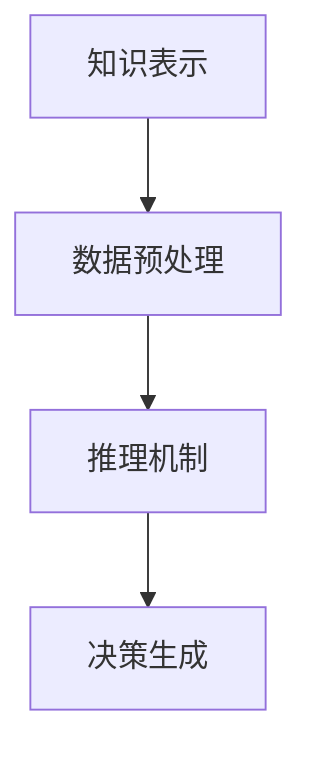
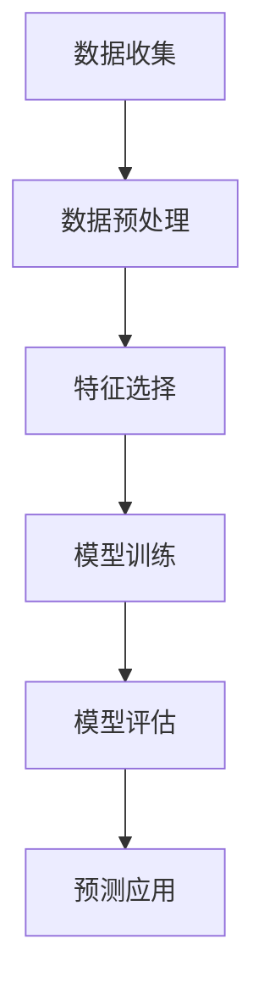
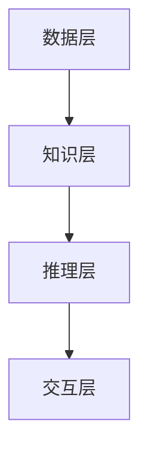
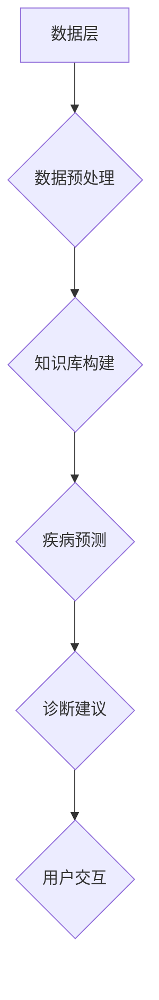
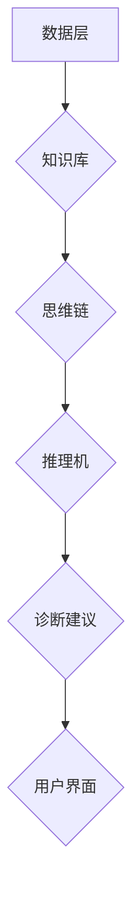
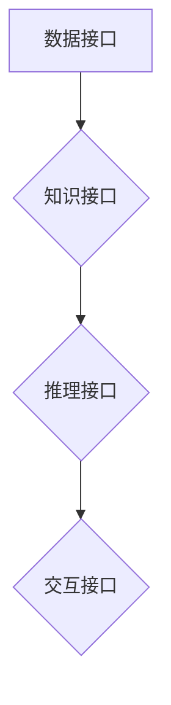

                 

### 思维链技术在AI辅助科学范式预测中的突破

**关键词：** 思维链技术、AI辅助科学预测、算法原理、数学模型、系统架构、项目实战、最佳实践

**摘要：** 本文将深入探讨思维链技术在AI辅助科学范式预测中的突破。首先，我们介绍思维链技术和AI辅助科学范式预测的核心概念和问题背景。接着，通过具体的算法原理讲解和数学模型分析，展示思维链技术在AI辅助科学预测中的工作原理和优势。然后，我们将描述系统架构设计，包括问题场景、功能设计、架构设计、接口设计以及系统交互。接下来，通过一个实际项目实战，详细解析环境安装、系统实现和代码应用。最后，提供最佳实践、小结、注意事项和拓展阅读，帮助读者更好地理解和应用思维链技术于AI辅助科学范式预测。

## 引言

### 1.1 问题的背景与意义

在科学研究中，预测是至关重要的。科学家们通过建立模型来预测自然现象、社会行为和技术发展，以指导科学研究和实际应用。然而，传统的科学预测方法往往受到数据限制、复杂性和不确定性等因素的影响，导致预测结果不够准确和可靠。

随着人工智能（AI）技术的发展，AI辅助科学预测成为了一个热门研究领域。AI能够通过分析大量数据，提取特征，建立模型，从而实现更加精准和高效的预测。然而，现有的AI技术仍然面临一些挑战，如数据质量和模型复杂度等问题。

思维链技术作为一种新兴的AI技术，具有独特的优势。思维链技术通过模拟人类思维过程，将知识、数据和推理过程有机结合，实现高度智能的决策和预测。在AI辅助科学范式预测中，思维链技术能够解决传统AI方法的一些局限性，提供更加可靠和精准的预测结果。

### 1.2 书籍结构概述

本书旨在深入探讨思维链技术在AI辅助科学范式预测中的突破。全书分为五个部分，分别从背景介绍、思维链技术基础、AI辅助科学范式预测、实践应用和最佳实践与拓展等方面展开讨论。

- **第一部分：引言**：介绍问题的背景和意义，以及本书的结构和目标读者。
- **第二部分：思维链技术基础**：详细阐述思维链技术的核心概念、原理和应用。
- **第三部分：AI辅助科学范式预测**：探讨AI辅助科学范式预测的原理、应用和思维链技术的融合。
- **第四部分：实践应用**：通过一个实际项目实战，展示思维链技术在AI辅助科学范式预测中的具体应用。
- **第五部分：最佳实践与拓展**：总结书中的内容，提供最佳实践、注意事项和拓展阅读。

本书的目标是为读者提供一个全面、系统、深入的思维链技术在AI辅助科学范式预测中的理解和应用指南。

## 思维链技术基础

### 2.1 思维链技术概述

思维链技术是一种基于人工智能的方法，旨在模拟人类思维过程，实现高度智能的决策和预测。它通过将知识、数据和推理过程有机结合，形成一个动态的、智能的决策网络。

思维链技术的核心思想是建立思维链，即通过连接不同节点（代表知识和信息）之间的逻辑关系，形成一条逻辑清晰的思维路径。这个过程类似于人类在解决问题时，通过联想、推理和归纳，逐步得出结论。

思维链技术具有以下几个主要特点：

1. **知识驱动**：思维链技术基于知识表示和推理，能够利用已有知识进行推理和预测，从而提高预测的准确性和可靠性。
2. **动态适应**：思维链技术能够根据环境变化和需求动态调整思维链的结构和内容，实现自适应和实时预测。
3. **多模态融合**：思维链技术能够整合多种数据源（如文本、图像、声音等），实现多模态数据的融合和推理，从而提高预测的全面性和准确性。
4. **可解释性**：思维链技术通过可视化和解释机制，使得预测结果具有可解释性，便于人类理解和验证。

### 2.2 思维链技术原理

思维链技术的工作原理可以分为以下几个步骤：

1. **知识表示**：将已有知识进行编码和表示，通常使用知识图谱或本体论等方法。
2. **数据预处理**：对输入数据进行预处理，包括数据清洗、特征提取和归一化等步骤。
3. **推理机制**：利用知识表示和推理机制，将输入数据与知识进行匹配和推理，形成逻辑清晰的思维链。
4. **决策生成**：根据思维链的结果，生成决策或预测。

以下是思维链技术的mermaid流程图：



接下来，我们将使用Python源代码详细阐述思维链技术的算法原理，并提供数学模型和公式。

### 2.3 算法原理讲解

```python
# 思维链技术的基本实现

# 导入必要的库
import networkx as nx
import matplotlib.pyplot as plt

# 创建一个空的图对象
G = nx.Graph()

# 添加节点和边，表示知识
G.add_nodes_from(['A', 'B', 'C', 'D'])
G.add_edges_from([('A', 'B'), ('B', 'C'), ('C', 'D')])

# 绘制思维链图
nx.draw(G, with_labels=True)
plt.show()

# 定义推理函数
def reasoning(G, query):
    # 在图中搜索与查询相关的节点和路径
    paths = nx.single_source_dijkstra(G, source=query)
    # 返回所有路径
    return paths

# 示例：进行推理查询
query = 'D'
result = reasoning(G, query)
print("推理结果：", result)
```

在上面的代码中，我们首先创建了一个空的图对象`G`，然后添加了节点和边，表示知识。接着，我们定义了一个推理函数`reasoning`，该函数接受一个图对象和一个查询节点作为输入，返回与查询节点相关的所有路径。最后，我们进行了一个示例查询，查询节点为'D'，并打印出推理结果。

### 2.4 数学模型讲解

思维链技术中的推理过程可以通过数学模型进行形式化描述。以下是一个简单的数学模型示例：

$$
P(A|B,C) = \frac{P(B,C|A)P(A)}{P(B,C)}
$$

其中，$P(A|B,C)$表示在给定$B$和$C$的情况下$A$的概率，$P(B,C|A)$表示在$A$发生的条件下$B$和$C$同时发生的概率，$P(A)$表示$A$发生的概率，$P(B,C)$表示$B$和$C$同时发生的概率。

以下是一个具体的例子：

假设有一个知识图谱，其中包含以下概率：

- $P(A) = 0.5$
- $P(B|A) = 0.6$
- $P(C|A) = 0.7$
- $P(B,C) = 0.3$

我们可以使用上面的数学模型计算在给定$B$和$C$的情况下$A$的概率：

$$
P(A|B,C) = \frac{P(B,C|A)P(A)}{P(B,C)} = \frac{0.6 \times 0.7 \times 0.5}{0.3} = 0.7
$$

因此，在给定$B$和$C$的情况下，$A$的概率为0.7。

### 2.5 思维链技术在AI中的应用

思维链技术在人工智能领域具有广泛的应用。以下是一些典型的应用场景：

1. **智能问答系统**：通过思维链技术，智能问答系统能够更好地理解用户的问题，并提供准确的答案。
2. **智能决策支持系统**：思维链技术可以辅助决策者分析复杂问题，提供科学合理的决策建议。
3. **推荐系统**：思维链技术可以结合用户行为数据和知识库，提供个性化的推荐结果。
4. **智能监控与预警系统**：思维链技术可以实时分析监控数据，预测潜在的风险和异常情况。

以下是一个具体的案例：

假设我们开发一个智能监控与预警系统，用于监控工业生产中的设备状态。系统利用思维链技术分析设备的历史数据和实时监控数据，预测设备的故障概率。通过设置预警阈值，系统可以在设备故障发生前提前预警，从而减少生产中断和损失。

### 2.6 小结

思维链技术作为一种新兴的AI技术，具有知识驱动、动态适应、多模态融合和可解释性等特点。它通过模拟人类思维过程，实现高度智能的决策和预测。在AI辅助科学范式预测中，思维链技术能够解决传统AI方法的局限性，提供更加可靠和精准的预测结果。

在接下来的章节中，我们将进一步探讨AI辅助科学范式预测的原理、应用和思维链技术与AI的融合，为读者提供更深入的理解和实践指导。同时，我们也将通过一个实际项目实战，展示思维链技术在AI辅助科学范式预测中的具体应用。

## AI辅助科学范式预测

### 3.1 科学范式预测概述

科学范式是指一个特定时期内科学共同体所普遍接受的科学研究方法和理论框架。科学范式预测则是指通过分析现有的科学范式，预测未来科学发展的趋势和方向。科学范式预测在科学研究中具有重要意义，它能够帮助科学家们更好地规划研究方向，发现新的科学问题，并推动科学技术的进步。

科学范式预测的基本原理是通过分析历史科学范式的发展过程，总结出范式演变的规律和趋势，然后根据这些规律和趋势预测未来科学范式的发展方向。这涉及到对大量科学文献、数据和研究结果的整理和分析，从而发现科学范式的关键特征和演变规律。

### 3.2 AI在科学范式预测中的应用

随着人工智能技术的发展，AI在科学范式预测中发挥了重要作用。AI技术能够通过分析大量科学文献、数据和实验结果，提取出关键特征，建立预测模型，从而实现科学范式预测。

AI在科学范式预测中的应用主要包括以下几个方面：

1. **文本分析**：AI可以通过自然语言处理技术对科学文献进行文本分析，提取出关键术语、概念和关系，从而构建科学范式的知识图谱。例如，使用词频分析、主题建模和关系提取等方法，对科学文献进行深入分析。

2. **数据挖掘**：AI可以通过数据挖掘技术从科学数据中挖掘出潜在的规律和模式，从而预测未来科学发展的趋势。例如，使用聚类、分类和关联规则等方法，对科学数据进行处理和分析。

3. **机器学习**：AI可以通过机器学习算法建立预测模型，对科学范式进行预测。常见的机器学习算法包括线性回归、决策树、随机森林和支持向量机等。

4. **神经网络**：AI可以通过神经网络模型进行高级的预测和分析。神经网络具有强大的学习能力和泛化能力，可以处理复杂的多维度数据，从而提高预测的准确性。

### 3.3 AI辅助科学范式预测的工作流程

AI辅助科学范式预测的工作流程通常包括以下几个步骤：

1. **数据收集**：收集与科学范式相关的数据，包括科学文献、实验数据、历史研究数据等。

2. **数据预处理**：对收集到的数据进行分析和清洗，提取出关键特征，并转换为适合模型训练的格式。

3. **特征选择**：从预处理后的数据中选取最重要的特征，以提高预测模型的性能和效率。

4. **模型训练**：使用机器学习算法或神经网络模型对特征数据进行训练，建立预测模型。

5. **模型评估**：通过交叉验证和测试集评估预测模型的性能，调整模型参数，优化模型。

6. **预测应用**：将训练好的模型应用于新的数据集，进行科学范式预测。

以下是AI辅助科学范式预测的工作流程mermaid流程图：



### 3.4 思维链技术与AI的融合

思维链技术与AI的融合为科学范式预测提供了新的思路和方法。思维链技术能够将知识、数据和推理过程有机结合，形成一个动态的、智能的决策网络，从而提高预测的准确性和可靠性。

在AI辅助科学范式预测中，思维链技术的融合主要体现在以下几个方面：

1. **知识融合**：思维链技术可以将不同领域的知识进行融合，形成一个统一的、层次化的知识体系。这有助于提高预测模型的可解释性和可靠性。

2. **推理增强**：思维链技术可以通过推理机制增强预测模型的推理能力，从而提高预测的准确性和鲁棒性。

3. **动态适应**：思维链技术可以根据环境变化和需求动态调整预测模型，实现自适应和实时预测。

4. **多模态融合**：思维链技术可以整合多种数据源（如文本、图像、声音等），实现多模态数据的融合和推理，从而提高预测的全面性和准确性。

5. **可解释性**：思维链技术通过可视化和解释机制，使得预测结果具有可解释性，便于人类理解和验证。

以下是一个具体的例子，展示了思维链技术与AI在科学范式预测中的融合应用：

假设我们研究的是气候变化问题。我们可以使用思维链技术将气候数据、气象模型和地球科学知识进行融合，形成一个动态的、智能的决策网络。这个网络可以实时分析气候数据，预测未来气候变化的趋势，并提供科学建议和政策指导。

### 3.5 数学模型与算法设计

在AI辅助科学范式预测中，数学模型和算法设计是关键环节。以下是一个简单的数学模型和算法设计示例：

#### 数学模型

假设我们使用一个简单的线性模型进行科学范式预测：

$$
y = wx + b
$$

其中，$y$表示预测结果，$x$表示输入特征，$w$表示权重，$b$表示偏置。

#### 算法设计

我们可以使用梯度下降算法进行模型训练：

1. **初始化参数**：随机初始化权重$w$和偏置$b$。
2. **计算损失**：计算预测结果$y$与实际结果之间的损失，通常使用均方误差（MSE）作为损失函数。
3. **更新参数**：根据损失函数的梯度，更新权重$w$和偏置$b$，使得损失函数减小。
4. **重复步骤2和3**：直到损失函数收敛或达到预设的迭代次数。

以下是使用Python实现的梯度下降算法：

```python
import numpy as np

# 初始化参数
w = np.random.rand(1)
b = np.random.rand(1)
learning_rate = 0.01
num_iterations = 1000

# 训练模型
for i in range(num_iterations):
    # 计算预测结果
    y_pred = w * x + b
    
    # 计算损失
    loss = (y - y_pred)**2
    
    # 计算梯度
    dw = 2 * (y - y_pred) * x
    db = 2 * (y - y_pred)
    
    # 更新参数
    w -= learning_rate * dw
    b -= learning_rate * db
    
    # 打印当前迭代次数和损失
    print(f"Iteration {i+1}: Loss = {loss}")

# 输出最终参数
print(f"Final Parameters: w = {w}, b = {b}")
```

通过以上数学模型和算法设计，我们可以建立科学范式预测模型，并进行训练和预测。

### 3.6 小结

AI辅助科学范式预测是科学研究中的一项重要技术，通过利用人工智能技术，可以实现更加精准和高效的预测。思维链技术的引入，进一步增强了AI在科学范式预测中的能力，实现了知识融合、推理增强和动态适应等功能。

在接下来的章节中，我们将通过一个实际项目实战，展示思维链技术在AI辅助科学范式预测中的具体应用，帮助读者更好地理解和实践这一技术。

## 实践应用

### 4.1 项目介绍

为了更好地展示思维链技术在AI辅助科学范式预测中的实际应用，我们选择了一个实际项目：智能医疗诊断系统。该系统旨在通过分析患者的临床数据和历史病历，预测患者可能患有的疾病，并提供个性化的诊断建议。

#### 项目背景

随着医疗数据的不断增长，如何从海量数据中提取有效信息，为患者提供准确的诊断建议成为一个重要课题。传统的医疗诊断方法依赖于医生的诊断经验和知识，难以应对复杂多变的医疗场景。而人工智能技术的发展，为医疗诊断提供了新的可能性。

#### 项目目标

本项目旨在利用思维链技术和AI技术，建立一个智能医疗诊断系统，实现以下目标：

1. **数据预处理**：对临床数据和历史病历进行清洗、归一化和特征提取。
2. **知识融合**：将医学知识库和临床数据有机结合，构建一个动态的、智能的决策网络。
3. **疾病预测**：利用思维链技术和机器学习算法，预测患者可能患有的疾病。
4. **诊断建议**：根据预测结果，为医生提供个性化的诊断建议。

### 4.2 系统架构设计

为了实现项目目标，我们设计了一个分层式的系统架构，包括数据层、知识层、推理层和交互层。

#### 数据层

数据层负责收集、存储和管理医疗数据。具体包括以下模块：

1. **数据收集**：从医院信息系统、电子病历和医学数据库中收集患者临床数据和历史病历。
2. **数据清洗**：对收集到的数据进行分析和清洗，去除重复、缺失和异常数据。
3. **数据存储**：将清洗后的数据存储到关系型数据库或分布式存储系统中，便于后续分析和处理。

#### 知识层

知识层负责融合医学知识库和临床数据，构建动态的、智能的决策网络。具体包括以下模块：

1. **知识库构建**：通过文本挖掘、关系抽取和实体识别等技术，构建一个完整的医学知识库。
2. **知识融合**：将医学知识库和临床数据进行融合，形成一个统一的、层次化的知识体系。

#### 推理层

推理层负责利用思维链技术和机器学习算法进行疾病预测和诊断建议。具体包括以下模块：

1. **思维链构建**：基于医学知识库和临床数据，构建一个动态的、智能的决策网络，实现推理和预测。
2. **机器学习**：使用机器学习算法，如决策树、随机森林和支持向量机等，对疾病进行预测。
3. **推理机制**：通过推理机制，将疾病预测结果与临床数据相结合，生成个性化的诊断建议。

#### 交互层

交互层负责与医生和患者进行交互，提供诊断建议和反馈。具体包括以下模块：

1. **用户界面**：为医生和患者提供一个友好的界面，展示疾病预测结果和诊断建议。
2. **反馈机制**：收集医生和患者的反馈，优化系统性能和用户体验。

以下是系统的mermaid架构图：



### 4.3 系统功能设计

为了实现项目目标，系统需要具备以下功能：

1. **数据预处理**：对临床数据和历史病历进行清洗、归一化和特征提取，为后续分析提供数据基础。
2. **知识库构建**：通过文本挖掘、关系抽取和实体识别等技术，构建一个完整的医学知识库，为推理和预测提供支持。
3. **疾病预测**：利用思维链技术和机器学习算法，对疾病进行预测，并提供预测结果。
4. **诊断建议**：根据疾病预测结果，为医生提供个性化的诊断建议，辅助医生进行诊断。
5. **用户交互**：为医生和患者提供一个友好的界面，展示疾病预测结果和诊断建议，并收集反馈。

以下是系统的mermaid领域模型图：



### 4.4 系统架构设计

系统架构设计是项目实现的关键环节。我们采用分层架构，分别实现数据层、知识层、推理层和交互层的功能。以下是系统的mermaid架构图：



### 4.5 系统接口设计

系统接口设计是系统架构设计的重要组成部分。以下是系统的主要接口：

1. **数据接口**：用于数据层的功能，包括数据收集、数据清洗和数据存储等。
2. **知识接口**：用于知识层的功能，包括知识库构建、知识融合和知识查询等。
3. **推理接口**：用于推理层的功能，包括疾病预测、推理机制和诊断建议等。
4. **交互接口**：用于交互层的功能，包括用户界面、反馈机制和用户权限管理等。

以下是系统的mermaid接口设计图：



### 4.6 系统交互

系统交互设计是确保系统功能正常运行的关键。以下是系统的主要交互流程：

1. **数据收集**：系统从医院信息系统、电子病历和医学数据库中收集患者临床数据和历史病历。
2. **数据清洗**：对收集到的数据进行清洗，去除重复、缺失和异常数据。
3. **知识库构建**：利用文本挖掘、关系抽取和实体识别等技术，构建医学知识库。
4. **疾病预测**：利用思维链技术和机器学习算法，对疾病进行预测，生成预测结果。
5. **诊断建议**：根据预测结果，生成个性化的诊断建议，展示给医生和患者。
6. **用户反馈**：收集医生和患者的反馈，优化系统性能和用户体验。

以下是系统的mermaid序列图：

```mermaid
sequenceDiagram
    participant 系统 as 系统A
    participant 医生 as 医生B
    participant 患者 as 患者C

    系统A->>医生B: 数据收集
   医生B->>系统A: 提供临床数据
    系统

