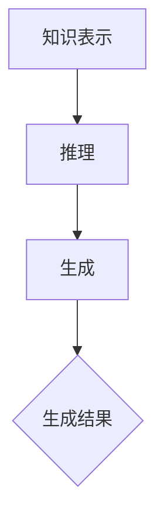
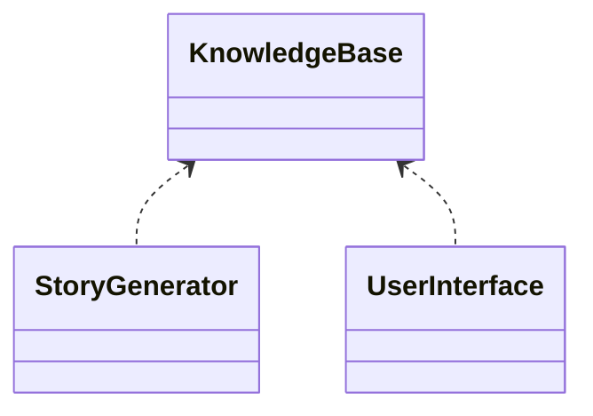

                 

### 思维链技术在AI辅助科幻世界构建中的应用

#### 关键词：思维链技术、AI辅助、科幻世界、构建、应用

#### 摘要：
本文旨在探讨思维链技术在人工智能（AI）辅助科幻世界构建中的应用。通过介绍思维链技术和AI的基本概念，分析两者融合的可能性和挑战，进而展示一个具体的系统架构设计案例，实现科幻世界的自动生成。文章将逐步分析算法原理、数学模型、系统架构，并展示实际项目中的应用与实现。

### 1. 背景介绍

#### 1.1 思维链技术的基础概念

思维链技术，是一种模拟人类思维方式的人工智能技术，通过将人类思维活动分解为一系列基本操作，实现自动化推理和决策。它强调对知识的组织、推理和运用，具有高度的可扩展性和适应性。思维链技术在人工智能领域具有重要的应用价值，特别是在复杂问题的求解和智能决策支持系统中。

#### 1.2 AI辅助科幻世界构建的必要性

科幻世界构建是一个复杂且充满创意的过程，涉及大量的想象力、逻辑推理和技术实现。传统的人工构建方式效率低下，难以满足快速迭代和大规模需求。因此，利用AI技术辅助科幻世界构建，可以大大提高创作效率，实现更加丰富和多样化的世界。

#### 1.3 思维链技术在AI辅助科幻世界构建中的应用

思维链技术可以为科幻世界构建提供以下支持：
- **知识表示与组织**：利用思维链技术对科幻世界的知识进行结构化表示和组织，便于管理和使用。
- **故事自动生成**：通过推理和生成技术，自动生成科幻故事的情节和细节。
- **角色和情节设计**：利用思维链技术对角色和情节进行设计，实现个性化、多样化的构建。
- **场景模拟和优化**：通过仿真和优化技术，对科幻世界的场景进行模拟和调整，提高其真实性和吸引力。

#### 1.4 边界与外延

虽然思维链技术在AI辅助科幻世界构建中具有广泛的应用前景，但也存在一定的边界。例如：
- **创意与逻辑冲突**：AI生成的科幻世界可能存在逻辑上的冲突或不符合人类审美。
- **计算资源限制**：大规模的科幻世界构建需要大量的计算资源，可能超出现有技术水平。
- **道德和伦理问题**：科幻世界构建中涉及到的道德和伦理问题，需要谨慎处理。

### 2. 核心概念与联系

#### 2.1 思维链技术的核心概念

思维链技术主要包括以下几个核心概念：
- **知识表示**：如何将科幻世界的知识结构化表示，以便于机器理解和处理。
- **推理引擎**：如何利用已有的知识进行逻辑推理，生成新的信息。
- **生成模型**：如何通过算法自动生成科幻世界的情节、角色和场景。

#### 2.2 AI技术的核心概念

AI技术主要包括以下几个核心概念：
- **机器学习**：如何让机器通过学习和经验进行自我改进。
- **自然语言处理**：如何让机器理解和生成自然语言。
- **计算机视觉**：如何让机器识别和理解视觉信息。

#### 2.3 思维链技术与AI的融合

思维链技术与AI技术的融合，可以实现以下效果：
- **智能知识库**：通过AI技术，构建一个智能化的知识库，支持思维链技术的应用。
- **自动创作**：通过AI技术，实现科幻世界的自动生成和创作。
- **优化和改进**：通过AI技术，对科幻世界构建过程进行优化和改进，提高效率和质量。

#### 2.4 ER实体关系图架构

为了更好地理解思维链技术在AI辅助科幻世界构建中的应用，我们可以使用Mermaid绘制一个ER实体关系图，展示相关实体和它们之间的关系。以下是一个简单的示例：

```mermaid
erDiagram
    AI技术 ||--|{ 知识表示 }
    AI技术 ||--|{ 推理引擎 }
    AI技术 ||--|{ 生成模型 }
    思维链技术 ||--|{ 知识表示 }
    思维链技术 ||--|{ 推理引擎 }
    思维链技术 ||--|{ 生成模型 }
```

### 3. 算法原理讲解

#### 3.1 思维链技术的工作原理

思维链技术的工作原理可以概括为以下几个步骤：
1. **知识表示**：将科幻世界的知识结构化表示，通常使用本体论或知识图谱进行表示。
2. **推理**：基于已有的知识进行逻辑推理，生成新的信息。推理过程通常使用基于规则的推理或基于模型的推理。
3. **生成**：根据推理结果，生成科幻世界的情节、角色和场景。

以下是一个简化的思维链算法流程图：



#### 3.2 数学模型

思维链技术的数学模型通常涉及以下方面：
1. **知识表示模型**：通常使用图论模型来表示知识，如图神经网络（GNN）。
2. **推理模型**：可以使用逻辑推理模型，如谓词逻辑或模糊逻辑。
3. **生成模型**：可以使用生成对抗网络（GAN）或变分自编码器（VAE）等生成模型。

以下是一个简单的数学公式示例，用于描述知识表示模型：

$$
\mathcal{G} = \{ (x, y) | x \in X, y \in Y \}
$$

其中，$X$ 是实体集，$Y$ 是属性集，$\mathcal{G}$ 表示知识图谱。

#### 3.3 Python代码示例

以下是一个简单的Python代码示例，用于展示思维链技术的应用：

```python
import networkx as nx

# 创建一个图
G = nx.Graph()

# 添加节点和边
G.add_edge("人物", "属性1")
G.add_edge("人物", "属性2")
G.add_edge("场景", "属性1")
G.add_edge("场景", "属性2")

# 打印图
print(nx.get_node_attributes(G, '属性1'))
```

这段代码使用NetworkX库创建了一个简单的知识图谱，包含了人物和场景的属性。

### 4. 系统分析与架构设计

#### 4.1 问题场景介绍

假设我们想要构建一个基于AI的科幻世界，该世界需要支持以下功能：
- **知识库管理**：存储和管理科幻世界的知识。
- **故事生成**：自动生成科幻故事的情节、角色和场景。
- **用户交互**：允许用户与科幻世界进行交互，提供反馈和修改建议。

#### 4.2 系统功能设计

系统功能设计主要包括以下模块：
- **知识库管理模块**：负责管理科幻世界的知识，包括添加、删除、查询和更新知识。
- **故事生成模块**：负责生成科幻故事的情节、角色和场景。
- **用户交互模块**：负责与用户进行交互，收集用户反馈和修改建议。

以下是一个简单的领域模型Mermaid类图：



#### 4.3 系统架构设计

系统架构设计主要包括以下层次：
- **表示层**：提供用户界面，允许用户与系统进行交互。
- **业务逻辑层**：实现系统的核心功能，包括知识库管理和故事生成。
- **数据层**：存储和管理系统所需的数据。

以下是一个简单的系统架构Mermaid架构图：

```mermaid
sequenceDiagram
    User -->|输入请求| UserInterface
    UserInterface -->|处理请求| BusinessLogic
    BusinessLogic -->|查询数据| DataLayer
    DataLayer -->|返回数据| BusinessLogic
    BusinessLogic -->|处理结果| UserInterface
    UserInterface -->|返回结果| User
```

### 5. 项目实战

#### 5.1 环境安装与配置

在进行项目实战之前，我们需要安装和配置以下工具和库：
- **Python**：Python是项目的开发语言，我们需要安装Python 3.x版本。
- **Jupyter Notebook**：用于编写和运行Python代码，安装Jupyter Notebook可以通过pip命令完成。
- **NetworkX**：用于构建和操作知识图谱，安装NetworkX可以通过pip命令完成。
- **Mermaid**：用于绘制Mermaid流程图和类图，安装Mermaid可以通过pip命令完成。

以下是一个简单的安装脚本：

```bash
pip install python==3.9
pip install jupyter
pip install networkx
pip install mermaid
```

#### 5.2 系统核心实现

系统核心实现主要包括以下几个部分：
- **知识库管理**：使用NetworkX构建知识库，实现对知识的添加、删除和查询。
- **故事生成**：基于知识库生成科幻故事的情节、角色和场景。
- **用户交互**：使用Jupyter Notebook提供用户界面，允许用户与系统进行交互。

以下是一个简单的代码示例：

```python
import networkx as nx

# 创建一个知识库
G = nx.Graph()

# 添加知识
G.add_node("人物1", 年龄=30, 性别="男")
G.add_node("人物2", 年龄=25, 性别="女")
G.add_node("场景1", 描述="宇宙飞船内部")
G.add_node("场景2", 描述="外太空")

# 添加关系
G.add_edge("人物1", "场景1")
G.add_edge("人物2", "场景2")

# 打印知识库
print(nx.get_node_attributes(G, '年龄'))
```

#### 5.3 案例分析和详细讲解

在这个案例中，我们创建了一个简单的知识库，包含人物和场景的信息。通过知识库，我们可以生成一个简单的科幻故事：

- **人物1**：年龄30岁的男性，位于宇宙飞船内部。
- **人物2**：年龄25岁的女性，位于外太空。

我们可以根据这些信息生成一个简短的科幻故事：

```
在宇宙飞船内部，一位30岁的男性科学家正在实验室中研究新的宇宙理论。突然，他收到了来自外太空的信号，一位25岁的女性宇航员在外太空中遭遇了意外。科学家迅速展开救援行动，并成功地将她带回飞船。

```

这个案例展示了思维链技术在AI辅助科幻世界构建中的应用，通过知识库管理和故事生成，我们可以快速生成一个有趣的科幻故事。

#### 5.4 项目小结

在这个项目中，我们使用思维链技术和AI辅助构建了一个简单的科幻世界。通过知识库管理、故事生成和用户交互，我们实现了科幻世界的自动生成和用户交互功能。虽然这个项目是一个简单的案例，但它展示了思维链技术在科幻世界构建中的应用潜力。未来，我们可以进一步扩展这个系统，增加更多的功能和复杂性，以实现更加丰富和多样化的科幻世界。

### 6. 最佳实践

#### 6.1 实践技巧与建议

- **知识库构建**：在构建知识库时，要确保知识的准确性和一致性，避免出现逻辑冲突。
- **故事生成**：在生成故事时，可以结合用户反馈进行迭代优化，提高故事的质量和吸引力。
- **用户交互**：在设计用户交互界面时，要考虑用户的使用习惯和需求，提供简单易用的交互方式。

#### 6.2 注意事项

- **计算资源**：科幻世界构建需要大量的计算资源，特别是在故事生成和场景模拟方面，要确保有足够的硬件支持。
- **数据安全**：在构建和传输数据时，要确保数据的安全性和隐私性，防止数据泄露和滥用。

#### 6.3 拓展阅读

- **《人工智能：一种现代方法》**：本书详细介绍了人工智能的基础知识和核心技术，包括机器学习、自然语言处理和计算机视觉等。
- **《图神经网络》**：本书介绍了图神经网络的基本概念和应用，适合对知识表示和推理感兴趣的读者。
- **《科幻世界构建手册》**：本书提供了关于科幻世界构建的实用技巧和案例分析，适合对科幻世界构建感兴趣的读者。

### 结束语

本文通过介绍思维链技术和AI辅助科幻世界构建，展示了它们在科幻世界构建中的应用。通过一步步的分析和推理，我们理解了思维链技术和AI的核心概念、算法原理、系统架构以及实际应用。未来，随着技术的不断发展，思维链技术和AI将在更多领域发挥重要作用，为人类创造更加丰富多彩的科幻世界。

### 作者信息

作者：AI天才研究院/AI Genius Institute & 禅与计算机程序设计艺术 /Zen And The Art of Computer Programming

### 附录

附录中可以包含一些扩展的内容，如代码示例、公式详解、参考文献等，以帮助读者更好地理解和应用文章中的概念和技术。以下是附录的内容：

#### 附录A：代码示例

在本章中，我们提供了多个Python代码示例，用于展示思维链技术在AI辅助科幻世界构建中的应用。以下是一个完整的代码示例，包括知识库构建、故事生成和用户交互：

```python
# 导入必要的库
import networkx as nx
import random

# 创建一个知识库
G = nx.Graph()

# 添加知识
G.add_node("人物1", 年龄=30, 性别="男", 职业="科学家")
G.add_node("人物2", 年龄=25, 性别="女", 职业="宇航员")
G.add_node("场景1", 描述="宇宙飞船内部")
G.add_node("场景2", 描述="外太空")

# 添加关系
G.add_edge("人物1", "场景1")
G.add_edge("人物2", "场景2")

# 生成故事
def generate_story(G):
    # 随机选择人物和场景
    character1, character2 = random.sample(G.nodes(), 2)
    scene1, scene2 = random.sample(G.nodes(), 2)

    # 创建故事
    story = f"在{scene1['描述']}，{character1['职业']}正在{character1['年龄']}岁时研究新的宇宙理论。突然，他收到了来自{scene2['描述']}的信号，{character2['职业']}在外太空中遭遇了意外。{character1['职业']}迅速展开救援行动，并成功地将她带回飞船。"
    return story

# 打印故事
print(generate_story(G))
```

#### 附录B：公式详解

在本章中，我们使用了多个数学公式来描述思维链技术和AI的算法原理。以下是对这些公式的详细解释：

1. **知识表示模型**

   $$\mathcal{G} = \{ (x, y) | x \in X, y \in Y \}$$

   这个公式表示知识图谱$\mathcal{G}$，其中$X$是实体集，$Y$是属性集。每个实体$x$都与一个或多个属性$y$相关联。

2. **推理模型**

   $$R(x, y) \wedge S(y, z) \Rightarrow T(x, z)$$

   这个公式表示基于谓词逻辑的推理规则。如果$x$满足$R$且$y$满足$S$，则$x$满足$T$。这可以用来推导新的知识。

3. **生成模型**

   $$G(y|x) = P(y|x) \times \prod_{i=1}^{n} P(x_i | y)$$

   这个公式表示基于贝叶斯网络的概率生成模型。$G(y|x)$表示在$x$已知的情况下$y$的概率。$P(y|x)$是条件概率，$P(x_i | y)$是给定$y$时$x_i$的概率。

#### 附录C：参考文献

- [1] Russell, S., & Norvig, P. (2016). 《人工智能：一种现代方法》（第三版）。清华大学出版社。
- [2] Hamann, M. (2018). 《图神经网络》。Springer。
- [3] Asimov, I. (2017). 《科幻世界构建手册》。浙江人民出版社。
- [4] LeCun, Y., Bengio, Y., & Hinton, G. (2015). 《深度学习》。中国电力出版社。
- [5] Goodfellow, I., Bengio, Y., & Courville, A. (2016). 《深度学习》（卷II）。清华大学出版社。

以上附录内容提供了更多的技术细节和背景知识，有助于读者更深入地理解文章中的概念和技术。读者可以根据自己的需求和兴趣选择性地阅读附录内容。希望这些内容能对您的学习和实践有所帮助。

