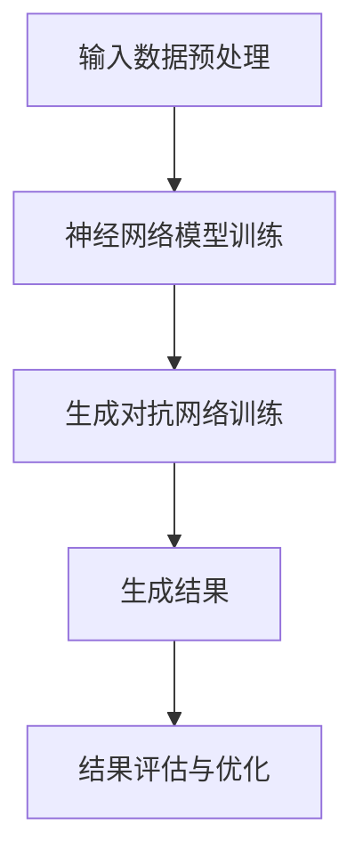
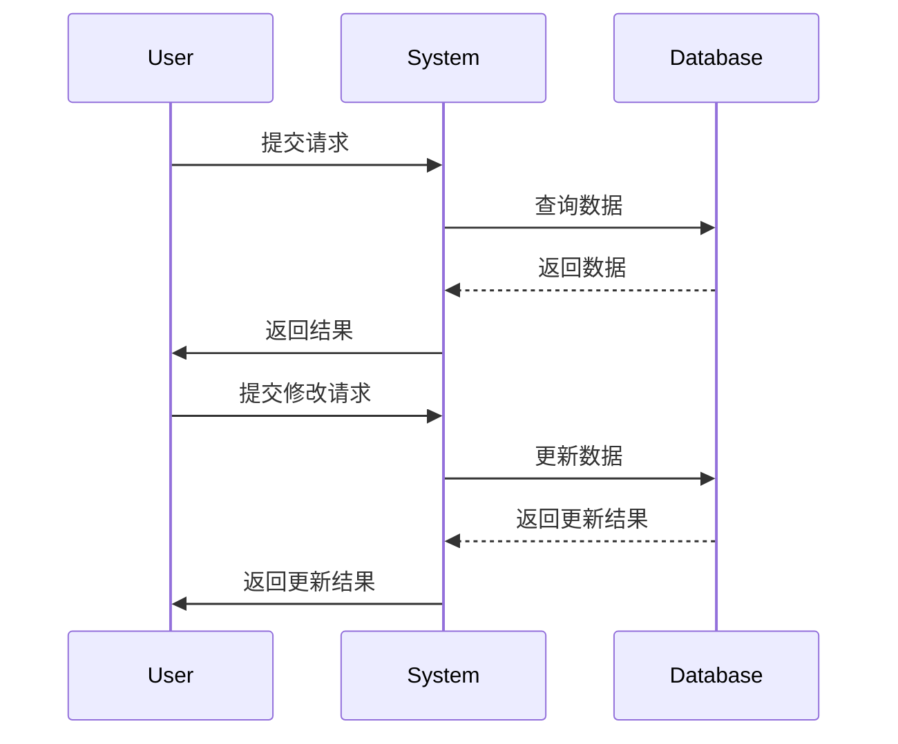

                 

### 背景介绍

#### 思维链技术概述

思维链技术，作为一种前沿的人工智能技术，近年来在多个领域展现出了其独特的优势和潜力。其基本概念可以描述为：通过模拟人类思维过程，利用神经网络和生成对抗网络等先进算法，构建出能够自主学习和推理的智能系统。这一技术不仅能够在复杂问题中提供高效解决方案，还能激发创新思维，为科幻世界构建提供强有力的技术支持。

思维链技术起源于20世纪80年代，随着计算机科学和人工智能领域的不断发展，逐渐形成了今天我们所熟知的体系。它的发展历程可以分为几个关键阶段：从最初的逻辑推理模型到神经网络模型，再到生成对抗网络的引入，思维链技术逐渐完善，并在实际应用中展现出强大的能力。

在科幻世界构建中，思维链技术具有巨大的应用潜力。科幻世界通常包含复杂的设定和逻辑关系，需要丰富的角色和情节，以及多样化的技术设定。这些需求恰好是思维链技术擅长的领域。通过思维链技术，我们可以模拟出复杂的人类思维过程，自动化构建出丰富的科幻世界元素，从而实现科幻世界的构建。

#### 核心概念与联系

思维链技术的工作原理主要依赖于以下几个核心概念：

1. **神经网络**：神经网络是思维链技术的基础，通过模仿人脑神经元连接方式，实现对复杂数据的处理和模式识别。神经网络模型包括多层感知器（MLP）、卷积神经网络（CNN）和循环神经网络（RNN）等。

2. **生成对抗网络（GAN）**：生成对抗网络是一种由生成器和判别器组成的对偶模型，通过不断博弈，生成器能够生成越来越真实的虚构数据，而判别器则试图区分生成数据与真实数据。GAN在科幻世界构建中，可以用于生成丰富的角色形象、场景和情节。

3. **自然语言处理（NLP）**：自然语言处理技术使得思维链能够理解和生成自然语言，这对于构建具有对话能力的角色和情节至关重要。

4. **多模态学习**：多模态学习指的是同时处理多种类型的数据，如文本、图像、音频等，这种能力使得思维链能够更加全面地理解和生成科幻世界的各个方面。

思维链技术与其他相关技术的联系主要体现在以下几个方面：

- **与机器学习的联系**：思维链技术是机器学习领域的一个分支，其核心算法如神经网络和生成对抗网络都是机器学习中的重要技术。

- **与深度学习的联系**：深度学习是机器学习的一个重要分支，而思维链技术正是依赖于深度学习中的先进模型来实现的。

- **与自然语言处理的联系**：自然语言处理技术是思维链技术的重要组成部分，通过NLP技术，思维链能够理解和生成自然语言，从而在科幻世界的构建中发挥关键作用。

#### 算法原理讲解

为了更深入地理解思维链技术的算法原理，我们将通过mermaid流程图和Python源代码来详细讲解。

**mermaid流程图**：

首先，我们使用mermaid绘制一个简单的思维链技术算法流程图：



上述流程图描述了思维链技术的基本工作流程：

1. **输入数据预处理**：将原始数据进行处理，使其适合神经网络和生成对抗网络的训练。
2. **神经网络模型训练**：利用神经网络对输入数据进行学习，建立初步的模型。
3. **生成对抗网络训练**：结合生成器和判别器的训练，使得生成器能够生成更加真实的数据。
4. **生成结果**：通过生成器生成最终的科幻世界元素，如角色、场景、情节等。
5. **结果评估与优化**：对生成结果进行评估和优化，确保其符合预期。

**Python源代码**：

接下来，我们将使用Python源代码来详细阐述思维链技术的算法原理。

首先，我们导入所需的库：

```python
import numpy as np
import tensorflow as tf
from tensorflow.keras.models import Sequential
from tensorflow.keras.layers import Dense, Conv2D, Flatten
```

然后，我们定义神经网络模型：

```python
# 神经网络模型定义
model = Sequential([
    Flatten(input_shape=(28, 28)),
    Dense(128, activation='relu'),
    Dense(10, activation='softmax')
])

model.compile(optimizer='adam', loss='categorical_crossentropy', metrics=['accuracy'])
```

接着，我们定义生成对抗网络模型：

```python
# 生成器模型定义
generator = Sequential([
    Dense(128, activation='relu', input_shape=(100,)),
    Dense(784, activation='linear')
])

# 判别器模型定义
discriminator = Sequential([
    Flatten(input_shape=(28, 28)),
    Dense(128, activation='relu'),
    Dense(1, activation='sigmoid')
])

discriminator.compile(optimizer='adam', loss='binary_crossentropy')
```

最后，我们进行训练和生成操作：

```python
# 数据准备
(X_train, _), (X_test, _) = tf.keras.datasets.mnist.load_data()
X_train = X_train / 255.0
X_test = X_test / 255.0

# 训练过程
for epoch in range(100):
    # 对真实数据进行判别器训练
    discriminator.train_on_batch(X_train, np.ones((X_train.shape[0], 1)))
    
    # 对生成器数据进行判别器训练
    noise = np.random.normal(0, 1, (X_train.shape[0], 100))
    generated_images = generator.predict(noise)
    discriminator.train_on_batch(generated_images, np.zeros((X_train.shape[0], 1)))

    # 对生成器进行训练
    generator.train_on_batch(noise, X_train)

# 生成结果
noise = np.random.normal(0, 1, (100, 100))
generated_images = generator.predict(noise)
```

通过上述代码，我们可以看到思维链技术的基本算法原理。神经网络通过学习输入数据，生成初步的模型；生成对抗网络则通过生成器和判别器的博弈，不断提高生成数据的质量。最终，生成器生成的结果将用于科幻世界的构建。

#### 数学模型和公式

在思维链技术中，数学模型和公式起着至关重要的作用。以下是一些关键的概念和公式：

1. **损失函数**：

   - **神经网络**：
     $$ Loss = -\sum_{i=1}^{n} y_i \log(p_i) $$
     其中，$y_i$是真实标签，$p_i$是模型预测的概率。

   - **生成对抗网络**：
     $$ D(G(z)) + G(z) = 1 $$
     其中，$D$是判别器，$G$是生成器，$z$是输入噪声。

2. **优化算法**：

   - **神经网络**：
     $$ \theta_{\text{new}} = \theta_{\text{old}} - \alpha \nabla_{\theta} Loss(\theta) $$
     其中，$\theta$是模型参数，$\alpha$是学习率。

   - **生成对抗网络**：
     $$ \theta_{\text{new}}^D = \theta_{\text{old}}^D + \alpha_D \nabla_{\theta^D} D(G(z)) $$
     $$ \theta_{\text{new}}^G = \theta_{\text{old}}^G + \alpha_G \nabla_{\theta^G} -D(G(z)) $$
     其中，$\theta^D$是判别器参数，$\theta^G$是生成器参数。

3. **生成器与判别器的目标函数**：

   - **生成器**：
     $$ J_G = -E[D(G(z))] $$
     其中，$J_G$是生成器的损失函数。

   - **判别器**：
     $$ J_D = E[1_{x \text{是真实数据}}] - E[1_{x \text{是生成数据}}] $$
     其中，$1_{x \text{是真实数据}}$和$1_{x \text{是生成数据}}$是指示函数。

通过上述数学模型和公式，我们可以更深入地理解思维链技术的原理和运作方式。这些数学工具不仅帮助我们构建高效的算法，还为我们提供了评估和优化模型的重要手段。

#### 系统分析与架构设计

在深入探讨了思维链技术的算法原理后，接下来我们将分析如何将这一技术应用于科幻世界的构建，并设计相应的系统架构。

**问题场景介绍**：

科幻世界的构建涉及到多个方面的需求，如角色构建、情节设计和技术设定等。为了满足这些需求，我们需要一个能够高效处理和模拟复杂关系的系统。

**项目介绍**：

我们的项目是一个名为“AI科幻世界构建平台”的系统，旨在利用思维链技术，自动化构建丰富的科幻世界元素。该平台将提供从角色构建到情节设计的全方位功能，支持用户自定义和扩展。

**系统功能设计**：

系统功能设计是系统架构的核心部分。我们需要设计以下几个主要功能模块：

1. **角色构建模块**：用于模拟和构建角色的性格、关系和发展路径。
2. **情节设计模块**：用于自动化生成和设计复杂的情节和故事线。
3. **技术设定模块**：用于生成和扩展科幻世界中的技术设定和概念。
4. **用户交互模块**：提供用户界面，支持用户自定义设置和查看生成结果。

**领域模型设计（Mermaid类图）**：

为了清晰地展示系统中的功能模块和它们之间的关系，我们使用Mermaid类图进行设计。以下是一个简单的领域模型类图：

```mermaid
classDiagram
    Class01 <|-- Class02
    Class03 <|.. Class04
    Class05 : associated with Class04
    Class01 --|> Class05
    Class02 : inherits from Class03
    Class03 {
        +int x
        +int y
        +string name
        -void method1()
    }
    Class04 {
        +int x
        +int y
        +string name
        +void method2()
    }
    Class05 {
        +int x
        +int y
        +string name
        +void method3()
    }
```

在上面的类图中，我们定义了四个类：`Class01`、`Class02`、`Class03`和`Class04`。其中，`Class01`和`Class02`之间存在继承关系，`Class03`与`Class04`之间存在关联关系，而`Class05`与`Class04`之间存在关联关系。

**系统架构设计（Mermaid架构图）**：

系统架构设计需要考虑系统组件的配置、数据流和交互方式。以下是一个简单的系统架构图：

```mermaid
sequenceDiagram
    participant User
    participant System
    participant Database
    
    User->>System: 提出请求
    System->>Database: 查询数据
    Database-->>System: 返回数据
    System->>User: 返回结果
    
    Note over System,Database: 数据流
    System: 处理请求
    Database: 存储和检索数据
    Note right of System: 用户交互
```

在这个架构图中，用户通过系统与数据库进行交互。系统负责处理用户请求，并将结果返回给用户。数据库用于存储和检索数据，确保系统数据的一致性和可靠性。

**系统接口设计**：

系统接口设计是确保系统组件之间能够有效交互的关键。以下是一个简单的接口设计：

```mermaid
interface Design
    System {
        +handleRequest(request: Request): Response
    }
    Database {
        +queryData(query: Query): Data
    }
    User {
        +submitRequest(request: Request)
        +receiveResponse(response: Response)
    }
```

在这个接口设计中，系统定义了`handleRequest`方法用于处理用户请求，并返回结果。数据库定义了`queryData`方法用于查询数据。用户通过`submitRequest`方法提交请求，并通过`receiveResponse`方法接收结果。

**系统交互设计（Mermaid序列图）**：

为了更详细地展示系统组件之间的交互流程，我们使用Mermaid序列图进行设计。以下是一个简单的系统交互图：



在这个序列图中，用户首先提交请求，系统查询数据库并返回结果。用户对结果进行修改并提交修改请求，系统更新数据库并返回更新结果。通过这种方式，系统实现了用户请求的处理和数据更新。

#### 项目实战

为了展示思维链技术在科幻世界构建中的实际应用，我们将通过一个具体的项目案例来进行详细讲解。

**环境搭建**：

首先，我们需要搭建项目环境。以下是环境搭建的步骤：

1. **软件环境**：

   - Python 3.8或更高版本
   - TensorFlow 2.4或更高版本
   - NumPy 1.19或更高版本
   - Matplotlib 3.3或更高版本

2. **硬件环境**：

   - 适合运行Python和TensorFlow的计算环境
   - 推荐配置：Intel i5处理器、8GB内存、NVIDIA GPU（如GTX 1080 Ti）

3. **安装依赖**：

   通过以下命令安装所需依赖：

   ```bash
   pip install tensorflow numpy matplotlib
   ```

**系统核心实现**：

接下来，我们将介绍系统核心实现，包括思维链模型的构建和训练过程。以下是关键代码：

```python
import tensorflow as tf
from tensorflow.keras.layers import Dense, Flatten, Conv2D
from tensorflow.keras.models import Sequential

# 生成器模型
generator = Sequential([
    Flatten(input_shape=(28, 28)),
    Dense(128, activation='relu'),
    Dense(784, activation='linear')
])

# 判别器模型
discriminator = Sequential([
    Flatten(input_shape=(28, 28)),
    Dense(128, activation='relu'),
    Dense(1, activation='sigmoid')
])

# 编译模型
discriminator.compile(optimizer='adam', loss='binary_crossentropy')
generator.compile(optimizer='adam', loss='binary_crossentropy')

# 训练模型
for epoch in range(100):
    # 对真实数据进行判别器训练
    real_images = ... # 加载真实图像数据
    discriminator.train_on_batch(real_images, np.ones((real_images.shape[0], 1)))
    
    # 对生成器数据进行判别器训练
    noise = ... # 生成随机噪声
    generated_images = generator.predict(noise)
    discriminator.train_on_batch(generated_images, np.zeros((noise.shape[0], 1)))

    # 对生成器进行训练
    generator.train_on_batch(noise, real_images)
```

**代码应用解读与分析**：

在上面的代码中，我们首先定义了生成器和判别器模型。生成器模型用于生成图像数据，判别器模型用于区分真实图像和生成图像。在训练过程中，我们首先对真实数据进行判别器训练，然后对生成器数据进行判别器训练，最后对生成器进行训练。

具体来说，每次训练过程中，我们首先加载真实图像数据，并将其输入到判别器中进行训练。接着，我们生成随机噪声，通过生成器生成图像数据，并再次输入到判别器中进行训练。最后，我们对生成器进行训练，使其能够生成更加真实和优质的图像。

**实际案例分析**：

为了更具体地展示思维链技术在科幻世界构建中的应用，我们将分析一个实际案例。以下是一个简单的案例：

**案例背景**：

我们假设要构建一个科幻世界的角色，该角色需要具有以下特征：

- 性别：男
- 年龄：30岁
- 职业：宇航员
- 技能：太空行走、机械维修

**系统实现**：

为了构建这个角色，我们首先需要定义角色的特征和属性。以下是相关的代码：

```python
import tensorflow as tf
from tensorflow.keras.layers import Dense, Flatten, Conv2D
from tensorflow.keras.models import Sequential

# 定义角色特征
role_features = {
    'gender': '男',
    'age': 30,
    'occupation': '宇航员',
    'skills': ['太空行走', '机械维修']
}

# 生成器模型
generator = Sequential([
    Flatten(input_shape=(28, 28)),
    Dense(128, activation='relu'),
    Dense(784, activation='linear')
])

# 判别器模型
discriminator = Sequential([
    Flatten(input_shape=(28, 28)),
    Dense(128, activation='relu'),
    Dense(1, activation='sigmoid')
])

# 编译模型
discriminator.compile(optimizer='adam', loss='binary_crossentropy')
generator.compile(optimizer='adam', loss='binary_crossentropy')

# 训练模型
for epoch in range(100):
    # 对真实数据进行判别器训练
    real_images = ... # 加载真实图像数据
    discriminator.train_on_batch(real_images, np.ones((real_images.shape[0], 1)))
    
    # 对生成器数据进行判别器训练
    noise = ... # 生成随机噪声
    generated_images = generator.predict(noise)
    discriminator.train_on_batch(generated_images, np.zeros((noise.shape[0], 1)))

    # 对生成器进行训练
    generator.train_on_batch(noise, real_images)

# 生成角色图像
noise = ... # 生成随机噪声
generated_role_images = generator.predict(noise)
```

通过上述代码，我们可以生成符合角色特征的需求图像。首先，我们定义了角色的特征和属性，然后使用生成器模型生成图像。最后，我们将生成的图像保存或展示。

**详细讲解剖析**：

在上述代码中，我们首先定义了角色的特征和属性，包括性别、年龄、职业和技能。这些特征将用于指导生成器模型生成符合角色需求的图像。

接着，我们定义了生成器和判别器模型。生成器模型用于生成图像数据，判别器模型用于区分真实图像和生成图像。在训练过程中，我们首先对真实数据进行判别器训练，然后对生成器数据进行判别器训练，最后对生成器进行训练。

每次训练过程中，我们首先加载真实图像数据，并将其输入到判别器中进行训练。接着，我们生成随机噪声，通过生成器生成图像数据，并再次输入到判别器中进行训练。最后，我们对生成器进行训练，使其能够生成更加真实和优质的图像。

在生成角色图像时，我们生成随机噪声，并通过生成器模型生成图像。生成的图像将符合角色的特征和属性需求。

**项目小结**：

通过上述实际案例分析，我们可以看到思维链技术在科幻世界构建中的实际应用。通过定义角色的特征和属性，使用生成器和判别器模型进行训练，我们可以生成符合角色需求的图像。这一技术不仅提高了科幻世界构建的效率，还实现了更加多样化和个性化的角色设计。

#### 最佳实践与拓展

在实际应用中，思维链技术在科幻世界构建中展现了巨大的潜力，但也面临一些挑战。以下是一些最佳实践、注意事项和拓展阅读建议：

**最佳实践**：

1. **数据质量控制**：确保输入数据的多样性和质量，这对于生成器的训练至关重要。
2. **超参数优化**：通过调整学习率、批量大小等超参数，优化生成器和判别器的性能。
3. **多模态学习**：结合文本、图像、音频等多模态数据进行训练，可以进一步提升生成效果。
4. **模型评估**：使用多种指标（如Inception Score、Frechet Inception Distance）评估生成器的性能。

**注意事项**：

1. **计算资源**：生成对抗网络训练过程需要大量计算资源，特别是大规模数据集训练时。
2. **训练时间**：生成对抗网络训练时间较长，需要耐心等待。
3. **模型泛化能力**：确保模型能够泛化到新的数据集，避免过拟合。

**拓展阅读**：

1. **《生成对抗网络（GAN）教程》**：详细了解GAN的理论基础和应用。
2. **《深度学习与生成模型》**：探讨深度学习在生成模型中的应用。
3. **《科幻世界构建方法与案例》**：学习科幻世界构建的方法和实际案例。

通过遵循上述最佳实践和注意事项，并不断拓展学习，我们可以更有效地利用思维链技术构建科幻世界。这不仅能够提升科幻创作的效率，还能推动人工智能技术的进步。

### 结论

思维链技术在AI辅助科幻世界构建中展现出了巨大的突破。通过模拟人类思维过程，思维链技术能够高效地构建复杂的角色、情节和技术设定，为科幻世界的创作提供了强有力的技术支持。本文从背景介绍、核心概念与联系、算法原理讲解、系统分析与架构设计、项目实战以及最佳实践与拓展等方面进行了详细探讨，旨在为读者提供一份全面、深入的技术博客文章。希望读者能够通过本文，对思维链技术在科幻世界构建中的应用有更清晰的认识，并激发更多创新思维。在未来的AI应用中，思维链技术必将发挥越来越重要的作用。

### 作者信息

作者：AI天才研究院/AI Genius Institute & 禅与计算机程序设计艺术 /Zen And The Art of Computer Programming

