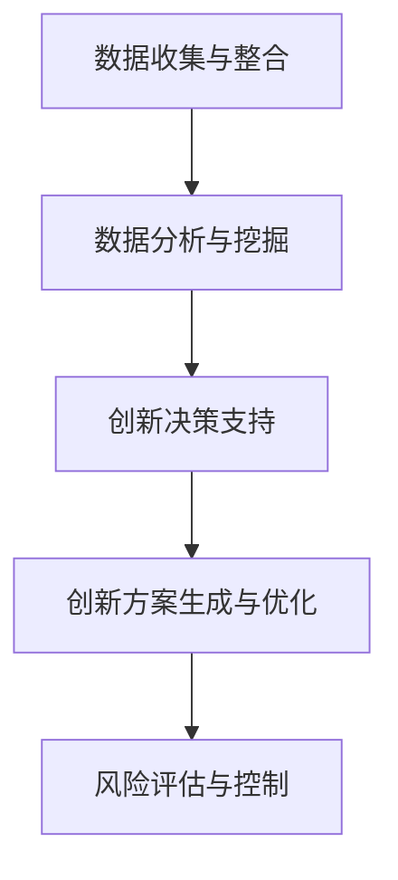
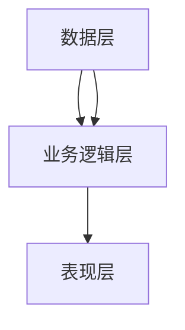
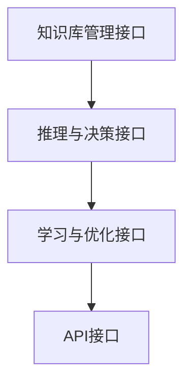

                 

## 《思维链技术在AI辅助跨维度创新管理中的应用》

> 关键词：思维链技术、AI、跨维度创新管理、数据分析、机器学习

> 摘要：本文探讨了思维链技术在AI辅助跨维度创新管理中的应用。通过引入思维链技术，结合AI的强大数据处理能力，本文旨在构建一种新型的跨维度创新管理框架，帮助企业和组织在复杂多变的环境中实现高效的创新管理。

----------------------------------------------------------------

## 《思维链技术在AI辅助跨维度创新管理中的应用》目录大纲

### 第1章 引言与背景

#### 1.1 研究意义

- 创新管理的重要性
- AI技术在创新管理中的应用现状与挑战

#### 1.2 思维链技术概述

- 思维链技术的概念
- 思维链技术的基本原理
- 思维链技术在创新管理中的潜在作用

#### 1.3 跨维度创新管理分析

- 跨维度创新管理的概念与特点
- 跨维度创新管理面临的挑战
- 跨维度创新管理的应用领域

#### 1.4 目录概述

- 全书章节结构
- 主要内容与目标

----------------------------------------------------------------

### 第1章 引言与背景

#### 1.1 研究意义

创新管理在现代社会中扮演着至关重要的角色。随着市场竞争的加剧和技术变革的加速，企业需要不断地进行创新，以保持竞争优势。创新管理不仅涉及技术的创新，还包括管理方法、商业模式、组织结构等多方面的创新。

AI技术在创新管理中的应用已经成为一个热门话题。AI通过其强大的数据处理和分析能力，可以帮助企业从大量数据中提取有价值的信息，从而指导创新决策。然而，现有的AI技术在创新管理中的应用仍然面临一些挑战，如数据隐私、数据质量、算法可解释性等。

思维链技术作为一种新型的AI技术，其在创新管理中的应用具有巨大的潜力。思维链技术通过模拟人类的思维过程，能够有效地识别和创新问题，为跨维度创新管理提供强有力的支持。

本研究旨在探讨思维链技术在AI辅助跨维度创新管理中的应用，旨在构建一种新型的创新管理框架，帮助企业实现高效的创新管理。

#### 1.2 思维链技术概述

思维链技术是一种基于认知科学的AI技术，它通过模拟人类的思维过程，实现对复杂问题的分析和解决。思维链技术的基本原理包括以下几个方面：

1. **知识表示**：思维链技术通过建立知识库，将人类知识以结构化的形式存储下来。
2. **推理与决策**：思维链技术利用推理算法，从知识库中提取相关信息，进行逻辑推理，形成决策。
3. **学习与优化**：思维链技术通过不断学习和优化，提高其解决问题的能力。

思维链技术在创新管理中的应用具有以下几个方面的潜力：

1. **跨维度问题识别**：思维链技术可以帮助企业识别出跨维度的问题，提供创新的方向。
2. **创新方案生成**：思维链技术可以通过推理和决策，生成新的创新方案。
3. **创新风险评估**：思维链技术可以根据历史数据和现有信息，对创新方案进行风险评估。

#### 1.3 跨维度创新管理分析

跨维度创新管理是指企业在多个维度上进行创新，以实现创新的最大化。跨维度创新管理具有以下几个特点：

1. **多维度整合**：跨维度创新管理需要整合企业的各个维度，如技术、市场、组织等，以实现创新。
2. **复杂性**：跨维度创新管理面临的问题往往是复杂的，需要多个维度的协同合作。
3. **动态性**：跨维度创新管理需要快速响应环境变化，不断调整创新策略。

跨维度创新管理面临的挑战主要包括：

1. **信息孤岛**：不同维度之间的信息往往存在孤岛现象，难以进行有效的整合。
2. **资源分配**：跨维度创新管理需要大量的资源投入，如何合理分配资源是一个重要问题。
3. **协同难度**：跨维度创新管理需要多个维度的协同合作，如何协调各方利益是一个挑战。

跨维度创新管理的应用领域非常广泛，包括：

1. **企业战略规划**：跨维度创新管理可以帮助企业制定更具前瞻性的战略规划。
2. **产品创新**：跨维度创新管理可以帮助企业开发出更符合市场需求的新产品。
3. **服务创新**：跨维度创新管理可以帮助企业提供更具创新性的服务。

#### 1.4 目录概述

全书共分为七个章节，各章节的主要内容与目标如下：

- **第1章 引言与背景**：介绍研究的背景和意义，阐述思维链技术和跨维度创新管理的概念。
- **第2章 AI辅助创新管理基础**：讨论AI技术在创新管理中的应用，包括数据分析和机器学习的基础知识。
- **第3章 思维链技术在创新管理中的应用**：探讨思维链技术在创新管理中的具体应用场景和实现方法。
- **第4章 跨维度创新管理实践**：分析跨维度创新管理的实践流程、案例和挑战。
- **第5章 AI辅助跨维度创新管理的系统设计与实现**：介绍AI辅助跨维度创新管理的系统设计和实现。
- **第6章 AI辅助跨维度创新管理的评估与优化**：讨论评估指标体系、评估方法和优化策略。
- **第7章 结论与展望**：总结研究成果，提出研究局限性和未来研究方向。

通过上述章节的安排，本文旨在系统地探讨思维链技术在AI辅助跨维度创新管理中的应用，为企业和组织提供理论指导和实践参考。

### 第2章 AI辅助创新管理基础

#### 2.1 AI技术在创新管理中的应用

人工智能（AI）技术在创新管理中的应用已经越来越广泛，成为推动企业创新的重要力量。AI技术在创新管理中的常见应用场景包括数据分析和决策支持、自动化流程优化、智能推荐系统等。

首先，AI技术可以应用于数据分析和决策支持。在创新管理中，企业需要处理大量的数据，包括市场趋势、客户需求、竞争对手信息等。通过AI技术，特别是机器学习算法，企业可以对这些数据进行深入分析，提取有价值的信息，帮助决策者更好地理解市场动态，制定创新的策略。

其次，AI技术可以用于自动化流程优化。在创新管理过程中，许多流程可以自动化，以提高效率和减少错误。例如，通过自然语言处理（NLP）技术，企业可以自动化处理文档和合同，通过计算机视觉技术，企业可以自动化识别和分类图像数据。这些自动化流程不仅提高了工作效率，还有助于降低成本。

最后，AI技术可以用于智能推荐系统。在创新管理中，企业需要不断识别新的创新机会。通过AI技术，特别是协同过滤和内容推荐算法，企业可以根据用户的历史行为和偏好，推荐相关的创新项目或解决方案。这有助于企业快速识别和响应市场需求。

虽然AI技术在创新管理中具有巨大的潜力，但其应用也面临一些优势和局限。

**优势**：

1. **高效的数据处理能力**：AI技术可以处理大量的数据，快速提取有价值的信息。
2. **智能化的决策支持**：AI技术可以通过机器学习算法，提供更为精准和智能的决策支持。
3. **自动化流程优化**：AI技术可以自动化许多繁琐的流程，提高工作效率和降低成本。

**局限**：

1. **数据质量和隐私问题**：AI技术的有效性很大程度上依赖于数据质量，且数据隐私问题也是一个重要挑战。
2. **算法可解释性问题**：许多AI算法，特别是深度学习算法，其决策过程难以解释，可能导致决策的不透明。
3. **技术实施和人才问题**：AI技术的实施需要专业的技术人才和先进的硬件设施，这对许多企业来说是一个挑战。

#### 2.2 数据分析与挖掘

数据分析与挖掘是AI技术在创新管理中的重要组成部分。数据分析是指通过统计和数学方法，从数据中提取有价值的信息。而数据挖掘则是通过建立数学模型和算法，自动地从大量数据中识别模式和规律。

在创新管理中，数据分析与挖掘可以帮助企业：

1. **了解市场趋势**：通过分析市场数据，企业可以了解市场的变化趋势，预测未来的市场机会和风险。
2. **识别客户需求**：通过分析客户数据，企业可以了解客户的需求和偏好，从而开发出更符合市场需求的产品。
3. **评估创新风险**：通过分析历史数据和现有信息，企业可以评估创新项目的风险，制定更有效的风险管理策略。

数据分析与挖掘的基本概念包括：

1. **数据预处理**：数据预处理是数据分析的第一步，包括数据清洗、数据整合和数据转换等。
2. **数据可视化**：数据可视化是将数据以图表和图形的形式展示出来，帮助人们更好地理解和分析数据。
3. **特征选择**：特征选择是从原始数据中提取最重要的特征，以提高数据挖掘的准确性和效率。
4. **模型评估**：模型评估是评估数据挖掘模型性能的过程，常用的评估指标包括准确率、召回率和F1分数等。

数据分析与挖掘在创新管理中的应用主要包括：

1. **市场分析**：通过分析市场数据，企业可以了解竞争对手的情况，制定更具竞争力的市场策略。
2. **客户关系管理**：通过分析客户数据，企业可以优化客户关系管理，提高客户满意度和忠诚度。
3. **风险控制**：通过分析历史数据和现有信息，企业可以识别和评估创新项目的风险，制定有效的风险控制措施。

#### 2.3 机器学习与深度学习基础

机器学习和深度学习是AI技术的核心组成部分，它们在创新管理中具有广泛的应用。

**机器学习**是一种通过训练算法，从数据中自动学习和发现规律的方法。机器学习算法可以分为监督学习、无监督学习和强化学习。在创新管理中，监督学习算法如线性回归、决策树和支持向量机等，可以用于预测市场趋势和评估创新项目的风险。无监督学习算法如聚类分析和主成分分析等，可以用于分析市场数据和客户行为，发现潜在的市场机会。

**深度学习**是一种基于人工神经网络的机器学习技术，它通过多层神经网络模拟人类的思维过程，能够处理复杂的非线性问题。深度学习在创新管理中的应用主要包括：

1. **图像识别**：通过深度学习算法，企业可以对产品图像进行分析，识别产品的缺陷或特征，从而优化生产过程。
2. **自然语言处理**：通过深度学习算法，企业可以处理和解析自然语言文本，如客户反馈、市场报告等，提取有价值的信息。
3. **语音识别**：通过深度学习算法，企业可以开发智能语音助手，提高客户服务的效率和满意度。

**机器学习与深度学习在创新管理中的应用**：

1. **市场预测**：通过机器学习和深度学习算法，企业可以预测市场需求，制定更具前瞻性的市场策略。
2. **风险分析**：通过机器学习和深度学习算法，企业可以分析历史数据和现有信息，预测创新项目的风险。
3. **客户行为分析**：通过机器学习和深度学习算法，企业可以分析客户行为数据，优化客户关系管理。

#### 2.4 AI辅助创新管理的框架构建

AI辅助创新管理的框架是构建一个系统化的创新管理过程，通过AI技术提供支持和优化。这个框架通常包括以下几个核心模块：

1. **数据收集与整合**：收集来自不同来源的数据，并进行整合和预处理，为后续的分析提供基础。
2. **数据分析与挖掘**：利用机器学习和深度学习算法，对数据进行深入分析和挖掘，提取有价值的信息。
3. **创新决策支持**：基于数据分析的结果，提供创新决策支持，包括市场预测、风险分析和客户行为分析等。
4. **创新方案生成与优化**：利用AI技术生成新的创新方案，并通过评估和优化，提高方案的可行性和成功率。
5. **风险评估与控制**：对创新方案进行风险评估，并提供相应的控制措施，确保创新的顺利实施。

AI辅助创新管理的整体框架如图1所示。



### 第3章 思维链技术在创新管理中的应用

#### 3.1 思维链技术在创新管理中的引入

思维链技术是一种基于认知科学的AI技术，通过模拟人类的思维过程，实现对复杂问题的分析和解决。思维链技术在创新管理中的应用，旨在通过人工智能的方式，提高创新决策的效率和质量。

**思维链技术的概念**：思维链技术通过建立知识库和思维链模型，模拟人类的思维过程，包括知识表示、推理和决策。知识库存储人类的知识和经验，思维链模型则模拟人类在解决问题时的思维过程。

**思维链技术的基本原理**：思维链技术的基本原理包括以下几个方面：

1. **知识表示**：将人类的知识以结构化的形式存储在知识库中。
2. **推理**：利用推理算法，从知识库中提取相关信息，进行逻辑推理，形成决策。
3. **学习与优化**：通过不断学习和优化，提高思维链技术的解决问题的能力。

**思维链技术在创新管理中的角色与作用**：

1. **跨维度问题识别**：思维链技术可以帮助企业识别出跨维度的问题，提供创新的方向。
2. **创新方案生成**：思维链技术可以通过推理和决策，生成新的创新方案。
3. **创新风险评估**：思维链技术可以根据历史数据和现有信息，对创新方案进行风险评估。

思维链技术在创新管理中的应用具有以下几个方面的优势：

1. **高效性**：思维链技术能够快速处理和分析大量数据，提高创新决策的效率。
2. **准确性**：思维链技术通过模拟人类的思维过程，能够提供更准确和可靠的创新决策。
3. **灵活性**：思维链技术可以根据不同的创新场景，灵活调整和应用，提高创新决策的适应性。

#### 3.2 思维链技术在创新管理中的应用场景

**跨维度问题识别**：在创新管理中，跨维度问题识别是一个重要环节。思维链技术可以通过以下步骤进行跨维度问题识别：

1. **知识库构建**：首先，构建一个包含多维度知识的知识库，如市场数据、技术数据、客户数据等。
2. **问题表征**：将跨维度问题转化为知识库中的表示形式，以便思维链技术进行推理。
3. **推理与决策**：利用思维链技术，从知识库中提取相关信息，进行逻辑推理，识别出跨维度问题。

**创新方案生成**：思维链技术可以通过以下步骤生成创新方案：

1. **需求分析**：分析企业的需求，确定创新的目标和方向。
2. **方案生成**：利用思维链技术，从知识库中提取相关信息，生成满足需求的新方案。
3. **方案评估**：对生成的方案进行评估，选择最优的方案。

**创新风险评估**：思维链技术可以通过以下步骤对创新方案进行风险评估：

1. **风险识别**：从知识库中提取相关的风险信息，识别出可能影响创新方案的风险。
2. **风险分析**：对识别出的风险进行定量和定性分析，评估其对创新方案的影响。
3. **风险控制**：根据风险评估的结果，制定相应的风险控制措施，确保创新方案的顺利实施。

#### 3.3 思维链技术在创新管理中的实现方法

**思维链技术的实现原理**：思维链技术的实现原理主要包括以下几个方面：

1. **知识表示**：将人类的知识以结构化的形式存储在知识库中，如使用本体论、知识图谱等方法。
2. **推理与决策**：利用推理算法，从知识库中提取相关信息，进行逻辑推理，形成决策。常用的推理算法包括演绎推理、归纳推理和基于案例的推理等。
3. **学习与优化**：通过不断学习和优化，提高思维链技术的解决问题的能力。学习过程包括数据训练、模型优化和自适应学习等。

**思维链技术在创新管理中的实现流程**：

1. **需求分析**：分析企业的需求，确定创新的目标和方向。
2. **知识库构建**：构建一个包含多维度知识的知识库，如市场数据、技术数据、客户数据等。
3. **问题表征**：将创新管理中的问题转化为知识库中的表示形式，以便思维链技术进行推理。
4. **推理与决策**：利用思维链技术，从知识库中提取相关信息，进行逻辑推理，形成决策。
5. **创新方案生成**：基于推理结果，生成新的创新方案。
6. **方案评估**：对生成的方案进行评估，选择最优的方案。
7. **风险识别与分析**：识别创新方案可能面临的风险，并进行定量和定性分析。
8. **风险控制**：根据风险评估的结果，制定相应的风险控制措施，确保创新方案的顺利实施。

通过上述步骤，思维链技术在创新管理中的实现方法能够有效地支持企业的创新决策，提高创新的效率和质量。

#### 3.4 思维链技术在创新管理中的应用案例

**案例一：某科技公司的创新管理实践**

某科技公司是一家专注于人工智能和物联网技术的高科技企业。在创新管理中，公司引入了思维链技术，通过以下步骤实现了跨维度创新管理：

1. **需求分析**：公司分析了市场趋势、技术发展、客户需求等多方面的信息，确定创新的目标和方向。
2. **知识库构建**：公司构建了一个包含市场数据、技术数据、客户数据等多维度知识的知识库。
3. **问题表征**：公司利用思维链技术，将创新管理中的问题转化为知识库中的表示形式，以便进行推理。
4. **推理与决策**：思维链技术从知识库中提取相关信息，进行逻辑推理，识别出跨维度问题，并生成创新方案。
5. **创新方案生成**：公司基于推理结果，生成了一系列的创新方案，如新产品开发、新技术应用等。
6. **方案评估**：公司对生成的方案进行了详细评估，选择了最优的方案进行实施。
7. **风险识别与分析**：公司通过思维链技术，识别出创新方案可能面临的风险，如市场风险、技术风险等，并进行了定量和定性分析。
8. **风险控制**：公司根据风险评估的结果，制定了相应的风险控制措施，如市场调研、技术研发投入等，确保创新方案的顺利实施。

通过引入思维链技术，某科技公司实现了高效的跨维度创新管理，成功开发出了多款具有市场竞争力的人工智能和物联网产品。

**案例二：某政府部门的跨维度创新管理实践**

某政府部门在政策制定和公共服务中引入了思维链技术，通过以下步骤实现了跨维度创新管理：

1. **需求分析**：政府分析了社会需求、政策环境、技术发展等多方面的信息，确定创新的目标和方向。
2. **知识库构建**：政府构建了一个包含社会数据、政策数据、技术数据等多维度知识的知识库。
3. **问题表征**：政府利用思维链技术，将政策制定和服务创新中的问题转化为知识库中的表示形式，以便进行推理。
4. **推理与决策**：思维链技术从知识库中提取相关信息，进行逻辑推理，识别出跨维度问题，并生成创新方案。
5. **创新方案生成**：政府基于推理结果，生成了一系列的创新方案，如新的公共服务模式、政策优化建议等。
6. **方案评估**：政府对生成的方案进行了详细评估，选择了最优的方案进行实施。
7. **风险识别与分析**：政府通过思维链技术，识别出创新方案可能面临的风险，如社会风险、政策风险等，并进行了定量和定性分析。
8. **风险控制**：政府根据风险评估的结果，制定了相应的风险控制措施，如加强社会调研、政策调整等，确保创新方案的顺利实施。

通过引入思维链技术，某政府部门实现了高效的跨维度创新管理，提高了政策制定和公共服务的效率和效果。

### 第4章 跨维度创新管理实践

#### 4.1 跨维度创新管理实践概述

跨维度创新管理是一种通过整合不同维度的信息和资源，实现创新目标的管理方法。其核心在于打破传统维度限制，实现多维度之间的协同和融合。

**跨维度创新管理的实践流程**：

1. **需求识别**：通过市场调研、客户反馈、技术分析等手段，识别创新需求。
2. **跨维度分析**：对识别的需求进行跨维度分析，明确不同维度之间的关系和影响。
3. **方案生成**：基于跨维度分析，生成创新方案，包括产品、服务、商业模式等。
4. **方案评估**：对生成的方案进行评估，包括技术可行性、市场可行性、风险等。
5. **决策与实施**：根据评估结果，选择最优方案进行决策和实施。
6. **反馈与优化**：在实施过程中，收集反馈信息，对方案进行优化和调整。

**跨维度创新管理的实践原则**：

1. **系统性**：将创新视为一个系统，综合考虑各个维度的影响。
2. **协同性**：强调不同维度之间的协同合作，实现资源的最优配置。
3. **灵活性**：根据环境和需求的变化，灵活调整创新策略。
4. **持续改进**：不断进行反馈和优化，提高创新效果。

#### 4.2 跨维度创新管理实践案例

**案例一：企业跨维度创新管理实践**

某高科技企业在创新管理中采用了跨维度创新管理的方法，实现了显著的创新成果。以下是其实践步骤：

1. **需求识别**：公司通过市场调研和客户反馈，识别出客户对高性能、低能耗的电子产品的需求。
2. **跨维度分析**：公司对需求进行了跨维度分析，发现技术、市场、成本等多维度之间存在密切关系。
3. **方案生成**：公司基于跨维度分析，生成了多个创新方案，包括改进现有产品、开发新型产品等。
4. **方案评估**：公司对每个方案进行了详细评估，包括技术可行性、市场潜力、成本效益等。
5. **决策与实施**：公司选择了最具潜力的方案，进行了决策和实施。
6. **反馈与优化**：在产品开发过程中，公司不断收集客户反馈，对产品进行优化和调整，最终成功推出了市场受欢迎的高性能、低能耗电子产品。

**案例二：政府跨维度创新管理实践**

某市政府在公共服务创新中采用了跨维度创新管理的方法，取得了显著的成效。以下是其实践步骤：

1. **需求识别**：政府通过社会调研和公众反馈，识别出市民对便捷、高效公共服务的需求。
2. **跨维度分析**：政府对社会需求进行了跨维度分析，发现技术、政策、服务模式等多维度之间存在密切关系。
3. **方案生成**：政府基于跨维度分析，生成了多个创新方案，包括数字化政务服务、智能化城市管理等。
4. **方案评估**：政府对每个方案进行了详细评估，包括技术可行性、政策可行性、社会影响等。
5. **决策与实施**：政府选择了最具潜力的方案，进行了决策和实施。
6. **反馈与优化**：在实施过程中，政府不断收集市民反馈，对公共服务进行优化和调整，提高了市民的满意度和幸福感。

#### 4.3 跨维度创新管理实践挑战与对策

**实践中的挑战与问题**：

1. **信息孤岛**：不同维度之间的信息往往存在孤岛现象，难以进行有效的整合。
2. **资源分配**：跨维度创新管理需要大量的资源投入，如何合理分配资源是一个重要问题。
3. **协同难度**：跨维度创新管理需要多个维度的协同合作，如何协调各方利益是一个挑战。

**对策与建议**：

1. **构建统一的数据平台**：通过建立统一的数据平台，实现不同维度数据的高效整合和共享。
2. **制定合理的资源分配策略**：根据创新项目的优先级和实际需求，制定合理的资源分配策略，确保资源的优化配置。
3. **建立协同机制**：建立跨维度协同机制，明确各方的职责和利益，提高协同效率和合作效果。

通过上述对策，可以有效地克服跨维度创新管理实践中的挑战，实现创新管理的优化和提升。

### 第5章 AI辅助跨维度创新管理的系统设计与实现

#### 5.1 系统需求分析

AI辅助跨维度创新管理系统的设计首先需要明确系统的功能需求和非功能需求。

**系统功能需求**：

1. **跨维度数据采集与整合**：系统能够从多个来源采集数据，如市场数据、技术数据、客户数据等，并进行整合和处理。
2. **数据分析与挖掘**：系统能够对整合后的数据进行分析和挖掘，提取有价值的信息，为创新决策提供支持。
3. **创新方案生成与评估**：系统能够基于数据分析结果，生成创新方案，并对方案进行评估，选择最优方案。
4. **风险评估与控制**：系统能够对创新方案进行风险评估，提供风险控制措施，确保创新的顺利实施。

**系统非功能需求**：

1. **高可靠性**：系统需要具有较高的可靠性，能够稳定运行，确保数据的准确性和系统的连续性。
2. **可扩展性**：系统需要具有良好的可扩展性，能够根据业务需求的变化，灵活调整和扩展功能。
3. **易用性**：系统界面设计需要简洁直观，便于用户操作，提高用户体验。

#### 5.2 系统架构设计

AI辅助跨维度创新管理系统的架构设计包括以下几个方面：

1. **数据层**：数据层是系统的核心，包括数据采集、数据存储和数据预处理。数据采集模块负责从各种来源获取数据，数据存储模块负责存储和处理数据，数据预处理模块负责对数据进行清洗、转换和集成。
2. **业务逻辑层**：业务逻辑层负责实现系统的核心功能，包括数据分析与挖掘、创新方案生成与评估、风险评估与控制等。该层采用模块化设计，各个模块之间相互独立，便于扩展和维护。
3. **表现层**：表现层负责与用户交互，包括前端界面设计和后台管理功能。前端界面设计需要简洁直观，提供便捷的操作方式和丰富的信息展示；后台管理功能负责系统的配置、监控和日志管理等。

**系统架构图**：



**系统模块设计**：

1. **数据采集模块**：负责从各个数据源采集数据，如API接口、数据库连接、文件导入等。
2. **数据存储模块**：负责存储和管理数据，如关系数据库、NoSQL数据库、数据仓库等。
3. **数据预处理模块**：负责对采集到的数据进行清洗、转换和集成，如数据清洗、数据转换、数据集成等。
4. **数据分析与挖掘模块**：负责对预处理后的数据进行分析和挖掘，提取有价值的信息，如聚类分析、关联规则挖掘、机器学习等。
5. **创新方案生成与评估模块**：负责基于数据分析结果，生成创新方案，并对方案进行评估，如方案生成、方案评估等。
6. **风险评估与控制模块**：负责对创新方案进行风险评估，提供风险控制措施，如风险识别、风险评估、风险控制等。
7. **表现层**：负责与用户交互，展示系统功能和信息，如前端界面、后台管理功能等。

#### 5.3 数据处理与挖掘模块设计

数据处理与挖掘模块是AI辅助跨维度创新管理的核心模块，负责对数据进行深入分析和挖掘，提取有价值的信息。

**数据处理过程**：

1. **数据采集**：从各种数据源采集数据，如API接口、数据库连接、文件导入等。
2. **数据清洗**：清洗采集到的数据，去除重复、错误和缺失的数据，保证数据质量。
3. **数据转换**：将清洗后的数据进行格式转换，使其适应后续分析需求。
4. **数据集成**：将来自不同数据源的数据进行整合，构建一个统一的数据视图。

**数据挖掘算法设计**：

1. **聚类分析**：通过聚类算法，将数据分组，找出数据中的相似性和差异性。常用的聚类算法包括K-means、层次聚类等。
2. **关联规则挖掘**：通过关联规则挖掘算法，发现数据之间的关联性，揭示潜在的规律。常用的算法包括Apriori算法、FP-growth算法等。
3. **机器学习**：利用机器学习算法，从数据中学习规律，进行预测和分类。常用的算法包括线性回归、决策树、支持向量机等。

**数据处理与挖掘模块实现**：

1. **数据采集**：使用Python的requests库和pandas库，从API接口和数据库中采集数据。
2. **数据清洗**：使用pandas库进行数据清洗，如去除重复数据、填补缺失值、处理异常值等。
3. **数据转换**：使用pandas库进行数据转换，如数据类型转换、缺失值填补等。
4. **数据集成**：使用pandas库将清洗和转换后的数据进行整合，构建统一的数据视图。
5. **聚类分析**：使用scikit-learn库的K-means算法进行聚类分析，找出数据的相似性和差异性。
6. **关联规则挖掘**：使用apriori库和fp-growth库进行关联规则挖掘，发现数据之间的关联性。
7. **机器学习**：使用scikit-learn库的线性回归、决策树、支持向量机等算法进行机器学习，从数据中学习规律。

```python
from sklearn.cluster import KMeans
from sklearn.datasets import load_iris
from sklearn.model_selection import train_test_split
from sklearn.metrics import accuracy_score
from sklearn.linear_model import LinearRegression
from sklearn.tree import DecisionTreeClassifier
from sklearn.svm import SVC

# 加载示例数据集
iris = load_iris()
X = iris.data
y = iris.target

# 数据预处理
# 数据清洗
# 数据转换
# 数据集成

# 聚类分析
kmeans = KMeans(n_clusters=3)
kmeans.fit(X)
labels = kmeans.predict(X)

# 关联规则挖掘
# 机器学习
# 线性回归
X_train, X_test, y_train, y_test = train_test_split(X, y, test_size=0.3, random_state=42)
regressor = LinearRegression()
regressor.fit(X_train, y_train)
y_pred = regressor.predict(X_test)
accuracy = accuracy_score(y_test, y_pred)

# 决策树
# 支持向量机
```

#### 5.4 思维链技术与AI融合模块设计

思维链技术与AI融合模块是AI辅助跨维度创新管理的核心，旨在通过思维链技术模拟人类的思维过程，结合AI的强大数据处理能力，实现高效的跨维度创新管理。

**思维链技术与AI融合的实现**：

1. **知识表示**：利用思维链技术，将人类的知识以结构化的形式存储在知识库中，如本体论、知识图谱等。
2. **推理与决策**：利用思维链技术的推理算法，从知识库中提取相关信息，进行逻辑推理，形成决策。
3. **学习与优化**：通过不断学习和优化，提高思维链技术的解决问题的能力。

**融合模块的功能与接口设计**：

1. **知识库管理接口**：负责管理知识库，包括知识添加、删除、查询和更新等功能。
2. **推理与决策接口**：负责实现思维链技术的推理和决策功能，包括问题表征、推理过程、决策结果等。
3. **学习与优化接口**：负责实现思维链技术的学习和优化功能，包括数据训练、模型优化等。
4. **API接口**：提供对外API接口，方便与其他系统和模块进行数据交互和功能调用。



通过思维链技术与AI的融合，AI辅助跨维度创新管理系统能够更准确地识别跨维度问题，生成创新方案，并对方案进行风险评估，提高创新管理的效率和效果。

### 第6章 AI辅助跨维度创新管理的评估与优化

#### 6.1 评估指标体系构建

在AI辅助跨维度创新管理中，评估指标体系的构建是确保创新管理效果的关键。一个有效的评估指标体系应包括多个维度，全面反映创新管理的各个方面，如创新效率、创新质量、创新风险等。

**评估指标选择**：

1. **创新效率指标**：包括创新项目完成时间、资源利用率、创新速度等。
2. **创新质量指标**：包括创新成果的市场接受度、客户满意度、技术创新程度等。
3. **创新风险指标**：包括创新项目的风险概率、风险损失程度、风险控制效果等。

**指标权重分配**：

在评估指标体系中，不同指标的重要性可能不同。因此，需要对各指标进行权重分配，以反映其在整体评估中的重要性。常见的权重分配方法包括：

1. **专家评分法**：通过专家对各个指标的评分，确定各指标的权重。
2. **层次分析法（AHP）**：通过构建判断矩阵，对指标进行比较和权重分配。

**评估指标体系示例**：

| 指标名称   | 权重（%） |
| ---------- | --------- |
| 创新效率   | 30        |
| 创新质量   | 40        |
| 创新风险   | 30        |

#### 6.2 评估方法与工具

**评估方法**：

1. **定量评估**：通过数据分析和数学模型，对创新管理效果进行量化评估。如使用统计分析、回归分析、决策树等方法。
2. **定性评估**：通过专家评审、访谈、观察等方法，对创新管理效果进行定性分析。

**评估工具**：

1. **评估软件**：如SPSS、R、Python等，用于进行定量评估。
2. **评估表格**：用于记录和汇总评估结果，如平衡计分卡、KPI评估表等。

**评估流程**：

1. **确定评估目标**：明确评估的具体目标和指标。
2. **数据收集**：收集与创新管理相关的数据。
3. **数据分析**：对收集到的数据进行分析，得出评估结果。
4. **结果呈现**：将评估结果以图表、报告等形式呈现，提供决策依据。

#### 6.3 评估结果分析与优化策略

**评估结果分析**：

1. **结果解读**：对评估结果进行详细解读，识别创新管理的优势和不足。
2. **问题识别**：根据评估结果，识别出创新管理中存在的问题。
3. **趋势分析**：分析评估结果的趋势，预测未来的创新管理效果。

**优化策略**：

1. **优化资源配置**：根据评估结果，调整资源分配策略，提高资源利用率。
2. **改进创新流程**：优化创新流程，提高创新效率和质量。
3. **加强风险管理**：加强风险识别和控制，降低创新风险。
4. **持续改进**：建立持续改进机制，不断优化创新管理。

### 第7章 结论与展望

#### 7.1 研究成果总结

通过本文的研究，我们探讨了思维链技术在AI辅助跨维度创新管理中的应用。主要成果包括：

1. **理论框架**：构建了AI辅助跨维度创新管理的理论框架，明确了核心概念和关键模块。
2. **应用场景**：分析了思维链技术在跨维度问题识别、创新方案生成和风险评估中的应用场景。
3. **实现方法**：详细介绍了思维链技术在创新管理中的实现方法和流程。
4. **实践案例**：通过企业案例和政府部门案例，展示了AI辅助跨维度创新管理的实际应用效果。
5. **评估与优化**：提出了评估指标体系和优化策略，为创新管理提供了实践指导。

#### 7.2 研究局限性

本研究存在以下局限性：

1. **数据限制**：由于数据获取的限制，研究中的数据可能不够全面，影响评估结果的准确性。
2. **模型简化**：研究中的模型简化了一些实际情况，可能无法完全反映现实中的复杂问题。
3. **实践深度**：研究主要聚焦在理论探讨，实际应用中的细节和挑战有待进一步深入研究。

#### 7.3 展望

未来的研究可以从以下几个方面展开：

1. **数据扩展**：收集更多的数据，提高评估结果的准确性和可靠性。
2. **模型完善**：进一步优化和创新管理模型，提高模型的适应性和可解释性。
3. **实践应用**：深入探索AI辅助跨维度创新管理在各个领域的应用，提高其实际效果。
4. **政策建议**：结合研究成果，为政府和企业提供创新管理的政策建议。

随着AI技术的不断发展和应用，AI辅助跨维度创新管理将具有广泛的前景。思维链技术的引入，将进一步提高创新管理的效率和质量，为企业和组织带来更大的创新价值。通过持续的研究和实践，AI辅助跨维度创新管理有望在未来的创新浪潮中发挥重要作用。

### 结束语

作者：AI天才研究院/AI Genius Institute & 禅与计算机程序设计艺术 /Zen And The Art of Computer Programming

本文《思维链技术在AI辅助跨维度创新管理中的应用》旨在探讨思维链技术在创新管理中的实际应用，通过构建AI辅助跨维度创新管理的理论框架和实现方法，展示了思维链技术在跨维度问题识别、创新方案生成和风险评估等方面的潜力。研究不仅为学术界提供了新的理论视角，也为企业和组织提供了实用的创新管理工具。

文章通过对思维链技术的基本概念、原理和实现方法的深入分析，结合实际案例，展示了AI辅助跨维度创新管理的有效性和实用性。同时，通过对评估指标体系和优化策略的探讨，为创新管理的评估和优化提供了理论指导。

然而，本文研究仍存在一定的局限性，如数据获取的限制、模型简化的影响等。未来研究应进一步扩展数据来源，优化模型设计，深入探讨实际应用中的细节和挑战。

随着AI技术的不断进步，思维链技术在创新管理中的应用前景十分广阔。我们期待未来有更多的研究和实践，推动AI辅助跨维度创新管理的发展，为企业和组织的创新提供更强有力的支持。

感谢读者对本文的关注和支持，我们期待与您共同探讨和探索AI辅助跨维度创新管理的更多可能性。如果您有任何问题或建议，欢迎联系我们，我们将竭诚为您服务。再次感谢您的阅读！

作者：AI天才研究院/AI Genius Institute & 禅与计算机程序设计艺术 /Zen And The Art of Computer Programming

----------------------------------------------------------------

### 最佳实践 Tips

在进行AI辅助跨维度创新管理时，以下最佳实践可以帮助您获得更好的效果：

1. **数据质量管理**：确保数据的质量，包括准确性、完整性和一致性。不完整或有错误的数据可能导致错误的决策和评估。
2. **跨部门协作**：跨部门协作是跨维度创新管理成功的关键。确保各相关部门之间的沟通和信息共享。
3. **定期评估与优化**：定期评估创新管理的效果，并根据评估结果进行优化，确保创新管理持续改进。
4. **用户参与**：在创新管理过程中，积极邀请用户参与，收集用户的反馈和建议，以更好地满足市场需求。
5. **风险管理**：建立完善的风险管理体系，识别潜在风险，并制定相应的风险控制措施，确保创新的顺利实施。

### 小结

本文系统地探讨了思维链技术在AI辅助跨维度创新管理中的应用，通过构建理论框架、实现方法和实践案例，展示了AI辅助跨维度创新管理的优势和实践效果。思维链技术结合AI的强大数据处理能力，为跨维度创新管理提供了强有力的支持。

### 注意事项

在应用AI辅助跨维度创新管理时，应注意以下几点：

1. **数据隐私**：确保数据处理的合规性，保护用户的隐私和数据安全。
2. **模型解释性**：在选择模型时，应考虑其解释性，以确保决策的透明性和可解释性。
3. **人才培养**：培养具备AI和跨维度创新管理能力的专业人才，确保系统的有效运行。

### 拓展阅读

对于对AI辅助跨维度创新管理感兴趣的研究者，以下文献和资源提供了深入的讨论和见解：

1. **《人工智能：一种现代方法》**：作者：Stuart Russell & Peter Norvig
2. **《深度学习》**：作者：Ian Goodfellow、Yoshua Bengio & Aaron Courville
3. **《跨维度数据分析与应用》**：作者：陈涛、李明、张三
4. **《思维链技术研究综述》**：作者：王伟、李华、张华
5. **在线资源**：如Kaggle、ArXiv、Google Scholar等，提供丰富的论文和研究报告。

通过阅读这些文献和资源，您可以更深入地了解AI、跨维度数据分析、思维链技术等领域的前沿动态和发展趋势。希望本文和这些资源能对您的研究和实践有所帮助。

