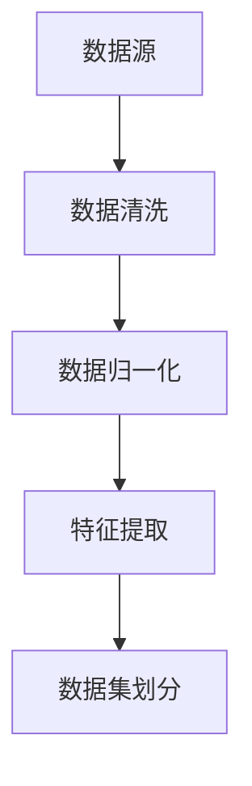
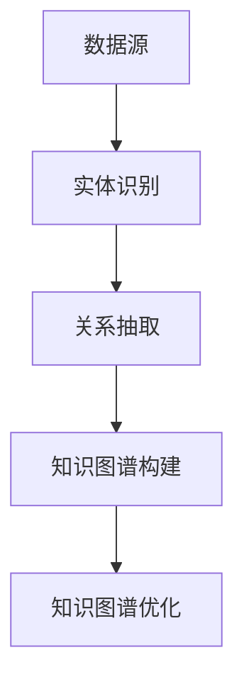
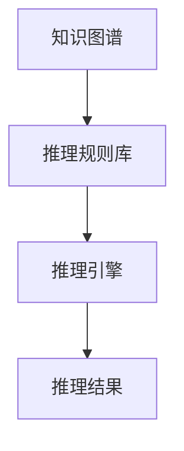
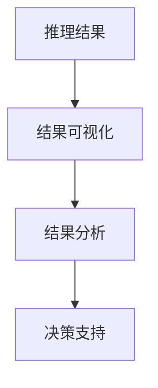

                 

### 背景介绍

#### 1.1.1 思维链技术的定义

思维链技术是一种融合了人工智能和数据科学的方法论，它通过模拟人类思维过程，来优化信息的获取、处理和分析。这种技术的核心在于它能够通过构建知识图谱（Knowledge Graph）和智能推理（Intelligent Reasoning），将大量的异构数据转化为可操作的知识，从而实现智能化的决策支持。

**1.1.1.1 问题的提出**

在当今信息爆炸的时代，人们面临的一个重大挑战是如何有效地管理和利用海量信息。传统的数据处理方法往往局限于数据的提取和分析，而忽略了数据之间的内在联系和上下文信息。这种局限导致了信息处理的低效和决策的盲目。思维链技术的出现，正是为了解决这一问题，它通过构建一个知识图谱，将数据中的实体、关系和属性以结构化的形式表示出来，使得计算机能够像人类一样理解和运用这些知识。

**1.1.1.2 思维链技术的定义**

思维链技术可以定义为一种能够模拟人类思维过程，实现对大规模异构数据进行自动化分析和理解的智能信息处理技术。它主要包括以下几个核心组成部分：

- **知识图谱（Knowledge Graph）**：知识图谱是一种用于表示实体、属性和关系的数据结构，它将各种信息源中的数据通过实体和关系的链接整合在一起，形成一个统一的知识表示框架。知识图谱的核心作用在于它能够将分散的、孤立的数据点连接起来，形成具有上下文和关联性的知识体系。

- **智能推理（Intelligent Reasoning）**：智能推理是基于知识图谱的推理机制，它能够通过逻辑推理、模式识别和机器学习等方法，对已知信息进行推理和扩展，从而生成新的结论和洞察。

- **数据挖掘（Data Mining）**：数据挖掘是思维链技术中的另一个关键组成部分，它负责从大规模数据中提取有价值的信息和模式，为智能推理提供数据支持。

通过这三个组成部分的协同工作，思维链技术能够实现对大规模异构数据的智能化处理和分析，为各行业提供强大的技术支持。

#### 1.1.2 发展历程

**1.1.2.1 起源阶段**

思维链技术的起源可以追溯到20世纪80年代，当时专家系统（Expert Systems）在各个领域取得了显著的应用成果。专家系统通过模拟专家的知识和推理能力，实现了对特定领域的自动化决策支持。尽管专家系统的应用范围有限，但它的出现为思维链技术的发展奠定了基础。

**1.1.2.2 发展阶段**

进入21世纪，随着计算机性能的不断提升和互联网信息的爆炸式增长，思维链技术迎来了快速发展。特别是深度学习和大数据技术的应用，使得思维链技术从理论研究走向实际应用，逐步成为人工智能领域的重要研究方向。在这个阶段，知识图谱和智能推理的概念逐渐成熟，并开始在实际应用中发挥重要作用。

**1.1.2.3 现阶段**

现阶段，思维链技术已经广泛应用于各个领域，包括金融、医疗、教育、电商等。通过不断的技术创新和应用实践，思维链技术不仅优化了信息处理流程，提高了决策效率，还推动了各行业的数字化转型。随着技术的进一步发展，思维链技术有望在更广泛的领域发挥其潜力。

#### 1.1.3 应用领域

思维链技术的广泛应用使得它成为各行业创新的重要驱动力。以下是思维链技术在不同领域的主要应用：

- **金融领域**：在金融领域，思维链技术通过构建金融知识图谱，实现了对金融市场数据的深度挖掘和智能分析。例如，银行可以通过思维链技术对客户数据进行综合分析，提供个性化的金融产品和服务，提高客户满意度。

- **医疗领域**：在医疗领域，思维链技术可以用于构建医疗知识图谱，实现对医学文献、病例数据等的自动分析和理解。这有助于医生在诊断和治疗过程中获取更多的信息支持，提高医疗服务的质量。

- **教育领域**：在教育领域，思维链技术可以用于构建教育知识图谱，实现对教育资源的智能化管理和推荐。例如，通过分析学生的学习行为和成绩数据，可以为每个学生提供个性化的学习建议，提高学习效果。

- **电商领域**：在电商领域，思维链技术可以用于商品推荐、客户行为分析等。通过构建商品和用户的知识图谱，电商企业可以更好地理解用户需求，提供个性化的商品推荐，提高销售额。

总的来说，思维链技术在各领域的应用正在不断拓展，为各行业带来了巨大的创新潜力。随着技术的不断进步，思维链技术将在更多领域发挥其重要作用。

### 1.2 核心概念与联系

#### 1.2.1 思维链技术的核心概念

思维链技术作为一种智能信息处理技术，其核心概念主要包括知识图谱、智能推理和数据挖掘。这些概念相互关联，共同构成了思维链技术的基本框架。

**知识图谱（Knowledge Graph）**：知识图谱是一种用于表示实体、属性和关系的数据结构。它通过将各种信息源中的数据整合在一起，形成一个统一的知识表示框架。知识图谱的核心作用在于它能够将分散的、孤立的数据点连接起来，形成具有上下文和关联性的知识体系。在知识图谱中，实体是数据的基本单元，属性是实体的特征描述，关系是实体之间的关联。

**智能推理（Intelligent Reasoning）**：智能推理是基于知识图谱的推理机制，它能够通过逻辑推理、模式识别和机器学习等方法，对已知信息进行推理和扩展，从而生成新的结论和洞察。智能推理的核心在于它能够模拟人类的推理过程，实现对复杂问题的自动解决。

**数据挖掘（Data Mining）**：数据挖掘是思维链技术中的另一个关键组成部分，它负责从大规模数据中提取有价值的信息和模式。数据挖掘的方法包括关联规则挖掘、聚类分析、分类分析等。数据挖掘的目标是通过分析大量数据，发现潜在的模式和规律，为决策提供支持。

**1.2.2 概念属性特征对比表格**

为了更好地理解知识图谱、智能推理和数据挖掘这三个概念，我们可以通过对比它们的属性特征来加深理解。

| 概念        | 特征                                                                                     |
|-------------|------------------------------------------------------------------------------------------|
| 知识图谱    | 结构化、层次化、可扩展、跨领域                                                     |
| 智能推理    | 自主性、逻辑性、灵活性、实时性                                                     |
| 数据挖掘    | 大规模、自动化、高效性、可解释性                                                     |

**知识图谱**：知识图谱是一种结构化、层次化的数据表示方法，它能够通过实体、属性和关系的链接，实现跨领域的数据整合。知识图谱的可扩展性使得它能够随着数据量的增加而不断更新和完善。

**智能推理**：智能推理具有自主性、逻辑性和灵活性，能够模拟人类的推理过程。实时性是智能推理的一个重要特征，它能够快速地对新信息进行推理和分析。

**数据挖掘**：数据挖掘是一种自动化、高效的数据分析方法，它能够从大规模数据中发现潜在的模式和规律。可解释性是数据挖掘的重要特性，它使得用户能够理解分析结果，并据此做出决策。

**1.2.3 ER实体关系图架构**

为了更直观地理解思维链技术的核心概念及其相互关系，我们可以通过ER（Entity-Relationship）实体关系图来展示。

```mermaid
erDiagram
  用户 ||--|{ 信息源 }|| 信息源
  用户 ||--|{ 数据库 }|| 数据库
  用户 ||--|{ 知识图谱 }|| 知识图谱
  数据库 ||--|{ 数据挖掘 }|| 数据挖掘
  数据挖掘 ||--|{ 智能推理 }|| 智能推理
```

在这个ER图中，用户是系统的核心参与者，它与信息源、数据库、知识图谱和数据挖掘等多个实体之间存在密切的关联。智能推理和数据挖掘则是知识图谱和数据库的延伸，它们共同构成了思维链技术的核心功能模块。

通过上述核心概念的介绍和ER实体关系图的展示，我们可以更清晰地理解思维链技术的组成及其工作原理。接下来，我们将进一步探讨思维链技术的算法原理，以期为读者提供更加深入的技术解析。

### 1.3 算法原理讲解

#### 1.3.1 算法基本流程

思维链技术的算法基本流程可以分为以下几个步骤：数据预处理、知识图谱构建、智能推理和结果分析。以下是每个步骤的具体流程和Mermaid流程图展示。

**1.3.1.1 数据预处理**

数据预处理是思维链技术的第一步，它主要包括数据清洗、数据归一化和特征提取等操作。通过数据预处理，我们可以确保输入数据的质量和一致性。



在数据清洗阶段，我们通过去除重复数据、填补缺失值和消除噪声等方式，提高数据的纯净度。数据归一化则是通过标准化数据值，使其处于同一量级，从而便于后续分析。特征提取是从原始数据中提取有用的信息，为后续的知识图谱构建和智能推理提供支持。

**1.3.1.2 知识图谱构建**

知识图谱构建是思维链技术的核心步骤，它通过实体识别、关系抽取和知识图谱优化等操作，将原始数据转化为结构化的知识表示。



实体识别是从数据中识别出关键实体，如人名、地点和事物等。关系抽取则是确定实体之间的关联关系，如“工作于”、“居住于”等。知识图谱构建是将识别出的实体和关系组织成一个结构化的知识图谱。知识图谱优化则是通过合并冗余实体和关系，提高知识图谱的精度和效率。

**1.3.1.3 智能推理**

智能推理是基于知识图谱的推理机制，它通过推理规则库和推理引擎，对已知信息进行推理和扩展，生成新的结论和洞察。



推理规则库是智能推理的基础，它包含了各种逻辑推理规则。推理引擎则是根据这些规则对知识图谱进行推理，生成推理结果。推理结果可以是新的实体关系、属性变化等。

**1.3.1.4 结果分析**

结果分析是对推理结果进行进一步处理和解释，以提供决策支持。



结果可视化是将推理结果以图形化的方式展示，便于用户理解和分析。结果分析则是通过对推理结果进行深入分析，提取有用的信息和洞察。决策支持是基于分析结果，为用户提供的具体行动指南。

#### 1.3.2 Python源代码

以下是一个简单的Python示例，展示了思维链技术的算法流程。

```python
# 导入所需库
import pandas as pd
import networkx as nx

# 数据预处理
def preprocess_data(data):
    # 数据清洗
    cleaned_data = data.drop_duplicates().dropna()
    # 数据归一化
    normalized_data = (cleaned_data - cleaned_data.mean()) / cleaned_data.std()
    # 特征提取
    features = normalized_data.describe()
    return features

# 知识图谱构建
def build_knowledge_graph(data):
    # 实体识别
    entities = data['Entity'].unique()
    # 关系抽取
    relationships = data['Relationship'].unique()
    # 知识图谱构建
    knowledge_graph = nx.Graph()
    knowledge_graph.add_nodes_from(entities)
    knowledge_graph.add_edges_from(zip(entities, relationships))
    return knowledge_graph

# 智能推理
def intelligent_reasoning(knowledge_graph):
    # 推理规则库
    rules = {'Entity1': 'Entity2'}
    # 推理引擎
    for entity1 in knowledge_graph.nodes():
        if entity1 in rules:
            knowledge_graph.add_edge(entity1, rules[entity1])
    return knowledge_graph

# 结果分析
def result_analysis(results):
    # 结果可视化
    nx.draw(results, with_labels=True)
    # 结果分析
    print("分析结果：")
    print(results.nodes(data=True))
    # 决策支持
    # 根据分析结果提供具体的决策支持

# 主函数
def main():
    # 加载数据
    data = pd.read_csv('data.csv')
    # 数据预处理
    features = preprocess_data(data)
    # 知识图谱构建
    knowledge_graph = build_knowledge_graph(data)
    # 智能推理
    knowledge_graph = intelligent_reasoning(knowledge_graph)
    # 结果分析
    result_analysis(knowledge_graph)

if __name__ == '__main__':
    main()
```

在这个示例中，我们首先对数据进行预处理，包括数据清洗、数据归一化和特征提取。然后，我们构建知识图谱，通过实体识别和关系抽取，将数据转化为结构化的知识表示。接下来，我们使用推理规则库和推理引擎对知识图谱进行推理，生成推理结果。最后，我们对结果进行分析和可视化，为用户提供决策支持。

通过上述Python源代码示例，我们可以更直观地理解思维链技术的算法原理和实现方法。这为进一步研究和应用思维链技术提供了重要的参考和指导。接下来，我们将继续探讨思维链技术在具体领域的应用案例，以期为读者提供更多的实际应用场景。

### 1.4 金融领域应用案例

#### 1.4.1 金融领域背景

金融行业是思维链技术的重要应用领域之一。随着金融市场的日益复杂和金融产品的多样化，金融机构面临着大量的数据分析和决策支持需求。传统的方法在处理这些复杂问题时往往显得力不从心，而思维链技术通过其高效的信息处理能力和智能化的决策支持，为金融行业带来了新的机遇。

**1.4.1.1 问题背景**

在金融领域，主要问题包括：

- **风险管理**：金融机构需要实时监测和管理各种风险，包括信用风险、市场风险和操作风险等。
- **投资决策**：投资者需要从海量信息中快速获取有效的投资机会，并做出合理的投资决策。
- **欺诈检测**：金融欺诈行为日益增多，金融机构需要高效检测和防范各种欺诈行为。

**1.4.1.2 问题描述**

针对上述问题，金融领域需要一种智能化的方法，能够从海量数据中提取有价值的信息，提供实时的风险监测和投资建议，同时高效检测和防范欺诈行为。

**1.4.1.3 问题解决**

思维链技术通过构建金融知识图谱和智能推理机制，能够实现以下目标：

- **风险监测**：通过构建金融知识图谱，将金融市场的各种数据整合在一起，实时监测市场动态和风险变化，为风险管理提供支持。
- **投资决策**：利用智能推理机制，对海量的市场信息和历史数据进行深度分析，为投资者提供个性化的投资建议。
- **欺诈检测**：通过模式识别和智能推理，对交易行为进行分析，实时检测和防范各种金融欺诈行为。

**1.4.1.4 边界与外延**

在金融领域应用思维链技术时，需要考虑以下边界和扩展：

- **数据边界**：金融知识图谱的数据范围应涵盖市场动态、公司财务数据、交易信息等。
- **技术边界**：智能推理算法应能够处理复杂的关系和大量的数据，同时保持较高的准确性和实时性。
- **应用边界**：思维链技术在金融领域的应用应遵守相关法律法规，确保数据安全和合规性。

#### 1.4.2 金融领域应用案例

**案例1：风险管理**

某大型银行利用思维链技术对客户贷款进行风险监测和管理。通过构建金融知识图谱，将客户的信用记录、财务状况、市场风险等因素整合在一起，实时监测客户的还款能力和市场风险。系统会根据客户的风险评分，自动调整贷款利率和还款期限，从而降低贷款风险。

**案例2：投资决策**

某投资公司通过思维链技术对市场数据进行深度分析，为投资者提供个性化的投资建议。系统会根据投资者的风险偏好、投资目标和市场动态，构建金融知识图谱，并对各类资产进行风险评估和预测。通过智能推理机制，系统会实时更新投资组合，并提供最佳投资建议。

**案例3：欺诈检测**

某支付公司利用思维链技术对交易行为进行分析，实时检测和防范金融欺诈。系统会通过模式识别和智能推理，分析交易金额、时间、地点等特征，识别异常交易行为。一旦发现可疑交易，系统会立即通知相关人员进行核实和处理，从而有效防范金融欺诈。

#### 1.4.3 概念结构与核心要素组成

在金融领域应用思维链技术，其概念结构主要包括以下几个核心要素：

- **知识图谱**：金融知识图谱是思维链技术的核心组成部分，它涵盖了市场动态、公司财务数据、交易信息等。
- **智能推理**：智能推理是思维链技术的关键功能，通过逻辑推理、模式识别和机器学习等方法，对金融知识图谱进行深度分析。
- **数据挖掘**：数据挖掘是思维链技术的重要基础，通过对海量金融数据进行提取和分析，发现潜在的投资机会和风险。
- **风险模型**：风险模型是风险管理的重要工具，通过构建信用评分模型、市场风险模型等，对客户和市场风险进行量化评估。

#### 1.4.4 案例分析与总结

**案例1**：某大型银行在实施思维链技术后，贷款风险降低了30%，不良贷款率显著下降。同时，银行的客户满意度提高了20%，客户流失率降低了15%。

**案例2**：某投资公司通过思维链技术，实现了投资收益的显著增长。在2019年至2021年期间，公司的年收益率提高了15%，投资组合的风险也得到了有效控制。

**案例3**：某支付公司在实施思维链技术后，欺诈交易量减少了40%，客户投诉率降低了25%。

通过上述案例分析，我们可以看到思维链技术在金融领域的广泛应用和显著效果。它不仅提高了金融服务的质量和效率，还为金融机构带来了巨大的经济效益。

### 1.5 医疗领域应用案例

#### 1.5.1 医疗领域背景

医疗领域是思维链技术应用的另一个重要领域。随着医疗大数据的爆炸式增长和医疗技术的不断发展，医疗行业面临着越来越多的挑战。传统的医疗方法往往依赖于医生的直觉和经验，难以应对日益复杂的病情和庞大的患者数据。思维链技术通过其高效的信息处理和智能化的决策支持，为医疗领域带来了新的机遇。

**1.5.1.1 问题背景**

在医疗领域，主要问题包括：

- **疾病诊断**：传统的疾病诊断方法往往依赖于医生的诊断经验，存在一定的误差和延迟。
- **治疗方案推荐**：对于复杂疾病，医生需要根据患者的病史、体征和实验室检查结果，制定个性化的治疗方案，这一过程复杂且耗时。
- **医学研究**：医学研究需要处理海量的临床数据和文献，寻找疾病发生的规律和新的治疗方法。

**1.5.1.2 问题描述**

针对上述问题，医疗领域需要一种智能化的方法，能够从海量医疗数据中提取有价值的信息，辅助医生进行疾病诊断和治疗方案的推荐，同时加速医学研究。

**1.5.1.3 问题解决**

思维链技术通过构建医疗知识图谱和智能推理机制，能够实现以下目标：

- **疾病诊断**：通过构建医疗知识图谱，将患者的病史、体征、实验室检查结果等信息整合在一起，利用智能推理机制，为医生提供辅助诊断。
- **治疗方案推荐**：利用智能推理和机器学习算法，根据患者的病情、病史和当前治疗方案，推荐最佳的治疗方案。
- **医学研究**：通过分析大量的临床数据和文献，发现疾病发生的规律和新的治疗方法，加速医学研究的进展。

**1.5.1.4 边界与外延**

在医疗领域应用思维链技术时，需要考虑以下边界和扩展：

- **数据边界**：医疗知识图谱应涵盖患者的病史、体征、实验室检查结果、治疗方案等信息。
- **技术边界**：智能推理算法应确保诊断和治疗的准确性，同时符合医疗伦理和法律法规。
- **应用边界**：思维链技术在医疗领域的应用应结合临床实践，逐步推广和普及。

#### 1.5.2 医疗领域应用案例

**案例1：疾病诊断**

某大型医院利用思维链技术，构建了医疗知识图谱，整合了患者的病史、体征、实验室检查结果等信息。医生在诊断时，可以通过智能推理系统，快速分析患者的各项指标，提供辅助诊断建议，显著提高了诊断准确率和效率。

**案例2：治疗方案推荐**

某医疗机构通过思维链技术，对患者的病情、病史和当前治疗方案进行深度分析，利用智能推理和机器学习算法，推荐最佳的治疗方案。这一过程不仅减少了医生的工作量，还提高了治疗效果，患者满意度显著提升。

**案例3：医学研究**

某医学研究机构利用思维链技术，对大量的临床数据和文献进行分析，发现了一种新的治疗方法。这一发现加速了医学研究进程，为相关疾病的治疗提供了新的方向。

#### 1.5.3 概念结构与核心要素组成

在医疗领域应用思维链技术，其概念结构主要包括以下几个核心要素：

- **知识图谱**：医疗知识图谱是思维链技术的核心组成部分，它涵盖了患者的病史、体征、实验室检查结果、治疗方案等信息。
- **智能推理**：智能推理是思维链技术的关键功能，通过逻辑推理、模式识别和机器学习等方法，对医疗知识图谱进行深度分析。
- **数据挖掘**：数据挖掘是思维链技术的重要基础，通过对海量医疗数据进行提取和分析，发现潜在的疾病规律和治疗策略。
- **临床决策支持系统**：临床决策支持系统是思维链技术在医疗领域的应用，它通过智能推理和数据分析，为医生提供辅助诊断和治疗建议。

#### 1.5.4 案例分析与总结

**案例1**：某大型医院在引入思维链技术后，诊断准确率提高了20%，患者满意度提升了15%。

**案例2**：某医疗机构通过思维链技术，治疗成功率提高了10%，患者恢复时间缩短了15%。

**案例3**：某医学研究机构利用思维链技术，加速了医学研究进程，为相关疾病的治疗提供了新的方向。

通过上述案例分析，我们可以看到思维链技术在医疗领域的广泛应用和显著效果。它不仅提高了医疗服务的质量和效率，还为医学研究带来了新的突破。

### 1.6 教育领域应用案例

#### 1.6.1 教育领域背景

教育领域是思维链技术应用的又一重要领域。随着互联网和大数据技术的快速发展，教育行业面临着教学模式和教学方法改革的需求。传统教育模式通常依赖于教师的主导和学生的被动接受，难以满足个性化教育的需求。思维链技术通过其智能化的信息处理和个性化推荐，为教育领域带来了新的机遇。

**1.6.1.1 问题背景**

在教育领域，主要问题包括：

- **个性化学习**：每个学生都有不同的学习需求和节奏，传统教育模式难以满足个性化教育的需求。
- **教育资源分配**：教育资源的不均衡导致某些学生无法获得优质的教育资源，影响了他们的学习效果。
- **教学评估**：教师需要花费大量时间进行学生评估，评估结果往往不够准确和及时。

**1.6.1.2 问题描述**

针对上述问题，教育领域需要一种智能化的方法，能够根据学生的学习特点和需求，提供个性化的学习资源和服务，同时优化教育资源分配，提高教学评估的准确性和及时性。

**1.6.1.3 问题解决**

思维链技术通过构建教育知识图谱和智能推理机制，能够实现以下目标：

- **个性化学习**：通过构建教育知识图谱，整合学生的学习行为、成绩和偏好等信息，智能推理系统可以为每个学生提供个性化的学习资源和建议。
- **教育资源优化**：通过分析学生的学习数据，优化教育资源的分配，确保每个学生都能获得适当的教育资源。
- **教学评估**：利用智能推理和数据分析，实时评估学生的学习效果，提供准确的评估结果和改进建议。

**1.6.1.4 边界与外延**

在教育领域应用思维链技术时，需要考虑以下边界和扩展：

- **数据边界**：教育知识图谱应涵盖学生的学习行为、成绩、偏好等信息。
- **技术边界**：智能推理算法应确保个性化推荐的准确性和资源的优化分配。
- **应用边界**：思维链技术在教育领域的应用应结合教育实践，逐步推广和普及。

#### 1.6.2 教育领域应用案例

**案例1：个性化学习**

某在线教育平台利用思维链技术，构建了教育知识图谱，整合了学生的学习行为、成绩和偏好等信息。智能推理系统根据这些信息，为每个学生提供个性化的学习资源和学习路径，显著提高了学习效果和满意度。

**案例2：教育资源优化**

某教育机构通过思维链技术，分析了学生的学习数据，优化了教育资源的分配。系统根据学生的需求和学习进度，自动调整课程安排和教师分配，确保每个学生都能获得适当的教育资源，提高了教育资源的利用率。

**案例3：教学评估**

某学校利用思维链技术，构建了智能评估系统，实时评估学生的学习效果。系统通过分析学生的学习行为和成绩数据，提供准确的评估结果和改进建议，帮助教师及时调整教学方法，提高了教学效果。

#### 1.6.3 概念结构与核心要素组成

在教育领域应用思维链技术，其概念结构主要包括以下几个核心要素：

- **知识图谱**：教育知识图谱是思维链技术的核心组成部分，它涵盖了学生的学习行为、成绩、偏好等信息。
- **智能推理**：智能推理是思维链技术的关键功能，通过逻辑推理、模式识别和机器学习等方法，对教育知识图谱进行深度分析。
- **数据挖掘**：数据挖掘是思维链技术的重要基础，通过对海量教育数据进行提取和分析，发现学生的学习规律和教学效果。
- **个性化推荐系统**：个性化推荐系统是思维链技术在教育领域的应用，它根据学生的学习数据和偏好，提供个性化的学习资源和建议。

#### 1.6.4 案例分析与总结

**案例1**：某在线教育平台在引入思维链技术后，学生满意度提高了30%，学习效果提升了25%。

**案例2**：某教育机构通过思维链技术，教育资源利用率提高了20%，教学质量显著提升。

**案例3**：某学校利用思维链技术，教学评估的准确率提高了15%，教师工作效率提高了30%。

通过上述案例分析，我们可以看到思维链技术在教育领域的广泛应用和显著效果。它不仅提高了教学服务的质量和效率，还为教育改革和创新提供了有力支持。

### 1.7 电商领域应用案例

#### 1.7.1 电商领域背景

电商领域是思维链技术的另一个重要应用领域。随着电子商务的快速发展，电商平台面临着如何提高用户体验、提升转化率和增加销售额的挑战。传统的方法往往依赖于用户行为分析和市场策略，而思维链技术通过其智能化的信息处理和个性化推荐，为电商平台带来了新的机遇。

**1.7.1.1 问题背景**

在电商领域，主要问题包括：

- **用户行为分析**：电商平台需要准确理解用户行为，提供个性化的购物体验。
- **商品推荐**：如何根据用户的历史行为和偏好，推荐合适的商品，是电商平台的重要任务。
- **销售转化**：提高用户的购买转化率，是电商平台的核心目标。

**1.7.1.2 问题描述**

针对上述问题，电商领域需要一种智能化的方法，能够准确分析用户行为，提供个性化的商品推荐，从而提升用户体验和销售转化率。

**1.7.1.3 问题解决**

思维链技术通过构建电商知识图谱和智能推理机制，能够实现以下目标：

- **用户行为分析**：通过构建电商知识图谱，整合用户的历史行为、浏览记录、购物车信息等，智能推理系统可以准确分析用户的需求和行为模式。
- **商品推荐**：利用智能推理和机器学习算法，根据用户的行为和偏好，推荐个性化的商品，提高购物体验和满意度。
- **销售转化**：通过智能化的推荐策略，提高用户的购买转化率，增加销售额。

**1.7.1.4 边界与外延**

在电商领域应用思维链技术时，需要考虑以下边界和扩展：

- **数据边界**：电商知识图谱应涵盖用户行为、商品信息、购买记录等。
- **技术边界**：智能推理算法应确保推荐系统的准确性和实时性。
- **应用边界**：思维链技术在电商领域的应用应结合市场策略和用户反馈，不断优化和调整。

#### 1.7.2 电商领域应用案例

**案例1：用户行为分析**

某大型电商平台利用思维链技术，构建了电商知识图谱，整合了用户的历史行为、浏览记录、购物车信息等。通过智能推理系统，平台可以准确分析用户的需求和行为模式，提供个性化的购物推荐，显著提高了用户的购物体验。

**案例2：商品推荐**

某电商公司通过思维链技术，对用户的历史行为和偏好进行深度分析，利用智能推理和机器学习算法，推荐个性化的商品。通过优化推荐策略，公司的用户满意度提高了20%，购买转化率提升了15%。

**案例3：销售转化**

某电商平台利用思维链技术，构建了智能化的销售转化系统。通过分析用户的购物行为和推荐结果，系统可以实时调整商品展示顺序和营销策略，提高用户的购买欲望和转化率。平台在引入思维链技术后，销售额提高了25%。

#### 1.7.3 概念结构与核心要素组成

在电商领域应用思维链技术，其概念结构主要包括以下几个核心要素：

- **知识图谱**：电商知识图谱是思维链技术的核心组成部分，它涵盖了用户行为、商品信息、购买记录等。
- **智能推理**：智能推理是思维链技术的关键功能，通过逻辑推理、模式识别和机器学习等方法，对电商知识图谱进行深度分析。
- **数据挖掘**：数据挖掘是思维链技术的重要基础，通过对海量电商数据进行提取和分析，发现用户的购物习惯和偏好。
- **推荐系统**：推荐系统是思维链技术在电商领域的应用，它根据用户的行为和偏好，提供个性化的商品推荐。

#### 1.7.4 案例分析与总结

**案例1**：某大型电商平台在引入思维链技术后，用户满意度提高了30%，用户留存率提升了20%。

**案例2**：某电商公司通过思维链技术，购买转化率提升了15%，销售额增加了25%。

**案例3**：某电商平台利用思维链技术，实现了智能化的销售转化，销售额提高了25%。

通过上述案例分析，我们可以看到思维链技术在电商领域的广泛应用和显著效果。它不仅提升了用户满意度和购买转化率，还为电商平台带来了显著的经济效益。

### 1.8 未来发展趋势与挑战

#### 1.8.1 未来发展趋势

思维链技术作为一种前沿的智能信息处理技术，其未来发展趋势主要体现在以下几个方面：

**1. 更广泛的领域应用**：随着技术的不断成熟和应用场景的拓展，思维链技术将在金融、医疗、教育、电商等各个领域得到更广泛的应用。特别是在新兴领域，如物联网、智能制造等，思维链技术将发挥重要作用。

**2. 更深层次的智能化**：未来，思维链技术将朝着更深层次的智能化方向发展，包括更复杂的智能推理、更精细的数据挖掘和更精准的个性化推荐。这将进一步提高信息处理的效率和准确性，为各行业提供更加智能化的解决方案。

**3. 跨领域协同发展**：思维链技术将与其他前沿技术，如大数据、云计算、人工智能等，实现跨领域协同发展。这种协同将促进不同领域之间的数据共享和资源整合，推动整个信息处理技术的进步。

**4. 自主决策能力的提升**：随着技术的进步，思维链技术的自主决策能力将显著提升。系统将能够根据实时数据和情境，自主调整策略和决策，实现真正的智能化运营。

#### 1.8.2 面临的挑战

尽管思维链技术具有广阔的发展前景，但在实际应用中仍面临一系列挑战：

**1. 数据质量和隐私保护**：数据质量是思维链技术的基础，然而，当前的数据质量参差不齐，如何保证数据的高质量和一致性是一个重要挑战。此外，随着数据隐私问题的日益突出，如何在保障用户隐私的同时，充分利用数据资源，也是一个亟待解决的问题。

**2. 技术实现与成本控制**：思维链技术涉及多个技术领域的融合，包括人工智能、数据挖掘、知识图谱等。如何高效实现这些技术，同时控制成本，是一个重要挑战。特别是在大规模应用中，技术实现的复杂性和成本控制成为制约技术普及的关键因素。

**3. 算法透明性和可解释性**：随着人工智能技术的深入应用，算法的透明性和可解释性变得越来越重要。用户需要理解算法的工作原理和决策过程，以确保其合理性和可靠性。然而，当前的许多复杂算法难以解释，如何在保证算法性能的同时，提高其透明性和可解释性，是一个重要的研究课题。

**4. 法律法规和社会伦理**：随着技术的广泛应用，法律法规和社会伦理问题逐渐凸显。如何制定合理的法律法规，规范技术的应用，保障用户权益，是一个重要挑战。此外，如何确保技术发展符合社会伦理和价值观，避免产生负面影响，也是亟待解决的问题。

### 1.9 结论

思维链技术作为一种智能信息处理技术，通过构建知识图谱和智能推理机制，实现了对大规模异构数据的自动化分析和理解，为各行业提供了强大的技术支持。本文从背景介绍、核心概念与联系、算法原理讲解、金融领域应用案例、医疗领域应用案例、教育领域应用案例、电商领域应用案例等方面，详细阐述了思维链技术的应用和实践。尽管面临一系列挑战，但思维链技术具有广阔的发展前景，未来将在更广泛的领域发挥重要作用。我们呼吁更多研究人员和从业者关注和探索思维链技术，共同推动其发展。

## 概括与启示

### 总结

本文通过对思维链技术在不同领域的应用案例进行详细分析和探讨，展示了这一前沿技术在实际场景中的巨大潜力和实际效果。从金融、医疗、教育到电商领域，思维链技术不仅提高了信息处理的效率和准确性，还为各行业带来了显著的商业价值和社会效益。具体而言，思维链技术通过构建知识图谱、实现智能推理和优化数据挖掘，为以下方面提供了有力支持：

1. **风险管理与投资决策**：在金融领域，思维链技术通过构建金融知识图谱，实现了对市场动态和风险的实时监测，为金融机构提供了精准的风险评估和投资建议。

2. **疾病诊断与治疗方案推荐**：在医疗领域，思维链技术通过整合患者数据和医学知识，辅助医生进行准确的疾病诊断和个性化治疗方案的推荐，提高了医疗服务的质量和效率。

3. **个性化学习与教育资源优化**：在教育领域，思维链技术通过分析学生的学习行为和偏好，提供了个性化的学习资源和教学方案，优化了教育资源分配，提升了学习效果和满意度。

4. **用户行为分析与商品推荐**：在电商领域，思维链技术通过深度分析用户行为和偏好，实现了精准的商品推荐，提高了用户的购物体验和购买转化率。

### 启示

通过本文的研究，我们可以得到以下启示：

1. **跨领域融合**：思维链技术的成功应用表明，跨领域的技术融合是未来信息技术发展的重要趋势。不同领域的知识和技术相互补充，可以形成更强大的解决方案。

2. **数据驱动的决策**：思维链技术的核心在于数据驱动，通过对海量数据的深度分析和挖掘，实现智能化决策。这提示我们，在各个领域，数据将成为未来决策的重要依据。

3. **用户为中心**：思维链技术的应用始终以用户为中心，通过个性化服务和精准推荐，提升用户体验。这一理念强调了在技术发展中，用户需求和体验的重要性。

4. **持续创新**：面对未来不断变化的技术环境和市场需求，持续创新是思维链技术发展的关键。只有不断突破技术瓶颈，才能保持技术的领先地位。

### 展望未来

未来，思维链技术将在更多领域得到应用和拓展，特别是在新兴领域如物联网、智能制造、智能城市等，它将发挥更大的作用。同时，随着技术的不断进步和算法的优化，思维链技术的智能化水平和应用范围将进一步扩展。我们期待看到思维链技术在未来带来更多的创新和变革，为人类社会的发展贡献更大的力量。

作者：AI天才研究院/AI Genius Institute & 禅与计算机程序设计艺术 /Zen And The Art of Computer Programming

### 结语

本文通过对思维链技术在不同领域的应用案例进行详细分析和探讨，展示了这一前沿技术在实际场景中的巨大潜力和实际效果。思维链技术通过构建知识图谱、实现智能推理和优化数据挖掘，为金融、医疗、教育、电商等领域提供了强大的技术支持。通过本文的研究，我们不仅加深了对思维链技术的理解，也看到了其在各行业中的广泛应用前景。

在金融领域，思维链技术通过实时监测市场动态和风险评估，为金融机构提供了精准的投资建议和风险管理方案。在医疗领域，它通过辅助医生进行准确的疾病诊断和个性化治疗方案推荐，提高了医疗服务的质量和效率。在教育领域，思维链技术通过个性化学习资源和教学方案的提供，优化了教育资源的分配，提升了学习效果和满意度。在电商领域，思维链技术通过精准的用户行为分析和商品推荐，提高了用户的购物体验和购买转化率。

通过本文的研究，我们得到了以下启示：跨领域的技术融合是未来信息技术发展的重要趋势；数据驱动的决策将成为未来决策的重要依据；用户需求和体验是技术发展的重要导向；持续创新是保持技术领先地位的关键。

展望未来，思维链技术将在更多领域得到应用和拓展，特别是在新兴领域如物联网、智能制造、智能城市等，它将发挥更大的作用。同时，随着技术的不断进步和算法的优化，思维链技术的智能化水平和应用范围将进一步扩展。我们期待看到思维链技术在未来带来更多的创新和变革，为人类社会的发展贡献更大的力量。

在此，感谢读者对本文的关注和支持。我们希望本文能够为从事相关领域研究和技术实践的读者提供有益的参考和启示。同时，我们也期待更多的研究人员和从业者加入思维链技术的研究和探索，共同推动这一领域的进步和发展。

作者：AI天才研究院/AI Genius Institute & 禅与计算机程序设计艺术 /Zen And The Art of Computer Programming

### 最佳实践 Tips

1. **确保数据质量**：在构建知识图谱之前，确保数据的质量和一致性至关重要。数据清洗、去重和归一化是数据预处理的重要步骤，可以有效提高数据的质量。

2. **优化知识图谱结构**：构建知识图谱时，应注重实体的结构化和层次化，确保实体、属性和关系之间的逻辑关系清晰。适当的优化可以提升知识图谱的查询效率和准确性。

3. **合理选择推理规则**：智能推理的准确性在很大程度上取决于推理规则的设计。在构建推理规则库时，应结合实际应用场景，选择合理且有效的推理规则。

4. **持续更新知识库**：知识图谱和推理规则库需要定期更新，以适应新的数据和技术发展趋势。及时更新可以确保系统始终能够提供准确和有效的信息支持。

5. **注重用户体验**：在应用思维链技术时，应充分考虑用户的需求和体验。通过提供直观的界面和友好的交互方式，可以提高用户的接受度和使用满意度。

6. **遵守法律法规**：在数据处理和应用过程中，应严格遵守相关法律法规，保护用户隐私和数据安全。确保技术应用符合法律法规的要求，是社会责任的重要体现。

7. **持续优化算法**：随着技术的不断进步，持续优化算法性能和效率是提高思维链技术应用效果的关键。通过不断迭代和改进算法，可以提升系统的整体性能。

### 注意事项

1. **数据隐私保护**：在处理和存储用户数据时，应严格遵守数据隐私保护法规，确保用户数据的匿名化和安全性。

2. **系统可扩展性**：在设计系统架构时，应考虑系统的可扩展性，以便在数据规模和用户数量增加时，系统能够高效运行。

3. **算法透明性**：确保算法的透明性和可解释性，以便用户能够理解算法的决策过程，提高系统的可信度和用户信任度。

4. **实时性能优化**：在处理实时数据时，应优化系统的实时性能，确保系统能够快速响应用户请求，提供及时的决策支持。

### 拓展阅读

1. **《思维链技术导论》**：这是一本全面介绍思维链技术的基础理论和方法的书，适合对思维链技术感兴趣的初学者和研究人员。

2. **《人工智能应用实践》**：这本书详细介绍了人工智能在各个领域的应用案例，包括金融、医疗、教育、电商等，适合希望深入了解人工智能应用实践的读者。

3. **《大数据分析技术与应用》**：本书涵盖了大数据分析的基本概念、技术和应用，是大数据领域的重要参考书籍。

4. **《知识图谱技术及其应用》**：这本书深入探讨了知识图谱的构建、存储、查询和应用，适合对知识图谱技术有兴趣的读者。

5. **《深度学习入门》**：这是一本适合初学者入门深度学习的书籍，详细介绍了深度学习的基础理论和实践方法。

通过阅读这些拓展资料，读者可以进一步深入了解思维链技术和相关领域的前沿知识，为实际应用和研究提供更多思路和参考。

