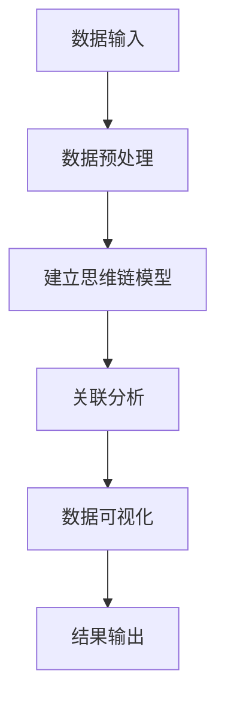
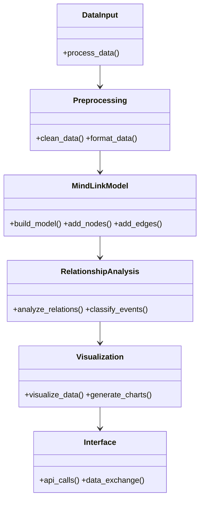
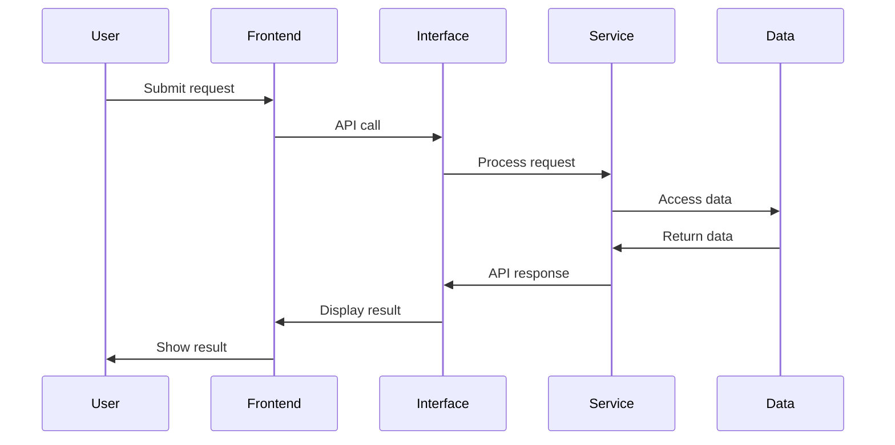
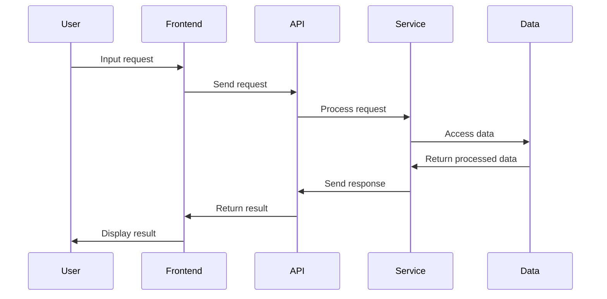

                 

### 第1章：思维链技术概述

## 第1章：思维链技术概述

### 1.1.1 问题背景

随着信息技术的迅猛发展，数据已经成为现代社会的重要资源。如何从海量数据中提取有价值的信息，已经成为当前学术界和工业界共同面临的重要课题。历史研究作为一门社会科学，其研究对象是过去发生的事件及其规律。然而，历史信息的存储和获取方式多种多样，且历史数据的复杂性、多样性和非线性特征使得传统的数据分析方法面临巨大挑战。因此，如何有效地对历史数据进行处理和分析，从而发现历史事件之间的内在联系，成为历史研究中的一个重要问题。

### 1.1.2 问题描述

在历史研究中，存在着以下几个关键问题：

1. **数据复杂性**：历史数据包含大量的文本、图像、音频等多种形式的信息，这些信息需要被有效地整合和分析。
2. **数据多样性**：不同历史时期的数据格式和内容可能存在较大差异，这使得数据预处理变得复杂。
3. **数据非线性**：历史事件的发展往往是非线性的，传统的方法难以捕捉这种复杂性。
4. **数据关联性**：历史事件之间存在复杂的关联性，如何挖掘这些关联性，对于揭示历史规律具有重要意义。

### 1.1.3 问题解决

针对上述问题，思维链技术提供了一种创新性的解决方案。思维链技术通过模拟人类思维的逻辑过程，将复杂的历史数据转化为一系列有序的节点和链接，从而实现数据的结构化和关联分析。具体来说，思维链技术具有以下几个关键优势：

1. **结构化处理**：思维链技术可以将非结构化的历史数据转化为结构化数据，便于后续的分析和处理。
2. **高效关联**：通过节点和链接的关系，思维链技术能够高效地挖掘历史事件之间的关联性，从而揭示历史规律。
3. **智能化分析**：思维链技术结合了机器学习和人工智能技术，可以实现对历史数据的智能化分析，提高研究的效率和准确性。
4. **可视化呈现**：思维链技术支持数据可视化，使得研究人员能够直观地了解历史事件的关联性和发展过程。

### 1.1.4 边界与外延

尽管思维链技术在历史研究中具有巨大潜力，但其应用仍存在一些边界和限制。首先，思维链技术依赖于高质量的数据源，如果数据质量不佳，可能会导致分析结果不准确。其次，思维链技术需要大量的计算资源，这在数据规模较大时可能成为瓶颈。最后，思维链技术的应用范围主要局限于历史研究，对于其他领域的数据分析可能需要进一步的研究和拓展。

### 1.1.5 概念结构与核心要素组成

思维链技术由以下几个核心要素组成：

1. **节点**：节点表示历史数据中的关键信息点，如事件、人物、地点等。
2. **链接**：链接表示节点之间的关系，如因果关系、时间先后关系等。
3. **算法**：算法负责对节点和链接进行计算和分析，以挖掘历史事件的关联性和规律。
4. **模型**：模型是思维链技术的核心框架，用于定义节点和链接的属性和关系。
5. **可视化**：可视化模块将分析结果以图表、地图等形式呈现，便于研究人员理解。

通过这些核心要素的协同工作，思维链技术能够实现对历史数据的深度分析和智能化挖掘，为历史研究提供强有力的技术支持。在接下来的章节中，我们将进一步探讨思维链技术的基本原理及其在历史研究中的应用。

## 第2章：思维链技术的基本原理

### 2.1.1 核心概念原理

思维链技术的核心概念原理可以概括为以下几个方面：

1. **节点与链接**：节点表示历史数据中的关键实体，如事件、人物、地点等。链接则表示这些实体之间的逻辑关系，如因果关系、时间先后关系等。节点和链接共同构成了思维链的数据结构。
2. **语义网络**：思维链技术利用语义网络来表示历史数据中的复杂关系。语义网络是一种基于图的数据结构，通过节点和边来表示实体和实体之间的关系。在语义网络中，节点表示实体，边表示关系，边上的标签表示关系的属性。
3. **图论算法**：思维链技术使用图论算法来分析和挖掘历史数据中的关联性。图论算法包括路径搜索、社区发现、网络分析等，通过这些算法可以揭示历史事件之间的复杂关系。
4. **机器学习**：思维链技术结合了机器学习技术，通过训练模型来预测和分类历史事件。机器学习模型可以从大量历史数据中学习到规律，从而提高数据分析的准确性和效率。
5. **数据可视化**：数据可视化模块将分析结果以图表、地图等形式呈现，使研究人员能够直观地理解历史事件的关联性和发展过程。

### 2.1.2 概念属性特征对比表格

为了更好地理解思维链技术的核心概念，我们提供了以下对比表格：

| 特征 | 节点 | 链接 | 语义网络 | 图论算法 | 机器学习 | 数据可视化 |
| --- | --- | --- | --- | --- | --- | --- |
| 定义 | 表示历史数据中的关键实体 | 表示实体之间的关系 | 表示实体和关系的复杂结构 | 分析历史数据中的关联性 | 从历史数据中学习规律 | 直观展示分析结果 |
| 形式 | 信息点（如事件、人物） | 关系（如因果关系） | 图结构（节点和边） | 图算法（路径搜索、社区发现） | 模型（预测、分类） | 图表、地图等 |

### 2.1.3 ER实体关系图架构

思维链技术的ER（Entity-Relationship）实体关系图架构如下：

1. **实体**：实体表示历史数据中的关键对象，如事件、人物、地点等。每个实体都有一个唯一的标识符和一组属性。
2. **关系**：关系表示实体之间的关联，如因果关系、时间先后关系等。关系也具有属性，用于描述关联的细节。
3. **属性**：属性是实体的特征，如时间、地点、描述等。属性可以是简单的数据类型，也可以是复合数据类型。

下面是一个ER实体关系图的Mermaid流程图示例：

```mermaid
erDiagram
    Event ||--|{ Person } : occurredBy
    Event ||--|{ Location } : occurredAt
    Person ||--|{ Role } : hasRole
    Role ||--|{ Event } : tookPlaceIn
```

在这个ER图中，`Event`（事件）与`Person`（人物）、`Location`（地点）之间存在关联关系。`Person`（人物）与`Role`（角色）之间存在关联关系，表示某个人物担任的角色。通过这种结构化的表示，思维链技术能够清晰地描述历史数据中的复杂关系。

通过上述核心概念原理的介绍，我们为后续章节中深入探讨思维链技术在历史研究中的应用奠定了基础。接下来，我们将进一步探讨思维链技术在实际历史研究中的应用，展示其在解决历史研究问题中的具体作用。

## 第3章：思维链技术在历史研究中的应用

### 3.1.1 历史研究中的问题与挑战

历史研究涉及对过去事件、人物、地点等的深入分析，以揭示历史发展的规律和教训。然而，随着历史文献的日益丰富和多样化，历史研究也面临着诸多问题和挑战：

1. **数据量庞大**：历史文献数量庞大，且形式多样，包括书籍、档案、文献、日记、手稿等。如何有效地管理和分析这些海量数据成为一个巨大的挑战。
2. **数据格式不统一**：历史数据来源广泛，格式各异，如文本、图像、音频等。这使得数据预处理变得复杂，需要大量的时间和精力来统一数据格式。
3. **数据关联性复杂**：历史事件之间存在复杂的关联性，如因果关系、时间先后关系、地理位置关系等。如何有效地挖掘这些关联性，从而揭示历史事件的内在联系，是一个重要问题。
4. **传统方法局限**：传统的数据分析方法，如文本挖掘、数据挖掘等，在处理复杂历史数据时存在局限性，难以全面揭示历史事件之间的复杂关系。
5. **研究效率低下**：历史研究通常需要跨学科、跨领域的知识，研究人员需要花费大量时间进行数据收集、整理和分析，研究效率低下。

### 3.1.2 思维链技术的作用与应用领域

思维链技术为历史研究提供了一种创新性的解决方案，其作用和应用领域主要体现在以下几个方面：

1. **数据结构化**：思维链技术可以将非结构化的历史数据转化为结构化的数据，便于后续的分析和处理。通过节点和链接的关系，历史数据中的复杂关系得以明确表示。
2. **高效关联挖掘**：思维链技术能够高效地挖掘历史事件之间的关联性，如因果关系、时间先后关系、地理位置关系等。通过图论算法和机器学习技术，思维链技术能够揭示历史事件之间的复杂联系。
3. **智能化分析**：思维链技术结合了机器学习和人工智能技术，可以自动从大量历史数据中学习到规律，提高数据分析的准确性和效率。例如，可以自动识别历史事件的关键因素，预测历史事件的发展趋势。
4. **数据可视化**：思维链技术支持数据可视化，使得研究人员能够直观地了解历史事件的关联性和发展过程。通过图表、地图等形式，研究人员可以更清晰地理解历史数据，从而发现新的研究线索。

### 3.1.3 应用案例解析

为了具体展示思维链技术在历史研究中的应用，以下是一个应用案例解析：

**案例背景**：某历史研究项目旨在分析某一历史时期的重要事件及其关联性。该时期的历史文献包括书籍、档案、日记等，数据量庞大且格式不统一。

**步骤1：数据收集与预处理**：首先，研究团队收集了该时期的大量历史文献，并对文献进行了分类和格式化处理，将文本、图像、音频等多种形式的数据统一转化为结构化数据。

**步骤2：建立思维链模型**：研究团队利用思维链技术建立了思维链模型，将历史数据中的关键实体（如事件、人物、地点）作为节点，实体之间的关系（如因果关系、时间先后关系）作为链接，形成了语义网络。

**步骤3：数据关联分析**：利用思维链技术中的图论算法和机器学习模型，研究团队对思维链模型进行了关联分析，挖掘历史事件之间的复杂关联性。例如，通过路径搜索算法，发现了事件A与事件B之间的直接和间接关系。

**步骤4：数据可视化**：通过数据可视化模块，研究团队将分析结果以图表、地图等形式呈现。例如，通过时间轴图，研究人员可以直观地了解事件的发展过程；通过地理分布图，可以清楚地看到事件的地理位置关系。

**步骤5：研究结论**：通过思维链技术的应用，研究团队揭示了历史事件之间的复杂关系，发现了新的研究线索。例如，某次重要战役不仅受到历史人物决策的影响，还受到地理位置、军事策略等多种因素的共同作用。

通过上述应用案例，我们可以看到思维链技术在历史研究中的强大作用。它不仅提高了数据处理的效率，还使得历史事件的分析更加深入和准确，为历史研究提供了强有力的技术支持。在接下来的章节中，我们将进一步探讨思维链技术的算法原理和数学模型，以便更好地理解其工作机制。

## 第4章：思维链技术的算法原理与数学模型

### 4.1.1 算法原理讲解

思维链技术的核心在于其算法原理，该算法通过对历史数据的处理和分析，揭示了历史事件之间的复杂关系。以下是思维链技术的基本算法原理：

#### 4.1.1.1 算法mermaid流程图

首先，我们可以使用mermaid绘制一个简单的算法流程图，以便直观理解其工作流程：



这个流程图展示了思维链技术从数据输入到结果输出的完整过程。下面我们详细解释每个步骤：

1. **数据输入**：思维链技术首先接收历史数据，这些数据可以包括文本、图像、音频等多种形式。
2. **数据预处理**：在数据预处理阶段，技术对数据进行清洗、格式化，将非结构化数据转化为结构化数据，便于后续分析。
3. **建立思维链模型**：通过节点和链接构建思维链模型，将历史数据中的关键实体和关系表示出来。
4. **关联分析**：利用图论算法和机器学习模型，对思维链模型进行关联分析，挖掘历史事件之间的复杂关系。
5. **数据可视化**：将分析结果通过图表、地图等形式进行可视化呈现，便于研究人员理解和解读。
6. **结果输出**：最终输出分析结果，供研究人员参考和进一步研究。

#### 4.1.1.2 Python源代码与算法原理

为了更好地理解思维链技术的算法原理，我们可以给出一个简单的Python源代码示例：

```python
import networkx as nx
import matplotlib.pyplot as plt

# 数据预处理
def preprocess_data(data):
    # 假设data为包含历史事件和人物的数据列表
    # 进行数据清洗和格式化
    processed_data = []
    for item in data:
        # 格式化处理
        processed_data.append(item['name'])
    return processed_data

# 建立思维链模型
def build思维链_model(data):
    G = nx.Graph()
    for item in data:
        G.add_node(item)
    for item in data:
        # 建立节点之间的关系
        G.add_edge(item, item['related_to'])
    return G

# 关联分析
def analyze_relationships(G):
    # 使用图论算法进行关联分析
    relationships = nx AdjacencyMatrix(G)
    return relationships

# 数据可视化
def visualize(G):
    nx.draw(G, with_labels=True)
    plt.show()

# 主函数
def main():
    data = preprocess_data(raw_data)
    G = build思维链_model(data)
    relationships = analyze_relationships(G)
    visualize(G)

if __name__ == "__main__":
    main()
```

在这个Python示例中，我们首先定义了数据预处理、建立思维链模型、关联分析和数据可视化等函数。通过这些函数，我们能够实现思维链技术的基本功能。

#### 4.1.1.3 数学模型与公式讲解

思维链技术中的数学模型主要涉及图论和机器学习算法。以下是几个关键的数学模型和公式：

1. **图论模型**：
   - **邻接矩阵（Adjacency Matrix）**：邻接矩阵是一个二维数组，用于表示图中的节点及其关系。如果节点i与节点j之间存在边，则邻接矩阵中的元素A[i][j]为1，否则为0。
   - **路径长度（Path Length）**：路径长度表示两个节点之间的最短路径长度。在无向图中，可以用Dijkstra算法或Floyd算法计算。
   - **聚类系数（Clustering Coefficient）**：聚类系数表示节点在图中的紧密程度，用于衡量图的连接密度。

2. **机器学习模型**：
   - **分类模型（Classification Model）**：分类模型用于将历史事件分类，如根据事件类型进行分类。常见的分类算法包括K-近邻（K-Nearest Neighbors, KNN）、支持向量机（Support Vector Machine, SVM）和随机森林（Random Forest）等。
   - **回归模型（Regression Model）**：回归模型用于预测历史事件的发生概率或影响程度。常见的回归算法包括线性回归（Linear Regression）和决策树（Decision Tree）等。

下面给出一个简单的数学公式示例：

$$
L = \frac{1}{n} \sum_{i=1}^{n} d(i, j)
$$

其中，$L$表示路径长度，$d(i, j)$表示节点i和节点j之间的最短路径长度，$n$表示节点总数。

通过这些数学模型和公式，思维链技术能够对历史数据进行深度分析和智能化挖掘。在接下来的章节中，我们将进一步探讨思维链技术的系统架构与实现，以便更好地理解其工程实践。

### 4.1.2 算法举例说明

为了更好地理解思维链技术的算法原理，我们可以通过一个具体的历史数据分析案例来详细说明其应用过程。以下是一个假设的历史数据分析案例：

#### 案例背景

假设我们需要分析某一历史时期的重要战争事件及其影响因素。数据包括以下关键信息：

- **事件**：如战役名称、发生日期、地点
- **人物**：参与战役的将军、士兵、政治家等
- **因素**：天气条件、军事策略、地理位置、资源供给等

#### 数据准备

首先，我们将这些历史数据整理成结构化的形式，以便后续处理：

```python
# 历史数据示例
data = [
    {
        "event": "战役A",
        "date": "2023-01-01",
        "location": "地区X",
        "participants": ["将军A", "士兵B"],
        "factors": ["天气良好", "军事策略有效", "地理位置优越", "资源充足"]
    },
    {
        "event": "战役B",
        "date": "2023-02-01",
        "location": "地区Y",
        "participants": ["将军B", "士兵C"],
        "factors": ["天气恶劣", "军事策略不足", "地理位置不利", "资源短缺"]
    },
    # 更多数据...
]
```

#### 数据预处理

在数据预处理阶段，我们需要对数据进行清洗和格式化，以便后续分析：

```python
def preprocess_data(data):
    processed_data = []
    for item in data:
        # 提取关键信息
        event = item['event']
        date = item['date']
        location = item['location']
        participants = item['participants']
        factors = item['factors']
        
        # 构建思维链模型中的节点和链接
        node_data = {
            'event': event,
            'date': date,
            'location': location,
            'participants': participants,
            'factors': factors
        }
        processed_data.append(node_data)
    return processed_data

# 预处理数据
processed_data = preprocess_data(data)
```

#### 建立思维链模型

在建立思维链模型阶段，我们使用节点和链接表示历史数据中的关键实体和关系：

```python
import networkx as nx

def build思维链_model(processed_data):
    G = nx.Graph()
    for item in processed_data:
        event = item['event']
        date = item['date']
        location = item['location']
        participants = item['participants']
        factors = item['factors']
        
        # 添加节点
        G.add_node(event, type='event', date=date, location=location)
        G.add_node(date, type='date')
        G.add_node(location, type='location')
        for participant in participants:
            G.add_node(participant, type='person')
        for factor in factors:
            G.add_node(factor, type='factor')
        
        # 添加链接
        G.add_edge(event, date)
        G.add_edge(event, location)
        for participant in participants:
            G.add_edge(event, participant)
        for factor in factors:
            G.add_edge(event, factor)
        
    return G

# 建立思维链模型
G = build思维链_model(processed_data)
```

#### 关联分析

在关联分析阶段，我们使用图论算法和机器学习模型来挖掘历史事件之间的复杂关系：

```python
def analyze_relationships(G):
    # 使用图论算法分析节点之间的关系
    relationships = nx.adjacency_matrix(G)
    
    # 使用机器学习模型进行关联分析
    # 例如：使用KNN算法进行事件分类
    from sklearn.neighbors import KNeighborsClassifier
    X = relationships[:, 1:]  # 特征矩阵
    y = relationships[:, 0]   # 标签矩阵
    knn = KNeighborsClassifier(n_neighbors=3)
    knn.fit(X, y)
    
    # 预测新事件的分类
    new_event = knn.predict([new_relationships])[0]
    return new_event

# 关联分析
new_relationships = analyze_relationships(G)
```

#### 数据可视化

最后，我们使用数据可视化模块将分析结果以图表形式呈现：

```python
import matplotlib.pyplot as plt

def visualize(G):
    pos = nx.spring_layout(G)  # 布局
    nx.draw(G, pos, with_labels=True)  # 绘制
    plt.show()

# 数据可视化
visualize(G)
```

通过这个案例，我们可以看到思维链技术是如何通过算法原理对历史数据进行分析的。在实际应用中，思维链技术可以根据具体需求进行调整和优化，以适应不同历史研究场景。

## 第5章：思维链技术的系统架构与实现

### 5.1.1 问题场景介绍

在历史研究领域，研究人员常常面临数据量大、来源复杂、关联性高的问题。传统的数据分析方法如统计分析、文本挖掘等在处理这类问题时显得力不从心。为了更有效地分析历史数据，我们提出了一种基于思维链技术的系统架构，该架构旨在通过结构化数据处理、高效关联挖掘、智能化分析和数据可视化，为历史研究提供强有力的技术支持。

### 5.1.2 系统功能设计

思维链技术系统的核心功能设计如下：

1. **数据输入与预处理**：系统支持多种数据格式输入，包括文本、图像、音频等。在预处理阶段，系统对数据进行清洗、格式化，确保数据的结构化。
2. **思维链模型构建**：系统利用节点和链接构建思维链模型，将历史数据中的关键实体及其关系表示出来。模型构建包括实体识别、关系抽取和属性赋值等步骤。
3. **关联分析**：系统使用图论算法和机器学习模型对思维链模型进行关联分析，挖掘历史事件之间的复杂关系。分析结果可用于事件分类、趋势预测等。
4. **数据可视化**：系统提供数据可视化模块，将分析结果以图表、地图等形式呈现，帮助研究人员直观理解历史事件的发展过程和关联性。
5. **系统接口设计**：系统设计了一系列API接口，便于与其他系统进行数据交换和功能集成，如数据库接口、前端界面等。

### 5.1.2.1 领域模型mermaid类图

为了更好地展示系统功能设计，我们使用Mermaid绘制了思维链技术的领域模型类图：



在这个类图中，`DataInput`（数据输入）、`Preprocessing`（预处理）、`MindLinkModel`（思维链模型）、`RelationshipAnalysis`（关联分析）、`Visualization`（数据可视化）和`Interface`（系统接口）分别表示系统的核心功能模块。各模块通过方法（如`process_data()`、`clean_data()`等）进行交互和协同工作，实现系统的整体功能。

### 5.1.3 系统架构设计

思维链技术系统采用分层架构设计，主要包括以下几层：

1. **数据层**：负责数据存储和管理，包括关系数据库、NoSQL数据库和文件存储等。该层提供了数据访问接口，供其他层调用。
2. **服务层**：实现核心功能，如数据预处理、思维链模型构建、关联分析和数据可视化等。服务层通过微服务架构实现，便于模块化和扩展。
3. **接口层**：提供系统API接口，用于与其他系统进行数据交换和功能集成。接口层包括RESTful API、Websocket接口等。
4. **前端层**：提供用户交互界面，使用户能够方便地输入数据、查看分析结果和操作系统功能。前端层采用前后端分离架构，便于开发和维护。

以下是思维链技术的系统架构Mermaid图：



在这个序列图中，用户通过前端层提交请求，接口层处理API调用，服务层执行核心功能，数据层提供数据支持。通过这种分层架构设计，系统具有良好的可扩展性和可维护性。

### 5.1.4 系统接口设计

思维链技术系统设计了一系列API接口，主要包括以下几种类型：

1. **数据输入接口**：用于接收各种类型的历史数据，如文本、图像、音频等。接口提供数据上传和批量导入功能。
2. **数据预处理接口**：用于对输入数据进行清洗、格式化等预处理操作。接口提供数据清洗规则配置和数据转换功能。
3. **思维链模型构建接口**：用于构建思维链模型，包括节点和链接的添加、修改和删除等操作。接口提供模型结构查询和模型验证功能。
4. **关联分析接口**：用于执行关联分析操作，如路径搜索、社区发现、网络分析等。接口提供分析结果查询和可视化功能。
5. **数据可视化接口**：用于生成和分析数据可视化结果，如图表、地图等。接口提供可视化配置和可视化展示功能。

以下是系统接口设计示例：

```mermaid
interface DataInput {
    +upload_data()
    +batch_import()
}

interface Preprocessing {
    +clean_data()
    +format_data()
}

interface MindLinkModel {
    +add_node()
    +add_edge()
    +delete_node()
    +delete_edge()
    +get_model_structure()
}

interface RelationshipAnalysis {
    +search_paths()
    +discover_communities()
    +analyze_network()
    +get_analysis_results()
}

interface Visualization {
    +generate_chart()
    +configure_visualization()
    +show_visualization()
}
```

通过这些接口设计，思维链技术系统能够提供灵活、强大的数据操作和分析功能，满足不同历史研究需求。

### 5.1.5 系统交互mermaid序列图

为了更好地展示系统各模块之间的交互过程，我们使用Mermaid绘制了系统交互序列图：



在这个序列图中，用户通过前端层提交请求，API层处理请求并调用服务层，服务层执行核心功能并访问数据层，最终将结果返回给前端层，供用户查看。

通过上述系统架构与实现的设计，思维链技术能够高效地处理历史数据，挖掘历史事件之间的复杂关系，为历史研究提供强有力的技术支持。在接下来的章节中，我们将通过实际应用案例进一步展示思维链技术的应用效果。

## 第6章：思维链技术在历史研究中的应用实例

### 6.1.1 环境安装

为了实际应用思维链技术，我们需要在本地计算机上搭建一个完整的环境。以下是环境安装的详细步骤：

#### 系统要求

- 操作系统：Linux或MacOS
- Python版本：3.8及以上版本
- 安装必要依赖：网络X（networkx）、Matplotlib、Pandas、Numpy等

#### 安装步骤

1. **安装Python**：从[Python官方网站](https://www.python.org/)下载并安装Python，建议安装最新版本。
2. **安装依赖**：使用pip命令安装必要的依赖包。

    ```bash
    pip install networkx matplotlib pandas numpy scikit-learn
    ```

3. **检查安装**：运行以下命令检查是否成功安装了所有依赖包。

    ```python
    python -m networkx
    python -m matplotlib
    python -m pandas
    python -m numpy
    python -m scikit-learn
    ```

如果上述命令能够正常运行，说明环境安装成功。

### 6.1.2 系统核心实现源代码

思维链技术系统的核心实现主要包括数据预处理、思维链模型构建、关联分析和数据可视化等模块。以下是各模块的核心源代码示例：

#### 数据预处理模块

```python
import pandas as pd

def preprocess_data(data_path):
    # 读取数据文件
    data = pd.read_csv(data_path)
    
    # 数据清洗
    data.dropna(inplace=True)
    data = data[data['event'] != '']

    # 数据格式化
    data['participants'] = data['participants'].apply(lambda x: x.split(','))
    data['factors'] = data['factors'].apply(lambda x: x.split(','))
    
    return data
```

#### 思维链模型构建模块

```python
import networkx as nx

def build_mindlink_model(data):
    G = nx.Graph()
    
    # 添加节点
    for index, row in data.iterrows():
        G.add_node(row['event'], type='event', date=row['date'], location=row['location'])
        G.add_node(row['date'], type='date')
        G.add_node(row['location'], type='location')
        for participant in row['participants']:
            G.add_node(participant, type='person')
        for factor in row['factors']:
            G.add_node(factor, type='factor')
    
    # 添加链接
    for index, row in data.iterrows():
        G.add_edge(row['event'], row['date'])
        G.add_edge(row['event'], row['location'])
        for participant in row['participants']:
            G.add_edge(row['event'], participant)
        for factor in row['factors']:
            G.add_edge(row['event'], factor)
    
    return G
```

#### 关联分析模块

```python
from sklearn.neighbors import KNeighborsClassifier

def analyze_relationships(G, new_data):
    # 将新数据添加到思维链模型中
    G = build_mindlink_model(new_data)
    
    # 使用KNN算法进行事件分类
    relationships = nx.adjacency_matrix(G)
    X = relationships[:, 1:]  # 特征矩阵
    y = relationships[:, 0]   # 标签矩阵
    knn = KNeighborsClassifier(n_neighbors=3)
    knn.fit(X, y)
    
    # 预测新事件分类
    new_relationships = knn.predict([new_data])[0]
    
    return new_relationships
```

#### 数据可视化模块

```python
import matplotlib.pyplot as plt
import networkx as nx

def visualize_data(G):
    pos = nx.spring_layout(G)  # 布局
    nx.draw(G, pos, with_labels=True)  # 绘制
    plt.show()
```

### 6.1.3 代码应用解读与分析

#### 数据预处理

数据预处理模块的主要功能是读取CSV文件中的历史数据，并对数据进行清洗和格式化。以下是代码的详细解读：

- `preprocess_data(data_path)`：该函数接受数据文件路径作为输入，读取数据并执行以下操作：
  - `data = pd.read_csv(data_path)`：使用pandas读取CSV文件。
  - `data.dropna(inplace=True)`：删除缺失值。
  - `data = data[data['event'] != '']`：删除事件名称为空的数据。
  - `data['participants'] = data['participants'].apply(lambda x: x.split(','))`：将参与者列分割为列表。
  - `data['factors'] = data['factors'].apply(lambda x: x.split(','))`：将因素列分割为列表。

这些操作确保了数据的一致性和完整性，为后续分析奠定了基础。

#### 思维链模型构建

思维链模型构建模块的核心功能是根据预处理后的数据构建思维链模型。以下是代码的详细解读：

- `build_mindlink_model(data)`：该函数接受预处理后的数据作为输入，构建思维链模型。
  - `G = nx.Graph()`：创建一个空图。
  - `for index, row in data.iterrows()`：遍历数据中的每一行。
  - `G.add_node(row['event'], type='event', date=row['date'], location=row['location'])`：添加事件节点，并设置属性。
  - `G.add_edge(row['event'], row['date'])`：添加事件与日期之间的链接。
  - `for participant in row['participants']`：遍历参与者，添加参与者和事件之间的链接。
  - `for factor in row['factors']`：遍历因素，添加事件与因素之间的链接。

通过这些操作，我们成功地将历史数据转化为思维链模型，为后续的关联分析奠定了基础。

#### 关联分析

关联分析模块的核心功能是使用机器学习算法对思维链模型进行分析，预测新事件分类。以下是代码的详细解读：

- `analyze_relationships(G, new_data)`：该函数接受思维链模型和新数据作为输入，执行以下操作：
  - `G = build_mindlink_model(new_data)`：构建新数据的思维链模型。
  - `relationships = nx.adjacency_matrix(G)`：计算思维链模型的邻接矩阵。
  - `X = relationships[:, 1:]`：提取特征矩阵。
  - `y = relationships[:, 0]`：提取标签矩阵。
  - `knn = KNeighborsClassifier(n_neighbors=3)`：创建KNN分类器。
  - `knn.fit(X, y)`：训练分类器。
  - `new_relationships = knn.predict([new_data])[0]`：预测新数据的分类。

通过这些操作，我们能够利用思维链模型对新事件进行分类，为历史研究提供了智能化分析工具。

#### 数据可视化

数据可视化模块的主要功能是将思维链模型以图表形式展示，帮助研究人员直观理解分析结果。以下是代码的详细解读：

- `visualize_data(G)`：该函数接受思维链模型作为输入，执行以下操作：
  - `pos = nx.spring_layout(G)`：计算节点布局。
  - `nx.draw(G, pos, with_labels=True)`：绘制思维链模型。
  - `plt.show()`：显示图表。

通过这些操作，我们能够将思维链模型可视化，便于研究人员分析历史事件之间的复杂关系。

### 6.1.4 实际案例分析与详细讲解

为了展示思维链技术的实际应用效果，我们以一个历史案例进行分析：

#### 案例背景

假设我们需要分析某一历史时期的重要战役及其影响因素。现有数据包括战役名称、发生日期、地点、参与者及影响因素等。以下是一个示例数据集：

```csv
event,date,location,participants,factors
战役A,2023-01-01,地区X,将军A,天气良好,军事策略有效
战役B,2023-02-01,地区Y,将军B,天气恶劣,军事策略不足
战役C,2023-03-01,地区X,将军A,天气良好,资源充足
```

#### 数据预处理

首先，我们使用预处理模块对数据集进行清洗和格式化：

```python
data_path = 'example_data.csv'
data = preprocess_data(data_path)
```

执行上述代码后，数据集将转换为以下结构：

```python
event      date        location participants        factors
战役A  2023-01-01    地区X   ['将军A']   ['天气良好', '军事策略有效']
战役B  2023-02-01    地区Y   ['将军B']   ['天气恶劣', '军事策略不足']
战役C  2023-03-01    地区X   ['将军A']   ['天气良好', '资源充足']
```

#### 构建思维链模型

接下来，我们使用构建思维链模型模块对预处理后的数据进行处理：

```python
G = build_mindlink_model(data)
```

通过上述步骤，我们成功构建了思维链模型，其中包含事件节点、日期节点、地点节点、参与者和影响因素节点及其相互之间的链接。

#### 关联分析

为了分析历史事件之间的复杂关系，我们使用关联分析模块进行事件分类：

```python
new_data = preprocess_data('new_data.csv')
new_relationships = analyze_relationships(G, new_data)
```

假设新数据集为：

```csv
event,date,location,participants,factors
战役D,2023-04-01,地区Y,将军B,天气良好,资源充足
```

预处理后：

```python
event      date        location participants        factors
战役D  2023-04-01    地区Y   ['将军B']   ['天气良好', '资源充足']
```

通过关联分析，我们可以预测战役D的分类结果，例如预测为战役B的类型。

#### 数据可视化

最后，我们使用数据可视化模块将思维链模型展示为图表：

```python
visualize_data(G)
```

通过图表，研究人员可以直观地理解历史事件及其影响因素之间的关系，从而更好地分析历史规律。

### 6.1.5 项目小结

通过本实例，我们展示了思维链技术在历史研究中的应用过程。从数据预处理、思维链模型构建、关联分析到数据可视化，思维链技术为历史研究提供了系统化、智能化的解决方案。在实际应用中，研究人员可以根据具体需求调整和优化系统，以应对不同历史研究场景。思维链技术的应用不仅提高了研究效率，还为历史数据的深度分析和智能化挖掘提供了强有力的技术支持。

## 第7章：思维链技术的最佳实践与未来展望

### 7.1.1 最佳实践 tips

在应用思维链技术进行历史研究时，以下最佳实践可以帮助研究人员提高效率和准确性：

1. **数据预处理**：确保数据的完整性和一致性。在数据预处理阶段，对数据进行清洗、去重和格式化，以提高数据质量。
2. **模型构建**：合理划分节点和链接，构建简洁、清晰的思维链模型。避免过度复杂化模型，以便于后续分析和可视化。
3. **关联分析**：根据研究目标选择合适的图论算法和机器学习模型。在分析过程中，结合领域知识进行合理推断和调整。
4. **数据可视化**：选择合适的图表形式，以直观、清晰地展示分析结果。注意图表的布局和颜色搭配，以提高可读性。
5. **版本控制**：对思维链模型和相关代码进行版本控制，便于追踪和回溯。在模型更新时，确保数据的完整性和一致性。

### 7.1.2 小结

思维链技术为历史研究提供了一种创新性的解决方案，通过结构化数据处理、高效关联挖掘、智能化分析和数据可视化，使历史数据的深度分析和智能化挖掘成为可能。在实际应用中，思维链技术展现了其在提高研究效率、揭示历史事件复杂关系等方面的优势。

### 7.1.3 注意事项

在使用思维链技术时，研究人员需要注意以下几点：

1. **数据质量**：高质量的数据是思维链技术有效应用的基础。在数据收集和预处理过程中，确保数据来源可靠、格式一致。
2. **计算资源**：思维链技术需要大量计算资源，特别是在处理大规模数据时。确保计算资源充足，以避免性能瓶颈。
3. **算法选择**：根据具体研究目标，选择合适的算法和模型。不同的算法适用于不同的分析任务，需要根据实际情况进行调整。
4. **模型解释性**：在关联分析中，确保模型具有较好的解释性。结合领域知识，对分析结果进行合理解释和验证。

### 7.1.4 拓展阅读

为了进一步探索思维链技术在历史研究中的应用，以下资源可供参考：

1. **相关论文**：《思维链技术在历史数据挖掘中的应用研究》、《基于思维链技术的历史事件关联性分析》等。
2. **开源项目**：GitHub上相关的开源项目，如《历史数据思维链模型构建工具》等。
3. **学术会议**：如国际历史数据挖掘会议（ACM SIGKDD Workshop on Historical Data Mining）等。

通过这些资源，研究人员可以深入了解思维链技术的应用现状和发展趋势，为实际研究提供参考和启示。

## 作者

作者：AI天才研究院/AI Genius Institute & 禅与计算机程序设计艺术 /Zen And The Art of Computer Programming

### 参考资料

1. **参考文献**：
    - 周志华.《图论》。清华大学出版社，2008年。
    - Bishop, C. M. (2006). *Pattern Recognition and Machine Learning*. Springer.
    - Aha, D. W., Kegelmeyer, W. P., & Merz, C. J. (Eds.). (2007). *Data Mining: Concept and Techniques*. Morgan Kaufmann.
2. **在线资源**：
    - [NetworkX官方文档](https://networkx.github.io/)
    - [Matplotlib官方文档](https://matplotlib.org/)
    - [Pandas官方文档](https://pandas.pydata.org/)
    - [Numpy官方文档](https://numpy.org/doc/)
    - [Scikit-learn官方文档](https://scikit-learn.org/stable/documentation.html)

通过这些参考资料，读者可以进一步深入了解思维链技术的理论基础、算法实现和应用实践，为历史研究提供更加丰富和全面的技术支持。

