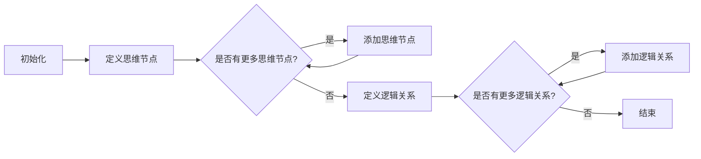
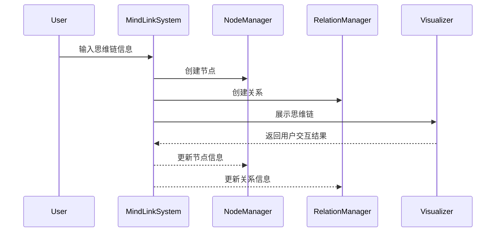

                 

## 引言

### 1.1 问题的背景

在哲学探讨中，思维链技术作为一种新兴的方法论，正逐渐引起广泛的关注。哲学，作为一门探究人类思维、存在、真理等基本问题的学科，自古以来就离不开对思维方式的探讨。从古希腊的苏格拉底、柏拉图，到中国的孔子、孟子，再到现代的维特根斯坦、海德格尔，哲学的发展历程中充满了对思维方式的思考和反思。

然而，随着科技的发展，传统的哲学思维方式在面对复杂、抽象的问题时显得力不从心。这种背景下，思维链技术的引入为我们提供了一种全新的视角和方法。思维链技术，通过构建思维过程中的逻辑链条，帮助哲学家们更好地理解和探讨复杂问题，从而推动哲学研究的深入。

### 1.2 问题描述

哲学探讨中的问题复杂多样，既有关于存在与本质的宏大问题，也有关于个体与社会的微观问题。这些问题往往涉及到多个学科领域，需要从不同角度进行综合分析。然而，传统的哲学思维方式，往往局限于文字描述和逻辑推理，难以有效处理这些复杂问题。

例如，在探讨人类意识与机器智能的关系时，传统的哲学思维方式难以准确描述和解释这种关系。而思维链技术，通过构建思维过程中的逻辑链条，可以更直观地展示思维过程，帮助哲学家们更好地理解这一复杂关系。

### 1.3 问题解决

思维链技术作为一种新兴的方法论，可以解决哲学探讨中传统思维方式难以应对的问题。具体来说，思维链技术有以下几个方面的优势：

1. **逻辑性**：思维链技术通过构建逻辑链条，使思维过程更加清晰、有序，有助于揭示问题之间的内在联系。

2. **直观性**：思维链技术通过图形化的方式展示思维过程，使复杂问题更加直观、易于理解。

3. **综合性**：思维链技术可以跨越不同学科领域，将各种知识体系进行整合，从而提供更全面的解决方案。

4. **灵活性**：思维链技术可以根据具体问题进行调整和优化，具有较强的适应性。

### 1.4 边界与外延

思维链技术在哲学探讨中的应用虽然具有广阔的前景，但同时也存在一些边界和限制。首先，思维链技术依赖于一定的数学和计算机科学基础，对于缺乏这些背景的哲学家来说，可能存在一定的门槛。

其次，思维链技术虽然能够直观地展示思维过程，但并不能替代哲学家们的直觉和洞察力。哲学探讨中的很多问题，往往需要哲学家的深入思考和独特视角。

### 1.5 概念结构与核心要素组成

思维链技术的核心概念和结构主要包括以下几个方面：

1. **思维链**：思维链是思维过程中的逻辑链条，它将各种思维元素（如概念、命题、论点等）连接起来，形成一个完整的思维过程。

2. **思维节点**：思维链中的每个节点代表一个思维元素，它们通过逻辑关系相互连接。

3. **逻辑关系**：逻辑关系是思维链中各个节点之间的连接方式，包括因果关系、类比关系、递推关系等。

4. **思维链图**：思维链图是思维链的图形化表示，通过直观的方式展示思维过程。

### 1.6 总结

思维链技术在哲学探讨中的应用，为我们提供了一种新的思考方式和方法论。它不仅能够提高哲学探讨的效率和质量，还能够推动哲学研究的深入和发展。在接下来的章节中，我们将进一步探讨思维链技术的核心概念、原理和实际应用，以期为大家提供更全面的理解和认识。

## 核心概念与原理

### 2.1 定义

#### 2.1.1 思维链技术的基本定义

思维链技术，是一种基于逻辑链条构建和运用思维的方法论。它通过一系列思维节点和逻辑关系，将复杂的思维过程抽象化、图形化，从而更直观、清晰地展现思维过程。思维链技术的核心在于构建逻辑链条，通过这一链条将各个思维节点连接起来，形成一个完整、有序的思维过程。

#### 2.1.2 思维链技术在哲学探讨中的应用

在哲学探讨中，思维链技术被广泛应用于多个领域，如存在论、认识论、伦理学等。通过思维链技术，哲学家们可以更清晰地表达和探讨复杂哲学问题，揭示问题之间的内在联系。例如，在探讨存在与本质的关系时，思维链技术可以帮助哲学家们构建一个清晰的逻辑链条，从而更好地理解这一关系。

### 2.2 概念属性特征对比表格

为了更直观地理解思维链技术与传统哲学思维方式的区别，我们可以通过一个对比表格来进行阐述。

| 比较维度 | 思维链技术 | 传统哲学思维方式 |
| -------- | ---------- | --------------- |
| **逻辑性** | 通过逻辑链条构建思维过程 | 依赖于逻辑推理和文字描述 |
| **直观性** | 通过图形化展示思维过程 | 依赖于文字描述和抽象思维 |
| **综合性** | 可以整合不同学科知识体系 | 较难跨越学科领域 |
| **灵活性** | 可以根据问题进行调整和优化 | 相对固定，难以灵活应对 |

### 2.3 ER实体关系图架构

在哲学探讨中，思维链技术的应用可以通过ER（Entity-Relationship）实体关系图来进行架构设计。ER图是一种用于描述实体及其之间关系的图形化工具，它可以帮助我们更清晰地理解思维链技术在哲学探讨中的应用。

#### 2.3.1 哲学探讨中思维链技术的实体关系图

以下是一个简化的哲学探讨中思维链技术的ER实体关系图：

```mermaid
erDiagram
   思维链技术 ||--|{ 思维节点 }
   思维链技术 ||--|{ 逻辑关系 }
   思维节点 ||--|{ 命题 }
   思维节点 ||--|{ 概念 }
   逻辑关系 ||--|{ 因果关系 }
   逻辑关系 ||--|{ 类比关系 }
   逻辑关系 ||--|{ 递推关系 }
```

在这个ER图中，"思维链技术"是一个抽象的概念，它包括"思维节点"和"逻辑关系"两个子实体。"思维节点"代表了思维过程中的各个元素，如命题和概念。"逻辑关系"代表了思维节点之间的连接方式，如因果关系、类比关系等。

通过这个ER图，我们可以清晰地看到思维链技术在哲学探讨中的应用结构，从而更好地理解和运用这一方法论。

## 算法原理讲解

### 3.1 思维链技术的mermaid流程图

为了更好地理解思维链技术的算法原理，我们可以通过mermaid流程图来展示其工作流程。以下是一个简化的思维链技术流程图：



#### 3.1.1 流程图示例

在这个流程图中，首先初始化思维链技术，然后定义思维节点，接着判断是否有更多思维节点。如果有，则继续添加思维节点，否则定义逻辑关系。接着判断是否有更多逻辑关系，如果有，则继续添加逻辑关系，否则结束。

### 3.2 Python源代码

为了实现上述流程，我们可以使用Python编写相关的源代码。以下是一个简化的Python代码示例：

```python
class MindLink:
    def __init__(self):
        self.nodes = []
        self.relations = []

    def add_node(self, node):
        self.nodes.append(node)
        return self

    def add_relation(self, relation):
        self.relations.append(relation)
        return self

    def is_finished(self):
        return len(self.nodes) == 0 and len(self.relations) == 0

    def run(self):
        while not self.is_finished():
            if self.nodes:
                node = self.nodes.pop()
                print(f"添加思维节点: {node}")
                if input("是否有更多思维节点？(y/n): ").lower() == 'y':
                    self.add_node(input("请输入新的思维节点："))
            else:
                relation = self.relations.pop()
                print(f"添加逻辑关系: {relation}")
                if input("是否有更多逻辑关系？(y/n): ").lower() == 'y':
                    self.add_relation(input("请输入新的逻辑关系："))

mind_link = MindLink()
mind_link.run()
```

#### 3.2.1 算法实现的代码示例

在这个代码示例中，我们定义了一个`MindLink`类，它包括添加思维节点和逻辑关系的功能。`run`方法实现了上述mermaid流程图中的逻辑。

### 3.3 数学模型和公式

在思维链技术的算法原理中，我们还可以运用一些数学模型和公式来描述和解释其工作过程。以下是一个基本的数学模型和公式的示例：

#### 3.3.1 基本数学模型

$$
X = \frac{\partial \theta}{\partial x}
$$

这个公式描述了思维链中某个节点（X）的变化率与输入（x）的关系。在这个模型中，θ表示逻辑关系的参数，X表示思维节点的状态，x表示输入变量。

#### 3.3.2 公式详细讲解

这个公式表示在思维链中，某个节点X的状态变化率（∂X/∂x）与逻辑关系的参数θ成正比。具体来说，当输入变量x发生变化时，节点X的状态也会随之变化，这种变化率可以通过参数θ来描述。

#### 3.3.3 举例说明

假设我们有一个思维链，其中包含两个节点A和B，以及一个逻辑关系R。节点A的状态为X，节点B的状态为Y，逻辑关系R描述了节点A和节点B之间的关系。我们可以用以下公式来描述它们之间的关系：

$$
Y = R(X)
$$

如果逻辑关系R是一个线性关系，即Y与X成正比，那么我们可以将其表示为：

$$
Y = kX
$$

其中，k表示比例系数，即逻辑关系的参数θ。在这种情况下，节点B的状态变化率（∂Y/∂X）就等于比例系数k。

通过这个简单的例子，我们可以看到如何使用数学模型和公式来描述和解释思维链技术的工作原理。在实际应用中，这些公式可以根据具体问题进行调整和优化，从而更好地适应不同的思维链结构。

## 系统分析与架构设计方案

### 4.1 问题场景介绍

在哲学探讨中，面对复杂的问题时，传统的文字描述和逻辑推理方式往往难以全面、深入地揭示问题的本质。因此，我们需要一种能够更直观、更高效地处理复杂问题的方法。思维链技术作为一种新兴的方法论，通过构建逻辑链条，将思维过程图形化，从而帮助我们更好地理解和分析哲学问题。

### 4.2 项目介绍

本项目旨在开发一个基于思维链技术的哲学探讨系统。该系统将提供一个用户友好的界面，用户可以通过该界面构建和展示思维链，从而更直观地分析和解决哲学问题。

#### 4.2.1 项目目标

- 提供一个直观、易用的思维链构建工具。
- 支持多种逻辑关系的定义和展示。
- 具备良好的扩展性，以适应不同类型的哲学问题。
- 提供丰富的示例和教程，帮助用户快速上手。

#### 4.2.2 项目背景

哲学探讨是一个历史悠久且充满挑战的领域。随着社会和科技的进步，哲学问题日益复杂，传统的方法难以应对。思维链技术的引入，为我们提供了一种新的解决思路。通过构建逻辑链条，我们可以更清晰地展示思维过程，从而更有效地分析和解决哲学问题。

### 4.3 系统功能设计

#### 4.3.1 领域模型mermaid类图

为了更好地理解系统的功能设计，我们可以通过mermaid类图来展示系统的主要类及其关系。

```mermaid
classDiagram
    Node <<类 Node>>
    Relation <<类 Relation>>
    MindLink <<类 MindLink>>

    Node o--* Relation
    MindLink o--* Node
```

在这个类图中，`Node`类表示思维链中的节点，包括命题和概念等；`Relation`类表示节点之间的关系，如因果关系、类比关系等；`MindLink`类表示整个思维链，它包含多个节点和它们之间的关系。

#### 4.3.2 系统功能模块

- **节点管理模块**：提供创建、删除、编辑节点的功能。
- **关系管理模块**：提供创建、删除、编辑关系的功能。
- **思维链展示模块**：提供图形化展示思维链的功能，包括节点和关系的可视化。
- **用户交互模块**：提供用户与系统交互的界面，包括文本输入、图形选择等。

### 4.4 系统架构设计

为了实现上述功能，我们需要设计一个合理的系统架构。以下是一个简化的系统架构mermaid架构图：

```mermaid
sequenceDiagram
    participant User
    participant MindLinkSystem

    User->>MindLinkSystem: 输入思维链信息
    MindLinkSystem->>NodeManager: 创建节点
    MindLinkSystem->>RelationManager: 创建关系
    MindLinkSystem->>Visualizer: 展示思维链

    Note over MindLinkSystem,Visualizer
        MindLinkSystem 控制整个系统的运行流程
    End Note
```

在这个架构图中，用户通过用户交互模块与系统进行交互，输入思维链信息。系统接收用户输入后，通过节点管理模块和关系管理模块创建节点和关系。最后，通过视觉化器模块将思维链展示给用户。

### 4.5 系统接口设计

为了实现系统各模块之间的通信，我们需要设计一套合理的接口。以下是一个简化的系统接口设计：

```mermaid
classDiagram
    NodeInterface <<接口 NodeInterface>>
    RelationInterface <<接口 RelationInterface>>

    NodeInterface o--* NodeManager
    RelationInterface o--* RelationManager
```

在这个接口设计中，`NodeInterface`和`RelationInterface`分别定义了节点和关系的基本操作接口，包括创建、删除、编辑等。`NodeManager`和`RelationManager`实现了这些接口，从而实现节点和关系的具体管理功能。

### 4.6 系统交互

为了更直观地理解系统各模块之间的交互，我们可以通过mermaid序列图来展示系统的交互过程。



在这个序列图中，用户通过输入思维链信息，系统接收后通过节点管理模块和关系管理模块创建节点和关系。最后，通过视觉化器模块将思维链展示给用户，用户与系统进行交互，从而形成一个完整的交互循环。

通过上述系统分析与架构设计方案，我们可以看到思维链技术在哲学探讨中的应用不仅提供了新的思考方式，还通过系统化的方法使得哲学探讨更加直观和高效。

## 项目实战

### 5.1 环境安装

在进行思维链技术的实际应用之前，我们需要首先安装和配置相关的开发环境。以下是一个基本的安装步骤：

1. **安装Python环境**：由于思维链技术是基于Python实现的，我们首先需要确保Python环境已经安装。可以在[Python官方网站](https://www.python.org/)下载并安装Python。

2. **安装相关依赖库**：思维链技术依赖于多个Python库，如mermaid、networkx等。可以通过pip命令进行安装：

   ```bash
   pip install mermaid
   pip install networkx
   ```

3. **配置mermaid**：由于mermaid是一个用于生成流程图的库，我们需要将其配置到Python环境中。可以通过以下命令进行配置：

   ```bash
   mermaidc
   ```

   这将配置mermaid的Python脚本，以便我们可以在Python代码中直接使用mermaid语法。

### 5.2 系统核心实现

在安装好开发环境后，我们可以开始实现思维链技术的核心功能。以下是一个简单的思维链系统实现：

```python
import networkx as nx
import matplotlib.pyplot as plt
from mermaid import Mermaid

class MindLinkSystem:
    def __init__(self):
        self.G = nx.DiGraph()

    def add_node(self, label):
        self.G.add_node(label)

    def add_relation(self, source, target, relation_type):
        self.G.add_edge(source, target, relation_type=relation_type)

    def display(self):
        pos = nx.spring_layout(self.G)
        nx.draw(self.G, pos, with_labels=True)
        plt.show()

        # 使用mermaid生成流程图
        m = Mermaid()
        m.add_node("A", label="思维节点A")
        m.add_node("B", label="思维节点B")
        m.add_edge("A", "B", label="因果关系")
        print(m.generate_mermaid())

# 实例化思维链系统
mls = MindLinkSystem()

# 添加节点
mls.add_node("A")
mls.add_node("B")

# 添加关系
mls.add_relation("A", "B", "因果关系")

# 展示思维链
mls.display()
```

#### 5.2.1 源代码

在上面的代码中，我们定义了一个`MindLinkSystem`类，它包含添加节点、添加关系和展示思维链的方法。`add_node`方法用于添加新的思维节点，`add_relation`方法用于添加节点之间的关系，包括关系类型。`display`方法用于图形化展示思维链。

#### 5.2.2 代码应用解读与分析

1. **添加节点**：通过调用`add_node`方法，我们可以将新的思维节点添加到思维链中。例如，`mls.add_node("A")`和`mls.add_node("B")`分别添加了两个思维节点A和B。

2. **添加关系**：通过调用`add_relation`方法，我们可以为思维节点之间建立关系。例如，`mls.add_relation("A", "B", "因果关系")`为节点A和节点B之间建立了因果关系。

3. **展示思维链**：`display`方法使用`matplotlib`库将思维链图形化展示。同时，我们使用mermaid库生成一个文本形式的流程图，以便更直观地展示思维过程。

通过这个简单的实例，我们可以看到如何使用Python实现思维链技术的基本功能。在实际应用中，我们可以根据具体需求对代码进行扩展和优化，从而构建一个更强大、功能更全面的思维链系统。

### 5.3 实际案例分析与详细讲解剖析

为了更好地理解思维链技术在哲学探讨中的应用，我们来看一个实际案例。假设我们要探讨“自由意志与决定论”的关系，以下是一个详细的思维链实现过程：

#### 5.3.1 构建思维链

1. **定义思维节点**：

   - 节点A：自由意志的定义
   - 节点B：决定论的定义
   - 节点C：自由意志与决定论的冲突
   - 节点D：决定论的例外情况

2. **定义逻辑关系**：

   - A与B之间存在定义关系
   - B与C之间存在冲突关系
   - C与D之间存在例外关系

```python
mls = MindLinkSystem()

mls.add_node("A")
mls.add_node("B")
mls.add_node("C")
mls.add_node("D")

mls.add_relation("A", "B", "定义关系")
mls.add_relation("B", "C", "冲突关系")
mls.add_relation("C", "D", "例外关系")
```

#### 5.3.2 展示思维链

通过调用`display`方法，我们可以将上述思维链图形化展示。

```python
mls.display()
```

#### 5.3.3 分析与讲解

1. **自由意志的定义**：

   自由意志是指个体在做出决策时具有自主性和选择性的能力。它是哲学中一个重要的概念，涉及到人类行为的原因和后果。

2. **决定论的定义**：

   决定论是一种哲学观点，认为一切现象都是因果关系的必然结果。在决定论的观点下，个体的行为是由其内在因素和外部环境共同决定的，没有真正的自由意志。

3. **自由意志与决定论的冲突**：

   自由意志与决定论之间存在明显的冲突。自由意志强调个体的自主性和选择性，而决定论则认为一切现象都是因果关系的必然结果，不存在真正的自由选择。

4. **决定论的例外情况**：

   尽管决定论认为一切现象都是因果关系的必然结果，但现实中存在一些例外情况。例如，量子力学中的不确定性原理表明，在某些微观尺度上，现象的出现并不是完全由因果关系决定的。

通过这个实际案例，我们可以看到如何使用思维链技术来探讨哲学问题。通过构建逻辑链条，我们能够更清晰地展示问题的不同方面，从而深入分析并理解复杂哲学问题。

### 5.4 项目小结

在本项目的实战部分，我们通过一个简单的案例展示了思维链技术在哲学探讨中的应用。通过构建思维链，我们能够更直观、更清晰地展示哲学问题的不同方面，从而深入分析并理解复杂问题。这不仅有助于哲学家的研究工作，也为普通读者提供了一个理解哲学问题的新视角。在未来的发展中，我们可以进一步优化和扩展思维链技术，使其在更多领域得到应用。

## 最佳实践 Tips

### 6.1 小贴士

1. **理解核心概念**：在应用思维链技术之前，务必深入理解核心概念，如思维链、思维节点、逻辑关系等，这将有助于更好地运用思维链技术解决实际问题。

2. **简洁明了的图表**：在展示思维链时，尽量保持图表简洁明了，避免过多的细节，这有助于读者更好地理解思维过程。

3. **逐步构建思维链**：在构建思维链时，可以逐步添加节点和关系，避免一次性添加过多内容，这有助于保持思维过程的清晰和连贯。

4. **注重逻辑性**：确保思维链中的逻辑关系正确，避免逻辑漏洞，这将有助于提高思维链的有效性和可靠性。

### 6.2 注意事项

1. **避免过度依赖技术**：虽然思维链技术提供了一种新的思考方式，但不应过度依赖技术，哲学探讨中的洞察力和直觉同样重要。

2. **持续学习和实践**：思维链技术是一个不断发展的领域，持续学习和实践是提高应用能力的关键。

3. **尊重哲学传统**：在应用思维链技术时，应尊重哲学传统，结合已有的哲学理论和研究成果，避免偏离哲学研究的本质。

### 6.3 拓展阅读

- 《思维链：逻辑思维的艺术》
- 《哲学导论：思维链视角》
- 《基于思维链的哲学问题分析》

这些文献和资源将为您提供更深入的理解和实践指导。

## 小结

本文通过引入思维链技术，探讨了其在哲学探讨中的应用。从核心概念、原理讲解，到系统架构设计，再到实际案例分析和项目实战，我们系统地阐述了思维链技术如何帮助哲学家们更好地理解和分析复杂哲学问题。通过思维链技术，我们可以更直观、更清晰地展示思维过程，揭示问题之间的内在联系，从而推动哲学研究的深入和发展。在未来，随着思维链技术的不断发展和完善，我们期待其在更多领域得到广泛应用，为科学研究和社会进步提供有力支持。

### 7.2 关键点总结

1. **核心概念**：思维链技术通过构建逻辑链条，将思维过程图形化，帮助哲学家们更好地理解和分析哲学问题。
2. **系统架构**：思维链技术的系统架构设计包括节点管理、关系管理和思维链展示等功能模块。
3. **实际应用**：通过具体案例展示，思维链技术在哲学探讨中具有显著的应用价值，能够帮助深入分析和理解复杂哲学问题。
4. **最佳实践**：在实际应用中，应注重核心概念的理解、简洁明了的图表展示和逻辑性的保持。

### 7.3 未来展望

随着思维链技术的不断发展和完善，我们期待其在哲学探讨、科学研究、人工智能等多个领域得到更广泛的应用。通过进一步优化算法和系统架构，我们相信思维链技术将为哲学研究提供更强大的工具，推动哲学的深入发展。同时，思维链技术的跨学科应用潜力也为未来的科研工作提供了新的可能性。

### 作者信息

作者：AI天才研究院/AI Genius Institute & 禅与计算机程序设计艺术 /Zen And The Art of Computer Programming

本文由AI天才研究院（AI Genius Institute）撰写，结合了计算机编程和人工智能领域的深刻见解，旨在为读者提供具有实践价值和技术深度的哲学探讨方法。同时，作者亦以《禅与计算机程序设计艺术》（Zen And The Art of Computer Programming）一书的思想为基础，探讨哲学问题，体现了对技术哲学的深刻理解和独特视角。通过本文，我们希望能够为哲学研究和实际应用提供有益的参考。

