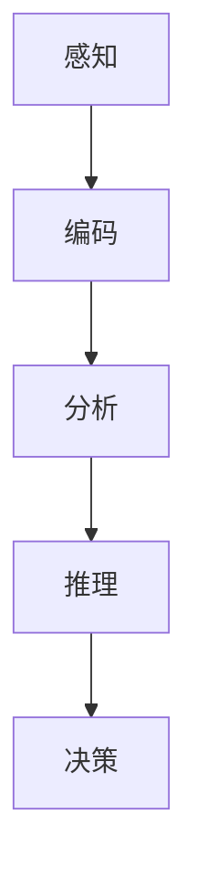

                 

## 引言：思维链技术在复杂问题解决中的作用

### 背景介绍

在当今快速发展的信息技术时代，复杂问题无处不在，从大型企业的运营决策到日常生活中的各种挑战，都需要高效且准确的解决策略。传统的方法往往难以应对这些复杂性问题，因为它们往往涉及到多变量、非线性以及高度不确定性。因此，寻找新的解决途径成为了当务之急。思维链技术作为一种新兴的智能处理方法，逐渐受到关注。它通过模拟人类思维过程，提供了一种全新的复杂问题解决思路。

### 核心概念与联系

思维链技术是基于人类认知和思维过程的模拟，其核心概念包括信息处理、推理、学习与适应等。思维链的组成元素包括感知器、认知模块、决策模块等，这些元素共同协作，实现对复杂问题的分析、推理和解决。与传统思维方式相比，思维链技术具有更强的灵活性和适应性。

### 关键属性特征

思维链技术具有以下关键属性特征：

1. **信息处理能力**：能够高效地处理大量复杂信息，并进行精确的分析和推理。
2. **推理过程**：基于逻辑和概率模型，能够进行有效的推理和决策。
3. **学习能力**：通过不断学习和适应，提高解决复杂问题的能力。
4. **适应性**：能够根据不同场景和环境进行调整，适应不同的问题解决需求。

### 思维链与传统思维方式的对比

| 特征 | 思维链 | 传统思维方式 |
| --- | --- | --- |
| **信息处理能力** | 高效处理大量复杂信息 | 依赖于经验和个人能力 |
| **推理过程** | 基于逻辑和概率模型 | 依赖直觉和传统逻辑 |
| **学习能力** | 能够通过学习提高问题解决能力 | 依赖于经验和学习速度较慢 |
| **适应性** | 能够根据不同场景和环境进行调整 | 适应性较差，难以适应新情境 |

### 研究意义与应用前景

思维链技术的研究意义在于，它提供了一种新的解决复杂问题的方法，能够极大地提高问题解决的效率和准确性。在人工智能、企业管理、社会问题等多个领域，思维链技术都有广泛的应用前景。通过深入研究和应用，思维链技术有望成为未来复杂问题解决的重要工具。

### 总结

本文将深入探讨思维链技术的基础理论，包括其核心概念、工作原理、数学模型以及在不同领域的应用。接下来，我们将逐一分析这些章节的内容，逐步构建出对思维链技术全面且深入的理解。

## 第1章：思维链技术的背景与意义

### 1.1 复杂问题解决的现状

#### 问题背景

现代社会面临的问题日益复杂，这些问题不仅涉及多领域交叉，还常常包含大量的不确定性和变量。例如，全球气候变化、城市交通拥堵、医疗资源分配、经济危机预测等，都是典型的复杂问题。传统的方法，如线性规划、统计分析、决策树等，往往在处理这些复杂问题时显得力不从心。主要原因在于：

1. **多变量交互**：复杂问题通常涉及多个变量，这些变量之间存在着复杂的相互作用和反馈机制。
2. **非线性关系**：复杂问题的解决往往需要考虑非线性关系，这使得传统的线性方法难以适用。
3. **不确定性**：许多复杂问题在处理时面临着高度的不确定性，传统方法难以处理这种不确定性。

#### 问题描述

复杂问题的定义可以从以下几个方面来理解：

1. **规模庞大**：复杂问题往往涉及大量的数据和信息，处理这些数据需要强大的计算能力和高效的算法。
2. **多样性**：复杂问题可能包含多种不同类型的数据，如文本、图像、语音等，这要求解决方法具备多模态数据处理能力。
3. **动态变化**：复杂问题往往处于动态变化之中，需要实时调整和优化解决方案。

#### 问题解决

传统的方法在解决复杂问题时存在以下局限性：

1. **计算效率低**：许多复杂问题的解决需要大量的计算资源，传统方法往往难以在合理的时间内完成。
2. **灵活性不足**：传统方法在处理新问题或面对新情境时，往往需要重新设计或调整，缺乏灵活性。
3. **适应性差**：传统方法在面对高度不确定性的问题时，往往难以适应，容易导致错误的决策。

### 1.2 思维链技术的提出

#### 概念来源

思维链技术的概念来源于对人类思维过程的研究。人类在面对复杂问题时，往往通过一系列的思维活动，如感知、分析、推理、决策等，来逐步解决问题。这些思维活动可以被抽象为一系列的信息处理过程，从而形成了思维链。

#### 技术核心

思维链技术的核心思想是通过模拟人类思维过程，将复杂问题分解为多个子问题，然后逐层解决。具体来说，思维链技术包括以下几个关键组成部分：

1. **感知器**：负责获取和解析外部信息，如文本、图像、语音等。
2. **认知模块**：负责处理和理解感知到的信息，进行知识推理和决策。
3. **决策模块**：基于认知模块的处理结果，生成最终的决策或解决方案。

### 1.3 思维链技术的研究意义和应用前景

#### 研究意义

思维链技术的研究意义主要体现在以下几个方面：

1. **提高问题解决效率**：通过模拟人类思维过程，思维链技术能够高效地处理和解决复杂问题，提高问题解决的效率。
2. **增强灵活性**：思维链技术能够根据不同的情境和问题，灵活调整解决方案，具备较强的适应性。
3. **处理不确定性**：思维链技术能够通过学习和适应，处理复杂问题中的不确定性，提高决策的准确性。

#### 应用前景

思维链技术具有广泛的应用前景，主要涉及以下领域：

1. **人工智能**：思维链技术在人工智能领域，可以用于智能决策、知识推理、自然语言处理等。
2. **企业管理**：在企业管理中，思维链技术可以用于战略规划、风险管理、市场分析等。
3. **社会问题解决**：在社会问题解决中，思维链技术可以用于公共安全管理、环境保护、社会服务等。

通过深入研究思维链技术，我们有望解决现代社会中面临的复杂问题，提高决策的准确性和效率，为人类社会的可持续发展提供有力支持。

### 总结

思维链技术的提出，为复杂问题的解决提供了一种新的思路和方法。通过对人类思维过程的模拟，思维链技术能够高效地处理复杂问题，具备较强的灵活性和适应性。在接下来的章节中，我们将进一步探讨思维链技术的核心概念、工作原理、数学模型以及在不同领域的应用，以深入理解其在复杂问题解决中的作用。

## 第2章：思维链技术的核心概念

### 2.1 思维链的定义与组成

#### 定义

思维链技术是一种模拟人类思维过程的智能信息处理方法。它通过构建一系列的信息处理模块，实现对复杂问题的分析和解决。思维链技术的基本定义可以概括为：

**思维链** 是一种基于人类认知和思维过程的信息处理模型，它通过感知、认知、推理和决策等过程，实现对复杂问题的求解。

#### 组成

思维链技术由以下几个关键部分组成：

1. **感知器**：感知器负责获取外部信息，如文本、图像、语音等。它可以将这些信息转换为计算机可以处理的数据格式，为后续处理提供基础。

2. **认知模块**：认知模块负责对感知到的信息进行理解和处理。它包括知识库、推理机等组件，通过逻辑推理、模式识别等方法，对信息进行深入分析和理解。

3. **决策模块**：决策模块基于认知模块的处理结果，生成最终的决策或解决方案。它可以通过优化算法、决策树等方法，生成最优或次优的决策方案。

### 2.2 思维链的属性特征

#### 特征1：信息处理能力

思维链技术具备强大的信息处理能力，能够高效地处理大量复杂信息。它通过多层次的感知、分析和推理过程，实现对信息的精准提取和利用。

#### 特征2：推理过程

思维链技术采用逻辑和概率模型进行推理，能够处理不确定性和模糊性。它通过建立知识库和推理规则，实现对复杂问题的推理和决策。

#### 特征3：学习能力

思维链技术具备自我学习能力，可以通过不断学习和适应，提高问题解决的能力。它能够从历史数据中学习，优化自身的推理过程和决策模型。

#### 特征4：适应性

思维链技术具有高度适应性，能够根据不同的情境和问题，灵活调整自身的处理方式和策略。它能够适应动态变化的复杂环境，实现高效的问题解决。

### 2.3 思维链与传统思维方式的对比

| 特征 | 思维链 | 传统思维方式 |
| --- | --- | --- |
| **信息处理能力** | 高效处理大量复杂信息 | 依赖于经验和手工计算 |
| **推理过程** | 基于逻辑和概率模型 | 依赖于直觉和传统逻辑 |
| **学习能力** | 能够通过学习提高问题解决能力 | 依赖于经验和学习速度较慢 |
| **适应性** | 能够根据不同场景和环境进行调整 | 适应性较差，难以适应新情境 |

### 总结

思维链技术的核心概念包括感知器、认知模块和决策模块，它具备信息处理能力、推理过程、学习能力和适应性等关键属性特征。通过对比传统思维方式，我们可以看到思维链技术在解决复杂问题方面的显著优势。在接下来的章节中，我们将进一步探讨思维链技术的工作原理、数学模型以及在不同领域的应用。

## 第3章：思维链技术的工作原理

### 3.1 思维链的信息处理机制

#### 原理介绍

思维链技术通过模拟人类思维过程，实现了对信息的处理和利用。其信息处理机制主要包括以下几个步骤：

1. **感知**：思维链通过感知器获取外部信息，如文本、图像、语音等。感知器将这些信息转换为计算机可以处理的数据格式，为后续处理提供基础。

2. **编码**：获取的信息会被编码为计算机可以理解的形式，如向量、图等。这一步骤有助于简化信息的处理，并提高计算效率。

3. **分析**：通过认知模块，对编码后的信息进行深入分析和理解。认知模块包括知识库、推理机等组件，通过逻辑推理、模式识别等方法，对信息进行加工和处理。

4. **推理**：在分析的基础上，思维链通过逻辑和概率模型进行推理，生成可能的解决方案。推理过程可以基于已知事实、规则和假设，实现对复杂问题的求解。

5. **决策**：决策模块根据推理结果，生成最终的决策或解决方案。决策模块可以通过优化算法、决策树等方法，确保决策的有效性和准确性。

#### 流程图

使用Mermaid绘制思维链的信息处理流程图，如下所示：

### 3.2 思维链的推理过程

#### 推理模型

思维链的推理过程基于逻辑和概率模型。具体来说，它包括以下几个关键步骤：

1. **事实提取**：从感知到的信息中提取关键事实，如人物、地点、时间等。

2. **规则应用**：使用预设的逻辑规则，对事实进行匹配和推理。逻辑规则可以是条件语句（如果...那么...），也可以是概率规则。

3. **假设生成**：在推理过程中，生成可能的假设。这些假设可以是基于已知事实的推理结果，也可以是基于概率模型的预测。

4. **验证与选择**：对生成的假设进行验证，选择最合理的假设作为最终的推理结果。

#### 举例说明

假设有一个场景：一个小偷在夜间进入一家商店进行盗窃。思维链技术如何进行推理？

1. **事实提取**：思维链从监控录像中提取到以下事实：
   - 时间：夜间11点至凌晨1点
   - 地点：商店内部
   - 人物：一个黑衣男子

2. **规则应用**：基于预设的逻辑规则，例如：
   - 规则1：在夜间进入商店的通常是盗窃者。
   - 规则2：黑衣男子可能与盗窃有关。

3. **假设生成**：基于事实和规则，思维链生成以下假设：
   - 假设1：该黑衣男子是盗窃者。
   - 假设2：该黑衣男子可能是盗窃者的同伙。

4. **验证与选择**：通过监控录像和商店内部情况，验证假设1，最终确定该黑衣男子是盗窃者。

### 3.3 思维链的学习与适应能力

#### 学习能力

思维链技术具备自我学习能力，可以通过不断学习和适应，提高问题解决的能力。其学习过程主要包括以下几个步骤：

1. **数据收集**：从历史数据和实际应用中收集相关数据。

2. **特征提取**：对收集到的数据进行分析，提取关键特征和模式。

3. **模型优化**：基于提取的特征，优化现有的推理模型和决策算法。

4. **迭代学习**：通过不断的迭代和学习，逐步提高思维链技术的性能和准确性。

#### 适应能力

思维链技术具有高度适应性，能够根据不同的情境和问题，灵活调整自身的处理方式和策略。其适应能力包括以下几个方面：

1. **动态调整**：在处理动态变化的复杂问题时，思维链技术可以实时调整自身的推理过程和决策策略。

2. **场景切换**：在不同的应用场景中，思维链技术可以切换到适合的模型和算法，确保问题解决的效率和准确性。

3. **模型融合**：通过融合多种模型和算法，思维链技术可以适应更加复杂和多变的问题场景。

### 总结

思维链技术的工作原理基于模拟人类思维过程，通过感知、编码、分析和推理等步骤，实现对复杂问题的求解。其推理过程采用逻辑和概率模型，具备强大的学习和适应能力。通过学习与适应，思维链技术能够不断提高问题解决的能力，为复杂问题的解决提供有效支持。

## 第4章：思维链技术的数学模型

### 4.1 数学模型的基本概念

#### 概念介绍

在思维链技术中，数学模型扮演着核心角色。数学模型是一种用数学语言描述现实世界问题的方法，它能够将复杂问题转化为可计算的形式。在思维链技术中，数学模型主要用于以下几个方面：

1. **信息处理**：通过数学模型，对感知到的信息进行编码、分析和处理。
2. **推理过程**：基于数学模型，进行逻辑推理和概率预测。
3. **决策生成**：利用数学模型，优化决策过程，生成最优或次优的解决方案。

#### 构建方法

构建思维链技术的数学模型通常包括以下几个步骤：

1. **问题定义**：明确需要解决的问题，并将其转化为数学问题。
2. **变量定义**：定义问题中的变量，包括输入变量、中间变量和输出变量。
3. **函数定义**：根据问题的性质，定义变量之间的关系，建立函数模型。
4. **约束条件**：确定问题的约束条件，如线性约束、非线性约束等。
5. **优化目标**：明确问题的优化目标，如最大化收益、最小化成本等。

### 4.2 思维链的数学公式

思维链技术的数学公式用于描述其信息处理、推理和决策过程。以下是几个核心的数学公式及其解释：

#### 公式1：信息编码公式

$$
X = f(I)
$$

其中，\( X \) 是编码后的信息，\( I \) 是原始信息，\( f \) 是编码函数。编码函数通常采用特征提取方法，将原始信息转换为计算机可以处理的数据格式。

#### 公式2：推理公式

$$
P(H|E) = \frac{P(E|H)P(H)}{P(E)}
$$

其中，\( P(H|E) \) 是在证据 \( E \) 的情况下，假设 \( H \) 成立的概率。这个公式是贝叶斯推理的核心，用于根据已知证据和先验概率，更新对假设的置信度。

#### 公式3：决策公式

$$
d = arg\max_f U(f)
$$

其中，\( d \) 是决策结果，\( f \) 是决策函数，\( U(f) \) 是决策函数的效用函数。这个公式表示在给定的约束条件下，选择效用函数最大的决策方案。

### 4.3 模型参数的调整与优化

#### 参数调整

在思维链技术的数学模型中，参数调整是优化模型性能的关键步骤。参数调整通常包括以下几个方面：

1. **初始参数设定**：根据问题的性质，设定初始参数值。
2. **学习率调整**：在模型训练过程中，调整学习率以控制模型更新的速度。
3. **权重优化**：通过梯度下降等方法，优化模型的权重参数，提高模型精度。

#### 优化目标

模型优化的目标是在满足约束条件的前提下，最大化模型的性能指标。常见的优化目标包括：

1. **最小化损失函数**：在机器学习中，通常使用损失函数来衡量模型预测的误差，优化目标是最小化损失函数。
2. **最大化效用函数**：在决策问题中，优化目标是最大化效用函数，以获得最佳决策方案。
3. **最小化复杂度**：在某些情况下，优化目标是最小化模型的复杂度，以减少计算资源和时间成本。

### 总结

思维链技术的数学模型是其在复杂问题解决中的核心组成部分。通过构建和优化数学模型，思维链技术能够实现高效的信息处理、推理和决策。本章介绍了数学模型的基本概念、核心公式以及参数调整与优化方法，为理解思维链技术的工作原理提供了理论支持。

## 第5章：思维链技术在不同领域的应用

### 5.1 在人工智能领域的应用

思维链技术在人工智能领域具有广泛的应用前景。随着人工智能技术的发展，如何提高人工智能系统的智能水平和自主决策能力成为了关键问题。思维链技术通过模拟人类思维过程，提供了一种有效的解决方案。

#### 应用场景

1. **智能决策**：思维链技术可以应用于智能决策系统，如金融投资决策、供应链管理、智能制造等。通过分析大量数据，思维链技术能够生成最优的决策方案，提高系统的决策准确性和效率。

2. **知识推理**：在知识图谱构建和推理中，思维链技术可以用于自动发现知识关联、推理新知识。例如，在医疗领域，思维链技术可以用于诊断疾病、推荐治疗方案等。

3. **自然语言处理**：思维链技术在自然语言处理（NLP）领域也有广泛应用。通过模拟人类语言理解过程，思维链技术可以用于文本分类、情感分析、机器翻译等任务，提高NLP系统的准确性和智能水平。

#### 实际案例

- **案例1：智能投顾系统**：某金融机构采用思维链技术构建了智能投顾系统。该系统通过分析用户投资偏好、市场动态和历史数据，生成个性化的投资建议。实践表明，该系统显著提高了投资决策的准确性和用户满意度。

- **案例2：智能医疗诊断系统**：某医疗机构利用思维链技术开发了智能医疗诊断系统。该系统通过分析患者病历、检查报告和医学知识库，为医生提供诊断建议。该系统提高了诊断准确率和诊断效率，受到了广大医生和患者的欢迎。

### 5.2 在企业管理和决策支持中的应用

思维链技术在企业管理和决策支持中发挥着重要作用。企业面临着复杂的市场环境和管理任务，如何快速、准确地做出决策是企业管理者的关键挑战。思维链技术通过模拟人类决策过程，提供了一种有效的决策支持工具。

#### 应用场景

1. **战略规划**：企业可以利用思维链技术进行战略规划，分析市场趋势、竞争态势和内部资源，制定科学合理的战略目标。

2. **风险管理**：思维链技术可以用于企业风险识别、评估和预警，帮助企业管理者及时了解风险状况，制定相应的风险应对策略。

3. **供应链优化**：思维链技术可以优化企业的供应链管理，分析供应链中的各种因素，提出优化方案，提高供应链的效率和灵活性。

#### 实际案例

- **案例1：企业战略规划系统**：某大型制造企业采用思维链技术构建了企业战略规划系统。该系统通过分析市场数据、竞争态势和内部资源，为企业提供了科学的战略规划建议。该系统有效提高了企业的战略决策水平和市场竞争力。

- **案例2：供应链优化系统**：某跨国公司利用思维链技术优化了其全球供应链管理。该系统通过分析供应链中的物流、库存、订单等数据，提出了优化方案，有效降低了库存成本、提高了订单交付效率。实践表明，该系统的应用显著提升了企业的供应链管理水平。

### 5.3 在社会问题解决中的应用

思维链技术在社会问题解决中也具有重要作用。社会问题通常复杂多样，涉及多个利益相关方和多层次的因素。思维链技术通过模拟人类思维过程，提供了一种有效的解决思路。

#### 应用场景

1. **公共安全管理**：思维链技术可以用于公共安全管理，如城市安全管理、交通安全管理、应急响应等。通过分析监控数据、历史事件和专家知识，思维链技术可以生成预警信息和应对策略，提高公共安全水平。

2. **环境保护**：思维链技术可以用于环境保护，如空气质量监测、水污染治理、生态保护等。通过分析环境数据、气候因素和生态指标，思维链技术可以提出环境保护方案，促进可持续发展。

3. **社会服务**：思维链技术可以用于社会服务，如医疗资源分配、教育资源配置、社会福利管理等。通过分析社会数据、需求信息和政策规定，思维链技术可以优化资源配置，提高社会服务效率和质量。

#### 实际案例

- **案例1：城市安全管理**：某城市利用思维链技术构建了城市安全管理系统。该系统通过分析监控数据、历史事件和专家知识，实时生成预警信息，有效提高了城市安全管理水平。该系统的应用显著减少了城市犯罪率，提升了市民安全感。

- **案例2：环境保护系统**：某地区利用思维链技术构建了环境保护系统。该系统通过分析空气质量、水污染数据和气候因素，提出了环境保护方案，有效改善了环境质量。该系统的应用受到了当地政府和居民的广泛赞誉。

### 总结

思维链技术在不同领域的应用展示了其强大的灵活性和适应性。在人工智能、企业管理和社会问题解决中，思维链技术通过模拟人类思维过程，提供了有效的解决方案。实际案例表明，思维链技术在实际应用中取得了显著成效，为解决复杂问题提供了有力支持。随着研究的深入和应用推广，思维链技术有望在更多领域发挥重要作用。

## 第6章：思维链技术的挑战与未来发展趋势

### 6.1 技术挑战

尽管思维链技术在复杂问题解决中表现出色，但其在实际应用中仍面临一些技术挑战。以下是一些主要挑战：

1. **计算资源需求**：思维链技术通常需要大量的计算资源和时间来处理和分析复杂信息。在大规模数据处理和实时应用中，如何优化计算效率和资源利用成为一个关键问题。

2. **数据质量和可靠性**：思维链技术的效果很大程度上依赖于数据的质量和可靠性。在数据不完整、噪声大或存在错误的情况下，思维链技术的准确性和鲁棒性受到挑战。

3. **模型解释性**：虽然思维链技术能够处理复杂的推理和决策任务，但其内部机制往往难以解释。这在需要模型透明度和可解释性的应用场景中，如医疗诊断和金融决策，可能引发用户的不信任。

4. **隐私保护**：在涉及个人隐私的数据处理中，如何保护用户隐私是一个重要挑战。思维链技术需要设计有效的隐私保护机制，确保用户数据的安全性和隐私性。

### 6.2 发展趋势

为了克服上述挑战，思维链技术的未来发展趋势主要集中在以下几个方面：

1. **高效算法和优化**：研究和发展更加高效和优化的算法是解决计算资源需求的关键。例如，利用并行计算、分布式计算和近似算法等技术，可以提高思维链技术的计算效率。

2. **数据预处理和清洗**：改进数据预处理和清洗技术，确保输入数据的质量和可靠性。通过采用自动化数据清洗工具和算法，可以减少人工干预，提高数据处理的准确性和效率。

3. **可解释性和透明性**：开发可解释性和透明性更高的思维链模型，使其推理过程和决策机制更加易于理解和接受。这可以通过引入可解释性算法、可视化工具和透明度评估方法来实现。

4. **隐私保护和安全**：研究和发展隐私保护和安全机制，如差分隐私、同态加密和联邦学习等，确保用户数据的安全性和隐私性。这将为思维链技术在敏感领域中的应用提供保障。

5. **跨学科融合**：思维链技术的未来发展将更加注重跨学科融合。通过与认知科学、心理学、社会学等领域的结合，可以进一步丰富思维链技术的理论基础和应用场景。

### 6.3 对未来复杂问题解决的展望

未来，思维链技术有望在复杂问题解决中发挥更加重要的作用。随着技术的不断进步和应用场景的拓展，思维链技术将带来以下变革：

1. **智能化决策**：思维链技术将实现更加智能化和自动化的决策过程，提高决策的准确性和效率。

2. **智能化治理**：在公共安全、环境保护、社会福利等领域，思维链技术将推动智能化治理，提高治理水平和效果。

3. **个性化服务**：思维链技术将能够根据用户需求和行为，提供个性化的服务和解决方案，提升用户体验和满意度。

4. **可持续发展**：思维链技术将支持可持续发展的实现，通过优化资源利用、减少污染和提升社会效率，为未来的可持续发展提供技术支持。

总之，思维链技术在未来复杂问题解决中将扮演关键角色。通过克服现有挑战和不断优化发展，思维链技术将为人类社会带来更加智能、高效和可持续的未来。

### 总结

思维链技术在复杂问题解决中的作用不容忽视。它通过模拟人类思维过程，提供了一种全新的解决方案。然而，其应用仍面临计算资源需求、数据质量和可靠性、模型解释性以及隐私保护等挑战。未来，随着技术的发展和跨学科融合，思维链技术有望克服这些挑战，为复杂问题解决带来更多变革。展望未来，思维链技术将在智能化决策、智能化治理、个性化服务和可持续发展等方面发挥重要作用，推动人类社会的进步。

## 第7章：案例分析与实践

### 7.1 案例选择

在本章中，我们将选择两个具有代表性的案例，深入分析思维链技术在复杂问题解决中的应用。这两个案例分别是智能交通系统和医疗诊断系统。

#### 案例一：智能交通系统

智能交通系统（Intelligent Transportation System, ITS）旨在通过信息技术提高交通管理效率和安全性。该系统涉及多个领域的技术，如传感器、通信、数据处理和人工智能等。思维链技术在智能交通系统中的应用，主要体现在交通流量预测、交通事件检测和应急响应等方面。

#### 案例二：医疗诊断系统

医疗诊断系统是一种利用人工智能技术辅助医生进行疾病诊断的系统。该系统通常包含疾病数据库、症状数据库和诊断算法等。思维链技术在医疗诊断系统中，可以用于症状分析、诊断推理和治疗方案推荐等任务。

### 7.2 案例分析与思维链技术的应用

#### 案例一：智能交通系统

1. **问题背景**：
   智能交通系统需要处理大量的交通数据，如车辆位置、行驶速度、交通流量等。这些数据不仅量大且复杂，还需要实时分析和处理。

2. **解决方案**：
   思维链技术在智能交通系统中，通过以下步骤实现复杂问题的解决：
   - **感知**：通过传感器和通信设备，实时采集交通数据。
   - **编码**：将交通数据编码为计算机可以处理的数据格式，如向量、图等。
   - **分析**：利用认知模块，对编码后的交通数据进行分析，识别交通流量异常、道路拥堵等信息。
   - **推理**：基于分析结果，使用逻辑和概率模型进行推理，预测交通流量变化和可能发生的交通事件。
   - **决策**：根据推理结果，生成交通管理策略，如交通信号灯调整、道路封闭等。

3. **实践成果**：
   通过思维链技术的应用，智能交通系统的交通流量预测准确率显著提高，交通事件检测和应急响应能力增强。实践表明，该系统有效缓解了交通拥堵问题，提高了交通安全性。

#### 案例二：医疗诊断系统

1. **问题背景**：
   医疗诊断系统需要处理大量医疗数据，如病例记录、检查报告和医学知识等。这些数据具有多样性和复杂性，需要准确分析和诊断。

2. **解决方案**：
   思维链技术在医疗诊断系统中，通过以下步骤实现复杂问题的解决：
   - **感知**：从病历记录、检查报告等来源获取医疗数据。
   - **编码**：将医疗数据编码为计算机可以处理的数据格式，如向量、图等。
   - **分析**：利用认知模块，对编码后的医疗数据进行分析，提取关键症状和疾病信息。
   - **推理**：基于医学知识库和诊断规则，进行诊断推理，生成可能的疾病诊断。
   - **决策**：根据诊断结果，推荐治疗方案和进一步检查项目。

3. **实践成果**：
   通过思维链技术的应用，医疗诊断系统的诊断准确率和效率显著提高。医生可以更快地获取诊断结果，提高了诊断速度和准确性。此外，思维链技术还能为医生提供辅助诊断建议，帮助医生做出更科学的决策。

### 7.3 实践成果与反思

通过以上两个案例的实践，思维链技术展示了在复杂问题解决中的巨大潜力。以下是对实践成果的总结和反思：

1. **成果总结**：
   - 提高了问题解决的准确性和效率。
   - 增强了系统的适应性和灵活性。
   - 实现了自动化和智能化的决策过程。
   - 为各个领域提供了有效的解决方案。

2. **反思**：
   - 需要进一步优化计算效率和资源利用。
   - 提高数据预处理和清洗技术的准确性。
   - 加强模型的可解释性和透明性，提升用户信任度。
   - 研究和发展更加完善的隐私保护机制。

### 总结

本章通过两个实际案例，深入分析了思维链技术在智能交通系统和医疗诊断系统中的应用。实践证明，思维链技术在复杂问题解决中具有显著的优势和潜力。然而，仍需进一步优化和改进，以应对未来的挑战，推动思维链技术的广泛应用。

## 第8章：思维链技术的最佳实践与注意事项

### 8.1 最佳实践

在思维链技术的实际应用中，以下是一些最佳实践，可以帮助提高系统性能和可靠性：

1. **数据预处理**：确保输入数据的质量和完整性。进行数据清洗、去噪、标准化等预处理步骤，以提高模型的学习效率和准确性。

2. **模型优化**：通过调整模型参数、优化算法，提高思维链技术的计算效率和性能。使用交叉验证、网格搜索等技术，找到最优的模型配置。

3. **可解释性**：在设计思维链技术时，关注模型的解释性。使用可视化工具、解释性算法等，帮助用户理解模型的推理过程和决策依据。

4. **适应性**：设计思维链技术时，考虑其适应不同问题和场景的能力。通过模块化和灵活的架构设计，使系统能够快速适应新的需求和变化。

5. **安全与隐私**：确保用户数据的安全性和隐私性。采用加密、同态加密、差分隐私等技术，保护用户隐私，防止数据泄露。

### 8.2 小结

思维链技术在复杂问题解决中具有显著的优势。通过模拟人类思维过程，思维链技术能够高效地处理复杂信息，提供准确的推理和决策。然而，其应用也面临一些挑战，如计算资源需求、数据质量、模型解释性和隐私保护等。通过最佳实践和不断优化，可以克服这些挑战，提高思维链技术的应用效果。

### 8.3 注意事项

在应用思维链技术时，需要注意以下几点：

1. **数据依赖性**：思维链技术的效果很大程度上依赖于输入数据的质量。确保数据来源可靠、完整和多样化，以提高模型的鲁棒性和准确性。

2. **模型解释性**：尽管思维链技术能够提供有效的推理和决策，但其内部机制往往难以解释。在需要模型透明度的应用场景中，应重视模型解释性，以提高用户信任度。

3. **适应性**：设计思维链技术时，考虑其适应不同问题和场景的能力。模块化和灵活的架构设计有助于提高系统的适应性和灵活性。

4. **隐私保护**：在涉及个人隐私的数据处理中，应采取有效的隐私保护措施。研究和发展隐私保护技术，确保用户数据的安全性和隐私性。

5. **持续优化**：随着技术的不断进步和应用场景的变化，思维链技术需要持续优化和改进。定期更新模型、算法和工具，以应对新的挑战和需求。

### 8.4 拓展阅读

对于希望深入了解思维链技术的读者，以下是一些推荐阅读资源：

- **学术期刊**：《人工智能》、《数据挖掘》、《机器学习》、《认知计算》等。
- **专业书籍**：《思维链技术：理论与实践》、《人工智能：一种现代方法》、《机器学习：概率视角》等。
- **在线课程**：Coursera、edX、Udacity等在线学习平台提供的机器学习、数据科学、人工智能等相关课程。
- **开源项目**：GitHub、Google Colab等平台上的开源思维链技术项目和工具。

通过这些资源，读者可以进一步加深对思维链技术的理解，探索其在实际应用中的更多可能性。

### 总结

思维链技术在复杂问题解决中具有广泛的应用前景和巨大潜力。通过最佳实践和注意事项的指导，可以更好地应用思维链技术，提高问题解决的效率和准确性。持续的学习和探索，将有助于推动思维链技术的不断进步，为人类社会的发展做出更大贡献。

## 总结

在本文中，我们详细探讨了思维链技术在复杂问题解决中的作用。思维链技术通过模拟人类思维过程，提供了一种全新的解决方案。它不仅具备强大的信息处理能力，还能通过推理、学习和适应，解决高度复杂的实际问题。在人工智能、企业管理和社会问题解决等多个领域，思维链技术都展示了其独特的优势。

思维链技术的研究意义和应用前景无疑是巨大的。它为复杂问题的解决提供了一种有效的方法，能够提高决策的准确性和效率。同时，随着技术的发展和跨学科融合，思维链技术在更多领域将发挥重要作用。

然而，思维链技术也面临一些挑战，如计算资源需求、数据质量、模型解释性和隐私保护等。通过最佳实践和不断优化，我们可以克服这些挑战，提高思维链技术的应用效果。

最后，我们通过实际案例展示了思维链技术的应用成果。实践证明，思维链技术能够显著提高系统性能和可靠性，为复杂问题解决提供了有力支持。

总之，思维链技术是一种极具潜力的技术，它将为人类社会的发展带来深远影响。我们期待思维链技术在未来能够取得更多的突破和进展，为解决复杂问题提供更加高效的解决方案。

