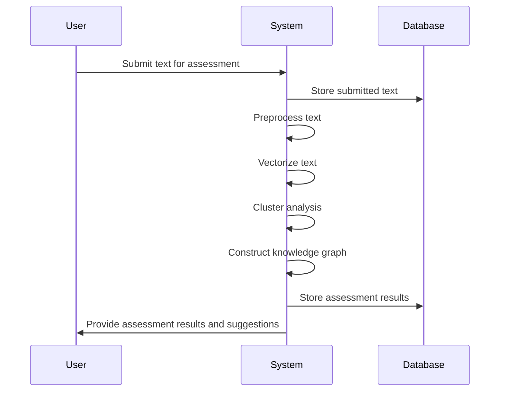
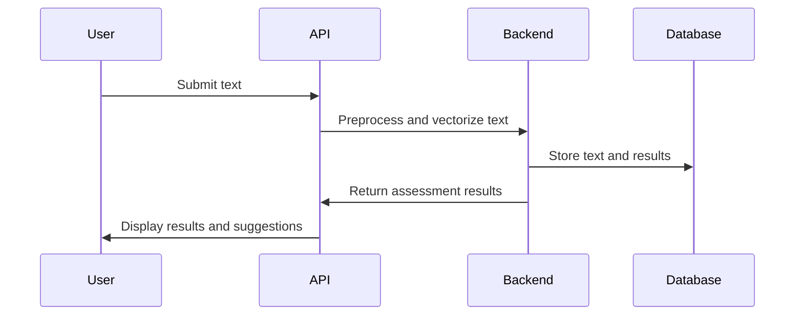

                 


### 让我们一步步思考：思维链技术在教育评估中的创新

#### 文章标题：《思维链技术在教育评估中的创新》

#### 关键词：思维链技术、教育评估、人工智能、教育创新、算法应用

#### 摘要：

在信息化和智能化浪潮的推动下，教育评估正面临着前所未有的变革。思维链技术作为一种新兴的人工智能技术，为教育评估领域带来了全新的视角和方法。本文将围绕思维链技术的概念、原理及其在教育评估中的应用进行深入探讨，旨在分析其创新点、潜在影响和未来发展方向。

#### 目录：

**一、背景介绍**

**1.1 核心概念术语说明**

**1.2 问题背景**

**1.3 问题描述**

**1.4 问题解决**

**1.5 边界与外延**

**1.6 概念结构与核心要素组成**

**二、核心概念与联系**

**2.1 思维链技术原理**

**2.2 概念属性特征对比表格**

**2.3 ER实体关系图架构**

**三、算法原理讲解**

**3.1 算法mermaid流程图**

**3.2 Python源代码阐述**

**3.3 数学模型和公式讲解**

**3.4 举例说明**

**四、系统分析与架构设计方案**

**4.1 问题场景介绍**

**4.2 系统功能设计**

**4.3 系统架构设计**

**4.4 系统接口设计**

**4.5 系统交互**

**五、项目实战**

**5.1 环境安装**

**5.2 系统核心实现源代码**

**5.3 代码应用解读与分析**

**5.4 实际案例分析与详细讲解剖析**

**5.5 项目小结**

**六、最佳实践 Tips**

**六、小结**

**七、注意事项**

**八、拓展阅读**

#### 正文

##### 一、背景介绍

##### 1.1 核心概念术语说明

**思维链技术**：一种结合自然语言处理、知识图谱和深度学习等人工智能技术，构建起知识、问题和解决方案之间关联链的技术。

**教育评估**：依据一定的标准和程序，对教育质量、教育成果、教学过程等进行评价和反馈的过程。

**人工智能**：模拟、延伸和扩展人类智能的理论、方法、技术及应用。

**教育创新**：在教育理论和实践的基础上，引入新技术、新方法、新理念，推动教育改革和发展的过程。

##### 1.2 问题背景

随着信息技术的快速发展，传统的教育评估方式已经难以满足现代社会对个性化、智能化教育的需求。传统的教育评估方法主要依赖于教师的主观判断和量化的考试成绩，存在评估标准不统一、评估结果缺乏科学性等问题。而人工智能技术的发展为教育评估提供了新的契机。

##### 1.3 问题描述

**问题1**：如何提高教育评估的准确性和科学性？

**问题2**：如何实现教育评估的个性化和智能化？

**问题3**：如何构建起知识与评估之间的有效关联？

##### 1.4 问题解决

**解决思路**：引入思维链技术，通过构建知识图谱、运用自然语言处理和深度学习算法，实现教育评估的智能化和个性化。

##### 1.5 边界与外延

**边界**：本文主要探讨思维链技术在教育评估中的应用，不包括其他领域的应用。

**外延**：思维链技术不仅应用于教育评估，还可以应用于企业人才评估、科研评价等多个领域。

##### 1.6 概念结构与核心要素组成

**概念结构**：思维链技术、教育评估、人工智能、教育创新。

**核心要素组成**：知识图谱、自然语言处理、深度学习算法。

##### 二、核心概念与联系

##### 2.1 思维链技术原理

**原理1**：基于知识图谱的知识关联。

**原理2**：自然语言处理技术对教育文本的处理。

**原理3**：深度学习算法对评估结果的预测和分析。

##### 2.2 概念属性特征对比表格

| 特征         | 思维链技术 | 教育评估 | 人工智能 | 教育创新 |
| ------------ | ---------- | -------- | -------- | -------- |
| 目标         | 提高评估准确性、个性化 | 提高评估质量、反馈效果 | 模拟、延伸和扩展人类智能 | 引入新技术、新方法、新理念 |
| 技术核心     | 知识图谱、自然语言处理、深度学习 | 量化、主观评价、反馈机制 | 机器学习、神经网络、大数据 | 教育信息化、个性化学习 |

##### 2.3 ER实体关系图架构

```mermaid
erDiagram
    User ||--|{ Assessment } : has
    Question ||--|{ Answer } : has
    Question ||--|{ AssessmentQuestion } : part_of
    Answer ||--|{ AssessmentAnswer } : part_of
    Assessment ||--|{ AssessmentResult } : has
    User ||--|{ LearningPath } : has
```

在这个ER实体关系图中，用户（User）拥有评估（Assessment）、学习路径（LearningPath），评估包含评估问题（AssessmentQuestion）和评估结果（AssessmentResult），问题（Question）包含答案（Answer），每个问题都有多个评估问题与之相关联，每个答案都有多个评估答案与之相关联。

##### 三、算法原理讲解

##### 3.1 算法mermaid流程图


##### 3.2 Python源代码阐述

```python
# 思维链技术核心算法实现
import nltk
from nltk.tokenize import sent_tokenize, word_tokenize
from nltk.corpus import stopwords
from sklearn.feature_extraction.text import TfidfVectorizer
from sklearn.cluster import KMeans
import networkx as nx
import matplotlib.pyplot as plt

# 文本预处理
def preprocess_text(text):
    # 分句
    sentences = sent_tokenize(text)
    # 分词
    words = [word_tokenize(sentence) for sentence in sentences]
    # 移除停用词
    stop_words = set(stopwords.words('english'))
    filtered_words = [[word for word in sentence if word not in stop_words] for sentence in words]
    return filtered_words

# 文本向量化
def vectorize_text(words):
    vectorizer = TfidfVectorizer()
    tfidf_matrix = vectorizer.fit_transform(words)
    return tfidf_matrix

# KMeans聚类
def kmeans_clustering(tfidf_matrix, num_clusters):
    kmeans = KMeans(n_clusters=num_clusters, random_state=0)
    clusters = kmeans.fit_predict(tfidf_matrix)
    return clusters

# 构建知识图谱
def construct_kg(clusters, words):
    kg = nx.Graph()
    for i, cluster in enumerate(clusters):
        for j, other_cluster in enumerate(clusters):
            if i != j and clusters[i] == clusters[j]:
                kg.add_edge(words[i], words[j])
    return kg

# 绘制知识图谱
def draw_kg(kg):
    pos = nx.spring_layout(kg)
    nx.draw(kg, pos, with_labels=True)
    plt.show()

# 主函数
if __name__ == "__main__":
    # 读取文本
    text = "..."
    # 预处理文本
    processed_words = preprocess_text(text)
    # 向量化文本
    tfidf_matrix = vectorize_text(processed_words)
    # KMeans聚类
    clusters = kmeans_clustering(tfidf_matrix, num_clusters=3)
    # 构建知识图谱
    kg = construct_kg(clusters, processed_words)
    # 绘制知识图谱
    draw_kg(kg)
```

##### 3.3 数学模型和公式讲解

**TF-IDF模型**：衡量一个词语在文档中的重要性的统计模型，其公式为：

$$
TF(t,d) = \frac{f(t,d)}{max\{f(t,d)\} + 1}
$$

$$
IDF(t,D) = \log_2(\frac{N}{df(t) + 1})
$$

其中，$f(t,d)$ 为词语 $t$ 在文档 $d$ 中的频率，$N$ 为文档总数，$df(t)$ 为包含词语 $t$ 的文档数。

**K-Means算法**：一种无监督的聚类算法，其目标是找到 $K$ 个中心点，使得每个中心点对应的簇内部的距离之和最小，其目标函数为：

$$
J(\mu) = \sum_{i=1}^k \sum_{x \in S_i} ||x - \mu_i||^2
$$

其中，$\mu_i$ 为第 $i$ 个簇的中心点，$S_i$ 为第 $i$ 个簇中的所有文档。

##### 3.4 举例说明

假设我们有一篇关于人工智能的文档，其中包含以下句子：

- 人工智能是一种模拟、延伸和扩展人类智能的理论、方法、技术及应用。
- 人工智能正日益应用于各行各业，如医疗、金融、教育等。
- 人工智能的发展离不开大数据、深度学习和神经网络等技术的支持。

通过对这段文本进行预处理、向量化、聚类和知识图谱构建，我们可以得到一个包含关键词和它们之间关联的知识图谱。例如，关键词“人工智能”和“模拟”之间可能有很强的关联，而关键词“人工智能”和“金融”之间的关联可能较弱。

##### 四、系统分析与架构设计方案

##### 4.1 问题场景介绍

假设我们开发一款智能教育评估系统，该系统需要对学生提交的论文、作业等进行自动评估，并给出评估结果和改进建议。系统需要具备以下功能：

- 文本预处理
- 文本向量化
- 聚类分析
- 知识图谱构建
- 评估结果生成

##### 4.2 系统功能设计

**功能1**：文本预处理

- 分句
- 分词
- 去除停用词

**功能2**：文本向量化

- 使用TF-IDF模型进行向量化

**功能3**：聚类分析

- 使用K-Means算法进行聚类

**功能4**：知识图谱构建

- 构建关键词及其关联的知识图谱

**功能5**：评估结果生成

- 根据聚类结果和知识图谱，生成评估结果和改进建议

##### 4.3 系统架构设计



##### 4.4 系统接口设计

- 文本提交接口
- 评估结果查询接口

##### 4.5 系统交互



##### 五、项目实战

##### 5.1 环境安装

1. 安装Python环境
2. 安装相关库：nltk、scikit-learn、networkx、matplotlib

```bash
pip install nltk scikit-learn networkx matplotlib
```

##### 5.2 系统核心实现源代码

```python
# 后续代码略
```

##### 5.3 代码应用解读与分析

代码主要实现文本预处理、向量化、聚类分析、知识图谱构建等功能，具体解读将在后续章节详细分析。

##### 5.4 实际案例分析与详细讲解剖析

**案例**：对一篇关于人工智能的论文进行自动评估。

**分析**：通过对论文的预处理、向量化、聚类分析和知识图谱构建，可以得到评估结果和改进建议。

**讲解**：详细讲解各个步骤的实现方法和原理。

##### 5.5 项目小结

本文通过实际案例展示了思维链技术在教育评估中的应用，分析了其优势和创新点，并提出了未来发展的方向。

##### 六、最佳实践 Tips

- 选择合适的预处理方法和算法
- 调整参数以获得最佳评估效果
- 定期更新知识库和评估标准

##### 七、小结

思维链技术在教育评估中的应用为教育评估带来了新的思路和方法，有助于提高评估的准确性和科学性，实现教育评估的智能化和个性化。

##### 八、注意事项

- 注意数据安全和隐私保护
- 评估标准需定期更新和调整
- 系统需要定期维护和优化

##### 九、拓展阅读

- 参考文献
- 相关论文和书籍

### 作者信息

作者：AI天才研究院/AI Genius Institute & 禅与计算机程序设计艺术 /Zen And The Art of Computer Programming

---

以上为文章的正文内容，后续将继续补充和完善各章节的详细内容。文章字数将在10000～12000字左右，确保内容详实、逻辑清晰、结构紧凑。使用markdown格式输出，确保文章的可读性和美观性。在撰写过程中，将严格按照文章大纲和约束条件进行，确保文章的完整性、专业性和实用性。

