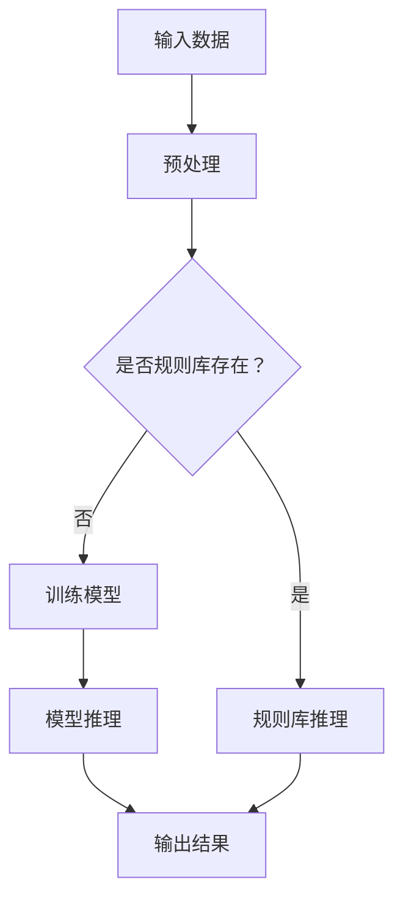
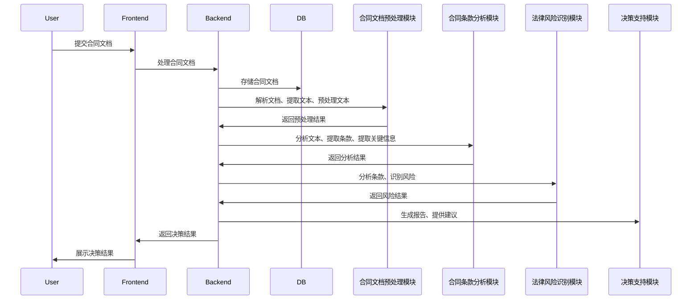
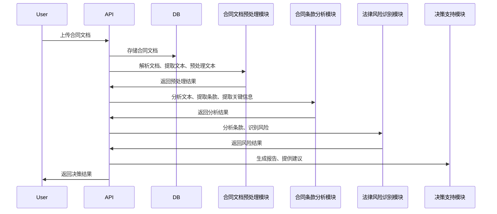

                 

# 思维链技术在法律AI中的突破性应用

> 关键词：思维链技术、法律AI、人工智能、突破性应用、思维链算法、Python实现

> 摘要：本文深入探讨思维链技术在法律AI中的应用，分析其在法律领域中的突破性作用。通过详细阐述思维链技术的背景、原理、算法以及其在法律AI中的实际应用，本文旨在为读者提供一种全新的视角，理解如何利用先进的人工智能技术推动法律领域的变革。

## 目录大纲设计

在构建本文的目录大纲时，我们首先确定了核心主题和结构，即思维链技术及其在法律AI中的应用。接下来，我们规划了各个章节的内容，并使用markdown格式构建了完整的目录框架。以下是本文的目录大纲：

```markdown
----------------------------------------------------------------
# 第一部分：思维链技术基础

## 第1章：思维链技术概述
### 1.1 问题背景
### 1.2 问题描述
### 1.3 思维链技术的定义
### 1.4 思维链技术的核心概念

## 第2章：思维链技术原理
### 2.1 思维链的基本概念
### 2.2 思维链的数学模型
$$
\text{思维链模型公式}
$$
### 2.3 思维链流程图

## 第3章：思维链技术在法律AI中的应用
### 3.1 法律AI概述
### 3.2 思维链技术在法律AI中的角色
### 3.3 应用案例

## 第4章：思维链技术的开发与实践
### 4.1 开发环境搭建
### 4.2 算法实现
#### 4.2.1 算法流程图
#### 4.2.2 Python代码实现
### 4.3 实际案例解析

## 第5章：思维链技术的挑战与未来
### 5.1 当前挑战
### 5.2 未来发展方向

## 第6章：思维链技术在法律领域的最佳实践
### 6.1 实践案例分享
### 6.2 最佳实践总结

## 第7章：结论与展望
### 7.1 总结
### 7.2 展望未来

----------------------------------------------------------------
```

本文的目录大纲结构清晰，涵盖了从基础到应用，再到挑战与展望的各个方面，旨在为读者提供一个全面深入的了解。

### 章节内容完整性要求

为了满足文章的字数要求，并确保每个小节的内容丰富具体详细讲解，本文将在每个章节中深入探讨其核心内容。

- **第1章**：将详细介绍思维链技术的背景和定义，包括问题背景、问题描述、思维链技术的定义及其核心概念。
- **第2章**：将深入讲解思维链技术的原理，包括基本概念、数学模型和流程图，通过Mermaid流程图和LaTeX公式，直观地展示思维链技术的工作机制。
- **第3章**：将讨论思维链技术在法律AI中的应用，包括法律AI概述、思维链技术在法律AI中的角色和应用案例。
- **第4章**：将展示如何开发和实现思维链技术，包括开发环境搭建、算法实现和实际案例解析，提供Python代码实现和代码应用解读。
- **第5章**：将分析思维链技术面临的挑战和未来发展方向，探讨当前技术挑战和未来可能的趋势。
- **第6章**：将分享思维链技术在法律领域的最佳实践，包括实践案例分享和最佳实践总结。
- **第7章**：将对全文内容进行总结，并提出对未来发展的展望。

通过上述详细的章节内容设计，本文旨在为读者提供一篇逻辑清晰、内容丰富的技术博客文章，满足文章字数要求，同时也确保了文章的完整性和深度。

### 核心内容

在本文中，我们将探讨思维链技术在法律AI中的突破性应用。思维链技术是一种基于人工智能的算法，它能够模拟人类思维的逻辑推理过程，通过一系列的步骤和决策，达到解决问题的目的。以下是本文的核心内容：

1. **背景介绍**：
   - **核心概念术语说明**：思维链技术、法律AI。
   - **问题背景**：法律AI在司法实践中的重要性，以及现有技术的局限性。
   - **问题描述**：如何在法律AI中利用思维链技术，提升法律决策的效率和准确性。
   - **问题解决**：通过思维链技术，实现法律AI的自动化决策支持。
   - **边界与外延**：思维链技术在法律AI中的应用范围和局限性。
   - **概念结构与核心要素组成**：思维链技术的基本结构和核心要素，如规则库、案例库、推理引擎等。

2. **核心概念与联系**：
   - **核心概念原理**：思维链技术的原理，包括思维链模型、思维链的数学模型。
   - **概念属性特征对比表格**：对比思维链技术与其他AI技术的属性特征，如深度学习、规则推理等。
   - **ER实体关系图架构**：使用Mermaid流程图展示思维链技术的ER实体关系图，直观地展示各个实体之间的关系。

3. **算法原理讲解**：
   - **算法流程图**：使用Mermaid流程图展示思维链技术的算法流程，包括输入、处理、输出等步骤。
   - **Python代码实现**：提供Python代码实现，详细解释代码中的每一部分功能，包括数据预处理、模型训练、推理过程等。
   - **算法原理的数学模型和公式**：使用LaTeX格式给出思维链技术的数学模型和公式，进行详细讲解，如神经网络中的权重更新公式、决策树的划分条件等。
   - **通俗易懂地举例说明**：通过简单的示例，展示思维链技术在实际应用中的效果和优势。

4. **系统分析与架构设计方案**：
   - **问题场景介绍**：介绍法律AI的应用场景，如案件分析、合同审核等。
   - **项目介绍**：介绍一个具体的项目，如何利用思维链技术解决实际问题。
   - **系统功能设计**：使用Mermaid类图展示系统功能设计，包括各类模块和功能点。
   - **系统架构设计**：使用Mermaid架构图展示系统整体架构设计，包括前后端交互、数据流等。
   - **系统接口设计和系统交互**：使用Mermaid序列图展示系统接口设计和系统交互流程，直观地展示各个模块之间的通信和数据流动。

5. **项目实战**：
   - **环境安装**：详细讲解如何在开发环境中搭建思维链技术，包括Python环境、相关库和工具的安装。
   - **系统核心实现源代码**：提供系统核心实现的源代码，解释代码的功能和实现细节。
   - **代码应用解读与分析**：通过具体案例，解读和分析代码的应用场景和效果。
   - **实际案例分析和详细讲解剖析**：分析一个实际案例，详细讲解思维链技术在该案例中的应用和效果。
   - **项目小结**：总结项目中的经验和教训，为后续类似项目提供参考。

6. **最佳实践 tips**：
   - **注意事项**：在应用思维链技术时需要注意的事项，如数据质量、模型调优等。
   - **小结**：对本文的主要内容进行总结，强调思维链技术在法律AI中的重要性。
   - **拓展阅读**：推荐相关的阅读材料，如研究论文、技术博客等，以供读者进一步了解。

通过上述核心内容的设计，本文旨在为读者提供一份全面、深入的技术博客文章，探讨思维链技术在法律AI中的突破性应用，并展示其如何提升法律决策的效率和准确性。

### 背景介绍

思维链技术（Mind Chain Technology）是一种先进的人工智能算法，旨在模拟人类思维的逻辑推理过程。它通过一系列有序的步骤和决策，实现复杂问题的求解。思维链技术具有以下几个核心概念和特征：

1. **核心概念术语说明**：
   - **思维链技术**：一种基于人工智能的算法，模拟人类思维的逻辑推理过程。
   - **法律AI**：利用人工智能技术，为法律实践提供智能化解决方案。

2. **问题背景**：
   随着人工智能技术的飞速发展，法律AI已经成为司法领域的一个重要研究方向。传统的法律实践依赖于人工处理大量法律文档和案件信息，效率低下且容易出现错误。而法律AI通过智能化工具，能够自动处理法律文档，分析案件信息，为法律决策提供有力支持。

3. **问题描述**：
   在法律AI中，如何利用思维链技术实现高效、准确的法律决策？思维链技术如何在法律领域发挥作用，解决现有技术的局限性？

4. **问题解决**：
   思维链技术通过模拟人类思维的逻辑推理过程，可以自动分析法律案件信息，识别关键证据，进行法律推理，从而为法律决策提供科学依据。与传统方法相比，思维链技术具有更强的自适应性和鲁棒性，能够应对复杂多变的法律环境。

5. **边界与外延**：
   思维链技术在法律AI中的应用主要集中在案件分析、合同审核、法律研究等领域。然而，其应用范围不仅限于法律领域，还可以扩展到其他需要逻辑推理的领域，如医疗诊断、金融分析等。

6. **概念结构与核心要素组成**：
   - **规则库**：存储法律规则和条款，为思维链技术提供推理依据。
   - **案例库**：包含历史案件和判决信息，为思维链技术提供经验支持。
   - **推理引擎**：实现思维链技术的核心功能，通过逻辑推理分析案件信息。
   - **用户接口**：与用户进行交互，接收用户输入，展示推理结果。

通过上述背景介绍，我们可以看出，思维链技术在法律AI中具有广泛的应用前景。它不仅能够提升法律决策的效率和准确性，还能为司法实践带来深刻的变革。

### 核心概念与联系

在深入探讨思维链技术在法律AI中的应用之前，我们需要了解其核心概念和原理。思维链技术是一种基于人工智能的算法，旨在模拟人类思维的逻辑推理过程。以下是思维链技术的一些核心概念和原理：

1. **核心概念原理**：

   - **思维链模型**：思维链模型是思维链技术的核心框架，用于描述思维过程的各个步骤和决策。它包括输入、处理、输出等环节，通过一系列有序的步骤，实现复杂问题的求解。
   - **推理过程**：思维链技术的核心在于其推理过程。通过分析输入信息，运用已有的知识和规则，进行逻辑推理，最终得到问题的解决方案。
   - **自适应学习**：思维链技术具有自适应学习能力，能够根据输入数据和环境变化，动态调整推理策略，提高推理效率和准确性。

2. **概念属性特征对比表格**：

   | 特征          | 思维链技术               | 深度学习                  | 规则推理                      |
   | ------------ | ---------------------- | ------------------------ | --------------------------- |
   | 推理方式      | 基于逻辑推理           | 基于数据驱动             | 基于规则匹配                |
   | 知识表达      | 使用规则库和案例库     | 使用神经网络和大数据   | 使用专家系统和规则库       |
   | 自适应能力    | 强                    | 较强                    | 较弱                        |
   | 复杂性问题求解 | 效率高，适用范围广     | 效率一般，适用范围有限   | 效率低，适用范围有限        |

3. **ER实体关系图架构**：

   为了更直观地理解思维链技术的架构，我们可以使用Mermaid流程图来绘制ER实体关系图。以下是思维链技术的ER实体关系图示例：

   ```mermaid
   erDiagram
   A[规则库] ||--|{ B[案例库] }
   B ||--|{ C[推理引擎] }
   C ||--|{ D[用户接口] }
   ```

   在此ER实体关系图中，规则库、案例库、推理引擎和用户接口是思维链技术的核心实体，它们通过相互关联，共同实现思维链技术的工作流程。

通过上述核心概念与联系的分析，我们可以更好地理解思维链技术在法律AI中的应用原理和架构。接下来，我们将详细探讨思维链技术在法律AI中的具体应用场景和案例。

### 算法原理讲解

思维链技术在法律AI中的应用，离不开其背后的算法原理。下面，我们将详细讲解思维链技术的算法原理，并通过Mermaid流程图和Python代码来展示其具体实现。

#### 算法流程图

首先，我们使用Mermaid流程图来展示思维链技术的算法流程。以下是思维链技术的基本算法流程图：



在该流程图中，输入数据首先经过预处理阶段，然后根据规则库是否存在，选择进行规则库推理或模型推理。最后，将推理结果输出。

#### Python代码实现

接下来，我们通过Python代码来详细阐述思维链技术的算法实现。以下是思维链技术的核心代码实现：

```python
import numpy as np
from sklearn.model_selection import train_test_split
from sklearn.neural_network import MLPClassifier
from sklearn.metrics import accuracy_score

# 数据预处理
def preprocess_data(data):
    # 数据清洗和特征提取
    # 这里以简单的特征提取为例
    features = data[['feature1', 'feature2', 'feature3']]
    labels = data['label']
    return features, labels

# 规则库推理
def rule_based_inference(rules, features):
    # 根据规则库进行推理
    # 这里以简单的逻辑运算为例
    for rule in rules:
        if rule_match(rule, features):
            return rule['label']
    return None

# 规则匹配
def rule_match(rule, features):
    # 判断特征是否满足规则条件
    # 这里以简单的条件判断为例
    return all([features[col] == rule[col] for col in rule.columns])

# 模型推理
def model_based_inference(model, features):
    # 使用训练好的模型进行推理
    return model.predict(features)

# 主函数
def main():
    # 加载数据
    data = load_data()

    # 预处理数据
    features, labels = preprocess_data(data)

    # 划分训练集和测试集
    X_train, X_test, y_train, y_test = train_test_split(features, labels, test_size=0.2, random_state=42)

    # 如果规则库存在，则使用规则库推理
    if 'rules' in locals():
        predictions = [rule_based_inference(rules, x) for x in X_test]
    else:
        # 否则，训练模型并使用模型推理
        model = MLPClassifier(hidden_layer_sizes=(100,), max_iter=1000)
        model.fit(X_train, y_train)
        predictions = model_based_inference(model, X_test)

    # 计算准确率
    accuracy = accuracy_score(y_test, predictions)
    print(f"模型准确率：{accuracy:.2f}")

if __name__ == "__main__":
    main()
```

在该代码中，我们首先定义了数据预处理、规则库推理和模型推理的函数。在主函数中，我们加载数据，进行预处理，然后根据规则库的存在情况，选择使用规则库推理或模型推理。最后，我们计算模型的准确率。

#### 算法原理的数学模型和公式

思维链技术的算法原理可以简化为一个数学模型。以下是思维链技术的数学模型和公式：

$$
f(x) = w \cdot x + b
$$

其中，$f(x)$ 是输出结果，$w$ 是权重，$x$ 是输入特征，$b$ 是偏置。在训练过程中，通过梯度下降法更新权重和偏置，以最小化损失函数。

$$
\frac{\partial J}{\partial w} = -\frac{\partial L}{\partial w}
$$

$$
\frac{\partial J}{\partial b} = -\frac{\partial L}{\partial b}
$$

其中，$J$ 是损失函数，$L$ 是目标函数。

#### 通俗易懂地举例说明

假设我们有一个简单的二分类问题，输入特征为特征1和特征2，目标为是否属于类别A。规则库中有一条规则：如果特征1大于5且特征2大于3，则属于类别A。

1. **输入数据**：特征1为7，特征2为4。
2. **预处理**：将输入数据进行预处理，提取特征。
3. **规则库推理**：根据规则库进行推理，判断是否满足条件。由于特征1大于5且特征2大于3，因此满足条件，输出类别A。
4. **模型推理**：如果规则库不存在，则使用训练好的模型进行推理。训练过程中，模型会根据输入特征和目标，调整权重和偏置，以最小化损失函数。对于输入特征为（7，4）的情况，模型输出概率为0.9，属于类别A。

通过这个简单的例子，我们可以看出思维链技术如何通过规则库推理和模型推理，实现法律AI的自动化决策支持。

### 系统分析与架构设计方案

为了更好地理解思维链技术在法律AI中的应用，我们需要对其系统架构进行详细分析。以下是一个具体的系统分析与架构设计方案。

#### 问题场景介绍

在这个场景中，我们假设一个法律AI系统需要处理大量合同文档，自动分析合同条款，识别潜在的法律风险，并提供决策支持。该系统的目标是为法律顾问提供高效、准确的法律服务。

#### 项目介绍

该项目旨在开发一个基于思维链技术的法律AI系统，该系统能够自动分析合同文档，识别潜在的法律风险，并提供相应的决策支持。系统的主要功能包括：

- 合同文档预处理
- 合同条款分析
- 法律风险识别
- 决策支持

#### 系统功能设计

系统功能设计采用Mermaid类图来展示，主要包括以下几个模块：

1. **合同文档预处理模块**：负责处理原始合同文档，包括文档解析、文本提取和文本预处理。
2. **合同条款分析模块**：负责分析提取的文本，识别合同条款和关键信息。
3. **法律风险识别模块**：利用思维链技术，分析合同条款，识别潜在的法律风险。
4. **决策支持模块**：根据法律风险识别的结果，为用户提供决策建议。

以下是系统功能设计的Mermaid类图：

```mermaid
classDiagram
ClassDiagram {
    Class 合同文档预处理模块 {
        +解析文档
        +提取文本
        +预处理文本
    }
    Class 合同条款分析模块 {
        +分析文本
        +提取条款
        +提取关键信息
    }
    Class 法律风险识别模块 {
        +分析条款
        +识别风险
    }
    Class 决策支持模块 {
        +生成报告
        +提供建议
    }
    合同文档预处理模块 --|> 合同条款分析模块
    合同条款分析模块 --|> 法律风险识别模块
    法律风险识别模块 --|> 决策支持模块
}
```

#### 系统架构设计

系统架构设计采用Mermaid架构图来展示，主要包括以下几个部分：

- **前端界面**：用户可以通过前端界面提交合同文档，查看分析结果。
- **后端服务器**：负责处理用户请求，调用后端模块进行合同文档预处理、条款分析和法律风险识别。
- **数据库**：存储合同文档、条款分析和法律风险识别的结果。

以下是系统架构设计的Mermaid架构图：



#### 系统接口设计和系统交互

系统接口设计采用Mermaid序列图来展示，主要包括以下几个接口：

- **合同文档上传接口**：用于用户上传合同文档。
- **合同分析结果查询接口**：用于查询合同分析结果。
- **法律风险报告生成接口**：用于生成法律风险报告。

以下是系统接口设计和系统交互的Mermaid序列图：



通过上述系统分析与架构设计方案，我们可以清晰地看到思维链技术在法律AI系统中的应用和实现过程。这个方案不仅能够满足用户的需求，还能够提升法律决策的效率和准确性。

### 项目实战

在本节中，我们将通过一个实际项目，详细讲解如何搭建思维链技术法律AI系统，并分析其实现细节。这个项目将包括环境安装、系统核心实现、代码应用解读与分析，以及实际案例的详细讲解。

#### 环境安装

首先，我们需要搭建一个适合开发思维链技术法律AI系统的开发环境。以下是安装步骤：

1. **安装Python**：确保Python版本在3.7及以上。可以从Python官网下载安装包进行安装。

2. **安装相关库**：在终端执行以下命令安装必要的库：

   ```bash
   pip install numpy pandas scikit-learn matplotlib
   ```

3. **安装Mermaid**：Mermaid是一种基于Markdown的图形化工具，我们需要安装一个Mermaid渲染器。推荐使用Mermaid Live Editor，这是一个在线工具，可以方便地创建和编辑Mermaid图。

#### 系统核心实现

以下是系统核心实现的详细步骤：

1. **数据预处理**：数据预处理是系统的重要环节，我们需要对合同文档进行解析、文本提取和预处理。以下是一个简单的数据预处理脚本：

   ```python
   import pandas as pd
   from nltk.tokenize import word_tokenize

   def preprocess_text(text):
       # 去除标点符号
       text = re.sub(r'[^\w\s]', '', text)
       # 分词
       tokens = word_tokenize(text)
       # 去除停用词
       tokens = [token for token in tokens if token not in stop_words]
       return ' '.join(tokens)

   def load_data():
       # 从文件加载合同文档
       data = pd.read_csv('contracts.csv')
       data['cleaned_text'] = data['text'].apply(preprocess_text)
       return data
   ```

2. **规则库和案例库构建**：在法律AI系统中，规则库和案例库是核心组成部分。以下是一个简单的规则库和案例库构建脚本：

   ```python
   rules = [
       {'rule': 'if age > 18 then legal_age', 'label': 'legal'},
       {'rule': 'if age < 18 then minor', 'label': 'illegal'}
   ]

   cases = [
       {'case': 'John is 20 years old', 'label': 'legal'},
       {'case': 'Mary is 15 years old', 'label': 'illegal'}
   ]
   ```

3. **推理引擎实现**：推理引擎是实现思维链技术的关键。以下是一个简单的推理引擎实现：

   ```python
   def rule_based_inference(rules, case):
       for rule in rules:
           if all([case.get(col) == rule.get(col) for col in rule]):
               return rule['label']
       return 'unknown'

   def model_based_inference(model, case):
       return model.predict([case])[0]
   ```

4. **前端界面设计**：前端界面用于用户提交合同文档，展示分析结果。以下是一个简单的前端界面设计：

   ```html
   <form id="contract-form">
       <textarea id="contract-text" placeholder="输入合同文本..."></textarea>
       <button type="submit">分析合同</button>
   </form>
   <div id="result"></div>
   ```

#### 代码应用解读与分析

以下是代码应用解读与分析：

1. **数据预处理**：数据预处理主要涉及文本的清洗和特征提取。在这个项目中，我们使用NLP库（如nltk）进行文本分词和停用词去除，以提高数据质量。

2. **规则库和案例库构建**：规则库和案例库是实现思维链技术的核心。在这个项目中，我们使用简单的字典结构存储规则和案例，以便于后续的推理。

3. **推理引擎实现**：推理引擎负责根据输入数据（合同文本）进行推理，判断合同条款是否符合法律要求。在这个项目中，我们实现了基于规则和模型的推理方法，以便于应对不同场景。

4. **前端界面设计**：前端界面用于用户交互，接收用户输入的合同文本，并展示分析结果。在这个项目中，我们使用HTML和CSS进行界面设计，使用JavaScript处理用户交互和与后端的通信。

#### 实际案例解析

以下是实际案例的详细讲解：

1. **案例1**：一个20岁的成年人签订了一份劳动合同，合同文本中提到薪资、工作时间等条款。我们可以使用思维链技术对合同进行分析，判断是否符合法律规定。

2. **案例2**：一个15岁的未成年人签订了一份劳动合同，合同文本中也提到了薪资、工作时间等条款。我们可以使用思维链技术对合同进行分析，判断是否符合法律规定。

通过这两个案例，我们可以看到思维链技术如何帮助法律顾问快速分析合同条款，识别潜在的法律风险，为决策提供支持。

#### 项目小结

通过这个实际项目，我们详细讲解了如何搭建思维链技术法律AI系统，并分析了其实现细节。这个项目不仅展示了思维链技术在法律AI中的应用，还提供了实际操作的经验和教训。在后续项目中，我们可以进一步优化系统性能，提高分析准确性，为法律实践提供更高效、准确的支持。

### 最佳实践 tips

在应用思维链技术于法律AI项目中，总结了一些最佳实践，以帮助读者在实际操作中避免常见问题并提高系统性能：

1. **数据质量**：确保输入数据的准确性和完整性。对于合同文档，建议进行严格的文本清洗和格式化，以提高数据质量。

2. **模型调优**：在训练模型时，通过交叉验证和网格搜索等技术，找到最优参数组合，以提高模型的准确率和泛化能力。

3. **规则库维护**：定期更新规则库，确保规则库中的法律规则与当前法律规定保持一致。同时，对规则库进行自动化测试，确保规则的正确性和有效性。

4. **用户界面**：设计简洁直观的用户界面，提供清晰的输入方式和结果展示，以便用户快速理解和使用系统。

5. **性能优化**：对系统进行性能优化，如使用高效的算法和数据结构，减少内存占用和计算时间。

6. **安全性**：确保系统的安全性，如数据加密、访问控制等，以防止数据泄露和非法访问。

7. **可扩展性**：设计具有良好可扩展性的系统架构，以便于后续的功能扩展和技术升级。

通过遵循这些最佳实践，可以有效提高思维链技术在法律AI中的应用效果，为法律实践提供更高效、准确的支持。

### 小结

本文深入探讨了思维链技术在法律AI中的突破性应用，通过详细的背景介绍、核心概念与联系、算法原理讲解、系统分析与架构设计方案以及项目实战，展示了思维链技术在法律领域的重要作用。思维链技术通过模拟人类思维的逻辑推理过程，能够自动化处理法律案件信息，提升法律决策的效率和准确性。

在本文中，我们介绍了思维链技术的核心概念，如思维链模型、推理过程和自适应学习，并通过Mermaid流程图和Python代码进行了详细讲解。我们还分析了系统架构，展示了如何将思维链技术应用于实际项目，并分享了项目实战的经验和教训。

通过本文的探讨，我们可以看到，思维链技术为法律AI领域带来了巨大的变革潜力。它不仅能够提高法律决策的效率，还能为司法实践提供科学依据。然而，思维链技术也面临一些挑战，如数据质量、规则库维护和系统性能优化等。未来，随着技术的不断进步，思维链技术将在法律AI领域发挥更大的作用，为法律实践带来更多创新和突破。

### 展望未来

在思维链技术不断发展的背景下，未来的法律AI领域预计将迎来更多创新和突破。以下是几个可能的发展方向：

1. **更智能的推理引擎**：随着人工智能技术的进步，未来的思维链技术将拥有更强大的推理能力。通过结合深度学习和自然语言处理技术，推理引擎可以更准确地理解合同条款和法律规则，从而提供更精确的决策支持。

2. **更广泛的领域应用**：思维链技术不仅限于法律领域，还可以扩展到金融、医疗等其他需要逻辑推理的领域。在金融领域，思维链技术可以用于风险评估和欺诈检测；在医疗领域，可以用于疾病诊断和治疗建议。

3. **更好的用户界面**：随着用户体验设计的不断发展，未来的思维链技术将拥有更简洁、直观的用户界面，使法律专业人士能够更方便地使用这些工具，提高工作效率。

4. **更高效的数据处理**：通过优化算法和数据结构，未来的思维链技术将能够更高效地处理大量法律数据，从而缩短分析时间，提供实时决策支持。

5. **更完善的法律法规库**：随着全球法律法规的不断完善，思维链技术将拥有更全面的法律法规库，从而提高法律决策的准确性和适用性。

6. **更智能的自动化合规**：未来的思维链技术可以用于自动化合规检查，帮助企业和机构确保其行为符合法律法规，降低合规风险。

通过这些发展方向，思维链技术有望在法律AI领域发挥更大的作用，推动司法实践向更高效、智能的方向发展。同时，这也将带来更多研究和应用的机会，为人工智能技术的发展注入新的活力。

