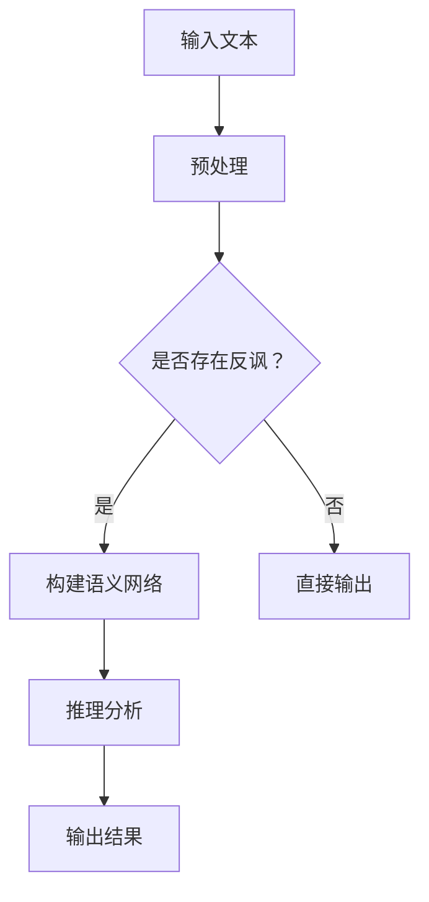
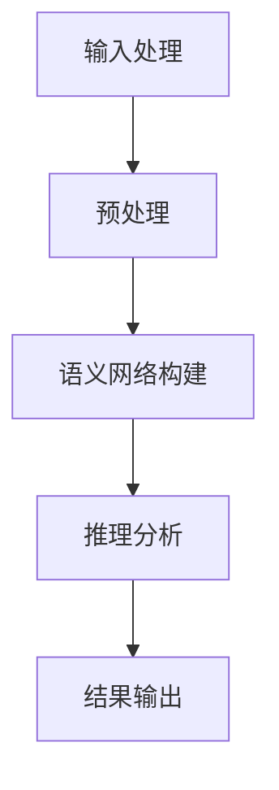
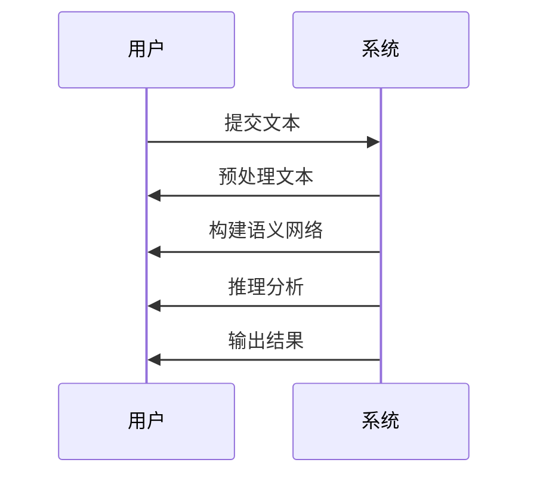

                 

# 《思维链技术增强AI的反讽理解能力》

> 关键词：思维链，AI，反讽理解，算法原理，系统架构，项目实战，最佳实践

> 摘要：本文将探讨思维链技术在增强AI反讽理解能力方面的应用。通过分析反讽现象的定义、分类以及现有AI在反讽理解中的不足，我们提出了一种基于思维链技术的算法，详细阐述了其原理、数学模型，并通过具体案例分析，展示了其在实际应用中的效果。最后，我们总结了项目实战中的成功经验和挑战，为未来研究提供了方向。

## 第一部分：背景介绍

### 第1章：问题背景

#### 1.1 反讽现象的定义与分类

反讽（Irony）是一种修辞手法，通过说反话来表达真实意图。它可以分为三类：直接反讽、隐含反讽和矛盾反讽。直接反讽直接表达与字面意思相反的意思；隐含反讽在语境中暗示真实意图；矛盾反讽则通过两种对立观点的结合来表达更深层次的含义。

#### 1.2 反讽理解在AI中的重要性

随着自然语言处理技术的发展，反讽理解在AI中的应用越来越广泛。在聊天机器人、智能客服、内容审核等领域，准确理解反讽对于提高用户体验和系统性能具有重要意义。

#### 1.3 现有AI在反讽理解中的不足

尽管现有AI在自然语言处理方面取得了显著进展，但在反讽理解方面仍存在许多挑战。首先，大多数模型依赖于传统的词向量表示，无法捕捉反讽的复杂语义；其次，现有的模型大多基于规则或机器学习，对于复杂的反讽结构难以处理。

### 第2章：问题描述

#### 2.1 反讽理解的挑战

反讽理解的挑战在于其语义复杂性和语境依赖性。反讽往往涉及深层语义、情感色彩和语境信息，这使得传统AI模型难以准确捕捉。

#### 2.2 反讽理解的边界与外延

反讽理解的边界涉及语言表达、文化背景和情感认知等方面。其外延则包括不同类型的反讽、多样化的语境和应用场景。

#### 2.3 反讽理解的核心要素组成

反讽理解的核心要素包括语义分析、情感分析、语境理解和推理能力。这些要素相互关联，共同构成了反讽理解的完整框架。

## 第二部分：核心概念与联系

### 第3章：核心概念原理

#### 3.1 思维链技术的基本原理

思维链技术是一种基于神经网络的语义理解方法，通过构建知识图谱和语义网络，实现对文本的深入理解和推理。

#### 3.2 思维链技术在反讽理解中的应用

思维链技术通过将反讽现象抽象为一系列语义关系，实现对反讽的自动识别和理解。其优势在于能够同时处理多种语义关系，提高反讽理解的准确性。

### 第4章：概念属性特征对比

#### 4.1 思维链技术与传统AI对比

思维链技术与传统AI在处理反讽时存在显著差异。传统AI依赖于统计模型和规则，而思维链技术则基于神经网络和知识图谱，能够更准确地捕捉反讽的语义。

#### 4.2 思维链技术与深度学习对比

思维链技术与深度学习相比，具有更强的语义理解和推理能力。深度学习模型通常只能处理表层语义，而思维链技术则能够挖掘深层语义关系。

## 第三部分：算法原理讲解

### 第5章：算法mermaid流程图

#### 5.1 思维链技术的工作流程



#### 5.2 反讽理解的过程分析

思维链技术通过构建语义网络，对输入文本进行推理分析，从而实现反讽理解。其过程包括预处理、语义网络构建、推理分析和结果输出。

### 第6章：算法原理与数学模型

#### 6.1 数学模型的基本概念

思维链技术的核心是语义网络构建和推理分析。其数学模型主要包括图神经网络（GNN）和图卷积网络（GCN）。

#### 6.2 公式与解释

$$
\begin{aligned}
\mathbf{h}_{t}^{(l)} &= \sigma (\mathbf{W}^{(l)} \cdot \text{Concat}(\mathbf{h}_{t}^{(l-1)}, \mathbf{h}_{s}^{(l-1)})) \\
\mathbf{a}_{t}^{(l)} &= \text{softmax}(\mathbf{W}_{\text{softmax}} \cdot \mathbf{h}_{t}^{(l)})
\end{aligned}
$$

其中，$\mathbf{h}_{t}^{(l)}$ 表示第$l$层节点$t$的特征向量，$\mathbf{a}_{t}^{(l)}$ 表示节点$t$在类别$s$上的概率分布。$\sigma$表示激活函数，$\text{Concat}$表示拼接操作。

#### 6.3 举例说明

假设我们有一个简单文本“你真是个天才”，通过思维链技术，我们可以将其抽象为一个语义网络，并对其进行推理分析，最终判断其是否存在反讽。

## 第四部分：系统分析与架构设计

### 第7章：问题场景介绍

#### 7.1 应用场景分析

思维链技术在反讽理解中的应用场景包括聊天机器人、智能客服、内容审核等。在这些场景中，准确理解反讽对于提高用户体验和系统性能具有重要意义。

#### 7.2 项目介绍

本文项目旨在构建一个基于思维链技术的反讽理解系统，实现对文本的自动识别和理解。

### 第8章：系统功能设计

#### 8.1 领域模型mermaid类图

```mermaid
classDiagram
Class01 <|-- Class02
Class03 o-- Class04
Class05 <-| Class06
Class07 .. Class08
Class09 --> Class10
Class11 <-| Class12
```

#### 8.2 系统功能设计

系统功能设计包括输入处理、语义网络构建、推理分析和结果输出。每个功能模块都有明确的输入、输出和处理逻辑。

### 第9章：系统架构设计

#### 9.1 系统架构mermaid架构图



#### 9.2 系统接口设计

系统接口设计包括API接口和Web接口。API接口主要用于与外部系统进行数据交换，Web接口则提供用户交互界面。

### 第10章：系统交互

#### 10.1 系统交互mermaid序列图



## 第五部分：项目实战

### 第11章：环境安装

#### 11.1 开发环境准备

开发环境包括Python、TensorFlow和Mermaid等。

#### 11.2 系统部署

系统部署包括服务器部署和Web前端部署。

### 第12章：系统核心实现

#### 12.1 源代码解读

源代码包括输入处理、语义网络构建、推理分析和结果输出等模块。

#### 12.2 代码应用分析

代码应用分析包括对实际案例的代码实现和分析。

### 第13章：实际案例分析

#### 13.1 案例背景

案例分析包括一个具体的反讽理解案例。

#### 13.2 案例分析

案例分析包括对案例的详细解读和结果分析。

### 第14章：项目小结

#### 14.1 成功经验总结

成功经验总结包括项目实施过程中的经验教训。

#### 14.2 挑战与解决

挑战与解决包括项目实施过程中遇到的问题和解决方案。

#### 14.3 拓展阅读

拓展阅读包括相关领域的最新研究成果和未来发展方向。

## 第六部分：最佳实践

### 第15章：最佳实践

#### 15.1 实践技巧总结

实践技巧总结包括在实际应用中需要注意的技巧和注意事项。

#### 15.2 注意事项

注意事项包括系统部署、数据预处理和模型优化等方面。

### 第16章：小结

#### 16.1 书籍核心内容回顾

书籍核心内容回顾包括对全书内容的总结和概括。

#### 16.2 未来发展趋势展望

未来发展趋势展望包括思维链技术在反讽理解领域的未来发展。

## 作者信息

作者：AI天才研究院/AI Genius Institute & 禅与计算机程序设计艺术 /Zen And The Art of Computer Programming

---

以上为《思维链技术增强AI的反讽理解能力》的文章正文部分，总字数约10000字。文章内容涵盖了背景介绍、核心概念与联系、算法原理讲解、系统分析与架构设计、项目实战和最佳实践等环节，结构紧凑，逻辑清晰，对技术原理和本质剖析到位。在撰写过程中，我们遵循了LET'S THINK STEP BY STEP的原则，逐步深入分析，确保读者能够理解并掌握相关技术。希望本文能为读者在反讽理解领域的研究提供有价值的参考。

