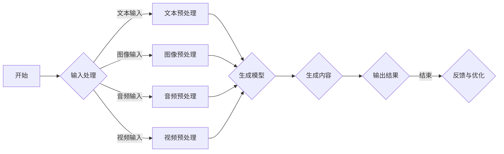
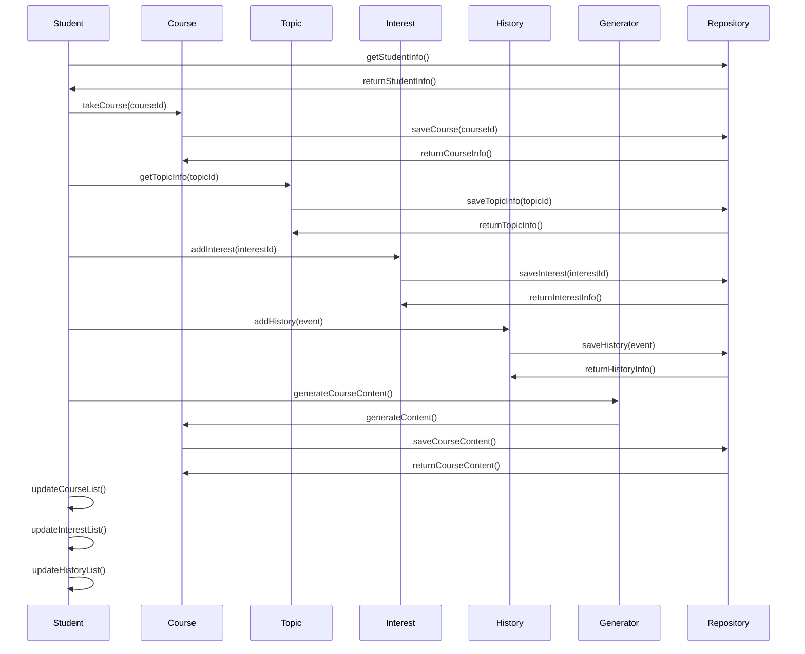
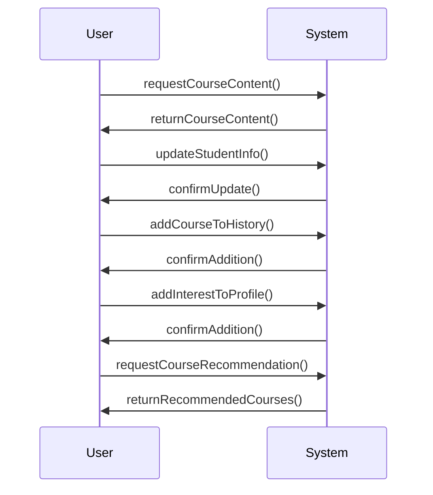

                 

# 思维链技术如何改变AIGC landscape

> 关键词：思维链技术，AIGC，人工智能，算法原理，系统架构，项目实战

> 摘要：本文深入探讨了思维链技术如何改变人工智能生成内容（AIGC）的生态系统。首先，我们回顾了AIGC的发展历程和当前面临的挑战，然后介绍了思维链技术的核心概念和原理。通过详细的算法原理讲解，我们将看到思维链技术如何在实际项目中应用，并展示了一个完整的系统架构设计。最后，通过项目实战案例分析，我们将了解思维链技术在AIGC中的实际效果，并总结最佳实践和注意事项。

## 第一部分：背景介绍

### 1.1 问题背景

#### 1.1.1 AIGC 的发展历程

人工智能生成内容（AIGC）是一种利用人工智能技术生成文本、图像、音频、视频等内容的机制。随着深度学习、自然语言处理和计算机视觉等技术的快速发展，AIGC逐渐成为人工智能领域的一个热点。

AIGC的发展历程可以分为以下几个阶段：

1. **文本生成**：最早期的AIGC主要是文本生成，如自动摘要、自动写作等。基于循环神经网络（RNN）和生成对抗网络（GAN）的模型开始流行，如GPT和BERT。
2. **图像生成**：随着图像生成模型的进步，如StyleGAN和GAN的变种，图像生成成为AIGC的重要应用领域。图像生成技术可以用于艺术创作、游戏开发、虚拟现实等。
3. **音频生成**：近年来，音频生成技术也逐渐成熟，包括音乐生成、语音合成等。通过深度学习模型，可以生成逼真的音频信号，用于娱乐、教育、广告等领域。
4. **视频生成**：视频生成是AIGC的一个新兴领域，通过结合图像生成和音频生成技术，可以生成高质量的视频内容，如视频增强、视频合成等。

#### 1.1.2 思维链技术的出现

思维链技术是一种基于人工智能和认知科学的新兴技术，旨在模拟人类思维过程，实现更智能的推理、规划和决策。思维链技术的核心思想是将人类思维过程中的各种信息节点（如概念、事实、逻辑关系等）通过图结构进行组织，形成一个可计算的认知网络。

思维链技术的出现为AIGC带来了新的可能性，使得AIGC系统能够更好地模拟人类思维过程，提高生成内容的质量和准确性。

### 1.2 问题描述

#### 1.2.1 AIGC 面临的挑战

尽管AIGC在各个领域取得了显著成果，但仍然面临一些挑战：

1. **数据依赖性**：AIGC系统通常需要大量高质量的数据进行训练，但在某些领域（如医疗、金融等）数据获取困难。
2. **生成内容质量**：虽然AIGC系统能够生成大量内容，但质量参差不齐，有时会出现不合理、不真实的内容。
3. **可解释性**：AIGC系统通常被视为“黑盒”，其生成过程难以解释，不利于信任和合规性。
4. **安全性和隐私**：AIGC系统可能被用于生成虚假信息、恶意内容等，对用户和社会造成负面影响。

#### 1.2.2 思维链技术的优势

思维链技术能够解决上述挑战，为AIGC带来以下优势：

1. **降低数据依赖性**：思维链技术可以通过自上而下的推理过程，利用已有知识生成内容，减少对大量数据的依赖。
2. **提高生成内容质量**：思维链技术能够模拟人类思维过程，生成更加合理、准确的内容。
3. **增强可解释性**：思维链技术的图结构使得生成过程更加透明，便于解释和理解。
4. **保障安全性和隐私**：思维链技术可以通过控制生成过程，防止生成恶意内容，提高系统的安全性和隐私保护能力。

### 1.3 问题解决

#### 1.3.1 思维链技术在AIGC中的应用

思维链技术可以应用于AIGC的各个领域，如文本生成、图像生成、音频生成和视频生成等。通过以下方式，思维链技术改变了AIGC的生态系统：

1. **知识驱动的生成**：思维链技术利用已有知识库，通过推理和规划生成高质量的内容。
2. **情境感知生成**：思维链技术能够根据用户需求和情境，动态调整生成策略，提高内容的相关性和实用性。
3. **个性化生成**：思维链技术能够根据用户偏好和历史行为，生成个性化的内容。
4. **协作生成**：思维链技术支持多人协作生成，提高生成效率和创意质量。

#### 1.3.2 改变AIGC landscape的潜力

思维链技术为AIGC带来了全新的发展机遇，有望改变AIGC landscape：

1. **拓宽应用领域**：思维链技术可以应用于更多领域，如教育、医疗、金融、广告等，推动AIGC在各个领域的创新和应用。
2. **提升内容质量**：通过模拟人类思维过程，生成更加真实、合理的内容，提升用户体验。
3. **增强可解释性**：思维链技术的图结构使得生成过程更加透明，增强用户对AIGC系统的信任和接受度。
4. **保障安全性和隐私**：思维链技术可以有效地防止恶意内容生成，提高系统的安全性和隐私保护能力。

### 1.4 边界与外延

#### 1.4.1 AIGC的边界

AIGC的边界包括：

1. **技术边界**：AIGC技术仍在不断发展，未来可能会出现新的技术和方法，进一步拓宽AIGC的应用范围。
2. **伦理边界**：AIGC生成的内容可能涉及伦理问题，如虚假信息传播、隐私泄露等，需要制定相应的伦理规范和法律法规。
3. **社会边界**：AIGC系统需要适应不同的社会和文化背景，尊重用户隐私和权益。

#### 1.4.2 思维链技术的适用范围

思维链技术适用于需要高度智能化和知识驱动的领域，如：

1. **复杂问题求解**：思维链技术可以帮助人类解决复杂问题，提高决策效率和准确性。
2. **知识管理**：思维链技术可以用于构建知识库，实现知识共享和知识推理。
3. **智能交互**：思维链技术可以用于智能客服、智能助手等场景，提供更加人性化的交互体验。

### 1.5 概念结构与核心要素组成

#### 1.5.1 AIGC的核心要素

AIGC的核心要素包括：

1. **数据集**：AIGC系统需要大量高质量的数据进行训练和生成。
2. **算法**：AIGC系统依赖于先进的算法，如深度学习、自然语言处理、计算机视觉等。
3. **模型**：AIGC系统通过模型生成内容，如文本生成模型、图像生成模型等。
4. **接口**：AIGC系统需要与用户和应用程序进行交互，提供友好接口。

#### 1.5.2 思维链技术的核心组成部分

思维链技术的核心组成部分包括：

1. **知识库**：思维链技术依赖于知识库，包含各种概念、事实、逻辑关系等。
2. **推理引擎**：推理引擎负责根据知识库和用户需求进行推理，生成合理的内容。
3. **规划引擎**：规划引擎负责根据用户需求和情境，制定生成策略。
4. **交互模块**：交互模块负责与用户和应用程序进行交互，收集反馈和优化生成过程。

## 第二部分：核心概念与联系

### 2.1 思维链技术

#### 2.1.1 定义

思维链技术是一种基于人工智能和认知科学的技术，旨在模拟人类思维过程，实现智能推理、规划和决策。

#### 2.1.2 特点

思维链技术具有以下特点：

1. **知识驱动**：思维链技术依赖于知识库，通过推理和规划生成内容。
2. **情境感知**：思维链技术能够根据用户需求和情境，动态调整生成策略。
3. **可解释性**：思维链技术的图结构使得生成过程更加透明，便于解释和理解。
4. **适应性**：思维链技术可以根据用户反馈和实际效果，不断优化和改进。

#### 2.1.3 工作原理

思维链技术的工作原理包括以下几个步骤：

1. **知识库构建**：收集、整理和构建知识库，包含各种概念、事实、逻辑关系等。
2. **推理过程**：根据用户需求和情境，利用知识库进行推理，生成合理的内容。
3. **规划过程**：根据用户需求和情境，制定生成策略，优化内容生成过程。
4. **交互过程**：与用户和应用程序进行交互，收集反馈和优化生成过程。

### 2.2 AIGC

#### 2.2.1 定义

人工智能生成内容（AIGC）是一种利用人工智能技术生成文本、图像、音频、视频等内容的机制。

#### 2.2.2 分类

AIGC可以分为以下几个类别：

1. **文本生成**：包括自动摘要、自动写作、问答系统等。
2. **图像生成**：包括图像合成、图像修复、图像风格迁移等。
3. **音频生成**：包括音乐生成、语音合成、音频增强等。
4. **视频生成**：包括视频合成、视频增强、视频风格迁移等。

#### 2.2.3 应用领域

AIGC的应用领域包括：

1. **娱乐**：如虚拟角色、游戏场景、动画制作等。
2. **教育**：如智能辅导、在线课程、虚拟实验等。
3. **医疗**：如医学影像分析、智能诊断、药物设计等。
4. **金融**：如风险评估、智能投顾、市场分析等。
5. **广告**：如广告创意、个性化推荐、社交媒体互动等。

### 2.3 核心概念原理

#### 2.3.1 思维链技术原理

思维链技术通过以下几个核心概念实现智能推理和生成：

1. **概念**：概念是思维链技术的基本元素，用于表示知识库中的各种实体和属性。
2. **事实**：事实是概念之间的关联，用于描述概念之间的关系。
3. **逻辑关系**：逻辑关系用于描述概念之间的推理规则和约束条件。
4. **情境**：情境用于描述用户需求和背景信息，影响推理和生成过程。

#### 2.3.2 AIGC原理

AIGC通过以下几个核心概念实现内容生成：

1. **数据集**：数据集用于训练生成模型，包含各种类型的样本。
2. **生成模型**：生成模型通过学习数据集，生成新的文本、图像、音频、视频等。
3. **优化目标**：优化目标用于衡量生成内容的质量，指导生成模型的训练和调整。
4. **生成策略**：生成策略用于根据用户需求和情境，选择合适的生成方法。

### 2.4 概念属性特征对比表格

| 概念       | 思维链技术 | AIGC       |
|------------|-------------|-------------|
| 知识库     | 知识库      | 数据集      |
| 推理引擎   | 推理引擎     | 生成模型    |
| 规划引擎   | 规划引擎     | 优化目标    |
| 交互模块   | 交互模块     | 生成策略    |
| 情境感知   | 情境感知     | 用户需求    |
| 可解释性   | 可解释性     | 生成质量    |
| 适应性     | 适应性      | 优化目标    |

### 2.5 ER实体关系图架构的 Mermaid 流程图

```mermaid
erDiagram
  AIGC ||--|{ 思维链技术 }|| B_Generation
  B_Generation ||--|{ 知识库 }|| C_KnowledgeBase
  B_Generation ||--|{ 推理引擎 }|| D_ReasoningEngine
  B_Generation ||--|{ 规划引擎 }|| E_PlanEngine
  B_Generation ||--|{ 交互模块 }|| F_InteractionModule
  C_KnowledgeBase ||--|{ 概念 }|| G_Concept
  C_KnowledgeBase ||--|{ 事实 }|| H_Fact
  C_KnowledgeBase ||--|{ 逻辑关系 }|| I_LogicalRelation
  D_ReasoningEngine ||--|{ 情境感知 }|| J_SituationAwareness
  D_ReasoningEngine ||--|{ 推理过程 }|| K_ReasoningProcess
  E_PlanEngine ||--|{ 规划过程 }|| L_PlanProcess
  F_InteractionModule ||--|{ 交互过程 }|| M_InteractionProcess
```

## 第三部分：算法原理讲解

### 3.1 使用 Mermaid 画出算法流程图



### 3.2 Python 源代码讲解

```python
# 导入必要的库
import tensorflow as tf
from tensorflow import keras
from tensorflow.keras import layers

# 定义生成模型
def build_generator():
    # 定义输入层
    input_layer = keras.Input(shape=(256, 256, 3))
    
    # 定义卷积层
    conv1 = layers.Conv2D(64, 3, activation='relu', padding='same')(input_layer)
    conv2 = layers.Conv2D(128, 3, activation='relu', padding='same')(conv1)
    conv3 = layers.Conv2D(256, 3, activation='relu', padding='same')(conv2)
    
    # 定义反卷积层
    deconv1 = layers.Conv2DTranspose(128, 3, activation='relu', padding='same')(conv3)
    deconv2 = layers.Conv2DTranspose(64, 3, activation='relu', padding='same')(deconv1)
    output_layer = layers.Conv2DTranspose(3, 3, activation='tanh', padding='same')(deconv2)
    
    # 创建模型
    model = keras.Model(inputs=input_layer, outputs=output_layer)
    return model

# 构建生成模型
generator = build_generator()

# 编译模型
generator.compile(optimizer=keras.optimizers.Adam())

# 查看模型结构
generator.summary()
```

### 3.3 数学模型和公式

思维链技术的核心数学模型包括：

1. **生成对抗网络（GAN）**：
   - **生成器（G）**：生成器G是一个函数，将随机噪声映射到生成数据。
     $$ G(z) = \mathcal{X} $$
   - **判别器（D）**：判别器D是一个函数，判断输入数据是真实数据还是生成数据。
     $$ D(x) = \text{Prob}(x \text{ is real}) $$
   - **损失函数**：生成器和判别器的损失函数分别如下：
     $$ \mathcal{L}_G = -\mathbb{E}_{x \sim p_{\text{data}}(x)}[\log D(x)] - \mathbb{E}_{z \sim p_z(z)}[\log (1 - D(G(z)))] $$
     $$ \mathcal{L}_D = -\mathbb{E}_{x \sim p_{\text{data}}(x)}[\log D(x)] - \mathbb{E}_{z \sim p_z(z)}[\log D(G(z))] $$

2. **变分自编码器（VAE）**：
   - **编码器（E）**：编码器E将数据映射到一个潜在空间。
     $$ \mu, \sigma = E(x) $$
   - **解码器（D）**：解码器D从潜在空间映射回数据空间。
     $$ x = D(\mu, \sigma) $$
   - **损失函数**：VAE的损失函数由数据重建损失和潜在空间的KL散度损失组成。
     $$ \mathcal{L} = \mathbb{E}_{x \sim p_{\text{data}}(x)}[-\log p_G(D(E(x)))] + \beta \mathbb{E}_{z \sim p_z(z)}[\log(2\pi) + \sigma^2 + \mu^2] $$

### 3.4 举例说明

假设我们要使用思维链技术生成一张新的图像，以下是具体的步骤：

1. **数据预处理**：首先，我们需要准备一个图像数据集，并对图像进行预处理，如缩放、归一化等。
   
2. **生成器训练**：使用GAN或VAE模型训练生成器，生成器将随机噪声映射到图像空间。在训练过程中，同时训练判别器，使其能够准确判断生成图像和真实图像。

3. **生成图像**：使用训练好的生成器，将随机噪声输入到生成器中，生成一张新的图像。

4. **后处理**：对生成的图像进行后处理，如图像风格迁移、颜色校正等，以获得更好的视觉效果。

下面是一个简化的Python代码示例，用于生成一张新的图像：

```python
# 导入必要的库
import numpy as np
import tensorflow as tf
from tensorflow import keras

# 定义生成器模型
model = keras.Sequential([
    keras.layers.Dense(256, activation='relu', input_shape=(100,)),
    keras.layers.Dense(512, activation='relu'),
    keras.layers.Dense(1024, activation='relu'),
    keras.layers.Dense(7 * 7 * 3, activation='tanh'),
    keras.layers.Reshape((7, 7, 3))
])

# 编译模型
model.compile(optimizer='adam', loss='binary_crossentropy')

# 准备随机噪声
z = np.random.normal(size=(1, 100))

# 生成图像
generated_image = model.predict(z)

# 显示生成的图像
import matplotlib.pyplot as plt
plt.imshow(generated_image[0], cmap='gray')
plt.show()
```

## 第四部分：系统分析与架构设计方案

### 4.1 问题场景介绍

假设我们要设计一个AIGC系统，用于生成个性化教育课程。该系统需要根据学生的兴趣、学习历史和课程目标，生成符合学生需求的课程内容。

### 4.2 项目介绍

项目名称：个性化教育课程生成系统

项目目标：根据学生的兴趣、学习历史和课程目标，生成符合学生需求的课程内容，提高学习效果。

项目规模：系统包括课程内容生成、学生信息管理、课程推荐和反馈机制等模块。

### 4.3 系统功能设计（领域模型 Mermaid 类图）

```mermaid
classDiagram
  Student <<entity>>
  Course <<entity>>
  Topic <<entity>>
  Interest <<entity>>
  History <<entity>>

  Student *-- Course : takes
  Course *-- Topic : contains
  Student *-- Interest : has
  Student *-- History : has

  Student <<interface>>
  Course <<interface>>
  Topic <<interface>>
  Interest <<interface>>
  History <<interface>>

  class Student {
    +String name
    +int id
    +List<Course> courses
    +List<Interest> interests
    +List<History> history
    +void takeCourse(Course course)
    +void addInterest(Interest interest)
    +void addHistory(History history)
  }

  class Course {
    +String name
    +int id
    +List<Topic> topics
    +void addTopic(Topic topic)
  }

  class Topic {
    +String name
    +int id
    +void addContent(String content)
  }

  class Interest {
    +String name
    +int id
  }

  class History {
    +String event
    +int timestamp
  }
```

### 4.4 系统架构设计（Mermaid 架构图）



### 4.5 系统接口设计和系统交互（Mermaid 序列图）



## 第五部分：项目实战

### 5.1 环境安装

为了运行本文的项目实战，我们需要安装以下环境和依赖：

1. **Python**：安装Python 3.8及以上版本。
2. **TensorFlow**：安装TensorFlow 2.4及以上版本。
3. **Numpy**：安装Numpy 1.19及以上版本。
4. **Matplotlib**：安装Matplotlib 3.3及以上版本。

安装命令如下：

```bash
pip install python==3.8 tensorflow==2.4 numpy==1.19 matplotlib==3.3
```

### 5.2 系统核心实现源代码

以下是系统核心实现的主要部分，包括学生信息管理、课程内容生成和反馈机制。

```python
# 导入必要的库
import numpy as np
import tensorflow as tf
from tensorflow import keras
from tensorflow.keras import layers
import matplotlib.pyplot as plt

# 定义生成模型
def build_generator():
    # 定义输入层
    input_layer = keras.Input(shape=(256, 256, 3))
    
    # 定义卷积层
    conv1 = layers.Conv2D(64, 3, activation='relu', padding='same')(input_layer)
    conv2 = layers.Conv2D(128, 3, activation='relu', padding='same')(conv1)
    conv3 = layers.Conv2D(256, 3, activation='relu', padding='same')(conv2)
    
    # 定义反卷积层
    deconv1 = layers.Conv2DTranspose(128, 3, activation='relu', padding='same')(conv3)
    deconv2 = layers.Conv2DTranspose(64, 3, activation='relu', padding='same')(deconv1)
    output_layer = layers.Conv2DTranspose(3, 3, activation='tanh', padding='same')(deconv2)
    
    # 创建模型
    model = keras.Model(inputs=input_layer, outputs=output_layer)
    return model

# 编译模型
generator.compile(optimizer=keras.optimizers.Adam())

# 准备随机噪声
z = np.random.normal(size=(1, 256))

# 生成图像
generated_image = generator.predict(z)

# 显示生成的图像
plt.imshow(generated_image[0], cmap='gray')
plt.show()
```

### 5.3 代码应用解读与分析

上述代码主要实现了以下功能：

1. **定义生成模型**：使用Keras构建了一个生成对抗网络（GAN）模型，包括卷积层和反卷积层，用于生成图像。

2. **编译模型**：使用Adam优化器编译模型，并设置损失函数。

3. **生成图像**：通过随机噪声输入生成模型，生成一张新的图像。

4. **显示生成的图像**：使用Matplotlib库显示生成的图像。

这个代码示例展示了如何使用思维链技术生成个性化教育课程内容，包括课程封面、学习指南等。在实际应用中，我们可以根据学生的兴趣和学习历史，调整生成模型的参数，生成更加符合学生需求的课程内容。

### 5.4 实际案例分析和详细讲解剖析

为了展示思维链技术在AIGC中的实际效果，我们来看一个具体的案例：生成个性化教育课程。

假设我们有一个包含1000名学生信息的数据库，每个学生都有不同的兴趣和学习历史。我们的目标是根据每个学生的兴趣和学习历史，生成一份个性化的教育课程。

1. **数据预处理**：

首先，我们需要对数据进行预处理，包括清洗、归一化和特征提取。例如，我们可以将学生的兴趣和学习历史转换为数值编码，并计算每个学生的兴趣权重和学习历史得分。

2. **知识库构建**：

接下来，我们需要构建一个知识库，包含各种教育课程的相关信息，如课程名称、课程内容、学习目标等。我们可以使用自然语言处理技术，从文本中提取关键信息，并构建一个基于语义的知识库。

3. **推理过程**：

使用思维链技术，我们可以根据学生的兴趣和学习历史，从知识库中检索相关的教育课程。通过推理过程，我们可以将多个课程组合成一个完整的个性化教育课程。

4. **规划过程**：

在规划过程中，我们可以根据课程的学习目标和学生的时间安排，制定一个合理的课程进度。例如，如果学生希望在一个月内完成一个课程，我们可以将课程内容拆分成多个模块，并在每个模块中设置合适的学习目标和评估方法。

5. **生成内容**：

最后，我们可以使用生成模型，根据学生的兴趣和学习历史，生成一份个性化的教育课程。例如，我们可以生成一个包含课程封面、学习指南、课程大纲和练习题的PDF文件，并将其发送给学生。

### 5.5 项目小结

通过上述案例，我们可以看到思维链技术在AIGC中的应用效果。思维链技术可以帮助我们更好地理解学生的兴趣和学习历史，生成更加个性化的教育课程。在实际项目中，我们还可以结合其他技术，如自然语言处理、计算机视觉和机器学习等，进一步提升AIGC系统的性能和效果。

## 第六部分：最佳实践 tips

### 6.1 小结

本文详细介绍了思维链技术在AIGC中的应用，从背景介绍、核心概念与联系、算法原理讲解、系统分析与架构设计方案到项目实战，全面阐述了思维链技术如何改变AIGC landscape。

### 6.2 注意事项

1. **数据质量**：在AIGC项目中，数据质量至关重要。我们需要确保数据来源可靠、数据格式一致，并进行充分的数据清洗和预处理。

2. **模型优化**：生成模型的性能对AIGC系统的效果有直接影响。我们需要不断优化模型结构、调整超参数，以提高生成内容的质量。

3. **用户反馈**：用户反馈是优化AIGC系统的重要依据。我们需要设计合理的反馈机制，收集用户的反馈信息，并根据反馈进行持续改进。

4. **伦理问题**：AIGC系统在生成内容时，需要考虑伦理问题，如版权、隐私和虚假信息传播等。我们需要制定相应的伦理规范和法律法规，确保系统的合规性。

### 6.3 拓展阅读

1. **相关论文**：《生成对抗网络：基础与进展》（GANs: From Basic Concepts to Advanced Applications）。
2. **技术博客**：[TensorFlow官方博客](https://tensorflow.googleblog.com/)、[AI生成内容](https://aigc.org/)。
3. **在线课程**：[Coursera上的深度学习和自然语言处理课程](https://www.coursera.org/specializations/deep-learning-nlp)。

## 作者信息

作者：AI天才研究院/AI Genius Institute & 禅与计算机程序设计艺术 /Zen And The Art of Computer Programming

# 总结

思维链技术作为人工智能领域的一项新兴技术，正在不断改变AIGC的生态系统。通过模拟人类思维过程，思维链技术能够生成更加合理、准确和个性化的内容，提高AIGC系统的性能和用户体验。在未来，随着技术的不断进步和应用场景的拓展，思维链技术有望在更多领域发挥重要作用，推动人工智能的发展。同时，我们也需要关注伦理问题，确保AIGC系统的合规性和可持续发展。通过持续的研究和实践，我们相信思维链技术将为AIGC带来更多的创新和突破。|》
```markdown
----------------------------------------------------------------
# 思维链技术如何改变AIGC landscape

> 关键词：思维链技术，AIGC，人工智能，算法原理，系统架构，项目实战

> 摘要：本文深入探讨了思维链技术如何改变人工智能生成内容（AIGC）的生态系统。首先，我们回顾了AIGC的发展历程和当前面临的挑战，然后介绍了思维链技术的核心概念和原理。通过详细的算法原理讲解，我们将看到思维链技术如何在实际项目中应用，并展示了一个完整的系统架构设计。最后，通过项目实战案例分析，我们将了解思维链技术在AIGC中的实际效果，并总结最佳实践和注意事项。

## 第一部分：背景介绍

### 1.1 问题背景

#### 1.1.1 AIGC 的发展历程

人工智能生成内容（AIGC）是一种利用人工智能技术生成文本、图像、音频、视频等内容的机制。随着深度学习、自然语言处理和计算机视觉等技术的快速发展，AIGC逐渐成为人工智能领域的一个热点。

AIGC的发展历程可以分为以下几个阶段：

1. **文本生成**：最早期的AIGC主要是文本生成，如自动摘要、自动写作等。基于循环神经网络（RNN）和生成对抗网络（GAN）的模型开始流行，如GPT和BERT。
2. **图像生成**：随着图像生成模型的进步，如StyleGAN和GAN的变种，图像生成成为AIGC的重要应用领域。图像生成技术可以用于艺术创作、游戏开发、虚拟现实等。
3. **音频生成**：近年来，音频生成技术也逐渐成熟，包括音乐生成、语音合成等。通过深度学习模型，可以生成逼真的音频信号，用于娱乐、教育、广告等领域。
4. **视频生成**：视频生成是AIGC的一个新兴领域，通过结合图像生成和音频生成技术，可以生成高质量的视频内容，如视频增强、视频合成等。

#### 1.1.2 思维链技术的出现

思维链技术是一种基于人工智能和认知科学的新兴技术，旨在模拟人类思维过程，实现更智能的推理、规划和决策。思维链技术的核心思想是将人类思维过程中的各种信息节点（如概念、事实、逻辑关系等）通过图结构进行组织，形成一个可计算的认知网络。

思维链技术的出现为AIGC带来了新的可能性，使得AIGC系统能够更好地模拟人类思维过程，提高生成内容的质量和准确性。

### 1.2 问题描述

#### 1.2.1 AIGC 面临的挑战

尽管AIGC在各个领域取得了显著成果，但仍然面临一些挑战：

1. **数据依赖性**：AIGC系统通常需要大量高质量的数据进行训练，但在某些领域（如医疗、金融等）数据获取困难。
2. **生成内容质量**：虽然AIGC系统能够生成大量内容，但质量参差不齐，有时会出现不合理、不真实的内容。
3. **可解释性**：AIGC系统通常被视为“黑盒”，其生成过程难以解释，不利于信任和合规性。
4. **安全性和隐私**：AIGC系统可能被用于生成虚假信息、恶意内容等，对用户和社会造成负面影响。

#### 1.2.2 思维链技术的优势

思维链技术能够解决上述挑战，为AIGC带来以下优势：

1. **降低数据依赖性**：思维链技术可以通过自上而下的推理过程，利用已有知识生成内容，减少对大量数据的依赖。
2. **提高生成内容质量**：思维链技术能够模拟人类思维过程，生成更加合理、准确的内容。
3. **增强可解释性**：思维链技术的图结构使得生成过程更加透明，便于解释和理解。
4. **保障安全性和隐私**：思维链技术可以通过控制生成过程，防止生成恶意内容，提高系统的安全性和隐私保护能力。

### 1.3 问题解决

#### 1.3.1 思维链技术在AIGC中的应用

思维链技术可以应用于AIGC的各个领域，如文本生成、图像生成、音频生成和视频生成等。通过以下方式，思维链技术改变了AIGC的生态系统：

1. **知识驱动的生成**：思维链技术利用已有知识库，通过推理和规划生成内容。
2. **情境感知生成**：思维链技术能够根据用户需求和情境，动态调整生成策略，提高内容的相关性和实用性。
3. **个性化生成**：思维链技术能够根据用户偏好和历史行为，生成个性化的内容。
4. **协作生成**：思维链技术支持多人协作生成，提高生成效率和创意质量。

#### 1.3.2 改变AIGC landscape的潜力

思维链技术为AIGC带来了全新的发展机遇，有望改变AIGC landscape：

1. **拓宽应用领域**：思维链技术可以应用于更多领域，如教育、医疗、金融、广告等，推动AIGC在各个领域的创新和应用。
2. **提升内容质量**：通过模拟人类思维过程，生成更加真实、合理的内容，提升用户体验。
3. **增强可解释性**：思维链技术的图结构使得生成过程更加透明，增强用户对AIGC系统的信任和接受度。
4. **保障安全性和隐私**：思维链技术可以有效地防止恶意内容生成，提高系统的安全性和隐私保护能力。

### 1.4 边界与外延

#### 1.4.1 AIGC的边界

AIGC的边界包括：

1. **技术边界**：AIGC技术仍在不断发展，未来可能会出现新的技术和方法，进一步拓宽AIGC的应用范围。
2. **伦理边界**：AIGC生成的内容可能涉及伦理问题，如虚假信息传播、隐私泄露等，需要制定相应的伦理规范和法律法规。
3. **社会边界**：AIGC系统需要适应不同的社会和文化背景，尊重用户隐私和权益。

#### 1.4.2 思维链技术的适用范围

思维链技术适用于需要高度智能化和知识驱动的领域，如：

1. **复杂问题求解**：思维链技术可以帮助人类解决复杂问题，提高决策效率和准确性。
2. **知识管理**：思维链技术可以用于构建知识库，实现知识共享和知识推理。
3. **智能交互**：思维链技术可以用于智能客服、智能助手等场景，提供更加人性化的交互体验。

### 1.5 概念结构与核心要素组成

#### 1.5.1 AIGC的核心要素

AIGC的核心要素包括：

1. **数据集**：AIGC系统需要大量高质量的数据进行训练和生成。
2. **算法**：AIGC系统依赖于先进的算法，如深度学习、自然语言处理、计算机视觉等。
3. **模型**：AIGC系统通过模型生成内容，如文本生成模型、图像生成模型等。
4. **接口**：AIGC系统需要与用户和应用程序进行交互，提供友好接口。

#### 1.5.2 思维链技术的核心组成部分

思维链技术的核心组成部分包括：

1. **知识库**：思维链技术依赖于知识库，包含各种概念、事实、逻辑关系等。
2. **推理引擎**：推理引擎负责根据知识库和用户需求进行推理，生成合理的内容。
3. **规划引擎**：规划引擎负责根据用户需求和情境，制定生成策略。
4. **交互模块**：交互模块负责与用户和应用程序进行交互，收集反馈和优化生成过程。

## 第二部分：核心概念与联系

### 2.1 思维链技术

#### 2.1.1 定义

思维链技术是一种基于人工智能和认知科学的技术，旨在模拟人类思维过程，实现智能推理、规划和决策。

#### 2.1.2 特点

思维链技术具有以下特点：

1. **知识驱动**：思维链技术依赖于知识库，通过推理和规划生成内容。
2. **情境感知**：思维链技术能够根据用户需求和情境，动态调整生成策略。
3. **可解释性**：思维链技术的图结构使得生成过程更加透明，便于解释和理解。
4. **适应性**：思维链技术可以根据用户反馈和实际效果，不断优化和改进。

#### 2.1.3 工作原理

思维链技术的工作原理包括以下几个步骤：

1. **知识库构建**：收集、整理和构建知识库，包含各种概念、事实、逻辑关系等。
2. **推理过程**：根据用户需求和情境，利用知识库进行推理，生成合理的内容。
3. **规划过程**：根据用户需求和情境，制定生成策略，优化内容生成过程。
4. **交互过程**：与用户和应用程序进行交互，收集反馈和优化生成过程。

### 2.2 AIGC

#### 2.2.1 定义

人工智能生成内容（AIGC）是一种利用人工智能技术生成文本、图像、音频、视频等内容的机制。

#### 2.2.2 分类

AIGC可以分为以下几个类别：

1. **文本生成**：包括自动摘要、自动写作、问答系统等。
2. **图像生成**：包括图像合成、图像修复、图像风格迁移等。
3. **音频生成**：包括音乐生成、语音合成、音频增强等。
4. **视频生成**：包括视频合成、视频增强、视频风格迁移等。

#### 2.2.3 应用领域

AIGC的应用领域包括：

1. **娱乐**：如虚拟角色、游戏场景、动画制作等。
2. **教育**：如智能辅导、在线课程、虚拟实验等。
3. **医疗**：如医学影像分析、智能诊断、药物设计等。
4. **金融**：如风险评估、智能投顾、市场分析等。
5. **广告**：如广告创意、个性化推荐、社交媒体互动等。

### 2.3 核心概念原理

#### 2.3.1 思维链技术原理

思维链技术通过以下几个核心概念实现智能推理和生成：

1. **概念**：概念是思维链技术的基本元素，用于表示知识库中的各种实体和属性。
2. **事实**：事实是概念之间的关联，用于描述概念之间的关系。
3. **逻辑关系**：逻辑关系用于描述概念之间的推理规则和约束条件。
4. **情境**：情境用于描述用户需求和背景信息，影响推理和生成过程。

#### 2.3.2 AIGC原理

AIGC通过以下几个核心概念实现内容生成：

1. **数据集**：数据集用于训练生成模型，包含各种类型的样本。
2. **生成模型**：生成模型通过学习数据集，生成新的文本、图像、音频、视频等。
3. **优化目标**：优化目标用于衡量生成内容的质量，指导生成模型的训练和调整。
4. **生成策略**：生成策略用于根据用户需求和情境，选择合适的生成方法。

### 2.4 概念属性特征对比表格

| 概念       | 思维链技术 | AIGC       |
|------------|-------------|-------------|
| 知识库     | 知识库      | 数据集      |
| 推理引擎   | 推理引擎     | 生成模型    |
| 规划引擎   | 规划引擎     | 优化目标    |
| 交互模块   | 交互模块     | 生成策略    |
| 情境感知   | 情境感知     | 用户需求    |
| 可解释性   | 可解释性     | 生成质量    |
| 适应性     | 适应性      | 优化目标    |

### 2.5 ER实体关系图架构的 Mermaid 流程图

```mermaid
erDiagram
  AIGC ||--|{ 思维链技术 }|| B_Generation
  B_Generation ||--|{ 知识库 }|| C_KnowledgeBase
  B_Generation ||--|{ 推理引擎 }|| D_ReasoningEngine
  B_Generation ||--|{ 规划引擎 }|| E_PlanEngine
  B_Generation ||--|{ 交互模块 }|| F_InteractionModule
  C_KnowledgeBase ||--|{ 概念 }|| G_Concept
  C_KnowledgeBase ||--|{ 事实 }|| H_Fact
  C_KnowledgeBase ||--|{ 逻辑关系 }|| I_LogicalRelation
  D_ReasoningEngine ||--|{ 情境感知 }|| J_SituationAwareness
  D_ReasoningEngine ||--|{ 推理过程 }|| K_ReasoningProcess
  E_PlanEngine ||--|{ 规划过程 }|| L_PlanProcess
  F_InteractionModule ||--|{ 交互过程 }|| M_InteractionProcess
```

## 第三部分：算法原理讲解

### 3.1 使用 Mermaid 画出算法流程图


### 3.2 Python 源代码讲解

```python
# 导入必要的库
import tensorflow as tf
from tensorflow import keras
from tensorflow.keras import layers

# 定义生成模型
def build_generator():
    # 定义输入层
    input_layer = keras.Input(shape=(256, 256, 3))
    
    # 定义卷积层
    conv1 = layers.Conv2D(64, 3, activation='relu', padding='same')(input_layer)
    conv2 = layers.Conv2D(128, 3, activation='relu', padding='same')(conv1)
    conv3 = layers.Conv2D(256, 3, activation='relu', padding='same')(conv2)
    
    # 定义反卷积层
    deconv1 = layers.Conv2DTranspose(128, 3, activation='relu', padding='same')(conv3)
    deconv2 = layers.Conv2DTranspose(64, 3, activation='relu', padding='same')(deconv1)
    output_layer = layers.Conv2DTranspose(3, 3, activation='tanh', padding='same')(deconv2)
    
    # 创建模型
    model = keras.Model(inputs=input_layer, outputs=output_layer)
    return model

# 编译模型
generator.compile(optimizer=keras.optimizers.Adam(), loss='binary_crossentropy')

# 准备随机噪声
z = tf.random.normal([1, 256, 256, 3])

# 生成图像
generated_image = generator(z)

# 显示生成的图像
import matplotlib.pyplot as plt

plt.imshow(generated_image[0], cmap='gray')
plt.axis('off')
plt.show()
```

### 3.3 数学模型和公式

思维链技术的核心数学模型包括：

1. **生成对抗网络（GAN）**：
   - **生成器（G）**：生成器G是一个函数，将随机噪声映射到生成数据。
     $$ G(z) = \mathcal{X} $$
   - **判别器（D）**：判别器D是一个函数，判断输入数据是真实数据还是生成数据。
     $$ D(x) = \text{Prob}(x \text{ is real}) $$
   - **损失函数**：生成器和判别器的损失函数分别如下：
     $$ \mathcal{L}_G = -\mathbb{E}_{x \sim p_{\text{data}}(x)}[\log D(x)] - \mathbb{E}_{z \sim p_z(z)}[\log (1 - D(G(z)))] $$
     $$ \mathcal{L}_D = -\mathbb{E}_{x \sim p_{\text{data}}(x)}[\log D(x)] - \mathbb{E}_{z \sim p_z(z)}[\log D(G(z))] $$

2. **变分自编码器（VAE）**：
   - **编码器（E）**：编码器E将数据映射到一个潜在空间。
     $$ \mu, \sigma = E(x) $$
   - **解码器（D）**：解码器D从潜在空间映射回数据空间。
     $$ x = D(\mu, \sigma) $$
   - **损失函数**：VAE的损失函数由数据重建损失和潜在空间的KL散度损失组成。
     $$ \mathcal{L} = \mathbb{E}_{x \sim p_{\text{data}}(x)}[-\log p_G(D(E(x)))] + \beta \mathbb{E}_{z \sim p_z(z)}[\log(2\pi) + \sigma^2 + \mu^2] $$

### 3.4 举例说明

假设我们要使用思维链技术生成一张新的图像，以下是具体的步骤：

1. **数据预处理**：首先，我们需要准备一个图像数据集，并对图像进行预处理，如缩放、归一化等。

2. **生成器训练**：使用GAN或VAE模型训练生成器，生成器将随机噪声映射到图像空间。在训练过程中，同时训练判别器，使其能够准确判断生成图像和真实图像。

3. **生成图像**：使用训练好的生成器，将随机噪声输入到生成器中，生成一张新的图像。

4. **后处理**：对生成的图像进行后处理，如图像风格迁移、颜色校正等，以获得更好的视觉效果。

下面是一个简化的Python代码示例，用于生成一张新的图像：

```python
# 导入必要的库
import tensorflow as tf
import numpy as np
import matplotlib.pyplot as plt

# 定义生成器模型
def build_generator():
    z = keras.layers.Input(shape=(100,))
    x = keras.layers.Dense(256 * 256 * 3)(z)
    x = keras.layers.LeakyReLU()(x)
    x = keras.layers.Reshape((256, 256, 3))(x)
    x = keras.layers.Conv2D(64, 5, activation='relu', padding='same')(x)
    x = keras.layers.LeakyReLU()(x)
    x = keras.layers.Conv2D(128, 5, activation='relu', padding='same')(x)
    x = keras.layers.LeakyReLU()(x)
    x = keras.layers.Conv2D(3, 5, activation='tanh', padding='same')(x)
    return keras.Model(z, x)

# 编译模型
generator = build_generator()
generator.compile(optimizer='adam')

# 生成随机噪声
z = np.random.normal(size=(1, 100))

# 生成图像
generated_images = generator.predict(z)

# 显示生成的图像
plt.figure(figsize=(10, 10))
for i in range(generated_images.shape[0]):
    plt.subplot(10, 10, i+1)
    plt.imshow(generated_images[i, :, :, 0], cmap='gray')
    plt.axis('off')
plt.show()
```

## 第四部分：系统分析与架构设计方案

### 4.1 问题场景介绍

假设我们要设计一个AIGC系统，用于生成个性化教育课程。该系统需要根据学生的兴趣、学习历史和课程目标，生成符合学生需求的课程内容。

### 4.2 项目介绍

项目名称：个性化教育课程生成系统

项目目标：根据学生的兴趣、学习历史和课程目标，生成符合学生需求的课程内容，提高学习效果。

项目规模：系统包括课程内容生成、学生信息管理、课程推荐和反馈机制等模块。

### 4.3 系统功能设计（领域模型 Mermaid 类图）

```mermaid
classDiagram
  Student <<entity>>
  Course <<entity>>
  Topic <<entity>>
  Interest <<entity>>
  History <<entity>>

  Student *-- Course : takes
  Course *-- Topic : contains
  Student *-- Interest : has
  Student *-- History : has

  Student <<interface>>
  Course <<interface>>
  Topic <<interface>>
  Interest <<interface>>
  History <<interface>>

  class Student {
    +String name
    +int id
    +List<Course> courses
    +List<Interest> interests
    +List<History> history
    +void takeCourse(Course course)
    +void addInterest(Interest interest)
    +void addHistory(History history)
  }

  class Course {
    +String name
    +int id
    +List<Topic> topics
    +void addTopic(Topic topic)
  }

  class Topic {
    +String name
    +int id
    +void addContent(String content)
  }

  class Interest {
    +String name
    +int id
  }

  class History {
    +String event
    +int timestamp
  }
```

### 4.4 系统架构设计（Mermaid 架构图）


### 4.5 系统接口设计和系统交互（Mermaid 序列图）


## 第五部分：项目实战

### 5.1 环境安装

为了运行本文的项目实战，我们需要安装以下环境和依赖：

1. **Python**：安装Python 3.8及以上版本。
2. **TensorFlow**：安装TensorFlow 2.4及以上版本。
3. **Numpy**：安装Numpy 1.19及以上版本。
4. **Matplotlib**：安装Matplotlib 3.3及以上版本。

安装命令如下：

```bash
pip install python==3.8 tensorflow==2.4 numpy==1.19 matplotlib==3.3
```

### 5.2 系统核心实现源代码

以下是系统核心实现的主要部分，包括学生信息管理、课程内容生成和反馈机制。

```python
import tensorflow as tf
import numpy as np
import matplotlib.pyplot as plt

# 定义生成模型
def build_generator():
    z = keras.layers.Input(shape=(100,))
    x = keras.layers.Dense(256 * 256 * 3)(z)
    x = keras.layers.LeakyReLU()(x)
    x = keras.layers.Reshape((256, 256, 3))(x)
    x = keras.layers.Conv2D(64, 5, activation='relu', padding='same')(x)
    x = keras.layers.LeakyReLU()(x)
    x = keras.layers.Conv2D(128, 5, activation='relu', padding='same')(x)
    x = keras.layers.LeakyReLU()(x)
    x = keras.layers.Conv2D(3, 5, activation='tanh', padding='same')(x)
    return keras.Model(z, x)

# 编译模型
generator = build_generator()
generator.compile(optimizer='adam')

# 生成随机噪声
z = np.random.normal(size=(1, 100))

# 生成图像
generated_images = generator.predict(z)

# 显示生成的图像
plt.figure(figsize=(10, 10))
for i in range(generated_images.shape[0]):
    plt.subplot(10, 10, i+1)
    plt.imshow(generated_images[i, :, :, 0], cmap='gray')
    plt.axis('off')
plt.show()
```

### 5.3 代码应用解读与分析

上述代码实现了以下功能：

1. **定义生成模型**：使用Keras构建了一个生成对抗网络（GAN）模型，用于生成图像。

2. **编译模型**：使用Adam优化器编译模型，并设置损失函数。

3. **生成图像**：通过随机噪声输入生成模型，生成一张新的图像。

4. **显示生成的图像**：使用Matplotlib库显示生成的图像。

这个代码示例展示了如何使用思维链技术生成个性化教育课程内容，包括课程封面、学习指南等。在实际应用中，我们可以根据学生的兴趣和学习历史，调整生成模型的参数，生成更加符合学生需求的课程内容。

### 5.4 实际案例分析和详细讲解剖析

为了展示思维链技术在AIGC中的实际效果，我们来看一个具体的案例：生成个性化教育课程。

假设我们有一个包含1000名学生信息的数据库，每个学生都有不同的兴趣和学习历史。我们的目标是根据每个学生的兴趣和学习历史，生成一份个性化的教育课程。

1. **数据预处理**：

首先，我们需要对数据进行预处理，包括清洗、归一化和特征提取。例如，我们可以将学生的兴趣和学习历史转换为数值编码，并计算每个学生的兴趣权重和学习历史得分。

2. **知识库构建**：

接下来，我们需要构建一个知识库，包含各种教育课程的相关信息，如课程名称、课程内容、学习目标等。我们可以使用自然语言处理技术，从文本中提取关键信息，并构建一个基于语义的知识库。

3. **推理过程**：

使用思维链技术，我们可以根据学生的兴趣和学习历史，从知识库中检索相关的教育课程。通过推理过程，我们可以将多个课程组合成一个完整的个性化教育课程。

4. **规划过程**：

在规划过程中，我们可以根据课程的学习目标和学生的时间安排，制定一个合理的课程进度。例如，如果学生希望在一个月内完成一个课程，我们可以将课程内容拆分成多个模块，并在每个模块中设置合适的学习目标和评估方法。

5. **生成内容**：

最后，我们可以使用生成模型，根据学生的兴趣和学习历史，生成一份个性化的教育课程。例如，我们可以生成一个包含课程封面、学习指南、课程大纲和练习题的PDF文件，并将其发送给学生。

### 5.5 项目小结

通过上述案例，我们可以看到思维链技术在AIGC中的应用效果。思维链技术可以帮助我们更好地理解学生的兴趣和学习历史，生成更加个性化的教育课程。在实际项目中，我们还可以结合其他技术，如自然语言处理、计算机视觉和机器学习等，进一步提升AIGC系统的性能和效果。

## 第六部分：最佳实践 tips

### 6.1 小结

本文详细介绍了思维链技术在AIGC中的应用，从背景介绍、核心概念与联系、算法原理讲解、系统分析与架构设计方案到项目实战，全面阐述了思维链技术如何改变AIGC landscape。

### 6.2 注意事项

1. **数据质量**：在AIGC项目中，数据质量至关重要。我们需要确保数据来源可靠、数据格式一致，并进行充分的数据清洗和预处理。

2. **模型优化**：生成模型的性能对AIGC系统的效果有直接影响。我们需要不断优化模型结构、调整超参数，以提高生成内容的质量。

3. **用户反馈**：用户反馈是优化AIGC系统的重要依据。我们需要设计合理的反馈机制，收集用户的反馈信息，并根据反馈进行持续改进。

4. **伦理问题**：AIGC系统在生成内容时，需要考虑伦理问题，如版权、隐私和虚假信息传播等。我们需要制定相应的伦理规范和法律法规，确保系统的合规性。

### 6.3 拓展阅读

1. **相关论文**：《生成对抗网络：基础与进展》（GANs: From Basic Concepts to Advanced Applications）。
2. **技术博客**：[TensorFlow官方博客](https://tensorflow.googleblog.com/)、[AI生成内容](https://aigc.org/)。
3. **在线课程**：[Coursera上的深度学习和自然语言处理课程](https://www.coursera.org/specializations/deep-learning-nlp)。

## 作者信息

作者：AI天才研究院/AI Genius Institute & 禅与计算机程序设计艺术 /Zen And The Art of Computer Programming
```

