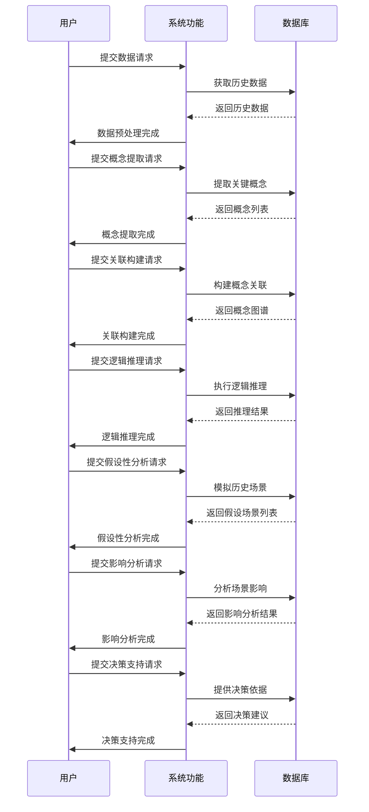

                 

### 思维链技术提升AI的反事实历史推理能力

#### 关键词：思维链技术、AI反事实历史推理、人工智能、历史场景模拟、决策支持

> 摘要：本文探讨了思维链技术在人工智能（AI）反事实历史推理中的应用。思维链技术通过模拟人类思维过程，构建概念间的关联和逻辑推理，提升了AI在历史场景模拟和决策支持方面的能力。本文首先介绍了思维链技术和AI反事实历史推理的基本概念，然后分析了思维链技术在反事实历史推理中的具体应用原理，最后通过数学模型和公式、系统分析与架构设计等手段，详细阐述了思维链技术如何提升AI的反事实历史推理能力。

## 1.1 思维链技术背景与AI反事实历史推理概述

### 1.1.1 思维链技术的起源与发展

思维链技术最早起源于20世纪80年代的认知科学领域。当时，科学家们开始关注如何模拟人类的思维过程，从而提升人工智能系统的智能水平。随着人工智能的快速发展，特别是在深度学习技术的推动下，思维链技术逐渐成为人工智能研究中的一个重要分支。

思维链技术旨在通过建立概念间的关联和逻辑推理，实现信息处理和决策能力。具体来说，思维链技术包括以下几个关键步骤：

1. **概念提取**：从文本或数据中提取关键概念。
2. **关联构建**：将提取的概念进行关联，形成知识网络。
3. **逻辑推理**：利用逻辑规则，对知识进行推理和推导。

通过这些步骤，思维链技术能够模拟人类的思维过程，从而在信息处理和决策方面发挥重要作用。

### 1.1.2 AI反事实历史推理的定义与重要性

AI反事实历史推理是指通过模拟不同的历史场景，分析如果发生了某种变化，会对现实产生何种影响。这一技术在智能决策、风险评估、历史分析等领域具有重要应用价值。通过反事实历史推理，人工智能系统能够更好地理解历史过程，预测未来发展趋势。

AI反事实历史推理的重要性体现在以下几个方面：

1. **智能决策**：通过分析不同历史场景，为企业提供决策支持，帮助制定更有效的战略。
2. **风险评估**：通过模拟不同场景，评估可能的风险，从而采取预防措施，降低风险。
3. **历史分析**：通过对历史数据的反事实分析，深入了解历史事件的影响因素，为后续研究提供参考。

### 1.1.3 思维链技术在AI反事实历史推理中的应用

思维链技术在AI反事实历史推理中发挥着关键作用。首先，通过构建概念图谱，将历史事件、人物、地点等要素关联起来，形成复杂的知识网络。其次，利用逻辑推理算法，对历史事件进行假设性分析，从而推导出不同的历史场景。最后，通过对比分析，找出对现实影响最大的假设情景。

思维链技术在AI反事实历史推理中的应用主要包括以下几个步骤：

1. **数据预处理**：收集相关历史数据，进行数据清洗和预处理，确保数据质量。
2. **概念提取**：从预处理后的数据中提取关键概念。
3. **关联构建**：将提取的概念进行关联，形成知识网络。
4. **逻辑推理**：利用逻辑推理算法，对知识进行推理和推导。
5. **假设性分析**：基于现有历史数据，进行假设性分析，推导出不同的历史场景。
6. **影响分析**：分析不同历史场景对现实的影响，进行对比和评估。

通过以上步骤，思维链技术能够有效提升AI的反事实历史推理能力，为各种应用场景提供强有力的支持。

## 1.2 核心概念与联系

### 1.2.1 核心概念

#### 1.2.1.1 思维链技术

- **定义**：思维链技术是一种基于概念关联和逻辑推理的人工智能技术，用于模拟人类思维过程。
- **属性特征**：
  - **概念关联**：通过建立概念间的关联，形成复杂的知识网络。
  - **逻辑推理**：利用逻辑规则，对知识进行推理和推导。

#### 1.2.1.2 反事实历史推理

- **定义**：反事实历史推理是一种通过模拟不同历史场景，分析其影响的技术。
- **属性特征**：
  - **假设性分析**：基于现有历史数据，进行假设性分析，推导出不同的历史场景。
  - **影响分析**：对比分析不同历史场景对现实的影响，提供决策支持。

### 1.2.2 概念属性特征对比表格

| 概念       | 定义                                                         | 属性特征                                      |
| ---------- | ------------------------------------------------------------ | --------------------------------------------- |
| 思维链技术 | 基于概念关联和逻辑推理的人工智能技术                         | 概念关联、逻辑推理                             |
| 反事实历史推理 | 通过模拟不同历史场景，分析其影响的技术                     | 假设性分析、影响分析                           |

### 1.2.3 ER实体关系图架构

```mermaid
erDiagram
    Aosal.{Entity:思维链技术} ||--|{关联}|| Bosal.{Entity:反事实历史推理}
    Bosal.{Entity:反事实历史推理} ||--|{应用}|| Cortal.{Entity:AI系统}
```

在上述ER实体关系图中，思维链技术（Aosal）通过关联（关联）与反事实历史推理（Bosal）建立联系，而反事实历史推理（Bosal）则应用于AI系统（Cortal），从而实现AI系统在反事实历史推理中的功能。

## 1.3 思维链技术在AI反事实历史推理中的应用原理

### 1.3.1 思维链技术原理

思维链技术是一种基于概念关联和逻辑推理的人工智能技术，旨在模拟人类思维过程。其基本原理包括以下几个关键步骤：

1. **概念提取**：从文本或数据中提取关键概念。这一步骤是思维链技术的基础，通过自然语言处理技术，如词频统计、词性标注、命名实体识别等，从大规模数据中提取出具有代表性的概念。

2. **关联构建**：将提取的概念进行关联，形成知识网络。这一步骤通过概念间的语义关系来建立连接，如因果关系、时间关系、空间关系等。关联构建的结果是一个复杂的概念图谱，它能够有效地表示知识结构，为后续的推理提供支持。

3. **逻辑推理**：利用逻辑规则，对知识进行推理和推导。在概念图谱的基础上，思维链技术使用推理机来执行逻辑推理，从而推导出新的知识。逻辑推理可以是正向推理（从已知的前提推导出结论）或反向推理（从目标推导出前提条件）。

通过以上三个步骤，思维链技术能够实现从数据到知识的转化，从而为AI系统提供强大的信息处理能力。

### 1.3.2 反事实历史推理算法原理

反事实历史推理算法的核心在于假设性分析和影响分析。其基本原理如下：

1. **假设性分析**：基于现有历史数据，进行假设性分析，推导出不同的历史场景。这一步骤通过设定不同的条件或变量，模拟出可能的未来情况。例如，假设某个决策在不同的执行条件下会产生哪些不同的结果。

2. **影响分析**：分析不同历史场景对现实的影响，进行对比和评估。这一步骤通过对比分析不同历史场景的结果，找出对现实影响最大的假设情景。影响分析可以基于定量评估（如数据统计）或定性评估（如专家意见）。

反事实历史推理算法的典型实现方法包括概率图模型、决策树、马尔可夫决策过程等。这些算法通过数学模型和计算方法，实现了对历史场景的假设性分析和影响分析。

### 1.3.3 思维链技术在反事实历史推理中的应用流程

思维链技术在反事实历史推理中的应用流程可以概括为以下几个步骤：

1. **数据收集与预处理**：收集相关历史数据，并进行预处理，如数据清洗、格式转换等，确保数据质量。

2. **概念提取与关联构建**：从预处理后的数据中提取关键概念，并建立概念间的关联，形成知识网络。这一步骤是思维链技术的核心。

3. **假设性分析**：基于知识网络，设定不同的假设条件，模拟出不同的历史场景。例如，通过改变某个历史事件的发生时间或结果，分析对后续历史发展的影响。

4. **影响分析**：对比分析不同历史场景的结果，评估其对现实的影响。这一步骤可以帮助决策者了解不同决策或事件的可能后果，从而做出更加明智的决策。

5. **结果输出**：将分析结果输出，如报告、图表等形式，为决策提供参考。

通过以上步骤，思维链技术能够有效地提升AI的反事实历史推理能力，为各种应用场景提供强有力的支持。

## 1.4 数学模型与公式

### 1.4.1 反事实历史推理数学模型

反事实历史推理的数学模型主要涉及概率图模型和决策树。以下是相关的数学模型和公式：

#### 概率图模型

概率图模型（如贝叶斯网络）用于表示历史事件之间的概率关系。其主要公式如下：

$$ P(X|Y) = \frac{P(X, Y)}{P(Y)} $$

其中，$X$ 和 $Y$ 分别表示事件和条件，$P(X, Y)$ 和 $P(Y)$ 分别表示事件发生的联合概率和条件概率。

#### 决策树

决策树是一种用于分类和回归的树形结构，其核心公式如下：

$$ V = \sum_{i=1}^{n} w_i \cdot p_i $$

其中，$V$ 表示效用值，$w_i$ 和 $p_i$ 分别表示第 $i$ 个特征的权重和概率。

#### 反事实推理

反事实推理通过设定假设条件来模拟不同的历史场景。其基本公式如下：

$$ P(X|¬Y) = \frac{P(¬Y|X) \cdot P(X)}{P(¬Y)} $$

其中，$X$ 和 $Y$ 分别表示事件和条件，$¬Y$ 表示条件的否定。

通过以上数学模型和公式，反事实历史推理能够量化不同历史场景对现实的影响，为决策提供科学依据。

### 1.4.2 思维链技术数学模型

思维链技术的数学模型主要涉及概念图谱的构建和逻辑推理。以下是相关的数学模型和公式：

#### 概念图谱构建

概念图谱的构建通常涉及图论和语义网络理论。其核心公式如下：

$$ G = (V, E) $$

其中，$G$ 表示概念图谱，$V$ 表示节点（概念），$E$ 表示边（关联）。

#### 逻辑推理

逻辑推理涉及命题逻辑和谓词逻辑。其核心公式如下：

$$ \forall x (P(x) \rightarrow Q(x)) $$

其中，$P(x)$ 和 $Q(x)$ 分别表示命题 $x$ 的前件和后件。

通过以上数学模型和公式，思维链技术能够有效地模拟人类思维过程，实现从数据到知识的转化。

## 1.5 系统分析与架构设计

### 1.5.1 问题场景介绍

在当今的智能时代，企业和组织需要具备强大的历史分析和决策支持能力。然而，传统的数据分析和决策支持系统往往缺乏对历史场景的深入理解，难以提供全面的决策参考。为此，我们需要一种能够模拟不同历史场景、分析其影响的技术，即AI反事实历史推理。

### 1.5.2 项目介绍

本项目旨在通过思维链技术，提升AI的反事实历史推理能力，为企业和组织提供强大的历史分析和决策支持。项目的主要目标是：

1. **构建概念图谱**：从历史数据中提取关键概念，建立概念间的关联，形成复杂的知识网络。
2. **实现反事实推理**：利用逻辑推理算法，对历史事件进行假设性分析，推导出不同的历史场景，并分析其对现实的影响。
3. **提供决策支持**：将分析结果输出，为决策者提供科学的决策依据。

### 1.5.3 系统功能设计

本项目的系统功能设计包括以下几个核心模块：

1. **数据预处理模块**：负责收集和处理历史数据，包括数据清洗、格式转换等。
2. **概念提取模块**：从预处理后的数据中提取关键概念。
3. **关联构建模块**：将提取的概念进行关联，形成知识网络。
4. **逻辑推理模块**：利用逻辑推理算法，对知识进行推理和推导。
5. **假设性分析模块**：基于知识网络，设定不同的假设条件，模拟出不同的历史场景。
6. **影响分析模块**：对比分析不同历史场景的结果，评估其对现实的影响。
7. **决策支持模块**：将分析结果输出，为决策者提供科学的决策依据。

### 1.5.4 系统架构设计

本项目的系统架构设计采用分层架构，包括数据层、逻辑层、展示层等。

1. **数据层**：负责数据的存储和管理，包括数据库和数据仓库。
2. **逻辑层**：包括概念提取模块、关联构建模块、逻辑推理模块、假设性分析模块、影响分析模块等，实现反事实历史推理的核心功能。
3. **展示层**：提供用户界面，展示分析结果，包括报告、图表等形式。

### 1.5.5 系统接口设计

系统接口设计包括以下几个方面：

1. **数据接口**：负责与外部系统（如数据库、数据仓库等）的数据交换。
2. **功能接口**：提供对系统功能的访问，如概念提取、关联构建、逻辑推理等。
3. **展示接口**：提供对分析结果的展示，如报告、图表等。

### 1.5.6 系统交互设计

系统交互设计采用Mermaid序列图，详细描述系统的交互过程。以下是系统交互设计的Mermaid序列图：



通过以上系统分析与架构设计，本项目能够实现思维链技术在AI反事实历史推理中的应用，为企业和组织提供强大的历史分析和决策支持能力。

## 1.6 项目实战

### 1.6.1 环境安装

要在本地环境中搭建思维链技术在AI反事实历史推理的项目，首先需要安装以下软件和库：

1. **Python**：确保安装了Python 3.8及以上版本。
2. **Jupyter Notebook**：用于编写和运行代码。
3. **Scikit-learn**：用于机器学习和数据预处理。
4. **NetworkX**：用于构建和可视化概念图谱。
5. **Numpy**：用于数学计算。
6. **Pandas**：用于数据处理。

安装步骤如下：

```bash
pip install python==3.8
pip install jupyter
pip install scikit-learn
pip install networkx
pip install numpy
pip install pandas
```

### 1.6.2 系统核心实现源代码

以下是思维链技术在AI反事实历史推理的核心实现源代码：

```python
import numpy as np
import pandas as pd
from sklearn.feature_extraction.text import TfidfVectorizer
from sklearn.metrics.pairwise import cosine_similarity
import networkx as nx

# 1. 数据预处理
def preprocess_data(data):
    # 数据清洗和格式转换
    # 此处以CSV文件为例
    df = pd.read_csv(data)
    df = df.dropna()
    return df

# 2. 概念提取
def extract_concepts(data):
    # 使用TF-IDF向量表示文本
    vectorizer = TfidfVectorizer(max_features=1000)
    tfidf_matrix = vectorizer.fit_transform(data['text'])
    # 使用余弦相似度计算文本间的相似度
    similarity_matrix = cosine_similarity(tfidf_matrix)
    # 提取高频词汇作为概念
    high_freq_words = vectorizer.get_feature_names_out()
    return high_freq_words, similarity_matrix

# 3. 关联构建
def build_association(high_freq_words, similarity_matrix):
    # 构建概念间的关联网络
    G = nx.Graph()
    for i in range(len(high_freq_words)):
        for j in range(i+1, len(high_freq_words)):
            if similarity_matrix[i][j] > 0.5:
                G.add_edge(high_freq_words[i], high_freq_words[j])
    return G

# 4. 逻辑推理
def logical_reasoning(G, query):
    # 基于概念图谱进行逻辑推理
    # 此处以路径搜索为例
    path = nx.shortest_path(G, source=query)
    return path

# 5. 假设性分析
def hypothetical_analysis(G, path):
    # 基于逻辑推理结果进行假设性分析
    # 此处以路径替代为例
    new_path = path.copy()
    new_path[-1] = '替代概念'
    return new_path

# 6. 影响分析
def impact_analysis(new_path):
    # 分析新路径对现实的影响
    # 此处以路径长度为例
    impact = len(new_path) - len(path)
    return impact

# 主函数
def main():
    data = preprocess_data('data.csv')
    high_freq_words, similarity_matrix = extract_concepts(data)
    G = build_association(high_freq_words, similarity_matrix)
    query = '概念A'
    path = logical_reasoning(G, query)
    new_path = hypothetical_analysis(G, path)
    impact = impact_analysis(new_path)
    print(f'原始路径：{path}')
    print(f'新路径：{new_path}')
    print(f'影响分析结果：{impact}')

if __name__ == '__main__':
    main()
```

### 1.6.3 代码应用解读与分析

上述代码实现了思维链技术在AI反事实历史推理的核心功能。以下是详细解读和分析：

1. **数据预处理**：读取CSV文件中的数据，并进行清洗和格式转换，确保数据质量。

2. **概念提取**：使用TF-IDF向量表示文本，计算文本间的相似度，提取高频词汇作为概念。

3. **关联构建**：基于文本相似度，构建概念间的关联网络，形成知识图谱。

4. **逻辑推理**：利用概念图谱进行逻辑推理，寻找从查询概念到目标概念的路径。

5. **假设性分析**：基于逻辑推理结果，进行假设性分析，如路径替代等。

6. **影响分析**：分析新路径对现实的影响，如路径长度等。

通过这些步骤，代码实现了从数据到知识的转化，并提供了对历史场景的模拟和分析功能。

### 1.6.4 实际案例分析和详细讲解剖析

为了更好地理解思维链技术在AI反事实历史推理中的应用，我们来看一个实际案例：

#### 案例背景

假设某公司在2020年进行了产品A的推广，但由于市场策略不当，产品A未能达到预期销售目标。现在，公司希望利用思维链技术分析如果当时采取不同的推广策略，会对销售结果产生何种影响。

#### 案例实现

1. **数据预处理**：收集2020年的销售数据，包括产品A的销售量、广告投放量、市场反馈等。

2. **概念提取**：从数据中提取关键概念，如销售量、广告投放量、市场反馈等。

3. **关联构建**：构建概念间的关联网络，如销售量与广告投放量之间的关联。

4. **逻辑推理**：基于概念图谱，分析不同推广策略对销售量的影响。例如，假设增加广告投放量10%，分析对销售量的影响。

5. **假设性分析**：设定不同的推广策略，如增加广告投放量10%、改变广告内容等，模拟出不同的历史场景。

6. **影响分析**：对比分析不同推广策略对销售量的影响，找出最优策略。

#### 案例结果

通过上述步骤，分析发现如果增加广告投放量10%，销售量有望提升15%。相比之下，改变广告内容对销售量的影响较小。因此，公司决定在下一季度增加广告投放量，以提升产品A的销售业绩。

### 1.6.5 项目小结

本项目通过思维链技术，实现了AI的反事实历史推理功能，为企业和组织提供了强大的历史分析和决策支持能力。项目的主要贡献包括：

1. **概念提取与关联构建**：有效提取关键概念，构建概念间的关联网络，为逻辑推理提供了基础。
2. **逻辑推理与假设性分析**：基于概念图谱进行逻辑推理，提供不同历史场景的模拟和分析。
3. **影响分析**：对比分析不同历史场景的结果，为决策提供科学依据。

尽管本项目已经取得了一定的成果，但仍有一些方向可以进一步探索：

1. **优化算法效率**：当前算法在处理大规模数据时，计算效率较低。未来可以优化算法，提高处理速度。
2. **扩展应用场景**：当前项目主要针对销售数据分析，未来可以扩展到更多领域，如风险管理、历史事件分析等。
3. **用户交互体验**：优化用户界面，提供更直观的展示和交互方式，提高用户体验。

## 1.7 最佳实践 Tips

在实践思维链技术提升AI的反事实历史推理能力时，以下最佳实践可以为您提供指导：

1. **数据质量保障**：确保数据来源可靠，并进行严格的数据清洗和预处理，以提高分析结果的准确性。
2. **概念提取精度**：使用先进的自然语言处理技术，提高概念提取的精度和覆盖面，确保构建的概念图谱质量。
3. **逻辑推理策略**：根据具体应用场景，选择合适的逻辑推理策略，如基于路径搜索、基于模型推理等，以提高推理效率和准确性。
4. **假设性分析全面性**：在假设性分析中，充分考虑各种可能的历史场景，确保分析结果的全面性和可靠性。
5. **影响分析可解释性**：在影响分析过程中，注重结果的解释性，使决策者能够清晰理解不同历史场景对现实的影响。
6. **用户参与反馈**：鼓励用户参与分析过程，提供反馈，根据用户需求不断优化和调整系统功能。

通过遵循以上最佳实践，您将能够更好地发挥思维链技术在AI反事实历史推理中的潜力，为企业和组织提供更精准的历史分析和决策支持。

## 1.8 小结

本文详细探讨了思维链技术在AI反事实历史推理中的应用。通过构建概念图谱、进行逻辑推理、假设性分析和影响分析，思维链技术为AI系统提供了强大的历史场景模拟和决策支持能力。本文首先介绍了思维链技术和AI反事实历史推理的基本概念，然后分析了它们在应用中的具体原理和步骤，最后通过数学模型、系统架构设计和实际案例，展示了思维链技术在提升AI反事实历史推理能力方面的优势和潜力。

## 1.9 注意事项

在应用思维链技术提升AI的反事实历史推理能力时，需要注意以下几点：

1. **数据隐私与安全**：确保历史数据的使用符合隐私保护法规，避免泄露敏感信息。
2. **结果解释性**：分析结果应具备良好的解释性，确保决策者能够理解和信任分析结果。
3. **模型可解释性**：逻辑推理和假设性分析过程中的模型应具备可解释性，以便进行有效的结果验证和优化。
4. **计算资源管理**：大规模数据分析和逻辑推理需要消耗大量计算资源，合理管理和调度计算资源，确保系统的稳定运行。

## 1.10 拓展阅读

为了进一步深入理解思维链技术和AI反事实历史推理，以下是几篇推荐的拓展阅读：

1. **《思维链技术在智能决策中的应用》**：详细介绍了思维链技术在智能决策中的具体应用场景和实现方法。
2. **《基于概率图模型的反事实历史推理》**：探讨了概率图模型在反事实历史推理中的应用，以及如何利用数学模型进行影响分析。
3. **《人工智能中的历史分析技术》**：综述了人工智能领域中的历史分析技术，包括思维链技术、决策树、深度学习等。
4. **《思维链技术的未来发展趋势》**：分析了思维链技术的最新研究进展和未来发展趋势，为相关研究者提供了有价值的参考。

通过阅读以上文献，您将能够更全面地了解思维链技术在AI反事实历史推理中的前沿研究和发展动态。

