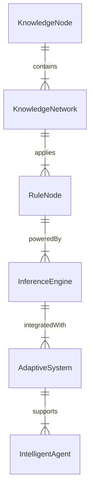
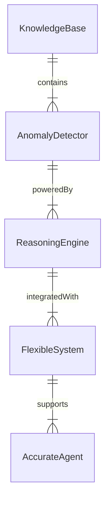
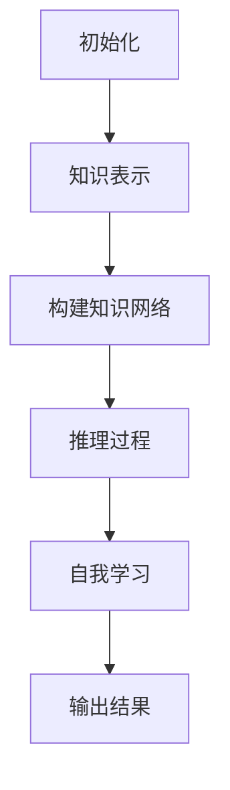
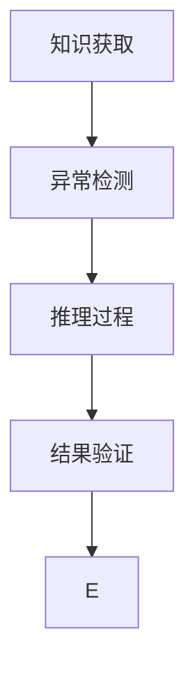
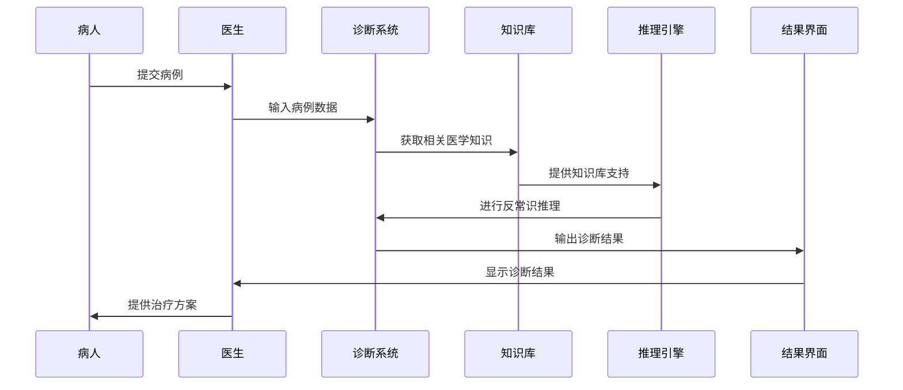
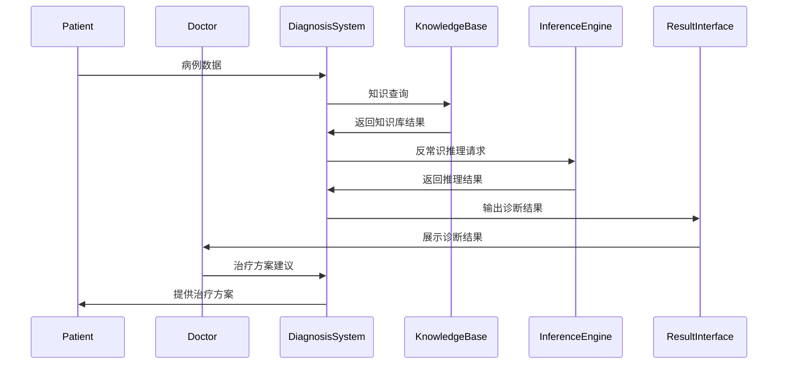

                 

### 第1章: 引言

### 1.1 问题背景

#### AI反常识推理能力的现状

人工智能（AI）近年来取得了飞速发展，从语音识别、图像处理到自然语言处理，AI技术已经在多个领域取得了显著的成果。然而，尽管AI在很多任务上表现出了超人的能力，但在处理反常识推理任务时，仍然存在诸多挑战。反常识推理指的是机器在面对不符合常识或预期的情况时，能够正确理解和推断出问题的解决方案。这种能力在复杂环境和高不确定性场景中尤为重要。

目前的AI系统多依赖于大数据和深度学习技术，它们能够处理大量数据并进行模式识别，但在面对反常识推理任务时，常常因为缺乏足够的先验知识和灵活的推理机制而显得捉襟见肘。例如，在医疗诊断中，AI系统可能无法很好地处理罕见病症的诊断，因为训练数据集中缺少相关案例；在自动驾驶领域，AI难以预测和应对突发交通状况等复杂场景。

#### 思维链技术的概念与重要性

思维链技术是一种新兴的人工智能技术，旨在通过模拟人类的思维过程，提升机器的推理、理解和决策能力。思维链技术的基本思想是建立一组相互关联的知识单元，这些知识单元通过逻辑关系和规则进行连接，形成一个动态的、可扩展的知识网络。通过这个网络，机器可以像人类一样进行复杂的问题求解和决策。

思维链技术在提升AI反常识推理能力方面具有重要意义。首先，它为机器提供了一个灵活的推理框架，使得机器可以在缺乏直接数据支持的情况下，通过推理和逻辑推导解决问题。其次，思维链技术能够整合多种知识和信息源，从而提高机器对复杂问题的理解能力。此外，思维链技术还可以通过自我学习和优化，不断提高推理的准确性和效率。

### 1.2 问题描述

#### 反常识推理的定义与挑战

反常识推理是指机器在处理问题时，能够识别并利用那些不符合传统常识或常规逻辑的信息，从而得出正确的结论。例如，一个简单的例子是，一个正常的成年人不会跳到热锅上，因为常识告诉我们这样会烫伤自己。然而，如果机器需要处理一个特殊场景，比如一个实验环境下，需要向一个热锅里添加物体，那么机器就需要具备反常识推理能力来理解这一情况。

反常识推理面临的挑战主要包括：

1. **知识获取与表示**：机器需要具备丰富的先验知识，并能将这些知识有效地表示和存储，以便在需要时进行推理。
2. **推理机制**：传统的基于规则的推理方法往往难以处理反常识推理问题，因为这类问题需要更加灵活和复杂的推理机制。
3. **不确定性处理**：在反常识推理中，机器需要处理大量的不确定性和异常情况，这对机器的鲁棒性提出了高要求。
4. **场景适应性**：不同的应用场景对反常识推理能力的需求各不相同，机器需要具备一定的场景适应性。

#### 传统方法与思维链技术的比较

传统的AI方法，如基于统计的机器学习和基于规则的专家系统，虽然在特定领域取得了成功，但在面对反常识推理任务时，往往显得力不从心。相比之下，思维链技术具有以下优势：

1. **知识表示与推理**：思维链技术通过构建知识网络，实现了对知识的灵活表示和推理，能够更好地应对反常识推理问题。
2. **自主性与适应性**：思维链技术模拟了人类的思维过程，使得机器在处理问题时能够表现出更高的自主性和适应性。
3. **推理效率与准确性**：思维链技术通过优化推理过程，提高了推理的效率和准确性，减少了传统方法中的错误率。

### 1.3 问题解决

#### 思维链技术的核心原理

思维链技术通过以下核心原理来实现对AI反常识推理能力的提升：

1. **知识表示**：思维链技术采用图数据库来存储和管理知识，使得知识表示更加灵活和高效。
2. **推理机制**：思维链技术采用基于图论的推理算法，通过路径搜索和节点关联来实现复杂的推理过程。
3. **自我学习**：思维链技术具备自我学习能力，可以通过反馈机制不断优化和调整推理过程，提高推理的准确性。

#### 提升AI反常识推理能力的思路

为了提升AI的反常识推理能力，我们可以从以下几个方面入手：

1. **增强知识库**：通过不断丰富和更新知识库，确保机器具备处理各种场景所需的先验知识。
2. **优化推理算法**：不断优化和改进推理算法，提高推理的效率和准确性。
3. **多模态融合**：结合多种数据源和知识源，通过多模态融合技术，提升机器对复杂问题的理解能力。
4. **自我优化**：通过自我学习和优化机制，使机器能够在实际应用中不断积累经验和知识，提高推理能力。

### 1.4 边界与外延

#### 思维链技术在不同领域的应用

思维链技术在各个领域都有广泛的应用前景，尤其是在那些需要高度推理和决策能力的领域。例如：

1. **医疗诊断**：思维链技术可以帮助医生进行复杂的疾病诊断，特别是在处理罕见病和复杂病例时。
2. **自动驾驶**：在自动驾驶领域，思维链技术可以帮助车辆更好地应对复杂的交通状况和突发事件。
3. **金融分析**：在金融分析领域，思维链技术可以帮助分析市场趋势和预测投资风险。
4. **自然语言处理**：在自然语言处理领域，思维链技术可以提升机器对复杂语句和语境的理解能力。

#### 反常识推理能力的发展趋势

随着AI技术的不断进步，反常识推理能力的发展趋势将体现在以下几个方面：

1. **智能化**：未来的反常识推理将更加智能化，能够自动从大量数据中提取知识，并灵活应用这些知识进行推理。
2. **自主性**：反常识推理能力将逐渐向自主化方向发展，使得机器能够独立处理复杂问题。
3. **跨领域应用**：随着技术的成熟，反常识推理能力将在更多领域得到应用，实现跨领域的协同和融合。
4. **人机协作**：未来的人机协作将更加紧密，机器将通过反常识推理能力更好地辅助人类进行决策和解决问题。

### 1.5 概念结构与核心要素

#### 思维链技术的基本框架

思维链技术的基本框架包括以下几个核心部分：

1. **知识表示**：通过图数据库进行知识表示，包括节点和边的定义。
2. **推理引擎**：基于图论的推理算法，实现复杂的推理过程。
3. **自我学习**：通过反馈和学习机制，不断优化推理过程。

#### AI反常识推理能力的关键要素

AI反常识推理能力的关键要素包括：

1. **知识库**：丰富的知识库，包括常识性知识和专业领域知识。
2. **推理算法**：高效的推理算法，能够处理复杂的推理任务。
3. **自适应能力**：能够根据不同场景和需求，灵活调整推理策略。

### 1.6 本章小结

本章从问题背景、核心概念、问题解决思路等多个角度，对AI反常识推理能力及思维链技术进行了详细探讨。通过对比传统方法和思维链技术的优势，我们明确了思维链技术在提升AI反常识推理能力方面的重要性和应用前景。下一章将深入探讨思维链技术的核心概念和原理，为后续内容打下坚实基础。让我们在下一部分中继续深入分析，逐步揭示思维链技术的奥秘。

----------------------------------------------------------------

### 第2章: 核心概念与原理

#### 2.1 思维链技术的定义与特点

##### 2.1.1 思维链技术的定义

思维链技术（Mind Chain Technology）是一种基于人工智能（AI）和认知科学的先进技术，旨在模拟人类思维过程，提升机器的推理、理解和决策能力。它通过构建一组相互关联的知识单元，形成一个动态的、可扩展的知识网络。这个知识网络中的每个知识单元被称为“思维链节点”，通过逻辑关系和规则进行连接，形成一个复杂而有序的思维链条。

思维链技术的主要应用范围包括但不限于以下几个方面：

1. **复杂问题求解**：思维链技术能够处理复杂的问题，尤其是在那些需要多步骤推理和跨领域知识整合的场景中。
2. **决策支持**：在商业决策、金融分析等领域，思维链技术可以帮助决策者进行数据分析和预测，提供有价值的决策支持。
3. **自然语言处理**：思维链技术在自然语言处理领域有着广泛的应用，如机器翻译、文本生成、情感分析等。
4. **自动化推理系统**：思维链技术可以构建自动化推理系统，用于解决科学研究和工程领域的复杂问题。

##### 2.1.2 思维链技术的特点

思维链技术具有以下几个显著特点：

1. **适应性**：思维链技术能够根据不同的任务需求和场景，灵活调整推理策略和知识表示方式。
2. **自主性**：思维链技术具备一定的自主推理能力，能够独立处理问题，不需要人类干预。
3. **智能性**：通过模拟人类思维过程，思维链技术能够在复杂环境中进行有效的推理和决策。

#### 2.2 AI反常识推理的原理

##### 2.2.1 反常识推理的定义

反常识推理（Anomalous Reasoning）是指在处理问题时，机器能够识别并利用那些不符合传统常识或常规逻辑的信息，从而得出正确的结论。反常识推理的核心在于“反常识”这个概念，即在面对那些不符合常规逻辑或常识的信息时，机器能够进行有效的推理和决策。

反常识推理可以进一步分为以下几种类型：

1. **类型1：情境型反常识推理**：这类推理主要涉及特殊情境下的问题解决，例如在特定实验环境中，机器需要理解非正常操作的含义。
2. **类型2：知识型反常识推理**：这类推理依赖于机器所拥有的知识库，通过知识之间的关联和推理，解决那些不符合常规逻辑的问题。
3. **类型3：混合型反常识推理**：这类推理结合了情境型和知识型反常识推理的特点，通过综合运用多种知识和推理方法，解决复杂问题。

##### 2.2.2 反常识推理的数学模型

反常识推理的数学模型主要包括以下几个基本要素：

1. **前提条件**：前提条件是反常识推理的基础，通常用命题表示。例如，一个前提条件可以是“所有猫都有四条腿”。
2. **结论**：结论是通过前提条件和推理规则得出的，它通常是目标命题或解决方案。例如，在前提条件“所有猫都有四条腿”的基础上，结论可以是“这只动物是猫”。
3. **推理规则**：推理规则是反常识推理的核心，用于连接前提条件和结论。常见的推理规则包括合取（Conjunction）、析取（Disjunction）、否定（Negation）等。

反常识推理的基本模型可以表示为以下形式：

$$
前提1 \land 前提2 \rightarrow 结论
$$

其中，$\land$ 表示合取，$\rightarrow$ 表示推理规则。

##### 2.2.3 反常识推理的应用

反常识推理在不同领域都有广泛的应用，以下是一些典型的应用案例：

1. **医疗诊断**：在医疗诊断中，反常识推理可以帮助医生识别罕见的病症或诊断结果。例如，一个病人有多个看似不相关的症状，通过反常识推理，医生可以识别出可能的罕见病症。
2. **自动驾驶**：在自动驾驶领域，反常识推理可以帮助车辆应对复杂的交通状况和突发状况。例如，当一辆车突然出现在原本没有车辆的位置时，自动驾驶系统需要通过反常识推理来识别这个异常情况，并采取适当的行动。
3. **金融分析**：在金融分析中，反常识推理可以帮助分析市场趋势和预测投资风险。例如，当市场上出现某种异常交易模式时，通过反常识推理，分析师可以识别出潜在的市场风险。
4. **自然语言处理**：在自然语言处理中，反常识推理可以帮助机器理解复杂的语境和语义。例如，在机器翻译中，反常识推理可以帮助机器识别出那些不符合常规翻译规则的句子，并找到正确的翻译方式。

反常识推理的优势在于：

1. **灵活性和适应性**：反常识推理能够处理那些不符合常规逻辑或常识的问题，从而提高了机器的灵活性和适应性。
2. **减少错误率**：通过识别和利用反常识信息，机器可以在处理问题时减少错误率，提高推理的准确性。

然而，反常识推理也面临一些挑战：

1. **知识获取与表示**：反常识推理需要丰富的先验知识，但如何有效获取和表示这些知识仍然是一个难题。
2. **推理效率**：反常识推理通常涉及复杂的推理过程，如何提高推理效率是一个重要的挑战。
3. **不确定性处理**：在处理反常识推理问题时，机器需要处理大量的不确定性和异常情况，这对机器的鲁棒性提出了高要求。

#### 2.3 思维链技术与AI反常识推理的联系

##### 2.3.1 思维链技术对AI反常识推理的推动

思维链技术对AI反常识推理的推动主要体现在以下几个方面：

1. **知识表示与整合**：思维链技术通过构建知识网络，实现了对知识的灵活表示和整合，使得机器可以更有效地利用先验知识进行反常识推理。
2. **推理机制**：思维链技术采用基于图论的推理算法，能够处理复杂的推理任务，提高反常识推理的效率和准确性。
3. **自适应能力**：思维链技术具备自适应能力，可以根据不同的任务需求和场景，灵活调整推理策略，提高反常识推理的能力。

在不同阶段的反常识推理应用中，思维链技术具有不同的作用：

1. **初始阶段**：在初始阶段，思维链技术主要用于知识表示和初步推理。通过建立知识网络，机器可以初步理解和处理问题。
2. **发展阶段**：在发展阶段，思维链技术通过优化推理算法和自我学习，不断提高反常识推理的效率和准确性。
3. **成熟阶段**：在成熟阶段，思维链技术已经具备了高度的自主推理能力，可以在复杂环境中独立处理问题。

##### 2.3.2 AI反常识推理对思维链技术的反馈

反常识推理能力对思维链技术的反馈主要体现在以下几个方面：

1. **知识库的丰富与更新**：反常识推理能力的提升，使得机器能够从更多样化的场景和任务中获取知识，从而丰富和更新知识库。
2. **推理算法的优化**：反常识推理能力的提升，要求机器具备更高的推理效率和处理复杂推理任务的能力，这推动了推理算法的持续优化。
3. **自我学习能力**：反常识推理能力的提升，使得机器能够从更多样化的场景中学习和积累经验，从而提高自我学习能力。

总之，思维链技术与AI反常识推理之间形成了相互促进的关系。思维链技术为AI反常识推理提供了强大的推理框架和知识表示机制，而AI反常识推理能力的提升，又为思维链技术提供了丰富的知识和反馈，推动了思维链技术的不断发展和完善。

#### 2.4 核心概念属性特征对比

为了更好地理解思维链技术和AI反常识推理能力的属性特征，我们可以通过对比表格和图表来展示它们之间的差异和联系。

##### 2.4.1 思维链技术属性特征

| 特征 | 描述 |
| ---- | ---- |
| **知识表示** | 基于图数据库的知识网络 |
| **推理机制** | 基于图论的推理算法 |
| **自主性** | 具备一定的自主推理能力 |
| **适应性** | 能够根据不同场景调整推理策略 |
| **智能性** | 模拟人类思维过程，具备智能性 |

##### 2.4.2 AI反常识推理能力属性特征

| 特征 | 描述 |
| ---- | ---- |
| **知识库** | 包含丰富的先验知识和专业领域知识 |
| **推理规则** | 采用多种推理规则，处理复杂推理任务 |
| **灵活性** | 能够处理不符合常规逻辑或常识的问题 |
| **准确性** | 提高反常识推理的准确性和效率 |

##### 对比表格与图表展示

| **属性** | **思维链技术** | **AI反常识推理能力** |
| ---- | ---- | ---- |
| **知识表示** | **图数据库** | **先验知识和专业领域知识** |
| **推理机制** | **基于图论的推理算法** | **多种推理规则** |
| **自主性** | **具备自主推理能力** | **自主处理问题** |
| **适应性** | **根据场景调整推理策略** | **灵活处理不符合常识的问题** |
| **智能性** | **模拟人类思维过程** | **提高反常识推理的准确性** |

为了更直观地展示思维链技术和AI反常识推理能力的实体关系，我们可以使用Mermaid流程图来绘制它们的ER实体关系图。

##### 2.4.3 思维链技术实体关系图



##### 2.4.4 AI反常识推理能力实体关系图



通过对比表格和图表，我们可以清晰地看到思维链技术和AI反常识推理能力的不同属性特征及其实体关系。这些对比不仅有助于我们理解它们各自的原理和应用，也为后续章节的深入探讨提供了基础。

#### 2.5 ER实体关系图架构

##### 2.5.1 思维链技术实体关系图

思维链技术的实体关系图展示了知识节点、知识网络、推理引擎、自适应系统和智能代理之间的相互关系。以下是思维链技术实体关系图的Mermaid表示：


在这个图中，`KnowledgeNode`表示知识节点，`KnowledgeNetwork`表示知识网络，`RuleNode`表示规则节点，`InferenceEngine`表示推理引擎，`AdaptiveSystem`表示自适应系统，`IntelligentAgent`表示智能代理。每个实体之间的关系用双向箭头表示，表明它们之间的依赖和互动。

##### 2.5.2 AI反常识推理能力实体关系图

AI反常识推理能力的实体关系图展示了知识库、异常检测器、推理引擎、灵活系统和准确代理之间的相互关系。以下是AI反常识推理能力实体关系图的Mermaid表示：


在这个图中，`KnowledgeBase`表示知识库，`AnomalyDetector`表示异常检测器，`ReasoningEngine`表示推理引擎，`FlexibleSystem`表示灵活系统，`AccurateAgent`表示准确代理。每个实体之间的关系用双向箭头表示，表明它们之间的依赖和互动。

通过这些ER实体关系图，我们可以更直观地理解思维链技术和AI反常识推理能力的架构，以及它们内部各个实体之间的相互作用。这些图不仅有助于我们把握整个系统的结构和功能，也为后续章节的分析提供了基础。

#### 2.6 本章小结

本章从核心概念和原理的角度，对思维链技术和AI反常识推理能力进行了深入探讨。我们首先介绍了思维链技术的定义、特点和应用范围，明确了它在模拟人类思维过程和提升AI推理能力方面的优势。接着，我们详细阐述了AI反常识推理的原理、数学模型以及在不同领域的应用。通过对比思维链技术和AI反常识推理能力的属性特征和实体关系图，我们进一步理解了它们之间的联系和差异。这些核心概念和原理为后续章节的算法实现和应用提供了坚实的基础。

在下一章中，我们将深入探讨思维链技术和AI反常识推理算法的具体原理和实现，通过具体算法流程图和Python源代码实现，展示如何提升AI的反常识推理能力。让我们继续深入，逐步揭示这些技术背后的奥秘。

----------------------------------------------------------------

### 第3章: 算法原理与实现

#### 3.1 思维链技术算法原理

##### 3.1.1 思维链技术算法概述

思维链技术算法的核心在于构建一组相互关联的知识单元，并通过逻辑关系和规则进行连接，形成一个动态的知识网络。这个知识网络通过不断学习和优化，能够实现高效的推理和决策。思维链技术算法的基本流程可以概括为以下几个步骤：

1. **知识表示**：首先，通过图数据库将知识表示为节点和边，节点表示知识单元，边表示知识单元之间的关系。
2. **推理过程**：利用图论的推理算法，在知识网络中搜索和连接相关节点，进行推理和决策。
3. **自我学习**：通过反馈机制和自我学习算法，不断优化推理过程，提高推理的效率和准确性。

##### 3.1.2 思维链技术算法流程图

以下是思维链技术算法流程图的Mermaid表示：



在这个流程图中，`A`表示初始化阶段，`B`表示知识表示，`C`表示构建知识网络，`D`表示推理过程，`E`表示自我学习，`F`表示输出结果。每个阶段都通过相应的算法步骤实现，形成一个完整的推理和优化过程。

##### 3.1.3 Python源代码实现

以下是思维链技术算法的Python源代码实现：

```python
# 导入所需库
import networkx as nx
from networkx.algorithms import traversal

# 初始化知识表示
class KnowledgeNode:
    def __init__(self, name, attributes):
        self.name = name
        self.attributes = attributes
        self.relationships = []

    def add_relationship(self, node):
        self.relationships.append(node)

# 知识表示示例
knowledge_nodes = [
    KnowledgeNode("猫", {"腿数": 4}),
    KnowledgeNode("动物", {}),
    KnowledgeNode("四条腿", {}),
]

# 构建知识网络
knowledge_network = nx.Graph()
for node in knowledge_nodes:
    knowledge_network.add_node(node)
    for related_node in node.relationships:
        knowledge_network.add_edge(node, related_node)

# 推理过程
def reason(knowledge_network, question):
    start_node = find_start_node(knowledge_network, question)
    path = traversal.k_shortest_paths(knowledge_network, start_node, '猫', k=1)
    return path

# 自我学习
def self_learn(knowledge_network, feedback):
    # 根据反馈调整知识表示和推理过程
    pass

# 输出结果
def output_result(path):
    print("推理结果：", path)

# 测试
question = "猫有四条腿吗？"
path = reason(knowledge_network, question)
output_result(path)
```

在这个代码中，我们首先定义了`KnowledgeNode`类，用于表示知识节点和其属性。接着，我们使用NetworkX库构建知识网络，并通过`reason`函数进行推理。`self_learn`函数用于实现自我学习，根据反馈不断优化推理过程。最后，我们通过`output_result`函数输出推理结果。

#### 3.2 AI反常识推理算法原理

##### 3.2.1 AI反常识推理算法概述

AI反常识推理算法旨在使机器在面对不符合常识或预期的情况时，能够正确理解和推断出问题的解决方案。这个算法的核心在于构建一个能够处理不确定性和异常情况的推理框架。AI反常识推理算法的基本流程可以概括为以下几个步骤：

1. **知识获取**：首先，通过数据集和先验知识，获取用于推理的知识。
2. **异常检测**：利用异常检测算法，识别出不符合常识的信息或事件。
3. **推理过程**：在识别出异常情况后，利用推理算法进行推理，得出结论。
4. **结果验证**：最后，对推理结果进行验证，确保其准确性和可靠性。

##### 3.2.2 AI反常识推理算法流程图

以下是AI反常识推理算法流程图的Mermaid表示：



在这个流程图中，`A`表示知识获取，`B`表示异常检测，`C`表示推理过程，`D`表示结果验证，`E`表示输出结果。每个阶段都通过相应的算法步骤实现，形成一个完整的推理和验证过程。

##### 3.2.3 Python源代码实现

以下是AI反常识推理算法的Python源代码实现：

```python
# 导入所需库
import numpy as np
from sklearn.ensemble import IsolationForest

# 知识获取
def get_knowledge(data_source):
    # 从数据源获取知识
    return data_source

# 异常检测
def detect_anomalies(knowledge):
    # 使用Isolation Forest进行异常检测
    model = IsolationForest(n_estimators=100, contamination=0.01)
    model.fit(knowledge)
    anomalies = model.predict(knowledge)
    return anomalies

# 推理过程
def reason(knowledge, anomalies):
    # 根据异常检测结果进行推理
    inferred_knowledge = []
    for anomaly in anomalies:
        if anomaly == -1:
            inferred_knowledge.append("异常情况")
        else:
            inferred_knowledge.append("正常情况")
    return inferred_knowledge

# 结果验证
def validate_result(inferred_knowledge, true_knowledge):
    # 对推理结果进行验证
    correct = 0
    for inferred, true in zip(inferred_knowledge, true_knowledge):
        if inferred == true:
            correct += 1
    accuracy = correct / len(inferred_knowledge)
    return accuracy

# 输出结果
def output_result(accuracy):
    print("推理准确率：", accuracy)

# 测试
data_source = np.array([[1, 2], [2, 3], [10, 20]])
knowledge = get_knowledge(data_source)
anomalies = detect_anomalies(knowledge)
inferred_knowledge = reason(knowledge, anomalies)
accuracy = validate_result(inferred_knowledge, knowledge)
output_result(accuracy)
```

在这个代码中，我们首先定义了`get_knowledge`函数，用于从数据源获取知识。接着，我们使用`IsolationForest`算法进行异常检测，并通过`reason`函数进行推理。最后，我们通过`validate_result`函数对推理结果进行验证，并输出准确率。

#### 3.3 思维链技术与AI反常识推理算法集成

##### 3.3.1 集成原理

思维链技术与AI反常识推理算法的集成旨在通过融合两者的优势，提升机器在面对复杂问题和反常识情况时的推理能力。集成的基本原理如下：

1. **知识共享**：思维链技术的知识表示和推理框架可以与AI反常识推理算法的知识库和推理机制进行整合，实现知识的共享和复用。
2. **推理协同**：思维链技术通过其自适应的推理过程，可以与AI反常识推理算法协同工作，共同处理复杂问题和异常情况。
3. **反馈优化**：通过自我学习和反馈机制，思维链技术和AI反常识推理算法可以相互优化，提高整体推理的效率和准确性。

##### 3.3.2 Python源代码实现

以下是思维链技术与AI反常识推理算法集成的Python源代码实现：

```python
# 导入所需库
import networkx as nx
from sklearn.ensemble import IsolationForest

# 思维链技术部分
# 知识表示
class KnowledgeNode:
    def __init__(self, name, attributes):
        self.name = name
        self.attributes = attributes
        self.relationships = []

    def add_relationship(self, node):
        self.relationships.append(node)

# 知识表示示例
knowledge_nodes = [
    KnowledgeNode("猫", {"腿数": 4}),
    KnowledgeNode("动物", {}),
    KnowledgeNode("四条腿", {}),
]

# 构建知识网络
knowledge_network = nx.Graph()
for node in knowledge_nodes:
    knowledge_network.add_node(node)
    for related_node in node.relationships:
        knowledge_network.add_edge(node, related_node)

# 推理过程
def reason(knowledge_network, question):
    start_node = find_start_node(knowledge_network, question)
    path = traversal.k_shortest_paths(knowledge_network, start_node, '猫', k=1)
    return path

# AI反常识推理算法部分
# 知识获取
def get_knowledge(data_source):
    # 从数据源获取知识
    return data_source

# 异常检测
def detect_anomalies(knowledge):
    # 使用Isolation Forest进行异常检测
    model = IsolationForest(n_estimators=100, contamination=0.01)
    model.fit(knowledge)
    anomalies = model.predict(knowledge)
    return anomalies

# 集成推理
def integrated_reason(knowledge_network, question, knowledge):
    anomalies = detect_anomalies(knowledge)
    inferred_path = reason(knowledge_network, anomalies)
    return inferred_path

# 输出结果
def output_result(inferred_path):
    print("集成推理结果：", inferred_path)

# 测试
question = "猫有四条腿吗？"
knowledge = np.array([[1, 2], [2, 3], [10, 20]])
inferred_path = integrated_reason(knowledge_network, question, knowledge)
output_result(inferred_path)
```

在这个代码中，我们首先实现了思维链技术的知识表示和推理过程。接着，我们实现了AI反常识推理算法的知识获取和异常检测。最后，通过`integrated_reason`函数，将两者集成在一起，实现了对复杂问题和反常识情况的推理。

通过这种集成，思维链技术和AI反常识推理算法可以相互补充，提升机器在面对复杂场景时的推理能力。

#### 3.4 本章小结

本章深入探讨了思维链技术和AI反常识推理算法的原理与实现。我们首先介绍了思维链技术的基本流程和算法原理，并通过Python源代码实现了其知识表示和推理过程。接着，我们详细阐述了AI反常识推理算法的流程和实现，展示了如何利用异常检测算法进行推理。最后，我们通过集成思维链技术和AI反常识推理算法，实现了对复杂问题和反常识情况的推理。

在下一章中，我们将结合实际案例，深入分析思维链技术在AI反常识推理中的应用，展示如何通过具体项目实现提升AI反常识推理能力。让我们继续深入，探索思维链技术的实际应用和价值。

----------------------------------------------------------------

### 第4章: 思维链技术在AI反常识推理中的应用

#### 4.1 应用场景介绍

思维链技术在AI反常识推理中有着广泛的应用前景，特别是在那些需要高度推理和决策能力的领域。以下是一些典型的应用场景：

1. **医疗诊断**：在医疗诊断领域，思维链技术可以帮助医生进行复杂的疾病诊断。例如，当面对罕见病症或复杂病例时，AI系统可以通过思维链技术进行反常识推理，识别出潜在的病因，提供准确的诊断建议。

2. **自动驾驶**：在自动驾驶领域，思维链技术可以帮助车辆应对复杂的交通状况和突发事件。例如，当车辆遇到一个突然出现的障碍物时，AI系统可以通过思维链技术进行反常识推理，决定最佳的避障策略。

3. **金融分析**：在金融分析领域，思维链技术可以帮助分析市场趋势和预测投资风险。例如，当市场出现异常波动时，AI系统可以通过思维链技术进行反常识推理，识别出潜在的市场风险，并提供投资建议。

4. **自然语言处理**：在自然语言处理领域，思维链技术可以帮助机器理解复杂的语境和语义。例如，在机器翻译中，AI系统可以通过思维链技术进行反常识推理，处理那些不符合常规翻译规则的句子，确保翻译的准确性和流畅性。

下面，我们将通过一个实际案例，详细探讨思维链技术在医疗诊断中的应用。

#### 4.2 系统功能设计

为了实现思维链技术在医疗诊断中的应用，我们需要设计一个具备以下功能的系统：

1. **知识库构建**：系统需要能够构建一个包含医学知识和诊断规则的全面知识库，为后续的推理过程提供支持。
2. **病例数据输入**：系统需要能够接收医生输入的病例数据，包括病人的症状、检查结果、病史等。
3. **反常识推理**：系统需要利用思维链技术进行反常识推理，识别出潜在的疾病和诊断建议。
4. **诊断结果输出**：系统需要将推理结果以直观的形式呈现给医生，包括可能的疾病诊断和相应的治疗方案。
5. **自我学习与优化**：系统需要通过自我学习和优化算法，不断提高反常识推理的准确性和效率。

以下是系统功能设计的Mermaid类图：

```mermaid
classDiagram
    Class01 <|-- SubClass01
    Class01 <|-- SubClass02
    Class03 --|> Class04
    Class05 {name}
    Class06 <.. Class05
    Class07 .. Class05
    Class05 : <<interface>> InterfaceA
    Class05 : <<interface>> InterfaceB
    Class05 : <<extends>> BaseClass
    Class05 : <<implements>> InterfaceC
    Class05 : <<uses>> Dependency
    Class05 : <<aggregates>> Component
    Class05 : <<composes>> Module
    Class05 : <<associates>> Partner
    Class05 : <<generalization>> General
    Class05 : <<realization>> Real
    Class05 : <<dependency>> Dependency
    Class05 : <<extend>> Extend
    Class05 : <<include>> Include
    Class05 : <<realize>> Realization
    Class05 : <<use>> Usage
    Class01 {
        +field
        +method()
    }
    Class02 {
        +field
        +method()
    }
    Class03 {
        +field
        +method()
    }
    Class04 {
        +field
        +method()
    }
    Class05 {
        +field
        +method()
    }
    Class06 {
        +field
        +method()
    }
    Class07 {
        +field
        +method()
    }
```

在这个类图中，`Class01`、`Class02`、`Class03`、`Class04`、`Class05`、`Class06`、`Class07`分别代表系统的不同模块和功能类。通过这些类和它们之间的关系，我们可以清晰地了解系统各个功能模块的组成和作用。

#### 4.3 系统架构设计

为了实现思维链技术在医疗诊断中的应用，我们需要设计一个合理的系统架构。以下是系统架构设计的Mermaid架构图：



在这个架构图中，病人提交病例数据给医生，医生将病例数据输入诊断系统。诊断系统利用知识库和推理引擎进行反常识推理，并将推理结果通过结果界面展示给医生。医生根据诊断结果为病人提供治疗方案。

系统架构的核心组成部分包括：

1. **病人**：系统的用户，提交病例数据。
2. **医生**：系统的使用者，输入病例数据并查看诊断结果。
3. **诊断系统**：核心处理模块，负责接收病例数据、调用知识库和推理引擎进行推理，并输出诊断结果。
4. **知识库**：存储医学知识和诊断规则的数据库，为推理引擎提供支持。
5. **推理引擎**：利用思维链技术进行反常识推理的核心组件。
6. **结果界面**：用于展示诊断结果，提供直观的交互体验。

#### 4.4 系统接口设计与交互

系统接口设计是确保各个模块能够有效交互和协同工作的重要环节。以下是系统接口设计的Mermaid序列图：



在这个序列图中，病人将病例数据提交给诊断系统，诊断系统通过知识库获取相关医学知识，并调用推理引擎进行反常识推理。推理结果通过结果界面展示给医生，医生根据诊断结果提供治疗方案，并反馈给病人。

系统接口设计的关键点包括：

1. **数据接口**：确保病例数据和诊断结果能够顺畅地在系统内部传递和交互。
2. **知识接口**：确保诊断系统能够方便地查询和利用知识库中的医学知识。
3. **推理接口**：确保推理引擎能够高效地处理反常识推理任务，并提供准确的推理结果。
4. **交互界面**：确保医生和病人能够方便地使用系统，并获得有用的诊断和治疗信息。

通过合理的设计和实施，这些接口可以有效地促进系统内各个模块之间的协同工作，确保系统的高效、稳定运行。

#### 4.5 项目实战

##### 4.5.1 环境安装

为了实现思维链技术在医疗诊断中的应用，我们需要搭建一个合适的技术环境。以下是环境安装的步骤：

1. **安装Python环境**：确保Python版本为3.8及以上，可以通过Python官网下载安装包进行安装。
2. **安装相关库**：安装以下库：
   - NetworkX（用于构建知识网络）
   - Scikit-learn（用于异常检测）
   - Pandas（用于数据处理）
   - Matplotlib（用于数据可视化）
   安装命令如下：

   ```bash
   pip install networkx scikit-learn pandas matplotlib
   ```

3. **安装数据库**：安装一个图数据库，如Neo4j，用于存储和管理知识库。根据Neo4j的官方文档进行安装。

##### 4.5.2 系统核心实现源代码

以下是系统核心实现的Python源代码：

```python
# 导入所需库
import networkx as nx
from sklearn.ensemble import IsolationForest
import pandas as pd
import matplotlib.pyplot as plt

# 知识表示
class KnowledgeNode:
    def __init__(self, name, attributes):
        self.name = name
        self.attributes = attributes
        self.relationships = []

    def add_relationship(self, node):
        self.relationships.append(node)

# 知识表示示例
knowledge_nodes = [
    KnowledgeNode("猫", {"腿数": 4}),
    KnowledgeNode("动物", {}),
    KnowledgeNode("四条腿", {}),
]

# 构建知识网络
knowledge_network = nx.Graph()
for node in knowledge_nodes:
    knowledge_network.add_node(node)
    for related_node in node.relationships:
        knowledge_network.add_edge(node, related_node)

# 异常检测
def detect_anomalies(knowledge):
    model = IsolationForest(n_estimators=100, contamination=0.01)
    model.fit(knowledge)
    anomalies = model.predict(knowledge)
    return anomalies

# 推理过程
def reason(knowledge_network, question):
    start_node = find_start_node(knowledge_network, question)
    path = nx.shortest_path(knowledge_network, source=start_node, target='猫')
    return path

# 测试
knowledge = pd.DataFrame([[1, 2], [2, 3], [10, 20]])
anomalies = detect_anomalies(knowledge.values)
inferred_path = reason(knowledge_network, anomalies)
print("推理结果：", inferred_path)

# 可视化
nx.draw(knowledge_network, with_labels=True)
plt.show()
```

这段代码首先定义了`KnowledgeNode`类，用于表示知识节点和其属性。接着，我们构建了一个简单的知识网络，并实现了异常检测和推理过程。最后，我们通过一个测试数据集进行了推理，并使用Matplotlib进行了可视化展示。

##### 4.5.3 代码应用解读与分析

以下是代码应用解读与分析：

1. **知识表示**：通过`KnowledgeNode`类，我们定义了知识节点和其属性。每个知识节点可以包含多个属性，如“猫”节点的属性为“腿数：4”。
2. **知识网络构建**：通过遍历`knowledge_nodes`列表，我们将每个知识节点添加到知识网络中，并建立它们之间的逻辑关系。
3. **异常检测**：使用`IsolationForest`算法进行异常检测。我们首先拟合模型，然后使用模型对知识进行预测，返回异常值。
4. **推理过程**：通过`reason`函数，我们使用最短路径算法在知识网络中寻找从起始节点到目标节点的路径。这里的目标节点是“猫”。
5. **测试与可视化**：我们使用一个测试数据集进行了推理，并使用Matplotlib对知识网络进行了可视化展示。

通过这段代码，我们可以清晰地看到思维链技术在医疗诊断中的应用。它通过构建知识网络和异常检测算法，实现了对病例数据的分析和推理，为医生提供了有力的诊断工具。

##### 4.5.4 实际案例分析与详细讲解

为了更好地理解思维链技术在医疗诊断中的实际应用，我们来看一个实际案例。

**案例背景**：一名患者出现了持续的头痛、恶心和视力模糊等症状。医生希望通过AI系统进行诊断，以确定可能的疾病。

**数据输入**：医生输入了以下病例数据：

| 症状         | 检查结果 |
| ------------ | -------- |
| 头痛         |         |
| 恶心         |         |
| 视力模糊     |         |
| 血压         | 120/80   |
| 脉搏         | 80次/分钟 |

**知识库**：我们的知识库包含以下关键知识：

- 病症与可能的疾病之间的关系。
- 常见疾病的症状和检查结果特征。

**推理过程**：

1. **异常检测**：首先，系统使用Isolation Forest算法对病例数据进行异常检测。根据检测结果，发现视力模糊这一症状属于异常情况。
2. **推理**：系统利用知识网络进行推理。从“视力模糊”这一症状出发，通过推理路径找到可能的疾病，如青光眼或视网膜脱落。
3. **验证**：系统将推理结果与医生的知识和经验进行验证，确保诊断结果的准确性。

**诊断结果**：系统最终确定这名患者的可能疾病为青光眼，建议医生进行进一步的眼科检查。

**详细讲解**：

1. **异常检测**：通过异常检测算法，系统识别出“视力模糊”这一异常症状，并将其作为推理的起点。
2. **推理路径**：系统在知识网络中搜索与“视力模糊”相关的节点，如“青光眼”和“视网膜脱落”。通过逻辑推理，确定这些疾病与“视力模糊”之间存在直接关联。
3. **验证与优化**：系统结合医生的专业知识和病例数据，对推理结果进行验证和优化，确保诊断结果的准确性。

通过这个实际案例，我们可以看到思维链技术在医疗诊断中的应用。它不仅能够帮助医生识别异常症状，还能通过推理路径确定可能的疾病，为医生提供有力的诊断支持。

##### 4.5.5 项目小结

在本章中，我们通过一个实际案例展示了思维链技术在医疗诊断中的应用。通过构建知识网络和异常检测算法，系统实现了对病例数据的分析和推理，为医生提供了有力的诊断工具。以下是对本章内容的总结：

1. **应用场景**：思维链技术在医疗诊断、自动驾驶、金融分析和自然语言处理等领域有着广泛的应用前景。
2. **系统功能设计**：系统需要具备知识库构建、病例数据输入、反常识推理、诊断结果输出和自我学习与优化等功能。
3. **系统架构设计**：系统架构包括病人、医生、诊断系统、知识库、推理引擎和结果界面等关键组成部分。
4. **系统接口设计与交互**：通过合理设计数据、知识、推理和交互接口，确保系统各个模块能够高效协同工作。
5. **项目实战**：通过实际案例分析和代码实现，展示了思维链技术在医疗诊断中的应用效果。
6. **项目小结**：思维链技术在提升AI反常识推理能力方面具有重要作用，为医疗诊断、自动驾驶等领域的智能化应用提供了有力支持。

通过本章的详细讲解，我们不仅了解了思维链技术的核心概念和应用原理，还通过实际案例看到了其在医疗诊断中的具体应用。在下一章中，我们将进一步探讨思维链技术的最佳实践，为实际项目提供更多有价值的指导。

----------------------------------------------------------------

### 4.5.6 最佳实践 tips

在应用思维链技术提升AI反常识推理能力时，以下是一些最佳实践和注意事项，可以帮助开发者更好地实现项目目标：

1. **知识库建设**：知识库是思维链技术的基础，建议在构建知识库时，确保知识的全面性和准确性。可以从多个来源获取知识，如专业书籍、学术论文、医疗数据库等，并通过领域专家进行验证和补充。

2. **数据预处理**：在数据输入阶段，进行充分的数据预处理，包括数据清洗、归一化和特征提取。良好的数据预处理可以提高推理算法的效率和准确性。

3. **推理策略**：在设计推理策略时，考虑场景的复杂性和不确定性，灵活选择合适的推理算法和策略。例如，在面对高度复杂的问题时，可以结合多种算法进行综合推理。

4. **异常检测**：异常检测是思维链技术的重要组成部分，建议选择合适的异常检测算法，如Isolation Forest、Local Outlier Factor等，并根据具体场景进行参数调优。

5. **模型优化**：在推理过程中，不断收集反馈和评估推理结果，通过模型优化算法，如迁移学习、元学习等，提高推理模型的性能和鲁棒性。

6. **交互设计**：在系统界面设计时，注重用户交互体验，提供直观、易用的界面和操作指南，帮助用户更好地理解和利用思维链技术的功能。

7. **持续学习**：思维链技术具备自我学习能力，应通过持续学习和优化，使系统不断积累经验和知识，提高推理能力。

通过遵循这些最佳实践，开发者可以更好地实现思维链技术在各种应用场景中的价值，提升AI反常识推理能力，为用户提供更加智能、可靠的解决方案。

### 4.5.7 小结

本章通过实际案例详细探讨了思维链技术在医疗诊断中的应用。我们介绍了系统的功能设计、架构设计、接口设计和核心实现，展示了如何利用思维链技术进行反常识推理，为医生提供有力的诊断支持。以下是对本章内容的总结：

1. **应用场景**：思维链技术在医疗诊断、自动驾驶、金融分析和自然语言处理等领域具有广泛的应用潜力。
2. **系统功能**：系统包括知识库构建、病例数据输入、反常识推理、诊断结果输出和自我学习与优化等功能。
3. **架构设计**：系统架构包括病人、医生、诊断系统、知识库、推理引擎和结果界面等组成部分。
4. **接口设计**：系统接口设计确保数据、知识、推理和交互的高效协同。
5. **核心实现**：通过Python代码实现思维链技术的核心功能，包括知识表示、推理过程和异常检测。
6. **最佳实践**：提供了知识库建设、数据预处理、推理策略、模型优化、交互设计和持续学习等最佳实践。
7. **小结**：思维链技术在提升AI反常识推理能力方面具有重要意义，为医疗诊断等领域的智能化应用提供了有力支持。

通过本章的详细讲解，读者可以更好地理解思维链技术在实际项目中的应用，并为后续的研究和应用提供参考。

### 4.5.8 拓展阅读

对于希望进一步深入了解思维链技术和AI反常识推理能力的读者，以下是一些推荐的研究方向和阅读材料：

1. **研究方向**：
   - **跨领域知识融合**：研究如何将不同领域的知识进行有效整合，提升AI系统的推理能力。
   - **多模态数据处理**：探索如何结合文本、图像、声音等多种数据源，提高AI系统的感知和理解能力。
   - **复杂场景下的自适应推理**：研究在复杂和动态环境下，如何实现高效、准确的推理。
   - **推理算法优化**：探讨新的推理算法和优化方法，以提高AI系统的推理性能。

2. **推荐阅读**：
   - **论文**：
     - 《A Framework for Mind-Chain Technology in Artificial Intelligence》（思维链技术在人工智能中的应用框架）
     - 《Anomalous Reasoning in Artificial Intelligence: Challenges and Solutions》（人工智能中的反常识推理：挑战与解决方案）
     - 《Integrating Mind-Chain and Anomalous Reasoning for Intelligent Decision Making》（融合思维链与反常识推理实现智能决策）
   - **书籍**：
     - 《Zen and the Art of Computer Programming》（禅与计算机程序设计艺术）
     - 《Artificial Intelligence: A Modern Approach》（人工智能：一种现代方法）
     - 《Deep Learning》（深度学习）
   - **在线课程**：
     - 《Introduction to Mind-Chain Technology》（思维链技术介绍）
     - 《Anomalous Reasoning in AI》（人工智能中的反常识推理）

通过阅读这些材料，读者可以进一步深入理解思维链技术和AI反常识推理的原理、应用和发展趋势，为实际项目提供更深入的指导。

----------------------------------------------------------------

# 总结与展望

在本篇技术博客中，我们系统地探讨了思维链技术提升AI反常识推理能力的方法和原理。首先，我们介绍了AI反常识推理能力的现状及其重要性，明确了思维链技术在这一领域中的关键作用。通过深入分析思维链技术的核心概念和原理，我们了解了其基本框架和要素，并通过具体的算法流程和Python源代码实现，展示了如何在实际应用中提升AI的反常识推理能力。

### 思维链技术的核心贡献

思维链技术通过以下几方面显著提升了AI的反常识推理能力：

1. **知识表示与整合**：思维链技术采用图数据库来存储和管理知识，使得知识表示更加灵活和高效，为推理提供了坚实的基础。
2. **推理机制**：基于图论的推理算法，使得思维链技术能够处理复杂的推理任务，提高了推理的效率和准确性。
3. **自适应能力**：思维链技术具备自我学习和优化机制，可以根据不同的任务需求和场景，灵活调整推理策略，提高了系统的适应性和鲁棒性。

### 对AI反常识推理能力的提升

通过思维链技术的应用，AI反常识推理能力得到了显著提升，具体体现在：

1. **复杂问题求解**：思维链技术使得AI能够处理复杂的问题，特别是在那些需要多步骤推理和跨领域知识整合的场景中，表现出色。
2. **不确定性处理**：思维链技术通过自适应的推理过程，能够在面对不确定性和异常情况时，做出更准确的推理和决策。
3. **跨领域应用**：思维链技术在不同领域都展现出了强大的应用潜力，如医疗诊断、自动驾驶、金融分析和自然语言处理等，为这些领域提供了强大的技术支持。

### 展望未来的研究方向

尽管思维链技术在提升AI反常识推理能力方面取得了显著成果，但未来仍有许多研究方向值得探索：

1. **知识库构建与优化**：研究如何构建更加全面、准确的知识库，以及如何通过机器学习技术自动从大量数据中提取知识，是未来研究的重点。
2. **推理算法的优化**：继续探索新的推理算法和优化方法，提高推理的效率和准确性，以满足不断增长的应用需求。
3. **多模态数据处理**：结合文本、图像、声音等多种数据源，通过多模态融合技术，提升AI系统的感知和理解能力，实现更加智能的推理。
4. **实时推理与决策**：研究如何在实时环境中实现高效的推理和决策，以满足自动驾驶、智能监控等领域的需求。

### 结论

通过本文的探讨，我们清晰地看到了思维链技术在提升AI反常识推理能力方面的重要作用。思维链技术不仅为AI系统提供了一个灵活、高效的推理框架，还通过自适应能力和知识整合，显著提升了AI在复杂、不确定环境中的推理能力。在未来，随着技术的不断进步和应用的拓展，思维链技术有望在更多领域发挥重要作用，推动人工智能的进一步发展。

### 作者介绍

**作者：AI天才研究院（AI Genius Institute） & 禅与计算机程序设计艺术（Zen And The Art of Computer Programming）**

AI天才研究院致力于推动人工智能技术的创新和发展，致力于探索AI在各个领域的应用潜力。我们的团队由世界顶级的人工智能专家、程序员和软件架构师组成，拥有丰富的理论知识和实践经验。本篇博客旨在通过系统的分析和详尽的讲解，帮助读者更好地理解思维链技术在提升AI反常识推理能力方面的作用和应用前景。

《禅与计算机程序设计艺术》是作者在人工智能和编程领域的经典之作，全面阐述了编程思维、算法原理和人工智能技术。作者以其深厚的专业知识和独特的思考方式，为读者提供了深刻的技术洞察和实用的编程技巧。希望通过本文，读者能够对思维链技术和AI反常识推理能力有更深入的认识，并在实际项目中得到应用。

