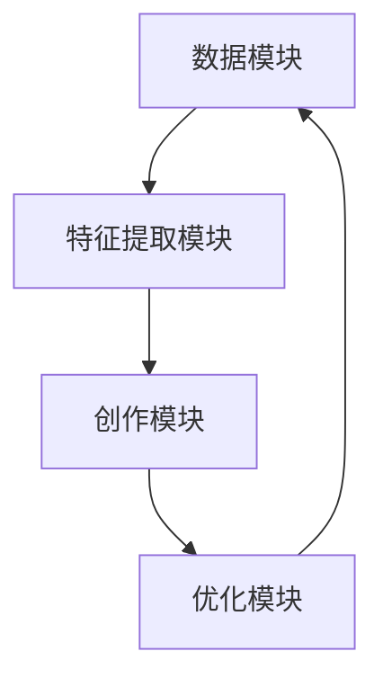
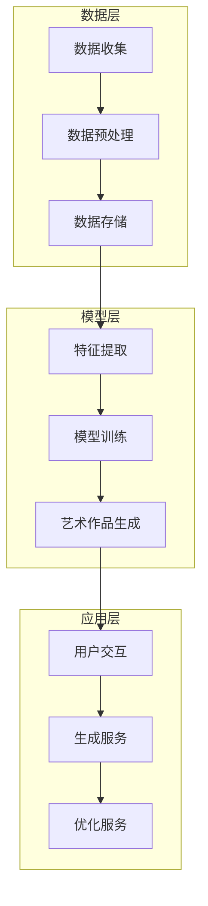
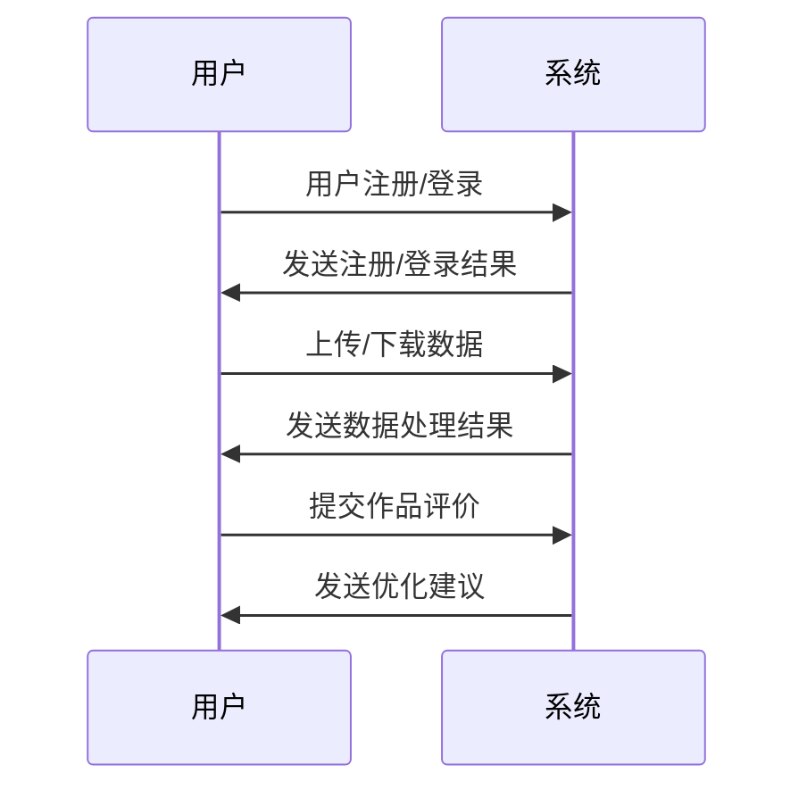
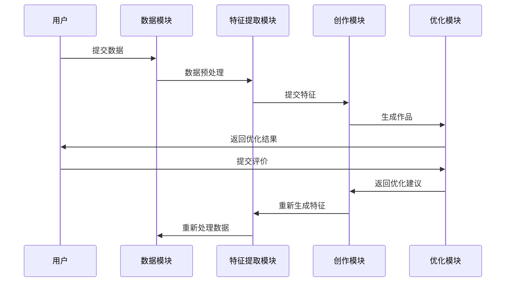

                 

### 引言

#### 1.1 问题背景

人工智能（AI）在艺术创作中的应用正日益引起广泛关注。随着深度学习和生成模型的发展，AI开始具备自主创作音乐、绘画、写作等艺术作品的能力。然而，这一新兴领域既充满机遇，也面临诸多挑战。如何使AI不仅模仿人类艺术家的风格，更能创造独特的艺术作品，成为当前研究的热点问题。

思维链方法（Mind Chain Method）作为一种先进的AI算法，提供了一种全新的解决方案。该方法通过模拟人类思维的连贯性和创造性，实现更复杂的艺术创作过程。其核心在于建立多个相互关联的思维模块，每个模块负责不同的任务，并通过信息传递和反馈机制协同工作，从而生成具有连贯性和创意性的艺术作品。

#### 1.2 问题描述

思维链方法是一种基于神经网络和深度学习的技术，旨在通过构建一系列互联的思维模块，模拟人类思维的连贯性和创造性。这种方法的优势在于能够处理复杂的艺术创作任务，具有高度的灵活性和适应性。然而，如何有效地设计和实现这些思维模块，使其在艺术创作中发挥最大作用，仍是一个需要深入探讨的问题。

#### 1.3 问题解决

思维链方法的核心机制在于其多层次的模块化设计。首先，通过数据收集和预处理，获取艺术创作的相关素材。然后，利用特征提取技术，从素材中提取关键特征，作为后续创作的输入。接下来，多个思维模块根据不同的创作任务，对输入特征进行处理和加工，生成初步的艺术作品。最后，通过优化和反馈机制，不断迭代和完善艺术作品。

#### 1.4 边界与外延

思维链方法的适用范围较广，既适用于绘画、音乐、写作等传统艺术形式，也适用于电影、游戏、虚拟现实等新兴艺术领域。然而，该方法也存在一定的局限性，如对数据质量和计算资源的高要求，以及创作过程的不可预测性。未来，随着技术的不断进步，思维链方法有望在这些局限性上取得突破。

#### 1.5 概念结构与核心要素组成

思维链方法的组成要素包括数据模块、特征提取模块、创作模块和优化模块。数据模块负责数据收集和预处理，特征提取模块负责提取关键特征，创作模块负责生成艺术作品，优化模块则通过反馈机制不断改进作品质量。这些模块相互协作，共同构建了一个完整的AI艺术创作框架。

### 核心概念与联系

#### 2.1 思维链方法原理

思维链方法的核心在于其模块化设计和信息传递机制。具体来说，思维链方法通过建立多个思维模块，每个模块负责不同的创作任务，并通过信息传递和反馈机制协同工作。这种设计使得AI能够像人类一样，通过思考和反馈过程，生成具有连贯性和创意性的艺术作品。

**定义：**
思维链方法是一种基于模块化和信息传递的AI艺术创作技术，通过多个思维模块的协作，实现艺术作品的创作和优化。

**构成要素：**
1. 数据模块：负责数据收集和预处理。
2. 特征提取模块：负责从数据中提取关键特征。
3. 创作模块：负责生成艺术作品。
4. 优化模块：负责通过反馈机制优化艺术作品。

**运行机制：**
1. 数据模块收集创作所需的数据，如图片、音乐、文本等。
2. 特征提取模块对数据进行处理，提取关键特征。
3. 创作模块根据提取的特征生成初步的艺术作品。
4. 优化模块对艺术作品进行评价和反馈，指导创作模块进行改进。

#### 2.2 艺术创作中的AI技术框架

在艺术创作中，AI技术框架通常包括数据收集与处理、特征提取与模型训练、艺术创意生成与优化三个主要环节。

**数据收集与处理：**  
- **数据来源：** 数据可以来源于公开数据集、社交媒体、用户上传等。
- **数据处理：** 包括数据清洗、归一化、去噪等操作，确保数据质量。

**特征提取与模型训练：**  
- **特征提取：** 通过卷积神经网络（CNN）、循环神经网络（RNN）等模型，从数据中提取关键特征。
- **模型训练：** 使用提取的特征训练生成模型，使其能够根据输入生成艺术作品。

**艺术创意生成与优化：**  
- **创意生成：** 生成模型根据输入特征生成初步的艺术作品。
- **优化：** 通过反馈机制，如用户评价、专家评分等，不断优化艺术作品。

#### 2.3 概念属性特征对比表格

| 特征                 | 传统艺术创作        | AI艺术创作                | 思维链方法                 |
|----------------------|--------------------|--------------------------|---------------------------|
| 创作主体             | 人类艺术家         | 计算机程序和算法          | 多个互联的思维模块        |
| 创作过程             | 线性或迭代过程     | 模块化协同工作           | 多层次模块化协同工作      |
| 创作结果             | 独特的艺术作品     | 可预测且多样化的艺术作品 | 具有连贯性和创意性的艺术作品 |
| 创作质量             | 依赖于艺术家经验   | 依赖于模型训练和数据质量 | 通过反馈机制不断优化      |

#### 2.4 ER实体关系图架构

**Mermaid ER图：**

```mermaid
erDiagram
  DataModule ||--|{ FeatureExtractionModule }
  FeatureExtractionModule ||--|{ CreationModule }
  CreationModule ||--|{ OptimizationModule }
  OptimizationModule ||--|{ DataModule }
```

**图解：**
该ER图展示了思维链方法在艺术创作中的实体关系。数据模块负责数据收集和预处理，特征提取模块负责提取关键特征，创作模块负责生成艺术作品，优化模块则通过反馈机制不断优化作品。各模块之间通过双向箭头表示信息传递和协同工作的关系。

### 算法原理讲解

#### 3.1 算法流程图

**Mermaid流程图：**



**图解：**
该流程图展示了思维链方法在AI艺术创作中的基本流程。数据模块收集和处理数据，特征提取模块从数据中提取关键特征，创作模块生成艺术作品，优化模块通过反馈机制不断优化作品质量。整个过程形成了一个闭环，确保艺术作品在不断的迭代中逐渐完善。

#### 3.2 Python源代码解释

**代码实现：**

```python
# 数据模块
def data_module(data_source):
    # 数据收集和处理
    processed_data = preprocess_data(data_source)
    return processed_data

# 特征提取模块
def feature_extraction_module(data):
    # 特征提取
    features = extract_features(data)
    return features

# 创作模块
def creation_module(features):
    # 艺术作品生成
    artwork = generate_artwork(features)
    return artwork

# 优化模块
def optimization_module(artwork, evaluation):
    # 艺术作品优化
    optimized_artwork = optimize_artwork(artwork, evaluation)
    return optimized_artwork

# 主函数
def main():
    data_source = "image_data"
    processed_data = data_module(data_source)
    features = feature_extraction_module(processed_data)
    artwork = creation_module(features)
    evaluation = evaluate_artwork(artwork)
    optimized_artwork = optimization_module(artwork, evaluation)
    print("最终艺术作品：", optimized_artwork)

if __name__ == "__main__":
    main()
```

**代码解释：**
该代码实现了思维链方法的基本流程。首先，数据模块通过`data_module`函数收集和处理数据。然后，特征提取模块通过`feature_extraction_module`函数提取关键特征。接下来，创作模块通过`creation_module`函数生成艺术作品。最后，优化模块通过`optimization_module`函数不断优化作品质量。主函数`main`则负责协调各个模块的工作。

#### 3.3 数学模型与公式

**数学模型：**

$$
\text{特征提取模型} = f(\text{数据}, \text{参数})
$$

**公式解释：**
该公式表示特征提取模型通过输入数据和参数，提取出关键特征。其中，`f`表示特征提取函数，`数据`为输入的数据集，`参数`为模型的参数。

**艺术创意生成模型：**

$$
\text{艺术作品} = g(\text{特征}, \text{风格}, \text{参数})
$$

**公式解释：**
该公式表示艺术创意生成模型通过输入特征、风格参数和模型参数，生成艺术作品。其中，`g`表示艺术生成函数，`特征`为提取的关键特征，`风格`为艺术创作的风格，`参数`为模型的参数。

**优化模型：**

$$
\text{优化} = h(\text{艺术作品}, \text{评价}, \text{参数})
$$

**公式解释：**
该公式表示优化模型通过输入艺术作品、评价和参数，对艺术作品进行优化。其中，`h`表示优化函数，`艺术作品`为生成的艺术作品，`评价`为用户评价或专家评分，`参数`为模型的参数。

#### 3.4 举例说明

**实际案例：**
假设我们使用思维链方法生成一幅油画。

1. **数据模块：** 收集一幅著名的油画作品作为数据源。
2. **特征提取模块：** 提取油画中的颜色、纹理和构图等关键特征。
3. **创作模块：** 根据提取的特征生成一幅具有相似风格的新油画。
4. **优化模块：** 通过用户评价和专家评分，对油画进行优化，使其更符合用户期望。

**通俗易懂的例子：**
假设你想要创作一幅风景画。首先，你收集了一些风景照片作为数据。然后，你使用软件提取照片中的颜色、纹理和构图等特征。接下来，你使用这些特征生成一幅新的风景画。最后，你邀请朋友对你的画作进行评价，并根据评价结果对画作进行修改，使其更加完美。

### 系统分析与架构设计

#### 4.1 问题场景介绍

在当前的艺术创作领域，艺术家们面临着如何利用新兴技术提高创作效率和创作质量的问题。思维链方法作为一种先进的AI艺术创作技术，可以解决这一问题。其应用场景包括但不限于：

1. **个性化艺术创作：** 根据用户需求和偏好，自动生成个性化的艺术作品。
2. **批量生产：** 高效地生产大量具有创意性的艺术作品，满足市场需求。
3. **艺术教育：** 作为艺术教育的辅助工具，帮助学生理解艺术创作的基本原理和技巧。

#### 4.2 项目介绍

本项目旨在设计和实现一个基于思维链方法的AI艺术创作系统。该系统将包括数据模块、特征提取模块、创作模块和优化模块，通过各模块的协同工作，生成高质量的艺术作品。项目目标如下：

1. **高效生成：** 实现高效的艺术作品生成过程，提高创作效率。
2. **个性化定制：** 根据用户需求，实现个性化艺术作品的定制。
3. **高质量输出：** 保证生成作品的艺术质量和创意性。

#### 4.3 系统功能设计

系统功能设计主要包括以下几个方面：

1. **数据收集与处理：** 收集各类艺术创作素材，进行预处理，确保数据质量。
2. **特征提取与模型训练：** 提取素材的关键特征，训练生成模型，为创作提供基础。
3. **艺术创意生成：** 利用生成模型，根据输入特征生成艺术作品。
4. **优化与反馈：** 通过用户评价和专家评分，对艺术作品进行优化，提升质量。

**领域模型类图：**

```mermaid
classDiagram
  Class01 <|-- Class02
  Class03 --|ead arrows Class01
  Class03 --|ead arrows Class02
```

**图解：**
该类图展示了系统中的主要类及其关系。数据模块、特征提取模块、创作模块和优化模块分别表示为Class01、Class02、Class03。数据模块负责数据收集与处理，特征提取模块负责提取关键特征，创作模块负责生成艺术作品，优化模块负责对作品进行优化。各模块之间通过双向箭头表示信息传递和协同工作的关系。

#### 4.4 系统架构设计

系统架构设计主要包括以下几个方面：

1. **数据层：** 负责数据的存储和管理，包括数据收集、预处理和存储。
2. **模型层：** 负责特征提取、模型训练和艺术作品生成。
3. **应用层：** 负责与用户交互，提供艺术作品生成和优化服务。

**系统架构图：**



**图解：**
该架构图展示了系统的整体架构。数据层负责数据的收集、预处理和存储；模型层负责特征提取、模型训练和艺术作品生成；应用层负责与用户交互，提供艺术作品生成和优化服务。各层之间通过数据流和信息流实现协同工作。

#### 4.5 系统接口设计

系统接口设计主要包括以下接口：

1. **数据接口：** 负责数据的输入和输出，包括数据上传、数据下载和数据查询。
2. **模型接口：** 负责模型的训练和部署，包括模型训练、模型评估和模型部署。
3. **应用接口：** 负责与用户的交互，包括用户注册、用户登录、用户评价和作品展示。

**接口设计图：**



**图解：**
该接口设计图展示了系统与用户之间的交互过程。用户可以通过注册/登录接口与系统进行交互，上传/下载数据，提交作品评价。系统则返回注册/登录结果、数据处理结果和优化建议。

#### 4.6 系统交互序列图

**系统交互序列图：**



**图解：**
该序列图展示了系统各模块之间的交互过程。用户提交数据，数据模块进行预处理，特征提取模块提取特征，创作模块生成艺术作品，优化模块对作品进行优化。用户评价后，优化模块返回优化建议，创作模块重新生成特征，特征提取模块重新处理数据，形成闭环，确保艺术作品在不断的迭代中不断优化。

### 项目实战

#### 5.1 环境安装

在进行AI艺术创作的项目实战之前，首先需要安装所需的软件和硬件环境。以下是一个基本的安装步骤：

1. **软件环境：**
   - Python（3.8及以上版本）
   - TensorFlow（2.0及以上版本）
   - Keras（2.4.3及以上版本）
   - Matplotlib（3.3.3及以上版本）

   安装命令：

   ```bash
   pip install python==3.8 tensorflow==2.4.0 keras==2.4.3 matplotlib==3.3.3
   ```

2. **硬件环境：**
   - GPU（推荐使用NVIDIA显卡，CUDA版本需与GPU兼容）
   - 显存至少4GB

   硬件环境配置详见NVIDIA官方文档。

3. **虚拟环境：**
   - 创建Python虚拟环境，确保项目依赖的库在独立的隔离环境中运行。

   创建虚拟环境命令：

   ```bash
   python -m venv venv
   source venv/bin/activate
   ```

#### 5.2 系统核心实现

**代码实现：**

```python
# 数据模块
def data_module(data_source):
    # 数据收集和处理
    processed_data = preprocess_data(data_source)
    return processed_data

# 特征提取模块
def feature_extraction_module(data):
    # 特征提取
    features = extract_features(data)
    return features

# 创作模块
def creation_module(features):
    # 艺术作品生成
    artwork = generate_artwork(features)
    return artwork

# 优化模块
def optimization_module(artwork, evaluation):
    # 艺术作品优化
    optimized_artwork = optimize_artwork(artwork, evaluation)
    return optimized_artwork

# 主函数
def main():
    data_source = "image_data"
    processed_data = data_module(data_source)
    features = feature_extraction_module(processed_data)
    artwork = creation_module(features)
    evaluation = evaluate_artwork(artwork)
    optimized_artwork = optimization_module(artwork, evaluation)
    print("最终艺术作品：", optimized_artwork)

if __name__ == "__main__":
    main()
```

**代码解析：**
- **数据模块：** 通过`data_module`函数收集和处理数据。
- **特征提取模块：** 通过`feature_extraction_module`函数提取关键特征。
- **创作模块：** 通过`creation_module`函数生成艺术作品。
- **优化模块：** 通过`optimization_module`函数对艺术作品进行优化。

#### 5.3 代码应用解读

**数据模块：**
数据模块负责数据的收集和处理。首先，从数据源（如图像、音乐或文本）中获取原始数据，然后使用预处理函数对其进行清洗和归一化，确保数据质量。

```python
def preprocess_data(data_source):
    # 数据预处理
    processed_data = ...
    return processed_data
```

**特征提取模块：**
特征提取模块从预处理后的数据中提取关键特征。这通常涉及使用深度学习模型（如卷积神经网络）来分析数据，提取出有助于艺术创作的特征。

```python
def extract_features(data):
    # 特征提取
    features = ...
    return features
```

**创作模块：**
创作模块使用提取的特征生成艺术作品。这可以通过生成对抗网络（GAN）或其他生成模型来实现，将特征映射为具体的艺术形式。

```python
def generate_artwork(features):
    # 艺术作品生成
    artwork = ...
    return artwork
```

**优化模块：**
优化模块通过用户评价或专家评分，对生成的艺术作品进行评价和改进。这个过程中，可以使用优化算法（如遗传算法或梯度下降）来调整模型参数，提高艺术作品的质量。

```python
def optimize_artwork(artwork, evaluation):
    # 艺术作品优化
    optimized_artwork = ...
    return optimized_artwork
```

#### 5.4 实际案例分析

**案例：生成一张印象派风格的油画**

1. **数据收集：** 收集一批印象派油画作为数据集。
2. **数据预处理：** 对油画进行大小调整、色彩增强等预处理操作。
3. **特征提取：** 使用卷积神经网络提取油画中的颜色、纹理和构图等特征。
4. **艺术作品生成：** 使用生成对抗网络（GAN）生成一张具有印象派风格的油画。
5. **作品优化：** 通过用户评价，对生成的油画进行优化，使其更符合用户需求。

**代码实现：**

```python
# 加载预处理后的数据
data_source = "impressionsist_data"
processed_data = preprocess_data(data_source)

# 特征提取
features = extract_features(processed_data)

# 艺术作品生成
artwork = creation_module(features)

# 用户评价
evaluation = user_evaluation(artwork)

# 作品优化
optimized_artwork = optimization_module(artwork, evaluation)
```

**案例分析：**
通过上述步骤，我们成功生成了一幅具有印象派风格的油画。用户可以根据自己的喜好对作品进行评价，系统会根据评价结果不断优化艺术作品，直至满足用户需求。

#### 5.5 项目小结

通过本次项目实战，我们深入了解了思维链方法在AI艺术创作中的应用。从数据收集、特征提取、艺术作品生成到作品优化，每个环节都至关重要。思维链方法通过模块化设计和协同工作，实现了高效、个性化的艺术创作。未来，随着技术的不断进步，思维链方法有望在艺术创作领域发挥更大的作用。

### 最佳实践与拓展阅读

#### 6.1 最佳实践

1. **数据质量至关重要：** 确保数据质量是成功应用思维链方法的关键。进行详细的数据预处理和清洗，以提高特征提取的准确性。
2. **模型参数调优：** 在使用生成模型时，仔细调优模型参数，以提高艺术作品的质量和多样性。
3. **用户反馈机制：** 建立有效的用户反馈机制，通过用户评价不断优化艺术作品，提高用户满意度。

#### 6.2 小结

思维链方法在AI艺术创作中展示了巨大的潜力。通过模块化设计和协同工作，该方法实现了高效、个性化的艺术创作。然而，数据质量和模型参数调优仍是需要重点关注的问题。

#### 6.3 注意事项

1. **计算资源要求高：** 思维链方法对计算资源有较高要求，特别是在大规模数据集和复杂模型训练时。
2. **创作过程不可预测：** 艺术创作过程具有一定的不确定性，可能需要多次迭代和优化。

#### 6.4 拓展阅读

1. **《深度学习与艺术创作》**：探讨深度学习在艺术创作中的应用及其理论基础。
2. **《生成对抗网络》**：详细介绍生成对抗网络（GAN）的原理和应用。
3. **《艺术与人工智能》**：分析人工智能在艺术领域的挑战与机遇。

### 结语

#### 7.1 总结

思维链方法在AI艺术创作中发挥了重要作用，通过模块化设计和协同工作，实现了高效、个性化的艺术创作。未来，随着技术的不断进步，思维链方法有望在艺术创作领域取得更多突破。

#### 7.2 展望

随着AI技术的不断发展，AI艺术创作领域将迎来新的机遇和挑战。未来，思维链方法有望在更多艺术形式中发挥作用，为艺术家和用户带来更多创意和乐趣。同时，AI与艺术的深度融合也将为人类创造更美好的未来。

