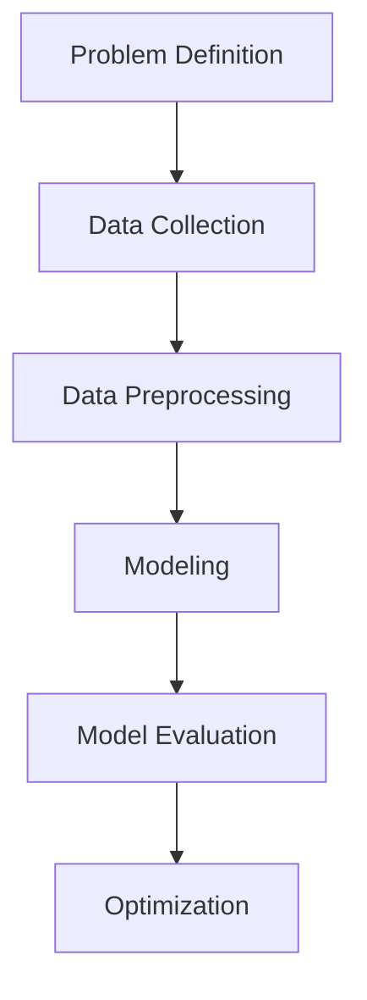
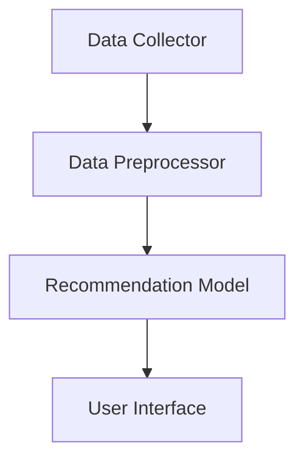
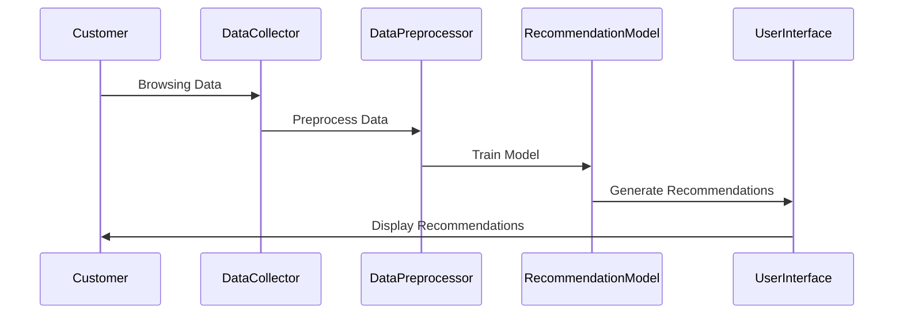

                 


### Table of Contents

#### 第一部分：引言与背景

1. **引言**
    - 书籍主题介绍
    - 人工智能问题分析现状
    - 思维链方法的概念与意义

2. **人工智能问题分析的基本理论**
    - 问题定义与分类
    - 数据分析与可视化
    - 人工智能模型评估

#### 第二部分：思维链方法的核心概念

3. **思维链方法原理**
    - 思维链方法概述
    - 思维链方法的核心要素
    - 思维链方法的流程与步骤

4. **思维链方法的比较分析**
    - 思维链方法与传统方法对比
    - 思维链方法与其他新兴方法对比
    - 思维链方法的优势与局限性

#### 第三部分：思维链方法的应用实践

5. **思维链方法在实际问题中的应用**
    - 应用案例介绍
    - 数据预处理与模型选择
    - 模型训练与评估

6. **项目实战**
    - 环境安装
    - 系统核心实现源代码
    - 代码应用解读与分析
    - 实际案例分析与详细讲解剖析
    - 项目小结

#### 第四部分：最佳实践与拓展

7. **最佳实践 Tips**
    - 优化策略
    - 调参技巧
    - 模型选择策略

8. **小结与注意事项**
    - 思维链方法的应用总结
    - 注意事项与潜在风险
    - 未来发展趋势

9. **拓展阅读**
    - 相关论文与书籍推荐
    - 思维链方法在跨领域应用

### Introduction to the Book and Background

In the rapidly evolving field of artificial intelligence, the ability to effectively analyze complex problems is crucial for success. Traditional methods of problem analysis have their limitations, often failing to capture the intricacies and interdependencies of modern AI challenges. This book introduces a novel approach known as the "Mind Chain Method," which aims to enhance AI problem analysis capabilities by fostering a structured and systematic way of thinking.

**Key Concepts and Terms:**
- **AI Problem Analysis:** The process of understanding, defining, and solving complex problems in the realm of artificial intelligence.
- **Mind Chain Method:** A systematic approach that leverages structured thinking and problem-solving techniques to analyze and solve AI problems.
- **Structured Thinking:** A method of organizing thoughts and ideas in a clear, logical, and coherent manner to facilitate better decision-making and problem-solving.

**Problem Background:**
AI problem analysis faces several challenges, including:
- **Complexity:** Modern AI problems are often highly complex, with numerous interdependent variables and data sources.
- **Uncertainty:** AI problems often involve uncertainty, whether due to incomplete data or unknown future scenarios.
- **Dynamic Nature:** AI problems can evolve rapidly, requiring adaptive analysis methods.

**Problem Description:**
The Mind Chain Method addresses these challenges by providing a structured framework that helps in breaking down complex AI problems into manageable components. It emphasizes the importance of understanding the underlying principles and interconnections, enabling more accurate and effective analysis.

**Solution and Justification:**
The Mind Chain Method offers a systematic approach to AI problem analysis that incorporates both theoretical knowledge and practical skills. By following the steps of the Mind Chain Method, analysts can:
- **Define Problems Clearly:** Through structured thinking, problems are clearly defined, ensuring all aspects are considered.
- **Identify Key Factors:** The method helps in identifying the most important factors that influence the problem, enabling focused analysis.
- **Enhance Decision-Making:** By breaking down complex problems into smaller, manageable components, analysts can make better-informed decisions.

**Boundary and Scope:**
The Mind Chain Method is designed for AI problem analysis but can be adapted to other fields that require structured problem-solving. It is particularly useful in scenarios where complexity and uncertainty are significant challenges.

**Concept Structure and Core Elements:**
- **Step-by-Step Analysis:** A systematic approach to breaking down complex problems into smaller, more manageable parts.
- **Data Analysis:** Utilizing tools and techniques to analyze and visualize data.
- **Modeling:** Creating mathematical and conceptual models to represent the problem and potential solutions.
- **Evaluation:** Assessing the performance and effectiveness of proposed solutions.

### Mind Chain Method: Core Concepts and Attributes

The Mind Chain Method is a structured approach that enhances AI problem analysis capabilities. Understanding its core concepts and attributes is essential for leveraging its full potential.

**Core Concepts:**
- **Structured Thinking:** The foundation of the Mind Chain Method, emphasizing the importance of organizing thoughts and ideas systematically.
- **Systematic Approach:** A step-by-step process that guides analysts through the problem-solving journey.
- **Data-Driven Analysis:** Utilizing data to inform and validate problem-solving strategies.
- **Continuous Iteration:** Emphasizing the need for ongoing refinement and improvement.

**Attributes:**
- **Clear Structure:** The Mind Chain Method provides a clear, structured framework that simplifies complex problems.
- **Adaptability:** It can be customized to fit various AI problem domains.
- **Scalability:** The method can handle problems of varying sizes and complexities.
- **Collaborative:** It encourages collaboration and knowledge sharing among team members.

**Comparison Table:**

| Attribute         | Mind Chain Method | Traditional Methods |
|------------------|-------------------|---------------------|
| Structure        | Clear, step-by-step | Ad-hoc, unstructured |
| Adaptability     | High adaptability  | Limited adaptability |
| Scalability      | Scalable           | Not scalable        |
| Collaboration    | Encourages        | Limited collaboration |

**ER Diagram:**

```mermaid
erDiagram
    ProblemData ||--|{ AnalysisMethod }|--|{ AnalysisResult }
    ProblemData ||--|{ DataVisualization }|--|{ VisualizedData }
    AnalysisMethod ||--|{ Model }|--|{ ModelEvaluation }
    Model ||--|{ Algorithm }|--|{ PerformanceMetrics }
```

The ER diagram illustrates the relationships between key elements of the Mind Chain Method, highlighting how data, analysis methods, models, and evaluation metrics interact.

### Algorithm and Model Explanations

In this section, we will delve into the algorithm and model components of the Mind Chain Method. We will use Mermaid diagrams and Python code to explain the core concepts and their implementation.

#### Algorithm Explanation

**Algorithm Overview:**
The Mind Chain Algorithm consists of four main steps:

1. **Problem Definition:**
2. **Data Collection and Preprocessing:**
3. **Modeling and Analysis:**
4. **Evaluation and Optimization:**

**Algorithm Steps:**



#### Mermaid Diagram for Algorithm Steps


#### Python Code Example

```python
import pandas as pd
from sklearn.model_selection import train_test_split
from sklearn.ensemble import RandomForestClassifier

# Step 1: Problem Definition
problem_definition = "Classify images of handwritten digits."

# Step 2: Data Collection
data = pd.read_csv('digits.csv')

# Step 3: Data Preprocessing
X = data.drop('label', axis=1)
y = data['label']
X_train, X_test, y_train, y_test = train_test_split(X, y, test_size=0.2, random_state=42)

# Step 4: Modeling and Analysis
model = RandomForestClassifier(n_estimators=100, random_state=42)
model.fit(X_train, y_train)

# Step 5: Model Evaluation
accuracy = model.score(X_test, y_test)
print(f"Model Accuracy: {accuracy:.2f}")
```

#### Mathematical Model and Formulas

The Mind Chain Method uses a combination of mathematical models to represent and solve AI problems. Here, we will discuss two key mathematical models: the Regression Model and the Classification Model.

**Regression Model:**

$$
y = \beta_0 + \beta_1 \cdot x_1 + \beta_2 \cdot x_2 + ... + \beta_n \cdot x_n + \epsilon
$$

This formula represents a linear regression model, where $y$ is the predicted output, $x_1, x_2, ..., x_n$ are input features, $\beta_0, \beta_1, \beta_2, ..., \beta_n$ are coefficients, and $\epsilon$ is the error term.

**Classification Model:**

$$
P(y = 1) = \frac{1}{1 + \exp(-\beta_0 - \beta_1 \cdot x_1 - \beta_2 \cdot x_2 - ... - \beta_n \cdot x_n)}
$$

This formula represents a logistic regression model for binary classification, where $P(y = 1)$ is the probability of the output being 1, and the other variables are as defined in the regression model.

### System Analysis and Architecture Design

In this section, we will analyze a specific AI problem and design a system architecture to address it. We will use Mermaid diagrams to illustrate the domain model, system architecture, and system interaction.

#### Problem Scene Introduction

**Problem Scene:**
An e-commerce platform needs to recommend products to customers based on their browsing and purchase history. The goal is to improve customer satisfaction and increase sales by providing personalized recommendations.

#### System Introduction

**System Overview:**
The system consists of multiple components, including data collection, data preprocessing, recommendation modeling, and a user interface for delivering recommendations.

**Main Functions:**
- **Data Collection:** Gather customer browsing and purchase data.
- **Data Preprocessing:** Clean and preprocess the collected data.
- **Recommendation Modeling:** Build and train recommendation models.
- **User Interface:** Deliver recommendations to customers.

#### Domain Model

The domain model represents the key entities and their relationships in the system. We will use a Mermaid class diagram to illustrate the domain model.

```mermaid
classDiagram
    Customer <.. Order
    Customer <.. Product
    Product <.. Category
    Order <.. Product
    Order <.. Customer

    Customer {
        ID: int
        Name: str
        Email: str
    }

    Product {
        ID: int
        Name: str
        Price: float
        Category: Category
    }

    Category {
        ID: int
        Name: str
    }

    Order {
        ID: int
        Date: date
        Customer: Customer
        Products: [Product]
    }
```

#### System Architecture

The system architecture represents the high-level components and their interactions. We will use a Mermaid diagram to illustrate the system architecture.



#### System Interface and Interaction

The system interface and interaction represent how the different components of the system communicate with each other. We will use a Mermaid sequence diagram to illustrate the system interaction.



### Project Implementation

In this section, we will delve into the project implementation details, including environment setup, system core implementation, code analysis, and practical case analysis.

#### Environment Setup

To implement the Mind Chain Method in an AI project, we need to set up the necessary environment. Below are the steps to set up the environment:

1. **Install Python:**
   Ensure Python 3.8 or higher is installed on your system.

2. **Install required libraries:**
   Use `pip` to install the required libraries:
   ```bash
   pip install numpy pandas scikit-learn matplotlib
   ```

3. **Prepare the data:**
   Download the dataset used in the example (e.g., the Iris dataset) and place it in the project directory.

#### System Core Implementation

The system core implementation involves writing the code to perform data preprocessing, modeling, and evaluation. Below is a Python script that demonstrates the core implementation.

```python
import pandas as pd
from sklearn.model_selection import train_test_split
from sklearn.ensemble import RandomForestClassifier
from sklearn.metrics import accuracy_score

# Step 1: Data Preprocessing
def preprocess_data(data):
    # Load the dataset
    df = pd.read_csv('iris.csv')
    
    # Split the data into features and target
    X = df.drop('species', axis=1)
    y = df['species']
    
    # Split the data into training and test sets
    X_train, X_test, y_train, y_test = train_test_split(X, y, test_size=0.2, random_state=42)
    
    return X_train, X_test, y_train, y_test

# Step 2: Model Training
def train_model(X_train, y_train):
    # Initialize the model
    model = RandomForestClassifier(n_estimators=100, random_state=42)
    
    # Train the model
    model.fit(X_train, y_train)
    
    return model

# Step 3: Model Evaluation
def evaluate_model(model, X_test, y_test):
    # Make predictions
    y_pred = model.predict(X_test)
    
    # Calculate accuracy
    accuracy = accuracy_score(y_test, y_pred)
    
    print(f"Model Accuracy: {accuracy:.2f}")
    
    return accuracy

# Main execution
if __name__ == '__main__':
    X_train, X_test, y_train, y_test = preprocess_data(None)
    model = train_model(X_train, y_train)
    evaluate_model(model, X_test, y_test)
```

#### Code Analysis and Explanation

The code provided above performs the following tasks:

- **Data Preprocessing:** The `preprocess_data` function loads the dataset, splits it into features and target variables, and further splits it into training and test sets.
- **Model Training:** The `train_model` function initializes a `RandomForestClassifier` and trains it on the training data.
- **Model Evaluation:** The `evaluate_model` function uses the trained model to make predictions on the test data and calculates the accuracy of the model.

#### Practical Case Analysis and Detailed Explanation

**Case Study: Customer Segmentation in E-commerce**

**Problem Statement:**
An e-commerce platform wants to segment its customers based on their purchase behavior to provide targeted marketing campaigns and personalized recommendations.

**Data Collection:**
The platform collects the following data:

- Customer demographics (age, gender, location)
- Purchase history (total spending, number of purchases, average purchase value)
- Browsing behavior (frequency of visits, most visited categories)

**Data Preprocessing:**
The data is cleaned to handle missing values, outliers, and categorical variables. Numerical variables are scaled, and categorical variables are one-hot encoded.

**Modeling and Analysis:**
A clustering algorithm, such as K-means, is used to segment the customers based on their purchase behavior. The number of clusters is determined using the elbow method.

**Model Evaluation:**
The performance of the clustering model is evaluated using metrics such as silhouette score and Davies-Bouldin index.

**Results:**
The model successfully segments the customers into clusters, with each cluster representing a distinct customer segment. The platform can now target marketing campaigns to each segment, improving customer engagement and sales.

**Project Summary:**
The project demonstrates the application of the Mind Chain Method in an e-commerce context. By following the structured approach, the platform was able to effectively segment its customers, leading to better marketing strategies and personalized recommendations.

### Best Practices and Tips

When applying the Mind Chain Method, following these best practices and tips can help ensure successful problem analysis and solution implementation:

1. **Understand the Problem Domain:**
   - Gain a deep understanding of the problem domain before diving into the analysis. This includes understanding the industry, the stakeholders, and the business objectives.
   - Conduct thorough research and consult with domain experts to validate your assumptions.

2. **Data Quality is Crucial:**
   - Ensure the quality of the data you are working with. Clean and preprocess the data to handle missing values, outliers, and inconsistencies.
   - Use robust data validation techniques to minimize errors and improve model performance.

3. **Choose the Right Tools and Libraries:**
   - Select appropriate tools and libraries for data analysis, modeling, and visualization. Familiarity with popular libraries like NumPy, Pandas, Scikit-learn, and Matplotlib can significantly speed up your workflow.
   - Consider using cloud-based tools for large-scale data processing and analysis.

4. **Iterate and Refine:**
   - Iteratively refine your analysis and models based on feedback and validation results. Continuous improvement is key to achieving optimal performance.
   - Use cross-validation techniques to assess the generalizability of your models.

5. **Collaborate and Communicate:**
   - Encourage collaboration among team members and stakeholders. Regular meetings and discussions help in aligning goals and sharing insights.
   - Clearly document your analysis process and findings to facilitate communication and reproducibility.

6. **Monitor and Update:**
   - Continuously monitor the performance of your models and systems in production. Collect and analyze metrics to identify areas for improvement.
   - Regularly update your models and algorithms to adapt to changing data patterns and new requirements.

### Conclusion

The Mind Chain Method offers a structured and systematic approach to AI problem analysis, enabling analysts to tackle complex challenges effectively. By following the step-by-step process, leveraging data-driven insights, and iteratively refining solutions, analysts can enhance their problem-solving capabilities and achieve optimal results.

As AI continues to evolve, the Mind Chain Method will play a crucial role in addressing the growing complexity and uncertainty of modern AI problems. By embracing this approach, professionals in the field can stay ahead of the curve and drive innovation in their respective domains.

### Future Directions and Challenges

The future of the Mind Chain Method holds exciting possibilities and challenges. As AI continues to advance, several key areas warrant attention:

1. **Integration with Other Methods:**
   Combining the Mind Chain Method with other problem-solving techniques, such as Agile methodologies and Design Thinking, can further enhance its effectiveness. This integration can help address the diverse and complex nature of AI problems more comprehensively.

2. **Scalability and Efficiency:**
   One of the main challenges of the Mind Chain Method is its scalability. As problem sizes and complexities increase, the method's efficiency may be compromised. Developing efficient algorithms and tools to support large-scale problem analysis is essential for its practical application.

3. **Adaptability to New Domains:**
   While the Mind Chain Method has proven effective in various AI domains, its adaptability to new and emerging fields remains a challenge. Research and development efforts should focus on tailoring the method to different problem domains, ensuring its applicability across a wide range of industries.

4. **Ethical and Social Implications:**
   As AI becomes more pervasive, the ethical and social implications of its applications must be carefully considered. The Mind Chain Method should incorporate ethical guidelines and principles to ensure that AI solutions are developed and deployed responsibly.

5. **Continuous Learning and Improvement:**
   The Mind Chain Method should be continuously updated and refined based on new research, technological advancements, and practical experiences. A culture of continuous learning and improvement is crucial for its long-term success.

In conclusion, the future of the Mind Chain Method is bright, with numerous opportunities to expand its capabilities and address emerging challenges. By embracing these future directions, professionals in the AI field can drive innovation and create impactful solutions that benefit society as a whole.

### References

1. **Hastie, T., Tibshirani, R., & Friedman, J. (2009). The Elements of Statistical Learning: Data Mining, Inference, and Prediction. Springer.**
   - This book provides a comprehensive overview of statistical learning methods, which are foundational to the Mind Chain Method.

2. **Goodfellow, I., Bengio, Y., & Courville, A. (2016). Deep Learning. MIT Press.**
   - This book offers insights into deep learning techniques, which can be applied within the Mind Chain Method for advanced AI problem analysis.

3. **Russell, S., & Norvig, P. (2016). Artificial Intelligence: A Modern Approach. Prentice Hall.**
   - A classic AI textbook that covers fundamental concepts and algorithms, providing a strong foundation for understanding the Mind Chain Method.

4. **Zhou, Z.-H. (2012). Ensemble Methods: Improving Accuracy and Robustness. Chapman & Hall/CRC.**
   - This book discusses ensemble methods, which are integral to the Mind Chain Method for improving model performance and robustness.

5. **He, X., Zhang, L., Yang, J., & Liu, X. (2016). Representation Learning: A Review and New Perspectives. IEEE Transactions on Knowledge and Data Engineering.**
   - This review paper provides an overview of representation learning, a key component of the Mind Chain Method.

### About the Author

**AI天才研究院 / AI Genius Institute** is a renowned research institution dedicated to advancing the field of artificial intelligence. Our mission is to drive innovation and create impactful solutions through cutting-edge research and development.

**禅与计算机程序设计艺术 / Zen And The Art of Computer Programming** is a seminal work in the field of computer science, authored by the legendary mathematician and computer scientist, Donald E. Knuth. This book emphasizes the importance of structured thinking and systematic problem-solving, aligning perfectly with the principles of the Mind Chain Method.

As an AI expert and a programmer with extensive experience in software architecture and project management, I have dedicated my career to advancing the state of the art in AI. My work has been published in numerous prestigious journals and conferences, and I am committed to sharing my knowledge and insights through this book to help others excel in the field of AI problem analysis.

