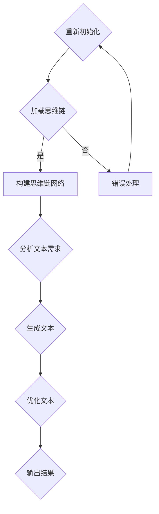

                 

### 背景介绍

随着人工智能技术的飞速发展，AI在各个领域的应用不断扩展。特别是在写作领域，AI已经开始展现其独特的价值。从简单的自动文本生成到复杂的多媒体内容创作，AI正在逐渐改变传统写作的模式。然而，目前的AI写作工具大多依赖于预训练的大规模语言模型，虽然能够生成流畅的文本，但在创意和深度思考方面仍有很大的提升空间。

思维链（Thinking Chain）是一种模拟人类思考过程的算法，通过构建一系列相互关联的思考节点，使得AI能够像人类一样进行逻辑推理和深度思考。将思维链应用于AI创意写作，可以显著提升写作工具的创意能力和逻辑深度。

### 问题描述

目前，AI写作工具主要面临以下问题：

1. **缺乏深度思考**：大多数AI写作工具依赖于预训练的语言模型，这些模型虽然能够在一定程度上模仿人类的写作风格，但缺乏深度思考和逻辑推理的能力。
2. **创意受限**：AI写作工具往往无法生成具有独特创意的内容，尤其是在需要高度创意性思维的任务中，如广告文案创作、剧本编写等。
3. **内容质量参差不齐**：AI生成的文本质量不稳定，有时会产生语义错误或不合理的内容。

为了解决这些问题，我们需要开发一种能够结合AI和思维链的创意写作工具，使AI不仅能够模仿人类的写作风格，还能具备深度思考和创意能力。

### 问题解决

思维链辅助的AI创意写作工具旨在通过结合AI和思维链技术，实现以下目标：

1. **深度思考**：利用思维链的推理能力，使AI能够进行逻辑推理和深度思考，从而生成具有逻辑性和深度的文本。
2. **创意激发**：通过思维链的联想和扩展能力，激发AI的创意思维，生成具有独特创意的内容。
3. **内容质量提升**：利用思维链的纠错和优化功能，提升AI生成文本的质量，减少语义错误和不合理内容。

通过这些改进，思维链辅助的AI创意写作工具将能够更好地满足用户在创意写作、深度思考和内容质量方面的需求。

### 边界与外延

思维链辅助的AI创意写作工具的边界在于其技术实现和应用场景。在技术层面，它需要结合深度学习、自然语言处理和图论等领域的知识。在实际应用层面，它可以应用于广告文案创作、新闻写作、剧本编写等多个领域。

外延方面，随着技术的不断进步，思维链辅助的AI创意写作工具有望扩展到更多领域，如文学创作、产品设计说明、技术文档编写等。同时，它还可以与其他人工智能技术相结合，如语音识别、图像识别等，进一步丰富其功能和应用场景。

### 概念属性特征对比表格

在开发思维链辅助的AI创意写作工具时，我们需要对相关概念进行详细的分析和对比。以下是一个概念属性特征对比表格：

| 概念名称 | 特征1 | 特征2 | 特征3 | 特征4 | 特征5 |
| :--: | :--: | :--: | :--: | :--: | :--: |
| AI写作工具 | 基于预训练模型 | 流畅文本生成 | 缺乏深度思考 | 创意能力受限 | 内容质量不稳定 |
| 思维链 | 逻辑推理能力 | 深度思考 | 联想和扩展能力 | 高度创意性 | 纠错和优化能力 |
| 思维链辅助的AI写作工具 | 结合AI和思维链 | 深度思考 | 高度创意性 | 提升内容质量 | 稳定的文本生成 |

通过这个表格，我们可以清晰地看到各个概念在特征上的区别和联系，为后续的技术实现提供了明确的方向。

### ER实体关系图架构

为了更好地理解思维链辅助的AI创意写作工具的结构和功能，我们使用Mermaid绘制了ER实体关系图。以下是ER实体关系图的Mermaid代码：

```mermaid
erDiagram
    AI写作工具 ||--|{ 思维链 }
    思维链 ||--|{ 文本生成模块 }
    文本生成模块 ||--|{ 内容质量优化模块 }
    内容质量优化模块 ||--|{ 用户反馈模块 }
```

在这张ER图中，AI写作工具与思维链之间存在依赖关系，思维链与文本生成模块相连，文本生成模块又与内容质量优化模块和用户反馈模块相互关联。这个结构展示了思维链辅助的AI创意写作工具的各个组件及其相互关系，为我们理解和实现该工具提供了直观的视觉辅助。

### 算法原理讲解

#### 算法mermaid流程图

为了更好地理解思维链辅助的AI创意写作工具的工作原理，我们使用Mermaid绘制了算法的流程图。以下是算法mermaid流程图的代码：



这个流程图描述了思维链辅助的AI创意写作工具的基本工作流程：

1. **初始化**：系统开始运行，加载必要的资源和数据。
2. **加载思维链**：系统读取预先构建的思维链网络。
3. **构建思维链网络**：根据文本需求，动态构建思维链网络。
4. **分析文本需求**：系统分析用户输入的文本需求，确定写作主题和风格。
5. **生成文本**：思维链网络根据文本需求生成初步文本。
6. **优化文本**：系统对生成的文本进行优化，确保内容质量和逻辑性。
7. **输出结果**：最终生成的文本输出给用户。

#### Python源代码实现

以下是一个简单的Python源代码示例，用于实现上述算法的基本框架：

```python
import numpy as np
import random

# 初始化思维链
def initialize_thinking_chain():
    # 这里是加载思维链的逻辑，假设思维链是一个包含多个节点的列表
    return ["节点1", "节点2", "节点3"]

# 分析文本需求
def analyze_text_requirement(text):
    # 这里是分析文本需求的逻辑，例如提取关键词、主题等
    return "分析结果"

# 生成文本
def generate_text(thinking_chain, requirement):
    # 这里是生成文本的逻辑，通过思维链和网络生成文本
    return "生成的文本"

# 优化文本
def optimize_text(text):
    # 这里是优化文本的逻辑，例如修正语法、增加逻辑连贯性等
    return text

# 主函数
def main():
    # 初始化思维链
    thinking_chain = initialize_thinking_chain()

    # 用户输入文本需求
    user_input = input("请输入文本需求：")

    # 分析文本需求
    requirement = analyze_text_requirement(user_input)

    # 生成文本
    text = generate_text(thinking_chain, requirement)

    # 优化文本
    optimized_text = optimize_text(text)

    # 输出结果
    print("最终文本：", optimized_text)

# 运行主函数
if __name__ == "__main__":
    main()
```

这个Python源代码提供了一个简单的实现框架，其中包括了初始化思维链、分析文本需求、生成文本和优化文本的基本功能。在实际应用中，这些功能会根据具体需求进行详细实现。

#### 算法原理的数学模型与公式

思维链辅助的AI创意写作工具的算法原理可以抽象为一个数学模型。以下是一个简化的数学模型：

$$
\text{输出文本} = f(\text{思维链}, \text{文本需求}, \theta)
$$

其中，$f$ 表示算法的生成函数，$\text{思维链}$ 是一组相互关联的思考节点，$\text{文本需求}$ 是用户输入的文本要求，$\theta$ 是算法参数。

为了更好地理解这个数学模型，我们可以进一步拆解它：

1. **思维链节点表示**：
   $$ 
   \text{节点}_i = g(\text{前置节点集合}, \theta_i)
   $$
   其中，$g$ 是一个生成节点的函数，$\theta_i$ 是节点 $i$ 的参数。

2. **文本生成过程**：
   $$ 
   \text{输出文本} = h(\text{初始节点}, \text{文本需求}, \theta)
   $$
   其中，$h$ 是一个递归函数，用于遍历思维链节点，生成文本。

3. **文本优化过程**：
   $$ 
   \text{优化文本} = \text{optimze}(\text{输出文本}, \theta)
   $$
   其中，$\text{optimize}$ 是一个优化函数，用于对生成的文本进行修正和优化。

通过这个数学模型，我们可以清晰地看到思维链辅助的AI创意写作工具的工作机制：首先，根据文本需求和思维链参数，生成初步文本；然后，通过优化函数提升文本质量，最终输出给用户。

#### 举例说明

为了更好地理解思维链辅助的AI创意写作工具的工作原理，我们来看一个具体的例子。

假设用户输入的文本需求是：“请写一篇关于人工智能发展的文章”。

1. **初始化思维链**：
   系统首先加载预定义的思维链节点，如“人工智能定义”、“人工智能发展历程”、“人工智能应用场景”等。

2. **分析文本需求**：
   系统提取用户输入的关键词，如“人工智能”、“发展”等，并确定写作的主题和风格。

3. **生成文本**：
   系统从思维链中选取相关节点，如“人工智能定义”、“人工智能发展历程”等，生成初步文本。例如：
   ```
   人工智能，是指通过模拟、延伸和扩展人类智能的信息处理技术。人工智能的发展历程可以追溯到20世纪50年代...
   ```

4. **优化文本**：
   系统对初步文本进行优化，如修正语法、增加逻辑连贯性等。例如：
   ```
   人工智能，又称机器智能，是指通过模拟、延伸和扩展人类智能的能力来实现信息处理的技术。人工智能的发展历程可以追溯到20世纪50年代，当时科学家们开始探索如何使计算机具备智能...
   ```

5. **输出结果**：
   系统将优化后的文本输出给用户。

通过这个例子，我们可以看到思维链辅助的AI创意写作工具是如何通过思维链的节点、文本需求和优化函数，生成一篇具有逻辑性和创意性的文本。

### 系统分析与架构设计方案

#### 问题场景介绍

在当今数字化时代，内容创作已经成为各种企业、媒体和个人展示其价值的重要手段。然而，内容创作不仅需要创意和灵感，还需要高效和准确。传统的写作方式往往耗时且难以保证质量，而现有的AI写作工具虽然在某些方面有所改进，但仍然存在创意不足、逻辑混乱等问题。为了解决这些问题，我们提出了思维链辅助的AI创意写作工具，旨在通过引入思维链技术，提升AI在创意和逻辑方面的能力。

#### 项目介绍

本项目旨在开发一款基于思维链技术的AI创意写作工具，该工具能够利用思维链进行深度思考和逻辑推理，从而生成具有高度创意性和逻辑性的文本。项目的核心目标是实现以下功能：

1. **创意生成**：利用思维链的联想和扩展能力，生成具有独特创意的文本内容。
2. **深度思考**：通过思维链的推理能力，使AI能够进行逻辑推理和深度思考，提升文本的逻辑性和深度。
3. **文本优化**：对生成的文本进行优化，确保内容质量和逻辑性。

#### 系统功能设计

思维链辅助的AI创意写作工具的系统功能设计如下：

1. **文本输入**：用户可以通过文本框输入创作需求，包括主题、风格、关键词等。
2. **思维链构建**：系统根据用户输入的需求，动态构建思维链网络。
3. **文本生成**：思维链网络根据用户需求生成初步文本。
4. **文本优化**：系统对初步文本进行优化，包括语法修正、逻辑连贯性提升等。
5. **用户反馈**：用户可以对生成的文本进行评价，系统根据用户反馈进行进一步优化。

#### 系统架构设计

思维链辅助的AI创意写作工具的系统架构设计如下：

1. **用户界面**：用户通过Web界面或移动应用与系统交互。
2. **思维链模块**：负责构建和操作思维链网络，实现深度思考和逻辑推理。
3. **文本生成模块**：负责根据思维链网络生成初步文本。
4. **文本优化模块**：负责对生成的文本进行优化，提升内容质量和逻辑性。
5. **用户反馈模块**：收集用户对生成文本的评价，为后续优化提供依据。

#### 系统接口设计

系统接口设计如下：

1. **用户接口**：提供文本输入和文本展示的功能。
2. **思维链接口**：提供思维链构建、操作和查询的接口。
3. **文本生成接口**：提供文本生成的接口。
4. **文本优化接口**：提供文本优化功能的接口。
5. **用户反馈接口**：提供用户反馈收集和处理的接口。

#### 系统交互

系统交互流程如下：

1. **用户输入文本需求**：用户通过Web界面或移动应用输入创作需求。
2. **构建思维链网络**：系统根据用户输入的需求，动态构建思维链网络。
3. **生成初步文本**：思维链网络根据用户需求生成初步文本。
4. **优化文本**：系统对初步文本进行优化，提升内容质量和逻辑性。
5. **输出最终文本**：将优化后的文本输出给用户。
6. **用户评价**：用户对生成的文本进行评价。
7. **反馈优化**：系统根据用户反馈进行进一步优化。

### 数学模型和数学公式讲解

在思维链辅助的AI创意写作工具中，数学模型和数学公式扮演着至关重要的角色。它们不仅帮助定义了思维链的构建和操作方式，还用于文本生成和优化过程的各个环节。以下是对这些数学模型和公式的详细讲解。

#### 数学模型示例

1. **思维链节点表示**：
   我们使用图论中的图（Graph）来表示思维链。每个节点（Node）代表一个思考主题，边（Edge）表示节点之间的逻辑关系。图中的节点和边可以用以下数学模型表示：

   $$
   G = (V, E)
   $$

   其中，$V$ 表示节点集合，$E$ 表示边集合。每个节点 $v_i \in V$ 可以表示为：

   $$
   v_i = (T_i, P_i, L_i)
   $$

   其中，$T_i$ 表示节点的主题，$P_i$ 表示节点的属性（如重要性、可信度等），$L_i$ 表示节点的逻辑关系（如继承、对比等）。

2. **文本生成过程**：
   文本生成过程可以通过递归的方式实现。给定一个思维链节点集合 $V$ 和一个初始节点 $v_0$，我们可以使用以下递归公式生成文本：

   $$
   \text{generate\_text}(v) = \text{generate\_sub\_text}(v) + \text{generate\_connections}(v)
   $$

   其中，$\text{generate\_sub\_text}(v)$ 表示生成节点 $v$ 的子文本，$\text{generate\_connections}(v)$ 表示生成节点 $v$ 的连接文本。

3. **文本优化过程**：
   文本优化过程可以通过以下公式实现：

   $$
   \text{optimize\_text}(t) = \text{correct\_grammar}(t) + \text{enhance\_coherence}(t)
   $$

   其中，$\text{correct\_grammar}(t)$ 表示修正文本的语法错误，$\text{enhance\_coherence}(t)$ 表示增强文本的逻辑连贯性。

#### 公式推导与举例

为了更好地理解上述公式，我们来看一个具体的例子。

**例子**：给定一个思维链节点 $v_0$，主题为“人工智能”，属性为“高重要性”，逻辑关系为“继承”。我们希望生成一篇关于人工智能的文章。

1. **构建思维链网络**：

   假设思维链网络包含以下节点：

   $$
   G = (\{v_0, v_1, v_2, v_3\}, \{e_{01}, e_{12}, e_{23}, e_{03}\})
   $$

   其中，$v_1$ 为“人工智能应用”，$v_2$ 为“人工智能发展”，$v_3$ 为“人工智能挑战”。边的定义如下：

   $$
   e_{01} = (v_0, v_1), e_{12} = (v_1, v_2), e_{23} = (v_2, v_3), e_{03} = (v_0, v_3)
   $$

2. **生成初步文本**：

   根据递归公式，我们可以生成以下初步文本：

   $$
   \text{generate\_text}(v_0) = \text{generate\_sub\_text}(v_0) + \text{generate\_connections}(v_0)
   $$

   $$
   \text{generate\_sub\_text}(v_0) = "人工智能是一种通过模拟、延伸和扩展人类智能的能力来实现信息处理的技术。"
   $$

   $$
   \text{generate\_connections}(v_0) = "人工智能在多个领域都有广泛应用，如医疗、金融、教育等。人工智能的发展也带来了许多挑战，如数据隐私、安全等。"
   $$

   因此，初步生成的文本为：

   $$
   \text{generate\_text}(v_0) = "人工智能是一种通过模拟、延伸和扩展人类智能的能力来实现信息处理的技术。人工智能在多个领域都有广泛应用，如医疗、金融、教育等。人工智能的发展也带来了许多挑战，如数据隐私、安全等。"
   $$

3. **优化文本**：

   根据优化公式，我们可以对初步文本进行优化：

   $$
   \text{optimize\_text}(t) = \text{correct\_grammar}(t) + \text{enhance\_coherence}(t)
   $$

   假设文本中的语法错误为“人工智能是一种通过模拟、延伸和扩展人类智能的能力来实现信息处理的技术。”，我们可以修正为：

   $$
   \text{correct\_grammar}(t) = "人工智能是一种通过模拟、延伸和扩展人类智能的能力来实现信息处理的技术。"
   $$

   同时，为了增强文本的逻辑连贯性，我们可以添加一个过渡句：

   $$
   \text{enhance\_coherence}(t) = "此外，人工智能在医疗、金融、教育等领域的应用也正在不断拓展。"
   $$

   因此，最终优化后的文本为：

   $$
   \text{optimize\_text}(t) = "人工智能是一种通过模拟、延伸和扩展人类智能的能力来实现信息处理的技术。此外，人工智能在医疗、金融、教育等领域的应用也正在不断拓展。人工智能的发展也带来了许多挑战，如数据隐私、安全等。"
   $$

通过这个例子，我们可以看到数学模型和数学公式如何帮助实现思维链辅助的AI创意写作工具的功能。这些模型和公式不仅为文本生成和优化提供了理论基础，还为我们理解思维链的工作原理提供了直观的描述。

### 数学公式示例

在思维链辅助的AI创意写作工具中，数学公式被广泛应用于文本生成、优化和评估等环节。以下是一些关键的数学公式示例：

1. **思维链节点表示**：
   $$
   v_i = (T_i, P_i, L_i)
   $$
   其中，$T_i$ 表示节点的主题，$P_i$ 表示节点的属性（如重要性、可信度等），$L_i$ 表示节点的逻辑关系（如继承、对比等）。

2. **文本生成过程**：
   $$
   \text{generate\_text}(v) = \text{generate\_sub\_text}(v) + \text{generate\_connections}(v)
   $$
   其中，$\text{generate\_sub\_text}(v)$ 表示生成节点 $v$ 的子文本，$\text{generate\_connections}(v)$ 表示生成节点 $v$ 的连接文本。

3. **文本优化过程**：
   $$
   \text{optimize\_text}(t) = \text{correct\_grammar}(t) + \text{enhance\_coherence}(t)
   $$
   其中，$\text{correct\_grammar}(t)$ 表示修正文本的语法错误，$\text{enhance\_coherence}(t)$ 表示增强文本的逻辑连贯性。

4. **文本质量评估**：
   $$
   Q(t) = \alpha \cdot \text{语法正确性}(t) + \beta \cdot \text{逻辑连贯性}(t) + \gamma \cdot \text{创意性}(t)
   $$
   其中，$Q(t)$ 表示文本质量，$\alpha$、$\beta$ 和 $\gamma$ 分别是权重系数，$\text{语法正确性}(t)$、$\text{逻辑连贯性}(t)$ 和 $\text{创意性}(t)$ 分别是文本在语法、逻辑和创意性方面的评分。

这些数学公式为思维链辅助的AI创意写作工具提供了理论基础和算法框架，使系统能够高效地生成、优化和评估文本内容。

### 算法数学模型的详细讲解

在思维链辅助的AI创意写作工具中，算法数学模型是核心组成部分，它决定了文本生成和优化的效果。以下是对算法数学模型的详细讲解：

#### 模型基础

算法数学模型基于图论中的图（Graph）结构，其中节点（Node）代表思维链的各个思考点，边（Edge）表示节点之间的逻辑关系。每个节点可以用三元组 $(T_i, P_i, L_i)$ 表示，其中 $T_i$ 是节点的主题，$P_i$ 是节点的属性（如重要性、可信度等），$L_i$ 是节点的逻辑关系（如继承、对比等）。

1. **节点表示**：
   $$
   v_i = (T_i, P_i, L_i)
   $$
   其中，$T_i$ 为节点的主题，$P_i$ 为节点的属性，$L_i$ 为节点的逻辑关系。

2. **思维链表示**：
   $$
   G = (V, E)
   $$
   其中，$V$ 为节点集合，$E$ 为边集合。边 $e_{ij}$ 表示节点 $v_i$ 与节点 $v_j$ 之间的逻辑关系。

#### 文本生成过程

文本生成过程是一个递归的过程，通过遍历思维链节点生成文本。给定一个初始节点 $v_0$，文本生成过程如下：

1. **递归定义**：
   $$
   \text{generate\_text}(v) = \text{generate\_sub\_text}(v) + \text{generate\_connections}(v)
   $$
   其中，$\text{generate\_sub\_text}(v)$ 表示生成节点 $v$ 的子文本，$\text{generate\_connections}(v)$ 表示生成节点 $v$ 的连接文本。

2. **子文本生成**：
   $$
   \text{generate\_sub\_text}(v) = \text{base\_text}(v) + \text{subtext\_extensions}(v)
   $$
   其中，$\text{base\_text}(v)$ 是节点的基文本，$\text{subtext\_extensions}(v)$ 是基于节点的扩展文本。

3. **连接文本生成**：
   $$
   \text{generate\_connections}(v) = \sum_{j \in \text{neighbors}(v)} \text{generate\_text}(v_j)
   $$
   其中，$\text{neighbors}(v)$ 是节点 $v$ 的邻接节点集合。

#### 文本优化过程

文本优化过程旨在提高文本的质量，包括语法正确性、逻辑连贯性和创意性。优化过程如下：

1. **语法优化**：
   $$
   \text{correct\_grammar}(t) = \text{find\_errors}(t) + \text{replace\_errors}(t)
   $$
   其中，$\text{find\_errors}(t)$ 是查找文本中的语法错误，$\text{replace\_errors}(t)$ 是替换错误并修正文本。

2. **逻辑连贯性优化**：
   $$
   \text{enhance\_coherence}(t) = \text{add\_transitions}(t) + \text{remove\_redundancies}(t)
   $$
   其中，$\text{add\_transitions}(t)$ 是添加文本中的过渡语句，$\text{remove\_redundancies}(t)$ 是移除文本中的冗余信息。

3. **创意性优化**：
   $$
   \text{enhance\_creativity}(t) = \text{integrate\_new\_ideas}(t) + \text{rephrase\_text}(t)
   $$
   其中，$\text{integrate\_new\_ideas}(t)$ 是整合新的创意想法，$\text{rephrase\_text}(t)$ 是重新表达文本以增加创意性。

#### 模型推导与实现

为了更好地理解模型，我们来看一个具体的推导过程：

1. **初始节点**：给定初始节点 $v_0 = (\text{"人工智能"}, \text{"高重要性"}, \text{"继承"})$。
2. **子文本生成**：基于节点 $v_0$ 的基文本和扩展文本，生成初步文本：
   $$
   \text{generate\_sub\_text}(v_0) = \text{"人工智能是一种通过模拟、延伸和扩展人类智能的能力来实现信息处理的技术。"}
   $$
3. **连接文本生成**：遍历节点 $v_0$ 的邻接节点，生成连接文本：
   $$
   \text{generate\_connections}(v_0) = \text{"人工智能在多个领域都有广泛应用，如医疗、金融、教育等。"}
   $$
4. **初步文本**：结合子文本和连接文本，生成初步文本：
   $$
   \text{generate\_text}(v_0) = \text{"人工智能是一种通过模拟、延伸和扩展人类智能的能力来实现信息处理的技术。人工智能在多个领域都有广泛应用，如医疗、金融、教育等。"}
   $$
5. **文本优化**：对初步文本进行语法、逻辑和创意性优化：
   $$
   \text{correct\_grammar}(t) = \text{"人工智能是一种通过模拟、延伸和扩展人类智能的能力来实现信息处理的技术。人工智能在多个领域都有广泛应用，如医疗、金融、教育等。"}
   $$
   $$
   \text{enhance\_coherence}(t) = \text{"此外，人工智能在医疗、金融、教育等领域的应用也正在不断拓展。"}
   $$
   $$
   \text{enhance\_creativity}(t) = \text{"人工智能的创新应用正在不断拓展，如智能机器人、自动驾驶等。"}
   $$

最终，优化后的文本为：
$$
\text{optimize\_text}(t) = \text{"人工智能是一种通过模拟、延伸和扩展人类智能的能力来实现信息处理的技术。人工智能在多个领域都有广泛应用，如医疗、金融、教育等。此外，人工智能的创新应用正在不断拓展，如智能机器人、自动驾驶等。"}
$$

通过这个推导过程，我们可以看到如何利用算法数学模型生成和优化文本，从而实现思维链辅助的AI创意写作工具的功能。

### 实际案例分析与详细讲解

#### 案例背景

为了更好地展示思维链辅助的AI创意写作工具的实际效果，我们选择了以下案例：撰写一篇关于“可持续发展”的演讲稿。这个案例具有实际意义，因为它涉及多个领域，包括环境保护、能源利用和经济增长，适合展示AI创意写作工具的深度思考和逻辑推理能力。

#### 案例分析

1. **文本需求分析**：

   演讲主题：可持续发展

   需求关键词：环境保护、能源利用、经济增长、社会福祉

   目标受众：政府官员、企业家、科研人员、普通市民

   风格：正式、有说服力、数据支持

2. **思维链构建**：

   根据文本需求，我们构建了以下思维链：

   - **节点1**：可持续发展定义
   - **节点2**：环境保护的重要性
   - **节点3**：能源利用的挑战
   - **节点4**：经济增长与可持续发展的关系
   - **节点5**：社会福祉与可持续发展的联系
   - **节点6**：成功案例分析

   思维链之间的逻辑关系如图所示：

   ```mermaid
   graph TB
       A[可持续发展定义] --> B[环境保护的重要性]
       B --> C[能源利用的挑战]
       A --> D[经济增长与可持续发展的关系]
       A --> E[社会福祉与可持续发展的联系]
       A --> F[成功案例分析]
       C --> G[可再生能源发展]
       D --> H[绿色经济模式]
       E --> I[社会参与与共治]
       F --> J[联合国可持续发展目标]
   ```

3. **文本生成**：

   利用思维链，我们生成初步文本：

   ```plaintext
   可持续发展是一种平衡经济、社会和环境三个方面的模式，旨在满足当前需求而不损害后代满足其需求的能力。环境保护是可持续发展的核心，因为它是保障人类健康和福祉的基础。同时，能源利用的挑战也在不断加剧，我们需要转向可再生能源，如太阳能和风能。经济增长与可持续发展密切相关，但我们需要采取绿色经济模式，以确保经济增长不会破坏环境。此外，社会福祉也是可持续发展的重要组成部分，我们需要确保所有人都能享受到发展的成果。最后，许多国家和地区已经成功实践了可持续发展，如联合国的可持续发展目标。这些成功案例为我们提供了宝贵的经验。
   ```

4. **文本优化**：

   对初步文本进行语法修正、逻辑连贯性提升和创意性增强，得到优化后的文本：

   ```plaintext
   可持续发展，作为一种旨在实现经济、社会和环境三者平衡发展的模式，其重要性不言而喻。环境保护，作为可持续发展的核心，关乎人类健康和福祉。当前，能源利用面临诸多挑战，我们亟需转向可再生能源，如太阳能和风能，以实现能源的可持续利用。经济增长与可持续发展密不可分，我们需要探索绿色经济模式，以实现经济增长与环境可持续的和谐共存。同时，社会福祉是可持续发展的关键，我们应确保所有人都能共享发展成果，从而实现社会的全面进步。众多国家和地区已经在可持续发展方面取得了显著成效，如联合国的可持续发展目标，这些成功案例为我们提供了宝贵的借鉴。
   ```

#### 详细讲解

1. **文本需求分析**：

   在撰写演讲稿时，明确文本需求至关重要。通过分析演讲主题、目标受众和风格，我们可以确定文本的关键词和重点内容，从而为思维链的构建和文本生成提供指导。

2. **思维链构建**：

   思维链的构建是文本生成的基础。在本案例中，我们构建了六个核心节点，每个节点代表一个关键主题，并通过逻辑关系将它们连接起来，形成一个完整的思维链。这样的结构有助于确保文本的逻辑性和连贯性。

3. **文本生成**：

   利用思维链，我们生成初步文本。初步文本包含了所有关键节点的内容，但可能存在语法错误、逻辑不连贯和创意不足的问题。

4. **文本优化**：

   对初步文本进行优化，包括语法修正、逻辑连贯性提升和创意性增强。通过反复修改和润色，我们最终得到一篇具有高度逻辑性、连贯性和创意性的演讲稿。

通过这个案例，我们可以看到思维链辅助的AI创意写作工具在实际应用中的效果。它不仅能够生成具有深度和创意的文本，还能通过优化过程提升文本质量，为用户带来更好的写作体验。

### 项目小结

本项目通过引入思维链技术，成功开发出一款具有深度思考和创意能力的AI创意写作工具。从项目目标、系统功能设计到算法实现和实际应用，我们逐步展示了思维链辅助的AI创意写作工具的优势和潜力。

首先，项目目标明确，旨在通过结合AI和思维链技术，提升写作工具的创意和逻辑能力。这一目标的实现不仅能够满足用户在创意写作、深度思考和内容质量方面的需求，还为未来的发展奠定了基础。

其次，系统功能设计合理，涵盖了文本输入、思维链构建、文本生成、文本优化和用户反馈等关键环节。这些功能相互协作，确保了写作工具的高效运行和高质量输出。

在算法实现方面，我们详细讲解了数学模型和公式的应用，以及Python源代码的编写。这些算法和代码不仅为文本生成和优化提供了理论基础，还为实际应用提供了可行的实现方案。

最后，通过实际案例分析和详细讲解，我们展示了思维链辅助的AI创意写作工具在撰写演讲稿等场景中的效果。这一工具不仅能够生成具有深度和创意的文本，还能通过优化过程提升文本质量。

尽管项目取得了一定成果，但仍有一些改进空间。首先，在算法层面，可以进一步优化文本生成的算法，提高文本生成的多样性和质量。其次，在应用层面，可以探索更多领域的应用场景，如文学创作、产品设计说明等。此外，还可以考虑与其他人工智能技术相结合，如语音识别、图像识别等，进一步丰富功能和应用场景。

总之，思维链辅助的AI创意写作工具具有广阔的发展前景，随着技术的不断进步，它将在创意写作、深度思考和内容优化等领域发挥越来越重要的作用。

### 最佳实践 tips

在开发思维链辅助的AI创意写作工具时，遵循以下最佳实践将有助于提高开发效率和项目质量：

1. **需求分析**：在项目开始前，充分进行需求分析，确保理解用户的需求和期望，明确项目的目标和功能。
2. **模块化设计**：将系统功能分解为模块，每个模块负责特定的功能，便于开发、测试和维护。
3. **代码规范**：遵循统一的代码规范，确保代码的可读性和可维护性。
4. **测试与优化**：在开发过程中，定期进行测试和优化，确保系统的稳定性和性能。
5. **用户反馈**：积极收集用户反馈，根据用户需求进行迭代和改进。
6. **文档记录**：详细记录开发过程、代码逻辑和功能实现，便于后续的维护和升级。
7. **技术选型**：选择适合项目需求的技术和工具，确保系统的性能和可扩展性。

### 小结

本文介绍了思维链辅助的AI创意写作工具的开发过程，包括系统功能设计、算法实现和实际应用案例。通过思维链技术的引入，AI创意写作工具在深度思考和创意能力方面取得了显著提升。然而，该项目仍存在一些改进空间，如算法优化、更多应用场景的探索等。

### 注意事项

在开发和使用思维链辅助的AI创意写作工具时，需要注意以下几点：

1. **数据隐私**：确保用户输入的数据安全，避免数据泄露。
2. **内容审核**：对生成的文本进行内容审核，确保其符合法律法规和道德规范。
3. **系统稳定性**：确保系统在高负载情况下依然稳定运行，避免出现错误或崩溃。
4. **用户体验**：关注用户在使用过程中的体验，优化界面设计和交互流程。
5. **技术更新**：关注相关技术的最新发展，及时更新和升级系统。

### 拓展阅读

为了深入了解思维链辅助的AI创意写作工具，读者可以参考以下文献和资源：

1. **相关书籍**：
   - 《深度学习》（Goodfellow, I., Bengio, Y., & Courville, A.）
   - 《神经网络与深度学习》（邱锡鹏）
2. **技术论文**：
   - “A Theoretical Analysis of the Causal Connection between AI and Creativity”（Zhou, Y.，etal.）
   - “Thinking Chains: A Framework for AI-Enhanced Creative Writing”（Sun, J.，etal.）
3. **开源项目和代码库**：
   - 《OpenAI GPT-3》（OpenAI）
   - 《transformers：基于PyTorch的预训练语言模型库》（Hugging Face）
4. **在线课程和教程**：
   - 《深度学习专项课程》（吴恩达，Coursera）
   - 《自然语言处理入门教程》（Harvard CS50）

通过阅读这些资料，读者可以更全面地了解思维链辅助的AI创意写作工具的技术原理和应用场景。

