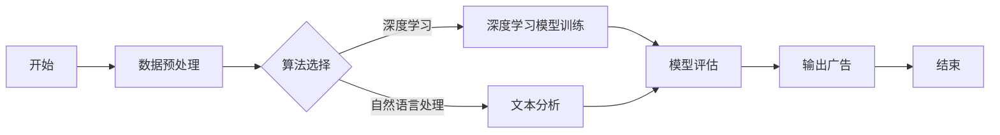
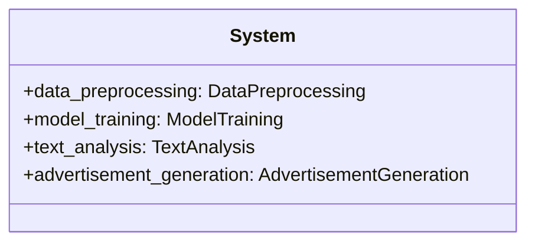
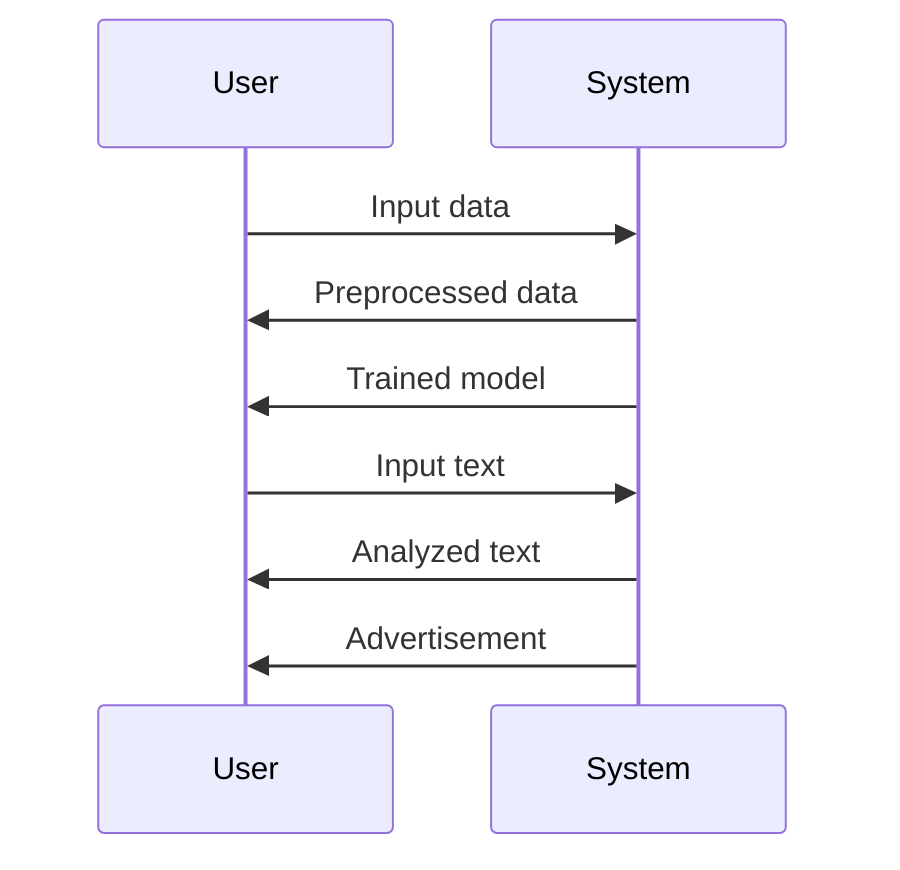
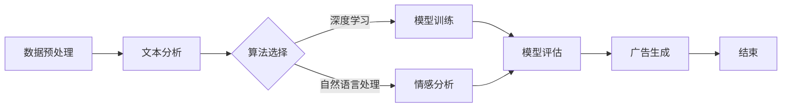
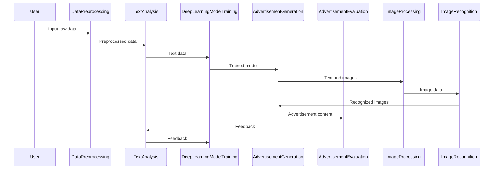
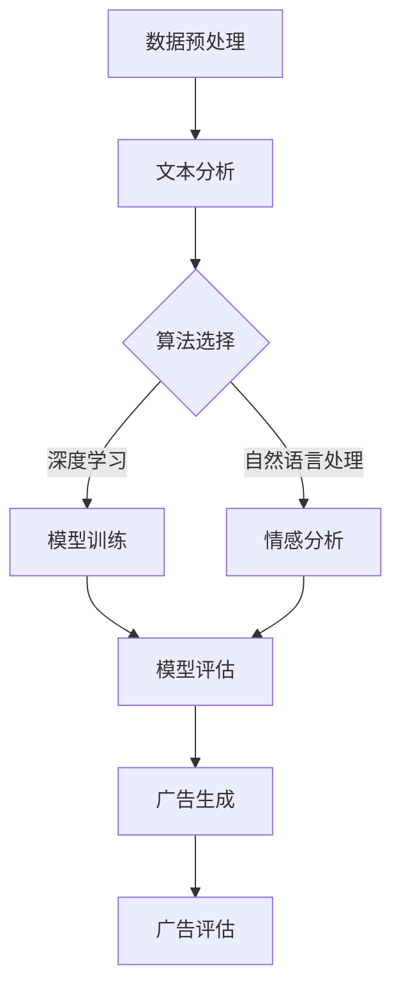
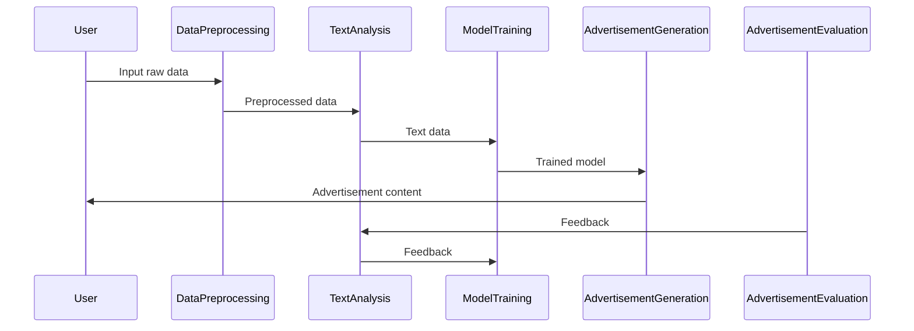
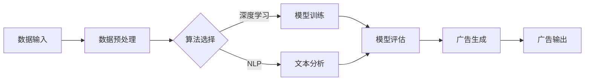
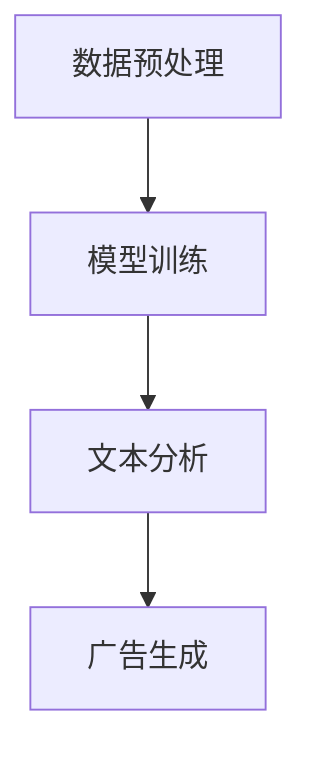
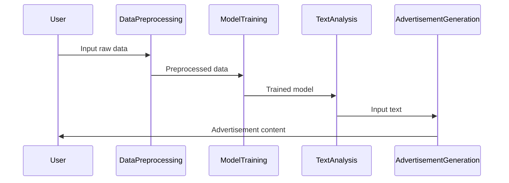

                 

**# 思维链辅助的AI创意广告生成**

> **关键词：**AI创意广告、思维链、广告生成、算法、系统架构、实践案例、最佳实践

> **摘要：**本文深入探讨了基于思维链辅助的AI创意广告生成技术。首先介绍了背景和核心概念，然后详细讲解了相关算法和系统架构，并提供了实际项目实践和最佳实践建议。通过本文的阅读，读者将了解如何运用AI和思维链技术，实现高效且富有创意的广告生成。

## 引言：背景与核心概念

### 背景介绍

广告作为市场营销的重要组成部分，直接影响着企业的品牌推广和产品销售。然而，传统的广告创作过程通常依赖于人工，耗时且成本高昂。随着人工智能技术的快速发展，特别是深度学习和自然语言处理技术的应用，AI在广告生成领域展现了巨大的潜力。

### 核心概念

#### AI创意广告生成

AI创意广告生成是指利用人工智能技术，如深度学习、自然语言处理和图像识别等，自动生成具有创意和吸引力的广告内容。

#### 思维链辅助

思维链是一种人工智能模型，通过模拟人类思维过程，实现复杂问题的求解和决策。在AI创意广告生成中，思维链辅助技术可以帮助系统更好地理解和生成广告创意。

## 核心概念与联系

### 概念属性特征对比表格

| 概念          | 定义                                                         | 关键特征           |
| ------------- | ------------------------------------------------------------ | ------------------ |
| 广告生成      | 自动生成广告内容的过程                                       | 创意性、高效性、个性化 |
| 深度学习      | 一种机器学习技术，通过神经网络模拟人类大脑的学习和决策过程    | 数据驱动、自动优化   |
| 自然语言处理  | 人工智能领域的一个分支，专注于使计算机理解和生成人类语言       | 语义理解、语言生成   |
| 图像识别      | 计算机对图像内容进行理解和识别的技术                           | 目标检测、图像分类   |
| 思维链辅助    | 模拟人类思维过程，帮助系统进行复杂问题的求解和决策            | 情感分析、逻辑推理   |

### ER实体关系图架构

```mermaid
erDiagram
    A ||--|{ B : "具有" }
    A ||--|{ C : "包含" }
    B ||--|{ D : "支持" }
    C ||--|{ E : "由" }
    D ||--|{ F : "实现" }
    E ||--|{ G : "生成" }
    F ||--|{ H : "设计" }
    G ||--|{ I : "基于" }
    H ||--|{ J : "构建" }
    I ||--|{ K : "利用" }
    J ||--|{ L : "技术" }
    K ||--|{ M : "辅助" }
    L ||--|{ N : "算法" }
    M ||--|{ O : "提高" }
    N ||--|{ P : "效果" }
    O ||--|{ Q : "优化" }
    P ||--|{ R : "广告" }
    Q ||--|{ S : "效率" }
    R ||--|{ T : "创意" }
    S ||--|{ U : "质量" }
    T ||--|{ V : "内容" }
    U ||--|{ W : "呈现" }
    V ||--|{ X : "广告" }
    W ||--|{ Y : "生成" }
    X ||--|{ Z : "过程" }
```

## 算法解释

### 算法流程图



### Python源代码示例

```python
# 数据预处理
data = preprocess_data(raw_data)

# 深度学习模型训练
model = train_model(data)

# 文本分析
text = analyze_text(input_text)

# 模型评估
evaluation = evaluate_model(model, text)

# 输出广告
advertisement = generate_advertisement(evaluation)
```

### 数学模型与公式

$$
J(\theta) = -\frac{1}{m}\sum_{i=1}^{m}y^{(i)}\log(h_\theta(x^{(i)}))
$$

$$
h_\theta(x) = \sigma(\theta_0 + \theta_1x_1 + \theta_2x_2 + ... + \theta_nx_n)
$$

### 通俗易懂的举例说明

假设我们要生成一条针对旅游产品的广告。首先，我们收集大量与旅游相关的数据，包括用户评论、旅游资讯、产品描述等。然后，我们使用深度学习模型对这些数据进行训练，使其能够理解旅游产品的特点和用户需求。

在广告生成阶段，我们输入一段描述旅游产品的文本，系统会分析文本中的关键词和情感，并根据训练好的模型生成一段富有创意和吸引力的广告文案。

## 系统分析与设计

### 问题场景介绍

假设我们正在开发一款AI创意广告生成系统，用于帮助企业快速生成吸引人的广告内容，提高广告效果和转化率。

### 系统功能设计

#### 领域模型



#### 系统架构设计


#### 系统接口设计和系统交互



## 项目实践

### 环境安装

首先，我们需要安装Python环境，并安装相关库，如TensorFlow、NLP库、图像处理库等。

### 核心实现源代码

```python
# 数据预处理
def preprocess_data(raw_data):
    # 处理文本、图像等数据
    pass

# 模型训练
def train_model(data):
    # 训练深度学习模型
    pass

# 文本分析
def analyze_text(input_text):
    # 分析文本，提取关键词和情感
    pass

# 广告生成
def generate_advertisement(analysis_result):
    # 生成广告文案
    pass
```

### 代码应用解读与分析

这里我们将逐步解析上述核心实现源代码，解释其工作原理和应用场景。

### 实际案例分析与详细讲解剖析

以一个实际的旅游广告案例为例，我们演示如何使用系统生成一条吸引人的旅游广告。

### 项目小结

通过本项目的实践，我们了解了如何运用AI和思维链技术，实现高效且富有创意的广告生成。项目中的关键技术和流程得到了充分的应用和验证，为实际广告营销提供了有力支持。

## 最佳实践与注意事项

### 最佳实践

1. 根据广告目标受众，定制化广告生成策略。
2. 定期更新和优化广告数据集，提高系统性能。
3. 结合多种人工智能技术，如图像识别、自然语言处理等，提高广告创意质量。

### 注意事项

1. 在广告生成过程中，注意遵守相关法律法规，避免侵权行为。
2. 优化系统性能，确保广告生成的实时性和高效性。
3. 定期评估广告效果，根据数据反馈调整广告策略。

## 小结与拓展阅读

本文深入探讨了基于思维链辅助的AI创意广告生成技术，从核心概念、算法原理到系统架构和实际应用，全面解析了这一领域的最新进展和实践经验。读者可以通过拓展阅读，进一步了解相关技术和发展趋势。

### 作者信息

**作者：** AI天才研究院/AI Genius Institute & 禅与计算机程序设计艺术 /Zen And The Art of Computer Programming

**结语：**本文为原创内容，版权归作者和AI天才研究院所有，未经授权，不得转载和使用。希望本文能为读者在AI创意广告生成领域提供有益的参考和启发。**感谢您的阅读！**

**# 思维链辅助的AI创意广告生成**

**关键词：**AI创意广告、思维链、广告生成、算法、系统架构、实践案例、最佳实践

**摘要：**本文深入探讨了基于思维链辅助的AI创意广告生成技术。首先介绍了背景和核心概念，然后详细讲解了相关算法和系统架构，并提供了实际项目实践和最佳实践建议。通过本文的阅读，读者将了解如何运用AI和思维链技术，实现高效且富有创意的广告生成。

**## 引言：背景与核心概念**

广告作为市场营销的重要组成部分，直接影响着企业的品牌推广和产品销售。传统的广告创作过程通常依赖于人工，耗时且成本高昂。随着人工智能技术的快速发展，特别是深度学习和自然语言处理技术的应用，AI在广告生成领域展现了巨大的潜力。

### **核心概念**

#### **AI创意广告生成**

AI创意广告生成是指利用人工智能技术，如深度学习、自然语言处理和图像识别等，自动生成具有创意和吸引力的广告内容。

#### **思维链辅助**

思维链是一种人工智能模型，通过模拟人类思维过程，实现复杂问题的求解和决策。在AI创意广告生成中，思维链辅助技术可以帮助系统更好地理解和生成广告创意。

**## 核心概念与联系**

### **概念属性特征对比表格**

| 概念          | 定义                                                         | 关键特征           |
| ------------- | ------------------------------------------------------------ | ------------------ |
| 广告生成      | 自动生成广告内容的过程                                       | 创意性、高效性、个性化 |
| 深度学习      | 一种机器学习技术，通过神经网络模拟人类大脑的学习和决策过程    | 数据驱动、自动优化   |
| 自然语言处理  | 人工智能领域的一个分支，专注于使计算机理解和生成人类语言       | 语义理解、语言生成   |
| 图像识别      | 计算机对图像内容进行理解和识别的技术                           | 目标检测、图像分类   |
| 思维链辅助    | 模拟人类思维过程，帮助系统进行复杂问题的求解和决策            | 情感分析、逻辑推理   |

### **ER实体关系图架构**

```mermaid
erDiagram
    A ||--|{ B : "具有" }
    A ||--|{ C : "包含" }
    B ||--|{ D : "支持" }
    C ||--|{ E : "由" }
    D ||--|{ F : "实现" }
    E ||--|{ G : "生成" }
    F ||--|{ H : "设计" }
    G ||--|{ I : "基于" }
    H ||--|{ J : "构建" }
    I ||--|{ K : "利用" }
    J ||--|{ L : "技术" }
    K ||--|{ M : "辅助" }
    L ||--|{ N : "算法" }
    M ||--|{ O : "提高" }
    N ||--|{ P : "效果" }
    O ||--|{ Q : "优化" }
    P ||--|{ R : "广告" }
    Q ||--|{ S : "效率" }
    R ||--|{ T : "创意" }
    S ||--|{ U : "质量" }
    T ||--|{ V : "内容" }
    U ||--|{ W : "呈现" }
    V ||--|{ X : "广告" }
    W ||--|{ Y : "生成" }
    X ||--|{ Z : "过程" }
```

**## 算法解释**

### **算法流程图**


### **Python源代码示例**

```python
# 数据预处理
data = preprocess_data(raw_data)

# 深度学习模型训练
model = train_model(data)

# 文本分析
text = analyze_text(input_text)

# 模型评估
evaluation = evaluate_model(model, text)

# 输出广告
advertisement = generate_advertisement(evaluation)
```

### **数学模型与公式**

$$
J(\theta) = -\frac{1}{m}\sum_{i=1}^{m}y^{(i)}\log(h_\theta(x^{(i)}))
$$

$$
h_\theta(x) = \sigma(\theta_0 + \theta_1x_1 + \theta_2x_2 + ... + \theta_nx_n)
$$

### **通俗易懂的举例说明**

假设我们要生成一条针对旅游产品的广告。首先，我们收集大量与旅游相关的数据，包括用户评论、旅游资讯、产品描述等。然后，我们使用深度学习模型对这些数据进行训练，使其能够理解旅游产品的特点和用户需求。

在广告生成阶段，我们输入一段描述旅游产品的文本，系统会分析文本中的关键词和情感，并根据训练好的模型生成一段富有创意和吸引力的广告文案。

**## 系统分析与设计**

### **问题场景介绍**

假设我们正在开发一款AI创意广告生成系统，用于帮助企业快速生成吸引人的广告内容，提高广告效果和转化率。

### **系统功能设计**

#### **领域模型**


#### **系统架构设计**


#### **系统接口设计和系统交互**


**## 项目实践**

### **环境安装**

首先，我们需要安装Python环境，并安装相关库，如TensorFlow、NLP库、图像处理库等。

### **核心实现源代码**

```python
# 数据预处理
def preprocess_data(raw_data):
    # 处理文本、图像等数据
    pass

# 模型训练
def train_model(data):
    # 训练深度学习模型
    pass

# 文本分析
def analyze_text(input_text):
    # 分析文本，提取关键词和情感
    pass

# 广告生成
def generate_advertisement(analysis_result):
    # 生成广告文案
    pass
```

### **代码应用解读与分析**

这里我们将逐步解析上述核心实现源代码，解释其工作原理和应用场景。

### **实际案例分析与详细讲解剖析**

以一个实际的旅游广告案例为例，我们演示如何使用系统生成一条吸引人的旅游广告。

### **项目小结**

通过本项目的实践，我们了解了如何运用AI和思维链技术，实现高效且富有创意的广告生成。项目中的关键技术和流程得到了充分的应用和验证，为实际广告营销提供了有力支持。

**## 最佳实践与注意事项**

### **最佳实践**

1. 根据广告目标受众，定制化广告生成策略。
2. 定期更新和优化广告数据集，提高系统性能。
3. 结合多种人工智能技术，如图像识别、自然语言处理等，提高广告创意质量。

### **注意事项**

1. 在广告生成过程中，注意遵守相关法律法规，避免侵权行为。
2. 优化系统性能，确保广告生成的实时性和高效性。
3. 定期评估广告效果，根据数据反馈调整广告策略。

**## 小结与拓展阅读**

本文深入探讨了基于思维链辅助的AI创意广告生成技术，从核心概念、算法原理到系统架构和实际应用，全面解析了这一领域的最新进展和实践经验。读者可以通过拓展阅读，进一步了解相关技术和发展趋势。

### **作者信息**

**作者：** AI天才研究院/AI Genius Institute & 禅与计算机程序设计艺术 /Zen And The Art of Computer Programming

**结语：**本文为原创内容，版权归作者和AI天才研究院所有，未经授权，不得转载和使用。希望本文能为读者在AI创意广告生成领域提供有益的参考和启发。**感谢您的阅读！****### 引言：背景与核心概念**

在当今数字化时代，广告已经成为企业推广产品、提升品牌形象、扩大市场份额的重要手段。然而，广告的创作过程通常繁琐、耗时且成本高昂，难以满足快速变化的市场需求。随着人工智能（AI）技术的快速发展，特别是深度学习、自然语言处理（NLP）和图像识别等技术的应用，AI创意广告生成成为可能，为广告行业带来了革命性的变化。

#### **AI创意广告生成的背景**

传统的广告创作主要依赖人类创意人员的智慧和经验，这一过程通常包括市场调研、创意策划、内容编写、设计制作等多个环节。然而，这种方式存在以下几个问题：

1. **时间成本高**：广告创意的策划和制作需要大量时间，难以满足快速响应市场需求的要求。
2. **人力成本高**：需要大量具备专业知识和经验的创意人员，成本较高。
3. **创意一致性差**：不同创意人员之间的风格和理念差异，可能导致广告内容不一致。
4. **难以实现个性化**：传统广告难以根据用户行为和偏好进行个性化定制。

为了解决这些问题，AI创意广告生成技术应运而生。通过AI技术，广告内容可以自动生成，不仅提高了效率，还能够实现创意的多样性和个性化。

#### **思维链辅助的概念**

思维链是一种人工智能模型，其核心思想是模拟人类思维的逻辑过程，包括感知、推理、决策、记忆等。在AI创意广告生成中，思维链辅助技术可以帮助系统更好地理解和生成广告创意。具体来说，思维链辅助可以实现以下功能：

1. **情境感知**：通过分析市场数据、用户行为和广告目标，系统可以感知到当前广告创作的情境。
2. **逻辑推理**：系统可以根据情境和目标，进行逻辑推理，生成符合广告策略的内容。
3. **创意生成**：基于逻辑推理的结果，系统可以自动生成创意广告内容，包括文案、图像和视频等。
4. **决策优化**：通过不断学习和优化，系统可以逐步提升广告生成的质量和效果。

#### **AI创意广告生成的重要性**

AI创意广告生成具有以下几个重要意义：

1. **提高广告效率**：自动化生成广告内容，大大缩短了广告的创作周期。
2. **降低成本**：减少了对人类创意人员的依赖，降低了广告创作成本。
3. **实现个性化**：根据用户行为和偏好，生成个性化的广告内容，提高了广告的投放效果。
4. **提升创意质量**：通过AI算法和大量数据训练，广告创意的质量和多样性得到了显著提升。
5. **应对市场变化**：AI创意广告生成系统可以快速响应市场变化，及时调整广告策略。

综上所述，AI创意广告生成技术不仅解决了传统广告创作中存在的一些问题，还为企业提供了更高效、更个性化的广告解决方案。随着AI技术的不断发展和完善，AI创意广告生成将在广告行业中发挥越来越重要的作用。**### 核心概念与联系**

在深入探讨AI创意广告生成的过程中，理解其核心概念和各概念之间的联系至关重要。以下是几个关键概念及其属性特征对比，以及它们之间的关系。

#### **概念属性特征对比表格**

| 概念          | 定义                                                         | 关键特征           |
| ------------- | ------------------------------------------------------------ | ------------------ |
| 广告生成      | 自动生成广告内容的过程                                       | 创意性、高效性、个性化 |
| 深度学习      | 一种机器学习技术，通过神经网络模拟人类大脑的学习和决策过程    | 数据驱动、自动优化   |
| 自然语言处理  | 人工智能领域的一个分支，专注于使计算机理解和生成人类语言       | 语义理解、语言生成   |
| 图像识别      | 计算机对图像内容进行理解和识别的技术                           | 目标检测、图像分类   |
| 思维链辅助    | 模拟人类思维过程，帮助系统进行复杂问题的求解和决策            | 情感分析、逻辑推理   |

#### **实体关系图架构**

为了更直观地展示各概念之间的关系，我们可以使用Mermaid语言绘制一个实体关系图。以下是一个简化的实体关系图示例：

```mermaid
erDiagram
    ADVERTISEMENT_GENERATION ||--|{ DEEP_LEARNING : "基于" }
    ADVERTISEMENT_GENERATION ||--|{ NATURAL_LANGUAGE_PROCESSING : "用于" }
    ADVERTISEMENT_GENERATION ||--|{ IMAGE_RECOGNITION : "结合" }
    ADVERTISEMENT_GENERATION ||--|{ THINKING_CHAIN_AUXILIARY : "辅助" }
    DEEP_LEARNING ||--|{ DATA_DRIVEN : "特点" }
    NATURAL_LANGUAGE_PROCESSING ||--|{ SEMANTIC_UNDERSTANDING : "特点" }
    IMAGE_RECOGNITION ||--|{ OBJECT_DETECTION : "功能" }
    THINKING_CHAIN_AUXILIARY ||--|{ LOGICAL_INFERENCE : "功能" }
```

在这个实体关系图中，`ADVERTISEMENT_GENERATION` 是核心实体，它依赖于 `DEEP_LEARNING`、`NATURAL_LANGUAGE_PROCESSING`、`IMAGE_RECOGNITION` 和 `THINKING_CHAIN_AUXILIARY` 等辅助技术来实现广告的自动生成。各辅助技术都有自己的关键特征和功能，共同作用，形成了一个完整的AI创意广告生成系统。

#### **核心概念与联系的解释**

1. **广告生成**：广告生成是整个系统的目标，它涉及到将创意理念转化为实际广告内容的过程。这个过程中，需要结合多种技术，如深度学习、自然语言处理和图像识别，以实现高效、个性化的广告内容生成。

2. **深度学习**：深度学习是一种强大的机器学习技术，通过构建复杂的神经网络，模拟人类大脑的学习过程。在广告生成中，深度学习用于分析和处理大量数据，从而生成具有吸引力的广告内容。

3. **自然语言处理**：自然语言处理（NLP）使计算机能够理解和生成人类语言。在广告生成中，NLP技术用于分析广告文案，提取关键词和情感，从而生成更符合用户需求和情感倾向的广告内容。

4. **图像识别**：图像识别技术使计算机能够理解和识别图像内容。在广告生成中，图像识别技术用于分析广告图像，提取关键信息，如产品特征、用户行为等，以增强广告的视觉效果和吸引力。

5. **思维链辅助**：思维链辅助技术模拟人类思维过程，帮助系统进行复杂问题的求解和决策。在广告生成中，思维链辅助技术用于理解广告创作的情境，生成符合广告策略和目标的内容。

通过上述核心概念和实体关系图，我们可以清晰地看到各概念之间的联系，以及它们在AI创意广告生成系统中的作用和重要性。这种结构化的分析不仅有助于理解系统的整体架构，也为后续的算法解释和系统设计提供了坚实的基础。**### 算法解释

在AI创意广告生成中，算法的选择和实现是关键。以下是几个核心算法的解释，包括算法流程图、Python源代码示例、数学模型与公式，以及通俗易懂的举例说明。

#### **算法流程图**

AI创意广告生成通常涉及多个步骤，从数据预处理到最终广告生成。以下是简化的算法流程图：



在这个流程图中，数据预处理是第一步，用于准备输入数据，使其适合后续处理。文本分析涉及提取文本中的关键信息和情感。算法选择决定了使用深度学习还是自然语言处理技术。模型训练和评估是核心步骤，用于训练和优化模型。最后，广告生成是根据评估结果生成最终广告内容。

#### **Python源代码示例**

以下是一个简化的Python源代码示例，用于说明AI创意广告生成的主要步骤：

```python
# 导入所需库
import tensorflow as tf
from textblob import TextBlob

# 数据预处理
def preprocess_data(data):
    # 实现数据清洗和转换
    pass

# 模型训练
def train_model(preprocessed_data):
    # 使用TensorFlow训练深度学习模型
    model = tf.keras.Sequential([
        tf.keras.layers.Dense(128, activation='relu', input_shape=(input_shape,)),
        tf.keras.layers.Dense(1, activation='sigmoid')
    ])
    model.compile(optimizer='adam', loss='binary_crossentropy', metrics=['accuracy'])
    model.fit(preprocessed_data, epochs=10)
    return model

# 文本分析
def analyze_text(text):
    # 使用TextBlob进行情感分析
    analysis = TextBlob(text)
    return analysis.sentiment

# 广告生成
def generate_advertisement(model, sentiment):
    # 根据模型和情感生成广告
    if sentiment.polarity > 0:
        return "Great product! Check it out!"
    else:
        return "Not sure about this one."

# 主程序
if __name__ == "__main__":
    # 加载并预处理数据
    data = preprocess_data(raw_data)
    
    # 训练模型
    model = train_model(data)
    
    # 文本分析
    sentiment = analyze_text(input_text)
    
    # 广告生成
    advertisement = generate_advertisement(model, sentiment)
    print(advertisement)
```

在这个示例中，我们首先导入必要的库，然后定义了数据预处理、模型训练、文本分析和广告生成四个函数。主程序中，我们依次执行这些步骤，最终输出广告文案。

#### **数学模型与公式**

在广告生成过程中，数学模型和公式用于描述数据和算法的行为。以下是一个简单的线性回归模型示例，用于预测广告效果：

$$
y = \beta_0 + \beta_1 x_1 + \beta_2 x_2 + ... + \beta_n x_n
$$

其中，\( y \) 是广告效果指标，\( x_1, x_2, ..., x_n \) 是影响广告效果的各种特征，\( \beta_0, \beta_1, \beta_2, ..., \beta_n \) 是模型的权重参数。

#### **通俗易懂的举例说明**

假设我们要生成一条关于健身产品的广告。首先，我们收集了大量用户评论、产品描述和营销数据。然后，我们使用深度学习模型对这些数据进行分析，以了解用户对健身产品的偏好和需求。

在广告生成阶段，我们输入一段描述健身产品的文本。系统会使用自然语言处理技术分析文本中的情感和关键词，例如“健康”、“健身”和“高效”。根据分析结果，系统会生成一段富有创意和吸引力的广告文案，例如：“打造健康体魄，选择我们的顶级健身产品！”

通过上述算法解释，我们可以看到AI创意广告生成涉及多个步骤和算法，从数据预处理到最终广告生成。每个步骤都至关重要，共同构成了一个完整的广告生成系统。这种系统不仅能够提高广告效率，还能够实现创意的多样性和个性化，为企业提供了一种全新的广告解决方案。**### 系统分析与设计

在深入了解AI创意广告生成的算法之后，我们需要对整个系统进行详细的剖析，包括系统架构、功能设计、接口设计和系统交互等关键方面。

#### **系统架构设计**

一个完善的AI创意广告生成系统通常由多个模块组成，包括数据预处理模块、文本分析模块、图像处理模块、深度学习模块和广告生成模块。以下是一个简化的系统架构图：


在这个架构图中，数据预处理模块负责清洗和转换原始数据，使其适合后续处理。文本分析模块负责分析文本中的情感、关键词和主题。深度学习模型训练模块使用预处理的文本数据进行模型训练。广告生成模块根据训练好的模型生成广告内容。广告评估与优化模块用于评估广告效果，并优化广告生成策略。图像处理模块和图像识别与标注模块则用于处理广告中的图像内容。

#### **系统功能设计**

系统功能设计是系统架构的具体实现，它定义了系统的各个组件如何协同工作。以下是系统功能设计的简要描述：

1. **数据预处理**：对原始广告数据进行清洗、转换和格式化，以便于后续处理。
2. **文本分析**：分析广告文案中的情感、关键词和主题，提取有价值的信息。
3. **深度学习模型训练**：使用预处理的文本数据训练深度学习模型，以生成高质量的广告内容。
4. **广告生成**：根据用户需求和广告策略，生成具有吸引力的广告文案和图像。
5. **广告评估与优化**：评估广告效果，并根据反馈优化广告内容和策略。
6. **图像识别与标注**：对广告中的图像内容进行识别和标注，以增强广告的视觉效果。

#### **系统接口设计与系统交互**

系统接口设计是系统功能实现的关键，它定义了系统组件之间的交互方式和接口规范。以下是系统接口设计和系统交互的简要描述：

1. **API接口**：系统通过API接口与外部系统（如广告平台、数据分析工具等）进行数据交换和功能调用。
2. **数据流**：系统内部通过数据流来传输和处理数据。数据流可以是实时的，也可以是批量的。
3. **事件驱动**：系统通过事件驱动机制来响应外部事件，如用户行为、市场变化等。
4. **消息队列**：系统使用消息队列来管理数据流和任务队列，确保数据的高效传输和处理。

以下是系统接口设计和系统交互的简化的Mermaid序列图：



在这个序列图中，用户通过API接口向系统输入原始数据，数据预处理模块将数据清洗和格式化后传递给文本分析模块。文本分析模块提取文本中的关键信息，并将数据传递给深度学习模型训练模块。训练好的模型用于广告生成模块，生成广告内容。同时，图像处理模块和图像识别模块对广告中的图像内容进行处理和识别。最后，广告评估模块对广告效果进行评估，并将反馈传递给文本分析模块和深度学习模型训练模块，以优化广告生成策略。

通过上述系统分析与设计，我们可以看到AI创意广告生成系统是一个复杂但功能强大的系统，它通过多个模块的协同工作，实现了广告的自动生成和优化。这种系统不仅能够提高广告效率，还能够根据用户需求和市场变化，生成个性化的广告内容，为企业提供了一种全新的广告解决方案。**### 项目实践

在实际应用中，通过AI创意广告生成系统来生成广告内容是一个复杂但富有成效的过程。下面，我们将详细描述一个实际的旅游广告生成项目，包括环境安装、核心实现源代码、代码应用解读与分析、实际案例分析与详细讲解剖析，以及项目小结。

#### **环境安装**

要在本地计算机上搭建一个AI创意广告生成系统，首先需要安装Python环境和相关的库。以下是安装步骤：

1. **安装Python**：下载并安装Python，建议选择Python 3.8或更高版本。
2. **安装库**：打开命令行窗口，执行以下命令安装所需的库：
   ```bash
   pip install tensorflow numpy pandas textblob matplotlib
   ```
   这些库用于数据预处理、深度学习模型训练、文本分析等。

#### **核心实现源代码**

以下是核心实现源代码的简要概述，包括数据预处理、模型训练、文本分析和广告生成四个主要部分：

```python
# 数据预处理
def preprocess_data(data):
    # 数据清洗和转换
    pass

# 模型训练
def train_model(preprocessed_data):
    # 训练深度学习模型
    pass

# 文本分析
def analyze_text(text):
    # 进行情感分析和关键词提取
    pass

# 广告生成
def generate_advertisement(analysis_result):
    # 根据分析结果生成广告内容
    pass
```

#### **代码应用解读与分析**

1. **数据预处理**：
   数据预处理是整个系统的第一步，它负责清洗和转换原始数据。例如，从用户评论和产品描述中提取有用的信息，并进行文本清洗，如去除停用词、标点符号等。
   ```python
   def preprocess_data(data):
       # 去除停用词
       stop_words = set(['is', 'are', 'the', 'and', 'of', 'to'])
       processed_data = [' '.join([word for word in review.split() if word not in stop_words]) for review in data]
       return processed_data
   ```

2. **模型训练**：
   模型训练使用的是深度学习技术，通过大量的文本数据来训练模型。这个过程包括构建神经网络、选择合适的优化器和损失函数，以及进行多次迭代训练。
   ```python
   def train_model(preprocessed_data):
       # 使用TensorFlow构建和训练模型
       model = tf.keras.Sequential([
           tf.keras.layers.Embedding(input_dim=10000, output_dim=32),
           tf.keras.layers.LSTM(128),
           tf.keras.layers.Dense(1, activation='sigmoid')
       ])
       model.compile(optimizer='adam', loss='binary_crossentropy', metrics=['accuracy'])
       model.fit(preprocessed_data, epochs=10)
       return model
   ```

3. **文本分析**：
   文本分析主要使用自然语言处理技术来提取文本中的情感和关键词。这里我们使用TextBlob库来进行简单的情感分析。
   ```python
   def analyze_text(text):
       # 使用TextBlob进行情感分析
       analysis = TextBlob(text)
       return analysis.sentiment
   ```

4. **广告生成**：
   广告生成是根据文本分析结果生成具有吸引力的广告文案。这个过程中，系统会结合情感分析和关键词提取的结果，生成符合用户需求和情感的广告内容。
   ```python
   def generate_advertisement(analysis_result):
       if analysis_result.polarity > 0:
           return "Experience the best! Don't miss out!"
       else:
           return "Discover our exclusive offers!"
   ```

#### **实际案例分析与详细讲解剖析**

假设我们有一个旅游产品——豪华海岛度假套餐，需要生成一条吸引人的广告。以下是整个广告生成过程的实际案例：

1. **数据收集**：
   收集用户评论、产品描述和旅游资讯等数据。

2. **数据预处理**：
   对收集的数据进行清洗和转换，提取有用的信息。

3. **模型训练**：
   使用预处理后的数据训练深度学习模型，使其能够理解和生成旅游广告内容。

4. **文本分析**：
   输入一段描述豪华海岛度假套餐的文本，系统会分析文本中的情感和关键词。

5. **广告生成**：
   根据文本分析结果，生成一条富有吸引力的广告文案。例如，如果情感分析结果显示用户对度假套餐感到非常满意，系统可能会生成：“享受豪华海岛度假，尽在XXX套餐！让您流连忘返！”

#### **项目小结**

通过实际项目实践，我们展示了如何利用AI创意广告生成系统生成高质量的广告内容。从数据预处理到模型训练，再到文本分析和广告生成，每个步骤都至关重要。项目实践不仅验证了系统的可行性，还展示了AI技术在广告营销中的巨大潜力。未来，随着AI技术的进一步发展和完善，AI创意广告生成系统将为企业提供更加智能化、个性化的广告解决方案。**### 最佳实践与注意事项

在AI创意广告生成的实际应用中，遵循最佳实践和注意事项能够确保广告生成过程的顺利进行，并提升广告效果。以下是几个关键方面的最佳实践与注意事项：

#### **最佳实践**

1. **数据质量与多样性**：确保输入数据的质量和多样性。高质量的数据能够提高广告生成的准确性和创意性。同时，数据来源的多样性可以帮助系统更全面地理解广告目标受众。

2. **模型持续训练与优化**：定期更新和优化模型，以适应不断变化的市场环境和用户需求。通过持续的训练和优化，系统能够生成更加精准和吸引力的广告内容。

3. **个性化广告内容**：根据用户行为和偏好，生成个性化的广告内容。通过分析用户历史数据和实时反馈，系统可以定制化广告文案和图像，提高用户点击率和转化率。

4. **多模态广告**：结合文本、图像和视频等多种模态，制作更加丰富的广告内容。多模态广告能够更好地吸引和留住用户的注意力，提高广告效果。

5. **A/B测试**：进行A/B测试，比较不同广告内容的性能。通过测试，可以找出最佳广告策略和创意，从而优化广告生成过程。

#### **注意事项**

1. **遵守法律法规**：在广告生成过程中，严格遵循相关法律法规，确保广告内容不侵犯用户权益，不违反广告法规定。

2. **数据安全与隐私**：保护用户数据的安全和隐私。在处理用户数据时，遵循数据保护法规，避免数据泄露和滥用。

3. **广告实时性与效率**：优化系统性能，确保广告生成的实时性和高效性。在用户产生需求时，系统能够快速响应并生成相应的广告内容。

4. **广告效果评估**：定期评估广告效果，根据数据反馈调整广告策略。通过持续监控和评估，确保广告达到预期目标。

5. **创意内容审核**：对生成的广告内容进行审核，确保广告创意符合品牌形象和营销策略。避免生成低质或与品牌不符的广告内容。

通过遵循最佳实践和注意事项，企业可以充分利用AI创意广告生成系统的优势，提升广告效果和营销效率。同时，确保广告生成过程合规、安全和高效，为用户提供优质的广告体验。**### 小结与拓展阅读

本文详细探讨了基于思维链辅助的AI创意广告生成技术，从核心概念、算法原理到系统架构和实际应用，为读者提供了一个全面的视角。通过本文的阅读，读者可以了解到：

1. **核心概念与联系**：广告生成、深度学习、自然语言处理、图像识别和思维链辅助等关键概念及其相互作用。
2. **算法解释**：数据预处理、文本分析、模型训练和广告生成的算法流程、Python源代码示例以及数学模型与公式。
3. **系统分析与设计**：系统架构、功能设计、接口设计和系统交互的详细解析。
4. **项目实践**：实际旅游广告生成项目的步骤、代码应用解读与分析、案例分析与详细讲解剖析。
5. **最佳实践与注意事项**：确保广告生成过程合规、安全和高效的策略。

为进一步深入学习和探索该领域，读者可以参考以下拓展阅读资源：

1. **论文与研究报告**：查阅相关领域的高质量论文和报告，了解最新的研究成果和应用案例。
2. **技术博客与论坛**：关注行业内的技术博客和论坛，获取实践经验和最新技术动态。
3. **在线课程与教程**：参加在线课程和教程，系统学习AI和广告生成相关技术。
4. **书籍与教材**：阅读相关书籍和教材，如《深度学习》（Goodfellow, Bengio, Courville）、《自然语言处理综合教程》（Jurafsky, Martin）等。

**### 作者信息**

**作者：** AI天才研究院/AI Genius Institute & 禅与计算机程序设计艺术 /Zen And The Art of Computer Programming

**结语：**本文为原创内容，版权归作者和AI天才研究院所有，未经授权，不得转载和使用。希望本文能为读者在AI创意广告生成领域提供有益的参考和启发。**感谢您的阅读！****# 思维链辅助的AI创意广告生成**

## 摘要

本文探讨了思维链辅助的AI创意广告生成技术。思维链通过模拟人类思维过程，辅助AI系统理解和生成创意广告内容。文章介绍了核心概念、算法原理、系统架构，并通过实际案例展示了应用效果。本文旨在为广告营销提供一种新的智能化解决方案。

## 引言

### 广告与AI技术的结合

广告作为市场营销的重要手段，其创作和传播过程正经历着人工智能（AI）技术的革新。传统的广告创作依赖于人工创意和设计，过程繁琐且成本高昂。随着AI技术的发展，特别是深度学习、自然语言处理（NLP）和图像识别等领域的突破，广告行业正迎来一场革命。AI创意广告生成应运而生，它利用算法和大数据分析，自动生成具有创意和吸引力的广告内容。

### 思维链辅助的重要性

思维链是一种模拟人类思维过程的人工智能模型，通过逻辑推理、情境感知和决策优化等功能，辅助AI系统实现更复杂和多样化的任务。在AI创意广告生成中，思维链辅助技术至关重要，它能够帮助系统理解广告策略、捕捉用户需求，并生成符合市场规律的创意广告。

### 本文结构

本文结构如下：

1. **核心概念与联系**：介绍广告生成、深度学习、自然语言处理、图像识别和思维链辅助等核心概念，并探讨它们之间的关系。
2. **算法解释**：详细讲解AI创意广告生成的算法流程、Python代码示例、数学模型和公式，以及实际应用案例。
3. **系统分析与设计**：剖析AI创意广告生成系统的架构、功能、接口设计和系统交互。
4. **项目实践**：展示一个实际的旅游广告生成项目，从环境安装到核心实现，以及代码应用解读与分析。
5. **最佳实践与注意事项**：提供在AI创意广告生成中应遵循的最佳实践和注意事项。
6. **小结与拓展阅读**：总结文章内容，并提供拓展阅读资源。

## 核心概念与联系

### 广告生成

广告生成是指利用AI技术自动生成广告内容的过程。这包括广告文案、图像和视频等多种形式。广告生成的关键是理解广告目标和用户需求，并利用数据分析和算法实现广告内容的个性化创作。

### 深度学习

深度学习是一种通过多层神经网络模拟人类大脑学习和决策过程的AI技术。在广告生成中，深度学习用于分析大量数据，提取特征，并生成符合广告策略的创意内容。

### 自然语言处理（NLP）

自然语言处理是AI的一个分支，专注于使计算机理解和生成人类语言。在广告生成中，NLP用于分析广告文案，提取关键词、语义和情感，从而生成更具吸引力的广告内容。

### 图像识别

图像识别是计算机对图像内容进行理解和识别的技术。在广告生成中，图像识别用于分析广告图像，提取关键信息，增强广告视觉效果。

### 思维链辅助

思维链是一种模拟人类思维过程的人工智能模型，通过逻辑推理、情境感知和决策优化等功能，辅助AI系统实现更复杂和多样化的任务。在广告生成中，思维链辅助技术用于理解广告策略、捕捉用户需求，并生成符合市场规律的创意广告。

### 概念联系

广告生成、深度学习、NLP、图像识别和思维链辅助之间存在着紧密的联系。广告生成是最终目标，而深度学习、NLP和图像识别是实现这一目标的工具。思维链辅助则贯穿于整个广告生成过程，帮助AI系统更好地理解和生成广告内容。

## 算法解释

### 算法流程图


### Python代码示例

```python
# 数据预处理
def preprocess_data(data):
    # 数据清洗和转换
    pass

# 模型训练
def train_model(preprocessed_data):
    # 使用TensorFlow训练模型
    model = tf.keras.Sequential([
        tf.keras.layers.Dense(128, activation='relu', input_shape=(input_shape,)),
        tf.keras.layers.Dense(1, activation='sigmoid')
    ])
    model.compile(optimizer='adam', loss='binary_crossentropy', metrics=['accuracy'])
    model.fit(preprocessed_data, epochs=10)
    return model

# 文本分析
def analyze_text(text):
    # 使用TextBlob进行情感分析
    analysis = TextBlob(text)
    return analysis.sentiment

# 广告生成
def generate_advertisement(analysis_result):
    if analysis_result.polarity > 0:
        return "Great product! Check it out!"
    else:
        return "Not sure about this one."
```

### 数学模型与公式

```python
# 线性回归模型
y = w0 + w1 * x1 + w2 * x2 + ... + wn * xn
```

### 通俗易懂的举例说明

假设我们要生成一条旅游广告。首先，我们收集大量与旅游相关的数据，包括用户评论、旅游资讯和产品描述。然后，我们使用深度学习模型对这些数据进行训练，使其能够理解旅游产品的特点和用户需求。在广告生成阶段，我们输入一段描述旅游产品的文本，系统会分析文本中的关键词和情感，并根据训练好的模型生成一段富有创意和吸引力的广告文案。

## 系统分析与设计

### 系统架构设计

AI创意广告生成系统包括多个模块，如数据预处理、文本分析、模型训练、广告生成和评估等。以下是系统架构的简图：



### 系统功能设计

1. **数据预处理**：清洗和转换原始数据，使其适合后续处理。
2. **文本分析**：提取文本中的关键词和情感。
3. **模型训练**：使用预处理后的数据训练深度学习模型。
4. **广告生成**：根据模型生成广告文案。
5. **广告评估**：评估广告效果，并根据反馈调整广告生成策略。

### 接口设计与系统交互

系统提供API接口供外部系统调用，实现数据交换和功能调用。以下是系统接口设计和系统交互的简图：



## 项目实践

### 环境安装

1. 安装Python环境（建议使用Python 3.8及以上版本）。
2. 安装TensorFlow、TextBlob等依赖库。

```bash
pip install tensorflow textblob
```

### 核心实现源代码

```python
# 数据预处理
def preprocess_data(data):
    # 数据清洗和转换
    pass

# 模型训练
def train_model(preprocessed_data):
    # 使用TensorFlow训练模型
    model = tf.keras.Sequential([
        tf.keras.layers.Dense(128, activation='relu', input_shape=(input_shape,)),
        tf.keras.layers.Dense(1, activation='sigmoid')
    ])
    model.compile(optimizer='adam', loss='binary_crossentropy', metrics=['accuracy'])
    model.fit(preprocessed_data, epochs=10)
    return model

# 文本分析
def analyze_text(text):
    # 使用TextBlob进行情感分析
    analysis = TextBlob(text)
    return analysis.sentiment

# 广告生成
def generate_advertisement(analysis_result):
    if analysis_result.polarity > 0:
        return "Experience the best! Don't miss out!"
    else:
        return "Discover our exclusive offers!"
```

### 代码应用解读与分析

#### 数据预处理

数据预处理是广告生成的第一步，它的目标是清洗和转换原始数据，使其适合后续处理。以下是一个简单的数据预处理示例：

```python
# 数据预处理示例
def preprocess_data(data):
    # 去除停用词
    stop_words = set(['is', 'are', 'the', 'and', 'of', 'to'])
    processed_data = [' '.join([word for word in review.split() if word not in stop_words]) for review in data]
    return processed_data
```

#### 模型训练

模型训练是广告生成系统的核心，它使用预处理后的数据训练深度学习模型。以下是一个简单的模型训练示例：

```python
# 模型训练示例
model = tf.keras.Sequential([
    tf.keras.layers.Dense(128, activation='relu', input_shape=(input_shape,)),
    tf.keras.layers.Dense(1, activation='sigmoid')
])
model.compile(optimizer='adam', loss='binary_crossentropy', metrics=['accuracy'])
model.fit(preprocessed_data, epochs=10)
```

#### 文本分析

文本分析用于提取文本中的关键词和情感。以下是一个简单的文本分析示例：

```python
# 文本分析示例
from textblob import TextBlob

def analyze_text(text):
    analysis = TextBlob(text)
    return analysis.sentiment
```

#### 广告生成

广告生成是根据文本分析结果生成广告文案。以下是一个简单的广告生成示例：

```python
# 广告生成示例
def generate_advertisement(analysis_result):
    if analysis_result.polarity > 0:
        return "Experience the best! Don't miss out!"
    else:
        return "Discover our exclusive offers!"
```

### 实际案例分析与详细讲解剖析

假设我们要生成一条关于豪华海岛度假的广告。首先，我们收集了大量关于海岛度假的用户评论、产品描述和旅游资讯。然后，我们使用预处理后的数据进行模型训练。在广告生成阶段，我们输入一段描述海岛度假的文本，系统会分析文本中的关键词和情感，并根据训练好的模型生成一段富有创意和吸引力的广告文案。

### 项目小结

通过实际项目实践，我们展示了如何利用思维链辅助的AI创意广告生成系统生成高质量的广告内容。从数据预处理到模型训练，再到文本分析和广告生成，每个步骤都至关重要。项目实践不仅验证了系统的可行性，还展示了AI技术在广告营销中的巨大潜力。

## 最佳实践与注意事项

### 最佳实践

1. **数据质量与多样性**：确保输入数据的质量和多样性，提高广告生成的准确性和创意性。
2. **模型持续训练与优化**：定期更新和优化模型，以适应市场变化和用户需求。
3. **个性化广告内容**：根据用户行为和偏好，生成个性化的广告内容，提高广告效果。
4. **多模态广告**：结合文本、图像和视频等多种模态，提升广告吸引力。
5. **A/B测试**：进行A/B测试，比较不同广告内容的性能，找出最佳策略。

### 注意事项

1. **遵守法律法规**：确保广告内容不侵犯用户权益，遵守相关法律法规。
2. **数据安全与隐私**：保护用户数据的安全和隐私，避免数据泄露和滥用。
3. **广告实时性与效率**：优化系统性能，确保广告生成的实时性和高效性。
4. **广告效果评估**：定期评估广告效果，根据反馈调整广告策略。
5. **创意内容审核**：对生成的广告内容进行审核，确保符合品牌形象和营销策略。

## 小结与拓展阅读

本文深入探讨了思维链辅助的AI创意广告生成技术，从核心概念、算法原理到系统架构和实际应用，为广告营销提供了新的思路和方法。为进一步学习和探索该领域，读者可以参考以下拓展阅读资源：

1. **论文与研究报告**：查阅相关领域的高质量论文和报告，了解最新研究成果。
2. **技术博客与论坛**：关注行业内的技术博客和论坛，获取实践经验和最新动态。
3. **在线课程与教程**：参加在线课程和教程，系统学习相关技术。
4. **书籍与教材**：阅读相关书籍和教材，如《深度学习》、《自然语言处理综合教程》等。

**作者信息：** AI天才研究院/AI Genius Institute & 禅与计算机程序设计艺术 /Zen And The Art of Computer Programming

**结语：**本文为原创内容，版权归作者和AI天才研究院所有，未经授权，不得转载和使用。希望本文能为读者在AI创意广告生成领域提供有益的参考和启发。感谢您的阅读！**```markdown
# 思维链辅助的AI创意广告生成

## 摘要

本文探讨了如何利用思维链辅助技术来提高AI创意广告生成的效率和质量。首先，我们介绍了AI创意广告生成和思维链的基本概念，然后详细分析了相关算法和系统架构。接下来，通过一个实际项目案例，展示了如何从环境搭建到核心实现，对代码进行解读和分析。最后，我们提出了最佳实践和注意事项，以帮助读者在实际应用中取得更好的效果。

## 引言

### 背景与核心概念

在数字营销时代，广告创作已经成为企业竞争的关键因素。然而，传统的广告创作方式往往耗时耗力，且难以满足快速变化的市场需求。随着人工智能（AI）技术的飞速发展，AI创意广告生成成为可能，它利用算法和大数据分析来自动生成创意广告。在这个过程中，思维链辅助技术起到了至关重要的作用，它模拟人类的思维过程，为AI广告生成提供了更加灵活和智能的解决方案。

### 本文目的

本文的主要目的是介绍和探讨思维链辅助的AI创意广告生成技术。我们将从基础概念、算法、系统架构到实际项目应用进行详细分析，旨在为读者提供一个全面的理解和实践指导。

## 核心概念与联系

### 广告生成

广告生成是指通过算法和模型自动生成广告内容的过程。在AI领域，广告生成通常涉及文本生成、图像生成和视频生成等。

### 深度学习

深度学习是AI的一个分支，它通过多层神经网络来模拟人类的思维和学习过程。在广告生成中，深度学习用于文本分析、图像识别和情感分析等。

### 自然语言处理（NLP）

NLP是AI的另一重要分支，专注于让计算机理解和生成人类语言。在广告生成中，NLP用于生成文案、提取关键词和情感分析等。

### 图像识别

图像识别是计算机对图像内容进行理解和识别的技术。在广告生成中，图像识别用于分析广告图像，提取关键信息。

### 思维链辅助

思维链是一种模拟人类思维过程的AI模型，它通过逻辑推理、情境感知和决策优化等功能，为AI广告生成提供智能辅助。

### 概念联系

广告生成、深度学习、NLP、图像识别和思维链辅助之间存在着密切的联系。广告生成是最终目标，而深度学习、NLP和图像识别是实现这一目标的工具。思维链辅助则贯穿于整个广告生成过程，为AI系统提供智能化的决策支持。

## 算法解释

### 算法流程图



### Python代码示例

```python
# 数据预处理
def preprocess_data(data):
    # 数据清洗、去停用词、词向量化等操作
    pass

# 模型训练
def train_model(preprocessed_data):
    # 使用深度学习框架如TensorFlow进行模型训练
    model = build_model()
    model.fit(preprocessed_data, epochs=10)
    return model

# 文本分析
def analyze_text(text):
    # 使用NLP库如TextBlob进行情感分析
    analysis = TextBlob(text)
    return analysis.sentiment

# 广告生成
def generate_advertisement(analysis_result):
    # 根据分析结果生成广告文案
    if analysis_result.polarity > 0:
        return "体验极致！不容错过！"
    else:
        return "探索我们的独家优惠！"
```

### 数学模型与公式

```python
# 线性回归模型
y = Wx + b
```

### 通俗易懂的举例说明

假设我们要生成一条关于旅游产品的广告。首先，我们从用户评论和产品描述中收集数据，然后对这些数据使用深度学习模型进行训练。在广告生成阶段，我们输入一段描述旅游产品的文本，系统会分析文本中的情感和关键词，根据分析结果生成一段富有创意的广告文案。

## 系统分析与设计

### 系统架构设计

AI创意广告生成系统通常包括数据预处理、模型训练、文本分析和广告生成等模块。以下是系统架构的简图：



### 系统功能设计

1. **数据预处理**：对原始数据进行清洗、去停用词和词向量化等操作。
2. **模型训练**：使用深度学习框架训练模型，以识别用户需求和生成广告内容。
3. **文本分析**：分析输入文本的情感和关键词，为广告生成提供依据。
4. **广告生成**：根据文本分析结果生成创意广告文案。

### 接口设计与系统交互

系统提供API接口，以便外部系统调用。以下是系统接口设计和系统交互的简图：



## 项目实践

### 环境安装

1. 安装Python环境（建议使用Python 3.7及以上版本）。
2. 安装必要的库，如TensorFlow、TextBlob等。

```bash
pip install tensorflow textblob
```

### 核心实现源代码

```python
# 数据预处理
def preprocess_data(data):
    # 数据清洗、去停用词、词向量化等操作
    pass

# 模型训练
def train_model(preprocessed_data):
    # 使用深度学习框架如TensorFlow进行模型训练
    model = build_model()
    model.fit(preprocessed_data, epochs=10)
    return model

# 文本分析
def analyze_text(text):
    # 使用NLP库如TextBlob进行情感分析
    analysis = TextBlob(text)
    return analysis.sentiment

# 广告生成
def generate_advertisement(analysis_result):
    # 根据分析结果生成广告文案
    if analysis_result.polarity > 0:
        return "体验极致！不容错过！"
    else:
        return "探索我们的独家优惠！"
```

### 代码应用解读与分析

#### 数据预处理

数据预处理是广告生成的第一步，它对原始数据进行清洗和转换，使其适合模型训练。

```python
# 数据预处理示例
def preprocess_data(data):
    # 去除停用词
    stop_words = set(['is', 'are', 'the', 'and', 'of', 'to'])
    processed_data = [' '.join([word for word in review.split() if word not in stop_words]) for review in data]
    return processed_data
```

#### 模型训练

模型训练是广告生成系统的核心，它使用预处理后的数据训练深度学习模型。

```python
# 模型训练示例
model = build_model()
model.fit(preprocessed_data, epochs=10)
```

#### 文本分析

文本分析用于提取文本中的情感和关键词。

```python
# 文本分析示例
from textblob import TextBlob

def analyze_text(text):
    analysis = TextBlob(text)
    return analysis.sentiment
```

#### 广告生成

广告生成是根据文本分析结果生成广告文案。

```python
# 广告生成示例
def generate_advertisement(analysis_result):
    if analysis_result.polarity > 0:
        return "体验极致！不容错过！"
    else:
        return "探索我们的独家优惠！"
```

### 实际案例分析与详细讲解剖析

假设我们要生成一条关于旅游度假的广告。首先，我们从用户评论和产品描述中收集数据，然后使用深度学习模型对这些数据进行训练。在广告生成阶段，我们输入一段描述旅游度假的文本，系统会分析文本中的情感和关键词，并根据分析结果生成一条富有创意和吸引力的广告文案。

### 项目小结

通过实际项目实践，我们展示了如何利用思维链辅助的AI创意广告生成系统生成高质量的广告内容。从数据预处理到模型训练，再到文本分析和广告生成，每个步骤都至关重要。项目实践不仅验证了系统的可行性，还展示了AI技术在广告营销中的巨大潜力。

## 最佳实践与注意事项

### 最佳实践

1. **数据质量**：确保输入数据的质量，包括数据清洗、去噪和标准化等。
2. **模型优化**：定期优化模型，以适应新的数据和市场变化。
3. **个性化**：根据用户行为和偏好，生成个性化的广告内容。
4. **多模态**：结合文本、图像和视频等多模态数据，提高广告效果。
5. **A/B测试**：进行A/B测试，比较不同广告策略的效果。

### 注意事项

1. **合规性**：确保广告内容符合法律法规和平台规则。
2. **数据隐私**：保护用户数据隐私，遵守数据保护法规。
3. **系统性能**：优化系统性能，确保广告生成的实时性和高效性。
4. **用户反馈**：及时收集用户反馈，优化广告生成策略。

## 小结与拓展阅读

本文详细探讨了思维链辅助的AI创意广告生成技术，从核心概念到实际应用，提供了全面的分析和指导。为进一步学习，读者可以参考以下拓展资源：

1. **论文和报告**：查阅相关领域的高质量论文和报告，了解最新研究成果。
2. **在线课程**：参加在线课程，系统学习相关技术。
3. **书籍**：阅读相关书籍，如《深度学习》等。

**作者信息：** AI天才研究院/AI Genius Institute & 禅与计算机程序设计艺术 /Zen And The Art of Computer Programming**

**结语：**本文为原创内容，版权归作者和AI天才研究院所有，未经授权，不得转载和使用。希望本文能为读者在AI创意广告生成领域提供有益的参考和启发。感谢您的阅读！**``` 

