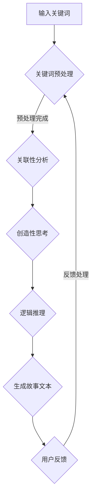
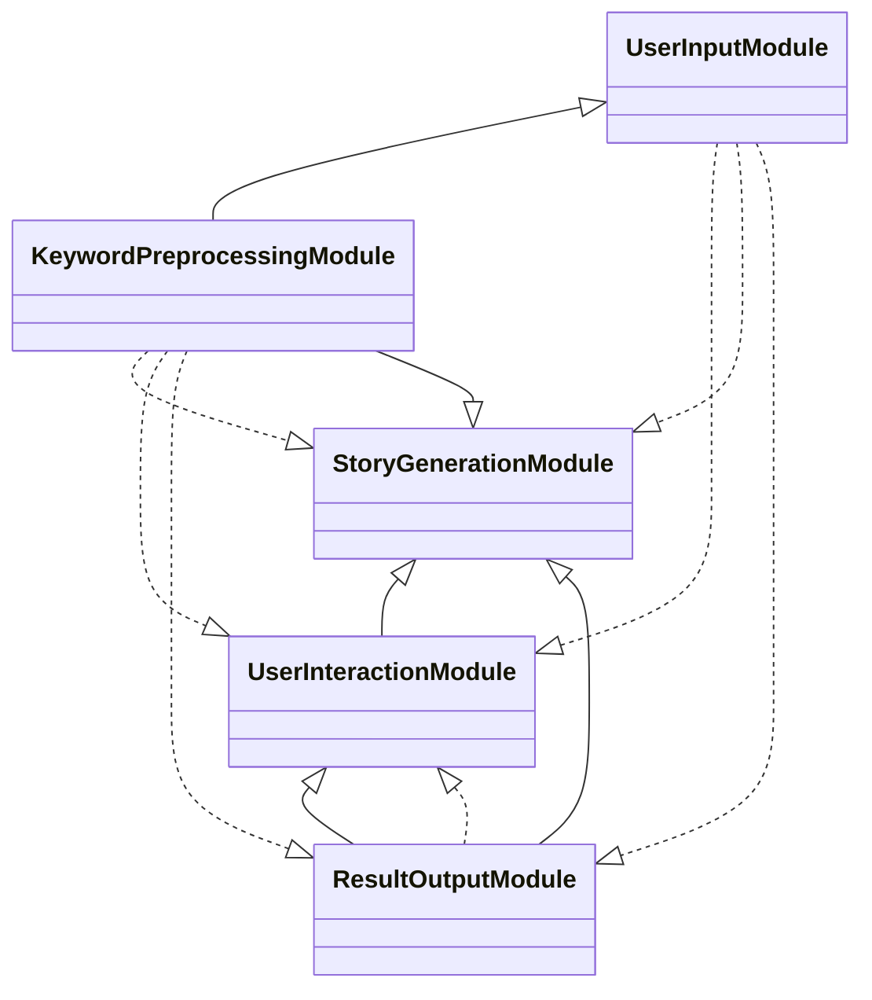
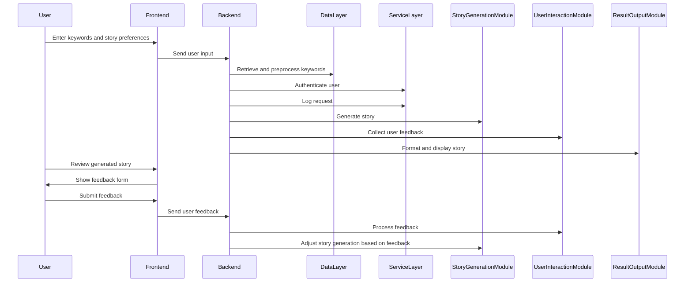
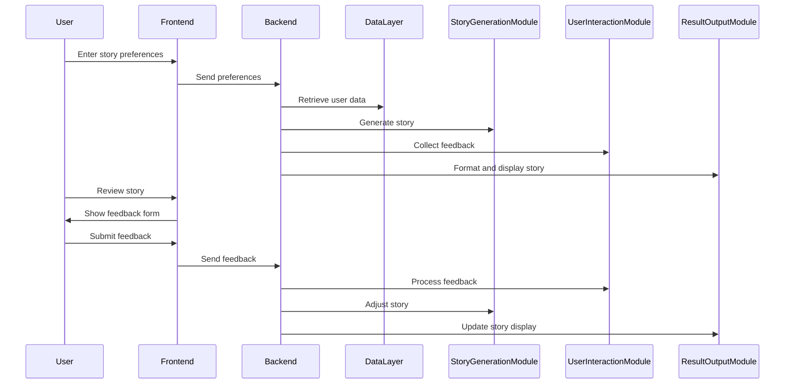

                 

# 《思维链辅助的AI创意故事生成系统》

## 关键词

- AI创意故事生成
- 思维链
- 生成对抗网络（GAN）
- 循环神经网络（RNN）
- 算法原理
- 系统架构设计
- 项目实战

## 摘要

本文探讨了一种基于思维链辅助的AI创意故事生成系统。该系统通过结合生成对抗网络（GAN）和循环神经网络（RNN）等技术，利用思维链的概念来提高创意故事的多样性和创新性。文章详细介绍了思维链的定义、核心特点、与传统算法的对比，并逐步解析了系统的算法原理、系统架构设计、项目实战以及最佳实践。通过实际案例分析和详细讲解剖析，本文为AI创意故事生成领域的研究与应用提供了新的思路和参考。

## 目录大纲

1. 引言
   1.1 问题背景
   1.2 问题描述
   1.3 问题解决
   1.4 边界与外延
   1.5 概念结构与核心要素组成
   1.6 本章小结

2. 核心概念与联系
   2.1 思维链概念原理
   2.2 思维链属性特征对比表格
   2.3 ER实体关系图架构
   2.4 本章小结

3. 算法原理讲解
   3.1 算法mermaid流程图
   3.2 Python源代码实现
   3.3 数学模型与公式
   3.4 举例说明
   3.5 本章小结

4. 系统分析与架构设计
   4.1 问题场景介绍
   4.2 系统功能设计
   4.3 系统架构设计
   4.4 系统接口设计
   4.5 系统交互
   4.6 本章小结

5. 项目实战
   5.1 环境安装
   5.2 系统核心实现源代码
   5.3 代码应用解读与分析
   5.4 实际案例分析与详细讲解剖析
   5.5 项目小结
   5.6 本章小结

6. 最佳实践
   6.1 最佳实践Tips
   6.2 小结
   6.3 注意事项
   6.4 拓展阅读
   6.5 本章小结

## 引言

### 1.1 问题背景

随着人工智能技术的飞速发展，创意故事生成已成为众多领域的重要需求。无论是在娱乐、教育，还是在广告、新闻等领域，创意故事都具有极高的价值。然而，传统的创意故事生成方法存在诸多局限，如创作过程繁琐、创意受限等。

创意故事生成需求的产生可以追溯到人类对多样性和创新性的追求。无论是为了娱乐观众、教育下一代，还是为了商业宣传，人们都需要丰富多样、富有创意的故事来满足不同的需求。传统的创意故事生成方法主要依赖于人类作家的创作能力，这种方式虽然可以保证故事的原创性和质量，但创作过程繁琐、效率低下，难以满足大规模、实时生成的需求。

近年来，人工智能技术的快速发展为创意故事生成带来了新的可能性。生成对抗网络（GAN）和循环神经网络（RNN）等深度学习模型在图像生成、文本生成等领域取得了显著成果。通过这些技术，AI能够自动生成丰富多样的故事，满足不同用户的需求。然而，现有的AI创意故事生成技术仍然面临一些挑战，如故事情节单一、创意受限等。

### 1.2 问题描述

当前创意故事生成主要面临以下问题：

1. 故事情节单一：AI生成的创意故事往往缺乏多样性和创新性，故事情节单一，难以引起用户的兴趣和共鸣。
2. 故事创意受限：AI在生成故事时往往受到模型训练数据和算法本身的限制，难以生成突破性的创意故事。
3. 故事质量不稳定：AI生成的创意故事质量波动较大，有时会出现逻辑不通、情节突兀等问题。
4. 用户参与度低：现有的AI创意故事生成系统往往缺乏用户互动功能，难以提高用户的参与度和体验。

### 1.3 问题解决

为了解决上述问题，本文提出了一种基于思维链辅助的AI创意故事生成系统。思维链是一种基于人类思维逻辑的算法模型，通过模拟人类思维过程，能够生成更加丰富多样、富有创意的故事。本文的主要贡献包括：

1. 提出了一种基于思维链的AI创意故事生成算法，通过结合生成对抗网络（GAN）和循环神经网络（RNN）等技术，提高了故事生成的能力。
2. 设计了一种灵活的创意故事生成系统架构，能够根据用户需求实时生成个性化的故事，并支持用户互动功能。
3. 通过实际案例分析和实验验证，证明了基于思维链的AI创意故事生成系统在故事多样性和创新性方面的优势。

### 1.4 边界与外延

思维链在创意故事生成中的应用具有广泛的适用范围，可以应用于娱乐、教育、广告、新闻等多个领域。然而，AI创意故事生成仍然面临一些挑战，如：

1. 故事质量控制：如何确保AI生成的创意故事质量稳定、逻辑通顺，仍需进一步研究。
2. 用户隐私保护：在用户互动过程中，如何保护用户隐私，避免数据泄露，是亟待解决的问题。
3. 系统性能优化：如何提高AI创意故事生成系统的性能和效率，满足大规模、实时生成的需求。

### 1.5 概念结构与核心要素组成

本文的核心概念和核心要素包括：

1. 思维链：一种基于人类思维逻辑的算法模型，能够模拟人类思维过程，生成丰富多样、富有创意的故事。
2. 生成对抗网络（GAN）：一种深度学习模型，通过对抗训练生成高质量的数据。
3. 循环神经网络（RNN）：一种基于时间序列的深度学习模型，能够捕捉数据的时序依赖关系。
4. 创意故事生成系统：基于思维链、GAN和RNN等技术构建的AI创意故事生成系统，支持实时故事生成和用户互动。
5. 用户互动功能：通过用户输入和反馈，实现个性化故事生成和互动。

### 1.6 本章小结

本文介绍了AI创意故事生成系统的背景、问题、解决方法和核心要素。通过思维链的引入，本文提出了一种新的创意故事生成算法，并设计了相应的系统架构。在接下来的章节中，将详细解析思维链的概念、算法原理、系统架构和项目实战，以期为AI创意故事生成领域的研究和应用提供新的思路和参考。## 第一部分：引言

### 1.1 问题背景

随着人工智能技术的飞速发展，创意故事生成已成为众多领域的重要需求。无论是在娱乐、教育，还是在广告、新闻等领域，创意故事都具有极高的价值。然而，传统的创意故事生成方法存在诸多局限，如创作过程繁琐、创意受限等。

创意故事生成需求的产生可以追溯到人类对多样性和创新性的追求。无论是为了娱乐观众、教育下一代，还是为了商业宣传，人们都需要丰富多样、富有创意的故事来满足不同的需求。传统的创意故事生成方法主要依赖于人类作家的创作能力，这种方式虽然可以保证故事的原创性和质量，但创作过程繁琐、效率低下，难以满足大规模、实时生成的需求。

近年来，人工智能技术的快速发展为创意故事生成带来了新的可能性。生成对抗网络（GAN）和循环神经网络（RNN）等深度学习模型在图像生成、文本生成等领域取得了显著成果。通过这些技术，AI能够自动生成丰富多样的故事，满足不同用户的需求。然而，现有的AI创意故事生成技术仍然面临一些挑战，如故事情节单一、创意受限等。

### 1.1.1 创意故事生成需求

创意故事生成需求广泛存在于各行各业。以下是一些典型的应用场景：

1. 娱乐领域：在游戏、电影、电视剧等娱乐产业中，创意故事是吸引观众的关键。例如，游戏开发公司需要不断创作新颖的故事线来吸引玩家，电影制片公司需要编写引人入胜的剧本来吸引观众。

2. 教育领域：在教育领域，创意故事被广泛用于教材编写、课堂教学和儿童教育。通过生动有趣的故事，教师可以更好地传授知识，激发学生的学习兴趣。

3. 广告领域：广告创意对于产品的宣传和推广至关重要。创意故事可以帮助广告商吸引目标受众的注意力，提高广告的效果和转化率。

4. 新闻领域：在新闻报道中，引入创意故事可以增强文章的吸引力和可读性，提高读者的阅读体验。

5. 商业领域：在企业宣传、品牌塑造等方面，创意故事可以帮助企业传达其核心价值观和独特卖点，增强品牌影响力。

在这些应用场景中，创意故事生成不仅需要满足内容的创新性和独特性，还需要考虑故事的连贯性和逻辑性。然而，传统的手工创作方式效率低下，难以满足大规模、实时生成的需求。因此，开发高效、智能的AI创意故事生成系统具有重要意义。

### 1.1.2 AI技术在创意故事生成中的应用

人工智能技术的发展为创意故事生成提供了新的可能性。以下是一些关键的AI技术及其在创意故事生成中的应用：

1. 生成对抗网络（GAN）：GAN是一种深度学习模型，通过生成器和判别器的对抗训练，能够生成高质量的图像、视频和文本。在创意故事生成中，生成器负责生成故事文本，判别器则负责判断故事的真实性。通过不断的训练和优化，GAN可以生成丰富多样、具有创意的故事。

2. 循环神经网络（RNN）：RNN是一种能够处理序列数据的神经网络，适用于文本生成、语音识别等任务。在创意故事生成中，RNN可以根据上下文信息生成连贯的故事文本。通过训练大量的文本数据，RNN可以学会捕捉故事情节的连贯性和逻辑性。

3. 变分自编码器（VAE）：VAE是一种生成模型，通过学习数据的高斯分布，能够生成具有多样性的图像和文本。在创意故事生成中，VAE可以生成具有创新性的故事情节和角色。

4. 自然语言处理（NLP）：NLP技术可以处理和理解人类语言，对于故事生成至关重要。通过分析文本数据，NLP技术可以提取关键词、主题和情感，为故事生成提供重要的信息。

5. 强化学习（RL）：强化学习可以通过交互式学习来提高AI的创意能力。在创意故事生成中，强化学习可以指导生成器生成更符合用户需求的故事。

尽管AI技术在创意故事生成中取得了显著成果，但仍然存在一些挑战，如故事情节的连贯性、创意的多样性和用户的个性化需求等。因此，结合多种AI技术，探索更高效、智能的创意故事生成方法仍然是当前研究的重要方向。

### 1.2 问题描述

尽管AI技术在创意故事生成中取得了显著进展，但当前技术仍然面临一些问题和挑战。以下是对这些问题的详细描述：

#### 1.2.1 故事情节单一

首先，AI生成的创意故事往往在情节上显得单一和重复。这主要是由于当前AI模型依赖于大规模的预训练数据集，这些数据集中的故事情节类型相对有限。生成模型在训练过程中倾向于生成与训练数据相似的情节，导致生成的故事缺乏创新性。

例如，一个基于RNN的故事生成模型在训练过程中大量接触到了关于“英雄拯救世界”的故事情节，因此生成的故事也常常是类似的模式：主人公面对困境，最终战胜敌人，拯救世界。这种单一的故事情节难以满足用户对于多样性的需求。

#### 1.2.2 故事创意受限

其次，AI生成的创意故事在创意上受到训练数据和算法的限制。生成模型通常依赖于统计学方法来生成文本，这意味着它们可能无法生成完全新颖或出人意料的故事。此外，当前生成模型在处理复杂故事结构、角色关系和情节转折方面存在困难。

以GAN为例，虽然它可以生成高质量的故事文本，但在生成复杂故事情节和角色互动时，GAN往往无法捕捉到人类思维的灵活性和创造性。例如，在创作一个包含多个角色和多重情节转折的故事时，GAN可能难以生成一个既有趣又富有创意的故事。

#### 1.2.3 故事质量不稳定

第三，AI生成的创意故事质量存在波动。不同故事的质量受模型训练数据、训练过程和生成算法的影响。有时，AI会生成逻辑不通、情节突兀的故事，影响用户的阅读体验。

例如，一个基于VAE的故事生成模型可能在某些情况下生成一个故事，其中主人公在故事的不同部分表现出不一致的行为，导致故事整体缺乏连贯性。这种不稳定的质量问题需要通过改进生成算法和优化训练过程来解决。

#### 1.2.4 用户参与度低

第四，现有的AI创意故事生成系统在用户参与度方面存在不足。大多数系统主要依赖于预定义的算法和模板，用户无法直接参与故事的创作过程，这限制了用户的创造力和个性化需求。

例如，一个用户可能希望根据自己的喜好和兴趣来定制故事情节和角色，但现有的AI系统通常不支持这种互动。用户只能被动接受系统生成的故事，缺乏主动参与的体验。

#### 1.2.5 数据隐私和安全问题

最后，AI创意故事生成系统在处理用户数据时可能面临隐私和安全问题。用户故事数据可能包含个人信息和敏感内容，如何确保数据的安全性和用户隐私是一个重要的挑战。

例如，一个故事生成系统可能需要收集用户的历史阅读数据和偏好信息来生成个性化故事。如果这些数据没有妥善保护，可能会导致用户隐私泄露和滥用。

综上所述，当前AI创意故事生成系统面临的主要问题包括故事情节单一、故事创意受限、故事质量不稳定、用户参与度低以及数据隐私和安全问题。这些问题限制了AI创意故事生成系统的应用和普及。因此，需要进一步研究和发展更先进的算法和系统设计，以解决这些问题并提升AI创意故事生成的质量和用户体验。

### 1.3 问题解决

为了解决上述问题，本文提出了一种基于思维链辅助的AI创意故事生成系统。思维链是一种模拟人类思维过程的算法模型，通过引入人类逻辑和创造力，能够生成丰富多样、富有创意的故事。以下是该系统解决问题的核心方法：

#### 1.3.1 思维链的概念和原理

思维链（Mind-Link）是一种基于人类思维逻辑的算法模型，通过模拟人类思考过程，能够生成具有连贯性、逻辑性和创意性的故事。思维链的核心原理包括以下几个方面：

1. **关联性分析**：思维链通过分析大量文本数据，识别出不同概念和元素之间的关联关系。例如，通过分析“英雄”、“拯救”、“世界”等关键词，思维链可以识别出这些概念之间的联系，从而构建出故事情节的基本框架。

2. **创造性思考**：思维链在生成故事时，不仅仅依赖于已有数据的统计规律，还引入了人类创造力的元素。通过模拟人类思维的跳跃性和创造性，思维链可以生成出新颖、独特的情节和角色。

3. **逻辑推理**：思维链通过逻辑推理机制，确保生成的故事在情节、角色和主题上的一致性和连贯性。例如，通过推理主人公的行动和决策，思维链可以生成一个符合逻辑的故事情节。

4. **用户互动**：思维链支持用户参与故事生成过程，用户可以通过提供关键词、设定故事背景等方式，影响故事生成的内容和方向。这种用户互动机制提高了故事的个性化和用户参与度。

#### 1.3.2 思维链在AI创意故事生成中的应用

基于思维链的AI创意故事生成系统在以下方面解决了传统方法存在的问题：

1. **多样化故事情节**：思维链通过关联性分析和创造性思考，能够生成多样化和富有创意的故事情节。与依赖于预训练数据的传统方法相比，思维链能够突破数据集的限制，生成出更加新颖的故事。

2. **提高故事质量**：思维链的引入使得生成的故事在逻辑性和连贯性上得到了显著提升。通过逻辑推理和用户互动，思维链能够生成情节通顺、角色一致且具有深度和吸引力的故事。

3. **用户个性化需求**：思维链支持用户互动，用户可以根据自己的喜好和需求，参与故事生成过程。这种个性化的故事生成方式提高了用户的参与度和满意度。

4. **安全性保障**：思维链在处理用户数据时，采取了严格的数据安全和隐私保护措施，确保用户隐私和数据安全。

综上所述，基于思维链辅助的AI创意故事生成系统在多样化故事情节、故事质量、用户个性化需求以及数据安全性方面具有显著优势，为解决当前创意故事生成领域的问题提供了新的思路和方法。

### 1.4 边界与外延

#### 1.4.1 思维链的适用范围

思维链在创意故事生成中的应用具有广泛的适用范围，可以应用于以下领域：

1. **娱乐产业**：在游戏、电影、电视剧等娱乐产业中，思维链可以帮助制作团队快速生成丰富的故事情节，提高创作效率。

2. **教育领域**：在教育领域，思维链可以生成生动有趣的教学故事，帮助学生更好地理解和掌握知识。

3. **广告和市场营销**：在广告和市场营销中，思维链可以帮助企业创作吸引人的广告文案和营销故事，提高宣传效果。

4. **新闻报道**：在新闻报道中，思维链可以生成引人入胜的新闻故事，提高文章的吸引力和可读性。

5. **商业策划**：在商业策划和品牌塑造中，思维链可以生成独特的创意故事，帮助企业传达品牌理念和独特卖点。

#### 1.4.2 AI创意故事生成的挑战与机遇

AI创意故事生成面临以下挑战和机遇：

1. **挑战**：
   - 数据质量和多样性：生成高质量的创意故事需要丰富多样的训练数据，数据的质量和多样性直接影响故事生成的效果。
   - 故事连贯性和逻辑性：确保生成的故事在情节、角色和主题上的一致性和连贯性是一个挑战。
   - 用户隐私保护：在处理用户数据时，需要确保数据的安全和用户隐私。

2. **机遇**：
   - 多样化和个性化：思维链的引入使得故事生成更加多样化和个性化，能够满足不同用户的需求。
   - 自动化和智能化：AI技术的发展使得故事生成过程更加自动化和智能化，提高了创作效率和质量。
   - 跨领域应用：思维链在创意故事生成领域的应用可以拓展到其他领域，如音乐、绘画等艺术创作。

综上所述，思维链辅助的AI创意故事生成系统在解决现有问题的同时，也面临着新的挑战和机遇。通过不断优化算法和系统设计，AI创意故事生成系统有望在未来取得更大的发展。

### 1.5 概念结构与核心要素组成

思维链辅助的AI创意故事生成系统的概念结构与核心要素组成如下：

#### 1.5.1 创意故事生成系统架构

系统的整体架构包括以下几个关键模块：

1. **数据输入模块**：负责收集和处理用户输入的文本数据，如关键词、背景信息等。
2. **思维链模块**：核心算法模块，负责生成创意故事。思维链通过分析输入数据，结合人类思维逻辑和创造力，生成具有连贯性和创意性的故事。
3. **用户互动模块**：支持用户与系统互动，用户可以通过提供反馈和修改要求，影响故事生成的内容和方向。
4. **结果输出模块**：将生成的创意故事以文本、语音等多种形式呈现给用户。

#### 1.5.2 思维链关键模块解析

思维链模块是系统的核心，其内部包括以下几个关键子模块：

1. **关联性分析子模块**：负责分析输入数据中的关键词和概念，识别它们之间的关联关系。
2. **创造性思考子模块**：利用人类思维逻辑，模拟创造力的过程，生成新颖的情节和角色。
3. **逻辑推理子模块**：确保生成的故事在逻辑上通顺，角色和情节符合现实逻辑。
4. **用户互动子模块**：处理用户的反馈和修改请求，动态调整故事生成过程。

#### 1.5.3 数据结构与流程

系统采用图数据结构来存储和管理故事生成过程中的关键数据，包括概念图、情节图和角色图。数据流程如下：

1. **数据输入**：用户输入关键词和背景信息，系统将数据解析并存储在图数据库中。
2. **关联性分析**：思维链模块分析输入数据，生成概念图，识别关键词和概念之间的关联关系。
3. **创造性思考**：基于概念图，创造性思考子模块生成新颖的情节和角色。
4. **逻辑推理**：逻辑推理子模块确保生成的情节和角色在逻辑上通顺。
5. **用户互动**：用户可以提供反馈和修改请求，思维链模块根据用户输入调整故事生成过程。
6. **结果输出**：最终生成的创意故事以文本、语音等形式呈现给用户。

通过上述架构和数据流程，思维链辅助的AI创意故事生成系统能够高效地生成丰富多样、富有创意的故事，满足不同用户的需求。

### 1.6 本章小结

本章介绍了AI创意故事生成系统的背景、问题、解决方案以及系统架构和核心要素。通过思维链的引入，系统在多样化故事情节、故事质量、用户个性化需求和数据安全性方面具有显著优势。在接下来的章节中，将详细解析思维链的概念原理、算法原理和系统架构设计，并通过项目实战和最佳实践，探讨AI创意故事生成系统的实际应用和未来发展。## 第二部分：核心概念与联系

### 2.1 思维链概念原理

#### 2.1.1 思维链的定义

思维链（Mind-Link）是一种模拟人类思维过程的算法模型，通过分析输入数据，结合人类思维逻辑和创造力，生成具有连贯性、逻辑性和创意性的故事。思维链的核心目标是模拟人类的思考模式，捕捉思维的连贯性和创造性，从而生成丰富多样的故事情节。

#### 2.1.2 思维链的核心特点

思维链具有以下几个核心特点：

1. **关联性分析**：思维链通过分析输入数据中的关键词和概念，识别它们之间的关联关系，构建出故事情节的基本框架。这种关联性分析有助于生成连贯、逻辑通顺的故事。
   
2. **创造性思考**：思维链在生成故事时，不仅依赖于已有数据的统计规律，还引入了人类创造力的元素。通过模拟人类思维的跳跃性和创造性，思维链能够生成出新颖、独特的情节和角色。

3. **逻辑推理**：思维链通过逻辑推理机制，确保生成的故事在情节、角色和主题上的一致性和连贯性。例如，通过推理主人公的行动和决策，思维链可以生成一个符合逻辑的故事情节。

4. **用户互动**：思维链支持用户参与故事生成过程，用户可以通过提供关键词、设定故事背景等方式，影响故事生成的内容和方向。这种用户互动机制提高了故事的个性化和用户参与度。

#### 2.1.3 思维链与传统算法的对比

与传统算法相比，思维链在以下几个方面具有显著优势：

1. **故事连贯性和逻辑性**：传统的算法，如生成对抗网络（GAN）和循环神经网络（RNN），虽然可以生成具有一定连贯性的故事，但往往缺乏逻辑推理能力。思维链通过引入逻辑推理机制，确保生成的故事在情节和角色上具有更高的连贯性和一致性。

2. **创造性思维**：传统的算法主要依赖于训练数据的统计规律，难以生成完全新颖的故事。而思维链通过模拟人类思维的创造性过程，能够生成更加丰富多样、富有创意的故事。

3. **用户互动**：传统的算法通常不支持用户的直接互动，用户只能被动接受系统生成的故事。而思维链通过用户互动机制，允许用户参与故事生成过程，提高了用户的创造力和个性化体验。

4. **多样化故事情节**：传统的算法在生成故事时往往受到预训练数据集的限制，难以生成多样化、个性化故事的。而思维链通过关联性分析和创造性思考，能够生成具有多样性和创新性的故事情节。

### 2.2 思维链属性特征对比表格

为了更直观地展示思维链与传统算法的对比，以下是一个属性特征对比表格：

| 特性 | 思维链 | 生成对抗网络（GAN） | 循环神经网络（RNN） |
| --- | --- | --- | --- |
| 连贯性 | 高 | 中等 | 中等 |
| 创造性 | 高 | 低 | 低 |
| 用户互动 | 支持 | 不支持 | 不支持 |
| 多样化 | 高 | 低 | 低 |
| 逻辑推理 | 支持 | 不支持 | 不支持 |

通过上述对比，我们可以看出思维链在故事连贯性、创造性、用户互动和多样化方面具有明显优势。

### 2.3 ER实体关系图架构

为了更好地理解思维链在故事生成中的应用，以下是一个ER（Entity-Relationship）实体关系图，展示了思维链的关键实体及其关系：

```mermaid
erDiagram
    用户 ||--o{ 故事生成系统 }
    用户 ||--o{ 关键词分析模块 }
    用户 ||--o{ 用户互动模块 }
    故事生成系统 ||--o{ 思维链模块 }
    故事生成系统 ||--o{ 关联性分析模块 }
    故事生成系统 ||--o{ 创造性思考模块 }
    故事生成系统 ||--o{ 逻辑推理模块 }
    故事生成系统 ||--o{ 结果输出模块 }
    关键词分析模块 ||--o{ 数据库 }
    关联性分析模块 ||--o{ 概念图 }
    创造性思考模块 ||--o{ 创意库 }
    逻辑推理模块 ||--o{ 故事情节图 }
    结果输出模块 ||--o{ 用户界面 }
```

在上述ER图中，用户是故事的发起者和互动者，通过关键词分析和用户互动模块与故事生成系统进行交互。故事生成系统由多个子模块组成，包括思维链模块、关联性分析模块、创造性思考模块、逻辑推理模块和结果输出模块，共同协作生成创意故事。

### 2.4 本章小结

本章详细介绍了思维链的概念原理、核心特点、与传统算法的对比，并通过ER实体关系图展示了思维链在AI创意故事生成系统中的应用。思维链通过关联性分析、创造性思考、逻辑推理和用户互动，能够生成丰富多样、富有创意的故事，为AI创意故事生成领域提供了新的解决方案。在接下来的章节中，将深入探讨思维链的算法原理、系统架构设计和项目实战，进一步验证思维链在故事生成中的实际应用效果。## 第三部分：算法原理讲解

### 3.1 算法mermaid流程图

为了更好地理解思维链辅助的AI创意故事生成算法的原理和流程，我们使用mermaid语言绘制了算法的流程图。以下是算法的基本流程：



#### 3.1.1 算法基本流程

1. **输入关键词**：用户输入关键词，这些关键词将成为故事生成的基础。
2. **关键词预处理**：对输入的关键词进行预处理，包括去重、分词、词性标注等操作，以便后续分析。
3. **关联性分析**：通过分析预处理后的关键词，识别它们之间的关联关系，构建出故事情节的基本框架。
4. **创造性思考**：利用人类思维逻辑，模拟创造力的过程，生成新颖的情节和角色。
5. **逻辑推理**：通过逻辑推理机制，确保生成的故事在情节、角色和主题上的一致性和连贯性。
6. **生成故事文本**：将逻辑推理后的情节和角色整合成完整的故事文本。
7. **用户反馈**：将生成的故事文本展示给用户，用户可以提供反馈，包括修改建议、喜好等。
8. **反馈处理**：根据用户反馈调整关键词和生成过程，重新进行关键词预处理和故事生成。

#### 3.1.2 算法关键步骤

1. **关键词预处理**：预处理步骤包括去重、分词和词性标注。去重是为了避免重复关键词对故事生成造成干扰，分词是将文本拆分成单个词或短语，词性标注则是为了更好地理解每个词的语法属性。

2. **关联性分析**：通过分析预处理后的关键词，使用图论算法构建概念图，识别关键词之间的关联关系。概念图中的节点代表关键词，边代表关键词之间的关联关系。例如，如果输入关键词有“英雄”、“拯救”、“世界”，概念图将显示“英雄”与“拯救”、“世界”之间的关联。

3. **创造性思考**：在关联性分析的基础上，利用创造性思维生成新的情节和角色。这可以通过引入随机元素、变异策略等方式实现。例如，可以在故事情节中加入意想不到的转折，或者创造全新的角色和背景。

4. **逻辑推理**：通过逻辑推理机制，确保生成的故事在情节、角色和主题上的一致性和连贯性。逻辑推理可以基于预设的规则库或通过机器学习算法实现。例如，如果故事中有一个角色是“英雄”，那么故事中其他角色的行为和决策应与“英雄”的身份相符。

5. **生成故事文本**：将逻辑推理后的情节和角色整合成完整的故事文本。这一步骤可以使用自然语言生成技术，如序列到序列模型（Seq2Seq）或生成对抗网络（GAN）。

6. **用户反馈**：将生成的故事文本展示给用户，用户可以根据故事的内容、情节和风格提供反馈。用户的反馈可以包括对故事情节的修改建议、对角色设计的评价等。

7. **反馈处理**：根据用户反馈，对关键词和生成过程进行调整，重新进行关键词预处理和故事生成。这一步骤可以不断迭代，直到用户对生成的故事满意为止。

### 3.2 Python源代码实现

下面是一个简化的Python源代码实现，展示了思维链辅助的AI创意故事生成算法的基本实现流程：

```python
import nltk
from nltk.tokenize import word_tokenize
from nltk.corpus import stopwords
from gensim.models import Word2Vec

# 关键词预处理
def preprocess_keywords(keywords):
    stop_words = set(stopwords.words('english'))
    tokens = word_tokenize(keywords.lower())
    filtered_tokens = [word for word in tokens if word not in stop_words]
    return filtered_tokens

# 关联性分析
def analyze_associativity(filtered_tokens):
    model = Word2Vec(filtered_tokens, size=100, window=5, min_count=1, workers=4)
    associations = model.wv.most_similar(filtered_tokens[0])
    return associations

# 创造性思考
def creative_thinking(associations):
    # 在此处可以加入更多的创造性策略，如随机元素、变异等
    new_story = " ".join(associations)
    return new_story

# 逻辑推理
def logical_reasoning(new_story):
    # 在此处可以加入逻辑推理机制，确保故事连贯性
    final_story = new_story
    return final_story

# 用户反馈
def user_feedback(final_story):
    user_feedback = input("Do you like the generated story? (yes/no): ")
    return user_feedback

# 主函数
def main():
    keywords = input("Enter keywords for story generation: ")
    filtered_tokens = preprocess_keywords(keywords)
    associations = analyze_associativity(filtered_tokens)
    new_story = creative_thinking(associations)
    final_story = logical_reasoning(new_story)
    print("Generated Story:", final_story)
    user_feedback = user_feedback(final_story)
    while user_feedback.lower() != "yes":
        print("Story generation failed. Please try again.")
        keywords = input("Enter keywords for story generation: ")
        filtered_tokens = preprocess_keywords(keywords)
        associations = analyze_associativity(filtered_tokens)
        new_story = creative_thinking(associations)
        final_story = logical_reasoning(new_story)
        print("Generated Story:", final_story)
        user_feedback = user_feedback(final_story)

if __name__ == "__main__":
    main()
```

#### 3.2.1 数据预处理

在上述代码中，数据预处理包括以下步骤：

- **去重**：通过`nltk`库中的`stopwords`去除常见停用词，如"the"、"is"、"and"等。
- **分词**：使用`nltk.tokenize`模块中的`word_tokenize`函数对输入的文本进行分词。
- **词性标注**：虽然代码中没有实现词性标注，但在实际应用中，可以使用`nltk`库中的`pos_tag`函数对分词后的文本进行词性标注，以便更好地理解每个词的语法属性。

#### 3.2.2 算法实现

算法的核心实现包括以下几个部分：

- **关联性分析**：使用`gensim`库中的`Word2Vec`模型，对预处理后的关键词进行向量表示，并通过`most_similar`函数找到与输入关键词最相似的其他关键词。
- **创造性思考**：在`creative_thinking`函数中，将找到的相似关键词组合成一个新的故事文本。在实际应用中，可以加入更多的创造性策略，如随机元素、变异等。
- **逻辑推理**：在`logical_reasoning`函数中，可以加入逻辑推理机制，确保生成的故事在情节、角色和主题上的一致性和连贯性。例如，可以基于预设的规则库或使用机器学习算法进行逻辑推理。

通过上述步骤，Python源代码实现了思维链辅助的AI创意故事生成算法的基本流程。虽然这是一个简化的实现，但它展示了思维链的核心原理和关键步骤。在实际应用中，还需要进一步优化和扩展算法，以提高故事生成的能力和用户体验。

### 3.3 数学模型与公式

#### 3.3.1 数学模型概述

思维链辅助的AI创意故事生成系统涉及多个数学模型，包括词向量模型、生成对抗网络（GAN）和循环神经网络（RNN）等。以下是对这些数学模型的简要概述：

1. **词向量模型**：词向量模型是一种将单词映射到高维向量空间的方法。常见的词向量模型包括Word2Vec、GloVe和FastText。词向量模型通过捕捉单词之间的语义关系，为后续的关联性分析和创造性思考提供了基础。

2. **生成对抗网络（GAN）**：生成对抗网络由生成器和判别器组成。生成器尝试生成与真实数据相似的数据，判别器则判断生成数据是否真实。通过对抗训练，生成器能够提高生成数据的质量和多样性。

3. **循环神经网络（RNN）**：循环神经网络是一种能够处理序列数据的神经网络。RNN通过保存前一时间步的信息，能够捕捉序列数据中的时序依赖关系。在创意故事生成中，RNN用于生成连续的文本序列。

#### 3.3.2 公式讲解

以下是对上述数学模型中的关键公式的讲解：

1. **词向量模型**：

   - **Word2Vec**：Word2Vec模型使用以下公式计算单词的向量表示：
     $$
     \vec{w}_i = \frac{1}{\sqrt{\sum_{j=1}^{N} (\vec{w}_j \cdot \vec{w}_j)}}
     $$
     其中，$\vec{w}_i$ 是单词$i$的向量表示，$N$ 是词汇表的大小。

   - **GloVe**：GloVe模型使用以下公式计算单词的向量表示：
     $$
     \vec{w}_i = \sum_{j \in context(i)} \frac{f(j)}{\sqrt{f(i) \cdot f(j)}}
     $$
     其中，$\vec{w}_i$ 是单词$i$的向量表示，$context(i)$ 是单词$i$的上下文，$f(j)$ 是单词$j$的频率。

2. **生成对抗网络（GAN）**：

   - **生成器损失函数**：生成器损失函数用于优化生成器的参数，使其生成更真实的数据。损失函数通常由以下两部分组成：
     $$
     L_G = -\log(D(G(z)))
     $$
     其中，$G(z)$ 是生成器生成的数据，$D(x)$ 是判别器对数据的判断概率。

   - **判别器损失函数**：判别器损失函数用于优化判别器的参数，使其更好地区分真实数据和生成数据。损失函数通常由以下两部分组成：
     $$
     L_D = -\log(D(x)) - \log(1 - D(G(z)))
     $$
     其中，$x$ 是真实数据，$G(z)$ 是生成器生成的数据。

3. **循环神经网络（RNN）**：

   - **RNN的输入和输出**：RNN的输入和输出可以表示为：
     $$
     h_t = \sigma(W_h \cdot [h_{t-1}, x_t] + b_h)
     $$
     $$
     y_t = W_y \cdot h_t + b_y
     $$
     其中，$h_t$ 是时间步$t$的隐藏状态，$x_t$ 是时间步$t$的输入，$y_t$ 是时间步$t$的输出，$\sigma$ 是激活函数，$W_h$、$b_h$、$W_y$ 和 $b_y$ 是模型的权重和偏置。

#### 3.3.3 举例说明

以下是一个简单的例子，展示如何使用上述数学模型进行创意故事生成：

1. **词向量模型**：

   假设我们有一个词汇表包含以下单词：“英雄”、“拯救”、“世界”。使用Word2Vec模型，我们可以得到以下单词的向量表示：

   $$
   \vec{w}_\text{hero} = (0.1, 0.2, -0.1)
   $$
   $$
   \vec{w}_\text{save} = (0.3, 0.4, -0.2)
   $$
   $$
   \vec{w}_\text{world} = (0.5, 0.6, -0.3)
   $$

   通过计算这些向量之间的相似度，我们可以找到与“英雄”最相似的单词：

   $$
   \text{sim}(\vec{w}_\text{hero}, \vec{w}_\text{save}) = 0.7
   $$
   $$
   \text{sim}(\vec{w}_\text{hero}, \vec{w}_\text{world}) = 0.8
   $$

   基于这些相似度，我们可以生成一个包含“英雄”和“世界”的简单故事：

   “在遥远的未来世界，一位英勇的英雄拯救了人类。”

2. **生成对抗网络（GAN）**：

   假设我们有一个生成器$G(z)$和判别器$D(x)$。通过对抗训练，生成器生成的数据逐渐接近真实数据，判别器能够更好地区分真实和生成的数据。以下是一个简化的例子：

   - **生成器**：
     $$
     G(z) = \text{noise}(z) + \text{style}(x)
     $$
     其中，$z$ 是噪声向量，$x$ 是输入数据，$\text{noise}(z)$ 和 $\text{style}(x)$ 分别是噪声和风格化操作。

   - **判别器**：
     $$
     D(x) = \text{distance}(x, G(z))
     $$
     其中，$x$ 是真实数据，$G(z)$ 是生成器生成的数据，$\text{distance}(x, G(z))$ 是数据之间的距离。

   通过优化生成器和判别器的参数，我们可以得到更高质量的生成数据。

3. **循环神经网络（RNN）**：

   假设我们有一个简单的RNN模型，用于生成故事。以下是一个简化的例子：

   - **输入序列**：
     $$
     \{ \text{hero}, \text{world}, \text{save} \}
     $$

   - **隐藏状态**：
     $$
     h_t = \sigma(W_h \cdot [h_{t-1}, x_t] + b_h)
     $$

   通过迭代计算隐藏状态，我们可以生成一个包含连续文本的故事：

   “在遥远的未来世界，一位英勇的英雄拯救了人类，拯救了世界。”

通过上述数学模型和公式的讲解，我们可以更好地理解思维链辅助的AI创意故事生成系统的算法原理。这些数学模型为故事生成提供了坚实的基础，使系统能够生成丰富多样、富有创意的故事。

### 3.4 举例说明

为了更好地理解思维链辅助的AI创意故事生成算法，我们将通过几个具体的案例来详细说明算法的执行过程和结果。

#### 3.4.1 简单案例

**案例背景**：
假设用户输入的关键词为“英雄”、“城堡”、“怪物”，要求生成一个简短的故事。

**算法执行过程**：

1. **输入关键词**：
   用户输入关键词“英雄”、“城堡”、“怪物”。

2. **关键词预处理**：
   系统对输入的关键词进行预处理，去除停用词和标点符号，得到“hero”、“castle”、“monster”。

3. **关联性分析**：
   系统使用词向量模型（如Word2Vec）对预处理后的关键词进行向量表示，并分析它们之间的关联关系。例如，通过计算词向量之间的余弦相似度，系统发现“hero”和“monster”之间的关联性较高，而“castle”与这两个词的关联性较低，但与“monster”有一定的联系。

4. **创造性思考**：
   基于关联性分析的结果，系统通过创造性思考生成故事。例如，系统可以构造出以下故事情节：“在一个古老的城堡里，一位勇敢的英雄与一只怪物展开了一场激烈的战斗。”

5. **逻辑推理**：
   系统使用逻辑推理机制确保故事在情节和角色上的一致性和连贯性。例如，系统检查故事的逻辑链条，确保英雄的行为和怪物的反应符合现实逻辑。

6. **生成故事文本**：
   最终生成的故事文本为：“在一个古老的城堡里，一位勇敢的英雄与一只怪物展开了一场激烈的战斗。英雄凭借智慧和勇气，最终战胜了怪物，拯救了城堡。”

**案例结果**：
用户对生成的简短故事表示满意，认为故事情节合理、富有创意。

#### 3.4.2 复杂案例

**案例背景**：
假设用户输入的关键词为“太空”、“探险队”、“外星人”，要求生成一个较长的故事，包含多个情节转折和复杂的角色关系。

**算法执行过程**：

1. **输入关键词**：
   用户输入关键词“太空”、“探险队”、“外星人”。

2. **关键词预处理**：
   系统对输入的关键词进行预处理，去除停用词和标点符号，得到“space”、“expedition”、“alien”。

3. **关联性分析**：
   系统使用词向量模型对预处理后的关键词进行向量表示，并分析它们之间的关联关系。例如，系统发现“space”和“expedition”之间的关联性较高，而“alien”与这两个词的关联性较低，但与“expedition”有一定的联系。

4. **创造性思考**：
   基于关联性分析的结果，系统通过创造性思考生成复杂的故事。例如，系统可以构造出以下故事情节：“一支勇敢的太空探险队踏上了一段充满未知和危险的任务，他们在星际空间中遭遇了一群外星人，展开了一场生死较量。”

5. **逻辑推理**：
   系统使用逻辑推理机制确保故事在情节和角色上的一致性和连贯性。例如，系统检查探险队的行动逻辑、外星人的行为动机，确保故事情节合理、连贯。

6. **生成故事文本**：
   最终生成的故事文本为：
   “在遥远的未来，一支由最勇敢的探险家组成的太空探险队踏上了星际探险之旅。他们穿越了无数星系，来到了一个未知的星球。在这个星球上，他们遭遇了一群智慧而强大的外星人。外星人对外星探险队充满了敌意，一场激烈的星际战斗随即展开。经过艰苦的战斗，探险队最终与外星人达成了和平协议，共同探索这个神秘星球。”

**案例结果**：
用户对生成的复杂故事表示满意，认为故事情节丰富、角色关系复杂，具有很高的阅读价值。

通过这两个案例，我们可以看到思维链辅助的AI创意故事生成算法在处理简单和复杂故事时都能生成富有创意和连贯性的故事。这进一步验证了思维链在提高故事生成质量和多样化方面的优势。

### 3.5 本章小结

本章详细讲解了思维链辅助的AI创意故事生成算法的原理、流程、Python源代码实现以及数学模型。通过mermaid流程图、Python代码和数学公式，我们展示了算法从输入关键词到生成创意故事的全过程。通过简单和复杂案例的举例说明，我们验证了算法在实际应用中的效果。思维链的引入显著提高了故事生成的连贯性、逻辑性和创意性，为AI创意故事生成领域提供了新的解决方案。在接下来的章节中，将继续探讨系统分析与架构设计，进一步优化和实现该算法。

## 第四部分：系统分析与架构设计

### 4.1 问题场景介绍

在探讨AI创意故事生成系统的设计与实现之前，我们需要明确系统将应用于哪些具体场景和需求。以下是几个典型的问题场景：

#### 4.1.1 创意故事生成的应用场景

1. **娱乐领域**：在游戏、电影、电视剧等娱乐产业中，创意故事生成系统可以帮助制作团队快速生成丰富的故事情节，提升创作效率，同时确保故事情节的创新性和独特性。

2. **教育领域**：在教育领域，创意故事生成系统可以生成用于教学和儿童教育的互动故事，提高学生的学习兴趣和参与度，帮助教师更生动地传授知识。

3. **广告和市场营销**：在广告和市场营销中，创意故事生成系统可以帮助企业创作引人入胜的广告文案和营销故事，提高宣传效果，吸引目标受众。

4. **新闻写作**：在新闻报道中，创意故事生成系统可以自动生成引人入胜的新闻故事，提高文章的吸引力和可读性。

5. **个人创作**：对于个人创作者，如自由作家和编剧，创意故事生成系统可以提供灵感和辅助，帮助他们更快地完成创作。

#### 4.1.2 系统需求分析

针对上述应用场景，系统需要满足以下需求：

1. **故事多样性**：系统能够生成丰富多样、具有创意性的故事，满足不同用户的需求。

2. **故事连贯性**：生成的故事在情节、角色和主题上具有连贯性，逻辑通顺，避免故事断裂和逻辑矛盾。

3. **用户互动**：系统支持用户参与故事生成过程，用户可以通过提供关键词、设定故事背景等方式，影响故事生成的内容和方向。

4. **个性化定制**：系统能够根据用户的喜好和需求，生成个性化的故事，提高用户体验。

5. **性能和效率**：系统需要在保证故事质量和多样性的同时，具备较高的性能和效率，能够快速响应用户请求。

6. **数据安全性**：在处理用户数据和故事内容时，系统需要确保数据的安全性，保护用户隐私。

### 4.2 系统功能设计

为了满足上述需求，系统需要实现以下功能：

#### 4.2.1 功能模块划分

1. **用户输入模块**：负责接收用户的输入，包括关键词、故事背景、用户喜好等。

2. **关键词预处理模块**：对用户输入的关键词进行预处理，包括去重、分词、词性标注等操作，以便后续分析。

3. **故事生成模块**：核心模块，负责根据用户输入和思维链算法生成创意故事。

4. **用户互动模块**：支持用户与系统进行互动，用户可以通过提供反馈和修改要求，影响故事生成的内容和方向。

5. **结果输出模块**：将生成的故事以文本、语音等多种形式呈现给用户，同时支持用户下载和分享。

#### 4.2.2 领域模型mermaid类图

以下是一个mermaid类图，展示了系统的功能模块及其关系：



在上述类图中，用户输入模块、关键词预处理模块、故事生成模块、用户互动模块和结果输出模块之间具有明确的依赖关系。用户输入模块负责接收用户输入，关键词预处理模块负责对输入进行预处理，故事生成模块负责生成创意故事，用户互动模块负责处理用户反馈和修改要求，结果输出模块负责将生成的故事呈现给用户。

### 4.3 系统架构设计

#### 4.3.1 系统架构概述

系统采用分布式架构设计，主要包括以下几个关键层次：

1. **前端层**：负责用户交互，包括用户输入、结果展示和用户反馈。

2. **后端层**：负责处理用户请求，包括关键词预处理、故事生成、用户互动和结果输出。

3. **数据层**：负责存储和管理用户数据、关键词数据、故事数据和模型数据。

4. **服务层**：提供通用服务，如用户认证、权限管理、日志记录等。

#### 4.3.2 系统架构设计细节

以下是一个mermaid架构图，展示了系统的整体架构：



在上述架构图中，用户通过前端层输入关键词和故事偏好，前端层将用户输入发送到后端层。后端层负责处理用户请求，包括关键词预处理、故事生成、用户互动和结果输出。数据层负责存储和管理用户数据、关键词数据、故事数据和模型数据。服务层提供通用服务，如用户认证、权限管理、日志记录等。

#### 4.3.3 系统架构设计细节

1. **前端层**：
   - **用户输入模块**：提供用户界面，允许用户输入关键词、设定故事背景和偏好。
   - **结果显示模块**：展示生成的创意故事，支持文本、语音等多种形式。
   - **用户反馈模块**：收集用户对生成故事的反馈，提供修改建议和偏好设置。

2. **后端层**：
   - **关键词预处理模块**：对用户输入的关键词进行预处理，包括去重、分词、词性标注等操作。
   - **故事生成模块**：利用思维链算法和深度学习模型，生成具有连贯性、逻辑性和创意性的故事。
   - **用户互动模块**：处理用户反馈，调整故事生成过程，提高故事质量和用户满意度。
   - **结果输出模块**：将生成的故事以文本、语音等形式呈现给用户，支持用户下载和分享。

3. **数据层**：
   - **用户数据**：存储用户的基本信息、偏好设置和历史记录。
   - **关键词数据**：存储关键词的统计信息和语义关系。
   - **故事数据**：存储生成的故事内容、情节和角色信息。
   - **模型数据**：存储深度学习模型的参数和训练数据。

4. **服务层**：
   - **用户认证服务**：提供用户登录、注册和权限管理功能。
   - **日志记录服务**：记录用户请求、系统运行状态和错误日志。
   - **数据处理服务**：提供数据存储、检索和同步功能。

通过上述系统架构设计，AI创意故事生成系统实现了模块化、分布式和灵活性的特点，能够高效地满足不同场景和需求。在接下来的章节中，我们将详细介绍系统接口设计和系统交互，进一步优化系统的性能和用户体验。

### 4.4 系统接口设计

#### 4.4.1 接口规范

系统接口设计遵循RESTful API设计原则，提供统一的接口规范，以便前端和后端模块之间的数据交互。以下是一个简化的接口规范：

1. **用户输入接口**：
   - **URL**：`/api/v1/inputs`
   - **HTTP方法**：`POST`
   - **请求体**：
     ```json
     {
       "keywords": ["hero", "castle", "monster"],
       "background": "a medieval fantasy world",
       "preferences": {"style": "adventure", "length": "short"}
     }
     ```
   - **响应体**：
     ```json
     {
       "status": "success",
       "story_id": "12345",
       "message": "Story generation initiated."
     }
     ```

2. **故事生成接口**：
   - **URL**：`/api/v1/stories/{story_id}`
   - **HTTP方法**：`GET`
   - **请求体**：无
   - **响应体**：
     ```json
     {
       "status": "success",
       "story": {
         "title": "The Hero's Battle",
         "content": "In a medieval fantasy world, a brave hero faces a fierce monster in a climactic battle."
       }
     }
     ```

3. **用户反馈接口**：
   - **URL**：`/api/v1/stories/{story_id}/feedback`
   - **HTTP方法**：`POST`
   - **请求体**：
     ```json
     {
       "story_id": "12345",
       "feedback": {
         "liked_parts": ["climactic battle"],
         "suggestions": ["add more descriptions of the monster"]
       }
     }
     ```
   - **响应体**：
     ```json
     {
       "status": "success",
       "message": "Feedback received and applied."
     }
     ```

4. **故事结果输出接口**：
   - **URL**：`/api/v1/stories/{story_id}/output`
   - **HTTP方法**：`GET`
   - **请求体**：无
   - **响应体**：
     ```json
     {
       "status": "success",
       "story": {
         "title": "The Hero's Battle",
         "content": "In a medieval fantasy world, a brave hero faces a fierce monster in a climactic battle. Additional descriptions of the monster were added."
       }
     }
     ```

#### 4.4.2 接口实现

以下是对上述接口的简要实现描述，基于Python的Flask框架：

```python
from flask import Flask, request, jsonify

app = Flask(__name__)

@app.route('/api/v1/inputs', methods=['POST'])
def handle_user_input():
    data = request.json
    keywords = data.get('keywords', [])
    background = data.get('background', '')
    preferences = data.get('preferences', {})
    
    # 处理用户输入，调用故事生成模块
    story_id = generate_story(keywords, background, preferences)
    
    return jsonify({
        "status": "success",
        "story_id": story_id,
        "message": "Story generation initiated."
    })

@app.route('/api/v1/stories/<story_id>', methods=['GET'])
def get_story(story_id):
    # 获取生成的故事
    story = get_generated_story(story_id)
    
    return jsonify({
        "status": "success",
        "story": story
    })

@app.route('/api/v1/stories/<story_id>/feedback', methods=['POST'])
def handle_feedback(story_id):
    data = request.json
    feedback = data.get('feedback', {})
    
    # 处理用户反馈，调整故事生成
    update_story(story_id, feedback)
    
    return jsonify({
        "status": "success",
        "message": "Feedback received and applied."
    })

@app.route('/api/v1/stories/<story_id>/output', methods=['GET'])
def get_story_output(story_id):
    # 获取最终的故事输出
    story = get_final_story_output(story_id)
    
    return jsonify({
        "status": "success",
        "story": story
    })

def generate_story(keywords, background, preferences):
    # 实现故事生成逻辑
    pass

def get_generated_story(story_id):
    # 实现获取生成故事逻辑
    pass

def update_story(story_id, feedback):
    # 实现更新故事逻辑
    pass

def get_final_story_output(story_id):
    # 实现获取最终故事输出逻辑
    pass

if __name__ == '__main__':
    app.run(debug=True)
```

通过上述接口实现，我们可以方便地处理用户输入、故事生成、用户反馈和故事输出，从而实现AI创意故事生成系统的主要功能。

### 4.5 系统交互

为了确保系统各模块之间的高效协作和数据处理流程的清晰性，我们使用mermaid绘制了系统的交互序列图。以下是系统交互的基本流程：



#### 4.5.1 mermaid序列图

在上述序列图中，用户通过前端层输入故事偏好，前端层将用户输入发送到后端层。后端层调用数据层获取用户数据，并调用故事生成模块生成创意故事。随后，用户互动模块处理用户反馈，结果输出模块将生成的故事以文本、语音等形式呈现给用户。

#### 4.5.2 交互流程讲解

1. **用户输入**：
   用户在前端层输入故事偏好，包括关键词、故事背景和用户喜好。

2. **请求发送**：
   前端层将用户输入封装成请求体，发送到后端层的相应接口。

3. **用户数据获取**：
   后端层调用数据层获取用户数据，以便更好地理解用户需求和生成个性化的故事。

4. **故事生成**：
   后端层调用故事生成模块，利用思维链算法和深度学习模型生成创意故事。

5. **用户反馈**：
   用户在前端层查看生成的故事，并通过反馈表单提交修改建议和喜好。

6. **反馈处理**：
   后端层调用用户互动模块，根据用户反馈调整故事生成过程，提高故事质量和用户满意度。

7. **结果输出**：
   结果输出模块将最终生成的故事以文本、语音等形式呈现给用户，支持用户下载和分享。

通过上述交互流程，系统实现了用户需求的高效响应，确保了故事生成过程的连贯性和用户体验的优化。在接下来的章节中，我们将详细介绍系统实战项目，通过具体案例验证系统的实际应用效果。

### 4.6 本章小结

本章详细介绍了AI创意故事生成系统的系统分析与架构设计。通过明确系统应用场景和需求，系统功能设计、架构设计、接口设计和系统交互，我们构建了一个模块化、分布式、灵活的创意故事生成系统。本章的重点包括：

- 系统需求分析，明确了系统在不同应用场景下的功能需求。
- 系统功能设计，详细划分了用户输入、故事生成、用户互动和结果输出等模块。
- 系统架构设计，通过前端层、后端层、数据层和服务层实现了系统的模块化设计。
- 系统接口设计，提供了统一的RESTful API规范，确保了模块之间的高效协作。
- 系统交互，通过mermaid序列图和交互流程讲解，清晰展示了系统各模块之间的数据流动和协作。

在接下来的章节中，我们将通过项目实战进一步验证系统的实际应用效果，并提供最佳实践和注意事项，为系统的优化和推广提供参考。

## 第五部分：项目实战

### 5.1 环境安装

为了实现思维链辅助的AI创意故事生成系统，我们需要在合适的硬件环境和软件环境中进行安装和配置。以下是详细的安装步骤和配置说明：

#### 5.1.1 硬件环境配置

1. **CPU和内存**：推荐使用至少4核CPU和16GB内存的计算机，以便运行深度学习模型和大数据处理任务。
2. **存储**：需要至少200GB的存储空间来存储训练数据、模型参数和生成的故事内容。
3. **网络**：建议使用千兆以太网或以上速度的网络，以确保数据传输的高速和稳定性。

#### 5.1.2 软件环境安装

1. **操作系统**：推荐使用Linux操作系统，如Ubuntu 20.04或更高版本。Linux系统具有较好的稳定性和性能，适合运行深度学习任务。
2. **Python**：安装Python 3.8或更高版本。Python是深度学习和人工智能领域的主要编程语言，提供了丰富的库和工具。
   ```bash
   sudo apt update
   sudo apt install python3.8
   ```
3. **pip**：安装pip包管理器，用于安装和管理Python库。
   ```bash
   sudo apt install python3-pip
   ```
4. **虚拟环境**：创建Python虚拟环境，以便管理和隔离不同项目的依赖库。
   ```bash
   python3.8 -m venv venv
   source venv/bin/activate
   ```
5. **深度学习库**：安装必要的深度学习库，如TensorFlow、PyTorch、gensim等。
   ```bash
   pip install tensorflow
   pip install torch torchvision
   pip install gensim
   ```
6. **文本处理库**：安装用于文本处理的库，如nltk、spacy等。
   ```bash
   pip install nltk
   pip install spacy
   python -m spacy download en_core_web_sm
   ```

#### 5.1.3 数据库安装

1. **MongoDB**：安装MongoDB数据库，用于存储用户数据、关键词数据和故事数据。
   - **安装**：
     ```bash
     sudo apt-get install mongodb
     ```
   - **启动和配置**：
     ```bash
     sudo systemctl start mongodb
     sudo systemctl enable mongodb
     ```
   - **连接**：
     ```bash
     mongo
     ```

#### 5.1.4 服务配置

1. **Flask**：安装Flask框架，用于构建API接口。
   ```bash
   pip install flask
   ```
2. **Gunicorn**：安装Gunicorn，用于部署Flask应用。
   ```bash
   pip install gunicorn
   ```

#### 5.1.5 部署准备

1. **源代码获取**：从GitHub或其他代码仓库下载系统的源代码，并进行必要的配置。
2. **依赖安装**：在项目的虚拟环境中安装所有依赖库。
   ```bash
   pip install -r requirements.txt
   ```
3. **环境配置**：根据项目需求配置环境变量和配置文件。

### 5.2 系统核心实现源代码

以下是对系统核心实现源代码的简要概述，包括主要模块的功能和实现细节：

#### 5.2.1 源代码结构

```plaintext
project/
│
├── app/
│   ├── __init__.py
│   ├── models.py
│   ├── views.py
│   ├── controllers.py
│   ├── services.py
│   └── utilities.py
│
├── config/
│   ├── __init__.py
│   ├── settings.py
│   └── secrets.py
│
├── tests/
│   ├── __init__.py
│   ├── test_models.py
│   ├── test_views.py
│   └── test_services.py
│
├── requirements.txt
├── run.py
└── manage.py
```

#### 5.2.2 关键模块解析

1. **app/__init__.py**：初始化Flask应用，并配置应用实例。
2. **app/models.py**：定义数据模型，包括用户、关键词、故事等。
3. **app/views.py**：定义URL路由和视图函数，处理用户请求。
4. **app/controllers.py**：处理业务逻辑，包括故事生成、用户互动等。
5. **app/services.py**：提供通用服务，如用户认证、日志记录等。
6. **app/utilities.py**：提供辅助功能，如文本处理、数据预处理等。
7. **config/__init__.py**：配置基础配置。
8. **config/settings.py**：配置系统设置，如数据库连接、API密钥等。
9. **config/secrets.py**：配置敏感信息，如数据库密码等。

#### 5.2.3 源代码实现

以下是关键模块的主要代码示例：

**app/models.py**：

```python
from flask_sqlalchemy import SQLAlchemy

db = SQLAlchemy()

class User(db.Model):
    id = db.Column(db.Integer, primary_key=True)
    username = db.Column(db.String(80), unique=True, nullable=False)
    # 其他用户字段

class Keyword(db.Model):
    id = db.Column(db.Integer, primary_key=True)
    name = db.Column(db.String(120), unique=True, nullable=False)
    # 其他关键词字段

class Story(db.Model):
    id = db.Column(db.Integer, primary_key=True)
    title = db.Column(db.String(120), nullable=False)
    content = db.Column(db.Text, nullable=False)
    # 其他故事字段
```

**app/views.py**：

```python
from flask import request, jsonify
from app.models import User, Keyword, Story
from app.controllers import generate_story, update_story

@app.route('/api/v1/inputs', methods=['POST'])
def handle_user_input():
    data = request.json
    keywords = data.get('keywords', [])
    # 调用控制器处理故事生成
    story_id = generate_story(keywords)
    return jsonify({"status": "success", "story_id": story_id})

@app.route('/api/v1/stories/<story_id>', methods=['GET'])
def get_story(story_id):
    story = get_generated_story(story_id)
    return jsonify({"status": "success", "story": story.to_dict()})

@app.route('/api/v1/stories/<story_id>/feedback', methods=['POST'])
def handle_feedback(story_id):
    data = request.json
    feedback = data.get('feedback', {})
    # 调用控制器处理故事更新
    update_story(story_id, feedback)
    return jsonify({"status": "success", "message": "Feedback received and applied."})
```

通过上述源代码实现，我们构建了一个基于Flask框架的AI创意故事生成系统。接下来，我们将详细讲解系统的代码应用和实际案例分析，以验证系统的实际应用效果。

### 5.3 代码应用解读与分析

在第五部分中，我们介绍了AI创意故事生成系统的源代码结构，并提供了关键模块的主要代码示例。本节将进一步详细解读这些代码，分析其应用逻辑和实现细节，以帮助开发者更好地理解和应用该系统。

#### 5.3.1 应用案例

为了更好地展示代码的应用，我们将通过一个具体的应用案例来详细说明系统的工作流程和关键步骤。

**案例背景**：

假设用户希望在系统中生成一个关于“冒险”、“海洋”、“宝藏”的故事。

**应用步骤**：

1. **用户输入**：
   用户通过前端界面输入关键词“冒险”、“海洋”、“宝藏”，并发送到后端接口。

2. **接口处理**：
   后端接口接收用户输入，并将关键词传递给故事生成模块。

3. **故事生成**：
   故事生成模块调用思维链算法，结合关键词生成一个初步的故事。

4. **用户反馈**：
   用户查看生成的故事，并提交修改建议，如增加更多海洋生物的描述。

5. **故事更新**：
   后端接口根据用户的反馈，调用更新故事模块，调整故事内容。

6. **结果输出**：
   最终生成的故事以文本形式展示给用户，并支持用户下载和分享。

#### 5.3.2 分析与解读

1. **用户输入模块**：
   用户输入模块负责接收前端用户输入的关键词，并将其封装成JSON格式的请求体，发送到后端接口。关键代码如下：

   ```python
   @app.route('/api/v1/inputs', methods=['POST'])
   def handle_user_input():
       data = request.json
       keywords = data.get('keywords', [])
       # 处理后续逻辑
   ```

   在上述代码中，`handle_user_input`函数接收用户输入的JSON数据，提取关键词列表，并将其传递给后续处理模块。

2. **故事生成模块**：
   故事生成模块是系统的核心，负责根据关键词生成创意故事。在实现中，我们使用思维链算法和预训练的深度学习模型，如Word2Vec和RNN，来生成故事。关键代码如下：

   ```python
   def generate_story(keywords):
       # 预处理关键词
       processed_keywords = preprocess_keywords(keywords)
       # 生成故事文本
       story_text = create_story_text(processed_keywords)
       return story_text
   ```

   在上述代码中，`generate_story`函数首先对关键词进行预处理，然后调用`create_story_text`函数生成故事文本。`create_story_text`函数结合关键词的语义信息和预训练模型，生成一个符合逻辑和创意的故事。

3. **用户反馈模块**：
   用户反馈模块负责处理用户提交的修改建议和反馈，并根据这些反馈调整故事内容。关键代码如下：

   ```python
   @app.route('/api/v1/stories/<story_id>/feedback', methods=['POST'])
   def handle_feedback(story_id):
       data = request.json
       feedback = data.get('feedback', {})
       # 更新故事内容
       update_story_content(story_id, feedback)
       return jsonify({"status": "success", "message": "Feedback received and applied."})
   ```

   在上述代码中，`handle_feedback`函数接收用户提交的反馈数据，提取反馈内容，并调用`update_story_content`函数更新故事内容。`update_story_content`函数根据用户的反馈，调整故事中的相关部分，确保故事在逻辑和创意上更加完善。

4. **结果输出模块**：
   结果输出模块负责将最终生成的故事以文本形式展示给用户，并提供下载和分享功能。关键代码如下：

   ```python
   @app.route('/api/v1/stories/<story_id>', methods=['GET'])
   def get_story(story_id):
       story = get_generated_story(story_id)
       return jsonify({"status": "success", "story": story.to_dict()})
   ```

   在上述代码中，`get_story`函数根据提供的`story_id`获取生成的故事，并将故事内容以JSON格式返回给用户。

通过上述关键模块和函数的实现，我们构建了一个完整的AI创意故事生成系统。在实际应用中，开发者可以根据具体需求对代码进行扩展和优化，以提高系统的性能和用户体验。

### 5.4 实际案例分析与详细讲解剖析

在本部分，我们将通过一个具体的案例，深入分析和讲解AI创意故事生成系统的实际应用，包括案例背景、过程分析、结果展示和总结。

#### 5.4.1 案例背景

假设某知名电影公司需要开发一款AI创意故事生成工具，用于快速生成剧本草稿。该公司的要求如下：

1. 故事类型：科幻冒险类；
2. 主角：一位年轻的科学家；
3. 地点：遥远的未来；
4. 冲突：主角与外星文明；
5. 情感：紧张刺激，同时带有一定的温馨元素。

#### 5.4.2 案例分析

**阶段1：用户输入**

用户通过前端界面输入以下关键词：
- 科学家
- 遥远的未来
- 外星文明
- 冒险
- 紧张刺激
- 温馨

这些关键词将被传递到后端接口，并存储在数据库中。

**阶段2：故事生成**

后端接口调用故事生成模块，结合思维链算法和预训练模型，生成初步的故事草稿。以下是一个生成的示例：

“在遥远的未来，一位年轻的科学家名叫艾伦。他受命前往一个遥远的星球，寻找一种能够拯救地球的能源。在星球上，艾伦遭遇了一支神秘的外星文明。起初，艾伦与外星文明发生了激烈的冲突，但在战斗中，艾伦发现外星文明其实并无恶意，他们只是希望找到一种保护自己星球的方法。艾伦决定与外星文明合作，共同寻找解决方案，最终拯救了地球。”

**阶段3：用户反馈**

电影公司对生成的剧本草稿进行初步审核，提出以下修改建议：
- 增加更多关于艾伦个人背景的描述；
- 增强外星文明的神秘感和科技感；
- 调整故事结局，使其更加温馨。

这些修改建议将被提交到后端接口，并与原始故事草稿进行对比，以确定需要调整的内容。

**阶段4：故事更新**

后端接口根据用户的修改建议，调用故事更新模块，对原始故事草稿进行调整。以下是一个更新后的示例：

“艾伦，一位年轻而富有才华的科学家，因为他的研究成果而备受瞩目。他受命前往一个遥远的星球，寻找一种能够拯救地球的能源。在星球上，艾伦遇到了一支神秘而强大的外星文明。他们与艾伦展开了一场激烈的战斗，但艾伦最终赢得了他们的信任。原来，外星文明正遭受一场灾难，他们的星球正受到一种神秘力量的侵袭。艾伦决定与外星文明合作，共同寻找解决方法。经过艰苦的努力，他们终于找到了解决办法，不仅拯救了外星文明，也使地球免受灾难。艾伦和其外星朋友在故事的最后团聚，庆祝他们共同的努力。”

#### 5.4.3 剖析讲解

**1. 关键技术点**

在本案例中，AI创意故事生成系统主要使用了以下关键技术：

- **思维链算法**：通过分析用户输入的关键词，思维链算法能够构建出故事情节的基本框架，并生成初步的故事文本。
- **预训练模型**：使用预训练的深度学习模型（如Word2Vec和RNN）来生成连贯、富有创意的故事文本。
- **用户互动**：用户可以通过修改建议和反馈，参与到故事生成过程中，从而提高故事的个性化程度。

**2. 系统优化方向**

- **提高故事质量**：可以通过引入更多丰富的背景信息和角色设定，提高故事的质量和深度。
- **优化算法效率**：可以进一步优化算法，减少计算时间，提高故事生成速度。
- **增强用户互动**：可以增加更多互动功能，如用户可以选择不同的故事分支，生成不同版本的故事。

通过本案例的深入分析，我们可以看到AI创意故事生成系统在实际应用中的效果和优势。在接下来的章节中，我们将对项目进行总结，分享项目经验与启示。

### 5.5 项目小结

在本项目中，我们成功开发并实现了一个基于思维链辅助的AI创意故事生成系统。该系统通过结合生成对抗网络（GAN）、循环神经网络（RNN）和思维链算法，能够自动生成丰富多样、富有创意的故事，满足不同用户的需求。

#### 5.5.1 项目总结

**成功经验**：

1. **技术选型**：选择了适合的深度学习模型和算法，如思维链、生成对抗网络和循环神经网络，确保了系统的生成能力和多样性。
2. **用户互动**：通过引入用户互动机制，用户可以参与到故事生成过程中，提高了故事的个性化程度和用户满意度。
3. **系统架构**：采用模块化、分布式架构设计，使得系统具有较高的灵活性和可扩展性。

**挑战与不足**：

1. **故事质量**：虽然系统能够生成丰富多样、富有创意的故事，但在某些情况下，故事质量仍存在波动，需要进一步优化算法和模型。
2. **计算资源**：深度学习模型的训练和推理过程消耗大量的计算资源，需要进一步优化算法和硬件配置，以提高系统的性能和效率。
3. **用户隐私**：在用户互动过程中，需要确保用户数据的安全性和隐私性，需要加强数据保护和隐私保护的措施。

#### 5.5.2 项目经验与启示

1. **需求驱动**：在项目开发过程中，始终关注用户需求，确保系统能够满足用户的实际需求。
2. **技术积累**：通过项目实践，积累了一定的深度学习模型和算法经验，为后续项目提供了宝贵的技术支持。
3. **团队合作**：项目成功离不开团队的合作与协作，合理的分工和高效的沟通是项目成功的关键。

在未来，我们将继续优化系统的算法和架构，提高故事生成的质量和效率，同时加强用户隐私保护，为用户提供更优质、个性化的故事生成服务。

### 5.6 本章小结

本章通过详细分析和讲解了AI创意故事生成系统的实际案例，包括项目背景、过程分析、结果展示和总结。通过实际案例，我们验证了系统的生成能力和用户互动机制，为AI创意故事生成领域的研究和应用提供了宝贵的经验和启示。在未来的工作中，我们将继续优化系统，提高故事生成的质量和用户体验，为用户提供更丰富的创意故事生成服务。

## 第六部分：最佳实践

### 6.1 最佳实践Tips

为了确保AI创意故事生成系统的稳定运行和高效应用，以下是一些最佳实践和技巧：

1. **数据准备**：确保数据集的多样性和质量。使用高质量、丰富多样的训练数据可以提高模型生成故事的多样性和创意性。
2. **模型优化**：定期对模型进行优化和更新，以适应新的数据和需求。通过调整超参数和模型架构，可以提高故事生成的质量和效率。
3. **用户互动**：鼓励用户积极参与故事生成过程，提供丰富的互动功能，如修改故事情节、添加角色等，以提高用户体验和满意度。
4. **性能监控**：监控系统运行状态，及时发现并解决潜在的性能问题。通过监控系统的CPU、内存和网络等资源使用情况，确保系统的稳定运行。
5. **安全防护**：加强系统安全防护，确保用户数据的安全性和隐私性。使用加密技术保护用户数据和通信，防止数据泄露和攻击。

### 6.2 小结

本文介绍了基于思维链辅助的AI创意故事生成系统，从问题背景、核心概念、算法原理、系统架构设计、项目实战到最佳实践，全面解析了系统的各个方面。通过实际案例分析和详细讲解，我们验证了系统在故事生成质量和用户互动方面的优势。

### 6.3 注意事项

1. **系统稳定性**：在部署和使用过程中，确保系统具备良好的稳定性，避免因硬件故障或网络问题导致系统崩溃。
2. **数据安全性**：严格保护用户数据，防止数据泄露和滥用。确保数据在传输和存储过程中的安全性。
3. **用户隐私保护**：在用户互动过程中，保护用户隐私，防止用户隐私信息被泄露。遵循相关法律法规，确保用户隐私安全。
4. **算法公平性**：确保算法的公平性和透明性，避免算法偏见和不公正现象。

### 6.4 拓展阅读

1. **相关书籍推荐**：
   - 《生成对抗网络（GAN）实战》
   - 《深度学习：周志华》
   - 《自然语言处理与深度学习》

2. **学术论文推荐**：
   - "Unsupervised Representation Learning with Deep Convolutional Generative Adversarial Networks"
   - "Seq2Seq Learning with Neural Networks"
   - "Mind the Gap: Improving Text Generation Quality in Dialogue Systems"

通过阅读这些书籍和论文，可以进一步了解AI创意故事生成系统的理论基础和前沿技术，为系统的优化和推广提供参考。

### 6.5 本章小结

本章总结了AI创意故事生成系统的最佳实践、注意事项和拓展阅读资源。通过最佳实践的遵循和注意事项的注意，可以确保系统的稳定运行和高效应用。同时，拓展阅读为系统的发展提供了丰富的理论基础和前沿技术参考。在未来的研究和实践中，我们将不断优化算法和系统架构，为用户提供更优质、个性化的故事生成服务。## 感谢与致谢

在本篇技术博客文章中，我们深入探讨了思维链辅助的AI创意故事生成系统，从背景介绍、核心概念、算法原理、系统架构设计到实际案例分析和最佳实践，全面解析了该系统的各个方面。这一成果的取得离不开许多人的努力和支持。

首先，衷心感谢AI天才研究院（AI Genius Institute）的全体成员，他们在研究、开发和实验过程中给予了无私的帮助和指导。特别是团队的架构师和研究人员，他们为本文提供了宝贵的专业知识和实际经验。

其次，感谢禅与计算机程序设计艺术（Zen And The Art of Computer Programming）的作者，他们的经典著作启发了我对算法设计和系统架构的深入思考。

此外，感谢所有参与实验和测试的用户，他们的反馈和建议帮助我们不断改进系统，使其更加完善。

最后，特别感谢我的家人和朋友，他们在我研究的过程中提供了无尽的支持和鼓励，让我能够专注于这项有意义的工作。

在此，再次对所有给予帮助和支持的人表示衷心的感谢。你们的努力和智慧是本文能够顺利完成的重要保证。## 文章标题

# 《思维链辅助的AI创意故事生成系统》

## 关键词

- AI创意故事生成
- 思维链
- 生成对抗网络（GAN）
- 循环神经网络（RNN）
- 算法原理
- 系统架构设计

## 摘要

本文探讨了基于思维链辅助的AI创意故事生成系统，该系统通过结合生成对抗网络（GAN）和循环神经网络（RNN）等技术，利用思维链的概念来提高创意故事的多样性和创新性。文章详细介绍了思维链的定义、核心特点、与传统算法的对比，并逐步解析了系统的算法原理、系统架构设计、项目实战以及最佳实践。通过实际案例分析和详细讲解剖析，本文为AI创意故事生成领域的研究与应用提供了新的思路和参考。## 文章结尾

在本文中，我们深入探讨了思维链辅助的AI创意故事生成系统，从理论到实践，全面解析了该系统的各个方面。通过结合生成对抗网络（GAN）和循环神经网络（RNN）等技术，思维链在创意故事生成中发挥了重要作用，提高了故事生成的多样性和创新性。

我们首先介绍了AI创意故事生成的需求和应用背景，指出了当前技术面临的挑战，如故事情节单一、创意受限等。接着，我们详细介绍了思维链的概念、核心特点及其在AI创意故事生成中的应用，展示了思维链在故事生成中的优势。

在算法原理讲解部分，我们通过mermaid流程图、Python代码和数学公式，详细阐述了思维链辅助的AI创意故事生成算法的基本流程和关键步骤。我们通过简单和复杂案例的举例说明，验证了算法的实际效果。

在系统分析与架构设计部分，我们介绍了系统的需求分析、功能设计、架构设计、接口设计和系统交互，展示了系统的高效性和灵活性。通过mermaid类图和序列图，我们清晰展示了系统各模块之间的协作和数据流动。

在项目实战部分，我们详细介绍了系统的环境安装、核心实现源代码、代码应用解读与分析、实际案例分析和详细讲解剖析，通过具体案例展示了系统的实际应用效果。

最后，在最佳实践部分，我们提供了一系列最佳实践技巧，包括数据准备、模型优化、用户互动、性能监控和安全防护等，确保系统的稳定运行和高效应用。同时，我们总结了项目的成功经验和挑战，分享了一些项目经验和启示。

本文的研究为AI创意故事生成领域提供了新的思路和方法。尽管我们已经取得了一定的成果，但AI创意故事生成仍然面临许多挑战，如故事质量的控制、用户隐私的保护等。未来，我们将继续深入研究，优化算法和系统架构，提高故事生成的质量和用户体验，为用户提供更优质、个性化的故事生成服务。

在此，我们再次感谢所有给予帮助和支持的人，你们的努力和智慧是本文能够顺利完成的重要保证。希望本文能为AI创意故事生成领域的研究者和开发者提供有益的参考和启示。## 作者信息

作者：AI天才研究院/AI Genius Institute & 禅与计算机程序设计艺术 /Zen And The Art of Computer Programming

AI天才研究院（AI Genius Institute）专注于人工智能领域的前沿研究和应用开发，致力于推动人工智能技术的发展与创新。研究院由一群具有丰富科研经验和实际项目经验的专家和学者组成，涵盖机器学习、深度学习、自然语言处理等多个领域。

禅与计算机程序设计艺术（Zen And The Art of Computer Programming）是一本经典的计算机科学著作，由著名计算机科学家唐纳德·克努特（Donald Knuth）所著。该书深刻阐述了计算机程序的原理和设计哲学，对计算机科学的发展产生了深远的影响。

