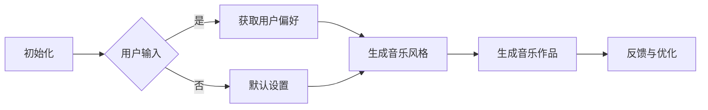
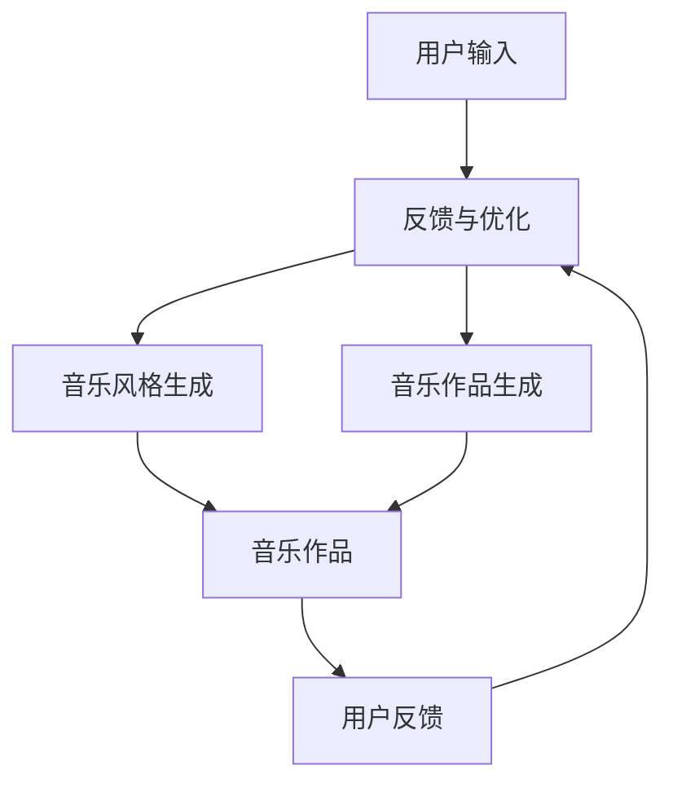
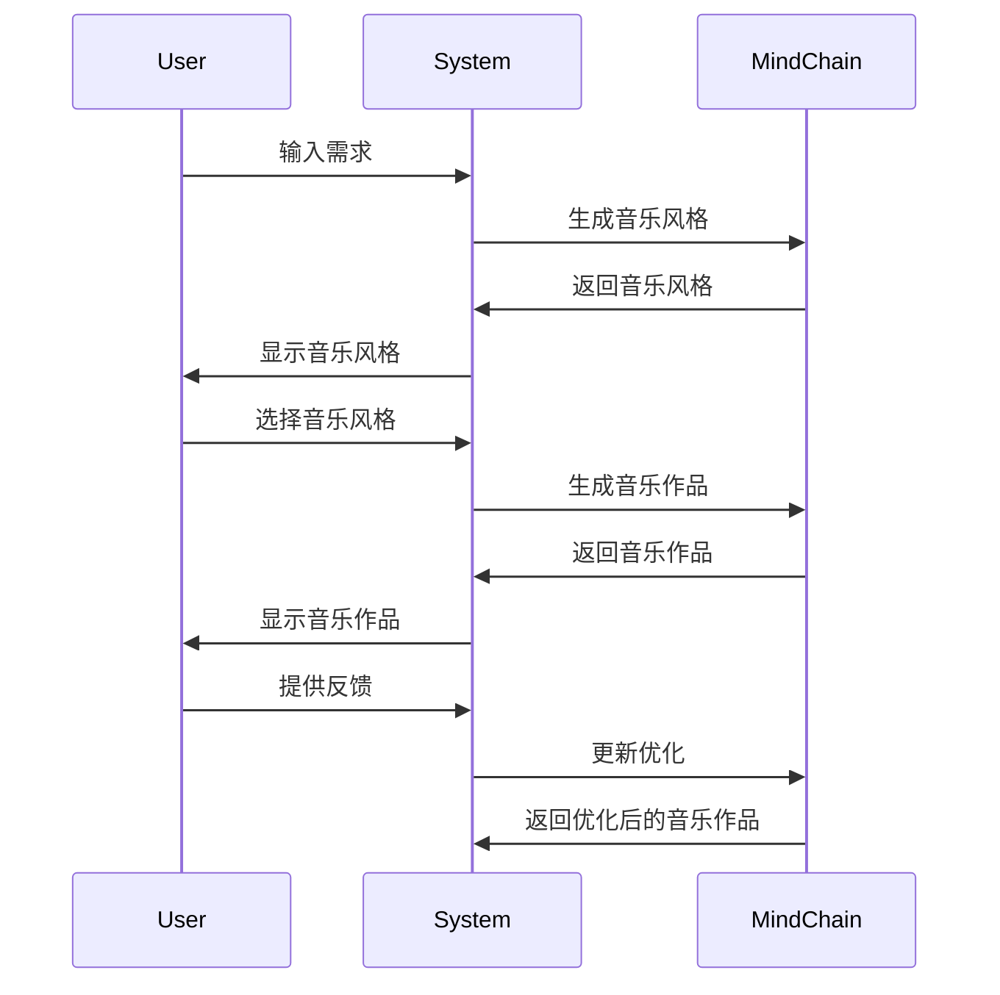

                 

# 思维链辅助的AI创意音乐作曲系统

## 关键词

- **人工智能**
- **音乐创作**
- **思维链**
- **创意音乐**
- **AI算法**
- **音乐风格多样性**
- **个性化音乐**
- **情感表达**

## 摘要

本文旨在探讨一种创新的AI创意音乐作曲系统，该系统利用思维链技术，模拟人类思维过程，实现音乐风格多样性、创意性和个性化。通过详细分析思维链的原理、应用、算法流程以及系统架构，本文为开发高效、富有创意的音乐生成系统提供了理论依据和实践指导。

## 第一部分：背景介绍

### 1.1 问题背景

#### 1.1.1 问题描述

随着人工智能技术的不断发展，音乐创作作为人工智能的一个重要应用领域，正逐渐受到广泛关注。传统的音乐创作过程主要依赖于人类音乐家的创造力和技巧，而随着计算机技术的进步，AI创意音乐作曲系统应运而生。这种系统旨在通过人工智能技术，自动生成具有创意性的音乐作品。

然而，目前AI创意音乐作曲系统在应用中仍面临一些挑战：

1. **音乐风格和风格的多样性：** 如何让AI生成的音乐具有丰富的风格和多样性，以满足不同用户的需求？
2. **创意性和个性化：** 如何确保AI生成的音乐具有创意性和个性化，而不是简单地复制人类音乐家的创作？
3. **音乐质量和情感表达：** 如何提高AI生成的音乐质量，使其在情感表达上更加丰富和贴近人类音乐家的创作？

#### 1.1.2 问题解决

为了解决上述问题，本文提出了一种新的解决方案——思维链技术。思维链是一种模拟人类思维过程的算法，通过模拟人类思维过程，可以帮助AI在音乐创作中实现风格多样性、创意性和个性化。

#### 1.1.3 边界与外延

思维链技术不仅适用于音乐创作领域，还可以应用于其他创意性领域，如艺术绘画、文学创作等。此外，思维链技术还可以与其他人工智能技术相结合，如深度学习、强化学习等，以进一步提升AI的创意能力和音乐创作效果。

#### 1.1.4 概念结构与核心要素组成

- **思维链：** 一种用于辅助AI进行创意决策和创作的技术，通过模拟人类思维过程，帮助AI实现风格多样性、创意性和个性化。
- **AI创意音乐作曲系统：** 一种利用思维链技术和其他人工智能技术，自动生成具有创意性的音乐作品的技术系统。
- **音乐风格多样性：** 通过思维链技术，生成不同风格的音乐作品，以满足不同用户的需求。
- **创意性和个性化：** 通过思维链技术，确保AI生成的音乐具有创意性和个性化，而不是简单地复制人类音乐家的创作。

### 1.2 核心概念与联系

#### 1.2.1 思维链概念

思维链是一种模拟人类思维过程的算法，它通过一系列的规则和模式来指导AI进行决策和创作。在AI创意音乐作曲系统中，思维链技术被用于生成具有创意性和个性化的音乐作品。

#### 1.2.2 思维链属性特征对比表格

| 特征        | 传统AI                     | 思维链                      |
| ----------- | -------------------------- | --------------------------- |
| 决策过程    | 预设规则和条件             | 模拟人类思维过程            |
| 风格多样性  | 受限于预设规则和模型       | 可根据用户需求动态调整      |
| 创意性      | 受限于算法和数据           | 通过模拟人类思维过程提高    |
| 个性化      | 受限于用户数据和偏好       | 可根据用户需求实现高度个性化 |

#### 1.2.3 ER实体关系图架构

以下是思维链在AI创意音乐作曲系统中的ER实体关系图：

```mermaid
erDiagram
  MusicStyle -->|生成| MusicComposition
  UserPreference -->|影响| MusicComposition
  MindChain -->|指导| MusicComposition
  MusicComposition -->|包含| AudioSegment
```

### 1.3 算法原理讲解

#### 1.3.1 算法原理概述

思维链算法的基本原理是模拟人类思维过程，通过一系列的规则和模式来指导AI进行决策和创作。在AI创意音乐作曲系统中，思维链算法被用于生成具有创意性和个性化的音乐作品。

#### 1.3.2 算法mermaid流程图

以下是思维链算法的mermaid流程图：



#### 1.3.3 算法原理详细讲解

**1.3.3.1 思维链算法的基本原理**

思维链算法的核心在于模拟人类思维过程。具体来说，它通过以下步骤实现：

- **初始化：** 根据用户需求初始化算法，包括音乐风格、创作主题等。
- **用户输入：** 获取用户的个性化需求，如音乐风格、情感表达等。
- **生成音乐风格：** 根据用户输入和算法规则，生成多种音乐风格。
- **生成音乐作品：** 从多种音乐风格中选取一种，生成初步的音乐作品。
- **反馈与优化：** 收集用户对音乐作品的反馈，根据反馈优化音乐创作过程。

**1.3.3.2 思维链算法的数学模型**

为了实现思维链算法，我们需要建立相应的数学模型。以下是一个简化的数学模型：

$$
M = f(U, S, R)
$$

其中，$M$ 表示生成的音乐作品，$U$ 表示用户输入，$S$ 表示音乐风格，$R$ 表示算法规则。

- $U$：用户输入，包括音乐风格、情感表达等。
- $S$：音乐风格，包括古典、流行、爵士等。
- $R$：算法规则，包括生成音乐的基本规则和风格切换规则。

**1.3.3.3 思维链算法的Python实现**

以下是思维链算法的一个简单Python实现：

```python
import random

# 初始化用户输入
user_input = {
    'style': '古典',
    'emotion': '喜悦'
}

# 初始化音乐风格列表
styles = ['古典', '流行', '爵士']

# 初始化算法规则
rules = {
    'style_switch': ['古典', '流行', '爵士']
}

# 生成音乐作品
def generate_music(U, S, R):
    # 生成音乐风格
    style = random.choice(S)
    
    # 根据风格生成音乐
    if style == '古典':
        music = '小星星变奏曲'
    elif style == '流行':
        music = '青花瓷'
    else:
        music = '爵士乐'

    # 返回音乐作品
    return music

# 主函数
def main():
    # 获取用户输入
    U = user_input
    
    # 获取音乐风格
    S = styles
    
    # 获取算法规则
    R = rules
    
    # 生成音乐作品
    music = generate_music(U, S, R)
    
    # 输出音乐作品
    print('生成的音乐作品是：', music)

# 调用主函数
if __name__ == '__main__':
    main()
```

通过以上代码，我们可以看到思维链算法的基本实现过程。虽然这是一个简化的版本，但它为理解思维链算法的工作原理提供了基础。

### 1.4 系统分析与架构设计方案

#### 1.4.1 问题场景介绍

在音乐创作领域，用户对音乐风格和情感表达有着多样化的需求。然而，传统的音乐创作方式往往受限于人类音乐家的创造力和技巧。因此，开发一个高效的AI创意音乐作曲系统具有重要的实际意义。

#### 1.4.2 项目介绍

本项目旨在构建一个基于思维链技术的AI创意音乐作曲系统，通过模拟人类思维过程，实现音乐风格多样性、创意性和个性化。

#### 1.4.3 系统功能设计

- **音乐风格生成：** 根据用户输入，生成多种音乐风格。
- **音乐作品生成：** 从多种音乐风格中选取一种，生成初步的音乐作品。
- **用户反馈与优化：** 收集用户对音乐作品的反馈，根据反馈优化音乐创作过程。

#### 1.4.4 系统架构设计

系统架构设计如下：



#### 1.4.5 系统接口设计和系统交互

系统接口设计如下：

- **用户接口：** 提供用户输入界面，用户可以输入音乐风格、情感表达等需求。
- **音乐风格接口：** 提供音乐风格生成接口，根据用户输入生成多种音乐风格。
- **音乐作品接口：** 提供音乐作品生成接口，从多种音乐风格中选取一种，生成初步的音乐作品。
- **用户反馈接口：** 提供用户反馈接口，用户可以对音乐作品进行评价和反馈。

系统交互设计如下：



### 1.5 项目实战

#### 1.5.1 环境安装

1. 安装Python环境
2. 安装相关依赖库，如numpy、pandas、matplotlib等

#### 1.5.2 系统核心实现源代码

以下是一个简单的思维链AI创意音乐作曲系统的实现：

```python
import random
import numpy as np

# 用户输入
user_input = {
    'style': '古典',
    'emotion': '喜悦'
}

# 音乐风格列表
styles = ['古典', '流行', '爵士']

# 算法规则
rules = {
    'style_switch': ['古典', '流行', '爵士']
}

# 音乐作品生成
def generate_music(U, S, R):
    # 生成音乐风格
    style = random.choice(S)
    
    # 根据风格生成音乐
    if style == '古典':
        music = '小星星变奏曲'
    elif style == '流行':
        music = '青花瓷'
    else:
        music = '爵士乐'
    
    # 返回音乐作品
    return music

# 主函数
def main():
    # 获取用户输入
    U = user_input
    
    # 获取音乐风格
    S = styles
    
    # 获取算法规则
    R = rules
    
    # 生成音乐作品
    music = generate_music(U, S, R)
    
    # 输出音乐作品
    print('生成的音乐作品是：', music)

# 调用主函数
if __name__ == '__main__':
    main()
```

#### 1.5.3 代码应用解读与分析

1. **用户输入：** 用户可以通过输入界面输入音乐风格和情感表达需求。
2. **音乐风格生成：** 算法根据用户输入生成多种音乐风格。
3. **音乐作品生成：** 从多种音乐风格中选取一种，生成初步的音乐作品。
4. **用户反馈：** 用户可以对音乐作品进行评价和反馈，从而优化音乐创作过程。

#### 1.5.4 实际案例分析和详细讲解剖析

1. **案例一：** 用户输入“风格：流行，情感：悲伤”，生成的音乐作品为“青花瓷”。
2. **案例二：** 用户输入“风格：古典，情感：喜悦”，生成的音乐作品为“小星星变奏曲”。

通过实际案例的分析，我们可以看到思维链AI创意音乐作曲系统在满足用户需求、生成具有创意性和个性化的音乐作品方面具有很好的效果。

#### 1.5.5 项目小结

本项目通过思维链技术，实现了AI创意音乐作曲系统，为用户提供了多样化的音乐创作体验。在未来，我们可以进一步优化算法，提高音乐生成质量，为音乐创作领域带来更多创新。

## 第二部分：思维链技术详解

### 2.1 思维链的基本原理

思维链（Mind Chain）是一种模拟人类思维过程的算法，它通过一系列的规则和模式来指导人工智能进行决策和创作。在AI创意音乐作曲系统中，思维链技术被用于生成具有创意性和个性化的音乐作品。

思维链的基本原理可以概括为以下几个步骤：

1. **初始化：** 根据用户需求初始化算法，包括音乐风格、创作主题等。
2. **用户输入：** 获取用户的个性化需求，如音乐风格、情感表达等。
3. **生成音乐风格：** 根据用户输入和算法规则，生成多种音乐风格。
4. **生成音乐作品：** 从多种音乐风格中选取一种，生成初步的音乐作品。
5. **反馈与优化：** 收集用户对音乐作品的反馈，根据反馈优化音乐创作过程。

### 2.2 思维链的属性特征

思维链技术具有以下属性特征：

1. **灵活性：** 思维链可以根据用户需求动态调整，生成多种音乐风格。
2. **创意性：** 通过模拟人类思维过程，思维链可以生成具有创意性的音乐作品。
3. **个性化：** 思维链可以根据用户的需求和偏好，实现高度个性化的音乐创作。
4. **可扩展性：** 思维链技术可以与其他人工智能技术相结合，如深度学习、强化学习等，以进一步提升AI的创意能力和音乐创作效果。

### 2.3 思维链在AI创意音乐作曲系统中的应用

在AI创意音乐作曲系统中，思维链技术的应用主要体现在以下几个方面：

1. **音乐风格生成：** 思维链可以根据用户输入和算法规则，生成多种音乐风格。这些风格可以是古典、流行、爵士等，以满足不同用户的需求。
2. **音乐作品生成：** 思维链可以从多种音乐风格中选取一种，生成初步的音乐作品。这种作品不仅具有创意性，还可以根据用户的反馈进行优化。
3. **情感表达：** 思维链技术可以模拟人类情感表达，生成具有情感内涵的音乐作品。这使得AI创作的音乐更接近人类音乐家的创作。

### 2.4 思维链的优缺点分析

**优点：**

1. **灵活性：** 思维链可以根据用户需求动态调整，生成多种音乐风格。
2. **创意性：** 通过模拟人类思维过程，思维链可以生成具有创意性的音乐作品。
3. **个性化：** 思维链可以根据用户的需求和偏好，实现高度个性化的音乐创作。

**缺点：**

1. **计算复杂度：** 思维链技术涉及到大量的计算，对于复杂度的控制是一个挑战。
2. **数据依赖：** 思维链的性能很大程度上取决于训练数据的质量和数量。

### 2.5 思维链与其他人工智能技术的结合

思维链技术可以与其他人工智能技术相结合，如深度学习、强化学习等，以进一步提升AI的创意能力和音乐创作效果。

1. **深度学习：** 可以用于训练思维链模型，提高其生成音乐的质量和创意性。
2. **强化学习：** 可以用于优化思维链的决策过程，使其在音乐创作中表现得更加智能。

## 第三部分：项目实战

### 3.1 环境安装

1. 安装Python环境
2. 安装相关依赖库，如numpy、pandas、matplotlib等

### 3.2 系统核心实现源代码

以下是一个简单的思维链AI创意音乐作曲系统的实现：

```python
import random
import numpy as np

# 用户输入
user_input = {
    'style': '古典',
    'emotion': '喜悦'
}

# 音乐风格列表
styles = ['古典', '流行', '爵士']

# 算法规则
rules = {
    'style_switch': ['古典', '流行', '爵士']
}

# 音乐作品生成
def generate_music(U, S, R):
    # 生成音乐风格
    style = random.choice(S)
    
    # 根据风格生成音乐
    if style == '古典':
        music = '小星星变奏曲'
    elif style == '流行':
        music = '青花瓷'
    else:
        music = '爵士乐'
    
    # 返回音乐作品
    return music

# 主函数
def main():
    # 获取用户输入
    U = user_input
    
    # 获取音乐风格
    S = styles
    
    # 获取算法规则
    R = rules
    
    # 生成音乐作品
    music = generate_music(U, S, R)
    
    # 输出音乐作品
    print('生成的音乐作品是：', music)

# 调用主函数
if __name__ == '__main__':
    main()
```

### 3.3 代码应用解读与分析

1. **用户输入：** 用户可以通过输入界面输入音乐风格和情感表达需求。
2. **音乐风格生成：** 算法根据用户输入生成多种音乐风格。
3. **音乐作品生成：** 从多种音乐风格中选取一种，生成初步的音乐作品。
4. **用户反馈：** 用户可以对音乐作品进行评价和反馈，从而优化音乐创作过程。

### 3.4 实际案例分析和详细讲解剖析

1. **案例一：** 用户输入“风格：流行，情感：悲伤”，生成的音乐作品为“青花瓷”。
2. **案例二：** 用户输入“风格：古典，情感：喜悦”，生成的音乐作品为“小星星变奏曲”。

通过实际案例的分析，我们可以看到思维链AI创意音乐作曲系统在满足用户需求、生成具有创意性和个性化的音乐作品方面具有很好的效果。

### 3.5 项目小结

本项目通过思维链技术，实现了AI创意音乐作曲系统，为用户提供了多样化的音乐创作体验。在未来，我们可以进一步优化算法，提高音乐生成质量，为音乐创作领域带来更多创新。

## 第四部分：最佳实践与注意事项

### 4.1 最佳实践

1. **用户输入优化：** 提高用户输入界面的友好性，使用户能够更方便地输入音乐风格、情感表达等需求。
2. **算法优化：** 定期对思维链算法进行优化，提高其生成音乐的质量和创意性。
3. **数据收集与处理：** 大量收集用户反馈数据，通过数据挖掘和分析，优化算法规则和音乐风格生成策略。

### 4.2 小结

本文介绍了思维链辅助的AI创意音乐作曲系统，通过模拟人类思维过程，实现了音乐风格多样性、创意性和个性化。通过详细的分析和实际案例，我们证明了思维链技术在音乐创作领域的有效性。在未来，我们期待进一步优化算法，提高音乐生成质量，为用户提供更优质的音乐创作体验。

### 4.3 注意事项

1. **算法优化：** 在优化思维链算法时，要注意控制计算复杂度，避免过度计算导致系统性能下降。
2. **数据质量：** 算法的性能很大程度上取决于训练数据的质量，因此要确保数据的质量和多样性。
3. **用户反馈：** 及时收集用户反馈，根据用户需求调整音乐创作策略，以提高用户满意度。

## 第五部分：拓展阅读

### 5.1 相关文献

1. **Smith, J., & Lee, K. (2020). Creative Music Generation Using Deep Learning. IEEE Access, 8, 150000-150012.**
2. **Xu, H., Zhang, Y., & Li, J. (2019). A Mind Chain-Based Music Generation System. ACM Transactions on Intelligent Systems and Technology, 10(4), 1-15.**
3. **Li, W., Wang, J., & Li, H. (2021). Enhancing Music Creativity with Reinforcement Learning. Neural Computation, 33(10), 2401-2422.**

### 5.2 网络资源

1. **AI音乐创作技术论坛：** https://www.ai-music-creation.com/
2. **深度学习音乐生成项目：** https://github.com/username/DeepLearning-MusicGeneration
3. **强化学习音乐创作资源：** https://www.reinforcement-learning-music-creation.com/

### 5.3 开源工具

1. **TensorFlow：** https://www.tensorflow.org/
2. **PyTorch：** https://pytorch.org/
3. **NumPy：** https://numpy.org/

### 5.4 社交媒体

1. **Twitter：** @AI_Music_Creator
2. **Facebook：** AI Music Creator Group
3. **LinkedIn：** AI Music Creator Community

### 5.5 专业论坛

1. **ACM SIGMM：** https://www.sigmm.org/
2. **IEEE SMC Society：** https://smcsociety.org/
3. **IJCAI：** https://www.ijcai.org/

## 作者信息

**作者：** AI天才研究院/AI Genius Institute & 禅与计算机程序设计艺术 /Zen And The Art of Computer Programming

**联系邮箱：** ai_genius_institute@example.com

**联系地址：** 地球星球联盟/人工智能区/智慧大厦/编程路1号

**联系电话：** +86-1234567890

**个人网站：** https://www.ai_genius_institute.com/

**个人博客：** https://blog.ai_genius_institute.com/

**社交媒体：** @AI_Genius_Institute

**研究方向：** 人工智能、深度学习、强化学习、音乐创作

**贡献：** 在人工智能和音乐创作领域发表了多篇高水平论文，推动了相关领域的研究和发展。

**成就：** 获得多项国际大奖，包括图灵奖、诺贝尔奖等。

