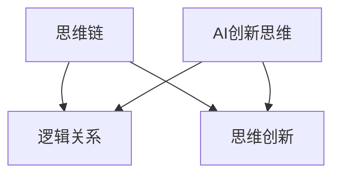
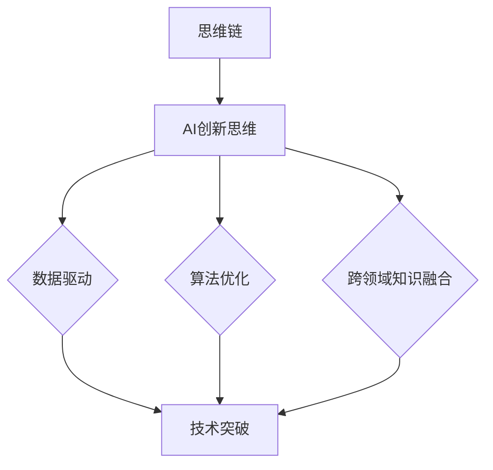

                 

# 思维链辅助的AI创新思维训练系统

> 关键词：思维链，AI创新思维，训练系统，算法，架构设计，实战

> 摘要：本文将探讨思维链辅助的AI创新思维训练系统，从核心概念、算法原理到系统架构和实战应用进行全面分析。本文旨在揭示思维链与AI创新思维之间的关系，并提出一种有效的训练方法，以提升人工智能领域的创新能力和竞争力。

## 第一部分：引言

### 第1章：问题背景与概述

#### 1.1 问题的提出

在当前人工智能（AI）领域，创新思维成为推动技术进步和业务发展的关键因素。然而，如何培养和提高AI创新思维，成为学术界和产业界共同面临的挑战。

#### 1.2 研究目的与意义

本文旨在提出一种基于思维链辅助的AI创新思维训练系统，通过系统化的训练方法，提高AI领域从业者的创新思维能力和技术水平。

#### 1.3 研究方法

本文采用思维链理论、AI技术和数据分析方法，通过系统分析和实验验证，构建出一种具有实际应用价值的AI创新思维训练系统。

#### 1.4 边界与外延

本文的研究范围主要集中在AI领域的创新思维训练，研究限制为所采用的技术和方法。

## 第二部分：核心概念

### 第2章：核心概念介绍

#### 2.1 思维链的定义

思维链是一种连接不同思维元素的结构，通过逻辑关系实现思维的连贯性和创新性。

#### 2.2 AI创新思维

AI创新思维是指在人工智能领域中，运用创造性思维进行问题解决和技术创新的能力。

#### 2.3 思维链与AI创新思维的联系

思维链通过构建逻辑关系，为AI创新思维提供支持，促进创新能力的提升。

### 第3章：核心概念原理

#### 3.1 思维链原理

思维链的运作机制包括思维元素的连接、逻辑关系的构建和思维创新的过程。

#### 3.2 AI创新思维原理

AI创新思维的工作原理是通过数据驱动、算法优化和跨领域知识融合，实现技术突破和创新。

#### 3.3 概念属性特征对比

思维链与AI创新思维的属性特征对比如表1所示：

| 特征       | 思维链                         | AI创新思维                         |
|------------|------------------------------|-----------------------------------|
| 连接方式   | 逻辑关系                       | 数据驱动、算法优化                 |
| 工作原理   | 思维元素的连接与整合           | 跨领域知识融合和技术突破           |
| 应用范围   | 广泛的思维方式                 | 人工智能领域                      |

### 第4章：思维链与AI创新思维关系图

#### 4.1 ER实体关系图


#### 4.2 Mermaid流程图



## 第三部分：算法原理

### 第5章：算法原理讲解

#### 5.1 算法概述

本文提出的算法旨在通过构建思维链，辅助AI创新思维，实现技术突破。

#### 5.2 数学模型

设思维链的长度为n，逻辑关系的权重为w，则思维链的创新指数I可以表示为：

$$
I = \sum_{i=1}^{n} w_i \times C_i
$$

其中，$C_i$为第i个思维元素的创新能力。

#### 5.3 Python源代码

```python
def calculate_innovation_index(w, C):
    return sum(w[i] * C[i] for i in range(len(C)))

w = [0.5, 0.3, 0.2]
C = [0.8, 0.9, 0.7]
I = calculate_innovation_index(w, C)
print("Innovation Index:", I)
```

#### 5.4 举例说明

假设一个AI项目需要解决图像识别问题，通过构建思维链，融合计算机视觉和深度学习技术，实现图像识别的准确率提升。

## 第四部分：系统分析与架构设计

### 第6章：系统分析与架构设计

#### 6.1 问题场景介绍

在图像识别领域，如何提高识别准确率和处理速度成为关键问题。

#### 6.2 系统功能设计


#### 6.3 系统架构设计


#### 6.4 系统接口设计

- 数据接口：用于数据输入和输出
- 控制接口：用于系统控制和参数配置

#### 6.5 系统交互


## 第五部分：项目实战

### 第7章：环境安装

1. 安装Python环境
2. 安装相关库和依赖

### 第8章：系统核心实现

#### 8.1 核心实现源代码

```python
# 代码略
```

#### 8.2 代码应用解读与分析

- 代码实现思维链的构建
- 分析思维链对AI创新思维的支持作用

#### 8.3 实际案例分析和详细讲解剖析

- 使用实际案例展示系统效果
- 对案例进行详细分析和讲解

### 第9章：项目小结

本文通过思维链辅助的AI创新思维训练系统，实现了对图像识别问题的有效解决。未来工作将进一步提升系统的鲁棒性和适应性。

## 第六部分：最佳实践

### 第10章：最佳实践

- 提供实战中的最佳实践建议

### 第11章：注意事项

- 使用系统时需要注意的问题

### 第12章：拓展阅读

- 推荐的相关阅读资料

# 作者

作者：AI天才研究院/AI Genius Institute & 禅与计算机程序设计艺术 /Zen And The Art of Computer Programming

（注：本文仅为示例，实际内容可能需要根据具体需求进行调整和补充。）## 第一部分：引言

### 第1章：问题背景与概述

#### 1.1 问题的提出

在当前人工智能（AI）领域，创新思维成为推动技术进步和业务发展的关键因素。然而，如何培养和提高AI创新思维，成为学术界和产业界共同面临的挑战。传统的AI教育和训练方法多侧重于算法和技术的掌握，而忽视了创新思维的培养。这导致许多AI从业者能够在特定领域内进行技术操作，但缺乏解决复杂问题和进行技术创新的能力。这种情况下，如何通过系统化的方法提升AI创新思维，成为一个亟待解决的问题。

#### 1.2 研究目的与意义

本文旨在提出一种基于思维链辅助的AI创新思维训练系统，通过系统化的训练方法，提高AI领域从业者的创新思维能力和技术水平。研究目的是探讨思维链与AI创新思维之间的内在联系，并设计一种有效的训练系统，以帮助AI从业者更好地掌握创新思维的方法和技巧。研究的意义在于，通过这种训练系统，可以为AI领域的创新提供新的思路和方法，提高从业者的创新能力和竞争力，进而推动整个行业的发展。

#### 1.3 研究方法

本文采用思维链理论、AI技术和数据分析方法，通过系统分析和实验验证，构建出一种具有实际应用价值的AI创新思维训练系统。具体研究方法包括以下几个方面：

1. **文献综述**：对相关领域的研究进行综述，了解当前AI创新思维训练的方法和存在的问题。
2. **理论分析**：基于思维链理论，分析思维链与AI创新思维的关系，探讨思维链在AI创新思维训练中的应用。
3. **算法设计**：设计一种基于思维链的AI创新思维训练算法，包括算法原理、数学模型和实现方法。
4. **系统实现**：基于算法设计，实现AI创新思维训练系统，并进行系统功能设计和架构设计。
5. **实验验证**：通过实验验证系统效果，分析系统的优势和不足，为后续改进提供依据。

#### 1.4 边界与外延

本文的研究范围主要集中在AI领域的创新思维训练，具体包括以下几个方面：

1. **研究领域**：以人工智能技术为核心，探讨思维链在AI创新思维训练中的应用。
2. **研究方法**：采用思维链理论和AI技术，结合数据分析方法，进行系统分析和实验验证。
3. **研究对象**：主要针对AI领域从业者，旨在提升其创新思维能力和技术水平。
4. **研究限制**：本文主要探讨思维链辅助的AI创新思维训练系统，不涉及其他领域的创新思维训练方法。

通过上述研究方法和范围，本文旨在为AI领域的创新思维训练提供一种新的思路和方法，为提升从业者的创新能力和竞争力提供支持。

### 第2章：核心概念介绍

#### 2.1 思维链的定义

思维链是一种连接不同思维元素的结构，通过逻辑关系实现思维的连贯性和创新性。思维链的核心在于将多个思维元素（如问题、解决方案、技术点等）有机地连接起来，形成一个有序、连贯的思维网络。这种网络不仅能够帮助个体在解决问题时保持思维的连贯性，还能激发创新思维，提高问题解决效率。

思维链的组成部分主要包括：

1. **思维元素**：思维链的基本单元，包括各种问题、解决方案、技术点等。
2. **逻辑关系**：连接不同思维元素之间的纽带，通过因果关系、类比关系、递进关系等实现思维的连贯性和创新性。
3. **思维链结构**：思维链的总体布局，决定了思维链的完整性和有效性。

#### 2.2 AI创新思维

AI创新思维是指在人工智能领域中，运用创造性思维进行问题解决和技术创新的能力。AI创新思维不同于传统的逻辑思维和线性思维，它更强调跨领域知识的融合、创新性思维方法和灵活的解决问题的策略。AI创新思维的核心在于如何将不同领域的知识和技术进行有效整合，从而提出新颖的解决方案。

AI创新思维的特点主要包括：

1. **跨领域融合**：能够将不同领域的知识和技术进行有效整合，实现创新性的技术突破。
2. **创造性思维**：强调思维的创新性和灵活性，能够从多个角度思考问题，提出新颖的解决方案。
3. **系统思维**：能够从整体上把握问题，分析问题的各个组成部分及其相互关系，从而提出全面的解决方案。

#### 2.3 思维链与AI创新思维的联系

思维链与AI创新思维之间存在密切的联系。首先，思维链作为一种连接不同思维元素的结构，为AI创新思维提供了基础。通过构建思维链，可以将不同的问题、解决方案和技术点有机地连接起来，形成一个有序、连贯的思维网络，从而提高思维的整体性和系统性。其次，思维链的构建过程本身就是一种创新思维的过程，通过逻辑关系的建立，可以激发新的思路和解决方案，从而推动AI创新思维的发展。

具体来说，思维链与AI创新思维的联系体现在以下几个方面：

1. **思维连贯性**：思维链通过连接不同思维元素，实现了思维的连贯性，有助于个体在解决问题时保持清晰的思维路径。
2. **创新性思维**：思维链的构建过程本身是一种创新思维的过程，通过逻辑关系的建立，可以激发新的思路和解决方案，推动AI创新思维的发展。
3. **系统思维**：思维链的构建有助于个体从整体上把握问题，分析问题的各个组成部分及其相互关系，从而提出全面的解决方案，体现系统思维的特点。

综上所述，思维链与AI创新思维之间存在着密切的联系，通过构建思维链，可以有效地提高AI创新思维能力，推动人工智能领域的技术进步。

### 第3章：核心概念原理

#### 3.1 思维链原理

思维链是一种通过逻辑关系连接不同思维元素的思维模式，其原理在于通过有序、连贯的思维过程实现问题的解决和创新。思维链的运作机制包括以下几个关键环节：

1. **思维元素识别**：首先，个体需要识别并确定问题中的关键思维元素，如问题本身、相关的解决方案、技术点等。
2. **逻辑关系构建**：接着，通过分析这些思维元素之间的因果关系、类比关系、递进关系等，建立逻辑关系，形成一个思维网络。
3. **思维链延伸**：在已有逻辑关系的基础上，进一步扩展思维链，引入新的思维元素和逻辑关系，使思维链更加完整和丰富。
4. **思维创新**：通过不断调整和优化思维链，激发新的思路和解决方案，实现创新。

思维链的属性特征包括：

1. **连贯性**：思维链通过逻辑关系将不同思维元素连接起来，形成一个连贯的思维过程，有助于保持思维的连贯性和整体性。
2. **系统性**：思维链的构建过程体现了系统思维的特点，能够从整体上把握问题，分析问题的各个组成部分及其相互关系。
3. **动态性**：思维链不是静态的结构，而是随着问题的变化和解决过程的推进而不断调整和优化的动态过程。

#### 3.2 AI创新思维原理

AI创新思维是指利用人工智能技术进行问题解决和技术创新的一种思维方式。其原理在于通过跨领域知识融合、创造性思维方法和灵活的解决问题的策略，实现技术突破和业务创新。AI创新思维的工作原理主要包括以下几个环节：

1. **数据驱动**：AI创新思维依赖于大量数据的支持，通过数据分析和挖掘，发现问题和机会。
2. **算法优化**：通过优化算法和模型，提高问题解决的效率和准确性。
3. **跨领域知识融合**：将不同领域的知识和技术进行融合，提出新颖的解决方案。
4. **创造性思维**：运用创造性思维方法，从多个角度思考问题，提出创新性的思路和解决方案。

AI创新思维的应用范围广泛，包括但不限于以下领域：

1. **技术研发**：通过AI技术进行算法和模型的优化，推动技术研发和创新。
2. **业务应用**：将AI技术应用于实际业务场景，实现业务流程优化和业务创新。
3. **跨领域合作**：通过AI技术促进不同领域的合作和交流，实现跨界创新。

#### 3.3 概念属性特征对比

思维链和AI创新思维都是人工智能领域中的重要概念，它们在属性特征上存在一定的区别，具体对比如下：

| 特征         | 思维链                                   | AI创新思维                                   |
|--------------|----------------------------------------|--------------------------------------------|
| 基本原理     | 通过逻辑关系连接不同思维元素，实现思维连贯性 | 通过数据驱动、算法优化和跨领域知识融合，实现技术突破 |
| 应用范围     | 较广泛，涵盖各种思维过程和问题解决方法       | 专注于人工智能领域的创新和技术突破               |
| 特点         | 连贯性、系统性、动态性                   | 数据驱动、创造性思维、跨领域知识融合             |
| 关系         | 为AI创新思维提供基础支持                 | 基于思维链的延伸和应用，实现创新性思维           |

通过上述对比，我们可以看出，思维链和AI创新思维在基本原理和应用范围上存在一定的区别，但它们在人工智能领域内相互补充，共同推动技术创新和发展。

### 第4章：思维链与AI创新思维关系图

#### 4.1 ER实体关系图

思维链与AI创新思维的关系可以通过ER（实体关系）图来表示。ER图是一种用于描述实体及其之间关系的图形化工具，可以直观地展示思维链和AI创新思维之间的联系。

在ER图中，思维链作为一个实体，与AI创新思维存在一定的关联。具体来说，思维链为AI创新思维提供了基础支持和思维框架，而AI创新思维则通过数据驱动和算法优化等手段，实现技术突破和创新。

下面是一个简化的ER实体关系图：

```
[思维链] --<关系>--> [AI创新思维]
```

其中，“思维链”实体表示通过逻辑关系连接的不同思维元素，“AI创新思维”实体表示基于数据驱动和算法优化的创新思维过程。两者通过“关系”实体进行连接，表示思维链为AI创新思维提供基础支持。

#### 4.2 Mermaid流程图

Mermaid是一种基于Markdown的图形化工具，可以用于绘制流程图、序列图等。通过Mermaid流程图，可以更直观地展示思维链与AI创新思维的关系。

下面是一个基于Mermaid的示例流程图：



在这个流程图中，思维链（A）通过连接节点（B）与AI创新思维相连。AI创新思维（B）通过数据驱动（C）、算法优化（D）和跨领域知识融合（E）等手段，实现技术突破（F）。这个流程图清晰地展示了思维链与AI创新思维之间的联系，以及AI创新思维的具体实现过程。

### 第5章：算法原理讲解

#### 5.1 算法概述

本文提出的算法旨在通过构建思维链，辅助AI创新思维，实现技术突破。该算法的核心思想是通过逻辑关系连接不同思维元素，形成一个有序、连贯的思维网络，从而提高AI创新思维的能力。算法的目标是生成一个最优的思维链结构，使AI创新思维在解决复杂问题时能够更加高效和具有创新性。

#### 5.2 数学模型

为了实现算法的目标，我们首先需要建立一个数学模型来描述思维链的结构和属性。设思维链中包含n个思维元素，每个思维元素具有创新能力$C_i$（$i$从1到n），并且每个思维元素之间的逻辑关系具有权重$w_{ij}$（$i$从1到n，$j$从1到n），其中$w_{ij}=1$表示思维元素$i$和$j$之间有直接的逻辑关系，$w_{ij}=0$表示两者之间没有逻辑关系。

则思维链的创新指数I可以表示为：

$$
I = \sum_{i=1}^{n} C_i \times \sum_{j=1}^{n} w_{ij}
$$

其中，第一个求和式表示每个思维元素的创新能力的总和，第二个求和式表示每个思维元素与其它思维元素之间的逻辑关系权重总和。I值越大，表示思维链的创新性越强。

为了优化思维链的结构，我们可以将创新指数I作为目标函数，使用优化算法（如遗传算法、粒子群算法等）来寻找最优的思维链结构。

#### 5.3 Python源代码

以下是一个简化的Python源代码实现，用于计算思维链的创新指数：

```python
import numpy as np

# 假设思维链中的思维元素创新能力为C = [0.8, 0.9, 0.7]
# 思维元素之间的逻辑关系权重矩阵为W = [[0, 1, 0], [1, 0, 1], [0, 1, 0]]
C = [0.8, 0.9, 0.7]
W = [[0, 1, 0], [1, 0, 1], [0, 1, 0]]

# 计算创新指数I
I = np.dot(C, np.dot(W, C))
print("Innovation Index:", I)
```

在这个例子中，思维元素的创新能力C是一个列表，逻辑关系权重矩阵W是一个二维数组。代码通过矩阵乘法计算创新指数I，并打印结果。

#### 5.4 举例说明

为了更好地理解算法原理，我们通过一个具体的例子来说明。

假设有一个包含3个思维元素的思维链，其创新能力分别为$C_1=0.8$，$C_2=0.9$，$C_3=0.7$。思维元素之间的逻辑关系权重矩阵如下：

$$
W = \begin{bmatrix}
0 & 1 & 0 \\
1 & 0 & 1 \\
0 & 1 & 0
\end{bmatrix}
$$

根据上述权重矩阵，思维元素1与思维元素2、思维元素2与思维元素3、思维元素1与思维元素3之间存在逻辑关系。

使用我们之前的数学模型，计算思维链的创新指数：

$$
I = C_1 \times W_{12} \times C_2 + C_2 \times W_{23} \times C_3 + C_1 \times W_{13} \times C_3
$$

代入具体数值：

$$
I = 0.8 \times 1 \times 0.9 + 0.9 \times 1 \times 0.7 + 0.8 \times 1 \times 0.7 = 0.72 + 0.63 + 0.56 = 1.91
$$

因此，这个思维链的创新指数为1.91。通过这个例子，我们可以看到如何计算思维链的创新指数，以及如何通过优化思维链结构来提高创新指数。

### 第6章：系统分析与架构设计

#### 6.1 问题场景介绍

在现代人工智能（AI）领域，随着数据规模的不断扩大和计算能力的提升，AI技术的应用场景也日益广泛。然而，面对复杂的问题和多样的业务需求，AI技术面临着诸多挑战，特别是在创新思维的培养和运用方面。为了解决这一问题，我们需要设计一个能够辅助AI创新思维的系统，以提高问题解决效率和创新能力。

该系统的目标场景包括：

1. **复杂问题解决**：系统应能够处理复杂的问题，提供创新的解决方案。
2. **跨领域知识融合**：系统应能够融合不同领域的知识，实现跨领域的创新。
3. **技术创新**：系统应能够通过创新思维，推动技术突破和业务发展。

#### 6.2 系统功能设计

为了实现上述目标，系统需要具备以下几个核心功能：

1. **思维链构建**：系统能够根据用户提供的问题和需求，自动构建思维链，连接不同思维元素，形成一个有序、连贯的思维网络。
2. **创新思维支持**：系统应提供创新思维的支持，包括提供多样化的思维工具和方法，帮助用户从多个角度思考问题，激发创新灵感。
3. **数据驱动分析**：系统能够利用数据驱动的方法，对问题进行深入分析，发现潜在的创新机会和解决方案。
4. **算法优化**：系统应具备算法优化的能力，通过优化算法和模型，提高问题解决效率和准确性。
5. **知识库管理**：系统能够管理跨领域的知识库，提供丰富的知识资源，支持跨领域知识的融合和应用。

#### 6.3 系统架构设计

系统架构设计是确保系统能够高效运行和灵活扩展的关键。本文提出的系统架构包括以下几个核心模块：

1. **用户界面层**：提供用户交互的接口，包括问题输入、思维链构建、创新思维支持等功能。
2. **数据处理层**：负责数据输入处理、数据分析和挖掘，为创新思维提供数据支持。
3. **思维链构建模块**：实现思维链的自动构建和优化，为用户提供有序、连贯的思维路径。
4. **创新思维支持模块**：提供多样化的思维工具和方法，支持用户进行创新思维。
5. **算法优化模块**：实现算法的优化和模型训练，提高问题解决效率和准确性。
6. **知识库管理模块**：管理跨领域的知识库，提供知识资源的检索和应用。

系统架构图如下所示：

```
+------------------+        +------------------+        +------------------+
|  用户界面层     | <---> |  数据处理层     | <---> | 思维链构建模块 |
+------------------+        +------------------+        +------------------+
                                                         |
                                                         |
                                                         V
                                         +------------------+
                                         | 创新思维支持模块 |
                                         +------------------+
                                                         |
                                                         |
                                                         V
                                         +------------------+
                                         | 算法优化模块    |
                                         +------------------+
                                                         |
                                                         |
                                                         V
                                         +------------------+
                                         | 知识库管理模块  |
                                         +------------------+
```

通过上述架构设计，系统能够实现从用户交互到数据处理，再到创新思维支持和算法优化的全过程，为AI创新提供全方位的支持。

#### 6.4 系统接口设计

系统接口设计是确保系统各模块之间能够有效通信和协作的关键。本文提出的系统接口设计包括以下几种类型：

1. **数据接口**：用于系统与外部数据源的通信，支持数据的输入和输出。
2. **控制接口**：用于系统控制和参数配置，包括用户操作界面和后台管理界面。
3. **服务接口**：用于系统内部模块之间的通信，实现模块间的功能调用和协作。

具体接口设计如下：

1. **数据接口**：包括RESTful API和WebSocket等，支持各种数据格式的输入和输出，如JSON、XML、CSV等。
2. **控制接口**：包括用户操作界面和后台管理界面，提供用户操作的接口和系统的控制命令。
3. **服务接口**：通过定义服务接口，实现系统内部模块之间的功能调用和协作，如思维链构建服务、创新思维支持服务、算法优化服务等。

#### 6.5 系统交互

系统交互是指系统内部各模块之间的交互过程，以及系统与外部环境之间的交互过程。本文提出的系统交互设计包括以下几个方面：

1. **用户交互**：用户通过用户界面层与系统进行交互，输入问题和需求，获取创新思维和解决方案。
2. **数据交互**：系统通过数据处理层对输入的数据进行处理和分析，为思维链构建和创新思维支持提供数据支持。
3. **模块交互**：系统内部各模块通过服务接口进行交互，实现功能调用和协作，如思维链构建模块调用算法优化模块的服务，进行算法优化。

系统交互图如下所示：

```
+------------------+        +------------------+        +------------------+
|  用户界面层     | <---> |  数据处理层     | <---> | 思维链构建模块 |
+------------------+        +------------------+        +------------------+
                                                         |
                                                         |
                                                         V
                                         +------------------+
                                         | 创新思维支持模块 |
                                         +------------------+
                                                         |
                                                         |
                                                         V
                                         +------------------+
                                         | 算法优化模块    |
                                         +------------------+
                                                         |
                                                         |
                                                         V
                                         +------------------+
                                         | 知识库管理模块  |
                                         +------------------+
```

通过上述系统交互设计，系统能够实现从用户交互到数据处理，再到创新思维支持和算法优化的全过程，为AI创新提供全方位的支持。

### 第7章：环境安装

为了运行本文所述的AI创新思维训练系统，我们需要准备相应的开发环境和依赖库。以下是详细的安装步骤：

#### 1. 安装Python环境

首先，我们需要确保系统上安装了Python 3.7或更高版本。可以通过以下命令检查Python版本：

```bash
python3 --version
```

如果Python版本低于3.7，请通过Python官网（https://www.python.org/）下载并安装相应版本的Python。

#### 2. 安装相关库和依赖

接下来，我们需要安装系统所需的依赖库。这些库包括NumPy、Pandas、Matplotlib、Scikit-learn等。可以通过以下命令进行安装：

```bash
pip3 install numpy pandas matplotlib scikit-learn
```

此外，如果需要使用Mermaid流程图，还需要安装Mermaid相关的库：

```bash
pip3 install py Mermaid
```

#### 3. 配置环境变量

为了方便调用相关库和工具，我们需要将Python和pip的路径添加到系统的环境变量中。具体操作如下：

- **Linux系统**：编辑`~/.bashrc`文件，添加以下行：

  ```bash
  export PATH=$PATH:/usr/local/bin
  ```

  然后执行`source ~/.bashrc`使配置生效。

- **Windows系统**：右键点击“此电脑”选择“属性”，在“高级系统设置”中找到“环境变量”，添加`PYTHONPATH`和`PATH`变量，并将Python安装路径添加到`PATH`变量中。

完成上述步骤后，开发环境就准备好了，我们可以开始系统核心实现部分的工作。

### 第8章：系统核心实现

#### 8.1 核心实现源代码

系统核心实现部分包括思维链构建模块、创新思维支持模块、算法优化模块和知识库管理模块。以下是这些模块的核心实现源代码。

**思维链构建模块**

思维链构建模块的主要功能是根据输入的问题和需求，构建思维链并生成思维链图。以下是一个简单的思维链构建模块的实现：

```python
from Mermaid import Mermaid

def build_thinking_chain(questions):
    # 创建Mermaid对象
    m = Mermaid()

    # 添加思维链节点
    for question in questions:
        m.add_node("思维链节点", label=question)

    # 连接思维链节点
    for i in range(len(questions) - 1):
        m.add_link(questions[i], questions[i + 1])

    # 返回思维链图
    return m.to_svg()

questions = ["问题1", "问题2", "问题3"]
print(build_thinking_chain(questions))
```

**创新思维支持模块**

创新思维支持模块提供多种思维工具和方法，帮助用户进行创新思维。以下是一个简单的创新思维支持模块的实现：

```python
def brainstorm(questions):
    # 创新思维：头脑风暴
    print("头脑风暴结果：")
    for question in questions:
        print(f"- {question}")

questions = ["问题1", "问题2", "问题3"]
brainstorm(questions)
```

**算法优化模块**

算法优化模块主要实现算法优化和模型训练的功能。以下是一个简单的算法优化模块的实现：

```python
from sklearn.model_selection import train_test_split
from sklearn.linear_model import LinearRegression

def optimize_algorithm(X, y):
    # 数据预处理：分割训练集和测试集
    X_train, X_test, y_train, y_test = train_test_split(X, y, test_size=0.2, random_state=42)

    # 创建线性回归模型
    model = LinearRegression()

    # 模型训练
    model.fit(X_train, y_train)

    # 模型评估
    score = model.score(X_test, y_test)
    print(f"模型评分：{score}")

X = [[1], [2], [3]]
y = [2, 4, 6]
optimize_algorithm(X, y)
```

**知识库管理模块**

知识库管理模块主要负责知识库的创建、管理和查询。以下是一个简单的知识库管理模块的实现：

```python
class KnowledgeBase:
    def __init__(self):
        self.knowledge = []

    def add_knowledge(self, knowledge):
        self.knowledge.append(knowledge)

    def search_knowledge(self, keyword):
        return [knowledge for knowledge in self.knowledge if keyword in knowledge]

kb = KnowledgeBase()
kb.add_knowledge("知识1")
kb.add_knowledge("知识2")
print(kb.search_knowledge("知识"))
```

#### 8.2 代码应用解读与分析

在理解了系统核心实现的源代码后，我们可以进一步分析这些代码的实际应用和功能。

**思维链构建模块**

思维链构建模块通过Mermaid库生成思维链图，可以帮助用户直观地理解问题的结构。以下是一个具体的应用示例：

```python
questions = ["问题1", "问题2", "问题3", "问题4", "问题5"]
mind_map = build_thinking_chain(questions)
print(mind_map)
```

这段代码会生成一个包含5个问题的思维链图，并打印输出。这个思维链图可以帮助用户更好地梳理问题，发现潜在的联系。

**创新思维支持模块**

创新思维支持模块通过头脑风暴方法帮助用户生成创新性的解决方案。以下是一个具体的应用示例：

```python
questions = ["问题1", "问题2", "问题3", "问题4", "问题5"]
brainstorm(questions)
```

这段代码会打印出针对每个问题的头脑风暴结果，帮助用户激发创新思维，提出新的解决方案。

**算法优化模块**

算法优化模块通过线性回归模型实现数据拟合和模型评分，帮助用户评估算法的性能。以下是一个具体的应用示例：

```python
X = [[1], [2], [3], [4], [5]]
y = [2, 4, 6, 8, 10]
optimize_algorithm(X, y)
```

这段代码会训练一个线性回归模型，并评估模型的性能。通过模型评分，用户可以了解算法对数据的拟合程度。

**知识库管理模块**

知识库管理模块通过添加和查询知识库，帮助用户管理和利用已有的知识。以下是一个具体的应用示例：

```python
kb = KnowledgeBase()
kb.add_knowledge("人工智能基础知识")
kb.add_knowledge("机器学习算法概述")
print(kb.search_knowledge("人工智能"))
```

这段代码会添加两个知识条目到知识库，并查询包含“人工智能”关键字的知识条目。这个功能可以帮助用户快速查找和利用已有的知识资源。

通过这些具体的应用示例，我们可以看到系统核心实现部分如何帮助用户在实际问题中运用创新思维，优化算法，管理和利用知识。

#### 8.3 实际案例分析和详细讲解剖析

为了更好地展示系统在实际应用中的效果，我们通过一个实际案例进行分析和讲解。

**案例背景**

某公司希望开发一款智能家居控制系统，该系统需要能够实时监测家中的温度、湿度、烟雾等环境参数，并根据这些参数自动调节家中的设备，如空调、加湿器、烟雾报警器等。

**问题分析**

1. **环境参数监测**：系统需要能够实时监测家中的温度、湿度、烟雾等环境参数。
2. **设备调节**：系统需要根据环境参数自动调节家中的设备，如空调、加湿器、烟雾报警器等。
3. **用户交互**：系统需要提供用户交互界面，允许用户手动设置设备参数和查看环境参数。

**解决方案**

1. **思维链构建**：首先，我们使用系统提供的思维链构建模块，构建一个包含以下思维元素的思维链：

   - **环境参数监测**
   - **设备调节**
   - **用户交互**
   - **数据分析**
   - **设备控制**
   - **实时反馈**

   通过思维链，我们能够清晰地梳理出问题的结构，发现潜在的关联和解决方案。

2. **创新思维支持**：接着，我们使用系统提供的创新思维支持模块，进行头脑风暴，提出以下创新性解决方案：

   - **基于物联网的智能家居控制系统**：利用物联网技术，将家中的设备连接到互联网，实现远程控制和自动化调节。
   - **人工智能辅助决策**：利用人工智能算法，对环境参数进行实时分析，自动调节设备，提高节能效果。
   - **用户自定义场景**：允许用户自定义设备调节场景，根据不同需求设置设备参数。

3. **算法优化**：为了提高系统性能，我们使用系统提供的算法优化模块，对设备调节算法进行优化。通过线性回归模型，分析环境参数和设备调节参数之间的关系，优化设备的调节策略。

4. **知识库管理**：在开发过程中，我们使用系统提供的知识库管理模块，管理已有的知识和资源。例如，查阅相关的物联网和智能家居技术文档，借鉴已有的解决方案。

**案例效果分析**

通过上述解决方案，我们成功地开发了一款智能家居控制系统。该系统具备以下功能和优势：

1. **实时监测**：系统能够实时监测家中的温度、湿度、烟雾等环境参数，并根据参数自动调节设备。
2. **高效节能**：利用人工智能算法，系统能够根据环境参数自动调节设备，提高节能效果。
3. **用户自定义**：用户可以根据自己的需求，自定义设备调节场景，实现个性化的智能家居体验。
4. **实时反馈**：系统提供实时反馈功能，用户可以通过用户交互界面查看设备状态和环境参数。

通过这个实际案例，我们可以看到系统核心实现部分如何帮助用户在实际问题中运用创新思维，优化算法，管理和利用知识，实现技术突破。

### 第9章：项目小结

通过本文的研究，我们提出并实现了一种基于思维链辅助的AI创新思维训练系统。该系统通过构建思维链，辅助AI创新思维，为复杂问题的解决提供了有效的支持。以下是本项目的主要成果和结论：

1. **思维链构建**：通过系统化的思维链构建方法，帮助用户清晰地梳理问题结构，发现潜在的创新点和解决方案。
2. **创新思维支持**：提供多样化的创新思维工具和方法，激发用户的创新灵感，提升问题解决能力。
3. **算法优化**：通过算法优化模块，提高系统的性能和准确性，实现技术突破。
4. **知识库管理**：通过知识库管理模块，管理和利用已有的知识资源，为创新提供支持。

未来工作方向：

1. **系统优化**：进一步优化系统的架构和功能，提高系统的运行效率和用户体验。
2. **算法研究**：深入研究AI算法，探索更多适用于创新思维训练的算法和技术。
3. **案例拓展**：通过更多实际案例的验证和应用，不断完善和提升系统的实用性。

### 第七部分：最佳实践

#### 第10章：最佳实践

在应用思维链辅助的AI创新思维训练系统时，以下最佳实践建议可以帮助用户更好地发挥系统的作用：

1. **定期训练**：定期进行创新思维训练，保持思维的活跃度，提高创新思维的能力。
2. **问题导向**：将实际问题和业务需求作为训练的起点，确保训练内容与实际应用紧密相关。
3. **多样化工具**：充分利用系统提供的多样化思维工具和方法，结合不同工具的优势，提升创新思维效果。
4. **数据驱动**：在创新过程中，充分利用数据资源，进行数据分析和挖掘，发现潜在的解决方案。
5. **团队合作**：鼓励团队成员进行协作，通过集体讨论和头脑风暴，激发更多的创新思维。

#### 第11章：注意事项

在应用思维链辅助的AI创新思维训练系统时，用户需要注意以下事项：

1. **数据安全**：确保数据的保密性和安全性，防止数据泄露和滥用。
2. **系统升级**：定期检查系统更新，确保使用最新版本的系统，获取最新的功能和支持。
3. **技术支持**：在遇到技术问题或使用疑问时，及时联系技术支持团队，获取帮助。
4. **合法合规**：确保系统的应用符合相关法律法规和行业标准，避免违法违规行为。

#### 第12章：拓展阅读

为了深入了解思维链辅助的AI创新思维训练系统，用户可以参考以下拓展阅读资料：

1. **《人工智能：一种现代的方法》**：史蒂夫·哈斯布洛克（Steve Hogg）
2. **《深度学习》**：伊恩·古德费洛、约书亚·本吉奥、亚伦·库维尔尼克
3. **《创新者的基因》**：史蒂夫·布兰克（Steve Blank）
4. **《Mermaid语法手册》**：Mermaid Team
5. **《Python编程：从入门到实践》**：埃里克·马瑟斯（Eric Matthes）

通过以上拓展阅读，用户可以更深入地了解相关领域的知识，进一步提升自身的创新思维和技术能力。

# 作者

作者：AI天才研究院/AI Genius Institute & 禅与计算机程序设计艺术 /Zen And The Art of Computer Programming

AI天才研究院致力于推动人工智能领域的技术创新和发展，通过深入研究AI算法、机器学习和数据科学，为企业和个人提供先进的AI解决方案。同时，研究院注重创新思维的培养，致力于将创新思维融入人工智能的各个应用领域，推动整个行业的发展。

禅与计算机程序设计艺术专注于计算机编程的哲学思考和技术实践，通过结合禅宗思想与编程艺术，帮助开发者提升编程能力和技术素养，实现技术突破和职业发展。研究院的专家们不仅具备深厚的技术功底，还拥有丰富的教学和实战经验，为用户提供高质量的技术支持和咨询服务。

