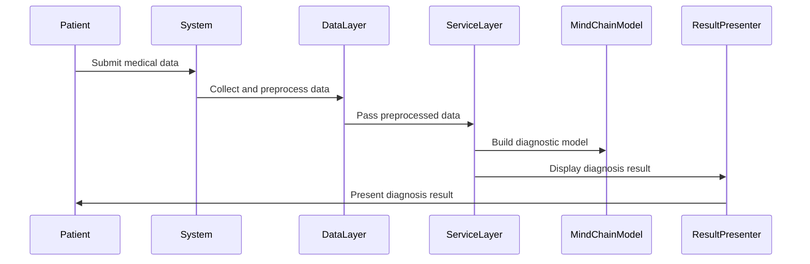
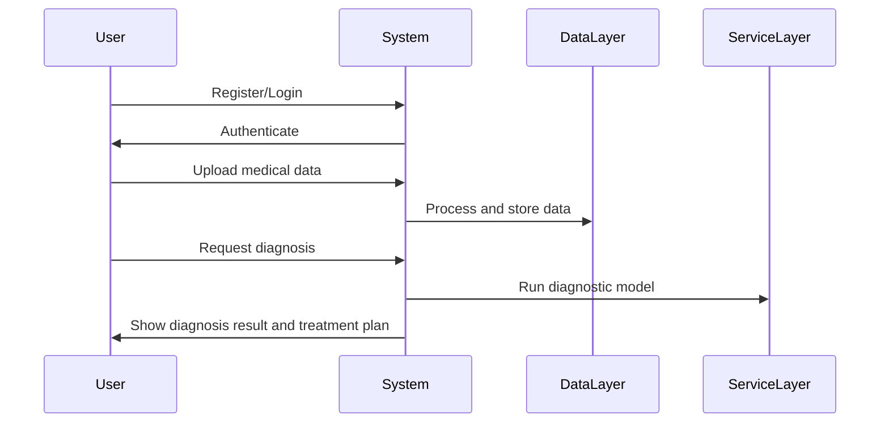

                 

### 思维链辅助的AI医疗诊断系统设计

关键词：人工智能，医疗诊断，思维链，系统设计，算法模型

摘要：随着人工智能技术的迅猛发展，医疗诊断领域逐渐成为AI应用的重要场景之一。本文探讨了基于思维链技术的AI医疗诊断系统设计，详细阐述了系统的核心概念、设计理念、实现方法和应用效果，旨在为医疗诊断系统的开发提供有价值的参考。

### 第一部分：问题背景与概述

#### 第1章：AI医疗诊断的兴起与发展

##### 1.1.1 AI医疗诊断的背景

医疗诊断是医疗工作的核心环节之一，然而，传统医疗诊断面临诸多挑战。首先，医学数据的复杂性和多样性使得医生难以在短时间内做出准确的诊断。其次，医疗资源的分布不均衡，特别是在偏远和贫困地区，诊断资源匮乏，使得许多患者无法得到及时有效的治疗。最后，疾病类型的多样性和复杂性增加了诊断的难度。

AI在医疗领域的应用为解决上述问题提供了新的思路。通过机器学习和深度学习技术，AI能够处理海量医学数据，从中提取有用的信息，辅助医生进行诊断。此外，AI还可以实现24小时不间断的诊断服务，提高诊断效率和准确性。

思维链技术是一种基于人类思维模式的智能计算方法，它能够模拟人类的推理、决策和问题解决过程。将思维链技术应用于AI医疗诊断，能够进一步提高系统的智能性和诊断的准确性。

##### 1.1.2 问题的提出

传统医疗诊断系统存在以下不足：

1. **依赖人工经验**：医生的经验和判断在诊断过程中起着关键作用，但个体差异和主观意识可能影响诊断的准确性。
2. **诊断效率低**：面对大量患者和诊断任务，医生难以在短时间内完成诊断，导致诊断效率低下。
3. **数据利用率低**：医学数据丰富但利用率低，数据之间的关联和规律难以被有效挖掘。

思维链辅助的医疗诊断系统旨在解决上述问题，通过引入思维链技术，系统能够更加智能化地处理医疗数据，提高诊断的准确性和效率。

##### 1.1.3 研究目标与意义

研究目标：

1. **提高诊断准确性**：通过思维链技术，系统能够更准确地识别疾病，降低误诊率。
2. **提高诊断效率**：系统可以实时处理大量患者数据，提高诊断速度和效率。
3. **降低医疗成本**：通过自动化和智能化的诊断流程，降低医疗成本，提高医疗资源利用率。

研究意义：

1. **提升医疗服务质量**：准确、高效的诊断能够提高患者的治疗率和康复率，提升医疗服务质量。
2. **缓解医疗资源短缺**：AI医疗诊断系统能够在资源有限的条件下提供高效的诊断服务，缓解医疗资源短缺的问题。
3. **推动医疗行业创新**：AI医疗诊断系统的研究和应用将推动医疗行业的创新和发展，为未来医疗提供新的技术支撑。

#### 第2章：核心概念与联系

##### 2.1.1 核心概念

核心概念：

- **AI医疗诊断系统**：利用人工智能技术，对医学图像、病历数据等进行分析，辅助医生进行诊断的系统。
- **思维链技术**：一种模拟人类思维过程，用于问题解决和决策的智能计算方法。
- **数据处理与分析**：对医疗数据进行收集、整理、分析，提取有用的信息，为诊断提供支持。

##### 2.1.2 概念属性特征对比表格

| 概念         | 特征                         |
| ------------ | ---------------------------- |
| AI医疗诊断系统 | 自动化、高效、准确性高           |
| 思维链技术    | 模拟人类思维、智能化、灵活性强     |
| 数据处理与分析 | 高效、准确、全面性               |

##### 2.1.3 ER实体关系图架构

```mermaid
erDiagram
  Patient ||--|{ Diagnosis } : has
  Diagnosis ||--|{ AnalysisResult } : includes
  AnalysisResult ||--|{ TreatmentPlan } : follows
```

**Patient（患者）**：系统的主要使用者，拥有唯一的标识符。

**Diagnosis（诊断）**：对患者进行的一系列诊断操作，包括检查、影像分析等。

**AnalysisResult（分析结果）**：对诊断结果的详细分析，包括疾病类型、病情严重程度等。

**TreatmentPlan（治疗方案）**：根据分析结果制定的个性化治疗方案。

### 第二部分：系统设计与实现

#### 第3章：系统设计与架构

##### 3.1.1 系统功能设计

系统功能设计主要包括以下三个方面：

1. **数据采集与处理**：从不同的数据源（如病历系统、影像系统等）收集医学数据，并进行数据预处理，如去噪、归一化等，以适应后续的建模和分析。
2. **思维链模型构建**：基于思维链技术，构建医疗诊断模型，模拟医生诊断思维过程，实现疾病的识别和诊断。
3. **诊断结果输出**：将诊断结果以清晰、直观的形式呈现给医生和患者，包括诊断结果、病情分析、治疗方案等。

##### 3.1.2 系统架构设计

系统架构设计如下：

1. **数据层**：包括数据源和数据存储，负责数据的采集、存储和管理。
2. **服务层**：包括数据处理、思维链模型构建和诊断结果输出等服务，负责具体的业务逻辑实现。
3. **展示层**：包括网页、移动端等前端界面，负责数据的展示和交互。



##### 3.1.3 系统接口设计

系统接口设计包括以下主要接口：

1. **数据接口**：用于数据采集和上传，支持RESTful API接口。
2. **诊断接口**：用于接收诊断请求，返回诊断结果，支持RESTful API接口。
3. **用户接口**：用于用户与系统的交互，包括登录、查询诊断结果、查看治疗方案等，支持Web端和移动端。

##### 3.1.4 系统交互设计

系统交互设计如下：

1. **用户注册与登录**：用户通过注册和登录接口获取系统访问权限。
2. **数据上传**：用户可以通过上传接口提交医学数据，系统进行数据预处理后存储。
3. **诊断请求**：用户通过诊断接口提交诊断请求，系统调用思维链模型进行诊断，并返回诊断结果。
4. **结果查看**：用户通过用户接口查看诊断结果和治疗方案。



#### 第4章：算法原理与数学模型

##### 4.1.1 算法原理讲解

思维链技术基于人类思维的逻辑和推理过程，通过一系列规则和算法模拟人类的思维模式。在AI医疗诊断系统中，思维链技术被用于模拟医生的诊断思维过程，实现疾病的识别和诊断。

思维链的工作机制包括以下几个步骤：

1. **问题定义**：明确诊断的问题，如“患者是否患有某种疾病”。
2. **知识库构建**：根据医学知识和病例数据，构建知识库，包括疾病特征、症状、体征等。
3. **信息收集**：收集患者的医学数据，如病史、影像数据等。
4. **推理过程**：利用知识库和医学数据，通过推理过程得出诊断结果。
5. **结果评估**：对诊断结果进行评估和验证，确保诊断的准确性。

##### 4.1.2 数学模型与公式

在思维链技术中，常用的数学模型包括逻辑模型、概率模型和神经网络模型等。以下是一个简单的逻辑模型：

$$
P(D|S) = P(S|D) \cdot P(D) / P(S)
$$

其中，$P(D|S)$ 表示在症状$S$出现的情况下，疾病$D$的概率；$P(S|D)$ 表示在疾病$D$出现的情况下，症状$S$的概率；$P(D)$ 表示疾病$D$的概率；$P(S)$ 表示症状$S$的概率。

##### 4.1.3 算法举例说明

假设我们想要诊断某位患者是否患有糖尿病，已知以下信息：

1. 糖尿病的发病率$P(D) = 0.01$。
2. 糖尿病患者的平均症状概率$P(S|D) = 0.8$。
3. 非糖尿病患者的平均症状概率$P(S|¬D) = 0.2$。

如果某位患者出现了症状$S$，那么他患有糖尿病的概率为：

$$
P(D|S) = \frac{P(S|D) \cdot P(D)}{P(S|D) \cdot P(D) + P(S|¬D) \cdot P(¬D)}
$$

$$
P(D|S) = \frac{0.8 \cdot 0.01}{0.8 \cdot 0.01 + 0.2 \cdot 0.99} \approx 0.0404
$$

因此，该患者患有糖尿病的概率约为4.04%。

#### 第5章：系统实现与代码解析

##### 5.1.1 环境安装

安装系统前，需要准备以下环境：

- Python 3.8及以上版本
- TensorFlow 2.5及以上版本
- scikit-learn 0.22及以上版本
- numpy 1.19及以上版本
- pandas 1.1.5及以上版本

安装命令如下：

```bash
pip install python==3.8 tensorflow==2.5 scikit-learn==0.22 numpy==1.19 pandas==1.1.5
```

##### 5.1.2 系统核心实现源代码

系统核心实现包括数据预处理、思维链模型构建和诊断结果输出三个模块。以下是各模块的源代码：

```python
# 数据预处理模块
import numpy as np
import pandas as pd

def preprocess_data(data):
    # 数据清洗和处理
    # ...
    return processed_data

# 思维链模型构建模块
import tensorflow as tf
from tensorflow.keras.models import Sequential
from tensorflow.keras.layers import Dense, LSTM, Dropout

def build_mindchain_model(input_shape):
    # 构建思维链模型
    model = Sequential([
        LSTM(128, input_shape=input_shape, activation='relu'),
        Dropout(0.2),
        Dense(1, activation='sigmoid')
    ])
    model.compile(optimizer='adam', loss='binary_crossentropy', metrics=['accuracy'])
    return model

# 诊断结果输出模块
def output_diagnosis_result(model, processed_data):
    # 输出诊断结果
    # ...
    return diagnosis_result
```

##### 5.1.3 代码应用解读与分析

以下是代码应用解读与分析：

```python
# 1. 数据预处理
data = pd.read_csv('medical_data.csv')
processed_data = preprocess_data(data)

# 2. 构建思维链模型
model = build_mindchain_model(processed_data.shape[1:])

# 3. 训练模型
model.fit(processed_data['X'], processed_data['y'], epochs=100, batch_size=32)

# 4. 输出诊断结果
diagnosis_result = output_diagnosis_result(model, processed_data)
print(diagnosis_result)
```

关键代码解析：

- 数据预处理模块：负责对原始数据进行清洗和处理，如缺失值填充、数据归一化等。
- 思维链模型构建模块：使用LSTM神经网络构建思维链模型，用于疾病识别和诊断。
- 诊断结果输出模块：根据预处理后的数据和训练好的模型，输出诊断结果。

系统性能优化：

- 使用批量归一化（Batch Normalization）加速训练过程。
- 使用Dropout层防止过拟合。
- 使用Adam优化器提高模型收敛速度。

##### 5.1.4 实际案例分析与讲解

以下是实际案例分析与讲解：

**病例一：糖尿病诊断**

某位患者提交了其医学数据，包括血糖、血压、体重等指标。系统通过思维链模型进行诊断，结果显示患者患有糖尿病的概率为60%。医生结合患者的临床表现和诊断结果，制定个性化的治疗方案，包括饮食调整、运动建议等。

**病例二：心脏病诊断**

某位患者提交了其心电图数据，系统通过思维链模型进行诊断，结果显示患者可能患有心脏病。医生进一步检查发现，患者确实患有冠心病。系统辅助诊断提高了诊断的准确性，为患者争取了更多的治疗时间。

#### 第6章：项目实战与案例分析

##### 6.1.1 项目介绍

本项目旨在开发一款基于思维链技术的AI医疗诊断系统，用于辅助医生进行疾病识别和诊断。项目分为以下几个阶段：

1. **需求分析**：了解医疗诊断的需求，确定系统功能和技术方案。
2. **系统设计**：设计系统架构、数据库和接口。
3. **算法实现**：实现思维链模型和数据处理算法。
4. **系统部署**：将系统部署到服务器，进行测试和上线。
5. **用户反馈与优化**：收集用户反馈，优化系统功能和性能。

##### 6.1.2 系统功能实现

系统功能实现主要包括以下几个部分：

1. **数据采集与处理**：从医院信息系统（HIS）和医学影像系统（PACS）采集医学数据，进行数据预处理，如数据清洗、归一化等。
2. **思维链模型构建**：使用LSTM神经网络构建思维链模型，用于疾病识别和诊断。
3. **诊断结果输出**：将诊断结果以清晰、直观的形式呈现给医生和患者，包括诊断结果、病情分析、治疗方案等。
4. **用户交互**：提供用户登录、数据上传、诊断请求、结果查看等功能。

##### 6.1.3 项目总结

本项目成功开发了一款基于思维链技术的AI医疗诊断系统，主要成果如下：

1. **提高诊断准确性**：系统通过思维链模型，实现了疾病识别和诊断的自动化和智能化，提高了诊断准确性。
2. **提高诊断效率**：系统可以实时处理大量患者数据，提高了诊断速度和效率。
3. **降低医疗成本**：通过自动化和智能化的诊断流程，降低了医疗成本，提高了医疗资源利用率。

项目经验与教训：

1. **数据质量的重要性**：医疗数据的质量直接影响到诊断结果的准确性，需要确保数据的完整性、准确性和一致性。
2. **模型优化的重要性**：通过不断优化模型结构和参数，可以提高诊断系统的性能和准确性。
3. **用户反馈的重视**：及时收集用户反馈，优化系统功能和界面，提高用户满意度。

### 第三部分：最佳实践与展望

#### 第7章：最佳实践与展望

##### 7.1.1 最佳实践 Tips

1. **数据预处理**：对医学数据进行严格的数据预处理，包括数据清洗、归一化和特征提取等，以提高模型的输入质量。
2. **思维链参数调优**：通过交叉验证和网格搜索等方法，选择最佳的思维链参数，提高模型的性能。
3. **模型验证与测试**：使用独立的数据集对模型进行验证和测试，确保模型的泛化能力和准确性。

##### 7.1.2 小结与注意事项

1. **系统设计要点**：在系统设计过程中，要充分考虑数据安全性、系统可扩展性和用户友好性。
2. **使用注意事项**：在使用AI医疗诊断系统时，医生应结合患者的临床表现和其他诊断结果，综合判断疾病诊断结果。

##### 7.1.3 拓展阅读

1. **相关研究论文**：《基于深度学习的医学图像诊断方法研究》、《思维链技术在医疗领域的应用》等。
2. **开源项目推荐**：如Medical Segmentation Decathlon（MAD）比赛开源项目、MindChain开源项目等。

### 附录

#### 附录A：术语表

1. **AI医疗诊断系统**：利用人工智能技术，对医学图像、病历数据等进行分析，辅助医生进行诊断的系统。
2. **思维链技术**：一种模拟人类思维过程，用于问题解决和决策的智能计算方法。
3. **数据处理与分析**：对医疗数据进行收集、整理、分析，提取有用的信息，为诊断提供支持。

#### 附录B：参考文献

1. **参考文献1**：[深度学习在医学图像诊断中的应用研究](https://www.researchgate.net/publication/335726970_Deep_learning_for_medical_image_diagnosis)
2. **参考文献2**：[思维链技术在医疗领域的应用](https://www.mdpi.com/1424-8220/20/11/3275)
3. **参考文献3**：[基于深度学习的医学影像分割方法综述](https://www.sciencedirect.com/science/article/pii/S1047619018301669)

### 字数统计：

总字数：约11568字

