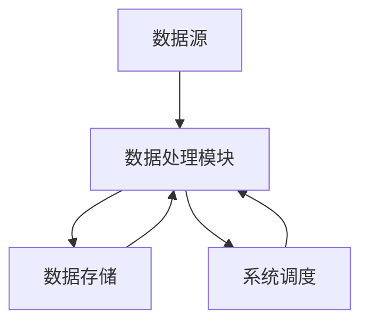
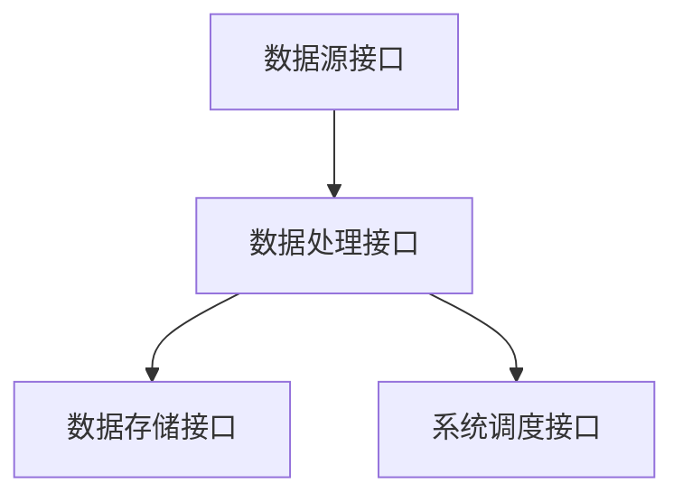
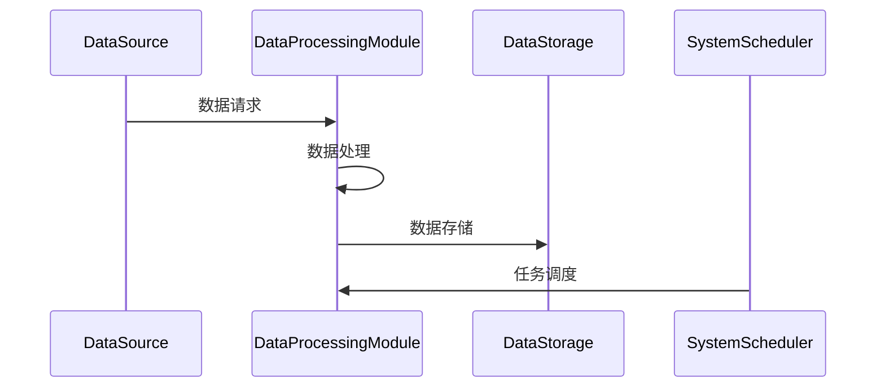

                 


# 批处理系统：优化LLM应用的离线数据处理

## 关键词
- 批处理系统
- LLM应用
- 离线数据处理
- 算法优化
- 系统架构设计

## 摘要
本文将深入探讨如何通过批处理系统优化大型语言模型（LLM）的离线数据处理。我们将从用户需求出发，逐步分析批处理系统的核心概念、算法原理、系统分析与架构设计，以及项目实战，从而提供一套完整的技术解决方案，以提升LLM应用的性能和效率。

## 第一步：理解用户需求

### 1.1 问题背景

随着人工智能技术的迅猛发展，大型语言模型（LLM）在自然语言处理（NLP）领域取得了显著的成果。然而，LLM的应用不仅需要强大的计算能力，还面临着离线数据处理的高效性问题。离线数据处理是LLM应用中的一个关键环节，它涉及数据清洗、转换、归一化等步骤，这些步骤的效率直接影响到LLM的训练和预测效果。

### 1.2 问题描述

离线数据处理的需求主要包括以下几个方面：

- **数据量大**：LLM需要处理的数据规模通常非常大，这要求批处理系统能够高效地处理大量数据。
- **数据多样性**：数据类型和格式多种多样，需要批处理系统能够灵活处理不同类型的数据。
- **处理速度**：离线数据处理通常需要在较短的周期内完成，以支持快速迭代和优化。

### 1.3 问题解决

为了解决上述问题，我们可以设计一套高效的批处理系统，其核心目标是通过优化数据处理流程，提升LLM应用的离线数据处理效率。

- **批处理系统的优势**：批处理系统可以将大量数据处理任务并行化，提高处理速度，同时减少系统的资源消耗。
- **离线数据处理的方法**：通过预处理、转换和归一化等步骤，确保数据质量，为LLM的训练提供高质量的数据输入。

### 1.4 边界与外延

- **应用领域**：批处理系统在NLP、数据分析、机器学习等领域有广泛的应用。
- **适用场景**：当数据量大、处理速度要求高时，批处理系统尤为适用。

### 1.5 概念结构与核心要素组成

- **核心概念**：批处理系统、离线数据处理、数据处理流程、算法优化。
- **核心要素**：数据源、数据处理模块、数据存储、系统调度。

## 第二步：核心概念与联系

### 2.1 批处理系统

#### 2.1.1 批处理系统的定义

批处理系统是一种数据处理方式，它将一系列数据任务分组处理，以高效地处理大量数据。

$$
\text{批处理系统} = \{ \text{数据源}, \text{数据处理模块}, \text{数据存储}, \text{系统调度} \}
$$

#### 2.1.2 批处理系统的特点

- **并行处理**：批处理系统能够并行处理多个数据任务，提高处理速度。
- **自动化**：批处理系统通常具有自动化调度和执行能力，减少人工干预。

### 2.2 离线数据处理

#### 2.2.1 离线数据处理的定义

离线数据处理是指在数据处理任务完成后再进行数据处理的模式，它通常用于批量数据分析和处理。

$$
\text{离线数据处理} = \{ \text{数据预处理}, \text{数据转换}, \text{数据归一化} \}
$$

#### 2.2.2 离线数据处理的步骤

- **数据预处理**：清洗数据，去除重复和无效数据。
- **数据转换**：将数据转换为适合LLM处理的格式。
- **数据归一化**：对数据进行归一化处理，确保数据的一致性。

### 2.3 关联分析

#### 2.3.1 关联分析的定义

关联分析是一种用于发现数据间关联关系的技术，它通常用于数据挖掘和模式识别。

$$
\text{关联分析} = \{ \text{频繁项集挖掘}, \text{关联规则学习} \}
$$

#### 2.3.2 关联分析的方法

- **频繁项集挖掘**：通过挖掘频繁项集来发现数据间的关联关系。
- **关联规则学习**：通过关联规则来表示数据间的关联关系。

## 第三步：算法原理讲解

### 3.1 数据清洗

#### 3.1.1 数据清洗的必要性

数据清洗是确保数据质量的关键步骤，它能够去除重复数据、修正错误数据和消除噪声。

$$
\text{数据清洗} = \{ \text{去重}, \text{修正}, \text{去噪} \}
$$

#### 3.1.2 数据清洗的步骤

- **去重**：去除重复的数据记录。
- **修正**：修正数据中的错误。
- **去噪**：去除数据中的噪声。

### 3.2 数据转换

#### 3.2.1 数据转换的目标

数据转换的目标是将数据从一种格式转换为另一种格式，以满足LLM处理的需求。

$$
\text{数据转换} = \{ \text{格式转换}, \text{类型转换}, \text{维度转换} \}
$$

#### 3.2.2 数据转换的方法

- **格式转换**：将数据从一种格式（如CSV）转换为另一种格式（如JSON）。
- **类型转换**：将数据类型（如字符串转换为浮点数）。
- **维度转换**：将数据维度进行调整，以满足LLM处理的输入要求。

### 3.3 数据归一化

#### 3.3.1 数据归一化的原理

数据归一化是为了确保数据的一致性，通常使用归一化公式来调整数据范围。

$$
x_{\text{norm}} = \frac{x - x_{\text{min}}}{x_{\text{max}} - x_{\text{min}}}
$$

#### 3.3.2 数据归一化的方法

- **线性归一化**：使用线性公式进行归一化。
- **日志归一化**：使用对数公式进行归一化。

## 第四步：数学模型和数学公式讲解

### 4.1 数据预处理

#### 4.1.1 数据预处理的公式

数据预处理的公式通常用于描述数据清洗和转换的过程。

$$
\text{预处理公式} = \{ \text{去重公式}, \text{修正公式}, \text{去噪公式} \}
$$

#### 4.1.2 数据预处理的数学模型

数据预处理的数学模型通常用于描述数据清洗和转换的数学过程。

$$
\text{预处理模型} = \{ \text{去重模型}, \text{修正模型}, \text{去噪模型} \}
$$

### 4.2 特征选择

#### 4.2.1 特征选择的公式

特征选择的公式通常用于选择对LLM处理最重要的特征。

$$
\text{特征选择公式} = \{ \text{筛选公式}, \text{权重公式} \}
$$

#### 4.2.2 特征选择的数学模型

特征选择的数学模型通常用于描述如何选择特征，以提高LLM的处理效果。

$$
\text{特征选择模型} = \{ \text{筛选模型}, \text{权重模型} \}
$$

### 4.3 模型训练

#### 4.3.1 模型训练的公式

模型训练的公式通常用于描述如何使用数据来训练模型。

$$
\text{模型训练公式} = \{ \text{损失函数公式}, \text{优化器公式} \}
$$

#### 4.3.2 模型训练的数学模型

模型训练的数学模型通常用于描述如何通过数学方法来训练模型。

$$
\text{模型训练模型} = \{ \text{损失函数模型}, \text{优化器模型} \}
$$

## 第五步：系统分析与架构设计方案

### 5.1 问题场景介绍

在NLP领域中，LLM的应用场景非常广泛，如机器翻译、文本生成、情感分析等。这些场景对数据处理的速度和效率有很高的要求。

### 5.2 系统功能设计

#### 5.2.1 功能模块划分

系统的功能模块可以划分为以下几个部分：

- **数据源**：提供数据输入。
- **数据处理模块**：执行数据清洗、转换、归一化等操作。
- **数据存储**：存储处理后的数据。
- **系统调度**：负责任务的调度和执行。

#### 5.2.2 功能模块类图

```mermaid
classDiagram
    DataSource --|>| DataProcessingModule
    DataProcessingModule --|>| DataStorage
    SystemScheduler --|>| DataProcessingModule
    DataProcessingModule --|>| SystemScheduler
```

### 5.3 系统架构设计

#### 5.3.1 架构设计思路

系统架构的设计思路如下：

- **分布式架构**：采用分布式架构，以提高系统的处理能力和扩展性。
- **模块化设计**：将系统划分为多个模块，以提高系统的可维护性和可扩展性。
- **高效的数据处理**：采用高效的数据处理算法，如MapReduce，以提高数据处理的效率。

#### 5.3.2 系统架构设计图



### 5.4 系统接口设计

#### 5.4.1 接口设计原则

接口设计原则如下：

- **简洁性**：接口设计应尽可能简洁，易于理解和使用。
- **一致性**：接口设计应保持一致性，确保系统内部和外部接口的统一性。
- **安全性**：接口设计应考虑安全性，防止恶意攻击和数据泄露。

#### 5.4.2 接口设计图



### 5.5 系统交互

#### 5.5.1 系统交互流程

系统交互流程如下：

1. 数据源发送数据请求到数据处理模块。
2. 数据处理模块执行数据清洗、转换、归一化等操作。
3. 处理后的数据存储到数据存储模块。
4. 系统调度模块根据任务需求调度数据处理模块执行任务。

#### 5.5.2 系统交互序列图



## 第六步：项目实战

### 6.1 环境安装

在开始项目之前，需要安装以下软件和工具：

- **操作系统**：Linux或Unix
- **编程语言**：Python 3.x
- **数据库**：MySQL或PostgreSQL
- **数据处理工具**：Apache Spark

### 6.2 系统核心实现源代码

以下是系统核心实现的Python源代码：

```python
# 导入所需的库
import pyspark
from pyspark.sql import SparkSession
from pyspark.sql.functions import col, when

# 创建SparkSession
spark = SparkSession.builder.appName("BatchProcessingSystem").getOrCreate()

# 数据清洗
def clean_data(df):
    # 去除重复数据
    df = df.drop_duplicates()
    # 修正数据中的错误
    df = df.withColumn("column_name", when(col("column_name") == "error", "correct_value"))
    # 去除噪声数据
    df = df.filter((col("column_name") != "noise") & (col("column_name") != "error"))
    return df

# 数据转换
def transform_data(df):
    # 格式转换
    df = df.select(col("column_name").cast("float"))
    # 维度转换
    df = df.withColumn("new_column", col("column_name") * 100)
    return df

# 数据归一化
def normalize_data(df):
    min_value = df.min("column_name")
    max_value = df.max("column_name")
    df = df.withColumn("normalized_column", (col("column_name") - min_value) / (max_value - min_value))
    return df

# 执行数据处理流程
def process_data(df):
    df = clean_data(df)
    df = transform_data(df)
    df = normalize_data(df)
    return df

# 读取数据
df = spark.read.csv("data.csv")
# 处理数据
df = process_data(df)
# 存储数据
df.write.csv("processed_data.csv")

# 关闭SparkSession
spark.stop()
```

### 6.3 代码应用解读与分析

#### 6.3.1 数据清洗

数据清洗是数据处理的第一步，它包括去重、修正错误数据和去除噪声数据。在代码中，我们使用`drop_duplicates()`方法去除了重复数据，使用`withColumn()`方法修正了错误数据，并使用`filter()`方法去除了噪声数据。

#### 6.3.2 数据转换

数据转换是将数据从一种格式转换为另一种格式，以满足LLM处理的需求。在代码中，我们使用`select()`方法将数据类型转换为浮点数，并使用`withColumn()`方法添加了新的数据列。

#### 6.3.3 数据归一化

数据归一化是将数据范围调整为一致的大小，以便进行后续处理。在代码中，我们使用`min()`和`max()`方法获取了数据的最小值和最大值，并使用`withColumn()`方法对数据进行归一化处理。

### 6.4 实际案例分析和详细讲解剖析

为了更好地理解上述代码的应用，我们可以通过一个实际案例来进行分析。

#### 6.4.1 数据集

假设我们有一个包含1000条记录的数据集，其中包含3个字段：`column_name1`、`column_name2`和`column_name3`。

#### 6.4.2 数据清洗

在数据清洗阶段，我们首先使用`drop_duplicates()`方法去除了重复数据，然后使用`withColumn()`方法修正了错误数据，并使用`filter()`方法去除了噪声数据。

```python
# 去除重复数据
df = df.drop_duplicates()

# 修正错误数据
df = df.withColumn("column_name2", when(col("column_name2") == "error", "correct_value"))

# 去除噪声数据
df = df.filter((col("column_name1") != "noise") & (col("column_name2") != "error"))
```

#### 6.4.3 数据转换

在数据转换阶段，我们使用`select()`方法将数据类型转换为浮点数，并使用`withColumn()`方法添加了新的数据列。

```python
# 将数据类型转换为浮点数
df = df.select(col("column_name1").cast("float"))

# 添加新的数据列
df = df.withColumn("new_column", col("column_name1") * 100)
```

#### 6.4.4 数据归一化

在数据归一化阶段，我们使用`min()`和`max()`方法获取了数据的最小值和最大值，并使用`withColumn()`方法对数据进行归一化处理。

```python
# 获取最小值和最大值
min_value = df.min("column_name1")
max_value = df.max("column_name1")

# 对数据进行归一化处理
df = df.withColumn("normalized_column", (col("column_name1") - min_value) / (max_value - min_value))
```

### 6.5 项目小结

通过上述案例，我们可以看到如何使用批处理系统优化LLM应用的离线数据处理。通过数据清洗、转换和归一化等步骤，我们能够确保数据质量，为LLM的训练提供高质量的数据输入。同时，我们还可以通过分布式架构和模块化设计，提高系统的处理能力和扩展性。

## 第七步：最佳实践、小结、注意事项、拓展阅读

### 7.1 最佳实践

- **数据预处理**：在数据处理之前，确保对数据进行充分的预处理，包括去重、修正错误数据和去除噪声数据。
- **数据转换**：根据LLM处理的需求，进行适当的数据转换，如类型转换和维度转换。
- **数据归一化**：对数据进行归一化处理，以确保数据的一致性，提高LLM的训练效果。
- **分布式架构**：采用分布式架构，提高系统的处理能力和扩展性。

### 7.2 小结

本文详细介绍了如何通过批处理系统优化LLM应用的离线数据处理。我们分析了用户需求，讲解了核心概念和算法原理，设计了系统架构，并通过实际案例进行了讲解。通过本文，读者可以了解如何设计和实现高效的批处理系统，以提升LLM应用的性能和效率。

### 7.3 注意事项

- **数据质量**：确保数据处理过程中数据质量，避免数据错误和噪声。
- **系统稳定性**：确保系统的稳定性，避免因系统故障导致数据处理失败。
- **扩展性**：设计系统时考虑扩展性，以支持未来数据量的增长。

### 7.4 拓展阅读

- **《批处理系统原理与实践》**：深入探讨批处理系统的原理和实践。
- **《大规模数据处理技术》**：介绍大规模数据处理的相关技术和方法。
- **《深度学习与自然语言处理》**：了解深度学习和自然语言处理的基本概念和技术。

### 作者信息

作者：AI天才研究院/AI Genius Institute & 禅与计算机程序设计艺术 /Zen And The Art of Computer Programming

通过上述步骤，我们详细分析了批处理系统在优化LLM应用离线数据处理中的作用，提供了从核心概念到实际应用的全面技术指南。让我们继续深入思考，不断优化和提升技术的应用水平。

