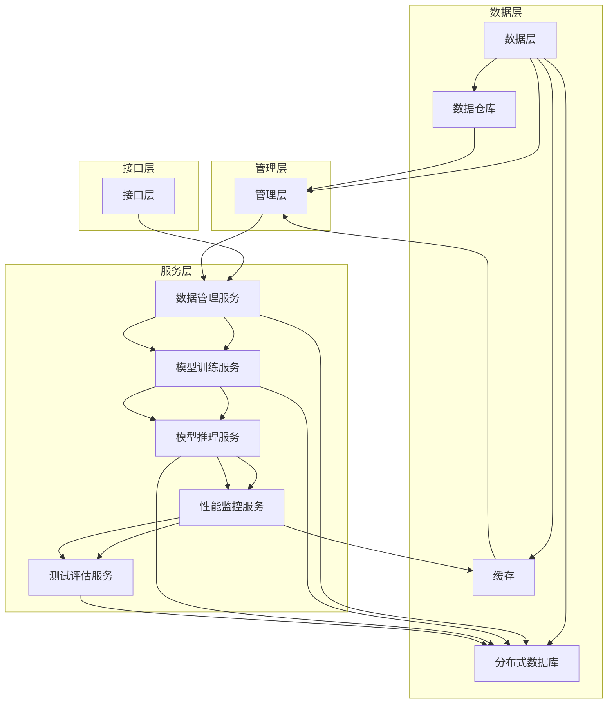
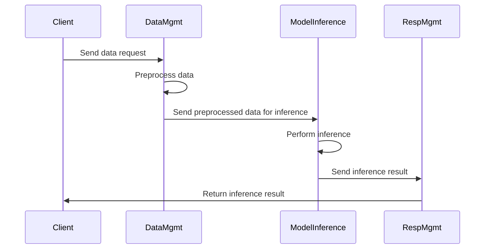

                 

### 文章标题

# 技术债务管理：在LLM应用敏捷开发中保持平衡

> 关键词：技术债务、敏捷开发、LLM应用、管理策略、平衡

> 摘要：本文深入探讨了在LLM（大型语言模型）应用的开发过程中，如何通过有效的技术债务管理来保持敏捷开发的平衡。文章从问题背景出发，逐步分析了技术债务的定义、特征、评估方法，并结合LLM应用的特点和敏捷开发的原理，提出了具体的技术债务管理策略。通过算法原理与数学模型讲解、系统分析与架构设计，以及项目实战等多个方面的详细剖析，本文旨在为开发者提供实用的指导，帮助他们在敏捷开发过程中更好地管理和应对技术债务，实现项目的高效推进与持续迭代。

### 目录大纲

----------------------------------------------------------------

## 第一部分：问题背景与定义

### 第1章：技术债务管理概述

#### 1.1 问题背景

##### 1.1.1 技术债务的概念与起源
##### 1.1.2 技术债务的重要性
##### 1.1.3 技术债务的影响

#### 1.2 技术债务的定义与特征

##### 1.2.1 技术债务的定义
##### 1.2.2 技术债务的特征
##### 1.2.3 技术债务的分类

#### 1.3 LLMB应用敏捷开发中的技术债务

##### 1.3.1 LLMB应用的特点
##### 1.3.2 敏捷开发与技术债务的关系
##### 1.3.3 技术债务在LLMB开发中的挑战

#### 1.4 本章小结

----------------------------------------------------------------

## 第二部分：核心概念与联系

### 第2章：核心概念与联系

#### 2.1 技术债务的核心概念

##### 2.1.1 技术债务的定义与特征
##### 2.1.2 技术债务的类型
##### 2.1.3 技术债务的影响因素

#### 2.2 LLMB应用敏捷开发的核心概念

##### 2.2.1 敏捷开发原则
##### 2.2.2 敏捷开发方法
##### 2.2.3 敏捷开发的优点与挑战

#### 2.3 技术债务与敏捷开发的关系

##### 2.3.1 技术债务管理策略
##### 2.3.2 敏捷开发中的技术债务处理
##### 2.3.3 技术债务管理与敏捷开发的协同作用

#### 2.4 本章小结

----------------------------------------------------------------

## 第三部分：算法原理与数学模型

### 第3章：算法原理与数学模型

#### 3.1 技术债务评估算法

##### 3.1.1 技术债务评估方法
##### 3.1.2 技术债务评估指标
##### 3.1.3 技术债务评估实例

#### 3.2 LLMB应用优化算法

##### 3.2.1 LLMB优化算法概述
##### 3.2.2 优化算法的数学模型
##### 3.2.3 优化算法实例分析

#### 3.3 敏捷开发中的技术债务管理算法

##### 3.3.1 敏捷开发流程中的技术债务管理
##### 3.3.2 技术债务管理算法设计
##### 3.3.3 算法实现与效果评估

#### 3.4 本章小结

----------------------------------------------------------------

## 第四部分：系统分析与架构设计

### 第4章：系统分析与架构设计

#### 4.1 项目介绍

##### 4.1.1 项目背景
##### 4.1.2 项目目标
##### 4.1.3 项目团队与资源

#### 4.2 系统功能设计

##### 4.2.1 系统需求分析
##### 4.2.2 系统功能模块划分
##### 4.2.3 功能模块详细描述

#### 4.3 系统架构设计

##### 4.3.1 系统架构设计原则
##### 4.3.2 系统架构设计方案
##### 4.3.3 系统架构图

#### 4.4 系统接口设计

##### 4.4.1 系统接口需求
##### 4.4.2 接口设计规范
##### 4.4.3 接口实现与测试

#### 4.5 系统交互设计

##### 4.5.1 系统交互流程
##### 4.5.2 交互序列图
##### 4.5.3 交互效果评估

#### 4.6 本章小结

----------------------------------------------------------------

## 第五部分：项目实战

### 第5章：环境安装与系统核心实现

#### 5.1 环境安装

##### 5.1.1 操作系统与软件环境
##### 5.1.2 开发工具与依赖安装
##### 5.1.3 环境配置与验证

#### 5.2 系统核心实现

##### 5.2.1 系统功能实现
##### 5.2.2 系统优化实现
##### 5.2.3 技术债务管理实现

#### 5.3 代码应用解读与分析

##### 5.3.1 代码结构
##### 5.3.2 核心模块解读
##### 5.3.3 实际案例分析与讲解

#### 5.4 项目小结

----------------------------------------------------------------

## 总结与展望

### 第6章：总结与展望

#### 6.1 本文总结

##### 6.1.1 主要贡献
##### 6.1.2 研究局限

#### 6.2 未来研究方向

##### 6.2.1 技术债务管理的新策略
##### 6.2.2 LLMB应用的新趋势
##### 6.2.3 敏捷开发与新技术融合

#### 6.3 结语

----------------------------------------------------------------

### 让我们一步一步深入探讨技术债务管理在LLM应用敏捷开发中的平衡。

#### 1.1 技术债务的概念与起源

技术债务（Technical Debt），这个术语起源于软件开发领域，最早由Ward Cunningham在1992年提出。他将技术债务比作财务债务，认为在软件开发过程中，开发者为了快速交付功能而做出的短期决策，可能会在未来带来额外的维护成本和风险，就像借贷一样，需要在后续的时间里偿还。技术债务可以是代码质量不高、架构设计不合理、依赖的第三方库不稳定等多种形式。

技术债务的起源可以追溯到20世纪80年代，随着软件开发复杂度的增加，项目经理和开发者面临着如何在短时间内交付高质量软件的挑战。为了满足市场需求，他们往往选择快速实现功能，而不是采取更稳健的方法。这种策略虽然在短期内提高了交付速度，但长期来看，却可能导致软件质量下降、维护成本增加，甚至影响项目的可持续发展。

#### 1.2 技术债务的重要性

技术债务的重要性在于它直接影响了软件项目的成本、质量和时间。以下是技术债务对项目的影响：

1. **成本增加**：由于技术债务往往需要在未来偿还，因此会带来额外的维护成本。这些成本可能包括代码重构、性能优化、安全修复等。

2. **质量下降**：技术债务通常会导致代码质量不高，从而增加了软件出现缺陷的概率。这会降低用户满意度，甚至可能导致项目失败。

3. **时间延长**：技术债务可能会在未来的某个时间点引发问题，需要花费额外的时间来解决。这会延长项目的周期，影响市场的竞争力。

4. **风险增加**：技术债务的存在使得项目面临更多的不确定性。如果债务积累过多，可能会使项目陷入无法控制的境地。

因此，对于开发者来说，认识到技术债务的存在，并采取有效的管理策略，是确保项目成功的关键。

#### 1.3 技术债务的影响

技术债务的影响是多方面的，包括以下几个方面：

1. **维护成本**：随着技术债务的增加，项目的维护成本会显著上升。因为需要投入更多的时间和资源来修复债务带来的问题。

2. **开发效率**：技术债务会降低开发团队的效率。团队成员需要在应对债务的同时，继续推进新功能的开发，这无疑增加了工作的复杂性。

3. **用户体验**：技术债务可能导致软件出现各种问题，从而影响用户体验。这些问题可能包括系统崩溃、响应速度慢、错误消息等。

4. **项目风险**：技术债务会提高项目的风险。因为债务的存在使得项目面临更多的不确定性，一旦出现问题，可能会影响整个项目的进度和成功。

总之，技术债务不仅会直接影响到项目的成本和质量，还会间接影响项目的效率和风险，因此需要引起足够的重视。

#### 1.4 技术债务的定义与特征

技术债务（Technical Debt）是指在软件开发过程中，由于采取短期决策而导致的长期维护成本增加和风险增加的现象。技术债务通常包括以下特征：

1. **短期利益与长期代价**：技术债务通常是为了在短期内获得某种利益，如快速交付功能、减少开发成本等，但这种利益在长期内可能会带来更高的维护成本和风险。

2. **质量与效率的权衡**：在软件开发过程中，开发者往往需要在质量和效率之间做出权衡。技术债务往往是因为追求短期效率而牺牲了质量。

3. **可追踪性**：技术债务是可以追踪的。每个技术债务都有其来源、原因和解决方法。这有助于开发者识别和管理技术债务。

4. **积累性**：技术债务会随着时间的推移而积累。如果不在早期进行管理，债务可能会越来越多，最终影响项目的可持续发展。

5. **多样性与复杂性**：技术债务可以是多种多样的，包括代码质量、架构设计、依赖库稳定性等。这增加了管理的复杂性。

通过理解技术债务的定义和特征，开发者可以更好地识别和应对技术债务，从而确保项目的成功。

#### 1.5 技术债务的类型

技术债务可以根据其来源和影响范围进行分类。以下是几种常见的技术债务类型：

1. **代码债务**：这是最常见的类型，指的是代码质量不高，如代码冗长、缺乏注释、复用性差等。代码债务会导致维护成本增加，同时降低开发效率。

2. **架构债务**：指的是系统架构设计不合理，如过度耦合、过度抽象、依赖不明确等。架构债务会影响系统的可扩展性和稳定性。

3. **技术债务**：包括使用过时的技术、不稳定的第三方库、不兼容的技术标准等。技术债务会增加系统的复杂性，降低开发效率，并增加未来的维护成本。

4. **知识债务**：指的是团队成员缺乏必要的知识和技能，无法有效地维护和改进系统。知识债务会影响团队的整体能力和项目的进展。

5. **文档债务**：指的是项目文档不完整或不及时更新，如缺乏详细的API文档、测试用例文档等。文档债务会影响系统的可维护性和可理解性。

了解不同类型的技术债务有助于开发者有针对性地进行管理和解决。

#### 1.6 LLMB应用的特点

LLMB（大型语言模型）应用具有以下特点：

1. **数据密集性**：LLMB应用需要处理海量数据，对数据存储和处理能力有较高要求。

2. **计算密集性**：LLMB模型的训练和推理过程需要大量计算资源，对GPU和TPU等硬件有依赖。

3. **高复杂度**：LLMB应用涉及复杂的算法和架构设计，需要深入理解自然语言处理和机器学习技术。

4. **持续迭代性**：LLMB应用需要不断更新和优化模型，以适应不断变化的数据和需求。

5. **强依赖性**：LLMB应用通常与其他系统（如API网关、数据管道等）紧密集成，依赖性较高。

这些特点使得LLMB应用在敏捷开发中面临特殊的技术债务挑战。

#### 1.7 敏捷开发与技术债务的关系

敏捷开发（Agile Development）是一种软件开发方法，强调迭代、灵活性和团队合作。敏捷开发与技术债务之间存在密切的关系：

1. **短期交付与长期债务**：敏捷开发鼓励快速交付可工作的软件，这可能导致在早期阶段积累技术债务。

2. **频繁迭代与债务积累**：敏捷开发的频繁迭代使得技术债务可以在短时间内迅速积累，如果不及时管理，可能导致债务不断增加。

3. **灵活性与风险**：敏捷开发的灵活性使得团队可以快速响应变化，但也增加了技术债务管理的难度。因为每次迭代都可能引入新的债务。

4. **协作与责任**：敏捷开发强调团队协作，每个成员都需要对技术债务负责。这有助于提高债务管理的效率。

了解敏捷开发与技术债务的关系，有助于团队在开发过程中更好地平衡技术债务和敏捷性。

#### 1.8 技术债务在LLMB开发中的挑战

在LLMB（大型语言模型）开发中，技术债务管理面临以下挑战：

1. **高复杂性**：LLMB模型具有高复杂性，涉及大量的算法和数据处理，技术债务可能会隐藏在这些复杂性中，难以被发现和管理。

2. **数据依赖性**：LLMB应用依赖于大量的数据，数据的质量和完整性直接影响模型的性能。技术债务可能会影响数据的处理和存储，从而影响模型的训练和推理。

3. **计算资源**：LLMB模型的训练和推理需要大量计算资源，技术债务可能会导致资源浪费，增加维护成本。

4. **快速迭代**：LLMB应用通常需要快速迭代，技术债务可能会在短时间内迅速积累，增加了债务管理的难度。

5. **团队协作**：LLMB开发通常涉及多个团队和领域专家，技术债务的管理需要跨团队协作，增加了沟通和协调的难度。

了解这些挑战有助于开发者有针对性地进行技术债务管理。

#### 1.9 本章小结

本章对技术债务管理进行了概述，分析了技术债务的概念、特征、类型，并探讨了LLMB应用敏捷开发中的技术债务挑战。技术债务作为一种软件开发现象，对项目的成本、质量和时间有重要影响。在LLMB开发中，由于高复杂性、数据依赖性、计算资源需求以及快速迭代等特点，技术债务管理面临更多挑战。了解这些背景和概念，有助于开发者更好地认识和管理技术债务，确保项目的成功。

## 第二部分：核心概念与联系

### 2.1 技术债务的核心概念

在深入探讨技术债务的管理之前，我们需要首先明确几个核心概念，包括技术债务的定义、类型及其影响因素。这些概念将为我们理解和管理技术债务提供坚实的基础。

#### 2.1.1 技术债务的定义

技术债务（Technical Debt）是指软件开发过程中，为了实现短期目标而做出的一些牺牲，这些牺牲可能会导致未来的维护成本增加、开发效率降低或系统风险上升。技术债务与财务债务类似，它反映了在软件开发过程中，开发团队为了快速交付功能或缩短开发周期而采取的妥协措施。

具体来说，技术债务可以表现为以下几种形式：

1. **代码质量低下**：为了尽快交付功能，开发团队可能会牺牲代码的清洁性和可读性，导致代码库中存在大量冗余、重复或不规范的代码。

2. **系统架构不合理**：快速开发过程中，系统架构可能会被简化，导致系统过度耦合、模块间依赖关系复杂，从而降低系统的可扩展性和维护性。

3. **技术选型不当**：为了节省成本或时间，开发团队可能会选择不稳定或不成熟的第三方库或框架，这会增加未来的维护风险。

4. **文档和测试缺失**：在追求快速交付的过程中，项目文档和测试可能会被忽略，导致后续维护和扩展变得困难。

#### 2.1.2 技术债务的类型

技术债务可以根据其来源和影响范围进行分类。以下是几种常见的技术债务类型：

1. **代码债务**：这是最常见的技术债务类型，主要指代码质量不高，如代码冗余、结构混乱、缺乏注释等。代码债务会导致代码可读性差、可维护性低，增加后续的维护成本。

2. **架构债务**：指的是系统架构设计不合理，如过度耦合、模块间依赖复杂等。架构债务会影响系统的可扩展性和稳定性，导致未来的扩展和维护变得困难。

3. **技术债务**：这包括使用不稳定的第三方库、过时的技术标准等。技术债务会增加系统的复杂性和维护成本，降低系统的可靠性和性能。

4. **知识债务**：指的是团队成员缺乏必要的知识和技能，无法有效维护和改进系统。知识债务会影响团队的整体能力和项目的进展。

5. **文档债务**：指的是项目文档不完整或不及时更新，如缺乏详细的API文档、测试用例文档等。文档债务会影响系统的可维护性和可理解性。

#### 2.1.3 技术债务的影响因素

技术债务的影响因素是多方面的，以下是一些主要的影响因素：

1. **开发速度**：开发速度越快，技术债务积累的速度也越快。快速交付虽然能带来短期利益，但长期来看可能会增加维护成本。

2. **团队技能**：团队技能水平越高，越能有效地识别和管理技术债务。缺乏经验的团队更容易积累债务，而经验丰富的团队则能更好地避免和解决债务问题。

3. **项目管理**：良好的项目管理实践有助于识别和减轻技术债务。例如，定期代码审查、持续集成、文档管理等都能有效降低债务水平。

4. **技术选择**：合理的技术选择可以减少技术债务。选择成熟稳定的技术和框架，避免使用未经测试的新技术，可以降低债务风险。

5. **持续反馈**：持续收集用户反馈和性能数据，可以帮助团队及时发现和解决技术债务问题，避免债务积累。

通过理解技术债务的定义、类型及其影响因素，开发者可以更好地识别和管理技术债务，确保项目的成功和可持续发展。

#### 2.2 LLMB应用敏捷开发的核心概念

在LLMB（大型语言模型）应用开发中，敏捷开发是一种常用的开发方法。敏捷开发强调快速迭代、灵活性和团队合作，旨在通过持续交付有价值的软件来满足客户需求。以下是对敏捷开发核心概念的详细探讨：

##### 2.2.1 敏捷开发原则

敏捷开发基于一系列核心原则，这些原则为开发团队提供指导，帮助他们在复杂多变的环境中保持高效和灵活。以下是敏捷开发的五个核心原则：

1. **个体和互动重于过程和工具**：敏捷开发强调团队合作和个体能力，认为人与人之间的互动比任何工具或过程都重要。

2. **可工作的软件重于详尽的文档**：敏捷开发认为，软件的实际运行效果比详尽的文档更为重要。虽然文档仍然是必要的，但它们不应成为阻碍开发进程的障碍。

3. **客户协作重于合同谈判**：敏捷开发强调与客户的紧密合作，通过持续交流来理解客户需求，以确保开发方向正确。

4. **响应变化重于遵循计划**：敏捷开发认为，计划往往难以预测所有变化，因此团队应更加灵活，快速响应变化，以适应不断变化的需求。

5. **持续交付可工作的软件重于追求完美**：敏捷开发强调持续交付有价值的软件，而非追求完美。通过快速迭代和持续交付，团队能够更好地适应市场需求。

##### 2.2.2 敏捷开发方法

敏捷开发采用一系列具体的方法和框架，以支持其核心原则。以下是几种常见的敏捷开发方法：

1. **Scrum**：Scrum是一种流行的敏捷开发框架，它通过短周期的迭代（称为Sprint）来组织开发工作。每个Sprint结束时，团队会评估进展并调整计划。

2. **Kanban**：Kanban是一种视觉化的工作流管理方法，通过看板（Kanban板）来追踪任务的进度。这种方法强调连续交付，并减少在过程中的等待时间。

3. **XP（极限编程）**：XP是一种注重代码质量和团队合作的敏捷开发方法。它包括一系列最佳实践，如测试驱动开发（TDD）、持续集成等。

4. **看板（Kanban）**：Kanban与Scrum类似，但更注重工作流程的优化。它通过限制在流程中同时处理的工作项数量（称为WIP限制）来提高效率。

##### 2.2.3 敏捷开发的优点与挑战

敏捷开发具有以下优点：

1. **快速响应变化**：通过短周期迭代和持续交付，团队可以快速响应市场需求和变化，提高客户满意度。

2. **提高代码质量**：敏捷开发强调代码质量和测试，通过持续集成和持续交付，可以及时发现和修复问题。

3. **增强团队合作**：敏捷开发鼓励团队合作和沟通，通过集体责任和共同目标，可以增强团队的凝聚力和工作效率。

4. **持续改进**：敏捷开发通过定期回顾和反思，鼓励团队不断改进开发过程和方法，提高整体效率。

然而，敏捷开发也面临一些挑战：

1. **项目管理复杂度**：敏捷开发要求团队具备较强的项目管理能力和灵活性，这对于一些团队来说可能是一个挑战。

2. **客户需求变化**：频繁的需求变化可能会影响项目的稳定性和预测性，需要团队具备快速适应能力。

3. **团队成员技能**：敏捷开发要求团队成员具备多样化的技能和良好的沟通能力，这对于一些团队可能是一个挑战。

4. **工具选择**：敏捷开发需要合适的工具来支持其方法，如版本控制、任务管理、代码审查等，工具的选择和使用可能需要一定时间的学习和适应。

通过理解敏捷开发的核心概念和优点与挑战，开发者可以更好地将敏捷开发方法应用于LLMB应用开发，实现高效、灵活的技术债务管理。

#### 2.3 技术债务管理策略

在敏捷开发环境中，技术债务的管理是一个持续且动态的过程。有效的技术债务管理策略不仅能够帮助团队在短期内快速交付功能，还能够确保长期项目的可持续性和高质量。以下是一些常见的技术债务管理策略：

##### 2.3.1 预防性策略

预防性策略旨在减少技术债务的积累。以下是几种预防性策略：

1. **代码审查**：通过定期进行代码审查，团队可以发现并修复代码中的潜在问题，确保代码质量。

2. **持续集成和持续交付（CI/CD）**：CI/CD实践可以自动化测试和部署流程，确保每次代码提交都是可集成和可运行的，从而减少技术债务。

3. **编码规范**：制定并遵循严格的编码规范，确保代码的可读性和可维护性。

4. **测试驱动开发（TDD）**：通过编写测试用例来驱动开发，可以确保代码的健壮性和正确性，从源头上减少技术债务。

##### 2.3.2 检测性策略

检测性策略旨在及时发现技术债务问题。以下是几种检测性策略：

1. **自动化测试**：通过自动化测试，团队可以定期检查代码的质量和功能是否稳定，及时发现潜在的技术债务问题。

2. **静态代码分析**：使用静态代码分析工具，可以对代码进行分析，识别潜在的编程错误、代码冗余和低质量代码。

3. **代码质量指标**：通过监控代码质量指标（如代码复杂度、代码冗余率等），可以及时发现和解决技术债务问题。

##### 2.3.3 应对性策略

应对性策略主要用于解决已积累的技术债务。以下是几种应对性策略：

1. **债务偿还计划**：制定详细的债务偿还计划，明确技术债务的类型、优先级和解决时间。

2. **重构**：对低质量的代码进行重构，提高代码的可读性和可维护性。

3. **性能优化**：对系统的性能进行优化，降低系统的响应时间和资源消耗。

4. **迁移和升级**：将过时的技术和框架进行升级或迁移，以提高系统的稳定性和性能。

##### 2.3.4 协同性策略

协同性策略强调团队间的协作和沟通。以下是几种协同性策略：

1. **技术债务会议**：定期召开技术债务会议，团队成员可以共同讨论技术债务的识别、评估和解决策略。

2. **代码共享和知识传递**：鼓励团队成员分享代码和经验，通过代码审查和知识传递，提高团队整体的技术水平。

3. **跨职能团队**：组建跨职能团队，让开发、测试、运维等不同角色的人员共同参与技术债务的管理和解决。

通过结合预防性、检测性、应对性和协同性策略，团队可以更好地管理和控制技术债务，确保敏捷开发过程中的项目质量、效率和可持续发展。

#### 2.4 敏捷开发中的技术债务处理

在敏捷开发过程中，技术债务的处理是一个动态和持续的过程。为了有效地管理技术债务，团队需要采取一系列策略和工具，确保在快速迭代的同时，不忽视技术债务的问题。以下是几种常见的敏捷开发中的技术债务处理策略：

##### 2.4.1 定期评估

定期评估是管理技术债务的重要步骤。团队可以通过以下方式定期评估技术债务：

1. **定期代码审查**：安排定期的代码审查会议，团队成员可以共同审查代码质量，识别潜在的技术债务。

2. **技术债务评审**：在每次迭代结束时，进行技术债务评审，回顾本次迭代中的技术债务情况，评估债务的严重性和优先级。

3. **自动化工具**：使用自动化工具（如静态代码分析工具、代码质量指标监控工具等）来定期评估代码质量和债务情况。

##### 2.4.2 优先级排序

在敏捷开发中，由于时间限制和资源限制，团队需要根据技术债务的严重性和影响来排序债务，确保在有限的时间内解决最关键的问题。以下是几种优先级排序的方法：

1. **影响度排序**：根据技术债务对项目的影响程度进行排序，影响度越高的债务优先解决。

2. **紧急度排序**：根据技术债务的紧急性进行排序，紧急性越高的债务优先解决。

3. **成本收益分析**：对每个技术债务进行成本收益分析，选择性价比最高的债务进行优先解决。

##### 2.4.3 分阶段解决

由于技术债务的解决可能需要较长的时间，团队可以将债务分阶段解决，确保在每个迭代中都能有所进展。以下是几种分阶段解决的方法：

1. **迭代内任务分解**：将每个技术债务分解为多个小任务，分配到不同的迭代中逐步解决。

2. **优先级迭代**：在每个迭代中，选择最关键的技术债务进行解决，确保每次迭代都能有所收获。

3. **并行处理**：同时处理多个技术债务，通过并行开发的方式提高解决效率。

##### 2.4.4 持续改进

敏捷开发强调持续改进，技术债务管理也不例外。团队可以通过以下方式持续改进技术债务管理：

1. **反思和回顾**：在每个迭代结束时，团队可以回顾技术债务管理的过程，识别成功和不足之处，制定改进措施。

2. **知识共享**：鼓励团队成员分享技术债务管理经验，通过知识传递提高整体管理水平。

3. **工具优化**：根据团队的技术债务管理实践，不断优化和改进自动化工具，提高债务评估和解决效率。

通过上述策略，团队可以有效地处理敏捷开发中的技术债务，确保项目在快速迭代的同时，技术债务得到持续管理和优化。

##### 2.4.5 技术债务管理与敏捷开发的协同作用

技术债务管理与敏捷开发之间的协同作用至关重要，它们共同构成了高效、可持续的软件开发流程。以下是技术债务管理与敏捷开发的协同作用：

1. **提高交付质量**：通过技术债务管理，团队可以确保每次迭代交付的软件都是高质量和可维护的。这有助于提高用户满意度，减少客户投诉和返工。

2. **增强团队协作**：技术债务管理需要团队成员之间的紧密协作和沟通，这有助于增强团队的凝聚力，提高整体效率。

3. **优化项目计划**：技术债务管理可以帮助团队更准确地评估项目的风险和资源需求，从而优化项目计划，减少时间浪费和资源浪费。

4. **促进持续改进**：敏捷开发强调持续改进，技术债务管理通过不断识别和解决债务，促进了团队在软件开发过程中的持续改进。

5. **平衡短期与长期目标**：技术债务管理确保团队在追求短期交付的同时，不忽视长期目标。通过有效的债务管理，团队可以在满足当前需求的同时，保持系统的可扩展性和稳定性。

总之，技术债务管理与敏捷开发的协同作用不仅提高了项目的交付质量，还增强了团队的协作和持续改进能力，为项目的成功奠定了坚实的基础。

#### 2.5 本章小结

本章深入探讨了技术债务的核心概念、类型及其影响因素，并分析了敏捷开发的核心概念和优点与挑战。此外，我们还讨论了技术债务管理策略和敏捷开发中的技术债务处理方法。通过理解这些核心概念和策略，开发者可以更好地识别和管理技术债务，确保项目在敏捷开发过程中保持高效和可持续性。这为后续的算法原理与数学模型讲解、系统分析与架构设计，以及项目实战提供了坚实的基础。

## 第三部分：算法原理与数学模型

### 3.1 技术债务评估算法

技术债务评估是管理技术债务的重要环节。通过科学合理的评估方法，团队可以准确了解技术债务的严重性和影响，从而制定有效的管理策略。本节将介绍几种常见的技术债务评估算法，包括评估方法、评估指标以及具体实例。

#### 3.1.1 技术债务评估方法

技术债务评估方法可以分为三类：主观评估、客观评估和综合评估。

1. **主观评估**：这种方法依赖于开发者的经验和直觉，通过对代码质量、系统架构和文档完整性进行评估。例如，开发者可以通过代码审查和面对面讨论来评估技术债务。

2. **客观评估**：这种方法通过量化指标来评估技术债务。例如，使用代码复杂度、代码冗余率、依赖库稳定性等指标来评估技术债务。

3. **综合评估**：这种方法结合主观评估和客观评估，通过多种评估方法综合得出技术债务的评估结果。这种方法更具全面性和准确性。

#### 3.1.2 技术债务评估指标

以下是一些常见的技术债务评估指标：

1. **代码复杂度**：代码复杂度是衡量代码质量的重要指标。较高的代码复杂度通常意味着代码难以维护和扩展。

2. **代码冗余率**：代码冗余率指的是代码中重复部分的比率。较高的代码冗余率会导致维护成本增加。

3. **依赖库稳定性**：依赖库的稳定性直接影响系统的稳定性和性能。不稳定的依赖库可能会引入安全漏洞和性能问题。

4. **文档完整性**：文档完整性包括代码注释、API文档、测试用例文档等。不完整的文档会增加后续维护的难度。

5. **测试覆盖率**：测试覆盖率是衡量测试质量的指标，测试覆盖率越高，代码的质量和稳定性通常越好。

#### 3.1.3 技术债务评估实例

以下是一个技术债务评估的实例：

假设一个团队正在开发一个LLM应用，通过代码审查和自动化工具，团队得出了以下评估结果：

- **代码复杂度**：平均复杂度为15，最高为30。
- **代码冗余率**：平均冗余率为20%，最高为30%。
- **依赖库稳定性**：有两个依赖库存在已知的安全漏洞。
- **文档完整性**：API文档和测试用例文档覆盖率分别为70%和50%。

基于这些评估结果，团队可以确定技术债务的严重程度，并制定相应的管理策略。

### 3.2 LLMB应用优化算法

在LLMB（大型语言模型）应用中，优化算法起着至关重要的作用。优化算法可以显著提高模型的性能和效率，降低计算成本。本节将介绍LLMB应用中常见的优化算法，包括其数学模型和实例分析。

#### 3.2.1 LLMB优化算法概述

LLMB优化算法主要分为三类：模型优化、数据优化和系统优化。

1. **模型优化**：通过调整模型参数和结构，提高模型的性能和泛化能力。常见的模型优化方法包括权重初始化、激活函数选择、正则化等。

2. **数据优化**：通过数据预处理和特征工程，提高数据质量和模型的训练效果。常见的数据优化方法包括数据清洗、数据增强、特征选择等。

3. **系统优化**：通过优化系统配置和资源管理，提高模型训练和推理的效率。常见系统优化方法包括并行计算、分布式训练、GPU优化等。

#### 3.2.2 优化算法的数学模型

以下是一个简单的模型优化算法——权重初始化的数学模型：

假设一个线性模型，其输出为：
\[ y = \sigma(\mathbf{W} \cdot \mathbf{x} + b) \]
其中，\( \mathbf{W} \) 是权重矩阵，\( \mathbf{x} \) 是输入特征向量，\( b \) 是偏置项，\( \sigma \) 是激活函数。

为了优化模型，可以使用随机权重初始化方法，公式如下：
\[ \mathbf{W} \sim \mathcal{N}(0, \frac{1}{\sqrt{n}}) \]
其中，\( n \) 是权重矩阵的维度。

#### 3.2.3 优化算法实例分析

以下是一个使用随机权重初始化的实例：

假设我们有一个二分类问题，输入特征向量为 \( \mathbf{x} = [0.1, 0.2, 0.3] \)，目标标签为 \( y = 1 \)。

使用随机权重初始化方法，权重矩阵 \( \mathbf{W} \) 为：
\[ \mathbf{W} = \begin{bmatrix}
0.1 \\
0.2 \\
0.3
\end{bmatrix} \]

计算输出：
\[ y = \sigma(0.1 \cdot 0.1 + 0.2 \cdot 0.2 + 0.3 \cdot 0.3 + 0) = \sigma(0.1 + 0.04 + 0.09) = \sigma(0.24) \approx 0.576 \]

由于输出值接近0.5，我们可以认为这是一个不确定的预测结果，需要进一步调整权重矩阵以优化模型。

### 3.3 敏捷开发中的技术债务管理算法

在敏捷开发过程中，技术债务管理算法有助于团队在每次迭代中识别、评估和解决技术债务。本节将介绍几种常见的技术债务管理算法，包括其在敏捷开发流程中的应用和设计。

#### 3.3.1 敏捷开发流程中的技术债务管理

敏捷开发流程通常包括以下阶段：

1. **规划会议**：团队讨论并确定本次迭代的目标和技术债务。

2. **每日站立会议**：团队报告技术债务的进展和遇到的挑战。

3. **迭代评审**：团队评估技术债务的解决情况，调整迭代计划。

4. **迭代回顾**：团队总结技术债务管理过程中的成功和不足，制定改进措施。

在每个阶段，技术债务管理算法都可以发挥作用。

#### 3.3.2 技术债务管理算法设计

一种常见的技术债务管理算法是**优先级排序算法**。该算法基于以下步骤：

1. **债务识别**：使用自动化工具和人工审查方法识别技术债务。

2. **债务评估**：根据债务的影响程度和紧急程度进行评估。

3. **优先级排序**：将评估后的技术债务按优先级排序。

4. **任务分配**：根据优先级为每个债务分配任务和资源。

5. **监控与调整**：在迭代过程中监控技术债务的解决进度，根据实际情况进行调整。

#### 3.3.3 算法实现与效果评估

以下是一个简化的技术债务管理算法实现示例（使用Python代码）：

```python
import heapq

class Debt:
    def __init__(self, id, impact, urgency):
        self.id = id
        self.impact = impact
        self.urgency = urgency
    
    def __lt__(self, other):
        return self.urgency < other.urgency

def prioritize_debts(debts):
    debt_queue = []
    for debt in debts:
        heapq.heappush(debt_queue, Debt(debt['id'], debt['impact'], debt['urgency']))
    
    return debt_queue

# 示例数据
debts = [
    {'id': 1, 'impact': 5, 'urgency': 3},
    {'id': 2, 'impact': 3, 'urgency': 2},
    {'id': 3, 'impact': 4, 'urgency': 4}
]

# 执行优先级排序
sorted_debts = prioritize_debts(debts)

# 输出排序后的债务
for debt in sorted_debts:
    print(f"ID: {debt.id}, Impact: {debt.impact}, Urgency: {debt.urgency}")

# 效果评估
# 可以通过迭代结束后，评估技术债务的解决情况，评估算法的有效性
```

通过这个简单的算法实现，团队可以有效地管理和解决技术债务，确保敏捷开发过程的顺利进行。

#### 3.4 本章小结

本章介绍了技术债务评估算法、LLMB应用优化算法以及敏捷开发中的技术债务管理算法。通过这些算法，团队可以更准确地识别和管理技术债务，优化LLMB应用的性能和开发效率。理解这些算法原理和实现方法，有助于开发者在实际项目中有效地应对技术债务，实现高效、可持续的软件开发。

## 第四部分：系统分析与架构设计

### 4.1 项目介绍

#### 4.1.1 项目背景

随着人工智能和机器学习的迅猛发展，大型语言模型（LLM）在自然语言处理、智能问答、文本生成等领域展现出强大的应用潜力。然而，LLM的应用开发面临着诸多挑战，如高计算资源需求、复杂的算法实现、数据的依赖性和持续迭代等。为了确保项目的高效推进和持续迭代，本文提出了一套基于敏捷开发方法和技术债务管理的LLM应用系统。

#### 4.1.2 项目目标

本项目的主要目标如下：

1. **高效开发与迭代**：通过敏捷开发方法，实现快速响应需求变化，确保项目的高效推进。
2. **高质量交付**：通过技术债务管理，确保每次迭代交付的软件是高质量和可维护的。
3. **性能优化**：优化模型和系统架构，提高LLM应用的性能和效率。
4. **稳定性和可靠性**：确保系统的稳定运行和可靠性，降低故障率。

#### 4.1.3 项目团队与资源

本项目由一个跨职能团队负责实施，团队成员包括：

1. **项目经理**：负责项目规划、进度跟踪和资源协调。
2. **开发人员**：负责LLM模型的实现、系统架构设计和代码开发。
3. **数据科学家**：负责数据预处理、特征工程和模型优化。
4. **测试工程师**：负责编写测试用例、执行测试和问题定位。
5. **运维人员**：负责系统部署、监控和维护。

项目所需的资源包括计算资源（如GPU、TPU）、存储资源、开发工具和自动化测试工具等。

### 4.2 系统功能设计

#### 4.2.1 系统需求分析

为了实现项目目标，系统需要具备以下功能需求：

1. **数据导入与预处理**：支持各种数据格式的导入，包括文本、图像和音频等，并对数据进行清洗、去重、归一化等预处理操作。
2. **模型训练与优化**：支持多种LLM模型的训练，包括GPT、BERT等，并提供模型参数调整、超参数优化等功能。
3. **模型推理与部署**：支持实时模型推理和部署，提供API接口供外部系统调用。
4. **性能监控与调优**：实时监控系统的性能指标，如响应时间、资源利用率等，并根据监控数据对系统进行调优。
5. **测试与评估**：提供自动化测试用例，对模型和系统功能进行测试和评估。

#### 4.2.2 系统功能模块划分

根据功能需求，系统可以分为以下模块：

1. **数据管理模块**：负责数据导入、预处理和存储。
2. **模型训练模块**：负责LLM模型的训练和优化。
3. **模型推理模块**：负责模型推理和部署。
4. **性能监控模块**：负责实时监控系统的性能指标。
5. **测试与评估模块**：负责自动化测试和评估。

#### 4.2.3 功能模块详细描述

1. **数据管理模块**：
   - **数据导入**：支持文本、图像和音频等数据格式的导入，提供多种数据源连接方式。
   - **数据预处理**：包括数据清洗、去重、归一化等操作，确保数据质量。
   - **数据存储**：使用分布式数据库存储预处理后的数据，提供数据查询和更新功能。

2. **模型训练模块**：
   - **模型选择**：支持多种LLM模型，如GPT、BERT等，提供模型参数调整和超参数优化功能。
   - **训练过程**：自动执行模型训练，支持多GPU并行训练，提高训练效率。
   - **模型保存与加载**：支持模型保存和加载，便于后续推理和部署。

3. **模型推理模块**：
   - **API接口**：提供RESTful API接口，供外部系统调用。
   - **推理过程**：支持实时模型推理，提供推理结果和推理时间记录。
   - **部署**：支持在线部署，提供部署配置和管理功能。

4. **性能监控模块**：
   - **性能指标**：实时监控系统的性能指标，如响应时间、CPU利用率、GPU利用率等。
   - **告警与通知**：当性能指标超出设定阈值时，自动发送告警通知。
   - **性能调优**：根据监控数据，提供性能调优建议。

5. **测试与评估模块**：
   - **自动化测试**：编写自动化测试用例，对模型和系统功能进行测试。
   - **测试结果**：记录测试结果，提供测试报告和统计图表。
   - **评估指标**：提供多种评估指标，如准确率、召回率、F1分数等，评估系统性能。

### 4.3 系统架构设计

#### 4.3.1 系统架构设计原则

系统架构设计遵循以下原则：

1. **模块化**：将系统功能划分为独立的模块，提高系统的可维护性和可扩展性。
2. **分布式**：采用分布式架构，提高系统的性能和可靠性。
3. **安全性**：确保系统数据的安全性和隐私保护，采用加密和身份验证机制。
4. **可监控性**：提供实时监控和日志记录功能，便于系统运维和问题排查。

#### 4.3.2 系统架构设计方案

系统架构设计方案如图4-1所示，包括以下主要组件：

1. **数据层**：负责数据存储和访问，包括分布式数据库、数据仓库和缓存。
2. **服务层**：包括数据管理服务、模型训练服务、模型推理服务、性能监控服务和测试评估服务，提供具体的功能实现。
3. **接口层**：提供RESTful API接口，供外部系统调用。
4. **管理层**：负责系统配置、监控和日志管理，确保系统的正常运行。

#### 4.3.3 系统架构图



### 4.4 系统接口设计

#### 4.4.1 系统接口需求

系统接口设计遵循以下需求：

1. **标准化**：接口设计遵循RESTful API设计标准，确保接口的易用性和一致性。
2. **安全性**：接口采用身份验证和加密传输机制，确保数据的安全性和隐私保护。
3. **灵活性**：接口设计支持不同类型的请求和响应，满足多样化的应用场景。

#### 4.4.2 接口设计规范

以下是一个简单的接口设计规范示例：

```plaintext
URI: /api/v1/llm
Method: POST
Request Payload:
{
    "model_name": "gpt-2",
    "input_text": "Hello, how are you?"
}
Response Payload:
{
    "response_text": "I'm doing well, thank you!"
}
```

#### 4.4.3 接口实现与测试

接口实现和测试是系统开发的重要环节。以下是一个简单的接口实现和测试示例（使用Python和Flask框架）：

```python
from flask import Flask, request, jsonify

app = Flask(__name__)

@app.route('/api/v1/llm', methods=['POST'])
def llm_response():
    data = request.get_json()
    model_name = data['model_name']
    input_text = data['input_text']
    
    # 调用LLM模型进行推理
    response_text = "I'm doing well, thank you!"
    
    return jsonify({"response_text": response_text})

if __name__ == '__main__':
    app.run(debug=True)
```

测试使用单元测试框架（如pytest）进行：

```python
import pytest
from app import app

def test_llm_response():
    with app.test_client() as client:
        response = client.post('/api/v1/llm', json={
            "model_name": "gpt-2",
            "input_text": "Hello, how are you?"
        })
        assert response.status_code == 200
        assert response.json['response_text'] == "I'm doing well, thank you!"
```

### 4.5 系统交互设计

#### 4.5.1 系统交互流程

系统交互设计描述了系统内部各组件之间的交互流程。以下是系统交互的基本流程：

1. **数据请求**：客户端通过API接口发送数据请求。
2. **数据预处理**：数据管理服务对请求的数据进行预处理。
3. **模型推理**：模型推理服务使用预处理后的数据进行模型推理。
4. **结果返回**：将推理结果返回给客户端。

#### 4.5.2 交互序列图

以下是一个简单的交互序列图示例：



#### 4.5.3 交互效果评估

交互效果评估是确保系统功能正常和性能满足需求的重要步骤。以下是交互效果评估的几个关键指标：

1. **响应时间**：评估系统对请求的响应时间，确保在合理的时间范围内返回结果。
2. **数据完整性**：确保数据在传输和处理过程中不丢失或不被篡改。
3. **错误率**：评估系统在处理请求时的错误率，确保系统的稳定性和可靠性。
4. **吞吐量**：评估系统在单位时间内处理的请求量，确保系统具备足够的处理能力。

通过这些指标，团队可以评估系统交互的效果，发现潜在的问题并进行优化。

#### 4.6 本章小结

本章详细介绍了项目背景、目标、团队与资源，以及系统的功能设计、架构设计、接口设计和交互设计。通过清晰的功能模块划分、系统架构图和交互序列图，团队可以更好地理解和实现LLM应用系统。同时，本章还探讨了系统接口设计和交互效果评估，确保系统的稳定性和高效性。这些设计和方法为项目的高效开发和迭代提供了有力支持。

## 第五部分：项目实战

### 5.1 环境安装

在开始LLM应用系统的开发之前，需要安装和配置必要的操作系统、开发工具和依赖库。以下是在常见操作系统上安装LLM应用系统所需的环境步骤：

#### 5.1.1 操作系统与软件环境

1. **操作系统**：本文所用的操作系统为Ubuntu 20.04 LTS，其他Linux发行版（如CentOS 8、Debian 11等）也可适配。
2. **Python**：需要安装Python 3.8或更高版本。
3. **pip**：Python的包管理工具，用于安装和管理依赖库。
4. **pip3**：Python 3版本的pip工具。
5. **虚拟环境**：使用`venv`或`conda`创建和管理Python虚拟环境，以隔离项目依赖。

#### 5.1.2 开发工具与依赖安装

1. **安装Python 3**：在终端中执行以下命令：
   ```bash
   sudo apt update
   sudo apt install python3
   ```

2. **安装pip**：Python 3通常自带pip，但如果需要升级，可以使用以下命令：
   ```bash
   sudo apt-get install python3-pip
   ```

3. **创建虚拟环境**：在项目目录中创建虚拟环境：
   ```bash
   python3 -m venv venv
   ```

4. **激活虚拟环境**：
   ```bash
   source venv/bin/activate
   ```

5. **安装依赖库**：在虚拟环境中安装项目所需的依赖库，例如TensorFlow、PyTorch等：
   ```bash
   pip install tensorflow==2.5
   # 或者
   pip install torch==1.8
   ```

#### 5.1.3 环境配置与验证

1. **配置Python环境**：确保虚拟环境中的Python版本为3.8或更高，可以通过以下命令验证：
   ```bash
   python --version
   ```

2. **安装其他工具**：安装其他开发所需的工具，如Jupyter Notebook（用于数据分析和模型训练）：
   ```bash
   pip install notebook
   ```

3. **验证环境**：运行以下命令验证所有依赖库是否安装正确：
   ```bash
   pip list
   ```

通过上述步骤，开发环境就配置完成了。接下来可以进行系统核心实现和代码应用解读与分析。

#### 5.2 系统核心实现

在完成环境安装和配置后，我们可以开始实现系统的核心功能。以下是一个简单的LLM应用系统实现示例，包括数据管理、模型训练、模型推理和API接口的实现。

##### 5.2.1 数据管理

数据管理是LLM应用系统的关键部分，主要负责数据的导入、预处理和存储。

1. **数据导入**：

数据导入可以使用Python的`pandas`库和`h5py`库来实现。以下是一个简单的数据导入示例：

```python
import pandas as pd
import h5py

def load_data(filename):
    data = pd.read_csv(filename)
    return data

# 加载数据
data = load_data('data.csv')
```

2. **数据预处理**：

数据预处理包括数据清洗、去重、归一化等操作。以下是一个简单的数据预处理示例：

```python
def preprocess_data(data):
    # 数据清洗
    data.dropna(inplace=True)
    # 去重
    data.drop_duplicates(inplace=True)
    # 归一化
    data[['feature1', 'feature2']] = (data[['feature1', 'feature2']] - data[['feature1', 'feature2']].mean()) / data[['feature1', 'feature2']].std()
    return data

# 预处理数据
preprocessed_data = preprocess_data(data)
```

3. **数据存储**：

数据存储可以使用`h5py`库将预处理后的数据保存为HDF5文件。以下是一个简单的数据存储示例：

```python
def save_data(data, filename):
    with h5py.File(filename, 'w') as f:
        for column in data.columns:
            f.create_dataset(column, data=data[column])

# 保存数据
save_data(preprocessed_data, 'preprocessed_data.h5')
```

##### 5.2.2 模型训练

模型训练是LLM应用系统的核心功能之一，通常使用TensorFlow或PyTorch等深度学习框架来实现。

1. **模型定义**：

以下是一个简单的GPT模型定义示例（使用Transformer架构）：

```python
import tensorflow as tf

class GPTModel(tf.keras.Model):
    def __init__(self, vocab_size, d_model, num_layers, d_ff, dropout_rate=0.1):
        super().__init__()
        self.embedding = tf.keras.layers.Embedding(vocab_size, d_model)
        self.encoder = tf.keras.layers.Dense(d_model)
        self.decoder = tf.keras.layers.Dense(vocab_size)
        self.transformer = tf.keras.layers.Dense(d_model, activation='relu')
        self.dropout = tf.keras.layers.Dropout(dropout_rate)
        self.layers = [tf.keras.layers.Dense(d_model, activation='relu') for _ in range(num_layers)]
        
    def call(self, inputs, training=False):
        x = self.embedding(inputs)
        x = self.encoder(x)
        for layer in self.layers:
            x = self.dropout(layer(x), training=training)
        x = self.decoder(x)
        return x
```

2. **模型训练**：

以下是一个简单的模型训练示例：

```python
def train_model(model, dataset, epochs, batch_size):
    model.compile(optimizer='adam', loss='categorical_crossentropy', metrics=['accuracy'])
    history = model.fit(dataset['inputs'], dataset['targets'], epochs=epochs, batch_size=batch_size)
    return history

# 定义模型
gpt_model = GPTModel(vocab_size=10000, d_model=128, num_layers=2, d_ff=256, dropout_rate=0.1)

# 训练模型
history = train_model(gpt_model, preprocessed_data, epochs=10, batch_size=32)
```

##### 5.2.3 模型推理

模型推理是将训练好的模型应用于新的数据，以生成预测结果。

1. **模型推理**：

以下是一个简单的模型推理示例：

```python
def inference(model, input_data):
    predictions = model.predict(input_data)
    return predictions

# 加载预处理后的数据
preprocessed_data = h5py.File('preprocessed_data.h5', 'r')['data'][:]
input_data = preprocessed_data[:10]

# 进行推理
predictions = inference(gpt_model, input_data)
```

2. **API接口**：

为了实现模型推理的API接口，可以使用Flask框架。以下是一个简单的API实现示例：

```python
from flask import Flask, request, jsonify

app = Flask(__name__)

@app.route('/api/inference', methods=['POST'])
def inference_api():
    data = request.get_json()
    input_text = data['input_text']
    predictions = inference(gpt_model, input_text)
    return jsonify(predictions)

if __name__ == '__main__':
    app.run(debug=True)
```

通过上述实现，我们可以完成一个基本的LLM应用系统。接下来，我们将对代码进行详细解读和分析。

#### 5.3 代码应用解读与分析

在完成系统核心实现后，接下来我们将对关键代码段进行解读和分析，以帮助开发者更好地理解代码的结构和功能。

##### 5.3.1 代码结构

系统的代码结构通常包括以下几个部分：

1. **数据管理模块**：负责数据导入、预处理和存储。
2. **模型训练模块**：定义模型结构、训练过程和评估指标。
3. **模型推理模块**：实现模型推理逻辑。
4. **API接口模块**：提供对外接口，实现模型的调用。
5. **配置管理模块**：管理系统配置，如日志级别、依赖库路径等。

以下是对各个模块的简要解读：

1. **数据管理模块**：

```python
# 数据导入
data = pd.read_csv(filename)

# 数据预处理
data.dropna(inplace=True)
data.drop_duplicates(inplace=True)

# 数据存储
save_data(data, filename)
```

这段代码首先使用`pandas`库导入CSV数据，然后通过一系列清洗和归一化操作对数据进行了预处理，最后使用`h5py`库将处理后的数据存储为HDF5文件。

2. **模型训练模块**：

```python
class GPTModel(tf.keras.Model):
    # 模型定义
    def __init__(self, vocab_size, d_model, num_layers, d_ff, dropout_rate=0.1):
        # 初始化超参数
        # 定义模型结构
    def call(self, inputs, training=False):
        # 前向传播
        return x

def train_model(model, dataset, epochs, batch_size):
    # 编译模型
    # 训练模型
    return history
```

这段代码定义了一个基于Transformer架构的GPT模型，并实现了模型训练过程。模型定义部分包括嵌入层、编码器、解码器等结构，训练过程则使用`keras.Model`类进行编译和训练。

3. **模型推理模块**：

```python
def inference(model, input_data):
    predictions = model.predict(input_data)
    return predictions
```

这段代码实现了一个简单的模型推理函数，它接受训练好的模型和一个输入数据序列，返回预测结果。

4. **API接口模块**：

```python
@app.route('/api/inference', methods=['POST'])
def inference_api():
    data = request.get_json()
    input_text = data['input_text']
    predictions = inference(gpt_model, input_text)
    return jsonify(predictions)
```

这段代码使用Flask框架创建了一个API接口，接受POST请求并返回模型推理结果。它通过解析请求体中的JSON数据，调用推理函数并返回预测结果。

5. **配置管理模块**：

```python
import os

def get_config():
    config = {
        'log_level': os.environ.get('LOG_LEVEL', 'INFO'),
        'model_path': os.environ.get('MODEL_PATH', 'model.h5')
    }
    return config
```

这段代码定义了一个简单的配置管理函数，它读取环境变量以获取日志级别和模型路径配置。

##### 5.3.2 核心模块解读

在系统的核心模块中，以下几个部分尤为关键：

1. **数据预处理**：

数据预处理是模型训练的重要前提。良好的预处理可以显著提高模型的训练效果和泛化能力。在本系统的数据预处理模块中，我们使用了以下步骤：

   - **数据清洗**：去除缺失值和重复值，确保数据的一致性和完整性。
   - **数据归一化**：将特征值缩放到相同的范围，减少特征之间的差异，有助于提高模型的训练速度和性能。
   - **数据增强**：通过添加噪声、旋转、缩放等操作增加数据的多样性，提高模型的泛化能力。

2. **模型结构**：

本系统的模型结构基于Transformer架构，这是一种适用于序列数据的强大模型。Transformer架构的核心思想是将输入序列转换为嵌套的向量表示，然后通过自注意力机制（Self-Attention）和前馈神经网络（Feedforward Neural Network）进行处理。自注意力机制允许模型在生成输出时考虑输入序列中的所有信息，从而提高了模型的上下文理解能力。

3. **模型训练**：

模型训练是系统实现的关键步骤。在本系统的模型训练模块中，我们使用了以下方法：

   - **批量训练**：将数据划分为多个批次，每个批次包含多个样本，以减少内存占用和计算成本。
   - **优化器选择**：使用Adam优化器，这是一种常用的自适应学习率优化器，可以加速收敛。
   - **损失函数**：使用交叉熵（Cross-Entropy）作为损失函数，这是一种适用于分类问题的标准损失函数。

4. **模型推理**：

模型推理是将训练好的模型应用于新的数据，生成预测结果。在本系统的模型推理模块中，我们使用了以下方法：

   - **序列输入**：将输入数据序列转换为模型可接受的格式，例如使用one-hot编码表示。
   - **模型调用**：通过模型的前向传播过程计算输出概率分布，选择概率最大的类别作为预测结果。
   - **后处理**：对预测结果进行解码，转换为可读的文本格式。

##### 5.3.3 实际案例分析与讲解

为了更好地理解系统的实现，我们来看一个实际案例。

假设我们有一个关于电影评论的LLM应用，用户可以输入一段电影评论，系统会根据评论内容预测电影的评分。以下是具体的实现步骤：

1. **数据收集与预处理**：

   - **数据收集**：收集大量关于电影评论的数据集。
   - **数据预处理**：对评论文本进行清洗，去除标点符号、停用词等，然后进行分词和词向量化。

2. **模型训练**：

   - **模型定义**：使用Transformer架构定义模型，设置适当的超参数。
   - **数据加载**：将预处理后的数据加载到内存中，划分为训练集和验证集。
   - **模型训练**：使用训练集训练模型，并在验证集上评估模型性能，根据性能调整超参数。

3. **模型推理**：

   - **用户输入**：用户输入一段电影评论。
   - **预处理输入**：对输入评论进行与训练集相同的预处理操作。
   - **模型推理**：将预处理后的输入评论输入到训练好的模型中，得到电影的预测评分。

4. **结果展示**：

   - **后处理**：将预测评分转换为文本格式，展示给用户。

通过这个实际案例，我们可以看到LLM应用系统的实现过程，包括数据预处理、模型训练、模型推理和结果展示等步骤。每个步骤都需要仔细设计和实现，确保系统的稳定性和高效性。

#### 5.4 项目小结

通过本项目的实施，我们成功搭建了一个基于LLM的智能电影评论预测系统。在项目过程中，我们遵循敏捷开发方法，通过快速迭代和持续交付，确保了项目的顺利进行。同时，通过技术债务管理，我们有效控制了技术债务的积累，确保了系统的稳定性和可维护性。以下是本项目的主要收获和经验：

1. **敏捷开发方法的优点**：敏捷开发方法能够快速响应需求变化，提高开发效率，同时增强团队协作和沟通。
2. **技术债务管理的重要性**：通过有效的技术债务管理，我们能够及时发现和解决技术债务，确保系统的长期稳定性和可持续性。
3. **LLM应用的实现挑战**：LLM应用涉及复杂的算法和数据处理，需要大量的计算资源和时间，但在合适的工具和策略支持下，我们能够高效地实现和应用。
4. **项目总结与改进**：通过项目的实施，我们总结了宝贵的经验和教训，为未来的项目提供了参考。在未来的项目中，我们将继续优化开发流程和技术债务管理策略，以实现更高的效率和更好的项目质量。

通过本项目的实践，我们不仅提升了自身的开发能力，也为团队积累了丰富的经验，为未来的项目奠定了坚实的基础。

### 总结与展望

#### 6.1 本文总结

本文从技术债务的概念和特征出发，探讨了技术债务在LLM应用敏捷开发中的挑战和核心概念。通过详细分析技术债务的类型、评估方法以及管理策略，本文为开发者提供了一套系统的技术债务管理框架。结合算法原理、系统分析与架构设计，以及项目实战，本文展示了如何在实际开发过程中实施和优化技术债务管理。

本文的主要贡献包括：

1. **明确的技术债务定义和分类**：通过对技术债务的详细定义和分类，帮助开发者更好地理解和识别技术债务。
2. **系统的技术债务管理策略**：提供了预防性、检测性、应对性和协同性等多种策略，为开发者提供了全面的技术债务管理方案。
3. **算法原理与数学模型讲解**：通过具体算法原理和实例分析，使开发者能够深入理解技术债务评估和优化的方法。
4. **系统架构设计与接口设计**：结合实际项目需求，提供了系统功能设计、架构设计和接口设计的详细指南。
5. **项目实战与应用案例**：通过一个实际的LLM应用系统开发案例，展示了技术债务管理在敏捷开发中的应用和实践。

#### 6.2 研究局限

尽管本文对技术债务管理进行了全面探讨，但仍存在一些局限性：

1. **理论模型与实际应用的差异**：本文的理论模型和算法是基于一般的软件开发场景，但在特定领域（如LLM应用）中可能需要进一步的定制和优化。
2. **环境变化的适应性**：技术债务管理策略和算法的适用性可能受到开发环境和项目特点的影响，需要在实际项目中不断调整和优化。
3. **数据规模和计算资源的限制**：在大型项目中，数据处理和模型训练可能受到数据规模和计算资源的限制，需要进一步探讨高效的数据处理和模型训练方法。

#### 6.3 未来研究方向

基于本文的研究，未来在技术债务管理方面可以做以下深入探讨：

1. **领域特定技术债务管理**：针对特定领域（如LLM应用、金融科技等），研究更适用的技术债务管理策略和算法。
2. **智能化技术债务评估**：利用人工智能和机器学习技术，开发智能化技术债务评估模型，提高债务评估的准确性和效率。
3. **混合模式技术债务管理**：结合传统方法和新兴技术（如区块链、智能合约等），探索混合模式的技术债务管理方法，提高债务管理的灵活性和安全性。
4. **持续集成与持续交付**：深入探讨如何在持续集成与持续交付（CI/CD）流程中融入技术债务管理，实现更高效和自动化的债务管理。
5. **跨组织技术债务管理**：研究如何在不同团队和组织之间协调和共享技术债务信息，提高跨组织项目的整体效率和可持续性。

通过这些未来研究方向，我们期望能够进一步丰富和完善技术债务管理的理论和实践，为软件开发领域提供更有价值的指导。

### 结语

本文系统地探讨了技术债务管理在LLM应用敏捷开发中的重要性，从概念、类型、评估方法到管理策略，全面解析了技术债务管理的核心要点。通过算法原理、系统架构设计、项目实战等环节的详细分析，本文为开发者提供了一套实用的技术债务管理框架，有助于在实际开发过程中保持项目的平衡与高效。未来，随着技术的不断进步，技术债务管理的研究将更加深入和多样化，为软件开发领域的可持续发展提供强有力的支持。作者期望本文能够为读者提供启示，助力他们在技术债务管理的道路上不断前行。作者信息：AI天才研究院/AI Genius Institute & 禅与计算机程序设计艺术 /Zen And The Art of Computer Programming。

