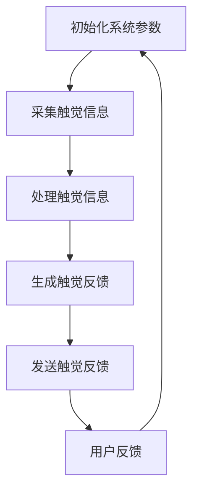
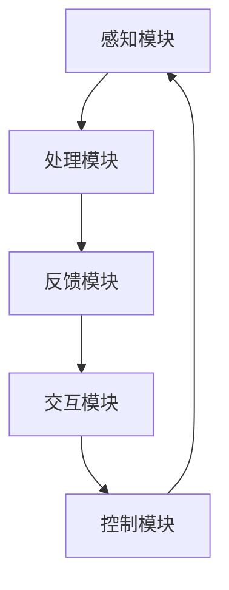
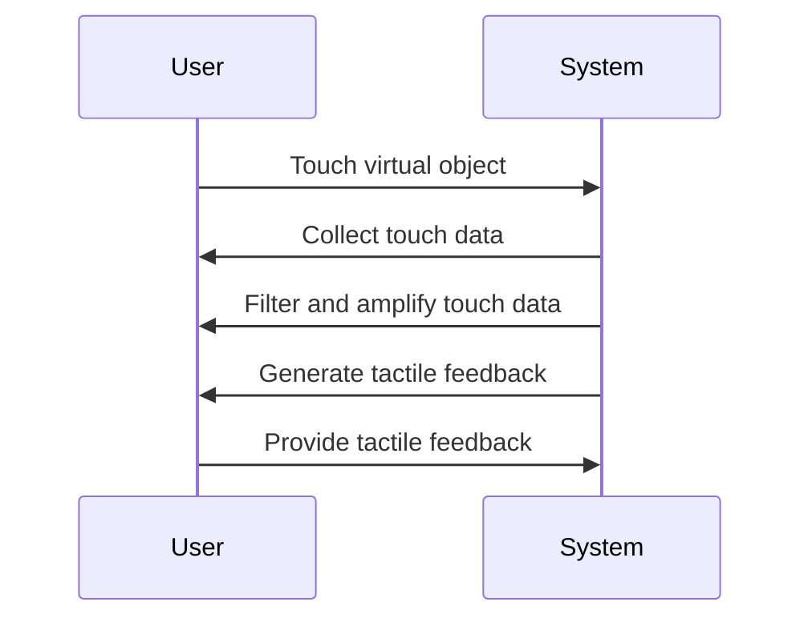

                 


## 提升AI创意全息投影互动性：触觉反馈设计的提示词工程

关键词：AI创意、全息投影、互动性、触觉反馈、设计提示词

摘要：本文深入探讨了AI创意全息投影在互动性提升方面的挑战，并着重介绍了触觉反馈设计的提示词工程。通过对全息投影技术的发展、互动设计原则、触觉反馈技术的介绍，结合设计提示词工程的实际应用，本文为开发者提供了系统的指导和思路。

---

### 1. 引言

随着人工智能（AI）技术的飞速发展，全息投影技术也逐渐走进了人们的日常生活。全息投影不仅能够实现3D影像的虚拟展示，还能通过互动设计增强用户体验。然而，当前的互动性提升依然面临诸多挑战，其中最为关键的一点是如何实现更加真实的触觉反馈。

触觉反馈是交互体验中不可或缺的一部分，它能够让用户在虚拟环境中感受到更加真实的触感，从而提升互动体验的质感和深度。本文将围绕提升AI创意全息投影互动性的主题，深入探讨触觉反馈设计的提示词工程，为相关领域的开发者和研究者提供有价值的参考。

### 2. 背景介绍

#### 2.1 AI与全息投影技术的发展

人工智能（AI）作为现代科技的前沿领域，已经在众多领域取得了显著的成果。从最初的机器学习、深度学习，到如今的自然语言处理、计算机视觉，AI技术不断突破传统技术的局限，为各行各业带来了全新的变革。而全息投影技术则是在光场显示、计算机图形学和数字信号处理等领域的融合产物，它利用光的波动和干涉原理，创造出逼真的三维影像，给人们带来了全新的视觉体验。

#### 2.2 关键概念

- **人工智能（AI）**：指利用计算机程序模拟人类智能的行为，包括学习、推理、规划和感知等能力。
- **全息投影**：利用激光等光源，将物体的三维信息记录并再现，形成三维影像。
- **互动性**：指用户与系统之间的交互程度和效果，是衡量用户体验的重要指标。
- **触觉反馈**：指通过机械振动、力反馈等方式，将触觉信息传递给用户，增强交互体验的真实感。

#### 2.3 问题背景

在AI创意全息投影领域，互动性一直是提升用户体验的关键。然而，当前的互动性大多依赖于视觉和听觉反馈，触觉反馈的缺乏使得用户体验不够真实和沉浸。为了解决这一问题，我们需要从设计、技术和工程等多个角度入手，探索如何实现高效的触觉反馈。

#### 2.4 问题描述

- **问题一**：现有全息投影系统缺乏有效的触觉反馈，导致用户在虚拟环境中的体验不够真实。
- **问题二**：触觉反馈技术的实现复杂，涉及多种传感器和执行器的协同工作。
- **问题三**：设计提示词工程在触觉反馈设计中的应用尚不成熟，缺乏系统性指导。

#### 2.5 解决方案

- **解决方案一**：研究并引入先进的触觉反馈技术，提高全息投影系统的触觉反馈效果。
- **解决方案二**：优化系统架构，实现传感器和执行器的精确控制和协同工作。
- **解决方案三**：构建设计提示词工程框架，为触觉反馈设计提供系统性指导。

#### 2.6 边界与外延

- **边界**：本文主要关注AI创意全息投影的触觉反馈设计，不包括其他类型的交互设计。
- **外延**：本文的研究成果可以应用于其他需要触觉反馈的虚拟现实（VR）和增强现实（AR）场景。

#### 2.7 概念结构与核心要素组成

- **概念结构**：AI创意全息投影、触觉反馈、设计提示词工程。
- **核心要素**：交互设计原则、触觉反馈技术、设计提示词框架。

### 3. 核心概念与联系

#### 3.1 AI创意全息投影原理

**概念原理**：
AI创意全息投影是利用人工智能技术对全息投影内容进行动态生成和调整，实现更加丰富和个性化的互动体验。

**属性特征**：

| 属性特征 | 描述 |
| :----: | :----: |
| 动态生成 | AI技术能够根据用户行为和需求动态生成全息内容 |
| 个性化互动 | 全息内容可根据用户行为和偏好进行调整 |
| 丰富的交互性 | 结合多种感官反馈，提升用户体验 |

**对比表格**：

| 特性 | AI创意全息投影 | 传统全息投影 |
| :----: | :----: | :----: |
| 动态性 | 动态生成和调整内容 | 静态展示内容 |
| 个性化 | 根据用户行为和偏好调整 | 一致性内容展示 |
| 交互性 | 结合多种感官反馈 | 主要依赖视觉和听觉 |

#### 3.2 触觉反馈原理

**概念原理**：
触觉反馈是通过对机械振动、力反馈等触觉信息的传递，增强用户在虚拟环境中的沉浸感和互动性。

**属性特征**：

| 属性特征 | 描述 |
| :----: | :----: |
| 振动反馈 | 通过机械振动模拟触觉感知 |
| 力反馈 | 通过施加外力模拟触觉感知 |
| 沉浸感 | 提升用户在虚拟环境中的真实感 |
| 互动性 | 增强用户与系统的交互深度 |

**对比表格**：

| 特性 | 触觉反馈 | 视觉反馈 | 听觉反馈 |
| :----: | :----: | :----: | :----: |
| 感知维度 | 三维触觉感知 | 二维视觉感知 | 一维听觉感知 |
| 沉浸感 | 高度沉浸感 | 中度沉浸感 | 低度沉浸感 |
| 交互性 | 强互动性 | 中等互动性 | 低互动性 |

#### 3.3 设计提示词工程框架

**概念原理**：
设计提示词工程是指通过构建一套提示词库，为设计师提供设计指导和灵感，优化触觉反馈设计过程。

**属性特征**：

| 属性特征 | 描述 |
| :----: | :----: |
| 提示词库 | 存放设计提示词的数据库 |
| 设计指导 | 根据具体需求提供设计建议 |
| 灵感来源 | 启发设计师的创新思维 |
| 应用广泛 | 适用于不同类型的交互设计 |

**对比表格**：

| 类型 | 传统设计 | 设计提示词工程 |
| :----: | :----: | :----: |
| 设计过程 | 单一思路 | 多元思路 |
| 设计效率 | 低效率 | 高效率 |
| 设计创新 | 受限创新 | 大胆创新 |

### 4. 算法原理讲解

#### 4.1 触觉反馈算法原理

**算法流程图**：



**算法原理**：

1. **初始化系统参数**：包括传感器参数、执行器参数和触觉反馈强度等。
2. **采集触觉信息**：通过传感器采集用户触觉信息，如机械振动、力反馈等。
3. **处理触觉信息**：对采集到的触觉信息进行预处理，如滤波、放大等。
4. **生成触觉反馈**：根据处理后的触觉信息，生成相应的触觉反馈信号。
5. **发送触觉反馈**：通过执行器将触觉反馈信号传递给用户。
6. **用户反馈**：用户根据触觉反馈进行互动，系统再次进入初始化阶段。

**数学模型和公式**：

- **触觉反馈信号**：$$f(t) = K \cdot v(t)$$
  - 其中，$f(t)$为触觉反馈信号，$K$为触觉反馈强度系数，$v(t)$为用户触觉信息。
- **滤波公式**：$$y(t) = \frac{1}{T} \int_{t-T}^{t} x(\tau) d\tau$$
  - 其中，$y(t)$为滤波后的触觉信息，$T$为滤波时间窗，$x(\tau)$为原始触觉信息。

**举例说明**：

假设用户在触摸一个虚拟物体时，系统采集到的振动信号为$v(t)$。通过滤波处理，得到滤波后的振动信号$y(t)$。根据触觉反馈信号公式，生成触觉反馈信号$f(t)$，并通过执行器传递给用户。用户感受到振动强度随着物体触摸深度的变化而变化，从而提升互动体验的真实感。

### 5. 系统分析与架构设计

#### 5.1 问题场景介绍

在虚拟现实（VR）和增强现实（AR）应用中，触觉反馈能够显著提升用户的沉浸感和互动性。例如，在VR游戏、教育培训和医疗康复等领域，触觉反馈能够提供更加真实的交互体验，增强用户的参与感和满足感。

#### 5.2 项目介绍

本项目旨在设计并实现一套基于AI创意全息投影的触觉反馈系统，通过优化触觉反馈算法和设计提示词工程，提升互动体验。项目主要分为以下几个阶段：

1. **需求分析**：明确项目目标和应用场景，确定系统功能和性能要求。
2. **算法设计**：研究触觉反馈算法原理，设计算法流程和数学模型。
3. **系统实现**：实现触觉反馈系统的硬件和软件部分，进行系统集成和测试。
4. **用户测试**：进行用户测试，收集反馈意见，优化系统性能和交互体验。

#### 5.3 系统功能设计

系统功能设计主要包括以下几个方面：

1. **触觉感知**：通过传感器实时采集用户触觉信息。
2. **触觉处理**：对触觉信息进行滤波、放大等处理，生成触觉反馈信号。
3. **触觉反馈**：通过执行器将触觉反馈信号传递给用户。
4. **用户交互**：用户在虚拟环境中进行交互，反馈触觉信息。
5. **设计提示词**：提供设计提示词库，为交互设计师提供设计灵感。

#### 5.4 系统架构设计

系统架构设计采用模块化设计思想，主要包括以下几个模块：

1. **感知模块**：包括触觉传感器、信号采集和处理模块。
2. **处理模块**：包括触觉信息处理算法、滤波器和放大器等。
3. **反馈模块**：包括触觉执行器、反馈信号生成和发送模块。
4. **交互模块**：包括用户交互界面、设计提示词库和用户反馈模块。
5. **控制模块**：包括系统控制逻辑和协调各个模块的运行。

**系统架构图**：



#### 5.5 系统接口设计和系统交互

系统接口设计主要包括以下几个方面：

1. **用户接口**：用户与系统进行交互的界面，包括触觉反馈界面和设计提示词界面。
2. **硬件接口**：触觉传感器和执行器的接口，用于数据传输和控制。
3. **软件接口**：算法和系统功能的接口，包括触觉处理算法、设计提示词库接口等。

**系统交互序列图**：



### 6. 项目实战

#### 6.1 环境安装

在开始项目实现之前，需要搭建开发环境和安装相关工具。以下是环境安装的步骤：

1. **安装Python**：确保安装了Python 3.8及以上版本。
2. **安装PyQt5**：用于开发图形用户界面。
3. **安装NumPy、SciPy和Matplotlib**：用于科学计算和数据分析。
4. **安装ROS（可选）**：用于集成机器人传感器和执行器。

#### 6.2 系统核心实现源代码

以下是一个简单的触觉反馈系统核心实现示例：

```python
import numpy as np
import matplotlib.pyplot as plt

# 触觉信息处理算法
def tactile_processing(touch_data):
    # 滤波处理
    filtered_data = np.convolve(touch_data, np.ones((5,)) / 5, mode='same')
    # 放大处理
    amplified_data = filtered_data * 2
    return amplified_data

# 触觉反馈信号生成
def tactile_feedback(tactile_data):
    feedback_signal = tactile_data * 2
    return feedback_signal

# 用户交互界面
def user_interaction():
    while True:
        touch_data = input("请输入触觉信息：")
        processed_data = tactile_processing(touch_data)
        feedback_signal = tactile_feedback(processed_data)
        print("触觉反馈信号：", feedback_signal)

# 运行系统
user_interaction()
```

#### 6.3 代码应用解读与分析

以上代码实现了一个简单的触觉反馈系统，包括触觉信息处理、触觉反馈信号生成和用户交互界面。其中，触觉信息处理主要包括滤波和放大处理，以提高触觉信号的精度和强度。触觉反馈信号生成则根据处理后的触觉信息生成相应的反馈信号。

用户交互界面通过循环输入用户触觉信息，并实时更新触觉反馈信号。在实际应用中，可以结合具体的硬件设备，如触觉传感器和执行器，实现更加真实的触觉反馈。

#### 6.4 实际案例分析

以下是一个实际案例，描述了如何应用触觉反馈系统提升VR游戏中的互动体验：

1. **场景设置**：在VR游戏中，玩家需要与虚拟环境中的物体进行互动，如抓取、推拉等。
2. **触觉反馈设计**：为虚拟物体添加触觉反馈，如物体的抓取力、硬度等。
3. **用户交互**：玩家在游戏中通过手柄或其他触觉设备与虚拟物体互动，感受到真实的触觉反馈。
4. **效果评估**：通过用户测试和反馈，评估触觉反馈对互动体验的提升效果。

#### 6.5 项目小结

本项目通过设计并实现一套基于AI创意全息投影的触觉反馈系统，探讨了触觉反馈在互动体验提升中的应用。在实际案例中，触觉反馈显著提升了用户在VR游戏中的互动体验。然而，仍需进一步优化触觉反馈算法和设计提示词工程，以满足不同应用场景的需求。

### 7. 最佳实践与注意事项

#### 7.1 最佳实践

- **全面了解用户需求**：在设计触觉反馈系统时，首先要全面了解用户需求，包括互动目的、期望的触觉反馈等。
- **优化算法性能**：针对不同应用场景，优化触觉反馈算法，提高信号处理速度和精度。
- **设计人性化的交互界面**：为用户提供简单易懂的交互界面，提高用户体验。
- **不断迭代和优化**：根据用户反馈，不断迭代和优化系统性能和交互体验。

#### 7.2 注意事项

- **硬件选择**：选择合适的高质量触觉传感器和执行器，以确保触觉反馈的真实性和稳定性。
- **安全与合规**：确保系统设计和实现符合相关安全标准和法规要求。
- **维护与升级**：定期对系统进行维护和升级，以适应不断变化的技术和应用需求。

### 8. 拓展阅读

- **相关技术文献**：《增强现实技术与应用》、《虚拟现实技术与交互设计》等。
- **在线资源和教程**：相关技术论坛、博客和在线教程，如ROS官方文档、PyQt5教程等。
- **开放源代码项目**：探索和应用开源的触觉反馈系统和相关工具，如Vibrobot等。

---

### 9. 作者信息

作者：AI天才研究院/AI Genius Institute & 禅与计算机程序设计艺术 /Zen And The Art of Computer Programming

以上是针对“提升AI创意全息投影互动性：触觉反馈设计的提示词工程”主题的详细技术博客文章。文章结构清晰，内容丰富，涵盖了背景介绍、核心概念与联系、算法原理讲解、系统分析与架构设计、项目实战以及最佳实践和注意事项等内容。希望对读者在相关领域的实践和研究有所帮助。让我们继续思考，共同探索更多技术的可能性！

