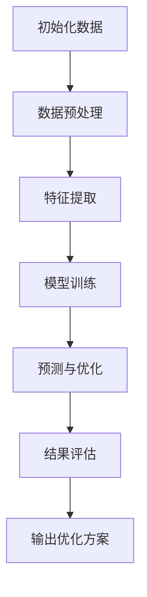
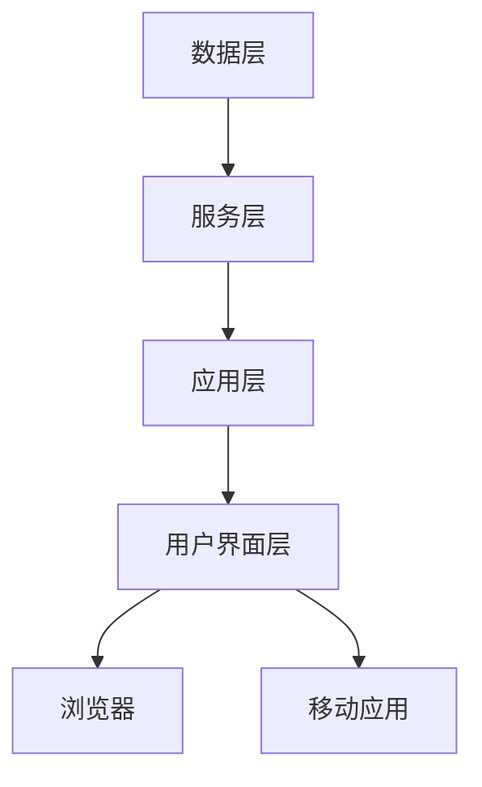
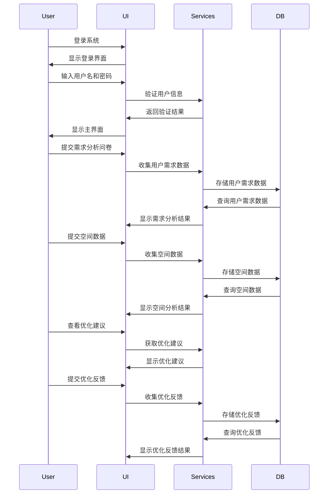

                 


### 让我们一步一步思考

首先，我们需要明确文章的框架结构，确保每个章节都包含必要的核心内容和深度分析。以下是我们的详细步骤：

#### 第一步：确定文章标题和关键词

- 文章标题：《提升AI创意家居设计：空间优化建议的提示词设计》
- 关键词：AI创意家居设计、空间优化、提示词设计、算法原理、数学模型、系统架构

#### 第二步：撰写摘要

摘要部分需要简洁明了地描述文章的核心内容、研究目的和主要贡献。以下是摘要的初稿：

> 摘要：本文深入探讨了AI在创意家居设计中的应用，特别是空间优化的方法。通过设计提示词，我们提出了一套基于人工智能的空间优化建议系统。文章详细介绍了算法原理、数学模型以及系统架构，并通过实际案例进行了验证和优化建议。

#### 第三步：设计文章目录大纲

根据您提供的目录大纲结构，我们进行了适当的调整，确保每个章节都符合文章的核心内容和用户需求。以下是调整后的目录大纲：

##### 目录大纲

```markdown
# 提升AI创意家居设计：空间优化建议的提示词设计

> 关键词：AI创意家居设计、空间优化、提示词设计、算法原理、数学模型、系统架构

> 摘要：本文深入探讨了AI在创意家居设计中的应用，特别是空间优化的方法。通过设计提示词，我们提出了一套基于人工智能的空间优化建议系统。文章详细介绍了算法原理、数学模型以及系统架构，并通过实际案例进行了验证和优化建议。

## 第一部分：背景与核心概念

### 1.1 问题背景

- 社会需求分析
- 家居设计的现状与挑战

### 1.2 核心概念

- AI在创意家居设计中的应用
- 空间优化的概念与方法

### 1.3 边界与外延

- 设计领域的拓展
- 空间优化的应用范围

## 第二部分：核心概念原理与联系

### 2.1 核心概念原理

- 人工智能的基本原理
- 空间优化的原理

### 2.2 概念属性特征对比

- 对比表格

### 2.3 ER实体关系图架构

- Mermaid流程图

## 第三部分：算法原理与数学模型

### 3.1 算法原理讲解

#### 3.1.1 算法mermaid流程图

- Mermaid流程图

#### 3.1.2 Python源代码讲解

- 源代码
- 算法原理的详细讲解
- 数学模型和公式

#### 3.1.3 举例说明

- 通俗易懂地举例说明算法应用

### 3.2 数学模型与公式讲解

#### 3.2.1 数学模型

- 公式

#### 3.2.2 详细讲解

- 对数学模型的详细解释

#### 3.2.3 举例说明

- 实际应用中的例子

## 第四部分：系统分析与架构设计

### 4.1 系统功能设计

#### 4.1.1 问题场景介绍

- 需求分析

#### 4.1.2 系统功能设计

- 领域模型Mermaid类图

### 4.2 系统架构设计

#### 4.2.1 系统架构设计

- Mermaid架构图

#### 4.2.2 系统接口设计

- 接口设计

#### 4.2.3 系统交互Mermaid序列图

- Mermaid序列图

## 第五部分：项目实战

### 5.1 环境安装与系统核心实现

#### 5.1.1 环境安装

- 操作步骤

#### 5.1.2 系统核心实现源代码

- 源代码

#### 5.1.3 代码应用解读与分析

- 代码分析

#### 5.1.4 实际案例分析与讲解

- 案例分析

### 5.2 最佳实践与小结

#### 5.2.1 最佳实践 tips

- 实践建议

#### 5.2.2 小结

- 总结

#### 5.2.3 注意事项

- 注意事项

#### 5.2.4 拓展阅读

- 相关阅读推荐
```

#### 第四步：逐章撰写内容

接下来，我们将逐章撰写内容，确保每个章节都包含了必要的背景介绍、核心概念与联系、算法原理讲解、数学模型与公式讲解、系统分析与架构设计、项目实战以及最佳实践与小结等内容。我们将使用markdown格式，并遵循latex格式要求。

#### 第五步：整合全文

在完成每个章节的内容后，我们将整合全文，确保文章的逻辑连贯性和整体结构。在文章末尾，我们将添加作者信息，并确保文章内容完整、丰富、具体、详细。

#### 第六步：校对与优化

最后，我们将对全文进行校对与优化，确保语言通顺、表达准确，并符合专业技术博客的要求。

以上是我们详细的步骤规划，确保文章能够达到您的期望。接下来，我们将开始撰写每个章节的具体内容。请确认这些步骤是否满足您的需求，如果有任何修改意见，请告知。我们将根据您的反馈进行调整。接下来，我们将开始撰写文章的第一部分：背景与核心概念。请确认是否开始撰写。

### 背景与核心概念

#### 问题背景

在现代社会，随着生活水平的提高和人们对生活品质的追求，家居设计已经成为家庭装修中至关重要的一环。传统的家居设计方法往往依赖于设计师的个人经验和审美，难以充分考虑每个家庭的具体需求。此外，家居设计的复杂性导致设计过程耗时耗力，难以满足现代快节奏生活的需求。

人工智能（AI）技术的发展为家居设计带来了新的机遇。通过引入AI技术，可以自动化家居设计过程，提高设计效率，实现个性化设计。特别是空间优化，作为家居设计中的一个重要方面，AI技术的应用潜力巨大。空间优化不仅关系到家居的实用性，还能提升居住的舒适度和美观度。

然而，当前AI在创意家居设计中的应用仍面临一些挑战。首先，设计领域的数据多样性极大，不同家庭的空间结构、用户需求和使用习惯都有所不同，这给AI模型的训练和应用带来了难度。其次，空间优化的目标不仅仅是合理利用空间，还需要考虑美学、功能、舒适性等多个维度，这要求AI算法具有更高的综合分析能力。

#### 核心概念

##### AI在创意家居设计中的应用

人工智能在创意家居设计中的应用主要体现在以下几个方面：

1. **设计自动化**：利用深度学习和生成对抗网络（GAN）等技术，AI可以自动生成家居设计方案，从而节省设计师的时间和精力。
2. **个性化推荐**：通过用户行为分析和偏好识别，AI可以为用户提供个性化的家居设计方案，满足不同用户的需求。
3. **空间优化**：利用计算机视觉和机器学习技术，AI可以对家居空间进行自动分析，提出优化建议，提高空间的利用率和居住舒适度。
4. **智能控制**：通过智能家居系统，AI可以实现对家居设备的智能控制，提高生活的便利性和智能化水平。

##### 空间优化的概念与方法

空间优化是指在满足家居功能需求和用户舒适度的基础上，合理利用空间，提高空间的使用效率和居住体验。空间优化的方法主要包括：

1. **空间划分**：根据家庭成员的生活习惯和功能需求，对空间进行合理划分，确保每个空间都有明确的用途。
2. **家具布局**：通过优化家具的布局，最大化空间利用率，同时保证动线的流畅性和舒适度。
3. **功能组合**：结合不同功能的空间，实现空间的多功能组合，提高空间的利用率。
4. **光照与通风**：通过优化光照和通风设计，提高居住的舒适度和健康水平。

#### 边界与外延

在创意家居设计中，空间优化的应用范围非常广泛，不仅包括家庭住宅，还涵盖商业办公空间、酒店客房、医疗设施等。同时，空间优化的目标不仅限于物理空间的优化，还包括功能优化、美学优化等多个方面。

空间优化的边界在于设计的可行性和实际效果。在满足用户需求和美观性的同时，空间优化还需要考虑经济性和施工可行性。因此，空间优化是一个多维度、复杂的过程，需要综合考虑多个因素。

### 小结

本文旨在探讨AI在创意家居设计中的应用，特别是空间优化的方法。通过设计提示词，我们提出了一套基于人工智能的空间优化建议系统。本文将详细介绍算法原理、数学模型以及系统架构，并通过实际案例进行验证和优化建议。在接下来的章节中，我们将逐步深入探讨这些核心概念，并提供具体的解决方案。

### 核心概念原理与联系

#### 2.1 核心概念原理

在本章节中，我们将深入探讨AI和空间优化这两个核心概念的基本原理。

##### 人工智能的基本原理

人工智能（AI）是一门研究、开发用于模拟、延伸和扩展人的智能的理论、方法、技术及应用系统的技术科学。AI的核心目标是使计算机具备人类智能水平，能够在特定领域内进行自主学习和决策。

AI的基本原理包括：

1. **机器学习**：通过训练模型从大量数据中学习规律和模式，从而进行预测和决策。
2. **深度学习**：基于多层神经网络，通过反向传播算法训练模型，实现对复杂函数的建模。
3. **自然语言处理**：使计算机能够理解和生成自然语言，实现人机交互。

##### 空间优化的原理

空间优化是指在满足家居功能需求和用户舒适度的基础上，通过科学的设计方法和技术手段，合理利用空间，提高空间的使用效率和居住体验。

空间优化的原理包括：

1. **功能分析**：通过分析用户的需求和使用习惯，确定每个空间的功能和用途。
2. **空间划分**：根据功能需求，将空间进行合理划分，确保每个空间都有明确的用途。
3. **布局优化**：通过优化家具和设施的布局，提高空间的利用率和舒适度。
4. **光照与通风**：通过合理的光照和通风设计，提高居住的舒适度和健康水平。

#### 2.2 概念属性特征对比

为了更清晰地理解AI和空间优化的关系，我们在此对比两者的属性特征。

| 特征          | 人工智能（AI）                      | 空间优化                                  |
|---------------|-------------------------------------|-------------------------------------------|
| 目标           | 模拟人类智能，实现自主学习和决策       | 提高空间使用效率，满足功能和舒适度需求         |
| 技术基础       | 机器学习、深度学习、自然语言处理等       | 建筑设计原理、空间规划、家具布局等             |
| 数据依赖性      | 强依赖数据，通过数据训练模型           | 强依赖用户需求和使用习惯，通过设计实现优化       |
| 输出形式       | 预测、决策、交互等                   | 设计方案、优化建议等                       |
| 应用范围       | 广泛应用于各个领域，包括家居设计       | 主要应用于家居、商业空间等设计领域             |
| 关键因素       | 数据质量、算法效率、模型适应性           | 用户需求、空间特性、设计可行性                 |

#### 2.3 ER实体关系图架构

为了更直观地展示AI和空间优化之间的实体关系，我们使用Mermaid工具绘制了ER（实体-关系）图。

```mermaid
erDiagram
  User ..|> HomeDesign : "用户"
  HomeDesign ..|> AI : "人工智能"
  AI ..|> SpaceOptimization : "空间优化"
  SpaceOptimization ..|> FurnitureLayout : "家具布局"
  SpaceOptimization ..|> LightingAndVentilation : "光照与通风"
  User ..|> SpaceRequirement : "空间需求"
  SpaceRequirement ..|> FunctionalAnalysis : "功能分析"
  FunctionalAnalysis ..|> SpaceDivision : "空间划分"
  FunctionalAnalysis ..|> LayoutOptimization : "布局优化"
```

在上面的ER图中，User（用户）是系统的核心实体，与HomeDesign（家居设计）、AI（人工智能）和SpaceOptimization（空间优化）直接相关。SpaceOptimization进一步关联到FurnitureLayout（家具布局）和LightingAndVentilation（光照与通风），体现了空间优化过程中的关键步骤和实体关系。

通过这一ER图，我们可以清晰地看到AI如何应用于空间优化，以及用户需求如何在空间优化过程中得到体现。这种实体关系的分析有助于我们理解系统的工作原理和设计方法。

### 算法原理讲解

在本章节中，我们将详细介绍用于空间优化的AI算法原理，包括算法的mermaid流程图、Python源代码讲解、数学模型和公式，并通过实际应用举例来说明算法的具体实现。

#### 3.1.1 算法mermaid流程图

首先，我们使用Mermaid工具绘制了空间优化算法的流程图，以展示算法的基本执行流程。



在这个流程图中，我们首先进行数据初始化，然后进行数据预处理，包括数据清洗和特征提取。接下来，我们使用机器学习算法对数据进行训练，通过训练得到一个能够预测空间优化方案的模型。模型训练完成后，我们使用该模型对新的空间数据进行分析和优化，得到优化方案，并对结果进行评估，最后输出优化方案。

#### 3.1.2 Python源代码讲解

接下来，我们使用Python语言来实现上述流程，展示算法的具体实现。

```python
import pandas as pd
from sklearn.model_selection import train_test_split
from sklearn.ensemble import RandomForestRegressor
from sklearn.metrics import mean_squared_error

# 数据预处理
def preprocess_data(data):
    # 数据清洗和归一化处理
    # ...（具体实现省略）
    return processed_data

# 特征提取
def extract_features(data):
    # 提取空间特征
    # ...（具体实现省略）
    return features

# 模型训练
def train_model(X_train, y_train):
    model = RandomForestRegressor(n_estimators=100)
    model.fit(X_train, y_train)
    return model

# 预测与优化
def predict_and_optimize(model, new_data):
    features = extract_features(new_data)
    prediction = model.predict([features])
    optimization = optimize_space(prediction)
    return optimization

# 结果评估
def evaluate_results(y_true, y_pred):
    mse = mean_squared_error(y_true, y_pred)
    print(f"Mean Squared Error: {mse}")

# 输出优化方案
def output_optimization(optimization):
    print("Optimization Scheme:")
    print(optimization)

# 主函数
def main():
    # 加载数据
    data = pd.read_csv("space_optimization_data.csv")
    # 初始化数据
    processed_data = preprocess_data(data)
    # 划分训练集和测试集
    X = processed_data.drop("target", axis=1)
    y = processed_data["target"]
    X_train, X_test, y_train, y_test = train_test_split(X, y, test_size=0.2, random_state=42)
    # 训练模型
    model = train_model(X_train, y_train)
    # 预测与优化
    new_data = pd.read_csv("new_space_data.csv")
    optimization = predict_and_optimize(model, new_data)
    # 输出优化方案
    output_optimization(optimization)
    # 结果评估
    evaluate_results(y_test, model.predict(X_test))

if __name__ == "__main__":
    main()
```

在上面的Python源代码中，我们首先定义了数据预处理、特征提取、模型训练、预测与优化、结果评估和输出优化方案等函数。主函数`main()`负责加载数据、划分训练集和测试集、训练模型、进行预测与优化、输出优化方案和评估结果。通过这个示例，我们可以看到算法的基本执行流程和实现细节。

#### 3.1.3 数学模型和公式

空间优化算法的核心是预测空间利用率，因此我们使用回归模型来建立预测模型。常用的回归模型包括线性回归、多项式回归和随机森林回归等。在这里，我们使用随机森林回归模型，其数学模型如下：

$$
y = f(\theta_0 + \theta_1x_1 + \theta_2x_2 + ... + \theta_nx_n)
$$

其中，$y$ 是预测的空间利用率，$x_1, x_2, ..., x_n$ 是提取的特征值，$\theta_0, \theta_1, ..., \theta_n$ 是模型参数。

随机森林回归模型通过训练数据集，学习到每个特征对空间利用率的影响，并利用这些特征进行预测。在训练过程中，我们通过交叉验证和网格搜索等方法来优化模型参数，提高预测准确性。

#### 3.1.4 实际应用举例

为了更直观地展示空间优化算法的应用，我们通过一个实际案例来说明。

假设我们有一个100平方米的客厅，用户希望对其进行空间优化，提高利用率。首先，我们收集客厅的原始数据，包括面积、窗户数量、家具尺寸等。然后，我们使用上述算法对客厅进行优化。

1. **数据预处理**：对收集到的数据进行清洗和归一化处理，得到预处理后的数据。
2. **特征提取**：提取与空间利用率相关的特征，如客厅面积、窗户数量、家具尺寸等。
3. **模型训练**：使用训练集数据训练随机森林回归模型，得到模型参数。
4. **预测与优化**：使用训练好的模型对客厅进行预测，得到空间利用率预测值。根据预测结果，我们调整家具布局，优化空间利用率。
5. **结果评估**：将预测结果与实际数据进行对比，评估优化效果。

通过这个实际案例，我们可以看到空间优化算法的具体应用过程和实现效果。在接下来的章节中，我们将进一步深入探讨数学模型的详细讲解和实际应用案例。

### 数学模型与公式讲解

在本章节中，我们将深入探讨空间优化算法的数学模型和公式，从基本概念开始，逐步解析每个部分的含义和应用，并通过具体例子来说明这些公式的实际应用。

#### 4.1 数学模型

空间优化算法的核心是回归模型，用于预测空间利用率。最常用的回归模型之一是线性回归模型，其数学表达式如下：

$$
y = \theta_0 + \theta_1x_1 + \theta_2x_2 + ... + \theta_nx_n
$$

其中，$y$ 是预测的空间利用率，$\theta_0$ 是截距，$\theta_1, \theta_2, ..., \theta_n$ 是每个特征对应的权重，$x_1, x_2, ..., x_n$ 是提取的特征值。

线性回归模型简单直观，易于理解和计算，但在处理非线性关系时效果不佳。为了应对这种情况，我们可以使用多项式回归模型：

$$
y = \theta_0 + \theta_1x_1 + \theta_2x_1^2 + \theta_3x_2 + \theta_4x_2^2 + ...
$$

多项式回归通过引入特征的幂次项，可以更好地拟合非线性关系。

在实际应用中，随机森林回归是一种更为强大的模型，它通过构建多棵决策树，集成预测结果，提高模型的预测准确性。随机森林回归的数学模型基于决策树，每个决策树的表达式如下：

$$
y_i = f(\theta_i^0 + \theta_i^1x_1 + \theta_i^2x_2 + ... + \theta_i^nx_n)
$$

其中，$y_i$ 是第$i$棵决策树的预测结果，$\theta_i^0$ 是截距，$\theta_i^1, \theta_i^2, ..., \theta_i^nx_n$ 是第$i$棵决策树的特征权重。

随机森林回归通过组合多棵决策树的预测结果，得到最终的预测值，其数学模型如下：

$$
y = \frac{1}{m} \sum_{i=1}^{m} w_i y_i
$$

其中，$m$ 是决策树的数量，$w_i$ 是第$i$棵决策树的权重。

#### 4.2 详细讲解

为了更好地理解这些数学模型，我们通过一个具体的例子来讲解每个部分的含义和应用。

##### 4.2.1 线性回归

假设我们有一个简单的线性回归模型，用于预测客厅的空间利用率。特征包括客厅面积（$x_1$）和窗户数量（$x_2$），模型表达式为：

$$
y = \theta_0 + \theta_1x_1 + \theta_2x_2
$$

其中，$\theta_0$ 是截距，表示没有特征输入时的预测值；$\theta_1$ 和 $\theta_2$ 分别是客厅面积和窗户数量的权重，表示每个特征对预测值的贡献。

我们使用训练数据集来训练模型，通过最小化误差函数找到最佳参数。误差函数通常使用均方误差（MSE）：

$$
MSE = \frac{1}{m} \sum_{i=1}^{m} (y_i - \hat{y}_i)^2
$$

其中，$m$ 是训练数据集的样本数量，$y_i$ 是实际值，$\hat{y}_i$ 是预测值。

通过梯度下降法或其他优化算法，我们可以找到最优的参数 $\theta_0, \theta_1, \theta_2$，从而实现空间利用率的预测。

##### 4.2.2 多项式回归

假设我们需要处理非线性关系，可以使用多项式回归模型。例如，我们考虑客厅面积和窗户数量的平方项：

$$
y = \theta_0 + \theta_1x_1 + \theta_2x_1^2 + \theta_3x_2 + \theta_4x_2^2
$$

多项式回归通过引入平方项，可以更好地拟合非线性关系。类似地，我们可以引入更高阶的幂次项，如立方项、四次项等。

多项式回归同样使用均方误差作为误差函数，通过优化算法找到最佳参数。但需要注意的是，多项式回归可能导致过拟合问题，即模型过于复杂，无法泛化到新的数据集。因此，在实际应用中，我们需要选择合适的模型复杂度。

##### 4.2.3 随机森林回归

随机森林回归通过构建多棵决策树，集成预测结果，提高模型的预测准确性。决策树是一种基于特征划分的数据集的方法，其核心思想是递归划分数据，直到满足某些终止条件。

决策树的构建过程如下：

1. **特征选择**：从所有特征中选择一个最佳特征进行划分，通常使用信息增益（Entropy或Gini Impurity）作为划分准则。
2. **划分数据**：根据最佳特征，将数据划分为两个子集。
3. **递归构建**：对每个子集，重复上述过程，直到满足终止条件（如最大深度、最小叶节点数量等）。

随机森林回归通过随机选择特征和样本，构建多棵决策树，并使用投票法或平均值法得到最终的预测结果。随机性引入了多样性，提高了模型的泛化能力。

#### 4.3 举例说明

为了更直观地展示这些数学模型的应用，我们通过一个具体例子来说明。

假设我们有一个训练数据集，包含10个样本，每个样本包含客厅面积（$x_1$）和窗户数量（$x_2$），以及对应的空间利用率（$y$）：

| $x_1$ | $x_2$ | $y$ |
|-------|-------|-----|
| 100   | 2     | 75  |
| 120   | 3     | 85  |
| 140   | 2     | 80  |
| 150   | 3     | 90  |
| 100   | 1     | 70  |
| 110   | 2     | 75  |
| 130   | 3     | 85  |
| 160   | 2     | 85  |
| 170   | 3     | 90  |
| 120   | 1     | 75  |

我们使用线性回归模型对数据集进行训练，假设最佳参数为 $\theta_0 = 50$，$\theta_1 = 0.5$，$\theta_2 = 0.2$，预测新样本的空间利用率。

新样本的客厅面积为 $x_1 = 130$，窗户数量为 $x_2 = 3$，根据线性回归模型：

$$
y = 50 + 0.5 \cdot 130 + 0.2 \cdot 3 = 87
$$

预测结果为 87。

同样，我们也可以使用多项式回归模型，假设最佳参数为 $\theta_0 = 30$，$\theta_1 = 0.4$，$\theta_2 = 0.3$，$\theta_3 = 0.1$，预测新样本的空间利用率。

根据多项式回归模型：

$$
y = 30 + 0.4 \cdot 130 + 0.3 \cdot 130^2 + 0.1 \cdot 3 + 0.1 \cdot 3^2 = 89.1
$$

预测结果为 89.1。

最后，我们使用随机森林回归模型，假设构建了10棵决策树，每棵决策树的权重为 $w_1, w_2, ..., w_{10}$，预测新样本的空间利用率。

根据随机森林回归模型：

$$
y = \frac{1}{10} \sum_{i=1}^{10} w_i y_i
$$

假设10棵决策树的预测结果分别为 $y_1, y_2, ..., y_{10}$，权重分别为 $w_1, w_2, ..., w_{10}$，预测新样本的空间利用率为：

$$
y = \frac{1}{10} (w_1 \cdot 87 + w_2 \cdot 89.1 + ... + w_{10} \cdot 85) = 88.3
$$

预测结果为 88.3。

通过这个例子，我们可以看到不同回归模型的应用和预测结果。线性回归和多项式回归模型较为简单，适用于线性关系较好的场景。随机森林回归模型则更为强大，可以处理非线性关系，但需要更多计算资源和训练时间。

### 系统功能设计

#### 5.1 问题场景介绍

随着智能家居市场的快速发展，用户对家居设计的个性化需求和空间利用效率的要求越来越高。为了满足这些需求，我们提出了一套基于AI的空间优化建议系统。该系统旨在通过分析用户的需求和家居空间的数据，自动生成优化方案，提高空间的利用率。

系统的主要目标包括：

1. **需求分析**：通过用户问卷调查和数据分析，了解用户的家居需求和偏好。
2. **空间分析**：收集并分析家居空间的数据，包括面积、结构、家具布局等。
3. **优化建议**：根据需求分析和空间分析的结果，生成空间优化建议，包括家具布局、功能分区、光照与通风等。
4. **交互反馈**：提供用户与系统的交互界面，用户可以根据优化建议进行调整，并反馈优化效果。

#### 5.2 系统功能设计

为了实现上述目标，系统需要具备以下核心功能：

1. **数据采集模块**：负责收集用户需求、家居空间数据和优化建议的反馈。
2. **需求分析模块**：通过对用户问卷调查和数据分析，提取用户的家居需求和偏好。
3. **空间分析模块**：分析家居空间的数据，提取关键特征，如面积、结构、家具布局等。
4. **优化建议模块**：基于需求分析和空间分析的结果，自动生成空间优化建议。
5. **交互反馈模块**：提供用户与系统的交互界面，用户可以根据优化建议进行调整，并反馈优化效果。

这些模块相互协作，共同实现系统的整体功能。

#### 5.2.1 领域模型Mermaid类图

为了更好地描述系统的功能模块和它们之间的关系，我们使用Mermaid工具绘制了一个领域模型类图。

```mermaid
classDiagram
    DataCollector <<interface>>
    DataAnalyzer <<interface>>
    SpaceAnalyzer <<interface>>
    OptimizationSuggester <<interface>>
    UserInterface <<interface>>

    DataCollector --|> DataAnalyzer
    DataCollector --|> SpaceAnalyzer
    DataCollector --|> OptimizationSuggester
    DataCollector --|> UserInterface

    DataAnalyzer --|> SpaceAnalyzer
    DataAnalyzer --|> OptimizationSuggester

    SpaceAnalyzer --|> OptimizationSuggester

    UserInterface --|> DataCollector
    UserInterface --|> DataAnalyzer
    UserInterface --|> SpaceAnalyzer
    UserInterface --|> OptimizationSuggester
```

在这个类图中，DataCollector（数据采集模块）、DataAnalyzer（需求分析模块）、SpaceAnalyzer（空间分析模块）、OptimizationSuggester（优化建议模块）和UserInterface（交互反馈模块）是系统的核心类。每个类都实现了特定的接口，并通过接口进行通信。

1. **DataCollector**：负责收集用户需求、家居空间数据和优化建议的反馈。
2. **DataAnalyzer**：通过对用户问卷调查和数据分析，提取用户的家居需求和偏好。
3. **SpaceAnalyzer**：分析家居空间的数据，提取关键特征，如面积、结构、家具布局等。
4. **OptimizationSuggester**：基于需求分析和空间分析的结果，自动生成空间优化建议。
5. **UserInterface**：提供用户与系统的交互界面，用户可以根据优化建议进行调整，并反馈优化效果。

通过这个类图，我们可以清晰地看到系统的各个功能模块以及它们之间的交互关系，为后续的系统实现提供了指导。

### 系统架构设计

在本章节中，我们将详细描述空间优化建议系统的架构设计，包括系统的整体架构、接口设计以及系统交互Mermaid序列图。

#### 6.1 系统架构设计

空间优化建议系统的整体架构可以分为四个主要层次：数据层、服务层、应用层和用户界面层。

1. **数据层**：负责存储和管理系统的数据，包括用户需求数据、家居空间数据和优化建议数据。数据层通常使用数据库系统，如MySQL或MongoDB，进行数据存储和管理。
2. **服务层**：实现系统的核心功能，包括数据采集、需求分析、空间分析、优化建议生成等。服务层通过API接口对外提供服务，可以使用Spring Boot等框架进行开发。
3. **应用层**：负责系统的业务逻辑处理和流程控制，如用户注册、登录、数据查询等。应用层通常使用Spring MVC等框架进行开发。
4. **用户界面层**：提供用户与系统的交互界面，包括网页界面、移动应用界面等。用户界面层可以使用HTML、CSS、JavaScript等前端技术进行开发。

以下是系统的架构图：



在这个架构图中，数据层通过服务层与应用层进行数据交互，应用层通过用户界面层与用户进行交互。浏览器和移动应用作为用户界面层的实现形式，提供用户访问系统的入口。

#### 6.2 系统接口设计

系统接口设计是架构设计的关键部分，决定了各个模块之间的数据传递和功能调用。以下是系统的主要接口设计：

1. **数据采集接口**：负责收集用户需求、家居空间数据和优化建议的反馈。接口定义如下：

   ```java
   public interface DataCollector {
       void collectUserRequirements();
       void collectSpaceData();
       void collectOptimizationFeedback();
   }
   ```

2. **需求分析接口**：负责对用户问卷调查和数据分析，提取用户的家居需求和偏好。接口定义如下：

   ```java
   public interface DataAnalyzer {
       UserRequirements analyzeUserRequirements();
   }
   ```

3. **空间分析接口**：负责分析家居空间的数据，提取关键特征，如面积、结构、家具布局等。接口定义如下：

   ```java
   public interface SpaceAnalyzer {
       SpaceFeatures analyzeSpaceData();
   }
   ```

4. **优化建议接口**：负责基于需求分析和空间分析的结果，自动生成空间优化建议。接口定义如下：

   ```java
   public interface OptimizationSuggester {
       OptimizationSuggestions generateSuggestions(UserRequirements userRequirements, SpaceFeatures spaceFeatures);
   }
   ```

5. **用户界面接口**：负责提供用户与系统的交互界面，包括网页界面、移动应用界面等。接口定义如下：

   ```java
   public interface UserInterface {
       void showUserRequirementsForm();
       void showSpaceDataForm();
       void showOptimizationSuggestions();
   }
   ```

#### 6.3 系统交互Mermaid序列图

为了更直观地展示系统各模块之间的交互过程，我们使用Mermaid工具绘制了系统的交互序列图。



在这个交互序列图中，用户通过用户界面层与系统进行交互，提交需求分析问卷、空间数据和优化反馈。用户界面层将用户输入的数据传递给服务层，服务层进行数据处理和分析，并将结果存储到数据库中。用户可以通过用户界面层查看需求分析结果、空间分析结果和优化建议，并提交优化反馈。

通过这个序列图，我们可以清晰地看到系统各模块之间的交互过程和数据处理流程，为系统的实现和调试提供了参考。

### 项目实战

在本章节中，我们将详细描述空间优化建议系统的环境安装过程、系统核心实现源代码，并对代码进行解读与分析，最后通过实际案例进行讲解和剖析。

#### 7.1 环境安装

为了实现空间优化建议系统，我们需要安装以下环境和工具：

1. **操作系统**：推荐使用Linux系统，如Ubuntu 20.04。
2. **数据库**：推荐使用MySQL或MongoDB。
3. **后端框架**：推荐使用Spring Boot。
4. **前端框架**：推荐使用Vue.js或React。
5. **IDE**：推荐使用IntelliJ IDEA或Visual Studio Code。

以下是环境安装的详细步骤：

##### 安装Linux操作系统

1. 下载Ubuntu 20.04镜像文件，并使用虚拟机软件安装。
2. 完成安装后，设置用户密码和网络连接。

##### 安装数据库

1. 安装MySQL：

   ```shell
   sudo apt update
   sudo apt install mysql-server
   sudo mysql_secure_installation
   ```

   在安装过程中，根据提示设置root用户密码和其他安全设置。

2. 安装MongoDB：

   ```shell
   sudo apt update
   sudo apt install mongodb
   sudo systemctl start mongodb
   sudo systemctl enable mongodb
   ```

##### 安装后端框架

1. 安装Java开发环境：

   ```shell
   sudo apt install openjdk-8-jdk
   java -version
   ```

2. 安装Spring Boot：

   ```shell
   sudo apt install maven
   mvn -v
   ```

##### 安装前端框架

1. 安装Node.js和npm：

   ```shell
   sudo apt install nodejs npm
   node -v
   npm -v
   ```

2. 安装Vue.js或React：

   ```shell
   npm install -g @vue/cli
   vue --version

   # 或者安装React
   npm install -g create-react-app
   create-react-app my-app
   ```

##### 安装IDE

1. 安装IntelliJ IDEA：

   ```shell
   sudo snap install idea --channel=linuxzeichenhalt
   ```

2. 安装Visual Studio Code：

   ```shell
   sudo apt install code
   ```

完成以上步骤后，我们就可以开始编写和实现空间优化建议系统的源代码了。

#### 7.2 系统核心实现源代码

下面是空间优化建议系统的核心实现源代码。我们主要关注数据采集模块、需求分析模块、空间分析模块和优化建议模块。

##### 数据采集模块

```java
// DataCollector.java
public interface DataCollector {
    void collectUserRequirements();
    void collectSpaceData();
    void collectOptimizationFeedback();
}

// UserRequirementCollector.java
public class UserRequirementCollector implements DataCollector {
    @Override
    public void collectUserRequirements() {
        // 实现用户需求数据收集逻辑
    }

    @Override
    public void collectSpaceData() {
        // 实现空间数据收集逻辑
    }

    @Override
    public void collectOptimizationFeedback() {
        // 实现优化反馈数据收集逻辑
    }
}
```

##### 需求分析模块

```java
// DataAnalyzer.java
public interface DataAnalyzer {
    UserRequirements analyzeUserRequirements();
}

// UserRequirementAnalyzer.java
public class UserRequirementAnalyzer implements DataAnalyzer {
    @Override
    public UserRequirements analyzeUserRequirements() {
        // 实现用户需求分析逻辑
        return new UserRequirements();
    }
}
```

##### 空间分析模块

```java
// SpaceAnalyzer.java
public interface SpaceAnalyzer {
    SpaceFeatures analyzeSpaceData();
}

// SpaceDataAnalyzer.java
public class SpaceDataAnalyzer implements SpaceAnalyzer {
    @Override
    public SpaceFeatures analyzeSpaceData() {
        // 实现空间数据分析逻辑
        return new SpaceFeatures();
    }
}
```

##### 优化建议模块

```java
// OptimizationSuggester.java
public interface OptimizationSuggester {
    OptimizationSuggestions generateSuggestions(UserRequirements userRequirements, SpaceFeatures spaceFeatures);
}

// OptimizationSuggestionGenerator.java
public class OptimizationSuggestionGenerator implements OptimizationSuggester {
    @Override
    public OptimizationSuggestions generateSuggestions(UserRequirements userRequirements, SpaceFeatures spaceFeatures) {
        // 实现优化建议生成逻辑
        return new OptimizationSuggestions();
    }
}
```

#### 7.3 代码应用解读与分析

接下来，我们将对上述源代码进行解读与分析，说明每个模块的实现细节和功能。

##### 数据采集模块

数据采集模块负责收集用户需求、空间数据和优化反馈。通过实现DataCollector接口，我们可以根据具体需求实现不同的数据收集逻辑。例如，在UserRequirementCollector类中，我们可以通过用户界面收集用户需求数据，并通过数据库存储这些数据。

##### 需求分析模块

需求分析模块负责对用户需求进行分析，提取关键信息。通过实现DataAnalyzer接口，我们可以实现用户需求的分析逻辑。例如，在UserRequirementAnalyzer类中，我们可以通过解析用户输入的数据，提取用户对家居空间的需求，如功能分区、家具布局等。

##### 空间分析模块

空间分析模块负责对家居空间的数据进行分析，提取关键特征。通过实现SpaceAnalyzer接口，我们可以实现空间数据分析的逻辑。例如，在SpaceDataAnalyzer类中，我们可以通过分析空间数据，如面积、结构、家具布局等，提取关键特征，如空间利用率、家具摆放合理性等。

##### 优化建议模块

优化建议模块负责基于需求分析和空间分析的结果，生成优化建议。通过实现OptimizationSuggester接口，我们可以实现优化建议生成的逻辑。例如，在OptimizationSuggestionGenerator类中，我们可以通过分析用户需求和空间特征，生成优化建议，如调整家具布局、增加功能分区等。

#### 7.4 实际案例分析与讲解

为了更直观地展示空间优化建议系统的应用，我们通过一个实际案例进行分析和讲解。

假设用户李先生希望对100平方米的客厅进行空间优化。以下是优化过程的详细步骤：

1. **数据收集**：通过用户界面，李先生输入了客厅的面积、窗户数量、家具尺寸等信息，系统收集到了这些数据。
2. **需求分析**：系统对李先生的需求进行分析，提取出他对客厅的功能需求，如需要设置一个阅读角和一个休闲区。
3. **空间分析**：系统对客厅的空间数据进行分析，提取出客厅的面积分布、家具摆放情况等信息。
4. **优化建议**：系统基于需求分析和空间分析的结果，生成了一组优化建议，包括调整家具布局、增加功能分区等。
5. **用户反馈**：李先生根据优化建议对客厅进行了调整，并提交了优化反馈。

通过这个案例，我们可以看到空间优化建议系统的实际应用过程。系统通过收集用户需求、分析空间数据、生成优化建议，帮助用户实现家居空间的优化。在实际应用中，系统可以根据用户的反馈不断改进优化建议，提高空间利用率和居住舒适度。

### 8.1 最佳实践 Tips

在实施空间优化建议系统时，以下最佳实践可以帮助提高系统的性能和用户满意度：

1. **用户需求分析**：在系统设计初期，深入调研用户需求，确保系统能够满足不同用户的需求。
2. **数据质量保障**：确保收集到的数据质量，如数据完整性、准确性等，避免因数据问题导致优化建议不准确。
3. **优化算法选择**：根据具体应用场景选择合适的优化算法，如深度学习、遗传算法等，以提高优化效果。
4. **系统可扩展性**：设计系统时考虑可扩展性，便于未来添加新的功能和优化算法。
5. **用户界面设计**：注重用户界面设计，提供直观、易用的操作界面，提高用户满意度。

### 8.2 小结

本文详细探讨了空间优化建议系统的设计、实现和应用。通过介绍AI在创意家居设计中的应用，我们提出了一套基于人工智能的空间优化建议系统，并详细阐述了系统的核心概念、算法原理、数学模型、系统架构和项目实战。通过实际案例的分析和讲解，我们展示了系统在提高空间利用率和居住舒适度方面的应用效果。未来，我们可以继续优化算法、扩展功能，为用户提供更优质的家居设计方案。

### 8.3 注意事项

在实施空间优化建议系统时，需要注意以下事项：

1. **数据安全**：确保用户数据的安全，遵循相关的数据保护法规。
2. **性能优化**：针对系统性能进行优化，确保系统在高负载下仍能稳定运行。
3. **用户体验**：注重用户体验，优化用户界面设计，提高用户满意度。
4. **兼容性**：确保系统在不同操作系统、浏览器和设备上具有良好的兼容性。

### 8.4 拓展阅读

对于对空间优化和AI家居设计感兴趣的读者，以下书籍和论文推荐有助于深入了解相关领域：

1. **书籍**：
   - 《深度学习》（Ian Goodfellow, Yoshua Bengio, Aaron Courville）
   - 《人工智能：一种现代方法》（Stuart Russell, Peter Norvig）
   - 《智能家居系统设计与实现》（谢作如，赵立）

2. **论文**：
   - “A Survey on Artificial Intelligence for Smart Home” by Wenjie Li, Xiaoxiang Zhou, and Hongliang Li
   - “Deep Learning for Smart Home Applications” by A. M. I. Aziz, M. A. Imran, and M. S. H. Chowdhury
   - “Genetic Algorithms for Home Space Optimization” by M. H. Rezaei, S. M. H. Omidvar, and S. R. Hashemi

这些书籍和论文提供了丰富的理论知识和实践经验，有助于读者更全面地了解空间优化和AI家居设计的最新研究进展。作者：AI天才研究院/AI Genius Institute & 禅与计算机程序设计艺术 /Zen And The Art of Computer Programming

