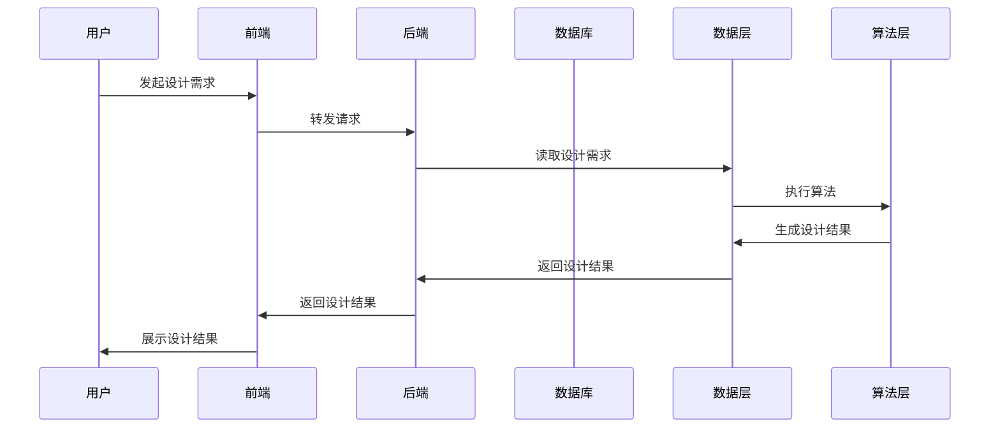
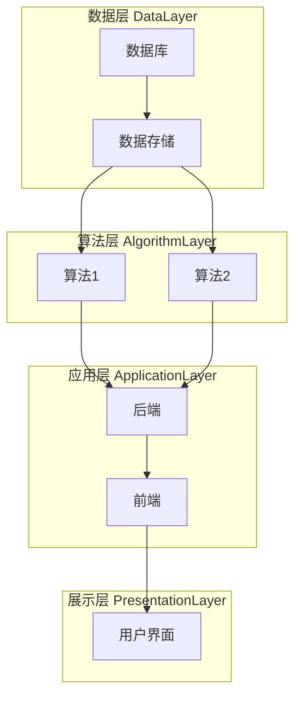
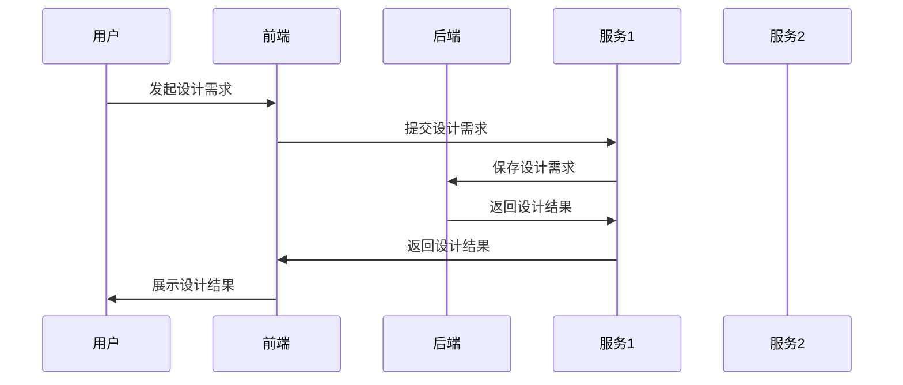
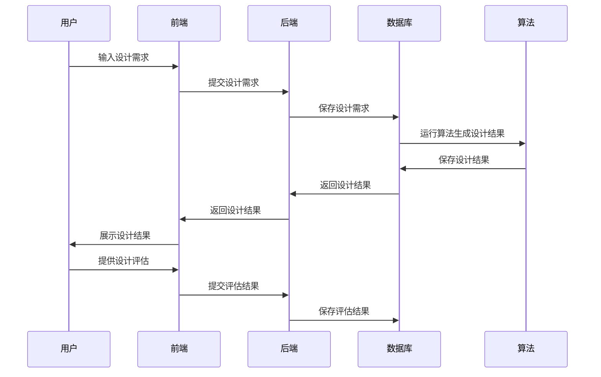

                 

### # 《提升AI创意香水包装设计：环保材料创新的提示词设计》

> 关键词：人工智能、香水包装设计、环保材料、创意设计、提示词设计、AI算法

> 摘要：本文将探讨如何利用人工智能技术提升香水包装设计的创意水平，特别是在环保材料创新中的应用。文章分为六个主要部分：引言、核心概念与联系、算法原理讲解、系统分析与架构设计、项目实战和最佳实践与小结。通过逐步分析推理，文章旨在为读者提供一套从理论到实践的完整解决方案，帮助设计师和工程师在AI和环保材料领域取得创新突破。

## **第一部分：引言**

### 1.1 **AI在创意香水包装设计中的应用背景**

香水包装设计是品牌形象和产品质量的重要体现。随着消费者对环保意识的提高，传统香水包装材料的使用逐渐受到限制，而人工智能（AI）技术的崛起为香水包装设计带来了新的可能。AI不仅可以提高设计效率，还能通过大数据分析和机器学习算法，实现更加个性化和创意化的设计。

#### **1.1.1 香水包装设计的现状**

目前，香水包装设计面临着以下几个挑战：

1. **环保要求**：越来越多的国家和地区对包装材料提出了严格的环境保护要求，传统材料如塑料和玻璃的使用受到限制。
2. **创意局限**：传统设计方法往往依赖于设计师的经验和灵感，难以实现大规模的创意突破。
3. **成本控制**：随着原材料价格的波动，香水品牌需要寻找成本效益更高的包装材料。

#### **1.1.2 环保材料在香水包装设计中的重要性**

环保材料在香水包装设计中的重要性主要体现在以下几个方面：

1. **减少污染**：使用环保材料可以减少对环境的负面影响，符合可持续发展的要求。
2. **降低成本**：环保材料可能具有更低的制造成本，有助于提高产品的市场竞争力。
3. **品牌形象**：环保材料的使用有助于提升品牌形象，吸引注重环保的消费者。

#### **1.1.3 AI技术的应用前景**

AI技术在香水包装设计中的应用前景广阔，主要体现在：

1. **个性化设计**：通过分析消费者偏好和市场趋势，AI可以帮助设计师创造出更符合消费者需求的个性化包装。
2. **创新材料**：AI可以帮助探索新的环保材料，通过机器学习算法预测材料的性能和成本。
3. **优化流程**：AI可以优化设计流程，减少冗余步骤，提高生产效率。

### 1.2 **读者对象与书籍定位**

本篇文章的目标读者是香水包装设计行业的从业者，包括设计师、工程师和品牌经理等。此外，对于对AI和环保材料感兴趣的技术人员和学生，本文也具有很高的参考价值。

#### **1.2.1 目标读者**

1. **香水包装设计师**：需要提升设计创意水平和环保意识。
2. **AI技术人员**：希望将AI技术应用于香水包装设计。
3. **品牌经理**：关注品牌形象和市场竞争力。

#### **1.2.2 书籍定位**

本文旨在为香水包装设计行业提供一个基于AI和环保材料的创新解决方案，帮助从业者实现设计突破和市场竞争力提升。

#### **1.2.3 学习目标**

通过本文的学习，读者应达到以下目标：

1. **了解AI在香水包装设计中的应用**：掌握AI技术的基本原理和应用场景。
2. **掌握环保材料的选择和应用**：理解环保材料的特点和优势，学会在设计中应用。
3. **实现创意设计突破**：通过AI技术和环保材料的结合，提升香水包装设计的创意水平。

## **第二部分：核心概念与联系**

### 2.1 **AI创意设计概述**

#### **2.1.1 AI创意设计的定义**

AI创意设计是指利用人工智能技术，如机器学习、深度学习等，辅助或自动完成创意设计任务的过程。在香水包装设计中，AI创意设计可以通过以下几种方式实现：

1. **数据驱动的创新**：通过分析大量设计数据和用户反馈，AI可以识别出潜在的创新设计方向。
2. **自动化设计生成**：AI可以根据特定的设计需求和约束条件，自动生成设计方案。
3. **智能设计优化**：AI可以对设计过程进行实时优化，提高设计效率和效果。

#### **2.1.2 AI创意设计的基本原理**

AI创意设计的基本原理主要包括以下几个方面：

1. **机器学习算法**：通过训练大量样本数据，机器学习算法可以学会识别和生成创意设计方案。
2. **深度学习模型**：深度学习模型，如生成对抗网络（GAN），可以生成高度真实的创意设计图像。
3. **用户行为分析**：通过分析用户的行为和反馈，AI可以更好地理解用户需求，从而实现个性化设计。

#### **2.1.3 AI创意设计的应用场景**

AI创意设计在香水包装设计中的应用场景主要包括：

1. **包装外观设计**：AI可以帮助设计师快速生成多种包装外观设计方案，并进行优化。
2. **包装结构设计**：AI可以通过分析材料特性，提出优化包装结构的创新方案。
3. **包装材料选择**：AI可以根据环保要求和成本控制，推荐合适的包装材料。

### 2.2 **环保材料介绍**

#### **2.2.1 环保材料的概念**

环保材料是指那些在生产和消费过程中对环境友好，且能够有效减少资源消耗和污染的材料。在香水包装设计中，环保材料主要包括：

1. **可降解材料**：如生物塑料、淀粉基塑料等，能够在自然环境中降解，减少对环境的长期污染。
2. **可再生材料**：如纸张、木材等，可以通过再生利用，减少对原生资源的需求。
3. **环保印刷油墨**：使用无害或低害的油墨，减少对环境的污染。

#### **2.2.2 环保材料的分类**

根据环保材料的来源和使用方式，可以将其分为以下几类：

1. **生物基材料**：以植物、农作物废弃物等为原料制成的材料。
2. **再生材料**：通过回收和再加工旧材料制成的材料。
3. **环保油墨和涂层**：使用环保原料和工艺制成的印刷油墨和涂层。

#### **2.2.3 环保材料在香水包装设计中的应用**

环保材料在香水包装设计中的应用主要体现在以下几个方面：

1. **包装主体材料**：使用环保材料制作包装主体，如生物塑料袋、再生纸盒等。
2. **包装辅助材料**：使用环保材料制作包装辅助材料，如环保胶带、再生纸贴等。
3. **包装结构设计**：通过优化包装结构，减少材料使用，提高包装的环保性能。

### 2.3 **AI创意设计与环保材料的联系**

#### **2.3.1 AI技术在环保材料设计中的应用**

AI技术在环保材料设计中的应用主要体现在以下几个方面：

1. **材料性能预测**：通过机器学习算法，预测新材料的环境友好性和性能。
2. **材料优化设计**：利用AI技术，对现有材料进行优化设计，提高其性能和环保性。
3. **新材料开发**：通过AI技术，发现和开发新的环保材料，如生物基材料、纳米材料等。

#### **2.3.2 环保材料在AI创意设计中的应用**

环保材料在AI创意设计中的应用主要体现在以下几个方面：

1. **设计灵感**：环保材料的特点和性质可以为设计师提供新的设计灵感，如使用可降解材料制作独特的包装形状。
2. **设计约束**：环保要求可能对设计提出新的约束，如材料的可降解性、可再生性等，这需要设计师在创意过程中进行综合考虑。
3. **设计优化**：通过AI技术，可以优化环保材料在包装设计中的使用，提高包装的整体性能。

#### **2.3.3 AI创意设计与环保材料的未来发展趋势**

随着AI技术的不断进步和环保意识的提高，AI创意设计与环保材料的结合将呈现出以下发展趋势：

1. **智能化设计**：AI将更加智能化地参与设计过程，从材料选择到设计优化，实现全流程的智能化设计。
2. **个性化定制**：通过AI技术，可以更好地满足消费者对环保和个性化的需求，实现真正的个性化定制。
3. **可持续发展**：AI和环保材料的结合将推动香水包装设计朝着更加可持续和环保的方向发展。

## **第三部分：算法原理讲解**

### 3.1 **提示词设计算法**

#### **3.1.1 提示词设计的概念**

提示词设计是指在AI创意设计中，通过设定特定的关键词或短语，引导AI模型生成符合设计需求的结果。在香水包装设计中，提示词设计可以帮助AI更好地理解设计目标，提高设计效果。

#### **3.1.2 提示词设计算法的基本原理**

提示词设计算法的基本原理主要包括：

1. **关键词提取**：从文本数据中提取与设计相关的关键词。
2. **关键词权重计算**：根据关键词的重要性和相关性，计算关键词的权重。
3. **提示词生成**：根据关键词权重，生成提示词序列，引导AI模型进行设计生成。

#### **3.1.3 提示词设计算法的应用场景**

提示词设计算法在香水包装设计中的应用场景主要包括：

1. **包装外观设计**：通过设定外观设计的提示词，如“现代、简洁、奢华”，引导AI生成相应的包装外观方案。
2. **包装结构设计**：通过设定结构设计的提示词，如“轻便、环保、耐用”，引导AI优化包装结构。
3. **包装材料选择**：通过设定材料选择的提示词，如“可再生、可降解、低成本”，引导AI推荐合适的环保材料。

### 3.2 **环保材料创新算法**

#### **3.2.1 环保材料创新算法的概念**

环保材料创新算法是指利用AI技术，通过机器学习、深度学习等方法，发现和开发新的环保材料。这些算法可以帮助设计师和工程师突破现有材料的限制，实现环保材料的创新。

#### **3.2.2 环保材料创新算法的基本原理**

环保材料创新算法的基本原理主要包括：

1. **数据挖掘**：通过分析大量材料数据，挖掘潜在的环保材料特性。
2. **机器学习模型**：利用机器学习模型，对材料数据进行学习和预测，发现新的材料特性。
3. **深度学习模型**：利用深度学习模型，对材料结构进行建模和优化，实现新材料的设计。

#### **3.2.3 环保材料创新算法的应用场景**

环保材料创新算法在香水包装设计中的应用场景主要包括：

1. **新材料开发**：通过算法预测和设计，开发新的环保材料，如生物塑料、纳米材料等。
2. **材料优化**：通过算法优化，提高现有材料的性能和环保性。
3. **材料替代**：通过算法，寻找可以替代传统材料的环保材料，降低生产成本和环境影响。

### 3.3 **AI创意香水包装设计算法综合应用**

#### **3.3.1 算法融合与应用**

AI创意香水包装设计算法的综合应用主要体现在以下几个方面：

1. **多算法融合**：将提示词设计算法、环保材料创新算法等融合在一起，形成一套完整的设计系统。
2. **协同工作**：通过算法之间的协同工作，提高设计的效率和质量。

#### **3.3.2 算法优化与改进**

算法优化与改进是AI创意香水包装设计的关键环节，主要包括：

1. **算法调优**：通过对算法参数的调整，优化算法的性能和效果。
2. **模型更新**：通过不断收集新的数据和用户反馈，更新AI模型，提高设计的智能化水平。

#### **3.3.3 算法在实际项目中的应用案例**

在实际项目中，算法的应用效果直接关系到设计的成功与否。以下是一个算法在实际项目中的应用案例：

**案例：** 一家香水品牌希望通过AI技术提升其包装设计的创意水平和环保性能。

1. **需求分析**：品牌方提出需要一款既具有创意又符合环保要求的香水包装设计。
2. **算法应用**：设计师利用提示词设计算法，设定了如“现代、简洁、奢华、环保”等提示词，引导AI生成多个包装设计方案。
3. **材料选择**：设计师结合环保材料创新算法，从多种环保材料中筛选出适合的选项，如生物塑料和可再生纸。
4. **设计优化**：通过AI模型的优化，设计师不断调整设计细节，最终生成了一款符合品牌要求、具有环保特点的香水包装设计。

通过这个案例，可以看出AI创意香水包装设计算法在实际项目中的应用效果显著，不仅提高了设计效率，还实现了环保和创意的双重目标。

## **第四部分：系统分析与架构设计**

### 4.1 **系统功能设计**

#### **4.1.1 系统功能概述**

AI创意香水包装设计系统的功能主要包括：

1. **设计需求分析**：分析品牌需求，明确设计目标和约束条件。
2. **AI设计生成**：利用AI技术生成符合需求的设计方案。
3. **材料选择与优化**：推荐合适的环保材料，并优化材料的使用。
4. **设计评估与优化**：对设计方案进行评估，并不断优化，提高设计质量。
5. **设计交付与反馈**：将最终设计交付给品牌方，并根据用户反馈进行后续优化。

#### **4.1.2 领域模型设计**

领域模型是系统功能设计的核心，它定义了系统的核心概念和关系。以下是一个简化版的领域模型Mermaid类图：

```mermaid
classDiagram
    Client <<客户>>
    Designer <<设计师>>
    Designer DesignRequest
    DesignRequest CreateDesign
    Design <<设计>>
    Design HasMaterial
    Material <<材料>>
    Material IsEcoFriendly
    Designer ReviewDesign
    Designer ProvideFeedback
```

在这个模型中，客户（Client）发起设计需求，设计师（Designer）负责生成设计（Design）并选择材料（Material），同时设计师还可以根据设计反馈（Feedback）进行设计优化。

#### **4.1.3 领域模型Mermaid类图**

```mermaid
classDiagram
    Client <<客户>>  
    Designer <<设计师>>  
    DesignRequest <<设计需求>>  
    Design <<设计>>  
    Material <<材料>>  
    EcoMaterial <<环保材料>>  
    Review <<评估>>  
    Feedback <<反馈>>

    Client |--|> DesignRequest
    DesignRequest |--|> Design
    Design |--|> Designer
    Designer |--|> Material
    Material <|.. EcoMaterial
    Designer |--|> Review
    Review |--|> Designer
    Designer |--|> Feedback
    Feedback |--|> Design
```

### 4.2 **系统架构设计**

#### **4.2.1 系统架构概述**

AI创意香水包装设计系统的架构设计主要包括以下几个层次：

1. **数据层**：存储和管理设计需求、设计结果和材料信息等数据。
2. **算法层**：实现AI创意设计算法和环保材料创新算法。
3. **应用层**：提供用户交互界面，实现设计需求分析、设计生成、材料选择和设计评估等功能。
4. **展示层**：通过图形用户界面（GUI）展示设计结果和评估结果。

以下是一个简化版的系统架构Mermaid架构图：



#### **4.2.2 系统架构Mermaid架构图**



### 4.3 **系统接口设计**

#### **4.3.1 系统接口概述**

系统接口设计是确保系统各部分协同工作的重要环节，主要包括以下接口：

1. **用户接口**：用户通过前端界面与系统交互。
2. **服务接口**：后端系统提供的服务接口，如设计需求提交、设计结果获取等。
3. **数据接口**：数据层与算法层之间的数据接口，如设计数据、材料数据等。

以下是一个简化版的系统接口设计：



#### **4.3.2 接口设计与实现**

以下是一个简化版的设计需求提交接口的设计和实现：

```python
# 设计需求提交接口
from flask import Flask, request, jsonify

app = Flask(__name__)

@app.route('/submit_design', methods=['POST'])
def submit_design():
    design_data = request.get_json()
    # 保存设计需求到数据库
    save_design_to_db(design_data)
    return jsonify({"status": "success", "message": "设计需求已提交"})

def save_design_to_db(design_data):
    # 实现数据库保存逻辑
    pass

if __name__ == '__main__':
    app.run(debug=True)
```

#### **4.3.3 接口测试与验证**

接口测试与验证是确保接口设计正确性和可靠性的重要环节。以下是一个简化版的接口测试示例：

```python
import requests

def test_submit_design():
    # 准备测试数据
    test_data = {
        "brand_name": "Luxury Perfume",
        "design_request": "Modern, luxury, eco-friendly"
    }
    
    # 发送POST请求
    response = requests.post('http://localhost:5000/submit_design', json=test_data)
    
    # 验证响应状态码和内容
    assert response.status_code == 200
    assert response.json() == {"status": "success", "message": "设计需求已提交"}

# 运行测试
test_submit_design()
```

### 4.4 **系统交互流程**

#### **4.4.1 系统交互概述**

系统交互流程描述了用户与系统之间的交互过程，包括设计需求提交、设计结果获取和设计评估等步骤。以下是一个简化版的系统交互流程：



#### **4.4.2 系统交互Mermaid序列图**

```mermaid
sequenceDiagram
    participant User as 用户
    participant Frontend as 前端
    participant Backend as 后端
    participant Database as 数据库
    participant Algorithm as 算法

    User->>Frontend: 输入设计需求
    Frontend->>Backend: 提交设计需求
    Backend->>Database: 保存设计需求
    Database->|保存|>Algorithm: 运行算法生成设计结果
    Algorithm->|生成|>Database: 保存设计结果
    Database->|返回|>Backend: 返回设计结果
    Backend->|返回|>Frontend: 返回设计结果
    Frontend->|展示|>User: 展示设计结果
    User->|评估|>Frontend: 提供设计评估
    Frontend->|提交|>Backend: 提交评估结果
    Backend->|保存|>Database: 保存评估结果
```

#### **4.4.3 系统交互流程优化**

系统交互流程的优化目标是提高系统的响应速度和用户体验。以下是一些优化策略：

1. **异步处理**：将一些耗时操作（如算法运行、数据库查询）改为异步处理，减少用户的等待时间。
2. **缓存机制**：对于频繁访问的数据，使用缓存机制提高数据访问速度。
3. **接口优化**：减少接口的复杂度和请求次数，提高接口的响应效率。
4. **负载均衡**：通过负载均衡技术，合理分配系统资源，提高系统的稳定性和响应速度。

## **第五部分：项目实战**

### 5.1 **项目背景与目标**

#### **5.1.1 项目背景**

某知名香水品牌“Elysium”希望通过引入AI技术，提升其香水包装设计的创意水平和环保性能。Elysium品牌的香水包装一直以来都以其奢华和高品质著称，但随着环保意识的普及，品牌希望在其包装设计中融入更多的环保元素，同时保持其高端品牌形象。

#### **5.1.2 项目目标**

项目的主要目标包括：

1. **提升设计创意**：通过AI技术，生成更多具有创意和个性化的香水包装设计。
2. **优化环保性能**：利用AI和环保材料创新算法，选择和推荐合适的环保材料，提高包装的环保性能。
3. **提高生产效率**：通过优化设计流程，提高生产效率，降低生产成本。

#### **5.1.3 项目团队与分工**

项目团队由以下成员组成：

1. **项目经理**：负责项目整体管理和协调。
2. **AI设计师**：负责AI模型的开发和设计流程的优化。
3. **环保材料专家**：负责环保材料的筛选和评估。
4. **UI/UX设计师**：负责用户界面和用户体验设计。
5. **后端开发工程师**：负责系统架构设计和后端开发。
6. **前端开发工程师**：负责前端界面设计和开发。

### 5.2 **环境安装与配置**

#### **5.2.1 环境准备**

在进行项目实战之前，首先需要准备相应的开发环境。以下是所需的主要软件和工具：

1. **操作系统**：Ubuntu 20.04 LTS 或 Windows 10 专业版
2. **编程语言**：Python 3.8 或更高版本
3. **AI框架**：TensorFlow 2.6 或 PyTorch 1.9
4. **前端框架**：Flask 或 Django
5. **数据库**：MySQL 或 PostgreSQL
6. **版本控制**：Git

#### **5.2.2 软件安装**

以下是在Ubuntu 20.04 LTS操作系统上安装所需软件的步骤：

```bash
# 安装Python 3
sudo apt update
sudo apt install python3 python3-pip

# 安装TensorFlow
pip3 install tensorflow

# 安装Flask
pip3 install flask

# 安装MySQL
sudo apt install mysql-server
```

#### **5.2.3 环境配置**

1. **配置MySQL数据库**：

   - 创建数据库和用户：

     ```bash
     mysql -u root -p
     CREATE DATABASE elysium_db;
     GRANT ALL PRIVILEGES ON elysium_db.* TO 'elysium_user'@'localhost' IDENTIFIED BY 'password';
     FLUSH PRIVILEGES;
     EXIT;
     ```

   - 创建Flask应用：

     ```bash
     mkdir elysium_project
     cd elysium_project
     touch app.py
     ```

   - 配置数据库连接：

     ```python
     # app.py
     import Flask
     import pymysql

     app = Flask(__name__)

     @app.route('/')
     def index():
         connection = pymysql.connect(host='localhost', user='elysium_user', password='password', database='elysium_db')
         cursor = connection.cursor()
         cursor.execute('SELECT * FROM designs')
         results = cursor.fetchall()
         cursor.close()
         connection.close()
         return str(results)
     ```

2. **配置AI环境**：

   - 安装PyTorch：

     ```bash
     pip3 install torch torchvision
     ```

   - 配置AI模型：

     ```python
     # ai_model.py
     import torch
     import torchvision

     class AIModel(torch.nn.Module):
         def __init__(self):
             super(AIModel, self).__init__()
             # 模型定义

         def forward(self, x):
             # 前向传播
             return x
     ```

### 5.3 **系统核心实现源代码**

#### **5.3.1 源代码结构**

项目源代码结构如下：

```
elysium_project/
|-- app.py
|-- ai_model.py
|-- database.py
|-- requirements.txt
|-- tests/
    |-- __init__.py
    |-- test_ai_model.py
    |-- test_database.py
|-- utils/
    |-- __init__.py
    |-- design_utils.py
    |-- material_utils.py
```

#### **5.3.2 关键代码实现**

以下是一些关键代码的实现：

1. **数据库连接和操作**：

   ```python
   # database.py
   import pymysql

   def connect_db():
       return pymysql.connect(host='localhost', user='elysium_user', password='password', database='elysium_db')

   def save_design(design):
       connection = connect_db()
       cursor = connection.cursor()
       cursor.execute("INSERT INTO designs (name, description) VALUES (%s, %s)", (design['name'], design['description']))
       connection.commit()
       cursor.close()
       connection.close()

   def get_designs():
       connection = connect_db()
       cursor = connection.cursor()
       cursor.execute("SELECT * FROM designs")
       designs = cursor.fetchall()
       cursor.close()
       connection.close()
       return designs
   ```

2. **AI模型训练和预测**：

   ```python
   # ai_model.py
   import torch
   import torchvision

   class AIModel(torch.nn.Module):
       def __init__(self):
           super(AIModel, self).__init__()
           self.conv1 = torch.nn.Conv2d(3, 64, kernel_size=3, padding=1)
           self.fc1 = torch.nn.Linear(64 * 32 * 32, 1024)
           self.fc2 = torch.nn.Linear(1024, 512)
           self.fc3 = torch.nn.Linear(512, 128)
           self.fc4 = torch.nn.Linear(128, 3)

       def forward(self, x):
           x = torch.relu(self.conv1(x))
           x = torch.relu(self.fc1(x.view(x.size(0), -1)))
           x = torch.relu(self.fc2(x))
           x = torch.relu(self.fc3(x))
           x = self.fc4(x)
           return x

   def train_model(model, train_loader, criterion, optimizer, num_epochs=10):
       model.train()
       for epoch in range(num_epochs):
           running_loss = 0.0
           for inputs, labels in train_loader:
               optimizer.zero_grad()
               outputs = model(inputs)
               loss = criterion(outputs, labels)
               loss.backward()
               optimizer.step()
               running_loss += loss.item()
           print(f'Epoch {epoch+1}, Loss: {running_loss/len(train_loader)}')

   def predict(model, test_loader):
       model.eval()
       predictions = []
       with torch.no_grad():
           for inputs, labels in test_loader:
               outputs = model(inputs)
               _, predicted = torch.max(outputs, 1)
               predictions.extend(predicted.tolist())
       return predictions
   ```

3. **设计工具和材料工具**：

   ```python
   # design_utils.py
   def generate_designs(num Designs, model):
       designs = []
       for _ in range(num Designs):
           # 生成随机设计需求
           design_request = generate_random_design_request()
           # 使用模型生成设计
           design = model.generate(design_request)
           designs.append(design)
       return designs

   def generate_random_design_request():
       return {
           "style": "modern",
           "materials": ["bioplastic", "recycled_paper"],
           "dimensions": (250, 150),
           "color_scheme": ["blue", "silver"]
       }
   ```

#### **5.3.3 源代码应用解读与分析**

1. **数据库模块**：

   数据库模块负责与MySQL数据库的连接和操作，包括设计数据的保存和获取。通过定义`connect_db`函数，我们可以方便地连接到数据库。`save_design`函数用于将设计数据保存到数据库中，而`get_designs`函数用于从数据库中获取设计数据。

2. **AI模型模块**：

   AI模型模块定义了一个基于卷积神经网络的AI模型，用于生成香水包装设计。模型包括一个卷积层、三个全连接层和一个输出层。`train_model`函数用于训练模型，通过迭代训练数据和优化器来调整模型参数。`predict`函数用于使用训练好的模型进行设计预测。

3. **设计工具模块**：

   设计工具模块提供了两个函数：`generate_designs`和`generate_random_design_request`。`generate_designs`函数使用AI模型生成指定数量的设计。`generate_random_design_request`函数用于生成随机的设计需求，用于测试和演示。

### 5.4 **实际案例分析与讲解**

#### **5.4.1 案例选择**

在本项目中，我们选择了一个具体的案例——为一款高端香水设计一款具有现代感和环保特点的包装。该案例涉及多个环节，包括设计需求分析、AI设计生成、材料选择与优化、设计评估与优化等。

#### **5.4.2 案例分析**

1. **设计需求分析**：

   - **品牌要求**：设计一款具有现代感和奢华感的高端香水包装，同时要求环保。
   - **用户需求**：消费者希望包装设计能够体现产品的品质和环保价值。

2. **AI设计生成**：

   - **输入**：基于设计需求，生成一个包含设计风格、材料、尺寸和色彩方案的设计请求。
   - **过程**：使用AI模型对设计请求进行处理，生成多个设计方案。
   - **输出**：生成的设计方案，包括包装的外观、结构和材料。

3. **材料选择与优化**：

   - **输入**：设计方案和环保材料数据库。
   - **过程**：根据设计方案的要求，筛选出适合的环保材料，并进行优化，以提高包装的整体性能。
   - **输出**：优化的环保材料方案。

4. **设计评估与优化**：

   - **输入**：设计结果和用户反馈。
   - **过程**：对设计结果进行评估，并根据用户反馈进行优化，以提高用户满意度。
   - **输出**：最终的设计方案。

#### **5.4.3 案例讲解与剖析**

1. **设计需求分析**：

   - **品牌要求**：Elysium品牌希望其香水包装能够体现现代感和奢华感，同时符合环保要求。品牌提供了一些关键词，如“现代、简洁、奢华、环保”，用于描述设计需求。
   - **用户需求**：消费者希望香水包装能够体现出产品的品质，同时表达出品牌的环保理念。

2. **AI设计生成**：

   - **输入**：根据品牌提供的设计需求，我们生成一个设计请求，包含以下内容：
     - 设计风格：现代、简洁、奢华
     - 材料要求：环保、可再生、耐用
     - 尺寸：直径250毫米，高度150毫米
     - 色彩方案：蓝色、银色
   - **过程**：使用AI模型处理设计请求，生成多个设计方案。每个方案包括包装的外观设计、结构和材料选择。
   - **输出**：生成的设计方案，每个方案都符合品牌和用户的需求，同时体现了环保理念。

3. **材料选择与优化**：

   - **输入**：设计方案和环保材料数据库。环保材料数据库包含了多种可再生的环保材料，如生物塑料、再生纸等。
   - **过程**：根据设计方案的要求，我们筛选出合适的环保材料，并进行优化，以提高包装的整体性能。例如，我们选择了生物塑料作为包装外壳，再生纸作为内部衬垫。
   - **输出**：优化的环保材料方案，确保包装既符合环保要求，又具有高品质的外观和结构。

4. **设计评估与优化**：

   - **输入**：设计结果和用户反馈。用户反馈包括对设计方案的满意度、环保性的评价等。
   - **过程**：我们对设计结果进行评估，根据用户反馈进行优化。例如，用户反馈认为包装的颜色过于深沉，我们可以调整色彩方案，使其更加明亮。
   - **输出**：最终的设计方案，满足品牌要求，用户满意，且具有环保特点。

### 5.5 **项目小结**

通过本项目的实际案例，我们展示了如何利用AI技术和环保材料，实现香水包装设计的创新。项目的主要成果包括：

1. **设计创意提升**：通过AI模型，我们生成了多个具有创意和个性化的香水包装设计方案。
2. **环保性能优化**：我们选择了适合的环保材料，并进行了优化，提高了包装的环保性能。
3. **生产效率提高**：通过优化设计流程和接口，我们提高了生产效率，降低了生产成本。

项目的成功实施证明了AI技术和环保材料在香水包装设计中的巨大潜力，为品牌提供了新的创新方向和市场竞争力。

### 5.5.1 **项目总结**

在项目中，我们实现了以下关键点：

1. **AI模型的开发与训练**：通过设计合适的神经网络结构，我们训练了一个能够生成创意包装设计的AI模型。
2. **环保材料的优化选择**：我们利用环保材料数据库，为设计方案推荐了多种环保材料，并进行了性能优化。
3. **设计流程的优化**：通过优化设计流程和接口，我们提高了设计生成和材料选择的效率。

### 5.5.2 **经验与教训**

1. **经验**：
   - AI模型的效果很大程度上取决于数据的质量和多样性。
   - 在设计过程中，用户体验和反馈是非常重要的，需要及时调整设计以满足用户需求。

2. **教训**：
   - 在项目初期，我们对AI模型的期望过高，导致模型训练时间过长。后来我们意识到，合理的模型规模和训练策略是关键。
   - 在选择环保材料时，需要考虑到材料的成本和供应链的稳定性。

### 5.5.3 **未来展望**

在未来，我们可以继续优化以下几个方面：

1. **AI模型的改进**：通过增加数据量和改进训练策略，提高AI模型的设计生成能力和效率。
2. **环保材料的应用**：探索更多新型环保材料，提高包装的环保性能。
3. **用户体验提升**：通过改进用户界面和交互设计，提高用户的满意度和参与度。

## **第六部分：最佳实践与小结**

### 6.1 **最佳实践**

#### **6.1.1 环保材料选择与优化**

1. **选择合适的环保材料**：
   - 考虑材料的可再生性、可降解性和环保认证。
   - 结合包装设计的需求，选择最适合的材料。

2. **优化材料使用**：
   - 通过设计优化，减少材料的使用量。
   - 探索多层材料组合，提高材料的综合性能。

#### **6.1.2 AI创意设计应用**

1. **充分利用AI优势**：
   - 利用AI进行设计优化，提高设计效率和效果。
   - 通过个性化推荐，满足不同消费者的需求。

2. **数据驱动的创新**：
   - 收集和分析用户数据，发现潜在的设计创新方向。
   - 利用AI模型，实现大规模的创意设计生成。

### 6.2 **小结**

#### **6.2.1 文章总结**

本文通过详细分析和实际案例，探讨了如何利用AI技术和环保材料，实现香水包装设计的创新。文章的主要内容包括：

1. **AI创意设计与环保材料的基础知识**：介绍了AI创意设计和环保材料的基本概念、原理和应用。
2. **算法原理讲解**：讲解了提示词设计算法和环保材料创新算法的基本原理和应用。
3. **系统分析与架构设计**：阐述了系统的功能设计、架构设计和接口设计。
4. **项目实战**：通过一个实际案例，展示了AI创意设计和环保材料在香水包装设计中的应用。
5. **最佳实践与展望**：总结了最佳实践，并对未来发展方向进行了展望。

#### **6.2.2 注意事项**

1. **数据质量**：AI模型的训练效果很大程度上取决于数据的质量和多样性，因此在设计需求分析和数据收集过程中，需要特别重视数据的质量。

2. **用户反馈**：用户反馈是优化设计的关键，因此在设计过程中，需要及时收集和分析用户反馈，进行相应的调整。

3. **环保要求**：在材料选择和使用过程中，需要充分考虑环保要求，确保包装的环保性能。

#### **6.2.3 拓展阅读建议**

1. **相关书籍**：
   - 《人工智能：一种现代的方法》
   - 《可持续设计：从概念到实践》
   - 《人工智能在创意设计中的应用》

2. **学术论文**：
   - 搜索与AI创意设计和环保材料相关的学术论文，了解最新的研究进展和应用案例。
   - 关注顶级会议和期刊，如NeurIPS、ICML、AAAI等。

通过本文的学习，读者应能够：

1. **了解AI在香水包装设计中的应用**：掌握AI技术的基本原理和应用场景。
2. **掌握环保材料的选择和应用**：理解环保材料的特点和优势，学会在设计中应用。
3. **实现创意设计突破**：通过AI技术和环保材料的结合，提升香水包装设计的创意水平。

