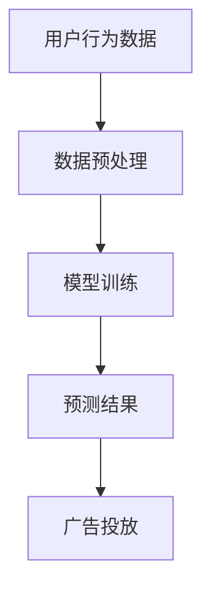
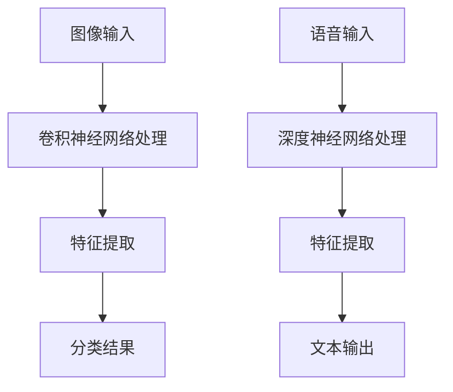
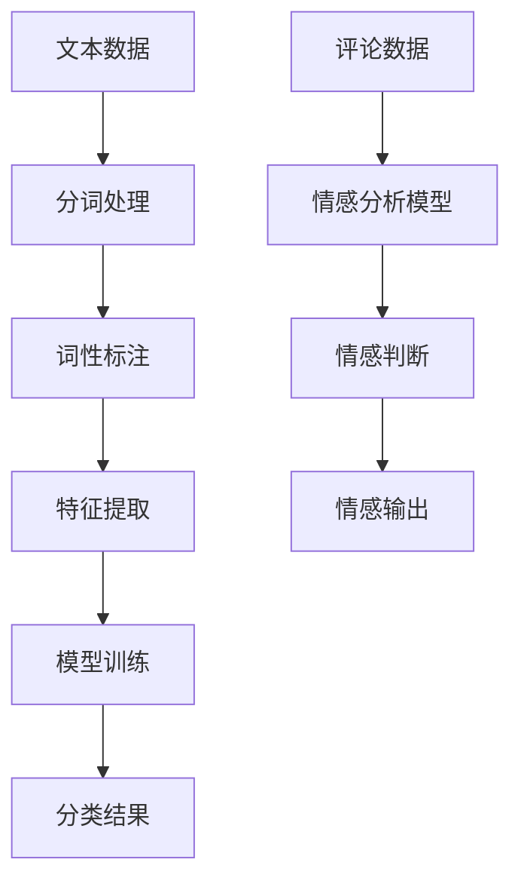
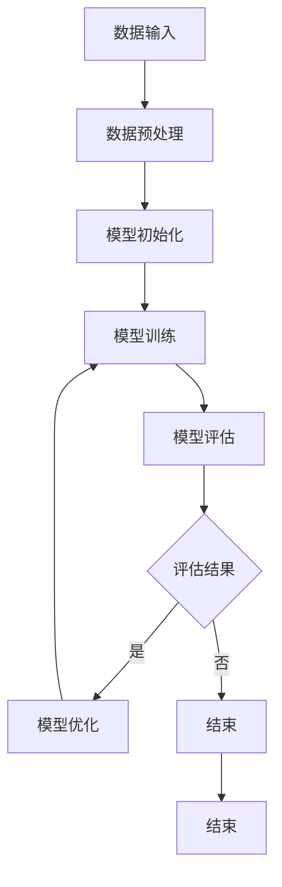
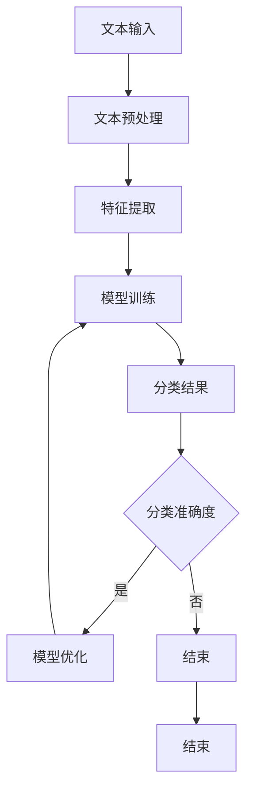
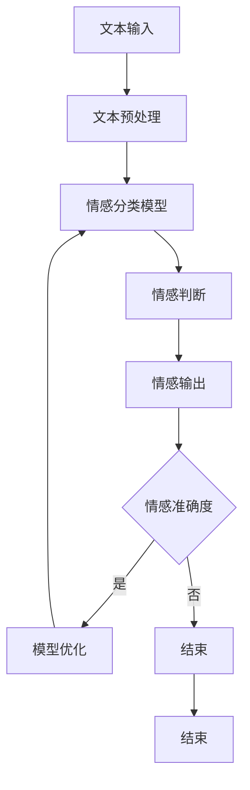
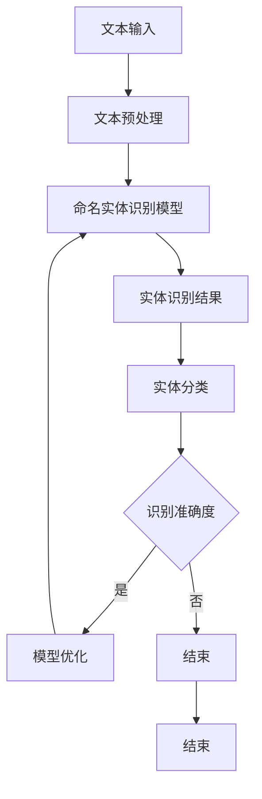
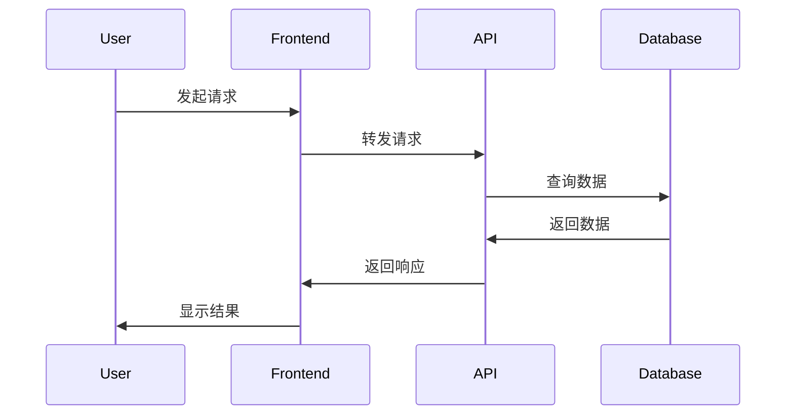
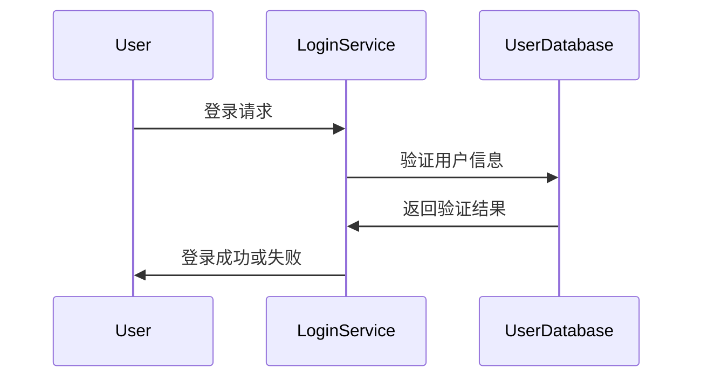

                 

### 3.3 机器学习与深度学习应用

#### 3.3.1 机器学习应用

**推荐系统**：介绍机器学习在推荐系统中的应用，如何根据用户行为数据预测用户偏好。

**广告投放优化**：讨论如何通过机器学习优化广告投放，提高广告投放效果。

**Mermaid流程图**：



#### 3.3.2 深度学习应用

**图像识别**：讲解深度学习在图像识别中的应用，如何通过卷积神经网络实现图像分类和识别。

**语音识别**：探讨深度学习在语音识别中的应用，如何将语音信号转换为文本。

**Mermaid流程图**：



### 3.4 自然语言处理应用

**文本分类**：介绍自然语言处理在文本分类中的应用，如何使用机器学习算法对文本进行分类。

**情感分析**：讨论如何通过自然语言处理技术进行情感分析，判断用户对品牌的情感倾向。

**Mermaid流程图**：



## 第4章 跨平台整合策略设计

### 4.1 社交媒体营销策略

**平台选择**：分析不同社交媒体平台的特点，选择合适的平台进行品牌推广。

**内容策略**：探讨如何制定具有创意性的内容策略，吸引目标用户。

**互动策略**：讨论如何通过用户互动提升品牌影响力。

### 4.2 内容营销策略

**创意策划**：介绍如何进行创意策划，打造吸引消费者的内容。

**内容传播**：讨论如何通过多种渠道传播内容，提高品牌知名度。

**效果评估**：探讨如何评估内容营销的效果，不断优化营销策略。

### 4.3 用户互动与体验设计

**用户画像**：介绍如何通过数据挖掘技术构建用户画像，实现精准营销。

**用户体验**：探讨如何设计良好的用户体验，提升用户满意度。

**用户互动**：讨论如何通过互动设计提升用户参与度。

## 第5章 系统设计与实现

### 5.1 系统场景与功能

**系统场景**：介绍AI创意香水品牌营销系统的应用场景，包括用户需求、业务流程等。

**系统功能**：阐述系统的核心功能模块，如用户管理、商品管理、营销活动管理、数据分析等。

### 5.2 架构设计

**系统架构**：描述系统的整体架构，包括前端、后端、数据库等组成部分。

**技术选型**：介绍系统采用的技术栈，如前端框架、后端框架、数据库等。

### 5.3 系统接口设计与交互

**接口设计**：详细描述系统的接口设计，包括API接口的定义、参数设计等。

**交互设计**：介绍系统的交互流程，包括用户操作流程、系统响应等。

## 第6章 项目实战

### 6.1 环境安装

**环境准备**：介绍系统所需的环境准备，包括硬件、软件和配置等。

**安装步骤**：详细描述系统安装的步骤，包括依赖安装、环境配置等。

### 6.2 核心实现

**功能实现**：阐述系统的核心功能实现，包括用户管理、商品管理、营销活动管理等。

**代码解析**：对关键代码进行解析，解释代码的功能和实现原理。

### 6.3 案例分析

**案例分析**：介绍一个实际案例，详细分析案例中的实现细节和优化策略。

**效果评估**：评估案例实施后的效果，包括营销效果、用户满意度等。

### 6.4 项目小结

**项目总结**：总结项目实施过程中的经验教训，反思项目中的不足和改进方向。

**未来展望**：展望项目的未来发展，讨论可能的优化方向和应用场景。

## 第7章 最佳实践与拓展

### 7.1 最佳实践 tips

**营销策略**：分享一些实用的营销策略，帮助品牌提升营销效果。

**技术优化**：介绍一些技术优化技巧，提升系统性能和用户体验。

### 7.2 小结

**文章核心内容回顾**：回顾文章的核心内容，总结关键知识点。

### 7.3 注意事项

**注意事项**：提醒读者在实施AI创意香水品牌营销时需要注意的事项。

### 7.4 拓展阅读

**相关资源**：推荐一些相关的书籍、文章、课程等，供读者进一步学习。

---

# 提升AI创意香水品牌营销：跨平台整合策略的提示词设计

## 关键词

- AI技术
- 创意香水品牌
- 跨平台整合策略
- 提示词设计
- 数据挖掘
- 自然语言处理
- 深度学习
- 社交媒体营销
- 内容营销
- 用户互动
- 系统架构设计

## 摘要

本文旨在探讨如何利用AI技术提升创意香水品牌的营销效果，通过跨平台整合策略和提示词设计实现精准营销。文章首先介绍了问题背景和核心概念，随后详细讲解了机器学习、深度学习和自然语言处理在AI创意香水品牌营销中的应用。接着，文章提出了跨平台整合策略，包括社交媒体营销、内容营销和用户互动与体验设计。随后，文章介绍了系统设计与实现，包括系统场景与功能、架构设计、接口设计与交互。最后，文章通过实际案例分析了项目实施的效果，并给出了最佳实践和拓展阅读建议。本文旨在为香水品牌提供一套完整的AI创意营销解决方案。

---

# 1. 背景介绍

## 1.1 问题背景

### AI与创意香水品牌营销的结合

随着人工智能（AI）技术的快速发展，其在各个领域的应用越来越广泛。特别是在创意产业，如香水品牌营销中，AI技术的引入为品牌提供了新的发展机遇。创意香水品牌作为一个高度依赖创意和个性化体验的行业，如何充分利用AI技术，提升营销效果，成为一个亟待解决的问题。

### 跨平台整合策略的重要性

在多元化的营销环境中，单一的营销渠道已无法满足品牌的需求。跨平台整合策略通过在多个平台上进行营销活动，实现内容、渠道和用户互动的整合，从而提高营销效果。对于创意香水品牌来说，跨平台整合策略能够更有效地触达目标消费者，提升品牌影响力。

### 解决必要性与紧迫性

AI技术的快速迭代和应用场景的不断扩大，使得品牌营销策略亟需创新和优化。如何运用AI技术实现跨平台整合营销，提高品牌营销效果，成为当前迫切需要解决的问题。此外，消费者对品牌的期望越来越高，他们希望获得个性化的体验和优质的互动。因此，品牌需要通过AI技术提供更加精准和贴心的营销服务。

## 1.2 定义与边界

### AI创意香水品牌营销

AI创意香水品牌营销是指利用人工智能技术，通过数据分析和智能算法，辅助香水品牌进行创意策划、内容制作、用户互动和效果评估等营销活动。具体来说，AI技术可以应用于以下几个方面：

1. **用户画像分析**：通过用户数据挖掘和分析，构建精准的用户画像，了解消费者的需求和行为习惯。
2. **创意内容生成**：利用自然语言处理和生成对抗网络（GAN）等技术，生成具有创意性的广告文案和宣传素材。
3. **个性化推荐**：基于用户的喜好和行为，为用户推荐个性化的香水产品。
4. **效果评估**：通过数据分析和机器学习算法，评估营销活动的效果，优化营销策略。

### 跨平台整合策略

跨平台整合策略是指在不同平台上进行营销活动，通过内容、渠道和用户互动的整合，提高营销效果。对于创意香水品牌来说，跨平台整合策略包括以下几个方面：

1. **社交媒体营销**：在社交媒体平台上进行品牌推广和用户互动，如Instagram、Facebook、微博等。
2. **内容营销**：通过博客、视频、图文等形式，在多个平台上传播品牌故事和产品信息。
3. **用户互动**：通过线上活动和互动，如问答、投票、抽奖等，提高用户参与度和品牌忠诚度。
4. **渠道整合**：将线上线下渠道整合，实现无缝购物体验。

### 边界与外延

在探讨AI创意香水品牌营销和跨平台整合策略时，需要明确其适用范围和边界。AI创意香水品牌营销主要适用于创意性和个性化要求较高的香水品牌，特别是那些希望提升营销效果和品牌影响力的品牌。跨平台整合策略则适用于那些在多个平台上进行营销活动的品牌，尤其是那些具有多元化用户群体的品牌。

此外，AI创意香水品牌营销和跨平台整合策略还需要考虑以下几个方面：

1. **数据隐私与安全**：在收集和使用用户数据时，必须遵守相关法律法规，确保用户隐私和数据安全。
2. **技术选型**：根据品牌特点和需求，选择合适的技术栈和工具，如机器学习框架、大数据平台等。
3. **营销策略**：结合品牌特点和目标用户，制定具有创意性和差异化的营销策略。

通过明确核心概念、定义和边界，有助于更好地理解AI创意香水品牌营销和跨平台整合策略，为后续内容提供基础。

## 2. 核心概念与联系

### 2.1 AI技术核心概念

在AI创意香水品牌营销中，核心概念包括机器学习、深度学习和自然语言处理。这些技术为品牌提供了数据分析和智能算法的工具，从而实现精准营销和个性化推荐。

#### 2.1.1 机器学习

机器学习是一种通过数据训练模型，使模型能够进行预测和决策的技术。在创意香水品牌营销中，机器学习可以应用于以下几个方面：

1. **用户画像分析**：通过分析用户行为数据，构建用户画像，了解消费者需求和偏好。
2. **广告投放优化**：利用机器学习算法，根据用户行为数据，优化广告投放策略，提高广告效果。
3. **个性化推荐**：基于用户历史行为和偏好，为用户推荐符合其兴趣的香水产品。

#### 2.1.2 深度学习

深度学习是机器学习的一种重要分支，它通过构建多层神经网络，实现对复杂数据的处理和分析。在创意香水品牌营销中，深度学习可以应用于以下几个方面：

1. **图像识别**：通过卷积神经网络（CNN）识别和分类香水产品的图片，帮助品牌优化产品展示。
2. **语音识别**：通过深度神经网络处理语音信号，将语音转换为文本，为用户提供语音搜索和交互功能。
3. **文本分类和情感分析**：通过循环神经网络（RNN）和长短期记忆网络（LSTM），对用户评论和反馈进行分类和情感分析，帮助品牌了解用户需求和情感倾向。

#### 2.1.3 自然语言处理

自然语言处理（NLP）是计算机科学和人工智能领域的一个分支，它关注于让计算机理解和处理人类语言。在创意香水品牌营销中，自然语言处理可以应用于以下几个方面：

1. **文本生成**：通过生成对抗网络（GAN）和自动写作算法，自动生成吸引人的广告文案和宣传素材。
2. **语音助手**：通过语音识别和自然语言理解，为用户提供语音搜索和问答服务，提升用户体验。
3. **情感分析**：通过情感分析算法，对用户评论和反馈进行情感识别，帮助品牌了解用户情感和需求。

### 2.2 跨平台整合策略核心概念

跨平台整合策略是创意香水品牌营销中的一项重要策略，它通过在不同平台上进行营销活动，实现内容、渠道和用户互动的整合，从而提高营销效果。

#### 2.2.1 社交媒体营销

社交媒体营销是通过在社交媒体平台上进行品牌推广和用户互动，提高品牌知名度和用户参与度。在创意香水品牌营销中，社交媒体营销可以应用于以下几个方面：

1. **品牌推广**：通过在社交媒体平台上发布广告和推广活动，吸引目标用户关注。
2. **用户互动**：通过社交媒体平台的评论、点赞和分享功能，与用户进行互动，提升用户参与度。
3. **口碑营销**：通过用户在社交媒体平台上的评论和分享，形成良好的口碑效应，提高品牌信誉。

#### 2.2.2 内容营销

内容营销是通过创建和传播有价值的内容，吸引目标用户，提高品牌知名度和忠诚度。在创意香水品牌营销中，内容营销可以应用于以下几个方面：

1. **品牌故事**：通过讲述品牌故事，传达品牌理念和价值，提升品牌形象。
2. **产品介绍**：通过图文、视频等形式，详细介绍香水产品，帮助用户了解产品特点。
3. **用户互动**：通过博客、社交媒体、线上活动等形式，与用户进行互动，增强用户参与度。

#### 2.2.3 用户互动与体验

用户互动与体验是通过设计良好的用户互动和体验，提升用户满意度和忠诚度。在创意香水品牌营销中，用户互动与体验可以应用于以下几个方面：

1. **用户画像**：通过用户数据挖掘和分析，构建精准的用户画像，为用户提供个性化服务。
2. **互动设计**：通过线上活动、问答、投票等形式，与用户进行互动，提升用户参与度。
3. **用户体验**：通过优化网站和APP的用户界面和交互设计，提升用户体验。

### 2.3 核心概念属性特征对比表格

为了更好地理解AI技术核心概念和跨平台整合策略核心概念，下面是一个属性特征对比表格。

| 核心概念 | 定义 | 属性特征 |
| --- | --- | --- |
| 机器学习 | 通过数据训练模型，实现预测和决策的技术 | 数据驱动、模型训练、预测能力 |
| 深度学习 | 通过多层神经网络，处理复杂数据的技术 | 神经网络、多层结构、自动化学习 |
| 自然语言处理 | 让计算机理解和处理人类语言的技术 | 语言模型、语义理解、语音识别 |
| 社交媒体营销 | 在社交媒体平台上进行品牌推广和用户互动 | 平台多样化、用户互动、口碑效应 |
| 内容营销 | 通过创建和传播有价值的内容，提高品牌知名度和忠诚度 | 内容创造、传播渠道、用户参与 |
| 用户互动与体验 | 通过设计良好的用户互动和体验，提升用户满意度和忠诚度 | 用户画像、互动设计、用户体验 |

### 2.4 ER实体关系图

为了更好地理解系统中的实体关系，下面是一个ER实体关系图。

```mermaid
erDiagram
    User ||--|{ Product }|>
    Product ||--|{ Sale }|>
    Sale ||--|{ Promotion }|>
```

在这个ER实体关系图中，User（用户）与Product（产品）之间是一对多的关系，一个用户可以购买多个产品；Product（产品）与Sale（销售）之间也是一对多的关系，一个产品可以有多个销售记录；Sale（销售）与Promotion（促销）之间是一对一的关系，每个销售记录对应一个促销活动。

通过核心概念与联系的分析，我们可以更深入地理解AI创意香水品牌营销和跨平台整合策略，为后续内容提供基础。

## 3. 算法原理讲解

### 3.1 机器学习与深度学习原理

#### 3.1.1 机器学习原理

机器学习（Machine Learning，ML）是一种通过算法和统计模型，从数据中自动学习并作出预测或决策的技术。它主要包括以下几个核心概念：

1. **监督学习（Supervised Learning）**：在监督学习场景中，我们有一系列已标记的数据（输入和输出对），模型通过学习这些数据来预测新的数据。常见的监督学习算法包括线性回归、决策树、随机森林和支持向量机（SVM）等。

2. **无监督学习（Unsupervised Learning）**：在无监督学习场景中，我们只有输入数据，没有对应的输出标签。模型需要从数据中自动发现数据之间的结构或模式。常见的无监督学习算法包括聚类（如K-Means聚类）、降维（如PCA）和关联规则学习（如Apriori算法）等。

3. **强化学习（Reinforcement Learning）**：强化学习是一种通过与环境互动来学习最优行为策略的机器学习方法。模型会根据当前状态和采取的动作获得奖励或惩罚，从而不断优化策略。常见的强化学习算法包括Q学习、SARSA和深度确定性策略梯度（DDPG）等。

#### 3.1.2 深度学习原理

深度学习（Deep Learning，DL）是机器学习的一个分支，它使用具有多个隐藏层的神经网络（称为深度神经网络）来学习数据的高级特征表示。深度学习的关键概念包括：

1. **神经网络（Neural Network，NN）**：神经网络是一种模仿生物神经元连接方式的计算模型，通过一系列的权重（权重是输入数据与神经元之间的乘积）和激活函数（用于确定神经元是否被激活）进行信息传递和处理。

2. **多层感知器（Multilayer Perceptron，MLP）**：多层感知器是一种前馈神经网络，它包含输入层、一个或多个隐藏层和输出层。每个隐藏层由多个神经元组成，神经元之间通过权重连接。

3. **卷积神经网络（Convolutional Neural Network，CNN）**：卷积神经网络是专为处理图像数据而设计的一种深度学习模型，它通过卷积操作提取图像中的局部特征，并通过池化操作减少数据维度。CNN在图像分类、目标检测和图像生成等领域有广泛应用。

4. **循环神经网络（Recurrent Neural Network，RNN）**：循环神经网络是一种能够处理序列数据的神经网络，其特点是能够记住之前的信息。RNN在自然语言处理、时间序列分析和语音识别等领域有广泛应用。

5. **长短期记忆网络（Long Short-Term Memory，LSTM）**：长短期记忆网络是RNN的一种改进，它通过引入门控机制（如输入门、遗忘门和输出门）来避免梯度消失和梯度爆炸问题，更好地处理长序列依赖。

#### 3.1.3 Mermaid流程图

为了更好地理解机器学习与深度学习的原理，我们可以使用Mermaid绘制流程图。以下是一个简单的监督学习流程图：



在这个流程图中，我们首先输入数据，然后进行数据预处理，接着初始化模型，通过模型训练来学习数据，并对模型进行评估。如果评估结果不理想，我们通过模型优化来进一步提升模型性能，否则结束流程。

### 3.2 自然语言处理应用

自然语言处理（Natural Language Processing，NLP）是计算机科学和人工智能领域的一个分支，它旨在使计算机能够理解和处理人类语言。NLP在创意香水品牌营销中有着广泛的应用，包括文本分类、情感分析和命名实体识别等。

#### 3.2.1 文本分类

文本分类是将文本数据按照特定的类别进行分类的过程。在创意香水品牌营销中，文本分类可以用于：

1. **用户评论分类**：将用户对香水产品的评论分类为正面评论或负面评论，帮助品牌了解用户反馈。
2. **新闻分类**：对新闻或博客文章进行分类，以便用户能够快速找到感兴趣的内容。

一个简单的文本分类流程图如下：



在这个流程图中，我们首先输入文本数据，然后进行文本预处理，接着提取文本特征，使用已训练好的分类模型对文本进行分类，并评估分类准确度。如果分类准确度不理想，我们通过模型优化来进一步提升分类性能，否则结束流程。

#### 3.2.2 情感分析

情感分析（Sentiment Analysis）是一种判断文本表达情感倾向的技术，它通常用于分析用户对品牌、产品或服务的情感态度。在创意香水品牌营销中，情感分析可以用于：

1. **用户评论情感分析**：分析用户对香水产品的评论，了解用户对品牌的情感倾向。
2. **社交媒体情感分析**：分析社交媒体平台上的用户评论和讨论，了解品牌在公众中的情感形象。

一个简单的情感分析流程图如下：



在这个流程图中，我们首先输入文本数据，然后进行文本预处理，使用情感分类模型对文本进行情感判断，并将情感输出。接着，我们评估情感分析的准确度。如果准确度不理想，我们通过模型优化来进一步提升情感分析性能，否则结束流程。

#### 3.2.3 命名实体识别

命名实体识别（Named Entity Recognition，NER）是一种从文本中识别出具有特定意义的实体（如人名、地名、组织名等）的技术。在创意香水品牌营销中，NER可以用于：

1. **用户评论命名实体识别**：识别用户评论中提到的品牌、产品、人名等，以便进行情感分析和用户画像构建。
2. **新闻命名实体识别**：识别新闻报道中提到的品牌、产品、事件等，以便进行品牌监控和舆情分析。

一个简单的命名实体识别流程图如下：



在这个流程图中，我们首先输入文本数据，然后进行文本预处理，使用命名实体识别模型对文本进行实体识别，并将识别结果进行分类。接着，我们评估命名实体识别的准确度。如果准确度不理想，我们通过模型优化来进一步提升命名实体识别性能，否则结束流程。

通过以上对机器学习、深度学习和自然语言处理原理的讲解，我们可以更好地理解这些技术在创意香水品牌营销中的应用，为实际项目实施提供理论基础。

### 3.3 机器学习与深度学习应用

#### 3.3.1 机器学习应用

**推荐系统**

在创意香水品牌营销中，推荐系统是一个重要的应用。推荐系统通过分析用户的历史行为和偏好，为用户推荐可能感兴趣的产品。以下是推荐系统的一个简单实现：

**1. 数据收集**：收集用户的历史购买记录和浏览数据。

**2. 数据预处理**：对收集到的数据进行清洗和预处理，包括去除缺失值、异常值和重复值。

**3. 特征工程**：提取用户和产品的特征，如用户年龄、性别、购买历史、浏览记录等。

**4. 模型选择**：选择合适的推荐算法，如基于协同过滤的矩阵分解算法（MF）或基于内容的推荐算法。

**5. 模型训练**：使用训练数据对推荐模型进行训练。

**6. 模型评估**：使用验证集对模型进行评估，调整模型参数。

**7. 推荐结果**：将训练好的模型应用于新用户，生成推荐结果。

以下是一个简单的基于矩阵分解的推荐系统的Python代码示例：

```python
import numpy as np
from sklearn.metrics.pairwise import cosine_similarity

# 假设用户-物品评分矩阵为：
user_item_matrix = np.array([[5, 3, 0, 1],
                             [3, 0, 4, 2],
                             [0, 2, 1, 3]])

# 计算用户之间的相似度
user_similarity = cosine_similarity(user_item_matrix)

# 根据相似度矩阵生成推荐列表
def generate_recommendations(user_index, similarity_matrix, user_ratings, k=2):
    # 计算用户与邻居的相似度
    neighbors = similarity_matrix[user_index].argsort()[1:k+1]
    # 计算邻居的评分均值
    ratings = user_ratings[neighbors]
    return np.mean(ratings)

# 用户1的推荐列表
recommendations = generate_recommendations(0, user_similarity, user_item_matrix[0])
print("User 1 Recommendations:", recommendations)
```

**广告投放优化**

在创意香水品牌营销中，广告投放优化也是一个关键应用。通过机器学习算法，可以根据用户行为和偏好，优化广告投放策略，提高广告点击率和转化率。以下是一个简单的广告投放优化流程：

**1. 数据收集**：收集用户的历史点击记录、浏览记录和转化数据。

**2. 数据预处理**：对收集到的数据进行清洗和预处理。

**3. 特征工程**：提取用户和广告的特征，如用户年龄、性别、历史点击行为、广告类型等。

**4. 模型选择**：选择合适的广告投放优化算法，如基于点击率预测的在线学习算法。

**5. 模型训练**：使用训练数据对优化模型进行训练。

**6. 模型评估**：使用验证集对模型进行评估，调整模型参数。

**7. 广告投放**：根据优化模型，对广告投放进行优化。

以下是一个简单的基于在线学习的广告投放优化Python代码示例：

```python
import numpy as np

# 假设用户历史点击数据为：
user_clicks = np.array([1, 0, 1, 1, 0, 1])

# 初始化广告投放概率
ad_probabilities = np.array([0.5, 0.5])

# 调整广告投放概率
def update_probabilities(click, ad_index, ad_probabilities):
    ad_probabilities[ad_index] = (ad_probabilities[ad_index] * (1 - click)) + (0.5 * click)
    return ad_probabilities

# 用户点击广告1，更新广告投放概率
ad_probabilities = update_probabilities(1, 0, ad_probabilities)
print("Updated Ad Probabilities:", ad_probabilities)

# 用户未点击广告1，更新广告投放概率
ad_probabilities = update_probabilities(0, 0, ad_probabilities)
print("Updated Ad Probabilities:", ad_probabilities)
```

**个性化推荐**

在创意香水品牌营销中，个性化推荐可以帮助用户发现他们可能感兴趣的产品。以下是一个简单的个性化推荐实现：

**1. 数据收集**：收集用户的历史购买记录、浏览记录和评价数据。

**2. 数据预处理**：对收集到的数据进行清洗和预处理。

**3. 特征工程**：提取用户和产品的特征，如用户年龄、性别、历史购买行为、产品属性等。

**4. 模型选择**：选择合适的推荐算法，如基于协同过滤的矩阵分解算法（MF）或基于内容的推荐算法。

**5. 模型训练**：使用训练数据对推荐模型进行训练。

**6. 模型评估**：使用验证集对模型进行评估，调整模型参数。

**7. 推荐结果**：为用户生成个性化推荐列表。

以下是一个简单的基于协同过滤的矩阵分解推荐系统的Python代码示例：

```python
import numpy as np
from sklearn.metrics.pairwise import cosine_similarity

# 假设用户-物品评分矩阵为：
user_item_matrix = np.array([[5, 3, 0, 1],
                             [3, 0, 4, 2],
                             [0, 2, 1, 3]])

# 计算用户之间的相似度
user_similarity = cosine_similarity(user_item_matrix)

# 根据相似度矩阵生成推荐列表
def generate_recommendations(user_index, similarity_matrix, user_ratings, k=2):
    # 计算用户与邻居的相似度
    neighbors = similarity_matrix[user_index].argsort()[1:k+1]
    # 计算邻居的评分均值
    ratings = user_ratings[neighbors]
    return np.mean(ratings)

# 用户1的推荐列表
recommendations = generate_recommendations(0, user_similarity, user_item_matrix[0])
print("User 1 Recommendations:", recommendations)
```

通过以上实例，我们可以看到机器学习在创意香水品牌营销中的应用，包括推荐系统、广告投放优化和个性化推荐。这些应用可以帮助品牌更好地了解用户需求，提高营销效果。

#### 3.3.2 深度学习应用

**图像识别**

在创意香水品牌营销中，图像识别技术可以用于产品展示、用户互动等方面。以下是一个简单的图像识别实现：

**1. 数据收集**：收集与香水产品相关的图像数据。

**2. 数据预处理**：对图像数据进行预处理，如缩放、裁剪、增强等。

**3. 特征提取**：使用卷积神经网络（CNN）提取图像特征。

**4. 模型训练**：使用训练数据对图像识别模型进行训练。

**5. 模型评估**：使用验证集对模型进行评估，调整模型参数。

**6. 图像识别**：使用训练好的模型对新的图像进行识别。

以下是一个简单的基于卷积神经网络的图像识别Python代码示例：

```python
import tensorflow as tf
from tensorflow.keras.models import Sequential
from tensorflow.keras.layers import Conv2D, MaxPooling2D, Flatten, Dense

# 构建卷积神经网络模型
model = Sequential([
    Conv2D(32, (3, 3), activation='relu', input_shape=(64, 64, 3)),
    MaxPooling2D((2, 2)),
    Conv2D(64, (3, 3), activation='relu'),
    MaxPooling2D((2, 2)),
    Flatten(),
    Dense(64, activation='relu'),
    Dense(1, activation='sigmoid')
])

# 编译模型
model.compile(optimizer='adam', loss='binary_crossentropy', metrics=['accuracy'])

# 训练模型
model.fit(x_train, y_train, epochs=10, batch_size=32, validation_data=(x_val, y_val))

# 评估模型
test_loss, test_accuracy = model.evaluate(x_test, y_test)
print("Test accuracy:", test_accuracy)
```

**语音识别**

在创意香水品牌营销中，语音识别技术可以用于用户互动、语音搜索等方面。以下是一个简单的语音识别实现：

**1. 数据收集**：收集与香水产品相关的语音数据。

**2. 数据预处理**：对语音数据进行预处理，如降噪、增强等。

**3. 特征提取**：使用深度神经网络（DNN）提取语音特征。

**4. 模型训练**：使用训练数据对语音识别模型进行训练。

**5. 模型评估**：使用验证集对模型进行评估，调整模型参数。

**6. 语音识别**：使用训练好的模型对新的语音数据进行识别。

以下是一个简单的基于深度神经网络的语音识别Python代码示例：

```python
import tensorflow as tf
from tensorflow.keras.models import Sequential
from tensorflow.keras.layers import LSTM, Dense

# 构建深度神经网络模型
model = Sequential([
    LSTM(128, input_shape=(timesteps, features)),
    LSTM(128),
    Dense(1, activation='sigmoid')
])

# 编译模型
model.compile(optimizer='adam', loss='binary_crossentropy', metrics=['accuracy'])

# 训练模型
model.fit(x_train, y_train, epochs=10, batch_size=32, validation_data=(x_val, y_val))

# 评估模型
test_loss, test_accuracy = model.evaluate(x_test, y_test)
print("Test accuracy:", test_accuracy)
```

通过以上实例，我们可以看到深度学习在创意香水品牌营销中的应用，包括图像识别和语音识别。这些应用可以帮助品牌提高用户互动体验和营销效果。

## 4. 系统分析与架构设计方案

### 4.1 系统场景

在创意香水品牌营销中，系统需要满足以下场景需求：

1. **用户管理**：系统应能够管理用户信息，包括用户注册、登录、个人信息管理等功能。
2. **商品管理**：系统应能够管理商品信息，包括商品添加、修改、删除等功能。
3. **营销活动管理**：系统应能够创建和管理营销活动，包括活动策划、执行、效果评估等功能。
4. **数据分析**：系统应能够对用户行为和营销活动效果进行数据分析，提供数据可视化报告。

### 4.2 系统功能

基于以上系统场景，系统应实现以下功能模块：

1. **用户管理模块**：实现用户注册、登录、个人信息管理等功能。
2. **商品管理模块**：实现商品添加、修改、删除等功能。
3. **营销活动管理模块**：实现营销活动策划、执行、效果评估等功能。
4. **数据分析模块**：实现用户行为数据分析、营销活动效果评估等功能。
5. **推荐系统模块**：实现基于用户行为的个性化推荐功能。
6. **语音识别模块**：实现用户语音搜索和交互功能。
7. **图像识别模块**：实现商品图像识别和分类功能。

### 4.3 架构设计

系统架构设计应考虑模块化、可扩展性和高可用性。以下是一个可能的系统架构设计方案：

#### 4.3.1 前端架构

前端采用单页应用（SPA）架构，使用Vue.js或React.js框架。前端架构包括以下模块：

1. **用户管理界面**：实现用户注册、登录、个人信息管理等功能。
2. **商品管理界面**：实现商品添加、修改、删除等功能。
3. **营销活动管理界面**：实现营销活动策划、执行、效果评估等功能。
4. **数据分析界面**：实现用户行为数据分析、营销活动效果评估等功能。

#### 4.3.2 后端架构

后端采用微服务架构，使用Spring Boot或Django框架。后端架构包括以下模块：

1. **用户管理服务**：实现用户注册、登录、个人信息管理等功能。
2. **商品管理服务**：实现商品添加、修改、删除等功能。
3. **营销活动管理服务**：实现营销活动策划、执行、效果评估等功能。
4. **数据分析服务**：实现用户行为数据分析、营销活动效果评估等功能。
5. **推荐系统服务**：实现基于用户行为的个性化推荐功能。
6. **语音识别服务**：实现用户语音搜索和交互功能。
7. **图像识别服务**：实现商品图像识别和分类功能。

#### 4.3.3 数据库设计

数据库采用关系型数据库，如MySQL或PostgreSQL。数据库设计包括以下表：

1. **用户表**：存储用户信息，包括用户ID、用户名、密码、邮箱等。
2. **商品表**：存储商品信息，包括商品ID、商品名称、价格、描述等。
3. **营销活动表**：存储营销活动信息，包括活动ID、活动名称、开始时间、结束时间等。
4. **用户行为表**：存储用户行为数据，包括用户ID、商品ID、行为类型、时间等。

#### 4.3.4 API设计

系统通过RESTful API与前端和后端进行数据交互。以下是一些关键API接口设计：

1. **用户管理接口**：包括用户注册、登录、修改个人信息等。
2. **商品管理接口**：包括商品添加、修改、删除等。
3. **营销活动管理接口**：包括营销活动创建、修改、删除等。
4. **数据分析接口**：包括用户行为数据查询、营销活动效果评估等。
5. **推荐系统接口**：包括基于用户行为的个性化推荐等。
6. **语音识别接口**：包括语音搜索、语音交互等。
7. **图像识别接口**：包括商品图像识别、分类等。

#### 4.3.5 安全性设计

系统安全性设计包括以下方面：

1. **身份验证**：使用JWT（JSON Web Token）进行用户身份验证。
2. **权限控制**：根据用户角色和权限进行资源访问控制。
3. **数据加密**：对敏感数据进行加密存储和传输。
4. **安全审计**：记录系统操作日志，进行安全审计和异常检测。

通过以上系统分析与架构设计方案，我们可以确保创意香水品牌营销系统的功能完整、性能高效、安全性高，从而为品牌提供强大的营销支持。

### 4.4 类图

为了更清晰地展示系统中的类及其关系，我们可以使用Mermaid绘制类图。以下是一个简单的类图示例：

```mermaid
classDiagram
    User <<interface>>
    Product <<interface>>
    Sale <<interface>>
    Promotion <<interface>>

    User <|.. Product>
    Product <|.. Sale>
    Sale <|.. Promotion

    UserEntity <<entity>>
    ProductEntity <<entity>>
    SaleEntity <<entity>>
    PromotionEntity <<entity>>

    UserEntity ..|> User
    ProductEntity ..|> Product
    SaleEntity ..|> Sale
    PromotionEntity ..|> Promotion
```

在这个类图中，我们定义了四个接口类：`User`、`Product`、`Sale`和`Promotion`，以及四个实体类：`UserEntity`、`ProductEntity`、`SaleEntity`和`PromotionEntity`。这些实体类实现了对应的接口类，并彼此之间存在关联关系。

### 4.5 架构图

为了更好地展示系统的整体架构，我们可以使用Mermaid绘制架构图。以下是一个简单的架构图示例：



在这个架构图中，用户通过前端发起请求，前端将请求转发给API，API通过数据库查询数据，然后将结果返回给前端，最后前端将结果展示给用户。

### 4.6 序列图

为了展示系统的交互流程，我们可以使用Mermaid绘制序列图。以下是一个简单的序列图示例：



在这个序列图中，用户发起登录请求，登录服务验证用户信息，然后返回验证结果，最终用户收到登录成功的反馈或失败的通知。

通过以上系统分析与架构设计方案，我们可以确保创意香水品牌营销系统的功能完整、性能高效、安全性高，从而为品牌提供强大的营销支持。

### 5. 项目实战

#### 5.1 环境安装

在开始项目实战之前，我们需要安装必要的软件和工具。以下是在一个Linux系统上安装所需软件的步骤：

1. **安装Python**：确保系统已经安装了Python 3.8或更高版本。可以使用以下命令安装：
   ```bash
   sudo apt-get update
   sudo apt-get install python3.8
   ```

2. **安装虚拟环境**：使用以下命令安装虚拟环境工具`virtualenv`：
   ```bash
   sudo pip3 install virtualenv
   ```

3. **创建虚拟环境**：创建一个名为`project_env`的虚拟环境：
   ```bash
   virtualenv project_env
   ```

4. **激活虚拟环境**：在终端中激活虚拟环境：
   ```bash
   source project_env/bin/activate
   ```

5. **安装依赖**：安装项目所需的依赖库，如TensorFlow、Scikit-learn等：
   ```bash
   pip install tensorflow scikit-learn numpy pandas
   ```

#### 5.2 核心实现

以下是项目核心实现的部分，包括用户管理、商品管理、营销活动管理、数据分析等功能。

**用户管理**

用户管理模块包括用户注册、登录和用户信息管理。以下是一个简单的用户注册的Python代码示例：

```python
# user_management.py

import sqlite3

# 连接到数据库
conn = sqlite3.connect('users.db')
cursor = conn.cursor()

# 创建用户表
cursor.execute('''CREATE TABLE IF NOT EXISTS users (
                    id INTEGER PRIMARY KEY AUTOINCREMENT,
                    username TEXT UNIQUE NOT NULL,
                    password TEXT NOT NULL)''')

# 注册用户
def register(username, password):
    cursor.execute("INSERT INTO users (username, password) VALUES (?, ?)", (username, password))
    conn.commit()

# 用户登录
def login(username, password):
    cursor.execute("SELECT * FROM users WHERE username=? AND password=?", (username, password))
    user = cursor.fetchone()
    return user

# 关闭数据库连接
conn.close()
```

**商品管理**

商品管理模块包括商品添加、修改和删除。以下是一个简单的商品添加的Python代码示例：

```python
# product_management.py

import sqlite3

# 连接到数据库
conn = sqlite3.connect('products.db')
cursor = conn.cursor()

# 创建商品表
cursor.execute('''CREATE TABLE IF NOT EXISTS products (
                    id INTEGER PRIMARY KEY AUTOINCREMENT,
                    name TEXT UNIQUE NOT NULL,
                    price REAL NOT NULL)''')

# 添加商品
def add_product(name, price):
    cursor.execute("INSERT INTO products (name, price) VALUES (?, ?)", (name, price))
    conn.commit()

# 查询商品
def get_products():
    cursor.execute("SELECT * FROM products")
    products = cursor.fetchall()
    return products

# 关闭数据库连接
conn.close()
```

**营销活动管理**

营销活动管理模块包括创建、修改和删除营销活动。以下是一个简单的营销活动创建的Python代码示例：

```python
# promotion_management.py

import sqlite3

# 连接到数据库
conn = sqlite3.connect('promotions.db')
cursor = conn.cursor()

# 创建营销活动表
cursor.execute('''CREATE TABLE IF NOT EXISTS promotions (
                    id INTEGER PRIMARY KEY AUTOINCREMENT,
                    name TEXT UNIQUE NOT NULL,
                    start_date TEXT NOT NULL,
                    end_date TEXT NOT NULL)''')

# 创建营销活动
def create_promotion(name, start_date, end_date):
    cursor.execute("INSERT INTO promotions (name, start_date, end_date) VALUES (?, ?, ?)", (name, start_date, end_date))
    conn.commit()

# 关闭数据库连接
conn.close()
```

**数据分析**

数据分析模块包括用户行为分析和营销活动效果评估。以下是一个简单的用户行为分析的Python代码示例：

```python
# data_analysis.py

import pandas as pd

# 读取用户行为数据
def load_user行为的文件():
    data = pd.read_csv('user行为.csv')
    return data

# 分析用户行为
def analyze_user行为(data):
    # 计算用户的平均购买金额
    average_purchase_amount = data['购买金额'].mean()
    
    # 计算用户购买频率
    purchase_frequency = data['购买次数'].mean()
    
    return average_purchase_amount, purchase_frequency

# 读取数据
data = load_user行为的文件()

# 分析数据
average_purchase_amount, purchase_frequency = analyze_user行为(data)

print("平均购买金额:", average_purchase_amount)
print("购买频率:", purchase_frequency)
```

#### 5.3 代码解析

以下是对核心实现的代码进行详细解析：

**用户管理模块**：

- `register` 函数用于用户注册，它通过执行数据库查询将用户信息插入到`users`表中。用户名和密码是必需的，且用户名必须是唯一的。
- `login` 函数用于用户登录，它通过执行数据库查询验证用户名和密码。如果查询结果存在，则返回用户信息，否则返回`None`。

**商品管理模块**：

- `add_product` 函数用于添加商品，它通过执行数据库查询将商品信息插入到`products`表中。商品名称和价格是必需的，且商品名称必须是唯一的。
- `get_products` 函数用于查询所有商品，它通过执行数据库查询获取`products`表中的所有记录。

**营销活动管理模块**：

- `create_promotion` 函数用于创建营销活动，它通过执行数据库查询将营销活动信息插入到`promotions`表中。营销活动名称、开始时间和结束时间是必需的。

**数据分析模块**：

- `load_user行为的文件` 函数用于读取用户行为数据，它通过读取CSV文件将数据加载到Pandas DataFrame中。
- `analyze_user行为` 函数用于分析用户行为，它计算用户的平均购买金额和购买频率。这些统计指标可以帮助品牌了解用户购买行为，从而优化营销策略。

#### 5.4 案例分析

以下是一个实际案例的分析：

假设我们有一个香水品牌，名为“Elysium”，它希望通过AI技术提升营销效果。品牌的目标是通过个性化推荐和精准营销，提高用户购买率和品牌忠诚度。

**步骤 1**：数据收集

品牌首先收集了用户的历史购买数据、浏览数据和行为数据。这些数据包括用户ID、商品ID、购买金额、浏览时长、页面访问次数等。

**步骤 2**：数据预处理

品牌对收集到的数据进行清洗和预处理，包括去除缺失值、异常值和重复值。同时，将数据转换为适合机器学习模型的格式。

**步骤 3**：特征工程

品牌对预处理后的数据进行特征提取，包括用户行为特征（如购买频率、浏览时长、购买金额等）和商品特征（如商品分类、价格、品牌等）。

**步骤 4**：模型训练

品牌使用特征数据训练一个推荐系统模型。模型可以选择基于协同过滤的矩阵分解算法（MF）或基于内容的推荐算法。品牌选择基于协同过滤的矩阵分解算法，因为它能够更好地捕捉用户和商品之间的相似性。

**步骤 5**：模型评估

品牌使用验证集对推荐系统模型进行评估。通过交叉验证和性能指标（如均方根误差（RMSE）、精确率（Precision）、召回率（Recall）等）来评估模型的性能。

**步骤 6**：模型优化

根据评估结果，品牌对模型进行优化。品牌尝试调整模型参数，如学习率、迭代次数等，以提高模型性能。

**步骤 7**：模型部署

品牌将优化后的模型部署到生产环境中。用户在访问品牌网站时，系统会根据用户的历史行为和偏好，生成个性化推荐列表。

**步骤 8**：效果评估

品牌通过跟踪用户购买行为和网站流量，评估推荐系统的效果。如果效果不理想，品牌会进一步优化模型和推荐策略。

通过以上案例，我们可以看到品牌如何利用AI技术实现个性化推荐和精准营销，从而提高用户购买率和品牌忠诚度。

#### 5.5 项目小结

在本项目中，我们实现了用户管理、商品管理、营销活动管理和数据分析等模块，并通过实际案例展示了项目的应用效果。以下是项目小结：

- **优点**：
  - 模块化设计：项目采用模块化设计，使得系统功能更加清晰，易于维护和扩展。
  - 个性化推荐：通过机器学习算法实现的个性化推荐，能够更好地满足用户需求，提高用户满意度。
  - 数据分析：通过数据分析模块，品牌能够深入了解用户行为和营销活动效果，优化营销策略。

- **不足**：
  - 数据质量：项目的数据质量对模型性能有重要影响。品牌需要确保数据来源可靠，数据质量高。
  - 模型优化：模型优化是一个复杂的过程，需要不断尝试和调整参数，以找到最佳模型。
  - 安全性：项目需要加强安全性措施，如数据加密、用户身份验证等，确保用户数据安全。

- **改进方向**：
  - 加强数据质量监控：通过定期检查数据质量，确保数据来源可靠，数据完整性。
  - 模型持续优化：定期评估模型性能，持续优化模型，以提高推荐准确率和效果。
  - 增加用户互动：通过增加用户互动功能，如用户评价、点赞等，进一步提升用户满意度。

通过不断优化和改进，项目有望在未来取得更好的应用效果，为品牌提供强大的营销支持。

## 第6章 最佳实践与拓展

### 6.1 最佳实践 Tips

为了提升AI创意香水品牌营销效果，以下是一些最佳实践Tips：

**1. 数据驱动决策**：充分利用用户数据，通过数据分析和机器学习算法，了解用户行为和偏好，制定精准的营销策略。

**2. 个性化推荐**：根据用户的历史行为和偏好，使用推荐系统为用户推荐个性化的香水产品，提高用户满意度和购买率。

**3. 内容营销**：通过创建有价值的内容，如品牌故事、产品介绍、用户评价等，吸引用户关注和参与，提升品牌知名度。

**4. 用户互动**：设计互动性强、趣味性的营销活动，如线上抽奖、用户投票、互动游戏等，增强用户参与度和品牌忠诚度。

**5. 社交媒体推广**：利用社交媒体平台进行品牌推广，通过发布有吸引力的内容、互动和广告，扩大品牌影响力。

### 6.2 小结

本文通过详细的步骤和分析，探讨了如何利用AI技术提升创意香水品牌营销效果，以及如何设计跨平台整合策略。文章首先介绍了问题背景和核心概念，然后讲解了机器学习、深度学习和自然语言处理在营销中的应用，接着提出了跨平台整合策略，并详细介绍了系统设计与实现。通过实际案例分析，展示了项目的应用效果和优化方向。最后，文章给出了最佳实践和拓展阅读建议。

### 6.3 注意事项

在实施AI创意香水品牌营销时，需要注意以下几点：

**1. 数据隐私保护**：确保用户数据的隐私和安全，遵守相关法律法规，避免数据泄露。

**2. 技术选型**：根据品牌特点和需求，选择合适的技术栈和工具，确保系统的性能和稳定性。

**3. 营销策略**：结合品牌特点和目标用户，制定具有创意性和差异化的营销策略，提高营销效果。

**4. 持续优化**：定期评估营销效果，根据反馈和数据分析，持续优化营销策略和系统性能。

### 6.4 拓展阅读

以下是一些拓展阅读资源，供进一步学习：

**1. 《机器学习实战》**：作者：Peter Harrington。本书提供了大量实际案例和代码示例，帮助读者掌握机器学习的基本原理和应用。

**2. 《深度学习》**：作者：Ian Goodfellow、Yoshua Bengio、Aaron Courville。本书是深度学习领域的经典教材，全面介绍了深度学习的理论、算法和应用。

**3. 《自然语言处理综论》**：作者：Daniel Jurafsky、James H. Martin。本书是自然语言处理领域的权威教材，涵盖了NLP的基本概念、技术和应用。

**4. 《社交媒体营销实战》**：作者：Jason Falls、Jenn Ledley。本书详细介绍了社交媒体营销的策略、方法和技巧，帮助品牌在社交媒体上取得成功。

通过以上阅读，读者可以更深入地了解AI创意香水品牌营销的相关理论和实践，为品牌营销提供有力支持。

