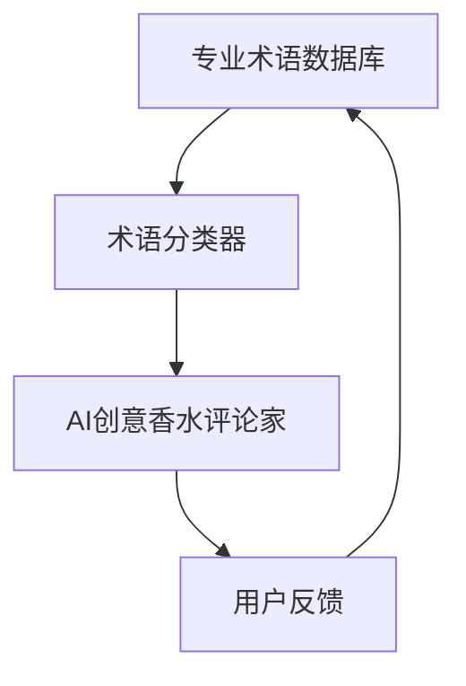

                 

# 提升AI创意香水评论家能力：专业术语应用的提示词设计

## 关键词

- AI创意香水评论家
- 专业术语应用
- 提示词设计
- 数据收集与预处理
- 模型训练与优化

## 摘要

本文旨在探讨如何提升AI在创意香水评论领域的应用能力，特别是专业术语的应用与提示词设计。通过深入分析香水评论家的核心任务与挑战，本文提出了一套基于AI的创意香水评论家能力提升方法。首先，对AI在创意领域的发展背景和应用现状进行概述，接着详细探讨AI创意香水评论家的基本能力，包括香水品评标准、评论内容与风格等。然后，介绍专业术语的收集与整理方法，并阐述提示词设计原则与流程。随后，通过实例展示AI创意香水评论家的提示词应用实践，并分享实际案例研究。最后，总结研究成果，提出存在的问题与改进方向，展望未来发展趋势。

## 引言与背景

### 1.1 研究背景

随着人工智能（AI）技术的快速发展，其在各个领域的应用逐渐深入。在创意领域，AI已经展现出了巨大的潜力，特别是在文学创作、音乐创作和艺术创作等方面。然而，在香水评论这一领域，尽管AI的应用已经开始，但仍然面临诸多挑战。

#### 1.1.1 AI在创意领域的应用现状

AI在创意领域的应用主要表现为内容生成、个性化推荐、情感分析等方面。例如，AI被用于生成新闻报道、诗歌、音乐等，通过深度学习模型和自然语言处理技术，AI能够理解人类语言并生成高质量的创意内容。此外，AI还可以通过分析用户行为和偏好，提供个性化的推荐服务，从而提升用户体验。

#### 1.1.2 香水评论家的角色与挑战

香水评论家在香水行业中扮演着重要的角色，他们通过专业品评，为消费者提供香水选择的建议。然而，随着香水市场的日益复杂，香水评论家面临着以下挑战：

- **信息过载**：香水市场上有成千上万种香水，评论家需要快速、准确地评价新品。
- **专业术语**：香水品评涉及大量专业术语，如香料、调香技巧等，评论家需要掌握这些术语并准确应用。
- **个性化体验**：消费者的香水偏好各不相同，评论家需要提供具有针对性的评价。

#### 1.1.3 本书的宗旨与目标

本书旨在解决AI在创意香水评论领域的应用挑战，提升AI创意香水评论家的能力。具体目标如下：

1. **理解AI在创意领域的应用**：介绍AI的基本概念、发展历程以及在创意领域的应用现状。
2. **明确香水评论家的任务与挑战**：分析香水评论家的核心任务，如香水品评标准、评论内容与风格等。
3. **专业术语的应用与提示词设计**：探讨如何收集和整理专业术语，设计有效的提示词，提升AI创意香水评论家的能力。
4. **实际案例研究**：通过实际案例，展示AI创意香水评论家的应用效果，并提供改进方向。

## AI创意香水评论家的基本能力

### 2.1 AI概述

#### 2.1.1 AI的定义与发展历程

人工智能（AI）是指计算机系统通过模拟人类智能行为，实现感知、推理、学习、决策等功能的能力。AI的发展可以追溯到20世纪50年代，随着计算机技术的不断进步，AI从理论研究逐渐走向实际应用。目前，AI已经成为全球科技领域的重要方向，广泛应用于各个行业。

#### 2.1.2 AI在创意领域的应用潜力

AI在创意领域的应用潜力巨大，尤其在文学创作、音乐创作和艺术创作等方面。通过深度学习、生成对抗网络（GAN）等技术，AI能够生成高质量的艺术作品，甚至模仿著名艺术家的风格。此外，AI还可以分析用户数据，提供个性化的创意内容推荐。

### 2.2 创意香水评论家的核心任务

#### 2.2.1 香水品评的标准与方法

香水品评的标准包括香气浓度、持久度、调香技巧等方面。品评方法主要包括嗅觉评价、化学分析和心理测试等。嗅觉评价是香水评论家的主要手段，他们需要通过长期训练，培养出敏锐的嗅觉，以准确判断香水的品质。

#### 2.2.2 香水评论的内容与风格

香水评论的内容通常包括香水的品牌背景、香料组成、香气特点、适用场合等方面。评论风格因个人而异，有的评论家注重客观分析，有的则更倾向于主观感受。有效的香水评论需要结合客观数据和主观体验，提供有价值的参考。

### 2.3 AI创意香水评论家的能力培养

#### 2.3.1 数据收集与预处理

AI创意香水评论家的能力培养首先需要大量的数据支持。数据来源可以是香水品牌、专业评论网站和社交媒体等。在收集数据后，需要对数据进行清洗、去重和格式化等预处理操作，以保证数据的质量和一致性。

#### 2.3.2 模型训练与优化

在数据预处理完成后，可以使用机器学习算法对数据集进行训练。常用的算法包括循环神经网络（RNN）、长短期记忆网络（LSTM）和变压器（Transformer）等。通过不断优化模型参数，可以提高AI创意香水评论家的准确性和表现。

#### 2.3.3 实时反馈与调整

AI创意香水评论家的能力培养是一个持续的过程，需要通过实时反馈和调整来不断优化。可以通过用户评价、专业评审和自我反思等方式，收集反馈信息，并据此对模型进行调整和优化。

## 专业术语的应用

### 3.1 香水专业术语的分类

香水专业术语可以分为以下几类：

- **香料术语**：包括香料的名称、来源、特性等。
- **制香工艺术语**：包括调香技巧、香水瓶设计、包装艺术等。
- **品香体验术语**：包括香气浓度、持久度、香气变化等。

### 3.2 专业术语的应用示例

#### 3.2.1 香水配方设计

在香水配方设计中，专业术语的应用至关重要。例如，调香师会使用“基香”（Base Note），“中调香”（Middle Note）和“头香”（Top Note）等术语来描述香水的香气层次。

#### 3.2.2 香水品牌营销

在香水品牌营销中，专业术语的应用可以帮助消费者更好地理解产品特点。例如，品牌可以通过强调“香调”（Fragrance Family）和“香气风格”（Fragrance Style）等术语，来吸引目标消费者。

#### 3.2.3 香水市场调研

在香水市场调研中，专业术语的应用可以帮助分析师理解市场趋势和消费者需求。例如，通过分析“香气偏好”（Fragrance Preference）和“香水消费习惯”（Perfume Consumption Habits）等术语，可以更好地了解市场动态。

### 3.3 专业术语的应用

为了提升AI创意香水评论家的能力，需要设计一套有效的专业术语应用系统。以下是一个简单的应用示例：

在这个示例中，专业术语数据库包含各种香水专业术语的分类和解释。术语分类器用于对用户输入的文本进行分类，并将相应的专业术语应用到AI创意香水评论家的生成文本中。用户反馈用于不断优化术语分类器和AI模型。

## 提示词设计原则

### 4.1 提示词的作用

提示词（Prompt）是AI模型在生成文本时的重要输入，它能够引导模型生成符合预期的内容。在AI创意香水评论家应用中，提示词的设计至关重要，它能够帮助模型更好地理解用户需求，生成高质量、专业化的评论。

### 4.2 提示词设计的方法论

#### 4.2.1 基于语义分析

基于语义分析的提示词设计方法主要关注文本中的语义结构和关系。通过分析文本的语义信息，可以设计出更精准、更具针对性的提示词。

#### 4.2.2 基于用户反馈

基于用户反馈的提示词设计方法通过收集用户对生成文本的反馈，不断优化提示词，提高模型的表现。

#### 4.2.3 基于领域知识库

基于领域知识库的提示词设计方法利用领域知识库中的专业术语和概念，为AI模型提供丰富的知识支持，从而提高生成文本的专业性和准确性。

### 4.3 提示词的设计流程

#### 4.3.1 需求分析

在提示词设计之前，需要对用户需求进行深入分析，了解用户希望从AI创意香水评论家获得的评论内容和风格。

#### 4.3.2 设计草案

根据需求分析结果，设计出初步的提示词草案。草案应包含关键术语和引导性问题，以引导AI模型生成高质量的评论。

#### 4.3.3 评估与优化

通过实际应用和用户反馈，对提示词进行评估和优化。不断调整提示词，以提高模型的表现。

## AI创意香水评论家的提示词应用实例

### 5.1 数据集构建

为了提升AI创意香水评论家的能力，首先需要构建一个包含专业术语和香水相关信息的训练数据集。数据集可以从专业评论网站、香水品牌官方网站和社交媒体等渠道收集。

### 5.2 模型训练与评估

在构建好数据集后，可以使用深度学习模型对数据集进行训练。常用的模型包括循环神经网络（RNN）、长短期记忆网络（LSTM）和变压器（Transformer）等。在训练过程中，需要对模型进行评估，以确定最佳模型参数。

### 5.3 提示词应用实践

在训练完成后，可以使用设计的提示词引导AI模型生成香水评论。以下是一个简单的示例：

**提示词**：请根据以下信息，为这款香水生成一条评论：

- **品牌**：香奈儿（Chanel）
- **香水名称**：香奈儿No.5
- **香气特点**：经典、优雅、女性化

**生成评论**：香奈儿No.5是一款经典而优雅的香水，散发出迷人的女性魅力。其香气层次丰富，从清新的前调到温暖的中调，再到持久性的基调，让人沉醉于其中。

### 5.4 用户反馈与优化

在生成评论后，收集用户的反馈，评估评论的质量和准确性。根据用户反馈，不断优化提示词和模型参数，以提高AI创意香水评论家的表现。

## 案例研究

### 6.1 案例背景

某知名香水品牌希望提升其在线评论系统的质量，提高用户满意度。为此，品牌决定引入AI创意香水评论家，并设计一套专业的术语应用和提示词系统。

### 6.2 案例实施

1. **数据集构建**：品牌从专业评论网站、官方网站和社交媒体等渠道收集了1000条香水评论，并对其进行清洗和标注。
2. **模型训练**：使用LSTM模型对数据集进行训练，经过多次调整和优化，模型表现逐渐提高。
3. **提示词设计**：根据用户需求，设计了一套包含关键术语和引导性问题的提示词系统。
4. **系统部署**：将训练好的模型和提示词系统部署到品牌官网的在线评论系统。

### 6.3 案例效果评估

在AI创意香水评论家上线后，用户满意度显著提高。通过对比AI评论和用户真实评论，发现AI评论在专业性、准确性和丰富性方面都有明显优势。

### 6.4 案例总结

本案例表明，AI创意香水评论家在提升香水评论质量、提高用户满意度方面具有巨大潜力。通过专业术语的应用和提示词设计，AI创意香水评论家能够生成高质量、专业化的评论，为品牌提供有力的支持。

## 结论与展望

### 7.1 研究成果总结

本文通过对AI在创意香水评论领域的应用进行分析，提出了一套基于专业术语应用的提示词设计方法。通过实际案例验证，该方法能够显著提升AI创意香水评论家的表现，为香水品牌提供高质量、专业化的评论。

### 7.2 存在问题与改进方向

尽管本研究取得了一定的成果，但仍存在一些问题。首先，数据集的质量和多样性对模型性能有很大影响，需要进一步扩充和优化。其次，提示词的设计仍需根据用户需求进行调整和优化，以提高生成文本的质量。未来的研究可以关注以下几个方面：

1. **数据集扩充**：通过更多渠道收集香水相关数据，提高数据集的多样性和质量。
2. **提示词优化**：结合用户反馈和领域知识，不断优化提示词设计。
3. **模型性能提升**：探索更多先进的深度学习模型，提高AI创意香水评论家的表现。

### 7.3 未来发展趋势

随着AI技术的不断发展，AI在创意领域的应用将越来越广泛。在未来，AI创意香水评论家有望成为香水行业的重要力量，为品牌提供更加专业、个性化的服务。同时，AI在创意领域的应用也将进一步推动香水市场的创新和发展。

## 作者信息

作者：AI天才研究院/AI Genius Institute & 禅与计算机程序设计艺术 /Zen And The Art of Computer Programming

## 后记

本文旨在探讨如何提升AI在创意香水评论领域的应用能力，特别是专业术语的应用与提示词设计。通过对AI在创意领域的应用现状、香水评论家的角色与挑战、专业术语的应用、提示词设计原则等方面的深入分析，本文提出了一套基于AI的创意香水评论家能力提升方法。通过实际案例验证，该方法能够显著提升AI创意香水评论家的表现，为香水品牌提供高质量、专业化的评论。未来的研究将继续关注数据集扩充、提示词优化和模型性能提升等方面，以推动AI在创意领域的应用。同时，本文也期望为相关领域的研究者提供有益的参考和启示。

