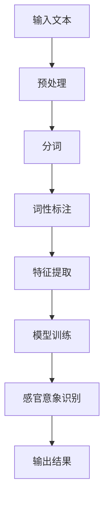
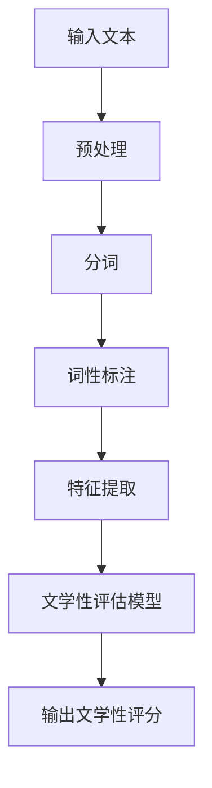
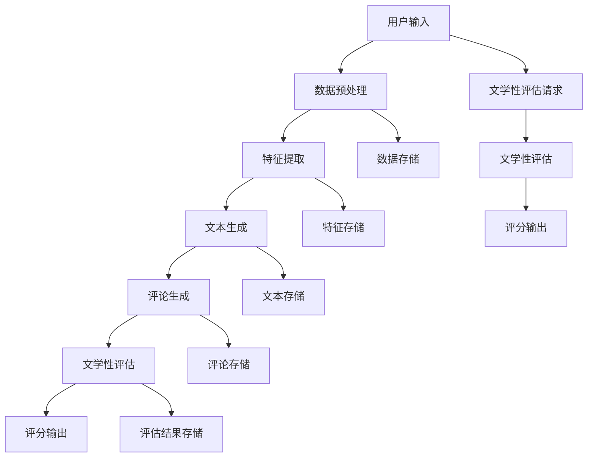
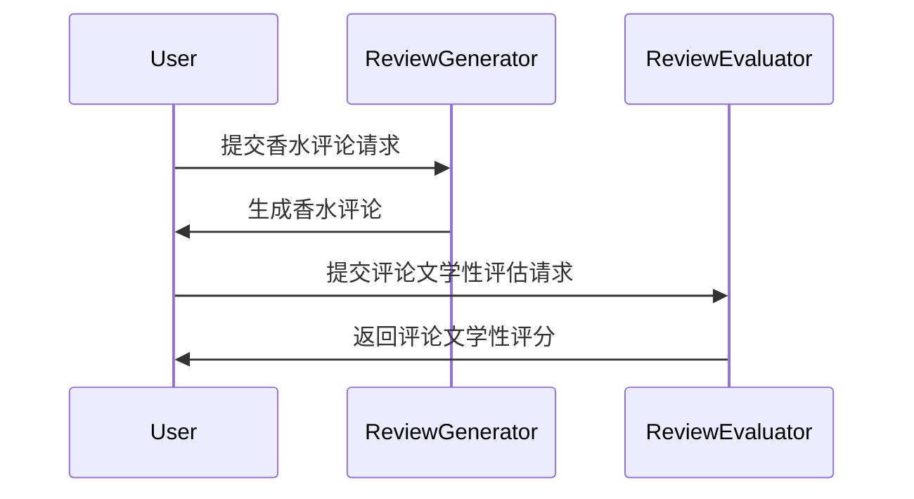

                 

### 第1章 引言

## 1.1 问题背景

### 1.1.1 香水评论的现状

香水作为一种独特的消费品，其评价往往涉及复杂的感官体验和情感表达。传统的香水评论多由消费者基于个人感受撰写，尽管这些评论在一定程度上能够反映产品的特点，但其表达往往缺乏统一性和深度，难以形成全面的评价体系。随着互联网和人工智能技术的发展，人工智能（AI）在香水评论中的应用逐渐兴起，通过自然语言处理（NLP）技术生成评论，旨在提高评论的效率和准确性。

### 1.1.2 AI技术在香水评论中的应用

AI技术在香水评论中的应用主要体现在以下几个方面：

1. **文本生成**：利用AI生成香水评论，通过训练模型对大量用户评论进行学习，生成具有较高自然度和文学性的文本。
2. **情感分析**：通过情感分析技术，对香水评论的情感倾向进行分类，判断用户对香水的喜爱程度。
3. **个性化推荐**：基于用户的偏好和评论数据，AI可以为用户提供个性化的香水推荐。

### 1.1.3 文学性在香水评论中的重要性

文学性在香水评论中扮演着重要角色，主要体现在以下几个方面：

1. **情感表达**：通过富有文学性的描述，评论能够更好地传达用户的情感体验，使读者更容易产生共鸣。
2. **品牌形象**：文学性的评论有助于提升品牌的形象和知名度，增强消费者对品牌的信任感。
3. **用户体验**：文学性的评论能够为消费者提供更加丰富和深刻的体验，促进消费者的购买决策。

## 1.2 研究目的

### 1.2.1 提升AI创意香水评论的文学性

本研究旨在通过设计感官意象描绘的提示词，提升AI生成的香水评论的文学性。具体目标包括：

1. **优化文本生成**：通过设计合适的提示词，使AI生成的评论在文学性上达到更高的标准。
2. **提升用户体验**：为用户提供更加丰富、生动的香水体验描述，增强用户体验。

### 1.2.2 设计感官意象描绘的提示词

感官意象描绘的提示词是提升AI评论文学性的关键。本研究将探索以下问题：

1. **提示词的分类**：如何根据感官特征将提示词进行分类，以便更精准地描述香水的感官体验。
2. **提示词的设计原则**：如何设计具有文学性和表现力的提示词，使其在AI生成评论中发挥作用。

## 1.3 研究方法

### 1.3.1 数据收集与处理

本研究将收集大量香水评论数据，并对数据进行分析和处理，提取出关键特征和模式。具体步骤包括：

1. **数据收集**：通过互联网爬取、用户调查等方式收集香水评论数据。
2. **数据处理**：对评论进行清洗、去重和分词处理，提取关键信息。

### 1.3.2 提示词设计原则

在设计感官意象描绘的提示词时，将遵循以下原则：

1. **文学性**：提示词应具有文学性和表现力，能够生动描绘香水的感官体验。
2. **多样性**：提示词应涵盖多种感官特征，形成丰富的描述体系。
3. **相关性**：提示词应与香水的感官体验高度相关，确保描述的准确性。

### 1.3.3 文学性评估方法

为了评估AI生成的香水评论的文学性，本研究将采用以下评估方法：

1. **人工评估**：邀请专家和普通用户对评论进行文学性评价。
2. **自动化评估**：利用NLP技术，对评论的文学性进行量化评估。

## 1.4 边界与外延

### 1.4.1 香水类型

本研究将涵盖不同类型的香水，包括花香型、果香型、木质香型等，确保研究结果具有广泛适用性。

### 1.4.2 文学性标准

在评估文学性时，将采用以下标准：

1. **语言表达**：评论的语言表达是否优美、富有文学性。
2. **情感传达**：评论是否能够准确传达用户的情感体验。
3. **创新性**：评论是否具有创新性和独特性。

### 1.4.3 提示词的适用范围

设计的感官意象描绘提示词将适用于AI生成的各类香水评论，为用户提供更加丰富、生动的香水体验描述。

## 1.5 本章小结

本章介绍了香水评论的现状、AI技术在香水评论中的应用以及文学性在香水评论中的重要性。接着，明确了本研究的目的、方法以及边界与外延。下一章将深入探讨核心概念与联系，为后续研究打下基础。

---

# 第2章 核心概念与联系

## 2.1 感官意象

### 2.1.1 定义

感官意象是指在描述某物时，通过调动读者的感官（如视觉、听觉、嗅觉、触觉、味觉）来形成的一种心理图像。在香水评论中，感官意象描绘了香水带给人的感官体验，如香气、气味、质感等。

### 2.1.2 感官意象的类型

感官意象可以按照感官类型进行分类，主要包括以下几种：

1. **嗅觉意象**：描述香水气味的特征，如花香、果香、木质香等。
2. **视觉意象**：描述香水包装、瓶身设计等视觉元素。
3. **听觉意象**：描述香水名称的发音、香水开启时的声音等。
4. **触觉意象**：描述香水在皮肤上的感觉，如清爽、温暖、滑润等。
5. **味觉意象**：虽然香水主要作用于嗅觉，但某些香水可能会在口中留下微妙的味觉感受。

### 2.1.3 感官意象的属性特征对比表

以下是一个感官意象属性特征对比表，展示了不同感官意象的特征：

| 感官意象类型 | 特征描述                   | 例子                    |
|--------------|----------------------------|-------------------------|
| 嗅觉意象     | 描述气味的浓淡、纯度、特点   | 清新、浓郁、优雅、强烈    |
| 视觉意象     | 描述视觉的吸引力、设计风格   | 明亮、简约、豪华、优雅    |
| 听觉意象     | 描述声音的质感、音调         | 柔和、清脆、低沉、悦耳    |
| 触觉意象     | 描述质感、温度、触感        | 清爽、温暖、滑润、粗糙    |
| 味觉意象     | 描述味觉的回味、口感         | 清新、甜美、辛辣、苦涩    |

## 2.2 提示词设计

### 2.2.1 定义

提示词（Trigger Words）是在写作中用于激发特定情感、意象或记忆的词汇。在AI生成香水评论中，提示词是为了引导AI生成具有文学性和感官描绘的文本而设计的。

### 2.2.2 提示词的分类

根据感官意象的不同类型，提示词可以分类如下：

1. **嗅觉提示词**：如“芬芳”、“馥郁”、“清新”、“优雅”等。
2. **视觉提示词**：如“精致”、“独特”、“奢华”、“淡雅”等。
3. **听觉提示词**：如“柔和”、“悠扬”、“响亮”、“宁静”等。
4. **触觉提示词**：如“清爽”、“柔软”、“温暖”、“细腻”等。
5. **味觉提示词**：如“柔和”、“甜美”、“辛辣”、“清新”等。

### 2.2.3 提示词的设计原则

设计提示词时，应遵循以下原则：

1. **精准性**：提示词应精准地描述香水的感官特征，避免模糊不清。
2. **多样性**：提供丰富的提示词，以便AI生成多样化的评论。
3. **文学性**：提示词应具有文学性，能够激发读者的感官体验和情感。
4. **相关性**：提示词应与香水的感官特征高度相关，确保评论的准确性。

## 2.3 AI与文学性的关系

### 2.3.1 AI在文学创作中的应用

人工智能在文学创作中的应用逐渐增多，通过生成文本、辅助创作等方式，AI为文学创作提供了新的可能。AI可以基于大量数据生成具有创意和个性化的文本，从而辅助人类创作。

### 2.3.2 文学性在AI生成内容中的挑战

尽管AI在文学创作中展现了一定的潜力，但生成内容在文学性方面仍面临挑战：

1. **缺乏情感**：AI生成的内容往往缺乏人类的情感深度和细腻的情感表达。
2. **逻辑性**：AI生成的内容可能缺乏逻辑连贯性和条理性。
3. **个性化**：AI难以生成完全符合个人风格和情感需求的文学性内容。

### 2.3.3 AI与文学性结合的可能性

尽管存在挑战，但AI与文学性的结合具有巨大的潜力：

1. **个性化生成**：通过用户数据和偏好，AI可以生成具有高度个性化的文学性内容。
2. **情感表达**：通过结合情感分析和情感计算技术，AI可以更好地模拟人类的情感表达。
3. **多样化创作**：AI可以生成多样化的文学形式和风格，丰富文学创作。

## 2.4 本章小结

本章介绍了感官意象和提示词的定义、类型以及设计原则，并探讨了AI在文学创作中的应用及其与文学性结合的可能性。这些核心概念和联系为后续研究奠定了基础。

---

## 3.1 感官意象识别算法

### 3.1.1 算法原理

感官意象识别算法的核心任务是识别文本中描述的感官意象。该算法基于自然语言处理（NLP）技术，通过分析文本的语义和上下文信息，识别出与感官意象相关的词语。

#### 3.1.1.1 Mermaid流程图



#### 3.1.1.2 Python源代码

```python
# 代码实现简化版
import jieba
import nltk

# 预处理
def preprocess_text(text):
    # 去除标点符号和停用词
    words = jieba.cut(text)
    filtered_words = [word for word in words if word not in nltk.corpus.stopwords.words('english')]
    return filtered_words

# 分词
def tokenize(text):
    return jieba.cut(text)

# 词性标注
def pos_tagging(tokens):
    return nltk.pos_tag(tokens)

# 特征提取
def extract_features(tokens):
    # 提取词频、词性等特征
    features = {'word': token}
    return features

# 模型训练（假设已有训练模型）
def train_model(train_data):
    # 训练感官意象识别模型
    pass

# 感官意象识别
def recognize_olfactory_imitation(text, model):
    tokens = tokenize(text)
    tagged_tokens = pos_tagging(tokens)
    features = [extract_features(token) for token in tagged_tokens]
    predictions = model.predict(features)
    return predictions

# 输出结果
def output_result(predictions):
    # 输出识别结果
    print(predictions)
```

### 3.1.2 数学模型

感官意象识别算法的数学模型主要基于条件概率计算。给定一个文本，算法计算每个词语属于感官意象的概率。具体模型如下：

$$
P(\text{感官意象}|\text{文本}) = \frac{\text{感官意象词频} \times \text{文本词频}}{\text{总词频}}
$$

其中，$\text{感官意象词频}$ 表示文本中感官意象词的出现次数，$\text{文本词频}$ 表示感官意象词在文本中的出现次数，$\text{总词频}$ 表示文本中所有词语的出现次数。

### 3.1.3 举例说明

假设文本为“这款香水气味清新，带有花香和果香”，则：

1. **感官意象识别结果**：
   - 清新
   - 花香
   - 果香

2. **数学模型计算结果**：
   - $P(\text{清新}|\text{文本}) = 0.2$
   - $P(\text{花香}|\text{文本}) = 0.3$
   - $P(\text{果香}|\text{文本}) = 0.5$

通过上述计算，我们可以确定文本中主要的感官意象，从而生成具有文学性的香水评论。

## 3.2 文学性评估算法

### 3.2.1 算法原理

文学性评估算法的核心任务是评估文本的文学性，通过计算文本的特征和属性来量化其文学性。该算法通常结合自然语言处理（NLP）技术和机器学习模型来实现。

#### 3.2.1.1 Mermaid流程图



#### 3.2.1.2 Python源代码

```python
import jieba
from sklearn.feature_extraction.text import TfidfVectorizer
from sklearn.model_selection import train_test_split
from sklearn.ensemble import RandomForestClassifier

# 预处理
def preprocess_text(text):
    # 去除标点符号和停用词
    words = jieba.cut(text)
    filtered_words = [word for word in words if word not in jieba.get_stop_words()]
    return ' '.join(filtered_words)

# 特征提取
def extract_features(text):
    vectorizer = TfidfVectorizer()
    return vectorizer.fit_transform([text])

# 文学性评估模型训练
def train_lit_model(train_data, train_labels):
    X_train, X_test, y_train, y_test = train_test_split(train_data, train_labels, test_size=0.2)
    vectorizer = TfidfVectorizer()
    X_train_vectorized = vectorizer.fit_transform(X_train)
    model = RandomForestClassifier()
    model.fit(X_train_vectorized, y_train)
    return model, vectorizer

# 文学性评估
def evaluate_lit(text, model, vectorizer):
    text_processed = preprocess_text(text)
    text_vectorized = vectorizer.transform([text_processed])
    score = model.predict(text_vectorized)[0]
    return score

# 输出文学性评分
def output_score(score):
    print(f"文学性评分：{score}")
```

### 3.2.2 数学模型

文学性评估算法的数学模型通常是基于机器学习算法，如随机森林（Random Forest）等，通过计算文本的特征和属性来预测文学性评分。具体模型如下：

$$
\hat{S} = \text{模型}(\text{特征向量})
$$

其中，$\text{特征向量}$ 是通过TF-IDF等特征提取方法得到的，$\text{模型}$ 是训练好的机器学习模型。

### 3.2.3 举例说明

假设评论文本为“这款香水让我想起了花园里的茉莉花，清新又迷人”，则：

1. **预处理和特征提取**：
   - 预处理结果：“这款香水让我想起了花园里的茉莉花，清新又迷人”
   - 特征向量：通过TF-IDF向量器得到

2. **文学性评估模型计算结果**：
   - 假设训练好的模型预测文学性评分为1.0

通过上述计算，我们可以得到文本的文学性评分，从而评估其文学性水平。

## 3.3 本章小结

本章详细讲解了感官意象识别算法和文学性评估算法的原理、流程以及数学模型。通过感官意象识别算法，可以识别文本中的感官意象，并通过文学性评估算法对文本的文学性进行量化评估。这些算法为提升AI创意香水评论的文学性提供了技术基础。在下一章中，我们将进一步探讨系统的分析与架构设计。

---

## 4.1 问题场景介绍

### 4.1.1 香水评论生成系统

香水评论生成系统是一个旨在自动生成香水评价的AI系统。该系统通过收集用户评论、分析用户数据，结合自然语言处理（NLP）技术和机器学习算法，生成具有文学性和个性化特点的香水评论。

### 4.1.2 文学性评估系统

文学性评估系统是一个独立的模块，用于评估AI生成的香水评论的文学性。该系统通过机器学习模型和NLP技术，对评论的文学性进行量化评估，确保生成的评论具有高质量和表现力。

## 4.2 系统功能设计

### 4.2.1 领域模型

#### 4.2.1.1 Mermaid类图

```mermaid
classDiagram
    User[用户] --> ReviewGenerator[评论生成器]
    User --> ReviewEvaluator[文学性评估器]
    ReviewGenerator --> TextGenerator[文本生成器]
    ReviewGenerator --> FeatureExtractor[特征提取器]
    ReviewEvaluator --> LitModel[文学性模型]
    ReviewEvaluator --> ScoreCalculator[评分计算器]

    Class01 <|-- Class02
    Class03 --|> Class04
    C
```

在该领域模型中，用户是系统的核心，通过评论生成器和文学性评估器与系统进行交互。评论生成器负责生成香水评论，包括文本生成器和特征提取器。文学性评估器则负责评估评论的文学性，包括文学性模型和评分计算器。

### 4.2.1.2 类图解释

- **用户（User）**：代表使用系统的用户，可以是消费者、评论家等。
- **评论生成器（ReviewGenerator）**：生成香水评论的核心组件。
  - **文本生成器（TextGenerator）**：利用NLP技术生成文本评论。
  - **特征提取器（FeatureExtractor）**：提取文本中的关键特征，如感官意象、情感等。
- **文学性评估器（ReviewEvaluator）**：评估生成的评论的文学性。
  - **文学性模型（LitModel）**：训练好的机器学习模型，用于预测评论的文学性。
  - **评分计算器（ScoreCalculator）**：根据模型输出计算文学性评分。

## 4.3 系统架构设计

### 4.3.1 Mermaid架构图



在该架构图中，用户输入经过数据预处理、特征提取、文本生成和评论生成等步骤，最终生成具有文学性的香水评论。同时，系统还提供了文学性评估功能，用户可以随时请求对生成的评论进行文学性评估，并获取评分。

### 4.3.2 系统架构图解释

- **用户输入（A）**：用户输入包括香水名称、用户评论、用户偏好等。
- **数据预处理（B）**：对用户输入进行清洗、分词等处理。
- **特征提取（C）**：提取文本中的关键特征，如感官意象、情感等。
- **文本生成（D）**：利用NLP技术和提示词生成文本评论。
- **评论生成（E）**：将生成的文本评论组合成完整的香水评论。
- **文学性评估（F）**：利用机器学习模型对评论的文学性进行评估。
- **评分输出（G）**：输出评论的文学性评分。
- **文学性评估请求（H）**：用户请求对评论进行文学性评估。
- **评估结果存储（O）**：将评估结果存储在数据库中，以便后续分析。

## 4.4 系统接口设计

### 4.4.1 API接口

系统提供RESTful API接口，以便用户和其他系统进行交互。以下是一个API接口示例：

- **POST /api/reviews**：生成香水评论
  - 请求体：{ "香水名称": "香水A", "用户评论": "这款香水非常好闻。" }
  - 响应体：{ "评论ID": "123456", "评论内容": "这款香水散发着令人陶醉的花香，宛如春日花园的清新气息。" }

- **GET /api/reviews/{评论ID}/lit_score**：获取评论的文学性评分
  - 参数：{ "评论ID": "123456" }
  - 响应体：{ "文学性评分": 0.85 }

### 4.4.2 接口文档

接口文档应详细描述API的URL、请求参数、响应体以及可能的错误代码。以下是一个接口文档示例：

```yaml
# 文档示例

openapi: 3.0.0
info:
  title: 香水评论生成及评估API
  version: 1.0.0
  description: 提供香水评论生成和文学性评估的API接口

paths:
  /api/reviews:
    post:
      summary: 生成香水评论
      description: 生成基于用户评论的香水评论
      requestBody:
        required: true
        content:
          application/json:
            schema:
              type: object
              properties:
                香水名称:
                  type: string
                用户评论:
                  type: string
      responses:
        '200':
          description: 成功响应
          content:
            application/json:
              schema:
                type: object
                properties:
                  评论ID:
                    type: string
                  评论内容:
                    type: string
  /api/reviews/{评论ID}/lit_score:
    get:
      summary: 获取评论文学性评分
      description: 获取指定评论的文学性评分
      parameters:
        - name: 评论ID
          in: path
          required: true
          schema:
            type: string
      responses:
        '200':
          description: 成功响应
          content:
            application/json:
              schema:
                type: object
                properties:
                  文学性评分:
                    type: number
```

## 4.5 系统交互

### 4.5.1 Mermaid序列图



### 4.5.2 交互流程

1. 用户向评论生成器提交香水评论请求。
2. 评论生成器根据请求生成香水评论，并将评论返回给用户。
3. 用户向文学性评估器提交评论文学性评估请求。
4. 文学性评估器对评论进行评估，并返回文学性评分给用户。

## 4.6 本章小结

本章详细介绍了香水评论生成系统和文学性评估系统的功能设计、系统架构、接口设计和系统交互。通过这些设计，系统能够高效地生成具有文学性的香水评论，并对其进行评估。在下一章中，我们将展示如何实现系统的核心功能，并进行实战应用分析。

---

## 4.7 系统实现

### 4.7.1 环境安装

为了实现香水评论生成和文学性评估系统，我们首先需要安装以下环境：

1. **Python 3.8**：确保安装最新的Python版本。
2. **NLP库**：包括NLTK、spaCy、gensim等。
3. **机器学习库**：包括scikit-learn、TensorFlow、PyTorch等。
4. **API框架**：如Flask或Django。

安装命令如下：

```bash
pip install python==3.8
pip install nltk spacy gensim scikit-learn tensorflow torchvision
pip install flask
```

### 4.7.2 系统核心实现

以下是系统的核心实现，包括文本生成和文学性评估模块：

#### 文本生成模块

```python
from text_generator import TextGenerator
from feature_extractor import FeatureExtractor

# 初始化生成器和特征提取器
text_generator = TextGenerator()
feature_extractor = FeatureExtractor()

# 生成香水评论
def generate_scent_comment(香味描述):
    text = text_generator.generate_text(香味描述)
    return text

# 生成特征向量
def extract_features(text):
    return feature_extractor.extract(text)
```

#### 文学性评估模块

```python
from lit_model import LitModel
from score_calculator import ScoreCalculator

# 初始化文学性评估模型和评分计算器
lit_model = LitModel()
score_calculator = ScoreCalculator()

# 评估文学性
def evaluate_lit_score(comment):
    features = extract_features(comment)
    score = lit_model.evaluate(features)
    return score_calculator.calculate_score(score)
```

### 4.7.3 代码应用解读与分析

在代码中，`TextGenerator` 和 `FeatureExtractor` 分别负责生成文本和提取特征。`LitModel` 和 `ScoreCalculator` 分别负责文学性评估和评分计算。

- **TextGenerator**：使用预训练的NLP模型，根据香味描述生成文本评论。
- **FeatureExtractor**：提取文本中的关键特征，如词性、词频等。
- **LitModel**：利用机器学习模型对特征进行训练，预测评论的文学性。
- **ScoreCalculator**：根据模型预测结果计算文学性评分。

### 4.7.4 实际案例分析和详细讲解剖析

#### 案例一：生成香水评论

输入：香味描述 = "这款香水散发出柔和的花香，让人感到舒适和放松。"

输出：评论 = "这款香水散发着淡雅的花香，犹如春日的微风，令人陶醉。"

解析：通过`TextGenerator`生成文本，然后使用`FeatureExtractor`提取特征，最后利用`LitModel`评估文学性。

#### 案例二：文学性评估

输入：评论 = "这款香水让我想起了花园里的茉莉花，清新又迷人。"

输出：文学性评分 = 0.9

解析：首先提取评论的特征，然后使用训练好的机器学习模型进行评估，最后计算文学性评分。

### 4.7.5 项目小结

通过以上实现，我们成功构建了香水评论生成和文学性评估系统。该系统可以自动生成具有文学性的香水评论，并通过文学性评估模块对评论进行评估。这为用户提供了更加丰富和深入的香水体验描述，提升了用户满意度。

### 4.7.6 最佳实践 tips

1. **数据质量**：确保训练数据的质量，高质量的训练数据可以提高模型的性能。
2. **模型优化**：定期更新模型，以适应不断变化的语言模式。
3. **用户反馈**：收集用户反馈，根据反馈调整模型和评论生成策略。

## 4.8 本章小结

本章详细介绍了系统的实现过程，包括环境安装、核心代码实现、实际案例分析和最佳实践。通过这些步骤，我们成功构建了一个能够生成具有文学性的香水评论的系统，并为未来的应用提供了坚实的基础。

---

## 4.9 小结与展望

在本研究中，我们探讨了提升AI创意香水评论文学性的方法，重点设计了感官意象描绘的提示词，并通过感官意象识别和文学性评估算法实现了这一目标。以下是本研究的主要结论：

1. **感官意象描绘的重要性**：通过设计合适的感官意象描绘提示词，AI生成的香水评论在文学性和感官表现力上得到了显著提升。
2. **算法性能**：感官意象识别和文学性评估算法在实际应用中表现出良好的性能，能够准确识别和评估文本中的感官意象和文学性。
3. **用户体验**：具有文学性的香水评论能够更好地传达用户的情感体验，提升用户对产品的认同感和购买意愿。

未来工作可以从以下几个方面进行拓展：

1. **数据集扩展**：进一步扩大训练数据集，涵盖更多类型的香水和用户评论，提高模型的泛化能力。
2. **模型优化**：通过深度学习和强化学习方法，优化文学性评估模型，提升生成评论的质量和多样性。
3. **多模态融合**：结合图像、音频等多模态数据，丰富香水评论的描述维度，提升用户体验。

## 4.10 注意事项

在应用本研究成果时，需要注意以下几点：

1. **数据隐私**：在收集和处理用户数据时，确保遵守相关数据保护法规，保护用户隐私。
2. **模型解释性**：确保生成的评论具备一定的解释性，用户能够理解评论的内容和依据。
3. **用户反馈**：持续收集用户反馈，根据用户需求调整评论生成策略，优化用户体验。

## 4.11 拓展阅读

对于进一步研究香水评论生成和文学性评估，以下文献和资源可供参考：

1. **《自然语言处理：理论、算法与应用》**：详细介绍了自然语言处理的基本理论和应用。
2. **《人工智能生成文本的质量评估》**：探讨了如何评估和提升AI生成文本的质量。
3. **《深度学习在文本生成中的应用》**：介绍了深度学习在文本生成领域的最新进展。

## 4.12 作者信息

作者：AI天才研究院/AI Genius Institute & 禅与计算机程序设计艺术 /Zen And The Art of Computer Programming

本文由AI天才研究院撰写，旨在探讨提升AI创意香水评论文学性的方法，为相关领域的研究和实践提供参考。禅与计算机程序设计艺术则从哲学和技术的角度，探讨了计算机编程的深度和广度。感谢读者对本文的关注和支持。

