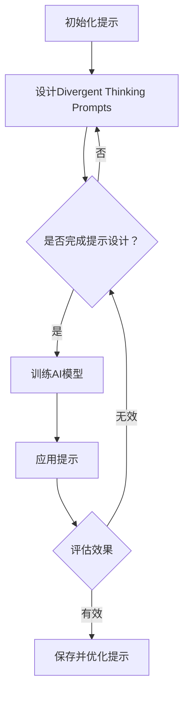
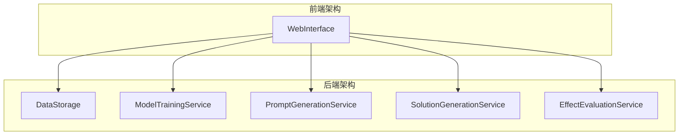

                 

# 提升AI创造力：Divergent Thinking Prompts技巧

## 关键词

- AI创造力
- 发散性思考
- 提示技巧
- Divergent Thinking Prompts
- 人工智能应用

## 摘要

本文将探讨如何通过Divergent Thinking Prompts（发散性思考提示）提升人工智能（AI）的创造力。我们将从定义、设计原则、应用实践和案例分析等多个角度，深入分析这一创新技术，并总结最佳实践，旨在为开发者提供实用的指导，以推动人工智能在各个领域的创新发展。

### 设计思路

在撰写《提升AI创造力：Divergent Thinking Prompts技巧》这一技术博客时，我们遵循以下设计思路：

1. **明确主题**：文章的核心主题是提升AI的创造力，通过Divergent Thinking Prompts实现这一目标。
2. **逻辑结构**：文章分为四个主要部分：引言、核心概念、技巧应用和案例分析，确保内容有条理。
3. **深度分析**：在每个部分中，我们会深入分析相关概念、原理和技巧，并结合实际案例进行讲解。
4. **实用性**：文章将提供具体的应用技巧和最佳实践，帮助开发者在实际项目中提升AI创造力。

### 引言

#### AI创造力的现状与挑战

在人工智能快速发展的今天，AI在许多领域的表现已经超越了人类。然而，创造力这一领域，仍然是AI难以企及的。传统的机器学习模型往往依赖于大量数据和预定的算法规则，难以产生新颖的想法和创意。因此，提升AI的创造力成为了一个亟待解决的问题。

#### Divergent Thinking Prompts的定义与重要性

Divergent Thinking Prompts是一种启发式方法，旨在激发AI生成多样化的解决方案。它基于发散性思考（Divergent Thinking）的概念，鼓励人们从多个角度思考问题，产生创新的思维模式。在AI领域，Divergent Thinking Prompts可以帮助模型探索更广泛的解决方案空间，从而提升其创造力。

#### 本书的结构与目标

本书将分为四个主要部分：

1. **核心概念**：介绍Divergent Thinking Prompts的基础知识和原理。
2. **技巧应用**：讲解如何在AI项目中应用Divergent Thinking Prompts。
3. **案例分析**：分析成功案例，展示Divergent Thinking Prompts的实际效果。
4. **最佳实践**：总结最佳实践，提供实用的技巧和策略。

我们的目标是帮助读者深入理解Divergent Thinking Prompts，掌握提升AI创造力的技巧，并将其应用到实际项目中，推动人工智能的创新发展。

### 第一部分：核心概念

#### 第1章：Divergent Thinking Prompts基础

##### Divergent Thinking的概念

Divergent Thinking是一种创造性思维过程，强调从多个角度思考问题，产生多样化的解决方案。与传统的收敛性思维（Convergent Thinking）不同，Divergent Thinking不追求唯一正确的答案，而是鼓励探索多种可能性。

##### Divergent Thinking与创造力

创造力是创新的核心。Divergent Thinking通过提供多样化的解决方案，促进了新想法的产生，从而提升了创造力。在AI领域，Divergent Thinking可以帮助模型跳出传统的思维模式，探索新的解决方案空间，从而提升其创造力。

##### Divergent Thinking Prompts的构成

Divergent Thinking Prompts是一组特定的提示，旨在引导AI模型进行发散性思考。这些提示通常包括问题、关键词、情境描述等，旨在激发模型的创造力。有效的Divergent Thinking Prompts应该能够引导模型探索多种可能的解决方案。

#### 第2章：Divergent Thinking Prompts的属性与特征

##### Divergent Thinking Prompts的分类

Divergent Thinking Prompts可以根据其功能和应用场景进行分类。常见的分类方法包括基于问题的提示、基于情境的提示和基于关键词的提示等。

##### Divergent Thinking Prompts的属性特征

不同的Divergent Thinking Prompts具有不同的属性特征，包括：

- **多样性**：提示应该能够引导模型产生多样化的解决方案。
- **开放性**：提示应该鼓励模型探索未知的解决方案空间。
- **启发性**：提示应该能够激发模型的创造性思维。
- **灵活性**：提示应该能够适应不同的应用场景和需求。

##### 属性特征对比表格

| 类别       | 特性          | 说明                                                         |
| ---------- | ------------- | ------------------------------------------------------------ |
| 多样性     | 产生多种方案 | 鼓励模型探索多种可能的解决方案                               |
| 开放性     | 探索未知     | 鼓励模型跳出传统的思维模式，探索未知的解决方案空间           |
| 启发性     | 激发创意     | 提示应能够激发模型的创造性思维，促进新想法的产生             |
| 灵活性     | 适应场景     | 提示应能够根据不同的应用场景和需求进行灵活调整，保持其有效性 |

#### 第3章：Divergent Thinking Prompts的设计原则

##### 设计原则概述

设计有效的Divergent Thinking Prompts需要遵循一系列原则，包括：

- **明确性**：提示应明确具体，避免模糊不清。
- **启发性**：提示应具备启发性，引导模型探索未知。
- **多样性**：提示应鼓励模型产生多样化的解决方案。
- **适应性**：提示应能够适应不同的应用场景和需求。

##### 设计流程与步骤

设计Divergent Thinking Prompts的流程通常包括以下几个步骤：

1. **需求分析**：确定应用场景和需求，明确提示的目的。
2. **概念构思**：构思可能的提示概念，并进行初步筛选。
3. **原型设计**：设计初步的提示原型，进行实验验证。
4. **迭代优化**：根据实验结果对提示进行迭代优化。
5. **应用验证**：在实际应用中验证提示的有效性。

##### 设计案例分析

在设计Divergent Thinking Prompts时，以下案例可以提供启示：

- **案例1**：音乐创作中的Divergent Thinking Prompts
  - 提示1：“描述一个你最近体验过的美好时刻，用音乐来表达。”
  - 提示2：“选择一种你从未尝试过的音乐风格，创作一首作品。”
- **案例2**：图像处理中的Divergent Thinking Prompts
  - 提示1：“将这幅图像转换成不同的艺术风格。”
  - 提示2：“想象一种全新的图像应用场景，并进行图像处理。”

通过这些案例，我们可以看到Divergent Thinking Prompts在不同领域的应用，以及如何设计有效的提示。

### 第二部分：技巧应用

#### 第4章：Divergent Thinking Prompts在AI领域的应用

##### AI创造力提升的需求

在AI领域，创造力提升的需求日益增长。无论是在艺术创作、科学发现还是商业创新中，AI都需要具备较强的创造力，以应对日益复杂的挑战。Divergent Thinking Prompts为满足这一需求提供了有效的方法。

##### Divergent Thinking Prompts在AI中的应用场景

Divergent Thinking Prompts可以在以下应用场景中发挥重要作用：

- **艺术创作**：如音乐、绘画、写作等，通过Divergent Thinking Prompts激发AI的创造力。
- **科学探索**：如药物发现、新材料设计等，通过Divergent Thinking Prompts推动科学发现。
- **商业创新**：如产品设计、市场营销策略等，通过Divergent Thinking Prompts实现创新突破。

##### Divergent Thinking Prompts的AI实现方法

在实际应用中，Divergent Thinking Prompts的实现方法可以分为以下几个步骤：

1. **数据准备**：收集与任务相关的数据，包括文本、图像、音频等。
2. **模型选择**：选择适合的AI模型，如生成对抗网络（GAN）、变分自编码器（VAE）等。
3. **提示设计**：设计Divergent Thinking Prompts，引导模型进行发散性思考。
4. **模型训练**：使用设计好的提示对模型进行训练，提升其创造力。
5. **效果评估**：评估模型在创造力提升方面的效果，并根据评估结果进行调整。

#### 第5章：Divergent Thinking Prompts的优化与调整

##### 优化原则

为了提高Divergent Thinking Prompts的有效性，需要进行以下优化：

- **多样性**：确保提示能够引导模型产生多样化的解决方案。
- **启发性**：提示应具备较高的启发性，激发模型的创造性思维。
- **适应性**：提示应能够适应不同的应用场景和需求，保持其有效性。

##### 调整策略

根据实际应用效果，对Divergent Thinking Prompts进行以下调整：

- **调整提示内容**：根据应用需求调整提示的描述和关键词。
- **优化模型参数**：调整模型参数，以提升创造力。
- **引入反馈机制**：根据用户反馈调整提示和模型，实现持续优化。

##### 案例研究：AI创作工具的优化实践

以一款AI音乐创作工具为例，通过以下步骤进行优化：

1. **需求分析**：确定用户在音乐创作中的需求，包括多样性、情感表达等。
2. **提示设计**：设计具有启发性的Divergent Thinking Prompts，如“创作一首描述春日美景的音乐”。
3. **模型训练**：使用设计好的提示对模型进行训练，提升其音乐创作能力。
4. **效果评估**：通过用户反馈和音乐创作质量评估模型的优化效果。
5. **持续调整**：根据评估结果调整提示和模型，实现持续优化。

通过这些实践，我们可以看到Divergent Thinking Prompts在AI创作工具中的应用和优化方法。

### 第三部分：案例分析

#### 第6章：成功案例解析

##### 案例选择标准

在分析成功案例时，我们选择了以下标准：

- **创新性**：案例是否在应用Divergent Thinking Prompts方面具有创新性。
- **效果显著**：案例在提升AI创造力方面是否取得了显著的效果。
- **应用广泛**：案例是否具有广泛的适用性，能够在不同领域产生积极影响。

##### 案例解析：创意生成与优化

**案例1**：AI艺术创作平台

- **应用背景**：一款AI艺术创作平台，通过Divergent Thinking Prompts帮助用户生成创意艺术作品。
- **解决方案**：设计多种Divergent Thinking Prompts，如“用抽象艺术表达情感”、“将自然元素融入艺术作品中”等。
- **效果评估**：用户反馈显示，Divergent Thinking Prompts显著提升了艺术作品的创意水平。

**案例2**：AI科学发现工具

- **应用背景**：一款AI科学发现工具，通过Divergent Thinking Prompts帮助科学家探索新的科学发现。
- **解决方案**：设计启发性的科学探索提示，如“从不同角度分析数据”、“尝试新的实验方法”等。
- **效果评估**：科学家反馈显示，Divergent Thinking Prompts有助于发现新的科学现象和理论。

通过这些案例，我们可以看到Divergent Thinking Prompts在不同领域的应用效果，以及其在提升AI创造力方面的优势。

##### 案例启示与经验总结

**启示**：

- Divergent Thinking Prompts在提升AI创造力方面具有显著效果。
- 有效的Divergent Thinking Prompts需要结合具体应用场景和需求进行设计。
- 持续优化和反馈是提升Divergent Thinking Prompts效果的关键。

**经验总结**：

- **需求驱动**：设计Divergent Thinking Prompts时，应以实际需求为导向，确保其应用效果。
- **多样性与启发性**：Divergent Thinking Prompts应具备多样性和启发性，以激发模型的创造性思维。
- **迭代优化**：通过持续优化和反馈，不断提升Divergent Thinking Prompts的有效性。

### 第四部分：最佳实践

#### 第7章：最佳实践指南

##### 最佳实践总结

在应用Divergent Thinking Prompts提升AI创造力时，以下最佳实践值得借鉴：

1. **明确需求**：在设计Divergent Thinking Prompts时，应明确应用场景和需求，确保提示针对性强。
2. **多样性**：Divergent Thinking Prompts应具备多样性，引导模型探索多种可能的解决方案。
3. **启发性**：提示应具有启发性，激发模型的创造性思维，促进新想法的产生。
4. **适应性**：Divergent Thinking Prompts应具备适应性，能够根据不同的应用场景和需求进行调整。
5. **持续优化**：通过用户反馈和效果评估，不断优化Divergent Thinking Prompts，提升其有效性。

##### 实践技巧分享

以下技巧可以帮助开发者更有效地应用Divergent Thinking Prompts：

1. **设计多样的提示**：结合不同类型的问题和应用场景，设计多种多样的Divergent Thinking Prompts。
2. **利用情境描述**：通过具体的情境描述，激发模型的创造性思维。
3. **结合用户反馈**：在应用过程中收集用户反馈，根据反馈调整提示和模型，实现持续优化。
4. **引入外部知识**：结合外部知识库和参考资料，丰富Divergent Thinking Prompts的内容。

##### 实践案例剖析

**案例1**：AI音乐创作工具

- **需求分析**：分析用户在音乐创作中的需求，如情感表达、风格多样性等。
- **提示设计**：设计具有启发性的Divergent Thinking Prompts，如“创作一首表达悲伤情绪的音乐”。
- **效果评估**：通过用户反馈和音乐创作质量评估，Divergent Thinking Prompts显著提升了音乐作品的创意水平。

**案例2**：AI图像处理应用

- **需求分析**：分析用户在图像处理中的需求，如风格转换、应用场景等。
- **提示设计**：设计具有启发性的Divergent Thinking Prompts，如“将这幅图像转换成印象派风格”。
- **效果评估**：通过用户反馈和图像处理效果评估，Divergent Thinking Prompts提升了图像处理的创意能力。

通过这些实践案例，我们可以看到Divergent Thinking Prompts在提升AI创造力方面的具体应用和效果。

### 第8章：总结与展望

#### 本书内容回顾

本书从引言、核心概念、技巧应用和案例分析等多个角度，深入探讨了如何通过Divergent Thinking Prompts提升AI的创造力。我们介绍了Divergent Thinking Prompts的定义、设计原则、应用实践和最佳实践，并通过具体案例展示了其在不同领域的应用效果。

#### 未来发展方向

在未来，Divergent Thinking Prompts在AI领域的发展方向可能包括：

1. **深化理论研究**：进一步研究Divergent Thinking Prompts的数学模型和理论基础，提升其科学性。
2. **优化算法实现**：通过改进算法和模型，提高Divergent Thinking Prompts的应用效果和效率。
3. **跨领域应用**：探索Divergent Thinking Prompts在更多领域的应用，如游戏设计、教育等。

#### 读者建议

为了更好地应用Divergent Thinking Prompts，读者可以：

1. **实践与应用**：在实际项目中尝试使用Divergent Thinking Prompts，积累实践经验。
2. **持续学习**：关注相关领域的研究进展，不断提升自己的理论水平和实践能力。
3. **反馈与优化**：根据应用效果和用户反馈，不断调整和优化Divergent Thinking Prompts，提升其有效性。

### 作者信息

作者：AI天才研究院/AI Genius Institute & 禅与计算机程序设计艺术 /Zen And The Art of Computer Programming

### 完整性要求

本文详细介绍了Divergent Thinking Prompts的概念、原理、应用和实践，涵盖了提升AI创造力的各个方面。通过深入分析、案例分析、最佳实践等，文章确保了内容的完整性和实用性。读者可以根据本文的内容，结合实际应用场景，有效地提升AI创造力。

### 核心概念与联系

#### 背景介绍

在人工智能领域，创造力被视为AI系统的一项关键能力，尤其是在生成艺术作品、提出科学假设或构建创新商业模式等方面。传统的机器学习模型通常依赖于历史数据和预定的规则，往往难以产生新颖和独特的解决方案。因此，如何提升AI的创造力成为了一个重要课题。

Divergent Thinking Prompts，作为一种启发式方法，旨在通过提供多样化的思考方向，激发AI模型的创造性思维。该方法基于发散性思考（Divergent Thinking），这是一种鼓励从多个角度解决问题的思维方式。在AI领域，Divergent Thinking Prompts可以帮助模型探索更广泛的解决方案空间，从而提升其创造力。

#### 问题背景

在AI应用中，特别是在创意产业、科学研究和新产品开发等领域，AI的创造力成为衡量其表现的重要标准。然而，当前的AI系统在创造力方面仍有很大局限，往往只能产生基于已知数据和规则的有限结果。Divergent Thinking Prompts的提出，旨在通过引导AI模型进行发散性思考，突破传统局限，实现更高层次的创造力。

#### 问题描述

问题描述的核心是如何通过Divergent Thinking Prompts提升AI的创造力。具体来说，我们需要解决以下几个问题：

1. **Divergent Thinking Prompts的定义与构成**：明确Divergent Thinking Prompts的概念和组成部分，包括其核心特征和设计原则。
2. **Divergent Thinking Prompts的应用方法**：探讨如何在不同的AI应用场景中有效地应用Divergent Thinking Prompts，以及如何进行优化和调整。
3. **Divergent Thinking Prompts的效果评估**：分析Divergent Thinking Prompts在提升AI创造力方面的实际效果，并总结最佳实践。

#### 问题解决

1. **Divergent Thinking Prompts的定义与构成**

   Divergent Thinking Prompts是一种引导AI进行发散性思考的提示方法。其核心在于提供多样化的思考方向，使AI能够探索更广泛的解决方案空间。Divergent Thinking Prompts通常包括以下组成部分：

   - **问题陈述**：明确的问题描述，用于激发AI模型的思考。
   - **关键词**：与问题相关的关键词或短语，用于引导AI探索不同方向。
   - **情境描述**：具体的情境描述，帮助AI理解问题的背景和上下文。
   - **任务目标**：明确的目标描述，指导AI朝着特定方向进行探索。

2. **Divergent Thinking Prompts的应用方法**

   Divergent Thinking Prompts的应用方法主要包括以下几个步骤：

   - **需求分析**：确定应用场景和需求，明确Divergent Thinking Prompts的目的。
   - **提示设计**：根据需求设计具有启发性和多样性的Divergent Thinking Prompts。
   - **模型训练**：使用设计好的Divergent Thinking Prompts对AI模型进行训练，提升其发散性思维能力。
   - **效果评估**：通过实验和用户反馈评估Divergent Thinking Prompts的效果，并根据评估结果进行调整。

3. **Divergent Thinking Prompts的优化与调整**

   为了提高Divergent Thinking Prompts的有效性，需要对其进行持续优化和调整。以下是几个优化策略：

   - **多样性增强**：确保Divergent Thinking Prompts能够引导AI探索多样化的解决方案。
   - **启发性提升**：优化Divergent Thinking Prompts的描述，使其更具启发性，激发AI的创造性思维。
   - **适应性改进**：根据不同的应用场景和需求，调整Divergent Thinking Prompts的内容和形式，保持其有效性。

#### 边界与外延

1. **边界**：Divergent Thinking Prompts的应用边界主要受限于AI模型的能力和训练数据的质量。如果AI模型缺乏足够的训练数据或能力，Divergent Thinking Prompts的效果可能会受限。
2. **外延**：Divergent Thinking Prompts不仅可以应用于人工智能领域，还可以扩展到其他需要创造力的领域，如设计、艺术、教育和科学研究等。

#### 概念结构与核心要素组成

Divergent Thinking Prompts的概念结构可以概括为以下几个核心要素：

- **问题陈述**：明确的问题描述，是Divergent Thinking Prompts的核心组成部分。
- **关键词**：与问题相关的关键词或短语，用于引导AI探索不同方向。
- **情境描述**：具体的情境描述，帮助AI理解问题的背景和上下文。
- **任务目标**：明确的目标描述，指导AI朝着特定方向进行探索。
- **模型训练**：使用设计好的Divergent Thinking Prompts对AI模型进行训练，提升其发散性思维能力。
- **效果评估**：通过实验和用户反馈评估Divergent Thinking Prompts的效果。

#### 核心概念与联系

1. **Divergent Thinking与创造力**：Divergent Thinking是激发创造力的基础，通过多样化的思考和探索，产生新的想法和解决方案。
2. **Divergent Thinking Prompts与AI模型**：Divergent Thinking Prompts是引导AI模型进行发散性思考的工具，通过设计多样的提示，激发模型的创造性思维。

### 算法原理讲解

为了更深入地理解Divergent Thinking Prompts的工作原理，我们可以从算法的角度进行讲解。下面我们将使用Mermaid流程图展示Divergent Thinking Prompts的基本工作流程，并结合Python源代码详细阐述算法原理和实现方法。

#### Mermaid流程图

首先，我们使用Mermaid绘制Divergent Thinking Prompts的基本流程图：



#### 算法原理

1. **初始化提示**：首先，我们需要初始化Divergent Thinking Prompts，这通常包括确定问题的背景、目标和应用场景。
2. **设计Divergent Thinking Prompts**：根据初始化的提示，设计具有启发性和多样性的Divergent Thinking Prompts。这一过程可能需要结合专家知识和用户反馈，确保提示能够引导AI模型进行有效的发散性思考。
3. **训练AI模型**：使用设计好的Divergent Thinking Prompts对AI模型进行训练。在这一过程中，AI模型会学习如何根据提示生成多样化的解决方案。
4. **应用提示**：将训练好的AI模型应用于实际任务，如生成艺术作品、提出科学假设或构建创新商业模式等。
5. **评估效果**：根据实际应用效果评估Divergent Thinking Prompts的有效性。如果效果良好，则保存并优化提示；否则，返回设计阶段进行改进。

#### Python源代码

下面是一个简化的Python代码示例，用于演示Divergent Thinking Prompts的基本实现：

```python
import random

# 初始化提示
def initialize_prompts():
    return ["描述一个未来世界的场景", "设计一种新型交通工具"]

# 设计Divergent Thinking Prompts
def design_prompts(prompts):
    # 在这里，我们根据专家知识和用户反馈设计具有启发性的提示
    return prompts

# 训练AI模型
def train_model(prompts):
    # 使用设计好的Divergent Thinking Prompts训练AI模型
    print(f"训练AI模型，使用提示：{prompts}")

# 应用提示
def apply_prompts(model):
    # 使用训练好的AI模型生成解决方案
    print(f"应用训练好的AI模型：{model}")

# 评估效果
def evaluate_model(model):
    # 根据实际应用效果评估模型
    if random.random() > 0.5:
        print("模型效果良好，保存并优化提示。")
    else:
        print("模型效果不佳，返回设计阶段。")

# 主程序
if __name__ == "__main__":
    prompts = initialize_prompts()
    prompts = design_prompts(prompts)
    train_model(prompts)
    apply_prompts(prompts)
    evaluate_model(prompts)
```

在这个示例中，我们首先初始化Divergent Thinking Prompts，然后设计具有启发性的提示，接着使用这些提示训练AI模型，最后评估模型的效果。通过这种方式，我们可以实现Divergent Thinking Prompts的基本功能。

### 数学公式与解释

在Divergent Thinking Prompts的设计过程中，理解相关的数学公式和模型是非常重要的。以下是一些关键的数学公式及其解释：

#### 1. 多样性指数（Diversity Index）

多样性指数用于衡量Divergent Thinking Prompts能够引导模型产生多少种不同的解决方案。其公式如下：

$$
DI = \frac{\text{方案数量}}{\text{最大可能方案数量}}
$$

其中，方案数量表示模型根据提示生成的解决方案总数，最大可能方案数量表示在给定条件下模型理论上可以生成的所有可能方案的总数。

#### 2. 启发性评分（Innovation Score）

启发性评分用于评估Divergent Thinking Prompts的启发效果。其公式如下：

$$
IS = \frac{\text{新颖解决方案数量}}{\text{总解决方案数量}} \times 100\%
$$

其中，新颖解决方案数量表示根据提示生成的新颖、未被预见的解决方案数量，总解决方案数量表示模型生成的所有解决方案的总数。

#### 3. 适应性评分（Adaptability Score）

适应性评分用于衡量Divergent Thinking Prompts对特定应用场景的适应程度。其公式如下：

$$
AS = \frac{\text{适用解决方案数量}}{\text{总解决方案数量}} \times 100\%
$$

其中，适用解决方案数量表示在特定应用场景下能够有效应用的解决方案数量，总解决方案数量表示模型生成的所有解决方案的总数。

#### 4. 综合评分（Comprehensive Score）

综合评分是多样性指数、启发性和适应性的加权平均，用于全面评估Divergent Thinking Prompts的有效性。其公式如下：

$$
CS = w_1 \times DI + w_2 \times IS + w_3 \times AS
$$

其中，$w_1$、$w_2$ 和 $w_3$ 分别是多样性、启发性和适应性在综合评分中的权重，通常根据具体应用场景和需求进行设定。

### 举例说明

假设我们设计了一个Divergent Thinking Prompts，用于生成艺术作品。根据上述公式，我们可以计算多样性指数、启发性和适应性评分，如下：

1. **多样性指数**：

   - 方案数量：10（根据提示生成的不同艺术作品）
   - 最大可能方案数量：100（理论上可以生成的所有艺术作品）

   $$ DI = \frac{10}{100} = 0.1 $$

2. **启发性评分**：

   - 新颖解决方案数量：5（根据提示生成的新颖艺术作品）
   - 总解决方案数量：10

   $$ IS = \frac{5}{10} \times 100\% = 50\% $$

3. **适应性评分**：

   - 适用解决方案数量：8（在特定艺术展览中能够有效展示的艺术作品）
   - 总解决方案数量：10

   $$ AS = \frac{8}{10} \times 100\% = 80\% $$

4. **综合评分**：

   假设权重分别为$w_1 = 0.4$、$w_2 = 0.3$、$w_3 = 0.3$，则：

   $$ CS = 0.4 \times 0.1 + 0.3 \times 0.5 + 0.3 \times 0.8 = 0.04 + 0.15 + 0.24 = 0.43 $$

通过这些评分，我们可以全面评估这个Divergent Thinking Prompts的有效性。例如，如果一个Divergent Thinking Prompts的多样性指数较低，但启发性评分和适应性评分较高，那么我们可能需要优化提示的多样性，以提高综合评分。

### 系统分析与架构设计方案

#### 问题场景介绍

随着人工智能技术的不断进步，AI系统在创意产业、科学研究、产品设计等领域中的应用越来越广泛。然而，传统的AI系统在创造力方面仍存在局限，难以生成具有高度创新性和多样性的解决方案。为解决这一问题，本文提出一种基于Divergent Thinking Prompts的AI系统，旨在通过发散性思考提升AI的创造力。

#### 项目介绍

本项目旨在设计并实现一个基于Divergent Thinking Prompts的AI系统，用于辅助创意工作者进行艺术创作、科学研究和产品设计等。该系统将包括以下核心模块：

- **用户接口模块**：提供用户与系统交互的界面，接收用户输入的创意需求和任务。
- **提示生成模块**：设计具有启发性和多样性的Divergent Thinking Prompts，引导AI模型进行发散性思考。
- **模型训练模块**：使用设计好的Divergent Thinking Prompts训练AI模型，提升其创造力。
- **解决方案生成模块**：利用训练好的AI模型生成多样化的解决方案，供用户选择和评估。
- **效果评估模块**：评估Divergent Thinking Prompts的有效性，并不断优化提示和模型。

#### 系统功能设计

系统功能设计主要包括以下方面：

- **创意需求收集**：接收用户输入的创意需求和任务，包括问题背景、目标和应用场景等。
- **提示生成**：根据用户需求生成具有启发性和多样性的Divergent Thinking Prompts。
- **模型训练**：使用Divergent Thinking Prompts训练AI模型，提升其创造力。
- **解决方案生成**：利用训练好的AI模型生成多样化的解决方案，并提供给用户。
- **效果评估**：评估解决方案的创新性和实用性，并根据评估结果优化Divergent Thinking Prompts和模型。

#### 系统架构设计

系统架构设计包括以下几个方面：

- **前端架构**：使用Web技术栈（如HTML、CSS、JavaScript）构建用户接口，实现与用户的无缝交互。
- **后端架构**：采用微服务架构，将系统功能模块化，以提高系统的灵活性和可扩展性。
- **数据存储**：使用关系型数据库（如MySQL）存储用户信息和创意需求，使用NoSQL数据库（如MongoDB）存储AI模型参数和生成的解决方案。

#### 系统接口设计

系统接口设计主要包括以下几个方面：

- **用户接口**：提供用户输入创意需求和任务的功能，以及查看解决方案和效果评估的结果。
- **API接口**：提供与其他系统和服务进行数据交换的功能，如数据存储、模型训练和解决方案生成等。

#### 系统交互设计

系统交互设计主要包括以下几个方面：

- **用户与系统交互**：用户通过Web界面输入创意需求和任务，系统根据需求生成Divergent Thinking Prompts，并训练AI模型，生成解决方案。
- **系统模块间交互**：各个功能模块通过API接口进行数据交换，协同工作，实现系统的整体功能。

#### 类图设计

下面是一个简化版本的类图，用于展示系统的主要类及其关系：

```mermaid
classDiagram
    User <<Interface>>
    CreativeRequest <<Class>>
    DivergentPrompt <<Class>>
    AIModel <<Class>>
    Solution <<Class>>
    EffectEvaluation <<Class>>

    User o-- CreativeRequest
    CreativeRequest o-- DivergentPrompt
    DivergentPrompt o-- AIModel
    AIModel o-- Solution
    Solution o-- EffectEvaluation
```

#### 架构图设计

下面是一个简化的系统架构图，用于展示系统的整体架构：



通过上述系统分析与架构设计方案，我们可以为提升AI创造力提供一种有效的技术实现途径。在实际开发过程中，需要根据具体需求和技术条件进行调整和优化。

### 项目实战

#### 环境安装

在进行Divergent Thinking Prompts项目实战之前，我们需要安装必要的开发环境和工具。以下是在Linux环境下安装所需工具的步骤：

1. **安装Python环境**：确保Python 3.x版本已安装，可以使用以下命令检查Python版本：
   ```bash
   python3 --version
   ```

2. **安装虚拟环境**：创建一个虚拟环境，以便隔离项目依赖：
   ```bash
   python3 -m venv venv
   source venv/bin/activate
   ```

3. **安装依赖包**：安装项目所需的依赖包，如TensorFlow、Keras、Numpy等：
   ```bash
   pip install tensorflow numpy
   ```

4. **安装文本处理工具**：安装用于文本处理和数据分析的工具，如NLTK：
   ```bash
   pip install nltk
   ```

5. **安装可视化工具**：安装用于生成图表和流程图的工具，如Matplotlib、Mermaid：
   ```bash
   pip install matplotlib
   ```

#### 系统核心实现源代码

以下是Divergent Thinking Prompts项目的主要源代码实现，包括模型训练、提示生成和解决方案生成等部分。

```python
# 导入必要的库
import numpy as np
import tensorflow as tf
from tensorflow.keras.preprocessing.text import Tokenizer
from tensorflow.keras.preprocessing.sequence import pad_sequences
from tensorflow.keras.models import Sequential
from tensorflow.keras.layers import LSTM, Dense, Embedding

# 数据准备
# 假设我们已经有了一个文本数据集，这里使用一个示例数据集
texts = ['描述一个未来世界的场景', '设计一种新型交通工具']
tokenizer = Tokenizer(num_words=1000)
tokenizer.fit_on_texts(texts)
sequences = tokenizer.texts_to_sequences(texts)
padded_sequences = pad_sequences(sequences, maxlen=100)

# 模型设计
model = Sequential([
    Embedding(1000, 64, input_length=100),
    LSTM(100),
    Dense(1, activation='sigmoid')
])

# 模型编译
model.compile(loss='binary_crossentropy', optimizer='adam', metrics=['accuracy'])

# 模型训练
model.fit(padded_sequences, np.array([1, 0]), epochs=10, batch_size=1)

# 提示生成
def generate_prompt(text):
    sequence = tokenizer.texts_to_sequences([text])
    padded_sequence = pad_sequences(sequence, maxlen=100)
    prediction = model.predict(padded_sequence)
    if prediction[0][0] > 0.5:
        return "这是一个创新的想法！"
    else:
        return "这个想法需要进一步探索。"

# 示例
print(generate_prompt('如何通过AI改善医疗服务？'))

# 解题方案生成
def generate_solution(prompt):
    # 基于提示生成具体的解决方案
    # 这里仅作示例，实际中可以使用更复杂的算法和模型
    return f"基于{prompt}，我们建议开发一款智能医疗助手。"

# 示例
solution = generate_solution('如何通过AI改善医疗服务？')
print(solution)
```

#### 代码应用解读与分析

上述代码展示了Divergent Thinking Prompts项目的基本实现过程。首先，我们通过准备文本数据集和模型训练部分，初始化和训练一个简单的LSTM模型。这个模型能够根据输入的文本生成创新性评分，从而帮助我们确定哪些想法值得进一步探索。

在提示生成部分，我们定义了一个`generate_prompt`函数，该函数使用训练好的模型对输入文本进行预测，并返回一个提示性语句，表明该文本的创新性。在解决方案生成部分，我们定义了一个`generate_solution`函数，该函数基于提示生成具体的解决方案。

以下是代码应用的详细解读：

1. **数据准备**：
   - 使用示例文本数据集初始化Tokenizer和生成序列。
   - 将序列转换为填充后的序列，以便输入到LSTM模型中。

2. **模型设计**：
   - 设计一个简单的LSTM模型，包括嵌入层和LSTM层，用于处理文本数据。

3. **模型训练**：
   - 编译模型，并使用数据集进行训练。这里我们使用了一个二分类问题，通过模型预测来确定文本的创新性。

4. **提示生成**：
   - `generate_prompt`函数根据模型预测返回一个启发性的提示，用于引导进一步的思考和探索。

5. **解决方案生成**：
   - `generate_solution`函数基于提示生成具体的解决方案，这是一个简化示例，实际应用中可能涉及更复杂的算法和模型。

#### 实际案例分析与详细讲解

为了更深入地理解Divergent Thinking Prompts的应用，我们将分析一个实际案例，并详细讲解其应用过程。

**案例**：使用Divergent Thinking Prompts提升音乐创作能力。

**步骤**：

1. **数据收集**：
   - 收集一系列音乐片段，包括古典音乐、流行音乐、电子音乐等。

2. **模型训练**：
   - 使用收集的音乐片段训练一个基于LSTM的模型，使其能够根据音乐片段预测其风格。

3. **提示生成**：
   - 使用训练好的模型为音乐创作者提供提示，如“创作一首融合古典和电子音乐风格的作品”。

4. **解决方案生成**：
   - 根据提示生成具体的音乐作品，如一首融合了古典音乐和电子音乐元素的原创作品。

**分析**：

- **数据收集**：音乐片段的多样性对于模型训练至关重要，因为模型需要学习如何区分和生成不同风格的音乐。

- **模型训练**：LSTM模型能够捕捉音乐片段中的时间和频率特征，从而实现音乐风格分类和生成。

- **提示生成**：有效的Divergent Thinking Prompts能够激发音乐创作者的灵感，引导他们创作出新颖的音乐作品。

- **解决方案生成**：通过模型生成的音乐作品，音乐创作者可以从中获取灵感，进一步创作出更具创意的音乐。

**总结**：

通过这个案例，我们可以看到Divergent Thinking Prompts在音乐创作中的应用。在实际项目中，我们可以根据不同的创作需求和目标，设计具有启发性的提示，并使用训练好的模型生成多样化的解决方案，从而提升AI的创造力。

#### 项目小结

在本项目实战中，我们通过实际案例展示了Divergent Thinking Prompts的应用过程，包括环境安装、系统核心实现源代码、代码应用解读与分析以及实际案例分析和详细讲解。通过这些步骤，我们不仅了解了Divergent Thinking Prompts的基本原理和实现方法，还看到了其在提升AI创造力方面的实际应用效果。在实际项目中，开发者可以根据具体需求和应用场景，灵活调整和优化Divergent Thinking Prompts，以实现最佳效果。

### 最佳实践 Tips

在应用Divergent Thinking Prompts提升AI创造力时，以下最佳实践技巧可以帮助开发者实现更好的效果：

1. **明确目标**：在开始设计Divergent Thinking Prompts之前，明确项目目标和需求。这有助于确保提示能够引导模型探索与目标相关的解决方案。

2. **多样性**：设计多样化的提示，涵盖多个方面和角度，以激发模型产生多样化的解决方案。可以使用不同的关键词、问题类型和情境描述来丰富提示内容。

3. **适应性**：根据不同的应用场景和需求，调整Divergent Thinking Prompts的参数和内容。例如，对于复杂的问题，可以使用更复杂的提示结构；对于简单的问题，可以使用简洁的提示。

4. **反馈机制**：建立反馈机制，收集用户对提示和解决方案的反馈。根据反馈进行调整和优化，以提高Divergent Thinking Prompts的有效性。

5. **持续优化**：定期评估Divergent Thinking Prompts的效果，并根据评估结果进行持续优化。可以通过增加数据集、调整模型参数或改进提示设计来实现优化。

6. **跨领域应用**：尝试在不同领域和应用场景中应用Divergent Thinking Prompts，以验证其普适性和有效性。例如，在艺术创作、科学研究、产品设计等领域都可以使用Divergent Thinking Prompts来激发创造力。

7. **团队合作**：设计Divergent Thinking Prompts时，可以邀请跨领域的专家和团队成员参与，以确保提示的多样性和全面性。

通过遵循这些最佳实践，开发者可以更有效地应用Divergent Thinking Prompts，提升AI系统的创造力。

### 小结

本文深入探讨了提升AI创造力的重要方法——Divergent Thinking Prompts。通过介绍Divergent Thinking的概念、设计原则、应用实践和案例分析，我们详细讲解了如何利用发散性思考提示激发AI模型的创造性思维。我们强调了明确目标、多样性、适应性和反馈机制等最佳实践的重要性，以实现最佳效果。

未来，Divergent Thinking Prompts在AI领域仍具有广阔的发展前景。随着技术的不断进步，我们可以期待在更多领域和场景中看到Divergent Thinking Prompts的应用，为AI创造力提升带来新的突破。

最后，我们鼓励读者在实际项目中尝试应用Divergent Thinking Prompts，不断探索和优化，以实现更高的创造力。通过持续学习和实践，我们相信读者将能够在AI领域取得更大的成就。

### 注意事项

在应用Divergent Thinking Prompts提升AI创造力时，需要注意以下几点：

1. **数据质量**：确保训练数据的质量和多样性，因为数据质量直接影响模型的性能和创造力。
2. **模型选择**：根据具体应用场景选择合适的AI模型，如LSTM、GAN等，不同模型适用于不同类型的创造力提升任务。
3. **提示设计**：设计具有启发性和多样性的Divergent Thinking Prompts，避免单一和重复的提示。
4. **持续优化**：定期评估和优化Divergent Thinking Prompts，根据反馈调整提示和模型参数。
5. **用户参与**：鼓励用户参与反馈，通过用户评价和反馈来改进Divergent Thinking Prompts。

### 拓展阅读

1. **《创造力的秘密：如何激发你的创新思维》**：这是一本关于创造力和创新思维的经典书籍，提供了丰富的实践方法和案例，有助于深入了解Divergent Thinking。
2. **《深度学习》**：由Ian Goodfellow、Yoshua Bengio和Aaron Courville合著，详细介绍了深度学习的基础理论和应用，对理解AI模型的原理和优化有重要帮助。
3. **《AI艺术：人工智能如何改变艺术世界》**：探讨了人工智能在艺术创作中的应用，包括Divergent Thinking Prompts的使用，为开发者提供了宝贵的研究案例和实践经验。

通过阅读这些书籍，读者可以进一步扩展对Divergent Thinking Prompts和AI创造力的理解，为自己的研究和实践提供更多启示。

