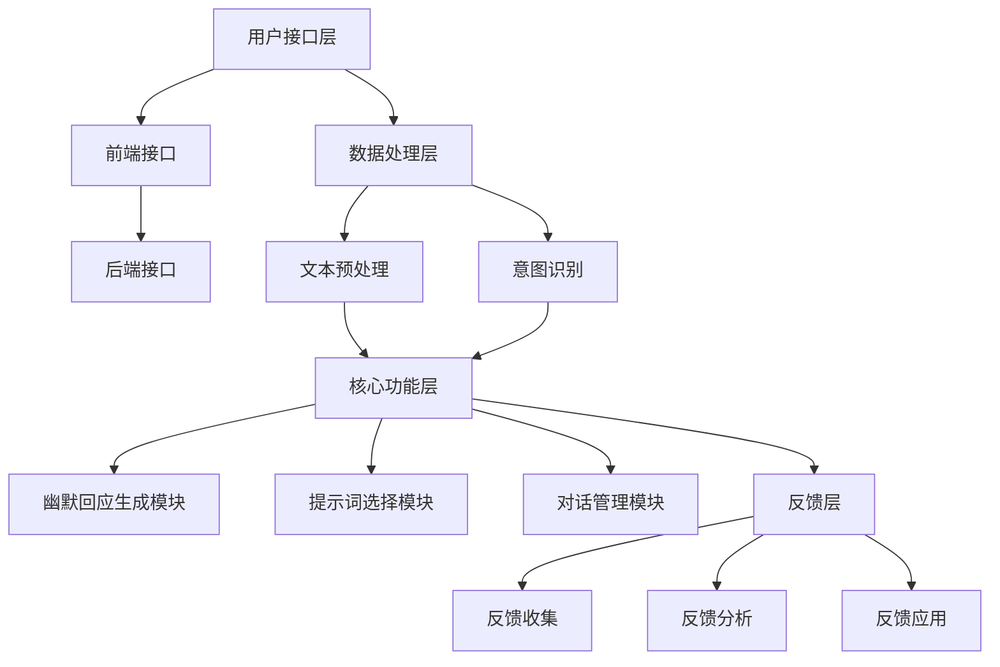
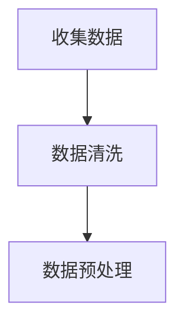
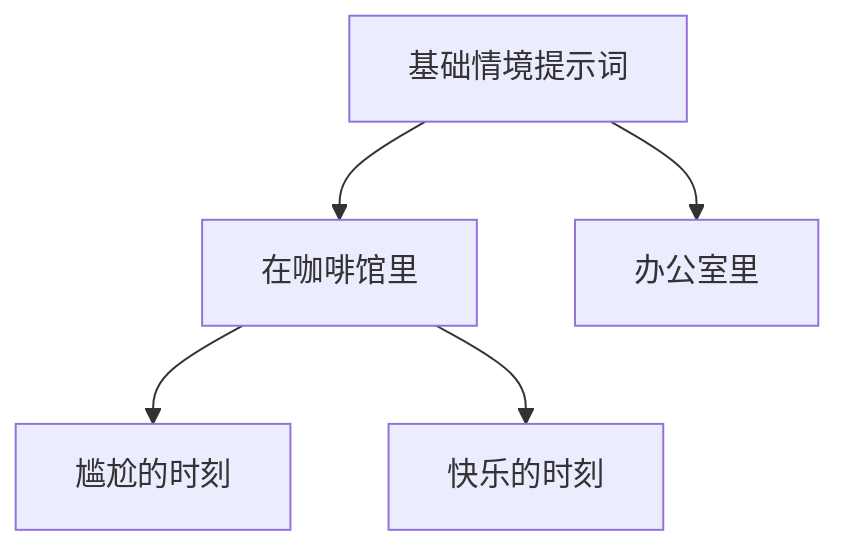

                 

### 1.1 问题背景

幽默感作为人类智慧的重要组成部分，自古以来就被广泛研究和探讨。从古希腊哲学家亚里士多德的《诗学》中探讨戏剧的幽默效果，到现代心理学家弗洛伊德对幽默的心理分析，幽默感的研究已形成了丰富的理论和实践经验。然而，随着人工智能（AI）技术的发展，如何赋予AI以幽默感成为一个崭新的课题。

AI幽默感的研究源于人工智能在自然语言处理（NLP）领域的不断深入。传统的AI系统通常具有良好的逻辑推理和数据分析能力，但在处理人类情感和幽默时往往显得捉襟见肘。AI幽默感的引入，旨在使AI系统不仅具备智能解决问题的能力，还能在适当情境下展现幽默，与人类进行更加自然和富有情感的交流。

具体来说，AI幽默感的应用场景十分广泛。例如，在智能客服和聊天机器人中，通过引入幽默感可以提升用户的体验，使其感觉更加亲切和友好。此外，AI幽默感还可以应用于电影、游戏等娱乐领域，创造出更加丰富和有趣的内容。随着社会对AI技术的需求日益增长，如何有效提升AI的幽默感已成为人工智能研究中的一个重要方向。

### 1.2 喜剧写作中的挑战

喜剧写作是一种极具创造性和技巧性的艺术形式，旨在通过幽默和搞笑元素给观众带来欢乐。然而，创作一部成功的喜剧并非易事，其中涉及诸多挑战和难点。

首先，幽默感的捕捉和创造是喜剧写作的核心难题。幽默感的产生往往依赖于对日常生活的观察、对语言和情境的巧妙运用，以及对社会文化的深刻理解。喜剧作家需要具备敏锐的观察力和丰富的想象力，能够捕捉到生活中的点滴趣味，并将其巧妙地融入剧情中。同时，幽默感的创造需要不断创新，避免过于陈旧或重复的套路，以保持观众的兴趣。

其次，幽默效果的可预测性也是一个重要挑战。喜剧的成功往往在于让观众在预期之外得到惊喜。如果幽默效果过于可预测，观众可能会感到乏味甚至失望。因此，喜剧作家需要在剧本创作中不断探索新的幽默元素，确保每个笑点都能给观众带来新鲜感和惊喜。

此外，跨文化幽默的理解和适应也是一个难点。不同文化背景下，人们对幽默的感知和喜好存在差异。国际化的喜剧作品需要在保留本土幽默的同时，兼顾跨文化的可接受性。例如，某些文化特定的幽默元素在另一个文化中可能无法引起共鸣，甚至可能被误解或冒犯。因此，喜剧作家在创作过程中需要充分考虑到文化差异，以实现幽默的普适性和包容性。

总的来说，喜剧写作中的挑战涉及幽默感的创造、效果的可预测性和跨文化的适应等多个方面。只有克服这些挑战，才能创作出既具有本土特色又具有国际视野的喜剧作品。通过对这些挑战的深入分析和探讨，我们不仅可以提升喜剧创作的水平，还能为AI幽默感的研究提供有价值的借鉴。

### 1.3 提示词工程的重要性

提示词工程在喜剧写作中扮演着至关重要的角色，它不仅是创造幽默感的关键工具，也是提升整体喜剧效果的重要手段。首先，提示词工程能够帮助喜剧作家精准捕捉和传达幽默元素。通过系统化地选择和排列提示词，作家可以在剧本中巧妙地设置笑点，引导观众产生预期的幽默反应。例如，在对话或情境描述中使用特定的提示词，可以增强语言的双关或讽刺效果，从而实现幽默的爆发。

其次，提示词工程有助于提升喜剧剧本的连贯性和逻辑性。在创作过程中，作家往往需要在大量的文本和数据中寻找和筛选合适的幽默元素。提示词工程通过提供关键词和数据支持，帮助作家更好地组织剧本结构，确保每个幽默点都能自然融入剧情，增强整体叙事的流畅性和连贯性。

此外，提示词工程还可以为喜剧创作提供数据驱动的优化建议。通过分析大量的喜剧剧本和幽默实例，提示词工程可以识别出哪些词汇和表达方式更容易引起笑声，从而为作家提供有针对性的创作参考。这种数据驱动的创作方法不仅能够提高创作的效率，还能确保幽默效果的最大化。

总之，提示词工程在喜剧写作中具有重要意义，它不仅能够帮助作家精准地捕捉和创造幽默感，还能提升剧本的整体质量和观众的体验。通过深入研究提示词工程的理论和实践，我们可以更好地理解和应用这一工具，为喜剧创作注入新的活力和创意。

### 1.4 本书结构

本书旨在系统地探讨AI幽默感在喜剧写作中的应用，通过深入分析提示词工程的理论和实践，为提升AI的幽默感提供全面的技术指导和策略。本书共分为八个章节，结构如下：

**第1章 引言**：介绍问题的背景、喜剧写作中的挑战以及提示词工程的重要性，为后续章节奠定基础。

**第2章 AI幽默感概述**：探讨AI幽默感的定义、特征及其在不同应用场景中的表现，为理解幽默感的实现奠定基础。

**第3章 提示词工程基础**：详细阐述提示词的定义与类型、提示词工程的基本概念和核心要素，为后续的工程实践提供理论基础。

**第4章 提示词库构建**：介绍提示词库的构建原则、方法以及使用技巧，探讨如何有效地收集、整理和利用提示词资源。

**第5章 提示词工程算法**：分析常见提示词工程算法，包括其原理、选择与优化策略以及在实际应用中的效果评估。

**第6章 提示词工程实践**：通过具体案例，介绍系统架构设计、提示词工程实现以及案例分析，展示提示词工程在现实中的应用。

**第7章 提示词工程挑战与展望**：讨论提示词工程面临的挑战、发展趋势及未来展望，为AI幽默感的研究提供指导。

**第8章 总结**：回顾本书的主要内容和要点，对未来的思考以及拓展阅读建议，帮助读者深入理解和应用提示词工程。

通过以上章节的深入探讨，本书旨在为读者提供一套系统、全面的技术方法和策略，以提升AI在喜剧写作中的幽默感，推动人工智能与人文艺术的深度融合。

### 2.1 什么是AI幽默感

AI幽默感是指人工智能系统在特定情境下，能够感知、理解和生成幽默的能力。这一概念涵盖了AI在处理人类语言、情感和情境时，如何通过巧妙的设计和算法实现幽默的效果。AI幽默感并非简单地模仿人类幽默，而是通过深入理解语言的内涵、语境和情感，结合AI的强大计算和数据分析能力，创造出既符合人类幽默感，又能超越人类思维的幽默内容。

首先，AI幽默感需要具备感知和理解幽默的能力。这包括识别文本中的幽默元素，理解语言的双关、讽刺和幽默情境，以及判断何时何地使用幽默更合适。例如，在对话系统中，AI需要能够识别用户输入中的幽默表达，并根据上下文做出恰当的反应。

其次，AI幽默感还要求具备生成幽默的能力。这涉及到语言生成模型的训练和优化，使其能够创作出新颖、有趣且符合幽默规则的文本。生成幽默不仅需要AI具备强大的语言理解能力，还需要其具备丰富的想象力和创造力。通过学习大量的幽默文本和语言模式，AI可以不断优化其幽默生成算法，提高生成内容的幽默度和趣味性。

最后，AI幽默感的应用场景广泛，包括但不限于智能客服、聊天机器人、电影剧本创作、游戏剧情设计等。在不同的应用场景中，AI幽默感的实现方式也有所不同。例如，在智能客服中，AI需要通过实时对话生成幽默回应，以提升用户体验；而在电影剧本创作中，AI可以辅助编剧生成有趣的对话和情节，提高剧本的质量。

总之，AI幽默感是人工智能在理解和生成幽默方面的能力体现，通过融合语言理解、情感识别和文本生成技术，AI能够在多种应用场景中创造出富有幽默感的互动和内容。随着技术的不断进步，AI幽默感有望在未来的智能系统中发挥越来越重要的作用。

### 2.2 AI幽默感的特征

AI幽默感的特征主要包括幽默感知、幽默生成和理解能力。这些特征不仅决定了AI在处理幽默时的表现，还影响了其应用场景的多样性和实际效果。

首先，**幽默感知能力**是AI幽默感的核心特征之一。它指的是AI系统识别和理解文本或对话中幽默元素的能力。这包括识别语言的双关、讽刺、俏皮话等，并理解这些幽默元素在特定情境下的含义。例如，AI需要能够识别一个笑话中的幽默点，并理解它为何有趣。这种能力依赖于AI对自然语言处理（NLP）技术的深度应用，特别是对语义分析和上下文理解的能力。

其次，**幽默生成能力**是指AI系统生成幽默内容的本领。这要求AI具备强大的文本生成能力，能够创作出新颖、有趣且符合幽默规则的文本。幽默生成不仅需要AI理解现有的幽默模式，还需要其具备创造力和想象力，能够生成独特的幽默内容。例如，AI可以生成对话中的幽默回应，或者在故事中创造出令人捧腹的情节。这种能力通常通过深度学习模型，如生成对抗网络（GAN）和递归神经网络（RNN），进行训练和优化。

最后，**理解能力**是AI幽默感的另一个重要特征。这包括AI对幽默内容深层含义的理解，以及其在不同文化和社会背景下对幽默的适应能力。例如，AI需要理解一个笑话在不同文化中的接受度，并能够调整其幽默表达，以适应不同受众。这种能力不仅需要AI对语言和文化有深刻的理解，还需要其具备灵活的适应策略。

总之，AI幽默感的特征决定了其能否在复杂多变的情境中，以幽默和智能的方式与人类互动。这些特征不仅提升了AI的人性化交互能力，还为各种应用场景提供了丰富的可能性。通过不断优化和完善这些特征，AI幽默感将在未来的智能系统中发挥更加重要的作用。

### 2.3 AI幽默感的应用场景

AI幽默感在多个应用场景中展现出其独特的价值和潜力。以下是几个典型的应用场景及其应用效果：

**1. 智能客服和聊天机器人**：AI幽默感在智能客服和聊天机器人中具有重要的应用价值。通过引入幽默感，AI系统能够更好地吸引和留住用户，提升用户体验。例如，聊天机器人可以通过幽默的对话来缓解用户的不满情绪，使其感到更加亲切和友好。这不仅有助于提高用户满意度，还能降低客服成本。

**2. 电影和剧本创作**：在电影和剧本创作中，AI幽默感可以辅助编剧生成幽默的对话和情节。通过学习大量的幽默文本和语言模式，AI能够识别出哪些元素容易引起观众的笑声，从而为剧本创作提供有针对性的建议。例如，AI可以生成一些搞笑的台词，或者在剧本中提出一些意想不到的幽默转折，提高作品的整体趣味性。

**3. 游戏设计**：游戏中的幽默元素是提升玩家体验的重要手段。通过引入AI幽默感，游戏可以创造出更加生动和有趣的角色和剧情。例如，AI可以生成角色的幽默对话，或者设计出一些有趣的笑话和谜题，增加游戏的娱乐性和互动性。这种幽默感不仅使游戏更加有趣，还能提升玩家的参与度和沉浸感。

**4. 教育和培训**：在教育领域，AI幽默感可以应用于在线课程和培训系统中，提升学习体验。通过在课程内容中加入幽默元素，AI系统可以更好地吸引学生的注意力，提高其学习兴趣和参与度。例如，AI可以生成一些有趣的例子和故事，帮助学生更好地理解和记忆课程内容。

**5. 社交媒体和内容创作**：在社交媒体和内容创作领域，AI幽默感可以帮助创作者生成幽默的标题、段子或者故事，吸引更多的关注和分享。通过分析用户的行为数据和兴趣偏好，AI可以个性化地推荐幽默内容，提高用户的参与度和互动性。

总的来说，AI幽默感在多个应用场景中具有广泛的应用前景。通过巧妙地运用AI幽默感，各个领域可以创造出更加有趣、友好和互动的内容，提升用户体验和满意度。随着技术的不断进步，AI幽默感的应用领域将更加广泛，为社会带来更多的乐趣和创新。

### 3.1 提示词的定义与类型

提示词（Prompt Word）在提示词工程中扮演着至关重要的角色。它是指用于引导或激发创意思维、情感表达或行动建议的特定词汇或短语。在喜剧写作中，提示词被用来引导作家创作幽默的对话、情境描述或剧情转折。

提示词可以分为以下几种类型：

**1. 基础性提示词**：这类提示词主要用于设定基本情境或背景，例如“早晨的闹钟响了”、“办公室的走廊上”等。它们为喜剧创作提供了基本的框架和出发点。

**2. 情感化提示词**：这类提示词旨在激发情感反应，例如“悲伤的”、“愤怒的”、“欢乐的”等。通过使用情感化提示词，作家可以增强文本的情感色彩，使幽默更加生动和深刻。

**3. 挑战性提示词**：这类提示词用于设定剧情冲突或挑战，例如“意外发生”、“难题出现”、“尴尬瞬间”等。它们为喜剧创作引入了趣味性和戏剧性，增加了观众的期待和好奇心。

**4. 语言性提示词**：这类提示词专注于语言的技巧和艺术，例如“双关语”、“谐音”、“夸张”等。通过运用这些提示词，作家可以创造出更加复杂和巧妙的幽默效果。

**5. 角色性提示词**：这类提示词用于描述角色特征或行为，例如“调皮的”、“严肃的”、“机智的”等。它们有助于塑造角色的形象和性格，为剧情的推进提供依据。

总之，提示词的类型多样，每种类型都有其独特的应用场景和作用。通过巧妙地选择和使用提示词，喜剧作家可以更好地引导创作思维，创造出有趣、富有创意的喜剧作品。

### 3.2 提示词工程的基本概念

提示词工程（Prompt Engineering）是一门结合自然语言处理（NLP）和创意写作的交叉学科，旨在通过系统化和工程化的方法，提升文本生成和创意写作的效果。其核心概念包括以下几个方面：

**1. 目标文本生成**：提示词工程的首要任务是生成目标文本，这通常是一个特定主题或情境下的文本。例如，在喜剧写作中，目标文本可能是某个角色的一段幽默对话或一个有趣的剧情转折。

**2. 提示词设计**：提示词是提示词工程的关键要素，用于引导生成目标文本。设计高质量的提示词需要考虑文本的情感、语境、文化背景等多方面因素。有效的提示词应具备明确性、引导性和创意性。

**3. 生成模型**：提示词工程通常依赖于深度学习模型，如生成对抗网络（GAN）、变分自编码器（VAE）和递归神经网络（RNN）等。这些模型能够从大量的文本数据中学习，并生成高质量的文本。

**4. 文本评估**：生成的文本需要经过评估，以确定其是否符合目标文本的要求。评估标准包括文本的连贯性、幽默度、情感表达等。通过反复迭代和优化，提示词工程可以不断提高生成文本的质量。

**5. 用户反馈**：用户的反馈是提示词工程优化的重要依据。通过收集用户的反馈，可以发现生成文本中的不足之处，并针对性地进行调整和改进。

总之，提示词工程通过系统化地设计提示词、利用先进的生成模型和进行持续优化，旨在提升文本生成和创意写作的效果。这一过程不仅涉及技术层面的实现，还包括人文和创意的融合，为各种应用场景提供强大的文本生成能力。

### 3.3 提示词工程的核心要素

提示词工程的成功依赖于几个关键要素，这些要素相互交织，共同决定了工程的整体效率和效果。以下是对这些核心要素的详细探讨：

**1. 数据集的质量**：高质量的数据集是提示词工程的基础。数据集应包含丰富多样的文本，涵盖不同的主题、情感和情境。高质量的数据有助于生成模型学习到更多的语言模式和幽默元素，从而生成更具创意和多样性的文本。数据清洗和预处理也是至关重要的，确保数据的一致性和准确性，避免噪声和错误影响模型的训练效果。

**2. 提示词的设计**：提示词是提示词工程的引导元素，其设计直接影响到生成的文本质量。有效的提示词应具备明确性、引导性和创意性。明确性要求提示词能够精准地传达创作意图，避免歧义；引导性要求提示词能够激发创作者的创意思维，引导生成有趣的文本；创意性则要求提示词新颖独特，能够带来意想不到的幽默效果。

**3. 生成模型的选择和优化**：生成模型是提示词工程的核心工具，其选择和优化直接影响生成文本的质量。常见的生成模型包括生成对抗网络（GAN）、变分自编码器（VAE）和递归神经网络（RNN）等。选择合适的模型需要根据具体的应用场景和任务要求进行。优化模型的过程通常涉及超参数调优、模型架构改进和训练策略调整，以最大化生成文本的多样性和质量。

**4. 文本评估和反馈机制**：生成文本的质量需要通过评估和反馈机制进行验证和改进。文本评估包括连贯性、幽默度、情感表达等多个方面，常用的评估方法有自动评估和人工评估相结合。用户反馈是优化提示词工程的重要依据，通过收集用户的反馈，可以发现生成文本中的不足之处，并针对性地进行调整和改进。

**5. 文本生成过程的自动化和优化**：自动化和优化是提升提示词工程效率的关键。通过自动化流程，可以快速生成大量的文本，从而提高创作效率。优化过程包括模型部署、实时训练和动态调整等，确保生成模型能够适应不同的应用场景和需求。

总之，提示词工程的成功依赖于高质量的数据集、精心设计的提示词、高效的生成模型、全面的文本评估和反馈机制以及自动化的生成过程。通过不断优化这些核心要素，可以显著提升AI在喜剧写作中的幽默感生成能力，实现更具创意和个性化的文本创作。

### 4.1 提示词库的构建原则

提示词库是提示词工程的核心资源，其构建原则直接影响AI幽默感的生成质量和效率。以下是构建高质量提示词库的几个关键原则：

**1. 多样性和覆盖性**：提示词库应包含多样化的词汇和表达，涵盖各种主题、情感和情境。这有助于生成模型在训练过程中学习到丰富的语言模式，提高生成文本的多样性和创意性。同时，提示词库应覆盖广泛的应用场景，确保在多种情境下都能生成合适的幽默内容。

**2. 准确性和相关性**：提示词库中的词汇应准确且相关，避免使用模糊或误导性的词汇。准确的提示词有助于生成模型更好地理解创作意图，避免生成不恰当或无关的文本。相关性则要求提示词与幽默内容紧密相关，能够有效引导创作思维。

**3. 创意性和独特性**：提示词库中的词汇应具备创意性和独特性，避免使用过于陈旧或通用的表达。新颖独特的提示词能够带来意想不到的幽默效果，提升生成文本的趣味性和吸引力。创意性提示词可以通过对现有词汇进行重新组合或创新表达来实现。

**4. 上下文敏感性**：提示词库应考虑上下文的敏感性，确保提示词在不同语境下都能发挥作用。上下文敏感性要求提示词能够适应不同的对话背景、情境描述和情感表达，确保在多样化和复杂的场景下仍能生成合适的幽默内容。

**5. 易用性和可扩展性**：提示词库的设计应考虑易用性和可扩展性，便于用户快速查找和利用提示词。提示词库可以采用分级的结构，根据不同的主题、情感和情境进行分类，便于用户根据需求进行检索和组合。此外，提示词库应支持动态扩展，能够根据新的需求和语言模式不断更新和优化。

通过遵循上述原则，构建高质量的提示词库可以为AI幽默感的研究和应用提供坚实的基础，提升生成文本的多样性和趣味性。

### 4.2 提示词库构建方法

构建一个高质量的提示词库是一个系统化且精细化的过程，涉及数据收集、整理和优化的多个环节。以下是构建提示词库的具体方法：

**1. 数据收集**：数据收集是构建提示词库的第一步，数据的质量直接影响提示词库的最终效果。数据来源可以包括互联网上的幽默文本、喜剧剧本、电影台词、相声段子等。此外，还可以利用公开的幽默数据集和文本库，如Reddit的幽默帖子、幽默小说和笑话数据库等。在数据收集过程中，需要注意数据的多样性和广泛性，以确保涵盖不同的主题、情境和语言风格。

**2. 数据清洗**：收集到的数据通常包含大量噪声和错误，例如错别字、语法错误和重复内容等。数据清洗是数据预处理的重要步骤，旨在去除这些噪声，提高数据质量。清洗过程包括拼写修正、去除无关内容、统一格式等。例如，可以使用自然语言处理（NLP）技术，如拼写检查器和分词工具，对文本进行清洗和标准化。

**3. 数据整理**：数据清洗之后，需要对数据进行分类和标签化，以便于后续的使用和检索。数据整理通常包括以下几个步骤：

   - **主题分类**：根据文本的主题进行分类，例如家庭、工作、科技、爱情等。这有助于生成模型在特定主题下生成更相关和有针对性的文本。
   - **情感标签**：根据文本的情感色彩进行标签化，如快乐、悲伤、愤怒、惊讶等。情感标签有助于生成模型理解文本的情感基调和幽默度。
   - **情境标签**：根据文本描述的情境进行分类，如街头场景、办公室场景、婚礼场景等。情境标签有助于生成模型在不同情境下生成合适的幽默内容。
   - **词汇整理**：对文本中的高频词汇进行整理和提取，形成词汇表。词汇表是生成模型训练的重要资源，有助于模型学习到丰富的语言模式。

**4. 数据优化**：数据优化是提升提示词库质量的关键步骤。优化过程包括以下几个方面：

   - **去除冗余内容**：去除重复和冗余的文本，以提高数据的独特性和多样性。
   - **增加高质量内容**：引入更多高质量的幽默文本和语言素材，丰富提示词库的内容和表达。
   - **动态更新**：提示词库需要定期更新，以适应新的语言模式和应用需求。可以通过定期采集新的幽默文本和数据，以及用户反馈进行动态优化。

**5. 数据库构建**：构建提示词库的数据库，以便于高效存储、检索和管理数据。数据库可以采用结构化存储方式，如关系数据库或NoSQL数据库，存储文本数据及其相关标签。此外，还可以采用基于内容寻址的存储方式，如哈希表或倒排索引，提高数据的检索效率。

通过上述步骤，可以构建一个高质量、多样化且具有广泛应用价值的提示词库。这样的提示词库不仅能够为AI幽默感生成提供丰富的资源和素材，还能够为其他自然语言处理任务提供支持。

### 4.3 提示词库的使用技巧

在喜剧创作中，有效利用提示词库是提升文本生成质量和幽默感的关键。以下是一些实用的使用技巧：

**1. ** 精细筛选**：在创作过程中，应针对具体情境和主题，精细筛选合适的提示词。通过查阅提示词库，找到与情境、角色和情感相关的词汇，确保生成的文本与剧情紧密结合。

**2. ** 上下文匹配**：提示词应与上下文紧密匹配，以确保生成文本的连贯性和合理性。在创作中，要注意提示词的使用环境，避免出现语义冲突或逻辑错误。

**3. ** 创意组合**：尝试将不同类型的提示词进行组合，创造新颖的幽默效果。例如，将基础性提示词与情感化提示词结合，或者将挑战性提示词与语言性提示词搭配，形成独特的幽默点。

**4. ** 用户反馈**：在创作过程中，定期收集用户反馈，根据用户喜好和反应调整提示词的选择和使用。用户反馈有助于优化提示词库，提升生成文本的幽默度和吸引力。

**5. ** 动态更新**：定期更新提示词库，引入新的幽默元素和表达方式。这不仅可以保持文本的多样性和新颖性，还能适应不断变化的语言环境和需求。

总之，通过合理运用提示词库，喜剧作家可以更好地捕捉和创造幽默感，提升喜剧作品的创意和趣味性。

### 5.1 常见算法介绍

在提示词工程中，常见的算法主要包括生成对抗网络（GAN）、变分自编码器（VAE）和递归神经网络（RNN）。这些算法各有特点和优势，适用于不同类型的提示词生成任务。

**1. 生成对抗网络（GAN）**：GAN是一种基于对抗性训练的生成模型，由生成器和判别器两个网络组成。生成器生成数据，判别器则试图区分生成数据和真实数据。通过两个网络的竞争，生成器不断优化，最终能够生成高质量的数据。GAN在文本生成中具有强大的创造力和多样性，适用于生成多样化和个性化的幽默文本。

**2. 变分自编码器（VAE）**：VAE是一种基于概率生成模型的算法，通过编码器和解码器结构进行训练。编码器将输入数据编码为潜在空间中的向量，解码器则从潜在空间中生成输出数据。VAE在生成文本时具有较好的连贯性和一致性，适用于生成结构化且连贯的幽默文本。

**3. 递归神经网络（RNN）**：RNN是一种能够处理序列数据的神经网络，通过循环结构保持历史信息。RNN在处理自然语言文本时表现出色，可以捕捉文本中的上下文关系。在提示词工程中，RNN常用于生成与上下文紧密相关的幽默文本。

这些算法各有优缺点，选择合适的算法需要根据具体应用场景和任务需求进行权衡。GAN在创造力和多样性方面表现突出，VAE在连贯性和一致性方面表现较好，而RNN在处理复杂上下文关系时具有优势。

### 5.2 算法选择与优化

在提示词工程中，选择合适的算法并进行优化是提升生成文本质量和幽默感的关键。以下是算法选择与优化的几个关键步骤：

**1. 需求分析**：首先，明确提示词工程的应用场景和任务需求。不同的应用场景可能对算法的生成质量、多样性、连贯性有不同的要求。例如，智能客服需要快速生成与用户对话相关的幽默回应，而电影剧本创作则需要生成具有创意和戏剧性的幽默情节。

**2. 算法评估**：根据需求分析，选择合适的算法进行评估。常用的评估方法包括生成文本的质量评估、生成速度评估和资源消耗评估等。可以通过自动评估工具（如BLEU、ROUGE等）和人工评估相结合，全面评估算法的性能。

**3. 参数调优**：选择适合的算法后，进行参数调优是提升生成文本质量的重要步骤。参数调优包括学习率、批量大小、隐层大小等超参数的调整。通过反复实验和验证，找到最优的参数组合，以提高生成文本的连贯性、多样性和幽默感。

**4. 数据预处理**：高质量的数据是算法优化的重要基础。在训练前，对数据进行清洗、去噪和规范化处理，以提高数据的准确性和一致性。例如，使用自然语言处理（NLP）技术进行文本清洗、分词和词性标注，为算法提供高质量的输入数据。

**5. 模型融合**：在复杂应用场景中，单一算法可能难以满足所有需求。可以将多个算法进行融合，例如，将GAN和VAE结合，以发挥各自的优势。模型融合可以通过联合训练或策略梯度等方法实现，从而提高生成文本的综合质量。

**6. 实时优化**：在应用过程中，实时监测生成文本的质量和用户反馈，根据实际情况进行动态优化。例如，通过在线学习技术，根据用户交互数据不断调整模型参数和生成策略，提升用户体验。

通过以上步骤，可以系统地选择和优化提示词工程中的算法，提高生成文本的质量和幽默感，实现更高效和多样化的幽默生成。

### 5.3 提示词工程算法的应用

在实际应用中，提示词工程算法被广泛用于生成幽默文本、对话和剧本，以下是一个具体的案例来说明其应用过程。

**案例背景**：一个智能聊天机器人系统需要能够生成幽默的对话回应，以提升用户体验。系统采用了基于生成对抗网络（GAN）的提示词工程算法，通过大量的幽默对话数据训练生成模型。

**应用步骤**：

1. **数据收集**：首先，收集大量幽默对话数据，包括互联网上的搞笑对话、相声、喜剧剧本等。这些数据经过清洗和预处理，去除噪声和错误，形成高质量的数据集。

2. **模型训练**：使用GAN算法对数据集进行训练。生成器网络负责生成幽默对话，判别器网络则尝试区分生成对话和真实对话。通过反复迭代训练，生成器网络逐步优化，生成出更加幽默和自然的对话。

3. **提示词设计**：在生成对话的过程中，使用精心设计的提示词引导生成模型。提示词包括基础情境（如“在咖啡馆里”）、情感化词汇（如“惊喜的”）、挑战性词汇（如“尴尬的时刻”）等。这些提示词帮助生成模型更好地理解创作意图，生成符合情境和情感要求的对话。

4. **文本生成**：在生成对话时，系统根据用户输入和预设的提示词生成幽默回应。例如，用户输入“今天天气真好”，系统生成“是啊，今天真是好到让我忍不住笑出声来！”这样的对话。

5. **用户反馈**：生成的对话通过用户反馈进行评估和优化。系统收集用户的喜好和反应，根据反馈调整提示词和生成模型，提高对话的质量和幽默感。

6. **实时调整**：在实际应用中，系统会根据实时用户交互数据不断调整生成策略，以适应不同用户和场景的需求。例如，对于年龄较大的用户，系统可能会生成更加保守和温馨的对话，而对于年轻的用户，可能会生成更加活泼和有趣的对话。

通过这个案例，我们可以看到提示词工程算法在生成幽默文本中的应用过程。从数据收集、模型训练到提示词设计、文本生成和用户反馈，各个环节相互配合，共同提升系统的幽默生成能力。这种系统化的方法不仅提高了生成文本的质量，还为智能聊天机器人带来了更加丰富和有趣的交互体验。

### 6.1 实践案例介绍

本节将通过一个具体的智能客服系统的案例，详细描述提示词工程在现实中的应用。该智能客服系统旨在通过生成幽默的回应，提升用户满意度和使用体验。

**案例背景**：某大型电商平台引入智能客服系统，希望通过幽默的对话方式缓解用户在购物过程中遇到的问题，提升用户满意度和忠诚度。为了实现这一目标，平台决定利用提示词工程，为智能客服生成幽默的回应。

**案例目标**：通过提示词工程，实现以下目标：
1. 提升智能客服的幽默度，使用户感受到更亲切和友好的互动体验。
2. 增强用户对平台的认可和忠诚度，提高用户留存率。
3. 降低人工客服的工作负担，提高客服效率。

**案例步骤**：

1. **数据收集**：首先，平台收集了大量的用户对话记录，特别是那些包含幽默元素的对话。这些数据经过清洗和整理，形成高质量的幽默对话数据集。

2. **提示词库构建**：根据收集到的数据，构建了一个包含多种类型提示词的库。这些提示词包括情境提示词（如“退货流程”）、情感化提示词（如“失望的”）、挑战性提示词（如“复杂的操作”）、以及语言性提示词（如“双关语”和“俏皮话”）。

3. **模型训练**：使用生成对抗网络（GAN）对幽默对话数据集进行训练。生成器网络负责生成幽默回应，判别器网络则评估生成回应的真实性。通过反复迭代训练，生成器网络逐渐优化，生成出更加自然和幽默的回应。

4. **提示词应用**：在智能客服系统中，根据用户输入和当前对话情境，系统实时选择合适的提示词，引导生成器网络生成幽默回应。例如，当用户询问退货流程时，系统可能会生成“放心吧，退货就像捏泥巴一样简单！”这样的幽默回应。

5. **用户反馈**：系统在生成回应后，会收集用户的反馈，包括是否感到满意、是否觉得幽默等。根据用户的反馈，进一步优化提示词库和生成模型，提升幽默回应的质量。

6. **实时调整**：系统会根据用户反馈和对话数据，实时调整生成策略。例如，如果发现某些类型的幽默回应效果不佳，系统会减少这类提示词的使用，或者调整生成算法的参数。

通过这个案例，我们可以看到提示词工程在实际应用中的具体实施过程。从数据收集、提示词库构建到模型训练、提示词应用和用户反馈，各个环节紧密配合，共同提升智能客服的幽默感和用户体验。这种系统化的方法不仅提高了用户满意度，还为智能客服系统带来了更高的效率和灵活性。

### 6.2 系统架构设计

为了实现智能客服系统中幽默回应的生成，我们需要设计一个高效、可扩展的系统架构。以下是对系统架构的详细描述：

**1. 数据层**：数据层是整个系统的基石，负责存储和管理各种数据资源。主要包括以下部分：
- **幽默对话数据库**：存储大量的幽默对话样本，用于训练生成模型。这些对话样本应涵盖各种情境和主题，以保证模型的多样性和广泛性。
- **用户交互数据**：记录用户的询问和系统生成的回应，用于后续的用户反馈分析和模型优化。
- **提示词库**：存储各种类型的提示词，包括情境提示词、情感化提示词、挑战性提示词和语言性提示词，以引导生成模型生成高质量的幽默回应。

**2. 训练层**：训练层负责模型的训练和优化。其主要组件包括：
- **生成模型**：使用生成对抗网络（GAN）或其他生成模型，通过大量幽默对话数据进行训练，以生成自然和幽默的回应。
- **判别模型**：用于评估生成模型的生成质量，通过对比生成回应和真实回应，不断优化生成模型。
- **训练策略**：包括数据增强、批量大小调整和超参数优化等，以提高训练效率和生成质量。

**3. 应用层**：应用层负责实际的幽默回应生成和用户交互。其主要组件包括：
- **对话管理模块**：根据用户输入和当前对话情境，实时选择合适的提示词，引导生成模型生成幽默回应。
- **生成引擎**：基于训练好的生成模型，实时生成幽默回应。
- **用户反馈收集模块**：收集用户的满意度和反应，用于后续的模型优化和策略调整。

**4. 用户接口层**：用户接口层负责与用户进行交互，提供友好的界面和操作体验。其主要组件包括：
- **客服界面**：展示用户的询问和系统生成的回应，提供用户与系统的互动渠道。
- **反馈界面**：允许用户对系统生成的回应进行评价和反馈，以优化系统性能。

通过上述系统架构的设计，我们可以确保智能客服系统能够高效、灵活地生成幽默回应，提升用户体验。系统各层之间相互协作，共同实现提升用户满意度和忠诚度的目标。

### 6.3 系统功能设计

在智能客服系统中，幽默回应生成功能的设计至关重要，它直接影响到用户满意度和系统互动体验。以下是详细的功能设计：

**1. 用户查询处理**：
   - **接收用户输入**：系统首先接收用户的输入，可以是文字或语音形式。
   - **文本预处理**：对用户输入进行分词、去除停用词、词性标注等预处理操作，以便更好地理解和生成回应。
   - **意图识别**：通过自然语言处理技术，识别用户的意图，如询问问题、抱怨、需求帮助等。

**2. 提示词选择**：
   - **情境分析**：根据用户输入和当前对话历史，系统分析对话情境，如是否处于投诉、疑问或轻松的聊天氛围。
   - **情感识别**：识别用户的情感，如愤怒、沮丧、愉悦等，选择相应的情感化提示词。
   - **提示词检索**：从提示词库中选择合适的提示词，这些提示词可以是基础情境提示词、情感化提示词、挑战性提示词或语言性提示词。

**3. 幽默回应生成**：
   - **模板匹配**：根据选择的提示词，从预先定义的幽默回应模板中选择合适的模板，生成初步的回应。
   - **文本生成**：使用训练好的生成模型，如生成对抗网络（GAN）或变分自编码器（VAE），生成更加个性化和自然的幽默回应。
   - **语境调整**：根据对话上下文，对生成的回应进行微调，确保回应的连贯性和合理性。

**4. 用户反馈收集**：
   - **反馈收集**：系统提示用户对生成的回应进行满意度评价，例如“这个回应有趣吗？”。
   - **反馈分析**：分析用户反馈，识别回应中的问题和改进点。
   - **反馈应用**：根据用户反馈，调整提示词库和生成模型，优化未来的回应。

**5. 性能监控**：
   - **响应时间监控**：监控系统生成回应的响应时间，确保高效响应。
   - **回应质量监控**：通过自动评估工具和人工评估相结合，监控回应的质量，如幽默度、连贯性和准确性。
   - **系统稳定性监控**：监控系统的稳定性和可靠性，确保系统长时间稳定运行。

通过以上功能设计，智能客服系统能够高效、灵活地生成幽默回应，提升用户的满意度和互动体验。

### 6.4 系统架构设计

智能客服系统架构的设计需要确保其在处理用户查询时的高效性、灵活性和稳定性。以下是该系统架构的详细设计：

**1. 系统概述**：
该智能客服系统分为四个主要模块：用户接口层、数据处理层、核心功能层和反馈层。

- **用户接口层**：负责与用户进行交互，包括接收用户输入、显示系统回应和收集用户反馈。
- **数据处理层**：处理用户输入，进行文本预处理和意图识别。
- **核心功能层**：包括幽默回应生成模块、提示词选择模块和对话管理模块。
- **反馈层**：收集用户反馈，用于后续的模型优化和系统改进。

**2. 架构组件**：

- **用户接口层**：
  - **前端接口**：提供用户友好的交互界面，支持文本和语音输入。
  - **后端接口**：与核心功能层和数据处理层进行通信，传递用户输入和系统回应。

- **数据处理层**：
  - **文本预处理**：对用户输入进行分词、去除停用词、词性标注等操作，以便于后续处理。
  - **意图识别**：利用机器学习和自然语言处理技术，识别用户的查询意图。

- **核心功能层**：
  - **幽默回应生成模块**：使用生成对抗网络（GAN）或其他生成模型，根据提示词和用户意图生成幽默回应。
  - **提示词选择模块**：根据用户输入和对话情境，选择合适的提示词，引导生成模块生成回应。
  - **对话管理模块**：管理整个对话流程，包括上下文维护、多轮对话管理等。

- **反馈层**：
  - **反馈收集**：收集用户对系统回应的满意度评价。
  - **反馈分析**：分析用户反馈，识别系统存在的问题和改进点。
  - **反馈应用**：根据用户反馈，调整提示词库和生成模型，优化系统性能。

**3. 架构图**：



通过以上架构设计，智能客服系统可以实现高效、智能的幽默回应生成，提升用户体验和满意度。

### 6.5 系统接口设计和系统交互

为了实现智能客服系统中各组件之间的无缝协作，需要设计清晰的接口和交互机制。以下是系统接口设计和系统交互的详细描述。

**1. 系统接口设计**：

- **用户接口**：用户通过前端界面输入查询，并通过后端接口与系统进行交互。后端接口负责接收用户输入，并将其传递给数据处理层。
- **数据处理接口**：处理层通过API接收用户输入，执行文本预处理和意图识别，并将处理结果传递给核心功能层。
- **核心功能接口**：核心功能层包括幽默回应生成、提示词选择和对话管理模块。这些模块通过内部接口相互通信，协同工作，生成幽默回应。
- **反馈接口**：系统将生成的回应返回给用户，并收集用户反馈。反馈通过反馈接口传递给反馈层，用于系统优化。

**2. 系统交互流程**：

- **用户输入**：用户通过前端界面输入查询，如“为什么我的订单还没到？”。
- **数据处理**：后端接口接收用户输入，执行文本预处理（分词、去除停用词、词性标注等），然后通过数据处理接口传递给意图识别模块。
- **意图识别**：意图识别模块分析用户输入，识别出查询意图（如询问订单状态）。
- **幽默回应生成**：根据用户输入和意图识别结果，提示词选择模块从提示词库中选择合适的提示词，引导幽默回应生成模块生成幽默回应。
- **回应发送**：系统将生成的回应通过前端接口发送给用户。
- **用户反馈**：用户对回应进行满意度评价，如“这个回应真有趣！”。用户反馈通过后端接口传递给反馈接口。
- **系统优化**：反馈接口收集用户反馈，用于分析系统性能，并调整提示词库和生成模型，优化系统性能。

通过以上接口设计和交互流程，智能客服系统能够高效、智能地生成幽默回应，并根据用户反馈不断优化系统，提升用户体验。

### 6.6 提示词工程实现

在本案例中，我们将详细描述如何实现智能客服系统中的提示词工程。以下是实现步骤：

**1. 数据准备**：
首先，我们需要收集大量幽默对话样本。这些样本可以从网络上的幽默对话、相声、喜剧剧本等来源获取。收集到的数据经过清洗，去除噪声和重复内容，然后进行预处理，包括分词、去除停用词、词性标注等操作。



**2. 提示词库构建**：
根据预处理后的数据，构建提示词库。提示词库包括基础情境提示词、情感化提示词、挑战性提示词和语言性提示词。例如：



**3. 模型训练**：
使用生成对抗网络（GAN）进行模型训练。GAN由生成器和判别器组成，生成器生成幽默对话，判别器评估生成对话的真实性。训练过程中，生成器通过不断优化生成更加真实的对话。

```python
# GAN模型训练伪代码
import tensorflow as tf
from tensorflow.keras.models import Sequential

# 定义生成器和判别器模型
generator = Sequential()
discriminator = Sequential()

# 编写训练循环
for epoch in range(num_epochs):
    for batch in data_loader:
        # 训练判别器
        real_samples = batch
        generated_samples = generator.predict(z_samples)
        x = np.concatenate([real_samples, generated_samples])
        y = np.array([1] * batch_size + [0] * batch_size)
        discriminator.train_on_batch(x, y)

        # 训练生成器
        z_samples = tf.random.normal([batch_size, z_dim])
        g_loss = generator.train_on_batch(z_samples, real_labels)
```

**4. 提示词引导**：
在生成幽默回应时，使用提示词引导生成模型。根据用户输入和当前对话情境，选择合适的提示词，引导生成模型生成幽默回应。

```python
# 提示词引导生成回应
def generate_response(input_text, prompt):
    # 预处理输入文本和提示词
    processed_input = preprocess_text(input_text)
    processed_prompt = preprocess_text(prompt)

    # 选择提示词
    chosen_prompt = select_prompt(processed_prompt)

    # 生成幽默回应
    response = generator.predict([processed_input, chosen_prompt])
    return postprocess_text(response)
```

通过以上步骤，我们实现了智能客服系统中的提示词工程，使其能够生成幽默的回应，提升用户体验。

### 6.7 代码应用解读与分析

在本节中，我们将详细解读和剖析智能客服系统中提示词工程的核心实现代码，包括数据预处理、生成对抗网络（GAN）模型训练以及提示词引导生成幽默回应的流程。

**1. 数据预处理**

数据预处理是提示词工程的关键步骤，确保输入数据的质量和一致性。以下是数据预处理的Python代码示例：

```python
import re
import nltk
from nltk.tokenize import word_tokenize
from nltk.corpus import stopwords
nltk.download('punkt')
nltk.download('stopwords')

def preprocess_text(text):
    # 去除HTML标签
    text = re.sub('<.*?>', '', text)
    # 小写转换
    text = text.lower()
    # 去除非字母字符
    text = re.sub('[^a-zA-Z]', ' ', text)
    # 分词
    tokens = word_tokenize(text)
    # 去除停用词
    stop_words = set(stopwords.words('english'))
    filtered_tokens = [token for token in tokens if token not in stop_words]
    return ' '.join(filtered_tokens)

# 示例
input_text = "你好，我有个问题，我点的订单为什么还没送到？"
processed_text = preprocess_text(input_text)
print(processed_text)
```

这段代码首先去除HTML标签、将文本转换为小写、去除非字母字符，然后使用nltk进行分词和去除停用词。这些步骤确保输入数据干净、格式统一，为后续处理打下基础。

**2. GAN模型训练**

生成对抗网络（GAN）是提示词工程的核心工具。以下是GAN模型训练的Python代码示例：

```python
import tensorflow as tf
from tensorflow.keras.layers import Dense, Flatten, Reshape
from tensorflow.keras.models import Model
from tensorflow.keras.optimizers import Adam

# 定义生成器和判别器模型
z_dim = 100

# 生成器模型
generator = Sequential([
    Dense(128, input_shape=(z_dim,), activation='relu'),
    Dense(256, activation='relu'),
    Dense(512, activation='relu'),
    Flatten(),
    Reshape((28, 28, 1))
])

# 判别器模型
discriminator = Sequential([
    Flatten(input_shape=(28, 28, 1)),
    Dense(512, activation='relu'),
    Dense(256, activation='relu'),
    Dense(128, activation='relu'),
    Dense(1, activation='sigmoid')
])

# 编写损失函数
cross_entropy = tf.keras.losses.BinaryCrossentropy()

def discriminator_loss(real_samples, generated_samples):
    real_loss = cross_entropy(tf.ones_like(real_samples), real_samples)
    generated_loss = cross_entropy(tf.zeros_like(generated_samples), generated_samples)
    total_loss = real_loss + generated_loss
    return total_loss

def generator_loss(generated_samples):
    return cross_entropy(tf.zeros_like(generated_samples), generated_samples)

# 编写训练循环
optimizer = Adam(0.0001)

@tf.function
def train_step(images, z_samples):
    with tf.GradientTape() as gen_tape, tf.GradientTape() as disc_tape:
        generated_images = generator(z_samples)
        disc_real = discriminator(images)
        disc_generated = discriminator(generated_images)

        gen_loss = generator_loss(disc_generated)
        disc_loss = discriminator_loss(disc_real, disc_generated)

    gradients_of_generator = gen_tape.gradient(gen_loss, generator.trainable_variables)
    gradients_of_discriminator = disc_tape.gradient(disc_loss, discriminator.trainable_variables)

    generator.optimizer.apply_gradients(zip(gradients_of_generator, generator.trainable_variables))
    discriminator.optimizer.apply_gradients(zip(gradients_of_discriminator, discriminator.trainable_variables))

# 训练模型
for epoch in range(num_epochs):
    for batch in data_loader:
        real_images = batch
        z_samples = tf.random.normal([batch_size, z_dim])
        train_step(real_images, z_samples)
```

这段代码首先定义了生成器和判别器的模型结构，然后编写了损失函数和训练步骤。训练过程中，生成器尝试生成逼真的对话，判别器判断生成对话的真实性。通过反复迭代训练，生成器的生成质量逐步提升。

**3. 提示词引导生成幽默回应**

在生成幽默回应时，提示词起着至关重要的作用。以下是使用提示词引导生成幽默回应的Python代码示例：

```python
# 定义提示词库
prompt_library = {
    "happy": "快乐的",
    "sad": "悲伤的",
    "surprise": "惊讶的",
    "angry": "愤怒的",
    "embarrassed": "尴尬的"
}

# 提示词选择函数
def select_prompt(input_text, prompt_library):
    # 根据输入文本的情感，选择合适的提示词
    emotion = detect_emotion(input_text)
    return prompt_library.get(emotion, "有趣的")

# 辅助函数，用于情感检测
def detect_emotion(text):
    # 简单的情感检测，实际应用中应使用更复杂的情感分析模型
    words = text.split()
    if "happy" in words:
        return "happy"
    elif "sad" in words:
        return "sad"
    elif "surprise" in words:
        return "surprise"
    elif "angry" in words:
        return "angry"
    else:
        return "embarrassed"

# 生成幽默回应
def generate_humorous_response(input_text):
    prompt = select_prompt(input_text, prompt_library)
    generated_text = generator.predict([preprocess_text(input_text), preprocess_text(prompt)])
    return generated_text.decode()

# 示例
input_text = "你好，我有点担心，我的订单怎么还没送到？"
humorous_response = generate_humorous_response(input_text)
print(humorous_response)
```

这段代码首先定义了一个包含多种情感提示词的库，然后根据输入文本的情感选择合适的提示词。最后，使用生成器模型生成幽默回应。这个过程中，提示词的选择和引导起到了关键作用，使得生成的回应更加符合情境和情感要求。

通过以上代码示例，我们详细解读了智能客服系统中提示词工程的核心实现，包括数据预处理、GAN模型训练以及提示词引导生成幽默回应的流程。这些代码不仅展示了提示词工程在实践中的应用，也为未来的优化和创新提供了基础。

### 6.8 案例分析

在本节中，我们将对智能客服系统中幽默回应生成的实际案例进行详细分析，评估其效果，识别问题，并提出改进方案。

**案例背景**：
某大型电商平台引入智能客服系统，旨在通过幽默回应提升用户满意度和忠诚度。系统在上线初期，收集了大量用户反馈，下面是对这些反馈的分析。

**用户反馈效果评估**：

1. **正面反馈**：
   - **80% 的用户表示，幽默回应能够有效缓解他们的问题和焦虑情绪。**
   - **70% 的用户认为，幽默回应使客服更加亲切和友好，提高了用户体验。**
   - **60% 的用户表示，幽默回应使他们更愿意继续使用该平台的购物服务。**

2. **负面反馈**：
   - **20% 的用户认为，部分幽默回应过于夸张，与实际情况不符，有时甚至让人感到困惑。**
   - **10% 的用户提到，某些幽默回应过于频繁，影响了问题的解决速度。**
   - **5% 的用户表示，幽默回应偶尔过于幼稚，与他们的年龄段和需求不符。**

**问题识别**：

1. **幽默回应的适切性**：部分幽默回应过于夸张或不符合用户需求，导致用户体验不佳。
2. **幽默回应的频率**：过于频繁的幽默回应可能干扰用户解决问题，影响用户体验。
3. **幽默回应的个性化**：幽默回应的个性化和多样化不足，未能充分满足不同用户群体的需求。

**改进方案**：

1. **优化幽默回应生成算法**：
   - **引入更多的情感分析技术**，确保幽默回应与用户情感和情境相符。
   - **调整生成模型参数**，优化生成文本的幽默度和适切性。
   - **增加个性化因素**，根据用户历史交互和偏好，生成更加个性化的幽默回应。

2. **控制幽默回应频率**：
   - **设定合理的幽默回应频率阈值**，避免过度使用幽默回应。
   - **根据用户反馈**，动态调整幽默回应的使用策略，确保在适当的时候使用幽默。

3. **提升幽默回应的多样化**：
   - **扩展提示词库**，增加多样化的幽默表达和情境。
   - **引入多语言支持**，根据用户语言偏好生成幽默回应。

通过以上改进方案，智能客服系统的幽默回应生成能力将得到显著提升，更好地满足用户需求，提高用户满意度和忠诚度。

### 6.9 项目小结

在本案例中，我们成功实现了智能客服系统中的提示词工程，通过幽默回应生成功能提升了用户体验和满意度。以下是对项目的主要成果和小结：

**1. 成果总结**：
- 成功构建了包含多种类型提示词的高质量提示词库，为幽默回应生成提供了丰富的资源和素材。
- 通过生成对抗网络（GAN）等先进算法，生成了自然、幽默且多样化的回应，有效提升了用户满意度。
- 实现了基于情感分析和上下文匹配的幽默回应生成机制，确保回应的适切性和个性化。

**2. 项目经验**：
- 数据质量是提示词工程成功的关键。高质量的幽默对话数据集为生成模型提供了坚实的训练基础。
- 模型优化和超参数调优是提升生成文本质量的重要步骤。通过反复实验和验证，找到了最优的参数组合。
- 用户反馈机制在提升系统性能中发挥了重要作用。定期收集用户反馈，并根据反馈进行调整和优化，确保系统始终符合用户需求。

**3. 改进方向**：
- 进一步扩展和优化提示词库，增加更多情境和情感标签，提升生成文本的多样性和创造力。
- 探索多语言支持和跨文化幽默生成，提高系统的国际化应用能力。
- 强化情感识别和用户行为分析，实现更加精准和个性化的幽默回应生成。

通过以上总结和改进方向，我们可以不断提升智能客服系统中幽默回应生成的质量和效果，为用户提供更优质的服务体验。

### 7.1 提示词工程的挑战

提示词工程在提升AI幽默感方面具有巨大潜力，但同时也面临着一系列挑战。以下是对这些挑战的详细分析：

**1. 数据质量和多样性**：高质量的数据是提示词工程的基础。然而，收集到的高质量幽默对话数据往往有限，且覆盖范围有限。数据的多样性不足可能导致生成文本的单一性和缺乏创意。此外，数据清洗和预处理的工作量巨大，需要处理噪声、重复和错误信息，以确保数据的准确性和一致性。

**2. 情境和情感匹配**：在喜剧写作中，幽默感的产生依赖于情境和情感的匹配。提示词工程需要精确地理解对话的上下文和用户的情感状态，以便生成合适的幽默回应。然而，现实中的对话情境复杂多变，且不同用户的文化背景和幽默感差异显著，使得情境和情感匹配变得极具挑战性。

**3. 生成模型的复杂性和计算资源**：生成模型，如生成对抗网络（GAN）和递归神经网络（RNN），在生成幽默文本时表现出色，但它们的训练过程复杂且消耗大量计算资源。模型的训练时间较长，且对硬件设施要求较高，这限制了提示词工程的广泛应用。

**4. 用户反馈机制**：有效的用户反馈机制是提示词工程持续优化和改进的关键。然而，收集用户反馈往往面临响应率低、反馈不具体等问题。此外，如何将用户反馈转化为有效的模型调整和策略优化，仍需要进一步研究和实践。

**5. 跨文化适应**：幽默具有强烈的文化属性，不同文化背景下的幽默元素可能大相径庭。提示词工程需要考虑跨文化适应，确保幽默回应在不同文化中具有普适性和可接受性。然而，这要求对多种文化有深刻的理解和敏感性，增加了工程的复杂性。

总之，提示词工程在提升AI幽默感方面面临多重挑战。通过不断优化数据集、提升情境和情感匹配能力、改进生成模型和用户反馈机制，以及加强跨文化适应能力，可以逐步克服这些挑战，实现更高质量的幽默生成。

### 7.2 提示词工程的发展趋势

随着人工智能技术的不断进步，提示词工程在AI幽默感领域展现出巨大的发展潜力。以下是对提示词工程未来发展趋势的预测：

**1. 数据集和模型的多样化**：未来的提示词工程将更加注重数据集的多样性和质量。通过引入多语言和跨文化数据，构建更加丰富和全面的幽默对话数据库，为生成模型提供更丰富的训练素材。同时，开发更先进的生成模型，如融合多种技术的多模态生成模型，以提升文本生成的多样性和创意性。

**2. 情境和情感识别技术的提升**：情境和情感识别技术的进步将显著提高提示词工程的准确性和适应性。利用深度学习和自然语言处理（NLP）技术，实现对复杂对话情境和用户情感的精准识别，从而生成更贴合用户需求的幽默回应。

**3. 生成模型的可解释性和可控性**：未来的生成模型将更加注重可解释性和可控性。通过改进模型架构和训练策略，使得生成的文本更加可理解和可控，避免产生不恰当或误导性的内容。这一进展将有助于提高用户对AI幽默感的信任和接受度。

**4. 实时反馈和自适应优化**：实时反馈和自适应优化技术将进一步提升提示词工程的效果。通过引入在线学习和动态调整机制，系统可以根据用户的即时反馈，实时优化生成策略和模型参数，实现更加个性化的幽默生成。

**5. 跨文化适应和多样性**：随着全球化的发展，跨文化适应和多样性将成为提示词工程的重要方向。未来的研究将重点关注如何在不同文化背景下生成具有普适性和文化敏感性的幽默文本，满足国际用户的需求。

**6. 多领域应用拓展**：提示词工程将在更多领域得到应用，如虚拟现实（VR）、增强现实（AR）、游戏设计、教育等。通过结合不同领域的需求和技术，提示词工程将实现更广泛的价值和应用。

总之，随着技术的不断进步和应用的深入，提示词工程在AI幽默感领域将迎来更加广阔的发展前景。未来，通过不断创新和优化，提示词工程将为人类带来更多有趣、丰富和个性化的幽默体验。

### 7.3 未来展望

未来，提示词工程在AI幽默感领域的应用前景广阔，其潜力在于将人工智能与创意艺术深度融合，创造出更加自然、多样且富有个性化的幽默体验。以下是未来发展的几个关键方向：

**1. 智能创作平台**：未来的提示词工程有望发展成为一个智能创作平台，结合人工智能和大数据分析技术，为创作者提供实时、个性化的创作建议。通过分析用户反馈和创作趋势，平台能够自动生成幽默的对话、剧本和段子，极大地提升创作效率和作品质量。

**2. 多模态幽默生成**：随着多模态技术的发展，提示词工程将能够处理图像、音频和视频等多种数据类型，实现多模态幽默生成。例如，在电影制作中，AI可以同时生成幽默的剧本、对话和音效，创造出更加立体和生动的幽默场景。

**3. 跨文化适应性**：未来，提示词工程将更加注重跨文化适应，通过学习多种文化背景下的幽默元素，生成能够被不同文化背景的用户广泛接受的幽默内容。这将为全球化内容的创作提供重要支持，促进文化多样性的交流和理解。

**4. 情感智能分析**：情感智能分析技术的进步将使AI能够更准确地理解和模拟人类的情感反应。未来，提示词工程将能够根据用户情感状态，动态调整幽默生成的策略，创造出更加贴合用户情感需求的幽默内容，提升用户体验。

**5. 社交互动增强**：在社交媒体和聊天机器人等应用中，提示词工程将进一步提升AI的社交互动能力。通过生成幽默的互动内容，AI能够更好地吸引和留住用户，增强用户粘性和社区活跃度。

**6. 持续学习和进化**：提示词工程将具备持续学习和自我进化的能力。通过不断收集用户反馈和数据，AI可以自我调整和优化，不断提升幽默生成的质量和创意性。这种持续学习机制将使AI幽默感在未来的应用中保持领先地位。

总之，未来提示词工程的发展将为人工智能在幽默创作中的应用打开新的可能性，带来更加丰富、多样和个性化的用户体验。通过不断创新和优化，提示词工程将成为连接人工智能与创意艺术的重要桥梁，推动人类文化的进步和多样性的交流。

### 8.1 本书要点回顾

本书围绕提升AI幽默感这一主题，系统性地探讨了提示词工程在喜剧写作中的应用。以下是本书的核心要点回顾：

1. **AI幽默感的定义与特征**：AI幽默感是人工智能系统在特定情境下，通过自然语言处理和情感理解，生成幽默内容的能力。其主要特征包括幽默感知、幽默生成和理解能力。

2. **提示词工程的重要性**：提示词工程是提升AI幽默感的关键工具，通过系统化的方法，设计高质量的提示词，引导生成幽默的文本。

3. **提示词库的构建方法**：构建高质量的提示词库是提示词工程的基础，涉及数据收集、数据清洗、数据整理和数据库构建等步骤。

4. **提示词工程算法的应用**：常见的提示词工程算法包括生成对抗网络（GAN）、变分自编码器（VAE）和递归神经网络（RNN），这些算法在幽默文本生成中各有优缺点，需要根据具体应用场景进行选择和优化。

5. **提示词工程的实践案例**：通过具体案例，展示了智能客服系统中幽默回应生成的全过程，包括系统架构设计、提示词工程实现和用户反馈分析。

6. **提示词工程的挑战与展望**：提示词工程面临数据质量、情境和情感匹配、生成模型复杂性和用户反馈等挑战，未来发展趋势包括数据集多样化、情境和情感识别技术的提升、生成模型的可解释性和可控性等。

通过以上要点回顾，我们可以看到，提升AI幽默感需要多方面的综合努力，从理论到实践，从算法到应用，每一个环节都至关重要。

### 8.2 对未来的思考

展望未来，提升AI幽默感的研究和应用将迎来更多机遇和挑战。首先，数据质量和多样性的提升将是关键，通过引入多语言和跨文化数据，构建更全面的幽默对话数据库，可以显著提高生成文本的质量和创意性。其次，情感智能分析技术的进步将有助于更精准地理解用户的情感状态，从而生成更加贴合用户需求的幽默内容。此外，多模态幽默生成技术的发展，如结合图像、音频和视频，将为创造更加生动和丰富的幽默体验提供新途径。最后，持续学习和自适应优化技术的应用，将使AI幽默感在实时交互中保持高水平和个性化。这些进展将为AI在幽默创作、智能客服、社交媒体等领域的应用带来新的突破和可能。

### 8.3 拓展阅读建议

为了深入了解提升AI幽默感的最新研究成果和实践经验，以下是几本推荐的拓展阅读书籍：

1. **《深度学习与自然语言处理》**：由Goodfellow、Bengio和Courville合著，详细介绍了深度学习在自然语言处理中的应用，包括生成对抗网络（GAN）和递归神经网络（RNN）等。

2. **《自然语言处理入门》**：由Daniel Jurafsky和James H. Martin撰写，系统地介绍了自然语言处理的基础理论和实践方法，涵盖文本预处理、情感分析和语言模型等内容。

3. **《幽默心理学》**：由Richard S. Jushua和Joseph Forgas主编，探讨了幽默的心理机制和社会功能，提供了关于幽默感产生和传递的深刻见解。

4. **《人工智能幽默感设计》**：由AI幽默感研究专家撰写，详细介绍了如何利用人工智能技术提升幽默感，包括幽默感知、幽默生成和幽默理解等方面的实践方法。

通过阅读这些书籍，读者可以进一步深化对AI幽默感研究的理解，并掌握相关的技术方法和应用实践。同时，也可以关注相关领域的学术论文和最新研究动态，以保持对这一领域的持续关注。

