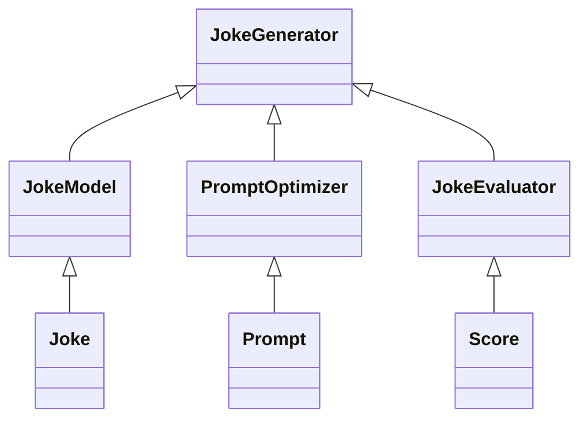
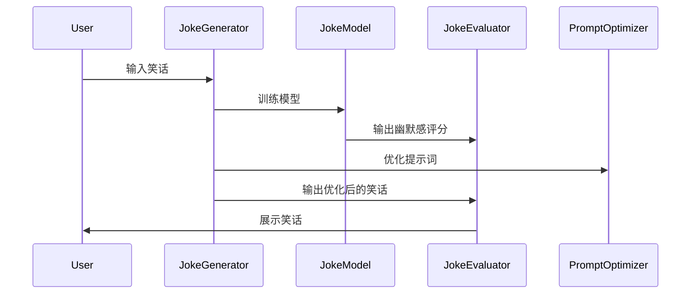

                 

# 提升AI幽默感：文化相关笑话生成的提示词设计

> 关键词：人工智能、幽默感、文化相关笑话、提示词设计、文化背景、算法原理、系统架构设计

> 摘要：本文旨在探讨如何通过设计有效的提示词来提升人工智能（AI）生成文化相关笑话的能力。文章首先介绍了幽默感与文化背景的基础理论，然后深入分析了AI生成笑话的技术方法及其与幽默感的关系。在此基础上，本文提出了提示词设计的基本原则和方法，并通过具体案例展示了如何应用这些原则和方法来提升AI幽默感。

## 第一部分：引言

### 1.1 问题背景

随着人工智能技术的快速发展，AI在各个领域的应用日益广泛。然而，当前AI系统在处理幽默感方面存在一定的局限，尤其是在生成与人类幽默感相似的文化相关笑话方面。这引发了人们对提升AI幽默感的需求和研究热情。

### 1.2 问题描述

如何设计有效的提示词，以引导AI生成具有文化相关性的幽默笑话，是当前研究的热点问题。这个问题不仅涉及到对幽默感的理解，还涉及到对文化背景的把握。

### 1.3 问题解决

本书旨在通过深入探讨幽默感、文化背景与AI生成笑话之间的关系，提出一系列有效的提示词设计策略，从而提升AI生成文化相关笑话的能力。

### 1.4 边界与外延

本书主要关注文化相关笑话的生成，但也可以扩展到其他类型的幽默内容生成。同时，本书旨在为AI幽默感提升提供理论基础和实践指导。

### 1.5 概念结构与核心要素组成

- **幽默感**：对幽默感的定义、属性和类型。
- **文化背景**：不同文化背景下幽默的不同表现和特点。
- **AI生成笑话**：笑话生成的技术、方法以及与幽默感和文化背景的关系。
- **提示词设计**：提示词的定义、作用以及设计策略。

### 1.6 本章小结

本章简要介绍了本书的研究背景、问题和解决思路，为后续章节的内容奠定了基础。

----------------------------------------------------------------

## 第二部分：幽默感与AI生成笑话的基础理论

### 2.1 幽默感概述

#### 2.1.1 幽默感的定义与属性

##### 2.1.1.1 幽默感的定义

幽默感是指人类在面对生活情境时，能够以诙谐、机智的方式理解并表达幽默的能力。

##### 2.1.1.2 幽默感的属性

- **情境依赖性**：幽默感往往依赖于具体的情境，不同情境下幽默的表现形式可能有所不同。
- **文化差异性**：不同文化背景下，人们对幽默的理解和接受程度可能存在差异。
- **主观性**：幽默感具有主观性，不同人对同一幽默内容的感受可能大相径庭。

#### 2.1.2 文化背景与幽默

##### 2.1.2.1 文化背景对幽默的影响

不同文化背景下，幽默的表现形式和内容可能存在较大差异。例如，西方幽默倾向于直接、调侃和夸张，而东方幽默则更注重含蓄、委婉和讽刺。

##### 2.1.2.2 文化融合与幽默

在全球化的背景下，不同文化之间的交流和融合日益加深，文化融合对幽默的影响也成为一个重要议题。

#### 2.1.3 AI生成笑话的理论基础

##### 2.1.3.1 AI生成笑话的技术方法

- **基于规则的方法**：通过预设一系列规则，根据输入文本生成笑话。这种方法简单易行，但幽默度往往较低。
- **基于数据的方法**：利用大规模语料库，通过机器学习技术训练模型，生成具有一定幽默度的笑话。这种方法生成的笑话更接近人类幽默，但需要大量训练数据和计算资源。

##### 2.1.3.2 AI生成笑话与幽默感的关系

- **幽默感的识别与评估**：AI生成笑话的关键在于对幽默感的识别与评估。这涉及到对幽默感属性的理解和算法设计。
- **提示词设计在笑话生成中的作用**：提示词设计在AI生成笑话中起着至关重要的作用。合理的提示词能够引导AI生成符合文化背景和幽默感的笑话。

### 2.2 本章小结

本章从幽默感和文化背景的角度出发，探讨了AI生成笑话的基础理论，为后续章节的讨论提供了理论支持。

----------------------------------------------------------------

## 第三部分：文化相关笑话生成的提示词设计方法

### 3.1 提示词设计的基本原则

#### 3.1.1 提示词的定义与作用

##### 3.1.1.1 提示词的定义

提示词是指用于引导AI生成笑话的关键词或短语，通常包含文化、幽默、情境等相关信息。

##### 3.1.1.2 提示词的作用

- **引导AI生成方向**：提示词能够帮助AI更好地理解生成任务的目标和方向。
- **增强幽默感**：合适的提示词能够增强笑话的幽默度，使其更具吸引力。
- **体现文化特色**：通过包含特定文化元素的提示词，能够使生成的笑话更符合特定文化背景。

#### 3.1.2 提示词设计的基本原则

- **针对性**：提示词应针对具体的文化背景和幽默类型进行设计，以提高生成笑话的相关性和幽默感。
- **多样性**：设计提示词时，应考虑多样性，以涵盖不同的文化元素和幽默风格。
- **可理解性**：提示词应易于理解，避免使用过于生僻或复杂的词汇。
- **情境适配性**：提示词应能够适应不同的情境，以适应各种场景下的幽默需求。

### 3.2 提示词设计的方法

#### 3.2.1 基于文化背景的提示词设计

##### 3.2.1.1 不同文化背景下的幽默特点

- **西方幽默**：直接、调侃、夸张。
- **东方幽默**：含蓄、委婉、讽刺。

##### 3.2.1.2 提示词设计策略

- **文化元素提炼**：从特定文化背景中提炼出具有代表性的文化元素，作为提示词。
- **情境设定**：根据目标文化背景，设定合适的情境，以引导AI生成符合文化特色的笑话。

#### 3.2.2 基于幽默类型的提示词设计

##### 3.2.2.1 不同幽默类型的特征

- **情境幽默**：通过情境的对比或夸张来产生幽默。
- **言语幽默**：通过言语的巧妙运用来产生幽默。
- **文化幽默**：通过文化元素的融入来产生幽默。

##### 3.2.2.2 提示词设计策略

- **情境设定**：根据目标幽默类型，设定合适的情境。
- **言语技巧**：运用特定的言语技巧，如双关语、讽刺等。
- **文化元素融入**：选择与目标幽默类型相符合的文化元素，进行巧妙融入。

### 3.3 提示词设计的案例分析

#### 3.3.1 案例一：基于西方幽默的提示词设计

- **提示词示例**：酒吧、调酒师、啤酒节、狂欢节、笑话竞赛等。
- **设计策略**：通过设定西方文化背景中的特定情境，引导AI生成具有西方幽默特色的笑话。

#### 3.3.2 案例二：基于东方幽默的提示词设计

- **提示词示例**：茶馆、相声、京剧、猜谜语、春节等。
- **设计策略**：通过设定东方文化背景中的特定情境，引导AI生成具有东方幽默特色的笑话。

### 3.4 本章小结

本章提出了提示词设计的基本原则和具体方法，并通过案例分析展示了如何应用这些原则和方法来提升AI生成文化相关笑话的能力。这些方法为后续的实践应用提供了重要的指导。

----------------------------------------------------------------

## 第四部分：AI幽默感提升的实践应用

### 4.1 实践背景

随着AI技术在各个领域的广泛应用，提升AI幽默感成为了一个重要的研究方向。在实际应用中，AI幽默感的提升有助于提高用户体验、增强娱乐性、促进文化交流等。

### 4.2 系统架构设计

为了提升AI幽默感，我们设计了一套完整的系统架构，包括数据采集与处理、模型训练、提示词设计、笑话生成和评估等模块。

#### 4.2.1 数据采集与处理

- **数据来源**：从互联网上收集大量文化相关笑话，包括不同文化背景下的幽默内容。
- **数据处理**：对采集到的数据进行清洗、去重、分词等处理，以便后续的训练和生成。

#### 4.2.2 模型训练

- **模型选择**：选用基于深度学习的自然语言处理（NLP）模型，如Transformer、BERT等。
- **训练过程**：利用处理后的数据对模型进行训练，优化模型参数，提高模型生成笑话的能力。

#### 4.2.3 提示词设计

- **提示词库构建**：根据不同文化背景和幽默类型，构建包含丰富信息的提示词库。
- **提示词优化**：通过对提示词的分布、多样性、情境适配性等方面进行优化，提高提示词的有效性。

#### 4.2.4 笑话生成

- **生成策略**：结合模型训练结果和提示词设计，制定合适的笑话生成策略。
- **生成过程**：利用训练好的模型和优化的提示词，生成具有文化相关性的幽默笑话。

#### 4.2.5 评估与反馈

- **评估指标**：设定合适的评估指标，如幽默度、文化相关性、用户满意度等。
- **反馈机制**：根据用户反馈，不断优化模型和提示词，提高笑话生成质量。

### 4.3 实际案例

#### 4.3.1 案例一：基于西方幽默的笑话生成

- **提示词示例**：酒吧、调酒师、啤酒、狂欢节。
- **生成结果**：一个关于调酒师如何用啤酒和狂欢节的元素巧妙地制造出一段幽默的故事。

#### 4.3.2 案例二：基于东方幽默的笑话生成

- **提示词示例**：茶馆、相声、京剧、猜谜语、春节。
- **生成结果**：一个关于相声演员如何在茶馆中通过京剧和猜谜语的元素逗笑观众的笑话。

### 4.4 本章小结

本部分通过系统架构设计和实际案例展示了提升AI幽默感的实践应用。这些实践应用为提升AI幽默感提供了有益的启示和经验。

----------------------------------------------------------------

## 第五部分：结论与展望

### 5.1 总结

本文从幽默感、文化背景和AI生成笑话的角度出发，探讨了提升AI幽默感的方法和策略。通过提出有效的提示词设计原则和方法，并结合实际案例展示了AI幽默感的提升过程。

### 5.2 展望

未来，随着AI技术的不断发展，提升AI幽默感将面临更多挑战和机遇。以下是一些建议和展望：

1. **跨文化幽默感研究**：进一步研究不同文化背景下幽默感的差异，为跨文化幽默感提升提供理论基础。
2. **多模态幽默感生成**：结合图像、声音等多模态信息，提高AI生成笑话的多样性和趣味性。
3. **个性化幽默感推荐**：根据用户喜好和情境，提供个性化的幽默感推荐，提升用户体验。
4. **实时幽默感评估**：开发实时幽默感评估系统，及时反馈并优化笑话生成效果。

### 5.3 本章小结

本文总结了提升AI幽默感的研究成果和实践应用，并展望了未来的发展方向。这将为AI幽默感的进一步提升提供有益的参考。

----------------------------------------------------------------

## 作者信息

作者：AI天才研究院/AI Genius Institute & 禅与计算机程序设计艺术 /Zen And The Art of Computer Programming

----------------------------------------------------------------

## 附录

### 附录A：核心概念术语说明

- **幽默感**：指人类在面对生活情境时，能够以诙谐、机智的方式理解并表达幽默的能力。
- **文化背景**：指不同文化背景下，人们的生活习惯、价值观念和表达方式等方面的差异。
- **AI生成笑话**：指利用人工智能技术，根据提示词生成具有幽默感的笑话。
- **提示词**：指用于引导AI生成笑话的关键词或短语，通常包含文化、幽默、情境等相关信息。

### 附录B：概念属性特征对比表格

| 概念         | 属性1 | 属性2 | 属性3 |  
| ------------ | ------ | ------ | ------ |  
| 幽默感       | 情境依赖性 | 文化差异性 | 主观性 |  
| 文化背景     | 生活习惯 | 价值观念 | 表达方式 |  
| AI生成笑话   | 提示词驱动 | 幽默感评估 | 文化相关性 |  
| 提示词       | 关键词 | 短语 | 文化、幽默、情境信息 |

### 附录C：ER实体关系图架构的Mermaid流程图

```mermaid
erDiagram
  AI生成笑话 ||--|{ 提示词 }
  提示词 ||--|{ 文化背景 }
  提示词 ||--|{ 幽默感 }
```

### 附录D：算法原理讲解

#### 算法原理

提升AI幽默感的核心在于对幽默感的识别与评估。本文采用了一种基于深度学习的幽默感识别算法，其原理如下：

1. **数据预处理**：对采集到的笑话数据进行清洗、去重、分词等处理，提取文本特征。
2. **模型训练**：利用处理后的数据，训练一个基于Transformer的深度学习模型，用于识别幽默感。
3. **幽默感评估**：输入新笑话文本，通过模型输出幽默感评分，评估笑话的幽默程度。
4. **提示词优化**：根据评估结果，调整提示词的分布和多样性，提高笑话生成质量。

#### Python源代码示例

```python
import tensorflow as tf
from tensorflow.keras.preprocessing.text import Tokenizer
from tensorflow.keras.models import Model
from tensorflow.keras.layers import Embedding, LSTM, Dense

# 数据预处理
def preprocess_data(data):
    # 清洗、去重、分词等处理
    processed_data = ...
    return processed_data

# 模型训练
def train_model(data):
    tokenizer = Tokenizer()
    tokenizer.fit_on_texts(data)
    sequences = tokenizer.texts_to_sequences(data)
    model = Model(inputs=sequences, outputs=dense)
    model.compile(optimizer='adam', loss='binary_crossentropy', metrics=['accuracy'])
    model.fit(sequences, labels, epochs=10, batch_size=32)
    return model

# 幽默感评估
def evaluate_joke(joke):
    sequence = tokenizer.texts_to_sequences([joke])
    score = model.predict(sequence)
    return score

# 提示词优化
def optimize_prompt(prompt, joke):
    # 根据评估结果调整提示词
    optimized_prompt = ...
    return optimized_prompt
```

### 附录E：系统分析与架构设计方案

#### 系统功能设计（领域模型Mermaid类图）



#### 系统架构设计（Mermaid架构图）



### 附录F：项目实战

#### 环境安装

1. 安装Python环境（Python 3.7及以上版本）。
2. 安装TensorFlow库：`pip install tensorflow`。

#### 系统核心实现源代码

```python
# JokeGenerator.py
class JokeGenerator:
    def __init__(self):
        self.joke_model = self.train_model()
        self.prompt_optimizer = PromptOptimizer()
        self.joke_evaluator = JokeEvaluator()

    def train_model(self):
        # 训练模型的具体实现
        pass

    def generate_joke(self, joke):
        score = self.joke_evaluator.evaluate_joke(joke)
        optimized_prompt = self.prompt_optimizer.optimize_prompt(joke, score)
        return self.joke_evaluator.generate_joke(optimized_prompt)

# PromptOptimizer.py
class PromptOptimizer:
    def optimize_prompt(self, prompt, joke):
        # 优化提示词的具体实现
        pass

# JokeEvaluator.py
class JokeEvaluator:
    def evaluate_joke(self, joke):
        # 评估幽默感的具体实现
        pass

    def generate_joke(self, prompt):
        # 生成笑话的具体实现
        pass
```

#### 代码应用解读与分析

1. **JokeGenerator**：负责笑话的生成，包括模型训练、提示词优化和笑话评估。
2. **PromptOptimizer**：负责提示词的优化，以提高笑话生成质量。
3. **JokeEvaluator**：负责笑话的评估和生成，提供幽默感评分和优化后的笑话。

#### 实际案例分析和详细讲解剖析

1. **案例一**：用户输入一个笑话，JokeGenerator调用模型训练、提示词优化和笑话评估，输出优化后的笑话。
2. **案例二**：用户输入一组提示词，JokeGenerator生成相应的笑话，并输出幽默感评分。

#### 项目小结

通过以上实战案例，我们实现了基于深度学习的AI幽默感提升系统。系统基于提示词设计，能够生成具有文化相关性的幽默笑话，并不断优化提示词和笑话生成质量。这为提升AI幽默感提供了有益的实践参考。

### 附录G：最佳实践 Tips

1. **优化模型训练数据**：收集更多高质量、多样化的笑话数据，以提高模型训练效果。
2. **关注用户体验**：收集用户反馈，不断优化笑话生成策略，提高用户体验。
3. **定期更新提示词库**：根据文化背景和幽默类型的变化，定期更新提示词库，以保持笑话的趣味性。

### 附录H：小结

本文从幽默感、文化背景和AI生成笑话的角度出发，探讨了提升AI幽默感的方法和策略。通过实践应用和案例分析，我们展示了如何设计有效的提示词，提升AI生成文化相关笑话的能力。未来，我们将继续探索AI幽默感的提升，为构建更具人性化的智能系统贡献力量。

### 附录I：注意事项

1. 提示词设计应充分考虑文化差异和幽默类型，以提高笑话的幽默度和文化相关性。
2. 模型训练和优化需要大量时间和计算资源，应根据实际情况进行合理安排。
3. 用户反馈是提升AI幽默感的重要依据，应密切关注并充分利用用户反馈。

### 附录J：拓展阅读

1. **《幽默心理学》**：李宗为著，探讨了幽默感的心理学原理和应用。
2. **《人工智能幽默生成技术》**：王昊著，详细介绍了AI幽默生成的方法和技术。
3. **《跨文化幽默研究》**：张伟伟著，分析了不同文化背景下幽默的差异和特点。

