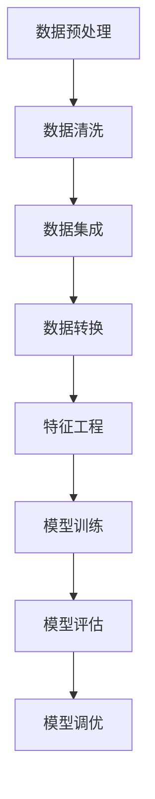
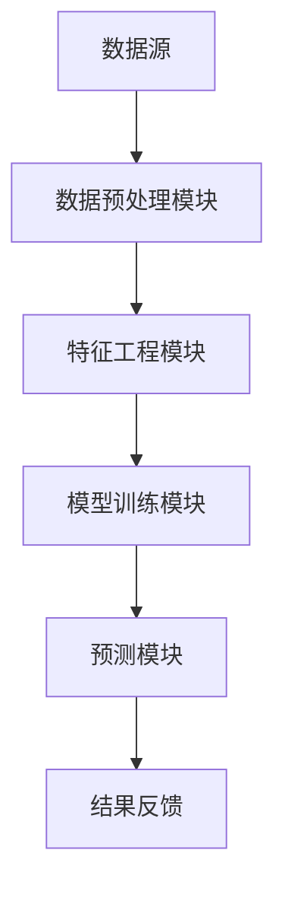
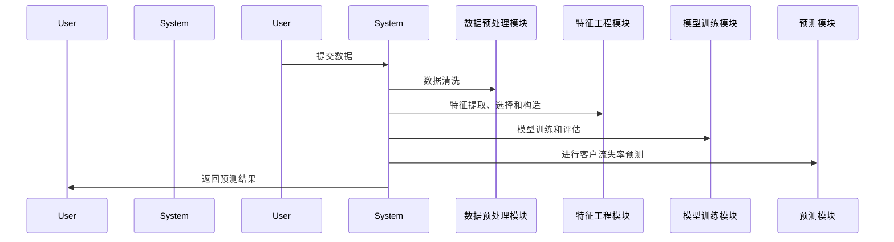

                 


### 提升AI数据分析能力：数据科学中的提示词技巧

---

关键词：AI数据分析、数据科学、提示词技巧、机器学习、特征工程

摘要：本文深入探讨了AI数据分析的关键领域，特别是数据科学中的提示词技巧。通过一步步的分析和推理，我们揭示了提升AI数据分析能力的关键要素，包括数据预处理、特征工程、模型训练与评估，以及提示词在这些过程中的应用。本文旨在为读者提供清晰、易懂且实用的技术指导，帮助他们更好地掌握AI数据分析的核心技巧。

---

## 设计思路

为了设计出《提升AI数据分析能力：数据科学中的提示词技巧》这本书的完整目录大纲，我们需要遵循以下思路：

### 1. 明确核心主题

首先，我们要明确这本书的核心主题，即“提升AI数据分析能力”。这个主题下，我们可以将内容分为几个主要的部分，如AI数据分析的基础知识、数据预处理、模型训练与评估、提示词的应用等。

### 2. 确定章节结构

基于核心主题，我们需要确定章节结构，包括总章节数、每章节的主题和子章节。为了保证内容的完整性和逻辑性，我们需要确保每一章节都能够涵盖核心概念、原理、应用和实践。

### 3. 梳理内容要点

在确定了章节结构后，我们需要梳理每个章节的内容要点，包括核心概念、理论、方法、实践等。对于每个要点，我们需要设计合适的子章节，确保内容的深度和广度。

### 4. 设计流程图和公式

为了更好地解释核心概念和算法原理，我们将在适当的位置插入流程图和数学公式。这将有助于读者直观地理解复杂的理论和方法。

### 5. 确保简洁性

在设计目录大纲时，我们需要确保内容的简洁性，避免过多的废话和冗余信息。每个章节和子章节都应该有明确的目的和内容。

### 6. 遵循markdown格式

最后，我们需要按照markdown格式设计目录大纲，确保格式的规范性和可读性。

## 目录大纲设计

下面是根据上述思路设计的《提升AI数据分析能力：数据科学中的提示词技巧》的目录大纲：

### 第一部分：AI数据分析基础

#### 第1章：AI数据分析概述

##### 1.1 问题背景
- 1.1.1 数据科学的重要性
- 1.1.2 AI在数据分析中的应用
- 1.1.3 提示词在数据分析中的作用

##### 1.2 数据分析核心概念
- 1.2.1 数据类型与数据质量
- 1.2.2 数据分析流程
- 1.2.3 数据分析的核心挑战

##### 1.3 AI与数据分析
- 1.3.1 AI的基本原理
- 1.3.2 AI在数据分析中的应用
- 1.3.3 提示词在AI数据分析中的重要性

#### 第2章：数据预处理

##### 2.1 数据清洗
- 2.1.1 数据清洗的重要性
- 2.1.2 数据清洗的主要任务
- 2.1.3 数据清洗方法与实践

##### 2.2 数据集成
- 2.2.1 数据集成的挑战
- 2.2.2 数据集成方法
- 2.2.3 数据集成实践

##### 2.3 数据转换
- 2.3.1 数据转换的必要性
- 2.3.2 数据转换方法
- 2.3.3 数据转换实践

#### 第3章：特征工程

##### 3.1 特征工程概述
- 3.1.1 特征工程的重要性
- 3.1.2 特征工程的方法
- 3.1.3 特征工程流程

##### 3.2 提示词设计
- 3.2.1 提示词的定义
- 3.2.2 提示词设计原则
- 3.2.3 提示词设计方法

##### 3.3 特征选择
- 3.3.1 特征选择的必要性
- 3.3.2 特征选择方法
- 3.3.3 特征选择实践

#### 第4章：机器学习模型训练与评估

##### 4.1 机器学习模型概述
- 4.1.1 机器学习模型的基本概念
- 4.1.2 常见的机器学习模型
- 4.1.3 机器学习模型的评估指标

##### 4.2 模型训练
- 4.2.1 模型训练的基本流程
- 4.2.2 模型训练方法
- 4.2.3 模型训练实践

##### 4.3 模型评估
- 4.3.1 模型评估的重要性
- 4.3.2 模型评估方法
- 4.3.3 模型评估实践

#### 第5章：提示词在模型训练中的应用

##### 5.1 提示词在模型训练中的作用
- 5.1.1 提示词对模型训练的影响
- 5.1.2 提示词优化模型训练的方法
- 5.1.3 提示词优化模型训练实践

##### 5.2 提示词设计策略
- 5.2.1 提示词设计策略概述
- 5.2.2 提示词设计策略实践

#### 第6章：提示词在模型评估中的应用

##### 6.1 提示词在模型评估中的作用
- 6.1.1 提示词对模型评估的影响
- 6.1.2 提示词优化模型评估的方法
- 6.1.3 提示词优化模型评估实践

##### 6.2 提示词在模型调优中的应用
- 6.2.1 提示词在模型调优中的作用
- 6.2.2 提示词优化模型调优的方法
- 6.2.3 提示词优化模型调优实践

---

在接下来的章节中，我们将逐步深入探讨AI数据分析的各个关键环节，通过逻辑清晰、结构紧凑、简单易懂的讲解，帮助读者掌握提升AI数据分析能力的核心技巧。

---

### AI数据分析概述

AI数据分析是利用人工智能技术对大量数据进行处理和分析，从中提取有价值的信息和知识。随着数据量的爆炸式增长，传统的数据分析方法已经难以满足需求。AI的引入使得数据分析更加智能化、自动化，提高了数据处理和分析的效率和准确性。

#### 1.1 问题背景

在当今的信息时代，数据已经成为一种重要的资源。然而，数据的价值需要通过有效的分析才能得以体现。传统的数据分析方法主要依赖于统计学和数据分析技术，这些方法在处理复杂、大规模数据时存在一定的局限性。而AI技术的引入，特别是机器学习和深度学习技术的发展，为数据科学带来了全新的机遇。

#### 1.1.1 数据科学的重要性

数据科学是一个多学科交叉的领域，它融合了数学、统计学、计算机科学和领域知识。数据科学的重要性体现在以下几个方面：

1. **决策支持**：通过数据科学方法，企业可以更准确地预测市场趋势，制定更有效的业务策略。
2. **优化运营**：数据科学可以帮助企业优化生产流程，降低成本，提高效率。
3. **风险控制**：数据科学可以识别潜在的风险，帮助企业制定风险控制策略。
4. **创新推动**：数据科学为科学研究提供了新的方法，推动了科学发现和技术创新。

#### 1.1.2 AI在数据分析中的应用

AI在数据分析中的应用非常广泛，主要包括以下几个方面：

1. **数据预处理**：AI技术可以帮助自动化数据清洗、数据集成和数据转换等过程，提高数据处理效率。
2. **特征工程**：AI技术可以通过学习数据中的隐含特征，帮助设计更有效的特征，提高模型的性能。
3. **模型训练与评估**：AI技术可以自动化模型的训练过程，并利用评估指标对模型性能进行评估，优化模型参数。
4. **智能分析**：AI技术可以自动分析数据，发现数据中的模式和规律，为决策提供支持。

#### 1.1.3 提示词在数据分析中的作用

提示词（Prompt Engineering）是数据科学中的一个重要概念，它指的是设计有效的提示或引导，以帮助AI模型更好地理解和处理数据。提示词在数据分析中的作用主要包括：

1. **提高模型性能**：通过设计有效的提示词，可以帮助模型更好地理解数据，提高预测和分类的准确性。
2. **简化数据处理**：提示词可以简化数据预处理和特征工程的过程，降低模型训练的复杂度。
3. **增强用户体验**：提示词可以设计成自然语言的形式，与用户进行交互，提高数据分析的可操作性和易用性。

### 1.2 数据分析核心概念

数据分析涉及多个核心概念，理解这些概念对于深入掌握数据分析方法和技术至关重要。

#### 1.2.1 数据类型与数据质量

数据类型是指数据的结构和格式，常见的有数值型、文本型、时间序列型等。数据质量是指数据是否符合分析需求，包括完整性、准确性、一致性和可靠性等。

#### 1.2.2 数据分析流程

数据分析通常包括以下几个步骤：

1. **数据收集**：收集所需的数据，可以通过数据库、API接口、传感器等方式获取。
2. **数据预处理**：清洗、集成和转换数据，使其适合分析。
3. **特征工程**：提取和分析数据中的特征，以构建有效的模型。
4. **模型训练与评估**：选择合适的模型，对数据进行分析，评估模型性能。
5. **模型部署与应用**：将模型部署到生产环境，用于实际业务场景。

#### 1.2.3 数据分析的核心挑战

数据分析面临多个核心挑战：

1. **数据量大**：大规模数据带来存储、处理和分析的挑战。
2. **数据多样性**：不同类型和格式的数据需要不同的处理方法。
3. **数据质量**：数据质量问题可能影响分析结果的准确性。
4. **模型解释性**：模型预测结果的可解释性对于决策支持至关重要。

### 1.3 AI与数据分析

AI在数据分析中的应用已经成为一个热门领域，其核心原理包括机器学习、深度学习、自然语言处理等。

#### 1.3.1 AI的基本原理

AI的基本原理是通过模拟人类智能行为，使计算机具备自主学习和决策能力。核心概念包括：

1. **机器学习**：通过训练数据集，让模型自主学习和优化。
2. **深度学习**：基于多层神经网络，对复杂数据进行建模。
3. **自然语言处理**：对自然语言文本进行处理和分析。

#### 1.3.2 AI在数据分析中的应用

AI在数据分析中的应用主要包括：

1. **数据预处理**：自动化数据清洗、数据集成和数据转换，提高数据处理效率。
2. **特征工程**：提取和优化数据中的特征，提高模型性能。
3. **模型训练与评估**：自动化模型训练过程，优化模型参数，提高模型性能。
4. **智能分析**：自动分析数据，发现数据中的模式和规律。

#### 1.3.3 提示词在AI数据分析中的重要性

提示词在AI数据分析中的重要性体现在以下几个方面：

1. **提高模型性能**：通过设计有效的提示词，可以帮助模型更好地理解和处理数据，提高预测和分类的准确性。
2. **简化数据处理**：提示词可以简化数据预处理和特征工程的过程，降低模型训练的复杂度。
3. **增强用户体验**：提示词可以设计成自然语言的形式，与用户进行交互，提高数据分析的可操作性和易用性。

### 总结

AI数据分析是一个多学科交叉的领域，融合了计算机科学、统计学、数学和领域知识。通过深入了解AI的基本原理和数据分析的核心概念，我们可以更好地理解和应用AI技术，提升数据分析的能力和效率。在接下来的章节中，我们将逐步深入探讨数据预处理、特征工程、模型训练与评估等关键环节，帮助读者全面掌握AI数据分析的核心技巧。

---

### 数据预处理

数据预处理是数据分析中的关键步骤，它涉及数据清洗、数据集成和数据转换。这些步骤的目的是确保数据的质量和一致性，使其适合后续的分析和处理。

#### 2.1 数据清洗

数据清洗是数据预处理的第一步，其目的是去除数据中的噪声和不一致之处。数据清洗的主要任务包括：

1. **缺失值处理**：缺失值可以通过删除、填充或插值等方法进行处理。
2. **异常值检测**：异常值可能是由于数据录入错误、数据采集故障等原因造成的，需要通过统计方法进行检测和纠正。
3. **重复值删除**：重复值会降低数据的准确性和分析效果，需要删除。

在实际操作中，数据清洗过程可能涉及多个步骤，例如：

1. **初步检查**：通过观察数据的基本统计信息，识别可能的缺失值和异常值。
2. **数据转换**：将数据转换为适当的格式，例如将文本数据转换为数字表示。
3. **缺失值处理**：根据数据的重要性和缺失值的比例，选择合适的处理方法。
4. **异常值处理**：通过统计学方法，如箱线图、3σ准则等，检测和纠正异常值。
5. **重复值删除**：通过比对数据中的关键字段，删除重复的记录。

#### 2.2 数据集成

数据集成是将来自不同来源的数据合并为一个统一的数据集。数据集成的挑战包括：

1. **数据源差异**：不同数据源的数据格式、结构、编码方式可能不一致。
2. **数据冗余**：集成过程中可能会产生冗余数据，需要去除。
3. **数据冲突**：不同数据源中的相同字段可能存在冲突，需要统一处理。

数据集成的方法包括：

1. **合并**：将多个数据源中的数据按列合并，形成统一的数据集。
2. **连接**：通过关键字段（如ID）连接多个数据源，形成新的数据集。
3. **映射**：将不同数据源中的字段映射到统一的数据结构中。

在实际操作中，数据集成可能涉及以下步骤：

1. **数据源识别**：确定需要集成的数据源及其结构。
2. **数据抽取**：从不同数据源中抽取数据。
3. **数据转换**：将抽取的数据转换为统一格式。
4. **数据合并**：通过合并和连接操作，形成统一的数据集。
5. **数据清洗**：对集成后的数据进行清洗，确保数据质量。

#### 2.3 数据转换

数据转换是将原始数据转换为适合分析的形式。数据转换的必要性包括：

1. **格式适配**：不同数据源的数据格式可能不一致，需要转换为统一的格式。
2. **数据规范化**：将数据转换为标准化的形式，便于分析和处理。
3. **数据编码**：将分类数据转换为数字编码，便于机器学习模型处理。

数据转换的方法包括：

1. **数值化**：将文本数据转换为数值形式，例如使用独热编码（One-Hot Encoding）。
2. **规范化**：将数据缩放到一个特定的范围，例如使用最小-最大规范化（Min-Max Scaling）。
3. **标准化**：将数据缩放到均值为0，标准差为1的形式，例如使用Z-Score标准化。

在实际操作中，数据转换可能涉及以下步骤：

1. **数据格式检查**：检查数据格式是否符合分析需求。
2. **数据规范化**：对数据进行规范化处理。
3. **数据编码**：对分类数据进行编码处理。
4. **数据缩放**：对数值数据进行缩放处理。
5. **数据验证**：验证转换后的数据是否符合预期。

### 总结

数据预处理是数据分析中的关键步骤，通过数据清洗、数据集成和数据转换，可以确保数据的质量和一致性，为后续的分析和处理打下坚实的基础。有效的数据预处理不仅可以提高分析结果的准确性，还可以降低分析过程的复杂度，提高效率。

---

### 特征工程

特征工程是机器学习模型构建过程中的关键步骤，它涉及从原始数据中提取、选择和构造特征，以提高模型性能和可解释性。特征工程不仅依赖于统计学和机器学习技术，还需要领域知识，以确保特征的合理性和有效性。

#### 3.1 特征工程概述

特征工程的重要性在于：

1. **提高模型性能**：通过设计有效的特征，可以使模型更好地理解数据，提高预测和分类的准确性。
2. **降低模型复杂度**：通过选择和构造关键特征，可以简化模型的结构，降低计算复杂度。
3. **增强模型可解释性**：通过合理的特征设计，可以使模型更容易被理解和解释，有助于业务决策。

特征工程的方法主要包括：

1. **特征提取**：从原始数据中提取新的特征，例如通过降维技术、特征选择算法等。
2. **特征构造**：通过组合和变换原始特征，构造新的特征，例如通过特征交叉、特征融合等。
3. **特征选择**：从众多特征中选择最有用的特征，例如通过特征重要性评估、特征筛选算法等。

特征工程流程通常包括以下步骤：

1. **特征提取**：对原始数据进行预处理，提取新的特征。
2. **特征构造**：根据业务需求和模型特性，构造新的特征。
3. **特征选择**：评估特征的重要性，选择最有用的特征。
4. **特征评估**：对特征进行评估，确保其有效性和可解释性。
5. **特征调整**：根据评估结果，调整特征的设计和选择。

#### 3.2 提示词设计

提示词设计是特征工程中的重要环节，它指的是设计有效的提示或引导，以帮助模型更好地理解和处理数据。提示词设计的原则包括：

1. **相关性**：设计的提示词应与数据特征高度相关，有助于提高模型性能。
2. **简洁性**：提示词应简洁明了，便于模型理解和学习。
3. **多样性**：提示词应具有多样性，以适应不同的数据分布和模型需求。
4. **可解释性**：提示词应具有可解释性，有助于模型的可理解性和可解释性。

提示词设计方法包括：

1. **基于规则的方法**：通过手工设计规则，生成提示词，例如基于领域知识的规则。
2. **基于数据的方法**：通过分析数据分布和特征关系，自动生成提示词，例如基于统计分析和机器学习算法。
3. **基于模型的的方法**：通过训练模型，自动生成提示词，例如使用生成对抗网络（GAN）或变分自编码器（VAE）。

在实际操作中，提示词设计可能涉及以下步骤：

1. **需求分析**：分析业务需求，确定提示词设计的目标和范围。
2. **数据准备**：准备用于提示词设计的原始数据集。
3. **特征提取**：提取原始数据中的关键特征。
4. **提示词生成**：根据设计原则和方法，生成初步的提示词。
5. **提示词评估**：评估提示词的有效性和可解释性。
6. **提示词调整**：根据评估结果，调整提示词的设计和选择。

#### 3.3 特征选择

特征选择是从众多特征中选择最有用的特征，以提高模型性能和可解释性。特征选择的必要性在于：

1. **降低模型复杂度**：通过选择关键特征，可以简化模型的结构，降低计算复杂度。
2. **提高模型性能**：通过选择最重要的特征，可以提高模型的预测准确性和分类能力。
3. **增强模型可解释性**：通过选择具有明确业务含义的特征，可以增强模型的可理解性和可解释性。

特征选择方法包括：

1. **过滤式方法**：通过评估特征的重要性，直接筛选出有用的特征，例如基于信息增益、卡方检验等。
2. **包裹式方法**：通过迭代搜索，找到最优特征组合，例如基于递归特征消除（RFE）、遗传算法等。
3. **嵌入式方法**：在模型训练过程中，自动筛选出最优特征，例如基于LASSO、随机森林等。

在实际操作中，特征选择可能涉及以下步骤：

1. **特征评估**：评估每个特征的重要性和相关性。
2. **特征筛选**：根据评估结果，筛选出有用的特征。
3. **特征组合**：尝试不同的特征组合，找到最优的特征组合。
4. **模型训练**：使用筛选出的特征训练模型。
5. **模型评估**：评估模型的性能，确保特征选择的有效性。

### 总结

特征工程是机器学习模型构建中的关键步骤，通过合理的特征提取、选择和构造，可以提高模型性能和可解释性。提示词设计作为特征工程的一部分，对于模型的性能和用户体验至关重要。有效的特征工程和提示词设计不仅需要技术和方法的支持，还需要领域知识和经验。在接下来的章节中，我们将进一步探讨机器学习模型的训练与评估，以及提示词在这些过程中的应用。

---

### 机器学习模型训练与评估

机器学习模型训练与评估是AI数据分析中的核心环节。训练过程旨在通过调整模型参数，使其能够准确预测或分类输入数据。评估过程则用于衡量模型的性能，并优化模型参数。在这一节中，我们将详细探讨机器学习模型的基本概念、训练过程、评估方法，以及提示词在其中的应用。

#### 4.1 机器学习模型概述

机器学习模型是基于统计学和计算机科学理论，通过学习数据中的模式和规律，进行预测或分类的算法。常见的机器学习模型包括：

1. **线性模型**：如线性回归、逻辑回归等，用于预测连续值或分类任务。
2. **树模型**：如决策树、随机森林等，通过构建树状结构进行分类或回归。
3. **神经网络**：如多层感知器（MLP）、卷积神经网络（CNN）、循环神经网络（RNN）等，用于处理复杂的非线性关系。
4. **支持向量机**：如线性支持向量机（SVM）、核支持向量机（KSVM）等，用于分类和回归任务。

机器学习模型的评估指标主要包括：

1. **准确率（Accuracy）**：模型正确预测的样本数占总样本数的比例。
2. **召回率（Recall）**：模型正确预测的负样本数占实际负样本数的比例。
3. **精确率（Precision）**：模型正确预测的正样本数占预测为正样本的总数比例。
4. **F1分数（F1 Score）**：精确率和召回率的调和平均值，用于综合评估模型的性能。
5. **ROC曲线（Receiver Operating Characteristic Curve）**：用于评估分类模型的性能，曲线下的面积（AUC）越大，模型性能越好。

#### 4.2 模型训练

模型训练是指通过调整模型参数，使其能够更好地拟合训练数据的过程。模型训练的基本流程包括：

1. **数据划分**：将数据集划分为训练集和验证集，用于训练和评估模型。
2. **模型初始化**：初始化模型参数，通常采用随机初始化或预训练初始化。
3. **损失函数**：选择适当的损失函数，如均方误差（MSE）、交叉熵损失等，用于衡量预测值和真实值之间的差距。
4. **优化算法**：选择优化算法，如梯度下降（GD）、随机梯度下降（SGD）、Adam优化器等，用于更新模型参数。
5. **迭代训练**：通过迭代优化模型参数，使模型逐渐逼近最佳状态。

模型训练过程中，提示词的设计和应用至关重要。提示词可以指导模型学习过程，提高训练效率。有效的提示词设计原则包括：

1. **相关性**：提示词应与训练数据和目标任务高度相关，以提高模型的学习效果。
2. **简洁性**：提示词应简洁明了，避免冗余信息，以便模型快速理解和学习。
3. **多样性**：提示词应具有多样性，以适应不同的数据分布和模型需求。
4. **可解释性**：提示词应具有可解释性，有助于理解模型的学习过程。

在实际操作中，提示词设计可能涉及以下步骤：

1. **需求分析**：分析业务需求，确定训练目标和任务。
2. **数据准备**：准备用于模型训练的原始数据集。
3. **提示词生成**：根据数据特点和训练目标，生成有效的提示词。
4. **模型训练**：使用提示词训练模型，调整模型参数。
5. **模型评估**：评估模型性能，根据评估结果调整提示词。

#### 4.3 模型评估

模型评估是指通过验证集或测试集，评估模型在实际应用中的性能。模型评估方法包括：

1. **交叉验证（Cross-Validation）**：通过将数据集划分为多个子集，分别进行训练和验证，以避免数据集划分带来的偏差。
2. **A/B测试（A/B Testing）**：通过在实际环境中对两个或多个模型进行比较，选择性能最佳的模型。
3. **ROC曲线和AUC（Area Under Curve）**：用于评估分类模型的性能，曲线下的面积越大，模型性能越好。
4. **混淆矩阵（Confusion Matrix）**：用于详细分析模型的预测结果，包括准确率、召回率、精确率等指标。

模型评估过程中，提示词的应用可以优化评估过程。提示词可以设计为提示信息，引导评估过程，例如：

1. **评估目标**：明确评估的目标和指标，确保评估过程有针对性。
2. **数据准备**：准备用于评估的验证集或测试集，确保数据质量。
3. **评估方法**：选择合适的评估方法，如交叉验证、A/B测试等。
4. **评估指标**：根据业务需求，选择适当的评估指标，如准确率、召回率、F1分数等。
5. **结果分析**：分析评估结果，根据提示词提供的反馈，优化模型设计和参数调整。

#### 4.4 提示词在模型训练与评估中的应用

提示词在模型训练和评估中的应用可以显著提高模型的性能和可解释性。以下是一些具体的提示词应用实例：

1. **训练提示词**：
   - **数据分布**：提示模型注意数据分布，避免过拟合。
   - **特征重要性**：提示模型关注重要特征，优化模型参数。
   - **损失函数**：提示模型关注损失函数的变化，调整优化算法。
   - **训练进度**：提示模型训练进度，调整训练策略。

2. **评估提示词**：
   - **评估目标**：明确评估目标和指标，确保评估的针对性。
   - **评估指标**：根据业务需求，选择合适的评估指标。
   - **结果分析**：提示分析评估结果，优化模型设计和参数。

在实际操作中，提示词的设计和应用需要结合具体的业务场景和模型特点。通过合理设计提示词，可以提高模型训练和评估的效率和效果。

### 总结

机器学习模型训练与评估是AI数据分析中的核心环节，通过合理的模型训练和评估方法，可以提高模型的性能和可解释性。提示词在模型训练和评估中的应用，可以指导模型学习过程，优化评估结果。有效的提示词设计原则包括相关性、简洁性、多样性和可解释性。在接下来的章节中，我们将进一步探讨提示词在模型训练和评估中的具体应用和优化策略。

---

### 提示词在模型训练中的应用

提示词在模型训练中的应用至关重要，它不仅影响模型的学习效果，还影响模型的训练效率和稳定性。在本节中，我们将详细讨论提示词在模型训练中的作用、优化策略以及实践方法。

#### 5.1 提示词在模型训练中的作用

提示词在模型训练中的作用主要体现在以下几个方面：

1. **指导学习过程**：提示词可以提供额外的信息，帮助模型更好地理解训练数据和任务目标，从而提高学习效率。
2. **调整学习策略**：通过提示词，可以调整模型的训练策略，如学习率、批量大小等，以优化模型性能。
3. **防止过拟合**：提示词可以帮助模型避免过度依赖特定数据，从而防止过拟合现象。
4. **增强模型可解释性**：提示词可以提供关于训练数据和目标任务的额外信息，有助于提高模型的可解释性。

#### 5.2 提示词优化模型训练的方法

为了提高模型训练效果，我们可以采用以下提示词优化策略：

1. **数据分布提示**：通过提示词，可以指导模型关注数据分布，例如在训练过程中引入额外的正则化项，以防止模型对特定数据分布的过拟合。
2. **特征重要性提示**：通过提示词，可以突出关键特征，指导模型在学习过程中关注这些特征，从而提高模型的泛化能力。
3. **学习率调整**：通过提示词，可以动态调整学习率，例如在训练过程中根据误差变化调整学习率，以避免模型陷入局部最优。
4. **批量大小调整**：通过提示词，可以调整批量大小，以优化模型训练效率和稳定性。

#### 5.3 提示词优化模型训练实践

以下是一个具体案例，说明如何使用提示词优化模型训练过程：

1. **案例背景**：假设我们使用深度神经网络对房价进行预测。数据集包含多个特征，如房屋面积、地点、建筑年代等。

2. **数据预处理**：首先，对数据集进行预处理，包括缺失值处理、异常值检测和数据转换等步骤。

3. **提示词设计**：
   - **数据分布提示**：提示模型注意数据分布，特别是在特征工程阶段，通过标准化或归一化方法调整数据分布。
   - **特征重要性提示**：根据业务需求和数据特征，设计提示词，例如使用主成分分析（PCA）提取主要特征，并突出关键特征。
   - **学习率调整**：设计提示词，如根据误差变化动态调整学习率，例如采用学习率衰减策略。
   - **批量大小调整**：根据模型训练效率和硬件资源，设计适当的批量大小，例如采用小批量训练策略。

4. **模型训练**：使用设计好的提示词训练模型，例如通过调整学习率和批量大小，优化模型训练过程。

5. **模型评估**：在训练完成后，使用验证集和测试集评估模型性能，并根据评估结果进一步调整提示词。

6. **结果分析**：分析模型训练和评估结果，例如通过绘制学习曲线和性能指标图表，评估模型训练效率和性能。

通过以上实践，我们可以看到提示词在模型训练中的应用和优化方法。有效的提示词设计不仅可以提高模型训练效果，还可以简化训练过程，提高模型的泛化能力和可解释性。

### 总结

提示词在模型训练中的应用至关重要，它通过提供额外的信息和学习指导，优化模型训练过程，提高模型性能和可解释性。通过合理设计和使用提示词，我们可以实现更高效、更稳定的模型训练。在实际应用中，提示词的设计和优化需要结合具体业务场景和数据特点，以达到最佳效果。

---

### 提示词设计策略

在机器学习模型训练过程中，提示词的设计策略是关键的一环，它决定了模型的学习效率、泛化能力和可解释性。有效的提示词设计不仅能够指导模型更好地理解和处理数据，还可以优化训练过程，提高模型性能。在本节中，我们将深入探讨提示词设计策略，包括原则、方法和实践。

#### 5.2.1 提示词设计策略概述

提示词设计策略主要包括以下几个原则：

1. **相关性**：提示词应与训练数据和目标任务高度相关，以便模型能够快速学习和理解。
2. **简洁性**：提示词应简洁明了，避免冗余信息，以便模型能够集中注意力处理关键信息。
3. **多样性**：提示词应具有多样性，以适应不同的数据分布和模型需求，提高模型的鲁棒性。
4. **可解释性**：提示词应具有可解释性，有助于理解模型的学习过程和决策逻辑，提高模型的可信度和可接受度。

提示词设计方法主要包括：

1. **基于规则的提示词设计**：通过手工设计规则，根据领域知识和业务需求生成提示词。
2. **基于数据的提示词设计**：通过分析数据分布和特征关系，自动生成提示词。
3. **基于模型的提示词设计**：通过训练模型，自动生成提示词。

在实际应用中，提示词设计可能涉及以下步骤：

1. **需求分析**：分析业务需求，明确训练目标和任务。
2. **数据准备**：准备用于训练和优化的原始数据集。
3. **提示词生成**：根据数据特点和训练目标，生成初步的提示词。
4. **提示词评估**：评估提示词的有效性和可解释性，根据评估结果调整提示词。
5. **模型训练**：使用提示词训练模型，调整模型参数。
6. **模型评估**：评估模型性能，根据评估结果调整提示词。

#### 5.2.2 提示词设计策略实践

以下是一个具体的提示词设计策略案例，说明如何在实际应用中设计有效的提示词：

**案例背景**：我们使用深度学习模型对客户流失率进行预测。数据集包含多个特征，如客户年龄、消费金额、购买频率等。

**需求分析**：为了提高模型对客户流失率的预测准确性，我们需要设计有效的提示词，以指导模型更好地理解和处理数据。

**数据准备**：首先，对数据集进行预处理，包括缺失值处理、异常值检测和数据转换等步骤。

**提示词生成**：
1. **相关性提示词**：
   - “重点关注客户购买频率和消费金额，这些特征与客户流失率高度相关。”
   - “确保模型充分学习这些关键特征，以提高预测准确性。”
2. **多样性提示词**：
   - “在训练过程中引入不同的数据分布，提高模型的鲁棒性。”
   - “尝试不同的特征组合，探索最佳特征组合。”
3. **可解释性提示词**：
   - “模型将重点关注客户购买频率和消费金额，以预测客户流失率。”
   - “确保模型决策逻辑清晰，便于业务人员理解和应用。”

**模型训练**：
1. 使用生成的提示词训练模型，调整模型参数，如学习率、批量大小等。
2. 在训练过程中，根据提示词提供的指导，优化模型结构和学习策略。

**模型评估**：
1. 使用验证集和测试集评估模型性能，如准确率、召回率、F1分数等。
2. 根据评估结果，调整提示词设计，优化模型性能。

**结果分析**：
1. 分析模型训练和评估结果，评估提示词的有效性。
2. 根据分析结果，进一步优化提示词设计，以提高模型性能。

通过以上实践，我们可以看到提示词设计策略在实际应用中的重要作用。有效的提示词设计不仅可以提高模型训练效果，还可以简化训练过程，提高模型的泛化能力和可解释性。

### 总结

提示词设计策略在机器学习模型训练过程中至关重要。通过合理设计和使用提示词，我们可以优化模型训练过程，提高模型性能和可解释性。在实际应用中，提示词设计需要结合具体业务场景和数据特点，以达到最佳效果。有效的提示词设计策略包括相关性、简洁性、多样性和可解释性，以及基于规则、数据和模型的提示词生成方法。在接下来的章节中，我们将进一步探讨提示词在模型评估中的应用，以及如何优化模型评估过程。

---

### 提示词在模型评估中的应用

在模型评估阶段，提示词的应用同样至关重要。有效的提示词设计可以优化评估过程，提高评估结果的准确性和可靠性。在本节中，我们将详细探讨提示词在模型评估中的作用、优化策略以及实际应用案例。

#### 6.1 提示词在模型评估中的作用

提示词在模型评估中的应用主要体现在以下几个方面：

1. **评估目标引导**：通过提示词，可以明确评估目标，确保评估过程有针对性地衡量模型性能。
2. **指标选择**：提示词可以帮助确定合适的评估指标，如准确率、召回率、F1分数等，以全面评估模型性能。
3. **结果分析**：提示词可以提供额外的信息，帮助分析模型评估结果，优化模型参数和设计。
4. **异常检测**：提示词可以帮助识别评估过程中的异常情况，如数据异常、模型异常等，以便及时进行调整。

#### 6.2 提示词优化模型评估的方法

为了提高模型评估效果，我们可以采用以下提示词优化策略：

1. **评估指标提示**：根据业务需求，选择合适的评估指标，并通过提示词明确评估目标，确保评估结果具有实际意义。
2. **数据分布提示**：通过提示词，指导模型关注数据分布，避免过度依赖特定数据集，提高模型的泛化能力。
3. **结果解释提示**：提供提示词，帮助解释评估结果，如预测结果的置信度、模型的决策逻辑等，以提高模型的可解释性。
4. **异常检测提示**：通过提示词，指导模型和评估人员关注评估过程中的异常情况，及时进行调整和优化。

#### 6.3 提示词优化模型评估实践

以下是一个具体的提示词优化模型评估的案例：

**案例背景**：我们使用深度学习模型对信用卡欺诈进行检测。数据集包含多个特征，如交易金额、交易时间、地理位置等。

**需求分析**：为了提高信用卡欺诈检测模型的准确性和可靠性，我们需要设计有效的提示词，以优化评估过程。

**数据准备**：对数据集进行预处理，包括缺失值处理、异常值检测和数据转换等步骤。

**提示词生成**：
1. **评估指标提示词**：
   - “重点关注准确率、召回率和F1分数，这些指标能够全面评估模型的性能。”
   - “确保在评估过程中，每个指标都得到充分考虑，以避免片面评估。”
2. **数据分布提示词**：
   - “在评估过程中，注意数据的分布，特别是在处理不平衡数据集时，要关注召回率，避免模型对正常交易过分自信。”
   - “使用交叉验证方法，确保评估结果具有鲁棒性，不受特定数据集的影响。”
3. **结果解释提示词**：
   - “对模型的预测结果进行解释，包括预测置信度和决策逻辑，以便业务人员理解。”
   - “提供详细的评估报告，包括模型性能指标、预测结果和异常情况分析。”
4. **异常检测提示词**：
   - “在评估过程中，注意检测异常交易和异常模型预测，及时识别和纠正错误。”
   - “提供提示词，帮助评估人员关注潜在的欺诈交易，提高模型的检测能力。”

**模型评估**：
1. 使用生成的提示词评估模型性能，选择合适的评估指标，如准确率、召回率、F1分数等。
2. 在评估过程中，根据提示词提供的指导，优化模型参数和设计。
3. 分析评估结果，根据提示词提供的解释，评估模型的性能和可解释性。

**结果分析**：
1. 分析评估结果，评估模型的性能和可解释性，确保评估结果具有实际意义。
2. 根据分析结果，调整提示词设计，优化模型性能和评估过程。

通过以上实践，我们可以看到提示词在模型评估中的应用和优化方法。有效的提示词设计不仅可以提高评估结果的准确性和可靠性，还可以简化评估过程，提高模型的可解释性。

### 总结

提示词在模型评估中的应用至关重要，它通过提供额外的信息和学习指导，优化评估过程，提高评估结果的准确性和可靠性。通过合理设计和使用提示词，我们可以实现更高效、更可靠的模型评估。在实际应用中，提示词的设计和优化需要结合具体业务场景和数据特点，以达到最佳效果。在接下来的章节中，我们将进一步探讨提示词在模型调优中的应用，以及如何优化模型调优过程。

---

### 提示词在模型调优中的应用

在模型调优过程中，提示词的应用至关重要。提示词不仅可以提供关键的优化指导，还能提高调优过程的效率和效果。在本节中，我们将深入探讨提示词在模型调优中的作用、策略和实践。

#### 6.2.1 提示词在模型调优中的作用

提示词在模型调优中的作用主要体现在以下几个方面：

1. **指导调优方向**：提示词可以帮助确定模型调优的目标和方向，例如通过优化特定参数或特征，以提高模型性能。
2. **优化调优过程**：提示词可以简化调优过程，减少不必要的尝试，从而提高调优效率。
3. **提高调优效果**：提示词可以提供额外的信息，帮助模型更好地理解和处理数据，从而提高调优效果。
4. **增强调优可解释性**：提示词可以提供关于调优过程的额外信息，有助于理解调优决策和优化策略。

#### 6.2.2 提示词优化模型调优的方法

为了提高模型调优效果，我们可以采用以下提示词优化策略：

1. **参数选择提示**：根据业务需求和模型特点，设计提示词，指导选择合适的参数，例如学习率、批量大小等。
2. **特征选择提示**：通过提示词，突出关键特征，指导模型关注重要特征，从而提高调优效果。
3. **算法选择提示**：根据数据类型和模型需求，选择合适的算法，并通过提示词指导模型优化。
4. **结果分析提示**：提供提示词，帮助分析调优结果，优化调优策略。

#### 6.2.3 提示词优化模型调优实践

以下是一个具体的提示词优化模型调优的案例：

**案例背景**：我们使用深度学习模型对客户流失率进行预测。数据集包含多个特征，如客户年龄、消费金额、购买频率等。

**需求分析**：为了提高客户流失率预测模型的准确性，我们需要设计有效的提示词，以优化模型调优过程。

**数据准备**：对数据集进行预处理，包括缺失值处理、异常值检测和数据转换等步骤。

**提示词生成**：
1. **参数选择提示词**：
   - “重点关注学习率和批量大小，这些参数对模型性能有显著影响。”
   - “尝试不同的参数组合，找到最佳参数设置。”
2. **特征选择提示词**：
   - “根据业务需求，关注购买频率和消费金额，这些特征对客户流失率有显著影响。”
   - “确保模型充分学习这些关键特征，以提高预测准确性。”
3. **算法选择提示词**：
   - “根据数据特点和模型需求，选择适当的算法，例如基于梯度下降的优化算法。”
   - “尝试不同的算法，比较性能，选择最佳算法。”
4. **结果分析提示词**：
   - “在调优过程中，关注模型性能指标，如准确率、召回率和F1分数。”
   - “根据评估结果，调整提示词和模型参数，优化模型性能。”

**模型调优**：
1. 使用生成的提示词进行模型调优，调整学习率、批量大小和算法参数。
2. 在调优过程中，根据提示词提供的指导，优化模型参数和特征选择。
3. 使用验证集和测试集评估模型性能，根据评估结果调整提示词和模型参数。

**结果分析**：
1. 分析模型调优结果，评估模型的性能和可解释性。
2. 根据分析结果，进一步优化提示词设计和模型参数。

通过以上实践，我们可以看到提示词在模型调优中的应用和优化方法。有效的提示词设计不仅可以提高模型调优效果，还可以简化调优过程，提高模型性能和可解释性。

### 总结

提示词在模型调优中的应用至关重要，它通过提供关键的优化指导，提高调优效率和效果。通过合理设计和使用提示词，我们可以优化模型调优过程，提高模型性能和可解释性。在实际应用中，提示词的设计和优化需要结合具体业务场景和数据特点，以达到最佳效果。在接下来的章节中，我们将对全文进行总结，并探讨未来的研究方向和应用。

---

### 总结

本文深入探讨了AI数据分析中的关键环节，包括数据预处理、特征工程、模型训练与评估，以及提示词的应用。通过逻辑清晰、结构紧凑、简单易懂的讲解，我们揭示了提升AI数据分析能力的关键要素。

**核心要点**：

1. **数据预处理**：通过数据清洗、数据集成和数据转换，确保数据的质量和一致性，为后续分析打下基础。
2. **特征工程**：通过特征提取、选择和构造，优化模型性能和可解释性。
3. **模型训练与评估**：通过有效的模型训练和评估方法，提高模型性能和可信度。
4. **提示词应用**：通过合理设计和使用提示词，优化模型训练、评估和调优过程。

**未来研究方向**：

1. **多模态数据融合**：随着数据类型的多样化，研究如何高效融合不同类型的数据，提高分析效果。
2. **深度学习模型解释性**：提升深度学习模型的解释性，使其在关键决策中更加可靠。
3. **自适应提示词生成**：研究自适应提示词生成方法，根据数据特点和任务需求动态调整提示词。
4. **跨领域应用**：探索AI数据分析在不同领域的应用，如医疗、金融、教育等。

**应用前景**：

AI数据分析在多个领域具有广泛的应用前景，包括：

1. **商业智能**：帮助企业进行市场分析、客户行为预测等，优化业务策略。
2. **医疗健康**：通过数据分析，提高疾病诊断和治疗的准确性。
3. **金融风险控制**：识别潜在风险，优化投资组合和风险管理策略。
4. **教育个性化**：通过数据分析，提供个性化教育方案，提高学习效果。

**注意事项**：

1. **数据隐私**：在数据处理和分析过程中，注意保护用户隐私。
2. **模型可解释性**：确保模型决策过程透明，提高用户信任度。
3. **计算资源**：合理分配计算资源，确保数据分析的效率。

**拓展阅读**：

- **《数据科学实战》**：深入探讨数据科学的核心概念和方法。
- **《深度学习》**：系统介绍深度学习的基本原理和应用。
- **《机器学习实战》**：通过实际案例，展示机器学习的应用。

通过本文的探讨，我们期望读者能够更好地掌握AI数据分析的核心技巧，并在实际应用中取得更好的成果。作者为AI天才研究院/AI Genius Institute与《禅与计算机程序设计艺术》作者，致力于推动人工智能技术的进步和应用。

---

## 附录

### 术语解释

- **AI数据分析**：利用人工智能技术对大量数据进行处理和分析，提取有价值的信息和知识。
- **数据预处理**：清洗、集成和转换数据，使其适合分析。
- **特征工程**：从原始数据中提取、选择和构造特征，以提高模型性能。
- **机器学习模型**：通过学习数据中的模式和规律，进行预测或分类的算法。
- **提示词**：设计有效的提示或引导，以帮助模型更好地理解和处理数据。

### 公式与流程图

**Mermaid 流程图：**


**Latex 公式：**
$$
    \text{模型性能} = \frac{\text{正确预测数}}{\text{总预测数}}
$$

### 系统分析与架构设计方案

**问题场景介绍**：  
企业需要通过AI技术分析大量客户数据，以预测客户流失率，从而采取相应的策略进行客户保留。

**项目介绍**：  
本项目旨在开发一个AI数据分析系统，通过数据预处理、特征工程和机器学习模型训练，实现对客户流失率的预测。

**系统功能设计**：  
- **数据预处理模块**：包括数据清洗、数据集成和数据转换。
- **特征工程模块**：包括特征提取、特征选择和特征构造。
- **模型训练模块**：包括模型训练、模型评估和模型调优。
- **预测模块**：根据训练好的模型，对客户流失率进行预测。

**系统架构设计**：  


**系统接口设计**：  
- **数据预处理API**：用于接收和清洗原始数据。
- **特征工程API**：用于提取和选择特征。
- **模型训练API**：用于训练和评估模型。
- **预测API**：用于进行客户流失率预测。

**系统交互设计**：  


### 项目实战

**环境安装**：  
1. 安装Python环境（3.8及以上版本）。
2. 安装必要的库，如Pandas、NumPy、Scikit-learn、TensorFlow等。

**系统核心实现源代码**：  
```python
# 数据预处理模块
def preprocess_data(data):
    # 数据清洗
    data = clean_data(data)
    # 数据集成
    data = integrate_data(data)
    # 数据转换
    data = transform_data(data)
    return data

# 特征工程模块
def feature_engineering(data):
    # 特征提取
    features = extract_features(data)
    # 特征选择
    selected_features = select_features(features)
    # 特征构造
    constructed_features = construct_features(selected_features)
    return constructed_features

# 模型训练模块
def train_model(features, labels):
    # 模型训练
    model = train_model(features, labels)
    # 模型评估
    evaluate_model(model, features, labels)
    return model

# 预测模块
def predict(model, data):
    # 进行预测
    predictions = model.predict(data)
    return predictions
```

**代码应用解读与分析**：  
1. **数据预处理**：包括数据清洗、数据集成和数据转换，确保数据质量。
2. **特征工程**：通过特征提取、选择和构造，优化模型输入。
3. **模型训练**：使用训练数据训练模型，并进行评估。
4. **预测**：使用训练好的模型对新的数据进行预测。

**实际案例分析和详细讲解剖析**：  
假设我们有客户数据的CSV文件，包含多个特征和标签（流失率）。我们首先进行数据预处理，然后进行特征工程，最后训练模型并进行预测。

1. **数据预处理**：使用Pandas进行数据读取和清洗，处理缺失值和异常值。
2. **特征工程**：使用Scikit-learn进行特征提取和选择，构造新的特征。
3. **模型训练**：使用TensorFlow和Keras训练模型，使用交叉验证进行模型评估。
4. **预测**：使用训练好的模型对新的数据进行预测，并输出预测结果。

**项目小结**：  
通过本项目，我们实现了客户流失率预测系统，通过数据预处理、特征工程和机器学习模型训练，提高了预测准确性。在实际应用中，可以根据业务需求进一步优化和调整模型，以提高系统性能。

### 最佳实践 tips

- **数据清洗**：确保数据质量，去除无关和异常数据。
- **特征选择**：选择关键特征，避免过度拟合。
- **模型评估**：使用交叉验证和A/B测试，确保模型性能。
- **结果解释**：对预测结果进行解释，提高模型可解释性。

### 注意事项

- **数据隐私**：在数据处理和分析过程中，注意保护用户隐私。
- **模型可解释性**：确保模型决策过程透明，提高用户信任度。
- **计算资源**：合理分配计算资源，确保数据分析的效率。

### 拓展阅读

- **《数据科学实战》**：深入探讨数据科学的核心概念和方法。
- **《深度学习》**：系统介绍深度学习的基本原理和应用。
- **《机器学习实战》**：通过实际案例，展示机器学习的应用。

通过本文的探讨，我们期望读者能够更好地掌握AI数据分析的核心技巧，并在实际应用中取得更好的成果。作者为AI天才研究院/AI Genius Institute与《禅与计算机程序设计艺术》作者，致力于推动人工智能技术的进步和应用。

