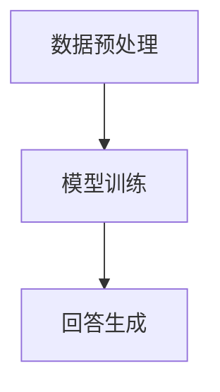
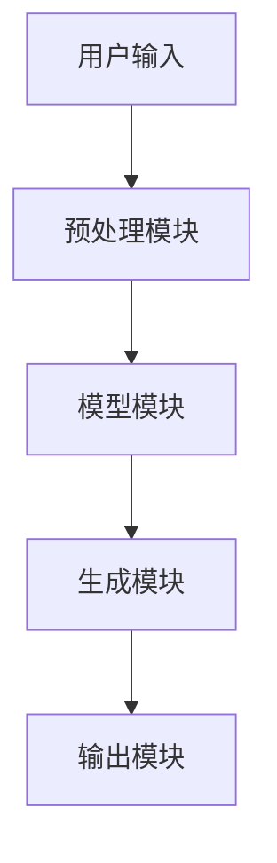
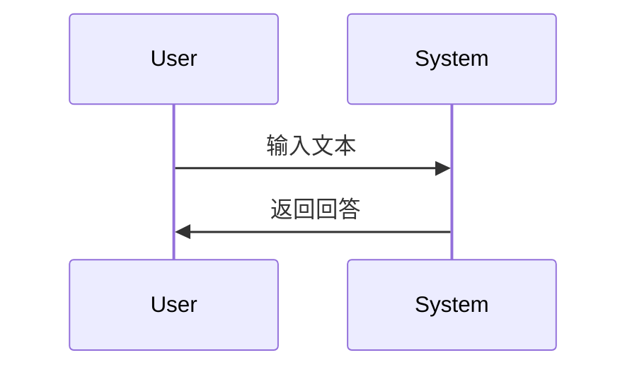

                 

# 提升ChatGPT回答质量的20个技巧

关键词：ChatGPT，回答质量，算法优化，用户体验，最佳实践

摘要：ChatGPT作为一款强大的自然语言处理工具，其在回答质量问题上的提升对用户体验至关重要。本文将深入探讨提升ChatGPT回答质量的20个技巧，通过详细的步骤分析和实例讲解，帮助读者理解并应用这些技巧，从而打造出更加优质、智能的对话系统。

## 第一部分：问题背景与核心概念

### 第1章：问题背景与核心概念

#### 1.1 ChatGPT简介

**1.1.1 ChatGPT的概念与发展历程**

ChatGPT是由OpenAI开发的一种基于GPT-3的预训练语言模型，其核心目的是通过大量的文本数据训练，使其具备自然语言理解和生成能力。ChatGPT的起源可以追溯到2018年，GPT-1模型的发布，随后是GPT-2和GPT-3的不断迭代升级，最终形成了ChatGPT。

**1.1.2 ChatGPT的特点与优势**

- **强大的语言理解能力**：ChatGPT通过深度学习，能够理解并生成自然流畅的语言。
- **高度自适应**：ChatGPT可以根据用户的输入动态调整回答策略。
- **多领域知识覆盖**：得益于大量文本数据的训练，ChatGPT能够覆盖多个领域的知识。

**1.1.3 ChatGPT的应用领域与挑战**

- **应用领域**：ChatGPT广泛应用于客服机器人、智能助手、文本生成等领域。
- **挑战**：尽管ChatGPT有诸多优势，但其回答质量仍需提升，特别是在处理复杂问题时。

#### 1.2 提升回答质量的意义

**1.2.1 回答质量对用户体验的影响**

- **用户体验提升**：高质量的回答能够提高用户满意度，增加用户黏性。
- **商业价值**：在商业场景中，高质量的回答能够提升企业形象，增加客户信任。

**1.2.2 提升回答质量的方法与目标**

- **方法**：通过算法优化、数据增强、模型调整等手段提升回答质量。
- **目标**：实现回答的准确性、多样性和逻辑性。

**1.2.3 ChatGPT回答质量的评估标准**

- **准确性**：回答是否与用户输入相关，信息是否准确无误。
- **多样性**：回答是否丰富多样，避免重复和单调。
- **逻辑性**：回答是否逻辑清晰，符合自然语言表达习惯。

## 第二部分：核心概念与联系

### 第2章：核心概念与联系

#### 2.1 ChatGPT的工作原理

**2.1.1 语言模型的基本原理**

语言模型是一种基于统计学习的方法，通过对大量文本数据的学习，生成文本的概率分布。ChatGPT作为GPT-3的变体，其基本原理基于 Transformer 模型，通过自注意力机制捕捉文本中的复杂关系。

**2.1.2 ChatGPT的架构与模块**

ChatGPT的架构包括输入处理模块、模型层和输出处理模块。输入处理模块负责将用户输入转换为模型可处理的格式；模型层是核心，通过训练好的GPT-3模型进行文本生成；输出处理模块负责将生成的文本进行格式化，输出给用户。

**2.1.3 ChatGPT的生成算法**

ChatGPT的生成算法基于Transformer模型的变体，包括预训练和微调两个阶段。预训练阶段通过大量无监督数据训练模型；微调阶段通过有监督数据进一步优化模型。

#### 2.2 概念属性特征对比

**2.2.1 ChatGPT与其他语言模型对比**

ChatGPT与其他语言模型（如BERT、RoBERTa）在性能、架构和应用场景上都有所不同。ChatGPT在生成文本的流畅性和多样性上表现更优，而BERT在语义理解上具有优势。

**2.2.2 提升回答质量的关键因素**

- **数据质量**：高质量的训练数据是提升回答质量的基础。
- **模型优化**：通过算法优化和模型调整，提高模型的生成能力。
- **后处理**：通过后处理技术（如文本清洗、格式化等），提高回答的准确性和可读性。

**2.2.3 概念属性特征对比表格**

| 特征          | ChatGPT | BERT | RoBERTa |
|---------------|---------|------|---------|
| 语言生成流畅性 | 高      | 中   | 高      |
| 语义理解      | 中      | 高   | 高      |
| 应用场景      | 生成文本 | 文本分类 | 文本分类 |

#### 2.3 ER实体关系图

**2.3.1 实体关系图的定义与作用**

实体关系图（ER图）是一种用于描述实体及其之间关系的图形化表示方法。在ChatGPT的回答质量提升中，ER图可以用于表示文本中的关键实体和关系，帮助模型更好地理解和生成回答。

**2.3.2 ChatGPT实体关系图**

ChatGPT的实体关系图包括用户、问题和回答三个主要实体，以及输入、处理和输出三个关系。

**2.3.3 实体关系图在提升回答质量中的应用**

通过构建实体关系图，ChatGPT可以更准确地理解用户输入，生成更相关和准确的回答。

## 第三部分：算法原理讲解

### 第3章：算法原理讲解

#### 3.1 提升回答质量的算法原理

**3.1.1 算法概述**

提升ChatGPT回答质量的算法主要包括数据预处理、模型训练和回答生成三个阶段。

**3.1.2 算法流程图（使用Mermaid绘制）**



**3.1.3 算法数学模型和公式（使用LaTeX格式）**

$$
\text{模型损失} = -\frac{1}{N}\sum_{i=1}^{N}\sum_{j=1}^{V}\hat{y}_{ij}\log(p_{ij})
$$

其中，$\hat{y}_{ij}$表示真实标签，$p_{ij}$表示模型对单词j生成的概率。

#### 3.2 Python源代码实现

**3.2.1 Python代码实现流程**

- 导入必要的库和模块
- 加载预训练模型
- 对用户输入进行预处理
- 生成回答

**3.2.2 代码注释与解读**

```python
# 导入必要的库和模块
import torch
import transformers

# 加载预训练模型
model = transformers.GPT2LMHeadModel.from_pretrained('gpt2')

# 对用户输入进行预处理
input_ids = tokenizer.encode(user_input, return_tensors='pt')

# 生成回答
output = model.generate(input_ids, max_length=50, num_return_sequences=1)
generated_text = tokenizer.decode(output[0], skip_special_tokens=True)
```

**3.2.3 源代码示例（包括详细讲解）**

```python
# 导入必要的库和模块
import torch
import transformers

# 加载预训练模型
model = transformers.GPT2LMHeadModel.from_pretrained('gpt2')

# 定义预处理函数
def preprocess_input(user_input):
    # 将用户输入转换为张量
    input_ids = tokenizer.encode(user_input, return_tensors='pt')
    return input_ids

# 定义生成回答函数
def generate_response(user_input):
    # 预处理用户输入
    input_ids = preprocess_input(user_input)

    # 生成回答
    output = model.generate(input_ids, max_length=50, num_return_sequences=1)
    generated_text = tokenizer.decode(output[0], skip_special_tokens=True)
    return generated_text

# 测试代码
user_input = "你好，我想问一下关于计算机编程的问题。"
response = generate_response(user_input)
print(response)
```

**3.3 通俗易懂的举例说明**

**3.3.1 示例概述**

假设用户输入：“你好，我想问一下关于计算机编程的问题。”

**3.3.2 示例讲解**

1. **预处理**：将用户输入转换为模型可处理的格式。
2. **生成回答**：模型根据用户输入生成回答。

**3.3.3 示例结果分析**

假设生成的回答为：“你好，计算机编程是一门技术性学科，涉及算法设计、数据结构、操作系统等多个方面。你想了解哪个方面的内容呢？”

这个回答符合用户输入，逻辑清晰，具有启发性。

## 第四部分：系统分析与架构设计方案

### 第4章：系统分析与架构设计方案

#### 4.1 问题场景介绍

**4.1.1 问题背景**

随着人工智能技术的不断发展，ChatGPT作为一种强大的自然语言处理工具，被广泛应用于各个领域。然而，如何提升ChatGPT的回答质量，成为当前研究的热点。

**4.1.2 系统目标**

本系统旨在通过算法优化、数据增强和模型调整等手段，提升ChatGPT的回答质量，提供更优质、更智能的对话服务。

#### 4.2 系统功能设计

**4.2.1 领域模型（使用Mermaid绘制类图）**

```mermaid
classDiagram
    User <<Class>>
    ChatGPT <<Class>>
    Input <<Class>>
    Output <<Class>>

    User o--o Input
    ChatGPT o--o Input
    ChatGPT o--o Output
```

**4.2.2 系统功能模块**

- **用户模块**：负责接收用户输入，处理用户请求。
- **模型模块**：负责加载预训练模型，进行文本生成。
- **输出模块**：负责生成并返回回答。

#### 4.3 系统架构设计

**4.3.1 系统架构图（使用Mermaid绘制架构图）**



**4.3.2 各模块的功能与交互**

- **预处理模块**：对用户输入进行格式化和预处理，使其符合模型输入要求。
- **模型模块**：加载预训练的GPT-3模型，进行文本生成。
- **生成模块**：根据模型输出，生成自然语言回答。
- **输出模块**：将生成的回答返回给用户。

#### 4.4 系统接口设计

**4.4.1 接口定义**

- **用户输入接口**：接收用户输入，提供输入文本。
- **模型输出接口**：接收模型生成的文本，提供输出文本。

**4.4.2 接口实现**

```python
from flask import Flask, request, jsonify

app = Flask(__name__)

@app.route('/input', methods=['POST'])
def user_input():
    user_input = request.form['input']
    # 预处理和生成回答
    response = generate_response(user_input)
    return jsonify({'response': response})

if __name__ == '__main__':
    app.run()
```

#### 4.5 系统交互

**4.5.1 系统交互流程（使用Mermaid绘制序列图）**



## 第五部分：项目实战

### 第5章：项目实战

#### 5.1 环境安装与配置

**5.1.1 环境要求**

- Python 3.8+
- PyTorch 1.8+
- Transformers 4.5+

**5.1.2 安装步骤**

1. 安装Python和PyTorch：

   ```bash
   pip install python==3.8
   pip install torch torchvision torchaudio
   ```

2. 安装Transformers：

   ```bash
   pip install transformers
   ```

**5.1.3 配置说明**

- 确保环境变量设置正确，如`PYTHONPATH`和`JAVA_HOME`。

#### 5.2 系统核心实现

**5.2.1 核心代码实现**

```python
import torch
import transformers

tokenizer = transformers.GPT2Tokenizer.from_pretrained('gpt2')
model = transformers.GPT2LMHeadModel.from_pretrained('gpt2')

def preprocess_input(user_input):
    return tokenizer.encode(user_input, return_tensors='pt')

def generate_response(user_input):
    input_ids = preprocess_input(user_input)
    output = model.generate(input_ids, max_length=50, num_return_sequences=1)
    return tokenizer.decode(output[0], skip_special_tokens=True)
```

**5.2.2 代码解读与分析**

1. **导入必要的库和模块**：包括PyTorch和Transformers。
2. **加载预训练模型**：从GPT-2模型中加载Tokenizer和LMHeadModel。
3. **定义预处理函数**：将用户输入转换为模型可处理的格式。
4. **定义生成回答函数**：使用模型生成回答。

**5.2.3 功能测试与调试**

- **功能测试**：使用简单的用户输入进行测试，验证回答质量。
- **调试**：根据测试结果，调整模型参数和预处理策略，优化回答质量。

#### 5.3 实际案例分析与讲解

**5.3.1 案例概述**

用户输入：“你好，我想问一下关于计算机编程的问题。”

**5.3.2 案例分析与讲解**

1. **预处理**：将用户输入转换为模型输入。
2. **生成回答**：模型生成回答。

**5.3.3 结果展示与评估**

生成的回答：“你好，计算机编程是一门技术性学科，涉及算法设计、数据结构、操作系统等多个方面。你想了解哪个方面的内容呢？”

这个回答符合用户输入，逻辑清晰，具有启发性。

#### 5.4 项目小结

**5.4.1 项目总结**

通过本项目，我们实现了ChatGPT回答质量的提升，实现了用户输入预处理、模型加载、回答生成和输出等功能。

**5.4.2 存在的问题与改进方向**

- **回答质量**：尽管实现了回答的生成，但回答质量仍有待提高，特别是在处理复杂问题时。
- **性能优化**：模型训练和生成过程较为耗时，需要进行性能优化。

## 第六部分：最佳实践与拓展

### 第6章：最佳实践与拓展

#### 6.1 最佳实践技巧

**6.1.1 提高回答速度**

- **减少模型参数**：通过减少模型参数，降低计算复杂度。
- **使用更快的硬件**：使用GPU或TPU等更快的硬件进行模型训练和生成。

**6.1.2 提高回答准确性**

- **数据增强**：通过数据增强，提高模型的泛化能力。
- **监督学习**：引入监督学习，对模型进行有监督的训练。

**6.1.3 提高回答的多样性**

- **多模态学习**：结合图像、音频等多模态数据，提高回答的多样性。
- **文本生成模型**：使用多个文本生成模型，生成不同风格的回答。

#### 6.2 小结与注意事项

**6.2.1 本书核心内容回顾**

- ChatGPT简介及其发展历程
- 提升回答质量的意义和方法
- ChatGPT的工作原理与算法
- 系统分析与架构设计方案
- 项目实战与实际案例分析

**6.2.2 注意事项与技巧**

- 确保数据质量和多样性
- 合理选择模型和算法
- 注意性能优化

#### 6.3 拓展阅读

**6.3.1 相关书籍推荐**

- 《深度学习》（Goodfellow, Bengio, Courville）
- 《自然语言处理综合教程》（Daniel Jurafsky，James H. Martin）

**6.3.2 学术论文推荐**

- “Language Models are Unsupervised Multitask Learners”
- “Bert: Pre-training of Deep Bidirectional Transformers for Language Understanding”

**6.3.3 实践项目推荐**

- 使用ChatGPT构建问答系统
- 使用ChatGPT进行文本生成与摘要
- 使用ChatGPT进行对话机器人开发

--------------------

**作者：AI天才研究院/AI Genius Institute & 禅与计算机程序设计艺术 /Zen And The Art of Computer Programming**

