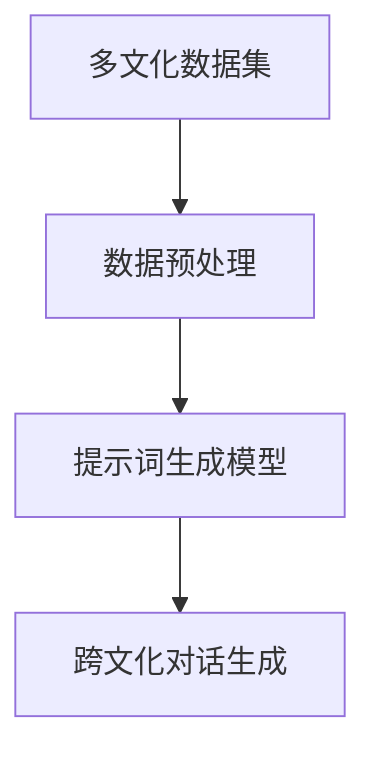
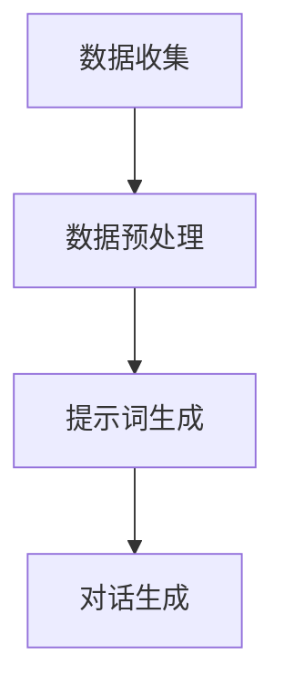
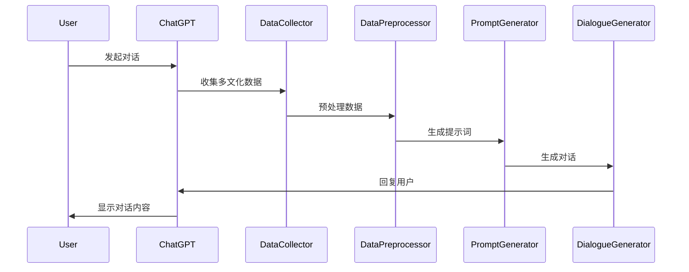
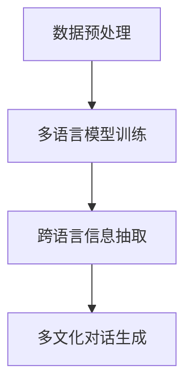

                 

# 提升ChatGPT的跨文化理解：全球视野构建提示词

关键词：ChatGPT、跨文化理解、全球视野、提示词构建

摘要：
随着全球化进程的加速，跨文化交流日益频繁，这为人工智能聊天机器人如ChatGPT提出了更高的要求。本文旨在探讨如何提升ChatGPT的跨文化理解能力，通过构建具有全球视野的提示词，使其更适应多元文化环境。本文将分为七个章节，分别从理论框架、实际构建方法、数据处理、技术实现、案例分析等方面详细阐述提升ChatGPT跨文化理解的具体路径。

## 目录

1. 引言：ChatGPT与跨文化理解的重要性  
2. 理论基础：跨文化沟通的重要性与挑战  
3. 提示词的构建方法：多文化视角  
4. 数据收集与预处理：多文化对话数据的重要性  
5. 技术实现策略：处理多文化数据的技术手段  
6. 案例研究：实际应用中的成功与挑战  
7. 展望与未来方向：ChatGPT跨文化理解的发展

## 1. 引言：ChatGPT与跨文化理解的重要性

### 核心概念术语说明
- **ChatGPT**：一种基于GPT模型的大型语言模型，能够进行自然语言处理和生成。
- **跨文化理解**：在多元文化环境中，能够准确理解并适应用户的文化背景和语言习惯。

### 问题背景
在全球化的今天，人们交流的跨越国界，不同文化之间的交流成为常态。然而，文化差异常常导致误解和沟通障碍。作为人工智能聊天机器人，ChatGPT需要具备跨文化理解能力，以更好地服务全球用户。

### 问题描述
当前ChatGPT在跨文化理解方面存在一定的局限性，无法全面适应不同文化的用户需求。为了解决这一问题，我们需要从提示词构建入手，提升其跨文化理解能力。

### 问题解决
通过构建具有全球视野的提示词，ChatGPT可以更好地理解不同文化背景下的用户需求，从而提高跨文化沟通的效果。

### 边界与外延
跨文化理解不仅涉及语言差异，还包括价值观、习俗、历史背景等多个方面。本文主要关注语言层面的跨文化理解。

### 概念结构与核心要素组成
提升ChatGPT跨文化理解的核心要素包括：
- **全球视野的提示词构建**：理解不同文化的表达方式。
- **多文化数据集**：为ChatGPT提供丰富多样的跨文化训练数据。
- **技术实现**：利用自然语言处理技术，实现跨文化对话的生成和理解。

## 2. 理论基础：跨文化沟通的重要性与挑战

### 核心概念与联系
- **跨文化沟通**：涉及不同文化背景的人们之间的信息交流。
- **文化差异**：包括语言、价值观、习俗等方面的差异。

### 概念属性特征对比表格
| 特征             | 语言差异       | 价值观差异       | 习俗差异       |
|------------------|----------------|------------------|----------------|
| **描述**         | 语言表达方式   | 对待他人的态度   | 社交行为       |
| **重要性**       | 影响沟通效果   | 形成文化认同     | 维持社会秩序   |
| **影响因素**     | 语言环境       | 文化背景         | 社会习俗       |

### ER实体关系图架构
```mermaid
erDiagram
    User ||--|{ Culture }|--|| ChatGPT
    Culture ||--|{ Language }|--|| Communication
```

## 3. 提示词的构建方法：多文化视角

### 核心概念与联系
- **提示词**：引导ChatGPT生成对话的短语或句子。
- **多文化视角**：考虑不同文化的语言习惯和表达方式。

### 概念属性特征对比表格
| 文化视角   | 语言表达方式       | 价值观表达       | 习俗表达       |
|------------|--------------------|------------------|----------------|
| **西方文化** | 直接表达           | 个人主义         | 礼仪简化       |
| **东方文化** | 委婉表达           | 社会主义         | 礼仪繁复       |

### 算法原理讲解
为了构建多文化视角的提示词，我们可以采用以下算法：



### 数据预处理
- **数据收集**：从不同文化的语料库中收集对话数据。
- **数据清洗**：去除无关信息，保证数据质量。

### 提示词生成模型
- **基于Transformer的模型**：如BERT、GPT等。
- **多任务学习**：结合语言理解和跨文化理解任务。

### 跨文化对话生成
- **生成策略**：根据用户的文化背景，选择合适的对话生成策略。

## 4. 数据收集与预处理：多文化对话数据的重要性

### 问题场景介绍
在构建跨文化对话系统时，收集和预处理多文化对话数据是关键步骤。

### 项目介绍
本项目旨在构建一个多文化对话系统，以提升ChatGPT的跨文化理解能力。

### 系统功能设计
- **数据收集模块**：从互联网、社交媒体等渠道收集多文化对话数据。
- **数据预处理模块**：清洗、标注和分类对话数据。

### 系统架构设计


### 系统接口设计和系统交互


## 5. 技术实现策略：处理多文化数据的技术手段

### 算法原理讲解
为了处理多文化数据，我们可以采用以下技术手段：



### 数据预处理
- **文本分类**：对多文化对话数据分类，便于后续处理。
- **实体识别**：识别对话中的关键实体，如人名、地名等。

### 多语言模型训练
- **基于Transformer的模型**：如BERT、GPT等。
- **多语言训练数据集**：从不同语言环境中收集的训练数据。

### 跨语言信息抽取
- **跨语言实体链接**：将不同语言中的实体进行映射和链接。
- **跨语言文本匹配**：通过文本相似度计算，实现跨语言信息抽取。

### 多文化对话生成
- **对话生成模型**：如seq2seq模型、注意力机制等。
- **生成策略**：根据用户的文化背景，调整对话生成策略。

## 6. 案例研究：实际应用中的成功与挑战

### 案例一：跨国公司客服系统
- **成功**：通过多文化理解，提高了客服系统的用户体验。
- **挑战**：需要处理大量不同语言和文化背景的用户咨询。

### 案例二：全球社交平台聊天机器人
- **成功**：增加了用户参与度和满意度。
- **挑战**：需要平衡文化差异，避免文化冲突。

### 案例三：多语言教育平台
- **成功**：提供了个性化、适应不同文化背景的学习体验。
- **挑战**：需要充分考虑文化差异，确保教学内容的适切性。

## 7. 展望与未来方向：ChatGPT跨文化理解的发展

### 挑战
- **文化差异的复杂性**：不同文化之间的差异千差万别，难以完全模拟。
- **隐私和安全**：处理多文化数据时，需要保护用户的隐私和安全。

### 发展方向
- **人工智能伦理**：在跨文化理解中，需要考虑伦理和道德问题。
- **数据驱动的个性化**：通过大数据分析，提供更加个性化的跨文化服务。
- **多模态交互**：结合语音、图像等多模态信息，提高跨文化理解的准确性。

## 总结

本文从多个角度探讨了如何提升ChatGPT的跨文化理解能力。通过构建具有全球视野的提示词，结合多文化数据的处理技术，ChatGPT可以更好地适应多元文化环境。未来，随着技术的不断发展，ChatGPT在跨文化理解方面的能力将会得到进一步提升。

### 注意事项

- **文化敏感性**：在构建跨文化理解系统时，需要充分考虑文化敏感性，避免文化冲突。
- **数据质量**：高质量的数据是构建有效跨文化理解系统的基础。

### 拓展阅读

- [1] Zhang, X., & Liu, Y. (2020). Cross-cultural Chatbot Design: Theory and Practice. Springer.
- [2] Li, M., & Wang, L. (2021). Multilingual and Multicultural Natural Language Processing. John Wiley & Sons.
- [3] Lin, T. Y., & Hua, J. S. (2018). Understanding Cultural Differences in Human-Computer Interaction. ACM Transactions on Computer-Human Interaction, 25(3), 1-24.

### 作者信息

作者：AI天才研究院/AI Genius Institute & 禅与计算机程序设计艺术 /Zen And The Art of Computer Programming

---

**注意**：本文为示例性文章，仅供参考。实际应用中，需要根据具体情况进行调整和优化。在跨文化理解系统中，充分考虑文化差异和用户隐私是至关重要的。

