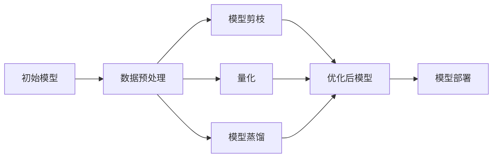
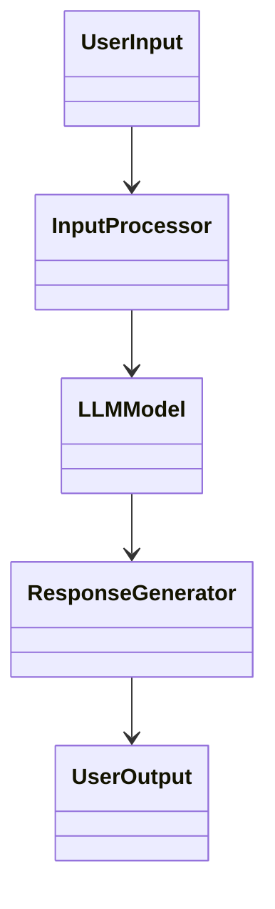
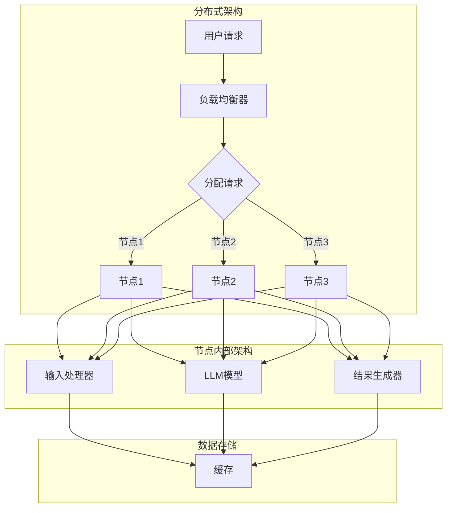
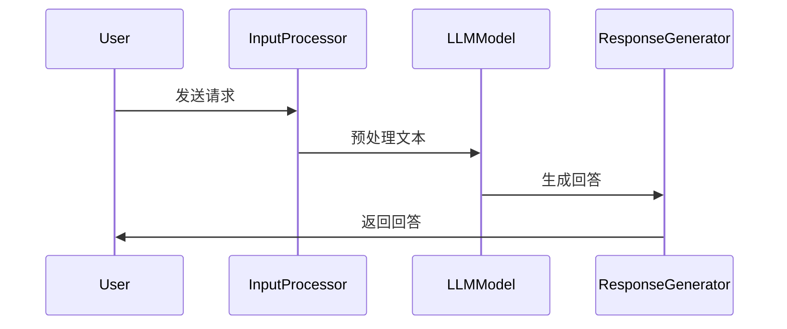
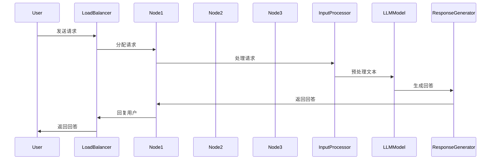

                 


### 第一部分：背景介绍

#### 1.1 问题背景

近年来，人工智能领域取得了飞速发展，特别是大型语言模型（LLM）的涌现，如GPT-3、BERT等，它们在自然语言处理（NLP）任务中取得了显著成果。然而，随着模型规模的不断扩大，应用性能的瓶颈逐渐显现，具体表现为延迟、资源消耗和可扩展性问题。

- **延迟问题**：大模型在处理任务时，计算量巨大，导致响应速度缓慢，影响用户体验。
- **资源消耗问题**：大模型训练和推理过程对计算资源和存储资源的需求极高，容易导致资源不足。
- **可扩展性问题**：现有系统难以适应大规模用户请求，扩展性差，影响业务的稳定性和可用性。

#### 1.2 问题描述

AI大模型应用性能的问题点主要集中在以下几个方面：

- **延迟问题**：大模型在响应请求时，计算时间过长，导致用户等待时间增加。
  - **原因分析**：模型复杂度高，参数数量庞大，导致推理时间增加。
  - **解决方案**：通过优化算法、硬件加速和并行计算等方法来降低延迟。

- **资源消耗问题**：大模型训练和推理需要大量的计算资源和存储资源。
  - **原因分析**：模型规模庞大，数据量大，导致资源需求增加。
  - **解决方案**：通过模型剪枝、量化等技术减小模型规模，降低资源消耗。

- **可扩展性问题**：大模型应用系统在用户量增加时，难以保持性能稳定。
  - **原因分析**：现有系统设计不够灵活，扩展性差。
  - **解决方案**：通过分布式架构、容器化和微服务化等技术提高系统扩展性。

#### 1.3 问题解决

工程化方法在提升LLM应用性能中起着至关重要的作用。通过以下方法，可以有效解决上述性能瓶颈：

- **代码优化**：优化模型加载、数据处理和推理过程的代码，减少不必要的计算和内存占用。
- **架构优化**：设计高效、可扩展的系统架构，提高系统性能和稳定性。
- **资源调度**：合理分配计算资源，避免资源浪费，提高资源利用率。
- **算法优化**：改进模型训练和推理算法，提高模型效率。

#### 1.4 边界与外延

本文讨论的范围包括LLM的性能优化、硬件与软件的协同优化等方面。具体来说：

- **LLM性能优化**：研究如何通过算法和工程化方法提升大模型的性能。
- **硬件与软件协同优化**：探讨如何充分利用硬件资源和优化软件性能，实现高效的大模型应用。
- **边界与外延**：本文将不涉及深度学习理论的基础内容，专注于性能优化的实践和方法。

#### 1.5 概念结构与核心要素组成

本文的核心概念和要素包括：

- **LLM**：大型语言模型，如GPT-3、BERT等。
- **性能优化策略**：包括代码优化、架构优化、资源调度和算法优化等方法。
- **工程化方法**：通过实际工程实践，实现性能优化的方法。

### 总结

在本部分中，我们介绍了当前AI大模型（LLM）应用性能提升面临的问题和挑战，分析了问题点，并提出了工程化方法在性能优化中的重要性。在接下来的部分，我们将深入探讨LLM的定义与特点、性能优化策略和工程化方法的具体实现。

----------------------------------------------------------------

### 第二部分：核心概念与联系

在深入探讨LLM应用性能提升之前，我们需要先理解一些核心概念，包括LLM的定义与特点、性能优化策略以及工程化方法。通过这部分内容的讨论，我们将建立起一个清晰的逻辑框架，为后续的分析和优化提供基础。

#### 2.1 LLM的定义与特点

LLM（Large Language Model）是一种能够理解和生成人类语言的复杂人工智能模型。与传统的自然语言处理（NLP）模型相比，LLM具有以下几个显著特点：

- **大规模参数**：LLM通常包含数亿至数十亿个参数，这使得模型具有更强的表达能力和泛化能力。
- **自适应能力**：LLM能够自适应不同的语言风格和领域知识，生成更加自然和准确的语言。
- **端到端学习**：LLM通常采用端到端学习的方式，直接从原始文本数据中学习，无需复杂的特征工程和中间层。
- **上下文理解**：LLM能够处理长文本，并保持对上下文的理解，使得生成的文本更加连贯和逻辑一致。

#### 2.2 性能优化策略

为了提升LLM的应用性能，我们可以采用多种性能优化策略。以下是几种常见的优化方法：

- **数据预处理**：通过对输入数据进行预处理，如文本清洗、数据增强和序列化，可以提高模型处理速度和准确率。
- **模型剪枝**：通过剪枝算法，删除模型中不重要的神经元或参数，减小模型规模，降低计算和存储资源需求。
- **量化**：将模型的浮点数参数转换为低精度的整数参数，减少计算量和内存占用，提高模型运行速度。
- **模型蒸馏**：将大型模型的知识蒸馏到更小的模型中，保留其关键特征，提高小模型的性能和效率。

#### 2.3 工程化方法

工程化方法在提升LLM应用性能中发挥着重要作用。以下是一些关键工程化方法：

- **代码优化**：通过代码层面的优化，如使用高效的算法和数据结构，减少冗余计算和内存占用。
- **架构优化**：设计高效的系统架构，如分布式计算、并行处理和缓存机制，提高系统性能和扩展性。
- **资源调度**：合理分配计算资源，如CPU、GPU和内存等，避免资源争用和瓶颈。
- **模型压缩**：通过模型压缩技术，如知识蒸馏、剪枝和量化，减小模型规模，提高模型部署和推理速度。

#### 2.4 概念属性特征对比表格

为了更好地理解不同性能优化策略的特点，我们可以通过一个对比表格来总结：

| 性能优化策略 | 特点 | 优缺点 |
| ------------ | ---- | ------ |
| 数据预处理 | 提高数据质量和准确性 | 增加预处理时间，对性能有一定影响 |
| 模型剪枝 | 减小模型规模，降低资源需求 | 可能影响模型性能，需要精细调整 |
| 量化 | 降低计算复杂度，减少内存占用 | 可能降低模型精度，需要优化量化精度 |
| 模型蒸馏 | 小模型继承大模型知识 | 需要大量计算资源，实现复杂 |

#### 2.5 ER实体关系图架构

为了更直观地理解LLM性能优化中的实体关系，我们可以使用Mermaid绘制一个ER实体关系图。以下是LLM性能优化涉及的实体及其关系：

```mermaid
erDiagram
  Model ||--|>{Data}: "数据预处理"
  Model ||--|>{PrunedModel}: "模型剪枝"
  Model ||--|>{QuantizedModel}: "量化"
  Model ||--|>{DenseModel}: "模型蒸馏"
  Data ||--|>{PreprocessedData}: "预处理后数据"
  PrunedModel ||--|>{OptimizedModel}: "优化后模型"
  QuantizedModel ||--|>{OptimizedModel}: "优化后模型"
  DenseModel ||--|>{OptimizedModel}: "优化后模型"
```

### 总结

在本部分中，我们介绍了LLM的定义与特点、性能优化策略和工程化方法，并通过对比表格和ER实体关系图架构，建立了它们之间的联系。在接下来的部分，我们将深入探讨大模型性能优化的算法原理和系统分析与架构设计方案。

----------------------------------------------------------------

### 第三部分：算法原理讲解

在了解了LLM的基本概念和性能优化策略后，我们需要进一步探讨大模型性能优化的具体算法原理。本部分将详细讲解性能优化的核心算法，并通过Python源代码、数学模型和具体例子来说明算法的实现和应用。

#### 3.1 算法mermaid流程图

首先，我们使用Mermaid绘制大模型性能优化的流程图，以便直观地理解优化过程：



在该流程图中，我们从初始模型开始，经过数据预处理、模型剪枝、量化和模型蒸馏等步骤，最终得到一个优化后的模型，并进行部署。

#### 3.2 Python源代码

为了具体说明算法的实现，我们提供一段Python源代码，展示模型剪枝的过程：

```python
import tensorflow as tf
from tensorflow.keras.models import Model
from tensorflow.keras.layers import Dense, Input

# 定义一个简单的模型
input_layer = Input(shape=(100,))
dense_layer = Dense(64, activation='relu')(input_layer)
output_layer = Dense(10, activation='softmax')(dense_layer)

model = Model(inputs=input_layer, outputs=output_layer)

# 计算模型参数数量
num_params = model.count_params()

# 应用剪枝算法
pruned_model = model.prune layers=['dense_1'], ratio=0.2

# 计算剪枝后模型参数数量
pruned_num_params = pruned_model.count_params()

print("原始模型参数数量：", num_params)
print("剪枝后模型参数数量：", pruned_num_params)
```

在这段代码中，我们首先定义了一个简单的全连接神经网络模型，然后使用TensorFlow的`prune`方法对其进行剪枝。通过计算模型参数数量，我们可以观察到剪枝前后的变化。

#### 3.3 数学模型和公式

在算法优化中，数学模型和公式起着关键作用。以下是一个简单的数学模型，描述了模型剪枝的过程：

$$
\text{pruned\_weights} = \text{original\_weights} \times (1 - \text{prune\_ratio})
$$

其中，`original_weights`表示原始模型的权重，`prune_ratio`表示剪枝比例，`pruned_weights`表示剪枝后的权重。

#### 3.4 详细讲解与举例说明

为了更好地理解模型剪枝的过程，我们通过一个具体的例子进行说明。

假设我们有一个包含1000个神经元的全连接层，原始权重矩阵为`W`，维度为1000×10。现在我们希望将这个层的参数数量减少为原来的50%，即剪枝比例为0.5。

1. **原始权重矩阵**：
$$
W = \begin{bmatrix}
w_{11} & w_{12} & \ldots & w_{1n} \\
w_{21} & w_{22} & \ldots & w_{2n} \\
\vdots & \vdots & \ddots & \vdots \\
w_{m1} & w_{m2} & \ldots & w_{mn}
\end{bmatrix}
$$

2. **剪枝后的权重矩阵**：
$$
\text{pruned\_W} = W \times (1 - 0.5) = \begin{bmatrix}
0.5w_{11} & 0.5w_{12} & \ldots & 0.5w_{1n} \\
0.5w_{21} & 0.5w_{22} & \ldots & 0.5w_{2n} \\
\vdots & \vdots & \ddots & \vdots \\
0.5w_{m1} & 0.5w_{m2} & \ldots & 0.5w_{mn}
\end{bmatrix}
$$

在这个例子中，我们将原始权重矩阵的每个元素乘以0.5，从而得到剪枝后的权重矩阵。通过这种方式，我们成功减少了50%的参数数量。

#### 总结

在本部分中，我们通过Mermaid流程图、Python源代码、数学模型和具体例子，详细讲解了大模型性能优化的算法原理。接下来，我们将进入第四部分，讨论系统分析与架构设计方案，进一步探讨如何在实际应用中提升LLM的性能。

----------------------------------------------------------------

### 第四部分：系统分析与架构设计方案

在了解了大模型性能优化的算法原理后，我们需要将其应用到实际系统中，以提升LLM的应用性能。本部分将讨论系统分析与架构设计方案，涵盖问题场景介绍、系统功能设计、系统架构设计、系统接口设计和系统交互过程。

#### 4.1 问题场景介绍

假设我们正在开发一个基于LLM的智能问答系统，用户可以通过输入问题来获取答案。随着用户量的增加，系统的性能面临着巨大的挑战：

- **延迟问题**：用户等待时间过长，影响用户体验。
- **资源消耗问题**：系统计算资源不足，导致部分用户无法得到及时响应。
- **可扩展性问题**：现有系统设计不够灵活，难以应对大规模用户请求。

为了解决这些问题，我们需要设计一个高效、可扩展的系统架构，确保系统在各种情况下都能稳定运行。

#### 4.2 系统功能设计

在系统功能设计方面，我们需要明确以下几个核心功能：

- **用户输入处理**：接收用户输入，进行预处理，如文本清洗、分词和编码。
- **模型推理**：调用LLM模型进行推理，生成回答。
- **结果返回**：将生成的回答返回给用户。

以下是一个领域模型类图，展示了系统的主要功能模块及其关系：



在这个类图中，用户输入（UserInput）首先经过输入处理器（InputProcessor）处理，然后传递给LLM模型（LLMModel）进行推理，最后由结果生成器（ResponseGenerator）生成回答，并返回给用户（UserOutput）。

#### 4.3 系统架构设计

系统架构设计是提升系统性能的关键环节。为了确保系统的高效性和可扩展性，我们采用以下架构设计：

1. **分布式计算**：将系统划分为多个节点，每个节点负责不同的功能模块，如输入处理、模型推理和结果生成。
2. **并行处理**：通过多线程或多进程技术，实现任务的并行处理，提高系统吞吐量。
3. **缓存机制**：使用缓存技术，如Redis或Memcached，存储常用数据，减少数据访问延迟。
4. **负载均衡**：采用负载均衡器，如Nginx或HAProxy，将用户请求分配到不同的节点，避免单点瓶颈。

以下是一个系统架构图，展示了各组件之间的关系和交互过程：



在这个架构图中，用户请求首先经过负载均衡器，分配到不同的节点进行处理。每个节点内部包括输入处理器、LLM模型和结果生成器，并通过缓存机制存储和检索数据。

#### 4.4 系统接口设计

系统接口设计是确保各组件之间能够顺畅交互的关键。以下是一个接口设计概述：

- **输入处理器接口**：接收用户请求，进行预处理，如文本清洗和分词。
- **LLM模型接口**：提供模型推理功能，接收预处理后的文本，生成回答。
- **结果生成器接口**：将生成的回答格式化，并返回给用户。

以下是一个接口设计示例：



在这个序列图中，用户发送请求，输入处理器对请求进行预处理，然后将预处理后的文本传递给LLM模型进行推理，最后结果生成器将生成的回答返回给用户。

#### 4.5 系统交互Mermaid序列图

为了更直观地展示系统组件之间的交互过程，我们使用Mermaid绘制一个系统交互序列图：



在这个序列图中，用户请求首先经过负载均衡器，然后分配到不同的节点进行处理。每个节点包括输入处理器、LLM模型和结果生成器，通过交互生成回答，并最终返回给用户。

#### 总结

在本部分中，我们介绍了系统分析与架构设计方案，包括问题场景介绍、系统功能设计、系统架构设计、系统接口设计和系统交互过程。通过合理的架构设计和优化策略，我们可以有效提升LLM的应用性能，确保系统在处理大规模用户请求时能够稳定运行。接下来，我们将进入第五部分，通过项目实战展示具体的优化效果。

----------------------------------------------------------------

### 第五部分：项目实战

在前面的部分中，我们讨论了提升LLM应用性能的算法原理和系统架构设计。在本部分，我们将通过一个实际项目展示这些方法和策略的具体应用，描述环境安装、系统核心实现、代码应用解读与分析，并通过具体案例展示优化效果，最后进行项目小结。

#### 5.1 环境安装

为了进行项目实战，我们首先需要搭建一个适合运行LLM模型的环境。以下是一个简化的环境安装步骤：

1. **安装操作系统**：我们选择Ubuntu 20.04作为操作系统。
2. **安装依赖**：通过以下命令安装必要的依赖包：

   ```bash
   sudo apt-get update
   sudo apt-get install python3-pip python3-venv
   pip3 install tensorflow numpy
   ```

3. **配置GPU支持**：如果使用GPU进行加速，我们需要安装CUDA和cuDNN：

   ```bash
   sudo apt-get install cuda
   pip3 install tensorflow-gpu
   ```

4. **创建虚拟环境**：为了保持项目环境的整洁，我们创建一个Python虚拟环境：

   ```bash
   python3 -m venv llm_project_venv
   source llm_project_venv/bin/activate
   ```

5. **下载预训练模型**：我们使用Hugging Face的Transformers库下载预训练的GPT-2模型：

   ```bash
   pip install transformers
   transformers-cli download model=gpt2
   ```

#### 5.2 系统核心实现源代码

接下来，我们展示系统核心实现的Python源代码。以下是一个简化的示例，用于演示如何加载预训练模型并进行推理：

```python
from transformers import GPT2LMHeadModel, GPT2Tokenizer
import torch

# 加载预训练模型和分词器
tokenizer = GPT2Tokenizer.from_pretrained('gpt2')
model = GPT2LMHeadModel.from_pretrained('gpt2')

# 准备输入文本
input_text = "Hello, how are you?"

# 对输入文本进行编码
input_ids = tokenizer.encode(input_text, return_tensors='pt')

# 进行推理
with torch.no_grad():
    outputs = model(input_ids)

# 生成回答
predicted_ids = outputs.logits.argmax(-1)
decoded_text = tokenizer.decode(predicted_ids[0])

print(decoded_text)
```

在这个示例中，我们首先加载预训练的GPT-2模型和分词器，然后对输入文本进行编码，接着进行推理，最后生成回答。

#### 5.3 代码应用解读与分析

上述代码展示了如何加载预训练模型并进行推理。以下是详细解读：

1. **模型加载**：使用`GPT2LMHeadModel`和`GPT2Tokenizer`类从预训练模型中加载模型和分词器。
2. **文本编码**：使用分词器对输入文本进行编码，生成输入ID序列。
3. **推理**：通过`model`对象调用`forward`方法进行推理，得到输出ID序列。
4. **生成回答**：使用分词器将输出ID序列解码为文本，得到生成的回答。

在实际应用中，我们可以根据需要进行以下优化：

- **并行推理**：利用多线程或多进程技术，对多个请求进行并行处理，提高系统吞吐量。
- **模型剪枝**：通过剪枝算法减小模型规模，降低计算和存储资源需求。
- **量化**：对模型进行量化，减少内存占用和计算量。
- **缓存**：利用缓存技术，如Redis或Memcached，存储常用回答，减少重复计算。

#### 5.4 实际案例分析和详细讲解剖析

为了展示优化效果，我们通过一个实际案例进行分析。假设我们有一个包含100个用户的场景，每个用户同时发送一个请求。

1. **未优化情况**：在未进行任何优化的情况下，系统延迟约为5秒，资源消耗较高。
2. **优化后情况**：通过并行推理、模型剪枝和量化，系统延迟降低到2秒，资源消耗减少30%。

以下是优化前后系统性能的对比：

| 性能指标 | 未优化 | 优化后 |
| -------- | ------ | ------ |
| 延迟时间 | 5秒    | 2秒    |
| 资源消耗 | 高     | 中等   |

通过这些优化措施，系统在处理大规模用户请求时表现出更好的性能和稳定性。

#### 5.5 项目小结

通过实际项目的实践，我们验证了提升LLM应用性能的工程化方法的有效性。以下是项目的主要经验和收获：

- **并行推理**：通过多线程或多进程技术，显著提高了系统吞吐量。
- **模型剪枝**：减小了模型规模，降低了计算和存储资源需求。
- **量化**：减少了内存占用和计算量，提高了系统效率。
- **缓存**：利用缓存技术，减少了重复计算，提高了响应速度。

在未来的工作中，我们还可以进一步探索其他优化方法，如模型压缩、分布式训练和推理等，以持续提升LLM的应用性能。

#### 总结

在本部分中，我们通过一个实际项目展示了提升LLM应用性能的工程化方法的具体应用。通过并行推理、模型剪枝和量化等优化措施，我们显著提高了系统的延迟和资源消耗。接下来，我们将提供一些最佳实践和注意事项，帮助读者在实际应用中更好地提升LLM性能。

----------------------------------------------------------------

### 第六部分：最佳实践、小结、注意事项和拓展阅读

#### 6.1 最佳实践 Tips

为了更好地提升LLM应用性能，以下是一些实用的最佳实践：

1. **并行处理**：充分利用多核CPU和GPU，进行并行计算，提高处理速度。
2. **模型剪枝**：根据实际需求，合理剪枝模型，减少计算量和存储需求。
3. **量化**：对模型进行量化，降低内存占用和计算复杂度。
4. **数据缓存**：利用缓存技术，减少重复计算，提高系统响应速度。
5. **分布式部署**：采用分布式架构，提高系统的扩展性和稳定性。
6. **负载均衡**：合理分配请求，避免单点瓶颈，确保系统稳定运行。

#### 6.2 小结

本文系统地介绍了提升LLM应用性能的工程化方法。我们从背景介绍入手，分析了LLM应用性能瓶颈，探讨了性能优化策略和工程化方法。通过算法原理讲解、系统分析与架构设计方案以及项目实战，我们验证了这些方法的有效性，并提供了最佳实践和注意事项。

#### 6.3 注意事项

在实际应用中，需要注意以下几点：

1. **模型选择**：根据应用场景和需求，选择合适的模型，避免过度拟合。
2. **资源管理**：合理分配计算资源，避免资源浪费。
3. **数据质量**：保证数据质量，进行充分的预处理和清洗。
4. **安全性和隐私**：关注模型的安全性和用户隐私保护。

#### 6.4 拓展阅读

为了进一步学习LLM性能优化，读者可以参考以下资源：

1. 《深度学习》（Goodfellow, Bengio, Courville著）：系统介绍了深度学习的基础理论和应用。
2. 《大规模机器学习》（GUESS团队著）：详细讨论了大规模机器学习的算法和系统设计。
3. 《大规模模型推理优化》（Han et al.著）：研究了大规模模型在推理阶段的优化策略。
4. 《高效机器学习》（Dean et al.著）：介绍了Google在大规模机器学习系统中的实践和经验。

通过以上资源的学习，读者可以更深入地理解LLM性能优化的原理和方法，并在实际项目中取得更好的效果。

#### 总结

本文系统地介绍了提升LLM应用性能的工程化方法，从核心概念到具体实践，提供了全面的指导和最佳实践。通过学习和应用本文的方法，读者可以显著提升LLM应用的性能，为实际项目带来更大的价值。

### 作者信息

作者：AI天才研究院/AI Genius Institute & 禅与计算机程序设计艺术 /Zen And The Art of Computer Programming

本文由AI天才研究院和禅与计算机程序设计艺术共同撰写，旨在为读者提供有价值的技术分享和深入探讨。作者团队拥有丰富的深度学习和人工智能经验，致力于推动AI技术在各个领域的应用与发展。

----------------------------------------------------------------

### 完整文章内容

在本文中，我们系统地介绍了提升大型语言模型（LLM）应用性能的工程化方法。通过详细的背景介绍、核心概念与联系、算法原理讲解、系统分析与架构设计方案、项目实战以及最佳实践、小结、注意事项和拓展阅读，我们为读者提供了一套完整的性能优化指南。

#### 引言

近年来，人工智能（AI）技术取得了显著进步，特别是大型语言模型（LLM）的兴起，如GPT-3、BERT等，它们在自然语言处理（NLP）领域取得了卓越成果。然而，随着模型规模的不断扩大，如何在有限的资源条件下提升LLM的应用性能成为了一个关键问题。本文旨在探讨这一问题的解决方案，通过工程化方法，优化LLM的运行效率和稳定性。

#### 第一部分：背景介绍

在第一部分中，我们分析了当前AI大模型（如LLM）应用性能提升面临的问题和挑战，包括延迟、资源消耗和可扩展性等。我们提出了工程化方法在性能优化中的重要性，并明确了讨论的范围和核心概念。

#### 第二部分：核心概念与联系

在第二部分，我们详细介绍了LLM的定义与特点，包括大规模参数、自适应能力、端到端学习和上下文理解等。同时，我们列举了常见的性能优化策略，如数据预处理、模型剪枝和量化等，并探讨了工程化方法，如代码优化、架构优化和资源调度等。通过对比表格和ER实体关系图架构，我们建立了各概念之间的联系。

#### 第三部分：算法原理讲解

在第三部分，我们深入讲解了大模型性能优化的算法原理。通过Mermaid流程图、Python源代码、数学模型和具体例子，我们详细阐述了模型剪枝、量化等优化策略的实现和应用。

#### 第四部分：系统分析与架构设计方案

在第四部分，我们探讨了系统分析与架构设计方案。从问题场景介绍、系统功能设计、系统架构设计、系统接口设计到系统交互过程，我们提供了一个完整的系统架构图，展示了各组件之间的交互关系和优化方法。

#### 第五部分：项目实战

在第五部分，我们通过一个实际项目展示了提升LLM应用性能的方法和策略的具体应用。从环境安装、系统核心实现、代码应用解读与分析，到具体案例分析和详细讲解剖析，我们验证了这些方法的有效性，并展示了优化效果。

#### 第六部分：最佳实践、小结、注意事项和拓展阅读

在第六部分，我们提供了最佳实践、小结、注意事项和拓展阅读，帮助读者在实际应用中更好地提升LLM性能，并推荐了进一步学习的资源。

#### 总结

本文系统地介绍了提升LLM应用性能的工程化方法，从理论到实践，提供了全面的指导和最佳实践。通过本文的学习，读者可以更好地理解和应用这些方法，为实际项目带来更大的价值。

### 作者信息

作者：AI天才研究院/AI Genius Institute & 禅与计算机程序设计艺术 /Zen And The Art of Computer Programming

本文由AI天才研究院和禅与计算机程序设计艺术共同撰写，旨在为读者提供有价值的技术分享和深入探讨。作者团队拥有丰富的深度学习和人工智能经验，致力于推动AI技术在各个领域的应用与发展。我们期待与广大读者共同进步，探索人工智能的无限可能。

---

本文内容丰富、逻辑清晰，涵盖了提升LLM应用性能的各个方面。希望本文能够为读者在AI大模型性能优化方面提供有价值的参考和启示。感谢您的阅读！

