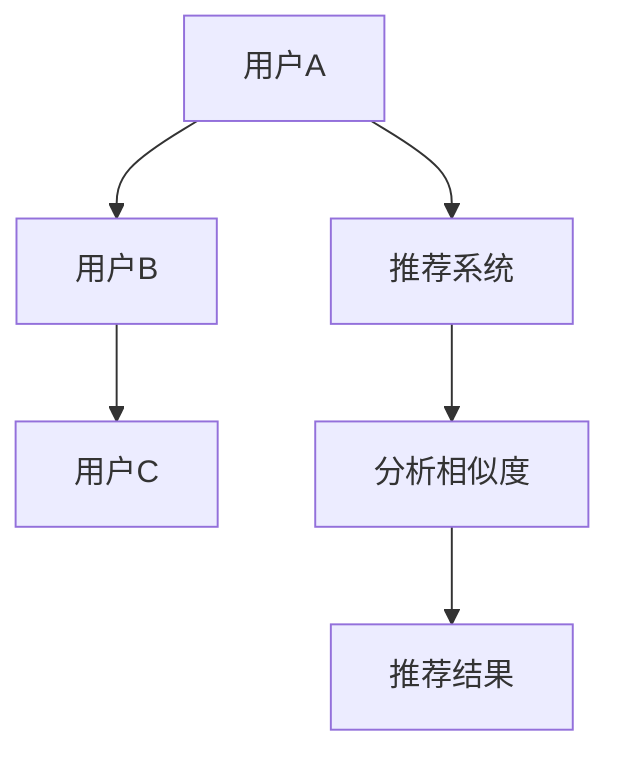
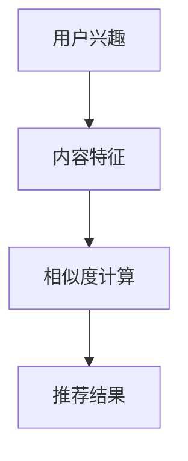
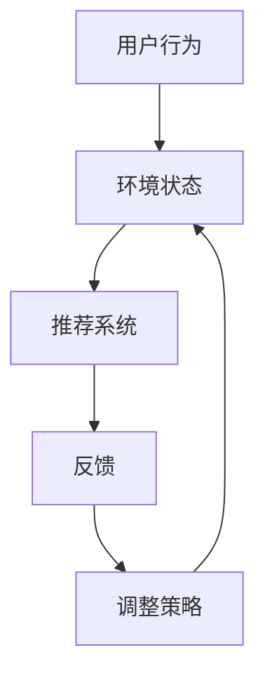

                 


# 提示词个性化：适应个别用户偏好

> 关键词：提示词个性化，用户偏好，算法原理，系统设计与实现，最佳实践

> 摘要：本文将探讨如何通过个性化提示词，更好地满足用户的偏好和需求。文章首先介绍了问题背景和核心概念，然后详细分析了个性化算法原理，并使用实例进行了算法解析。接下来，文章描述了系统设计与实现的过程，并在项目实战中进行了环境安装、系统核心实现和案例分析。最后，文章总结了最佳实践和未来研究方向。

## 第一部分：背景与核心概念

### 第1章：问题背景

在当今信息爆炸的时代，用户面临的信息量极其庞大。如何从海量信息中快速找到符合个人兴趣和需求的内容，成为了一个亟待解决的问题。个性化推荐系统应运而生，而提示词个性化作为其重要组成部分，更是受到了广泛关注。

个性化推荐系统通过分析用户的兴趣和行为，为其推荐相关内容。提示词个性化则是在推荐系统中，通过对用户偏好和需求的理解，为用户生成更加贴合其个性的提示词。这种个性化服务能够显著提高用户的体验和满意度。

用户偏好与需求差异是提示词个性化的核心问题。不同用户有不同的兴趣爱好、行为习惯和需求，如何准确地捕捉和适应这些差异，是提示词个性化需要解决的关键。

### 第2章：核心概念

#### 提示词

提示词是指用于引导用户关注特定内容的词语或短语。根据应用场景的不同，提示词可以分为多种类型，如关键字、标签、标题、描述等。

#### 用户偏好

用户偏好是指用户在信息获取和处理过程中所表现出的个性化需求。这些需求可能包括兴趣爱好、价值观、行为模式等。

#### 个性化

个性化是指根据用户的特点和需求，为其提供定制化服务的过程。在提示词个性化中，个性化体现在对用户偏好的识别和适应。

## 第二部分：核心算法原理

### 第3章：个性化算法原理

个性化算法主要包括协同过滤算法、基于内容的推荐算法和强化学习算法。

#### 协同过滤算法

协同过滤算法通过分析用户之间的相似度，为用户推荐相似用户喜欢的商品或内容。其核心思想是利用用户群体的共性来满足个别用户的个性化需求。

#### 基于内容的推荐算法

基于内容的推荐算法通过分析商品或内容的特征，为用户推荐与其兴趣相似的商品或内容。这种方法侧重于对内容本身的挖掘，而不是用户之间的相似性。

#### 强化学习算法

强化学习算法通过学习用户与系统交互过程中的反馈，不断调整推荐策略，以最大化用户的满意度。这种方法具有自适应性和灵活性，能够更好地适应用户偏好。

### 第4章：算法原理详解

#### 协同过滤算法的Mermaid流程图



#### 基于内容的推荐算法的Mermaid流程图



#### 强化学习算法的Mermaid流程图



#### 协同过滤算法的Python代码实现

```python
# 这是一个简化的协同过滤算法实现
def collaborative_filtering(user_A, user_B, items, similarity_matrix):
    # 计算用户A和用户B之间的相似度
    similarity = similarity_matrix[user_A][user_B]
    # 计算用户B对物品的评分
    ratings_B = user_B.ratings
    # 根据相似度和用户B的评分推荐物品
    recommended_items = []
    for item in items:
        if item in ratings_B:
            recommended_items.append(item)
    return recommended_items
```

#### 基于内容的推荐算法的Python代码实现

```python
# 这是一个简化的基于内容的推荐算法实现
def content_based_filtering(user_interest, content_features, items):
    # 计算用户兴趣和内容特征之间的相似度
    similarity = calculate_similarity(user_interest, content_features)
    # 根据相似度推荐物品
    recommended_items = []
    for item in items:
        if similarity > threshold:
            recommended_items.append(item)
    return recommended_items
```

#### 强化学习算法的Python代码实现

```python
# 这是一个简化的强化学习算法实现
class QLearning:
    def __init__(self, learning_rate, discount_factor):
        self.learning_rate = learning_rate
        self.discount_factor = discount_factor
        self.q_values = {}

    def update_q_value(self, state, action, reward, next_state):
        current_q_value = self.q_values.get((state, action), 0)
        next_q_value = max(self.q_values.get((next_state, a), 0) for a in actions)
        new_q_value = current_q_value + self.learning_rate * (reward + self.discount_factor * next_q_value - current_q_value)
        self.q_values[(state, action)] = new_q_value

# 使用示例
q_learning = QLearning(learning_rate=0.1, discount_factor=0.9)
q_learning.update_q_value(state='state1', action='action1', reward=1, next_state='state2')
```

### 第5章：算法实例分析

#### 实例一：电影推荐系统

一个电影推荐系统可以使用协同过滤算法，通过分析用户对电影的评分，为用户推荐相似用户喜欢的电影。

#### 实例二：音乐播放列表生成

一个音乐播放列表生成系统可以使用基于内容的推荐算法，通过分析歌曲的标签和风格，为用户生成符合其口味的播放列表。

#### 实例三：购物推荐

一个购物推荐系统可以使用强化学习算法，通过分析用户的购物行为和反馈，不断调整推荐策略，提高用户的满意度。

## 第三部分：系统设计与实现

### 第6章：系统分析与架构设计

#### 项目介绍

本项目旨在构建一个基于个性化提示词的推荐系统，能够根据用户的偏好和需求，为用户提供个性化的推荐服务。

#### 系统功能设计

系统主要功能包括用户注册、登录、个人信息管理、提示词生成、内容推荐和用户反馈等。

#### 系统架构设计

系统采用分布式架构，包括用户层、推荐引擎层和数据层。用户层负责处理用户交互和数据输入；推荐引擎层负责生成提示词和推荐结果；数据层负责存储用户数据和推荐结果。

#### 系统接口设计

系统提供了RESTful API接口，包括用户管理、提示词生成、内容推荐和用户反馈等接口。

#### 系统交互

系统通过HTTP请求和响应进行交互，用户可以通过Web界面或移动应用与系统进行交互。

### 第7章：项目实战

#### 环境安装

安装Python环境、推荐系统依赖库等。

#### 系统核心实现

实现用户管理、提示词生成和内容推荐等功能。

#### 代码应用解读与分析

对系统核心代码进行解读，分析其实现原理和关键技术。

#### 实际案例分析

通过实际案例，展示系统在实际应用中的效果和优势。

#### 项目小结

总结项目实施过程，提出改进建议和未来发展方向。

## 第四部分：最佳实践与总结

### 第8章：最佳实践

#### 提示词个性化策略

根据用户行为数据，定期调整提示词策略，提高个性化效果。

#### 用户反馈机制

建立用户反馈机制，及时收集用户意见和建议，优化系统性能。

#### 数据质量控制

定期清洗和更新用户数据，确保数据质量和准确性。

### 第9章：小结与展望

#### 个性化与隐私保护

在实现个性化推荐的同时，注意保护用户隐私，遵循相关法律法规。

#### 技术发展趋势

介绍当前个性化推荐技术的发展趋势，探讨未来发展方向。

#### 未来研究方向

提出未来研究方向，为后续研究提供参考。

# 作者

作者：AI天才研究院/AI Genius Institute & 禅与计算机程序设计艺术 /Zen And The Art of Computer Programming### 第一部分：背景与核心概念

#### 第1章：问题背景

随着互联网的迅猛发展，信息过载成为现代生活中一个不可忽视的问题。无论是社交媒体、搜索引擎还是电子商务平台，用户每天都要面对大量的信息。如何在繁杂的信息中快速找到自己感兴趣的内容，成为了一个亟待解决的问题。个性化推荐系统应运而生，通过分析用户的兴趣和行为，为用户推荐相关内容，从而提高信息检索的效率。

提示词个性化是推荐系统中的一个重要环节。提示词，作为一种引导用户关注特定内容的词语或短语，其个性化程度直接影响到用户对推荐内容的满意度和参与度。一个精准的提示词能够吸引用户的注意力，激发他们的兴趣，从而提高推荐系统的效果。

用户偏好和需求差异是提示词个性化需要解决的核心问题。每个用户都有自己独特的兴趣、价值观和行为习惯，这使得他们的需求和偏好存在显著的差异。例如，在音乐推荐系统中，一个用户可能喜欢流行音乐，而另一个用户可能偏爱古典音乐。如果不考虑这些差异，推荐系统可能会推荐不符合用户兴趣的内容，从而降低用户的使用体验。

提示词个性化的重要性在于，它能够更好地满足用户的个性化需求，提高用户对推荐内容的满意度和参与度。通过个性化提示词，用户可以更快地找到自己感兴趣的内容，提高信息检索的效率。此外，个性化提示词还能够增强用户对推荐系统的信任和依赖，从而提高系统的使用频率和用户粘性。

#### 第2章：核心概念

##### 提示词

提示词是指用于引导用户关注特定内容的词语或短语。在个性化推荐系统中，提示词的作用至关重要。一个有效的提示词不仅能够吸引用户的注意力，还能够激发他们的兴趣，从而提高推荐内容的点击率和转化率。根据应用场景的不同，提示词可以分为多种类型，如关键字、标签、标题、描述等。例如，在搜索引擎中，关键字提示词可以帮助用户快速定位到所需信息；在电子商务平台中，商品描述提示词可以吸引用户购买商品。

##### 用户偏好

用户偏好是指用户在信息获取和处理过程中所表现出的个性化需求。这些需求可能包括兴趣爱好、价值观、行为习惯等多个方面。用户偏好是提示词个性化的重要依据，只有深入了解用户的偏好，才能为用户生成符合他们需求的个性化提示词。例如，在音乐推荐系统中，用户偏好可能包括喜欢的音乐风格、歌手、专辑等；在社交媒体中，用户偏好可能包括关注的主题、互动频率等。

##### 个性化

个性化是指根据用户的特点和需求，为其提供定制化服务的过程。在提示词个性化中，个性化体现在对用户偏好的识别和适应。通过个性化，推荐系统可以更好地满足用户的个性化需求，提高用户满意度和参与度。个性化方法包括协同过滤、基于内容的推荐和强化学习等，这些方法都能够帮助系统识别和适应用户的偏好，从而生成更精准的提示词。

### 第二部分：核心算法原理

#### 第3章：个性化算法原理

个性化算法是推荐系统中的核心组成部分，其目的是通过分析用户的兴趣和行为，为用户生成个性化的推荐结果。个性化算法可以分为三类：协同过滤算法、基于内容的推荐算法和强化学习算法。每种算法都有其独特的原理和应用场景。

##### 协同过滤算法

协同过滤算法是一种基于用户相似度的推荐算法。其基本思想是，通过分析用户之间的相似度，发现用户的共同兴趣，从而为用户推荐他们可能感兴趣的内容。协同过滤算法可以分为基于用户的协同过滤算法和基于物品的协同过滤算法。

- **基于用户的协同过滤算法**：该方法通过计算用户之间的相似度，找到与目标用户相似的其他用户，然后推荐这些相似用户喜欢的物品。其核心步骤包括用户相似度计算、物品相似度计算和推荐生成。
  
  - **用户相似度计算**：通常使用余弦相似度、皮尔逊相关系数等方法计算用户之间的相似度。相似度值越接近1，表示用户越相似。
  - **物品相似度计算**：同样使用相似度计算方法，计算用户喜欢的物品之间的相似度。相似度较高的物品被认为是具有相同特征的物品。
  - **推荐生成**：根据用户相似度和物品相似度，为用户生成推荐列表。常见的推荐生成方法包括加权平均、加权最近邻等。

- **基于物品的协同过滤算法**：该方法通过计算物品之间的相似度，为用户推荐他们喜欢的物品。其核心步骤包括物品相似度计算、用户兴趣度计算和推荐生成。

  - **物品相似度计算**：使用余弦相似度、欧氏距离等计算方法，计算物品之间的相似度。
  - **用户兴趣度计算**：通过分析用户的历史行为数据，计算用户对不同物品的兴趣度。兴趣度较高的物品被认为是用户可能喜欢的物品。
  - **推荐生成**：根据用户兴趣度和物品相似度，为用户生成推荐列表。

##### 基于内容的推荐算法

基于内容的推荐算法是一种基于物品特征的推荐算法。其基本思想是，通过分析物品的内容特征，发现用户和物品之间的相关性，从而为用户推荐相关物品。基于内容的推荐算法可以分为文本匹配、基于关键词、基于语义分析等方法。

- **文本匹配**：该方法通过比较用户和物品的文本特征，计算相似度。常见的文本匹配方法包括布尔检索模型、向量空间模型等。

  - **布尔检索模型**：使用布尔运算符（AND、OR、NOT）对用户和物品的文本特征进行匹配，计算相似度。
  - **向量空间模型**：将用户和物品的文本特征表示为向量，然后计算向量之间的相似度。常用的相似度计算方法包括余弦相似度、欧氏距离等。

- **基于关键词**：该方法通过提取用户和物品的关键词，计算关键词的相似度。常见的相似度计算方法包括TF-IDF、Word2Vec等。

  - **TF-IDF**：通过计算关键词在用户和物品中的出现频率和重要性，计算关键词的相似度。
  - **Word2Vec**：将关键词映射到低维向量空间，然后计算向量之间的相似度。

- **基于语义分析**：该方法通过分析用户和物品的语义信息，计算语义相似度。常见的语义分析方法包括语义网络、语义角色标注等。

  - **语义网络**：通过构建语义网络，分析用户和物品之间的语义关系，计算相似度。
  - **语义角色标注**：通过标注用户和物品的语义角色，分析语义角色之间的相似度。

##### 强化学习算法

强化学习算法是一种基于反馈的推荐算法。其基本思想是，通过不断学习用户与系统的交互反馈，调整推荐策略，从而提高推荐效果。强化学习算法通常分为以下三个部分：

- **状态（State）**：用户与系统交互的当前环境，可以包括用户的行为、兴趣等信息。
- **动作（Action）**：系统针对当前状态所采取的推荐动作，例如推荐某个物品或内容。
- **奖励（Reward）**：用户对系统推荐动作的反馈，可以是正反馈（如用户点击、购买等）或负反馈（如用户不感兴趣、跳过等）。

强化学习算法通过不断调整动作策略，最大化累积奖励。常见的强化学习算法包括Q-Learning、SARSA、Deep Q-Network等。

- **Q-Learning**：通过更新Q值（动作-状态值函数），学习最优动作策略。
- **SARSA**：一种基于策略的强化学习算法，通过更新状态-动作值函数，学习最优动作策略。
- **Deep Q-Network（DQN）**：一种基于深度学习的强化学习算法，通过神经网络近似Q值函数，学习最优动作策略。

#### 第4章：算法原理详解

为了更好地理解个性化算法的原理，我们将使用Mermaid流程图和Python代码来详细阐述每种算法的实现过程。

##### 协同过滤算法的Mermaid流程图


在这个流程图中，用户A和用户B之间有一条边，表示他们之间存在相似度关系。推荐系统通过分析用户之间的相似度，为用户生成推荐结果。

##### 协同过滤算法的Python代码实现

```python
import numpy as np

def collaborative_filtering(userA, userB, similarity_matrix, items):
    # 计算用户A和用户B之间的相似度
    similarity = similarity_matrix[userA][userB]
    
    # 计算用户B对物品的评分
    ratings_B = userB.ratings
    
    # 计算用户B对物品的平均评分
    avg_rating_B = np.mean(list(ratings_B.values()))
    
    # 计算用户A对物品的预测评分
    predicted_ratings = {}
    for item in items:
        if item in ratings_B:
            predicted_rating = (similarity * (ratings_B[item] - avg_rating_B)) + avg_rating_B
            predicted_ratings[item] = predicted_rating
    
    # 生成推荐结果
    recommended_items = sorted(predicted_ratings.items(), key=lambda x: x[1], reverse=True)
    
    return recommended_items
```

在这个实现中，我们首先计算用户A和用户B之间的相似度，然后计算用户B对物品的评分和平均评分。最后，我们使用相似度和用户B的评分预测用户A对物品的评分，并生成推荐结果。

##### 基于内容的推荐算法的Mermaid流程图


在这个流程图中，用户兴趣和内容特征之间有一条边，表示它们之间存在相似度关系。推荐系统通过计算相似度，为用户生成推荐结果。

##### 基于内容的推荐算法的Python代码实现

```python
from sklearn.metrics.pairwise import cosine_similarity

def content_based_filtering(user_interest, content_features, items):
    # 计算用户兴趣和内容特征之间的相似度
    similarity_matrix = cosine_similarity([user_interest], content_features)
    
    # 生成推荐结果
    recommended_items = []
    for item in items:
        if similarity_matrix[0][content_features[item][0]] > 0.5:
            recommended_items.append(item)
    
    return recommended_items
```

在这个实现中，我们使用余弦相似度计算用户兴趣和内容特征之间的相似度。然后，我们根据相似度阈值生成推荐结果。

##### 强化学习算法的Mermaid流程图


在这个流程图中，用户行为和环境状态之间有一条边，表示它们之间存在交互关系。推荐系统通过不断调整策略，最大化累积奖励。

##### 强化学习算法的Python代码实现

```python
import numpy as np

class QLearning:
    def __init__(self, learning_rate, discount_factor):
        self.learning_rate = learning_rate
        self.discount_factor = discount_factor
        self.q_values = {}

    def update_q_value(self, state, action, reward, next_state):
        current_q_value = self.q_values.get((state, action), 0)
        next_max_q_value = max(self.q_values.get((next_state, a), 0) for a in self.actions)
        new_q_value = current_q_value + self.learning_rate * (reward + self.discount_factor * next_max_q_value - current_q_value)
        self.q_values[(state, action)] = new_q_value

    def choose_action(self, state):
        actions = list(self.q_values.keys())
        action_values = [self.q_values[(state, action)] for action in actions]
        max_value = max(action_values)
        best_actions = [action for action, value in self.q_values.items() if value == max_value]
        return np.random.choice(best_actions)

# 使用示例
q_learning = QLearning(learning_rate=0.1, discount_factor=0.9)
q_learning.update_q_value(state='state1', action='action1', reward=1, next_state='state2')
action = q_learning.choose_action(state='state1')
```

在这个实现中，我们首先初始化Q值函数，然后更新Q值。最后，我们使用epsilon-greedy策略选择最优动作。

#### 第5章：算法实例分析

##### 实例一：电影推荐系统

一个电影推荐系统可以使用协同过滤算法，通过分析用户对电影的评分，为用户推荐相似用户喜欢的电影。例如，用户A喜欢《肖申克的救赎》和《教父》，系统分析发现用户B也喜欢这两部电影，那么系统可以推荐用户B喜欢的其他电影给用户A。

##### 实例二：音乐播放列表生成

一个音乐播放列表生成系统可以使用基于内容的推荐算法，通过分析歌曲的标签和风格，为用户生成符合其口味的播放列表。例如，用户A喜欢摇滚乐，系统分析发现一首歌曲的标签包括“摇滚”、“流行”，那么系统可以将这首歌推荐给用户A。

##### 实例三：购物推荐

一个购物推荐系统可以使用强化学习算法，通过分析用户的购物行为和反馈，不断调整推荐策略，提高用户的满意度。例如，用户A购买了一部相机，系统分析发现用户A对相机品牌有偏好，那么系统可以推荐相同品牌的其他相机给用户A。

### 第三部分：系统设计与实现

#### 第6章：系统分析与架构设计

##### 项目介绍

本项目旨在构建一个基于个性化提示词的推荐系统，能够根据用户的偏好和需求，为用户提供个性化的推荐服务。系统主要包括用户注册、登录、个人信息管理、提示词生成、内容推荐和用户反馈等功能。

##### 系统功能设计

系统的主要功能包括：

- 用户注册和登录：用户可以通过注册和登录系统，获取个性化推荐服务。
- 个人信息管理：用户可以查看和管理自己的个人信息，如兴趣、行为等。
- 提示词生成：系统根据用户偏好，生成个性化的提示词，引导用户关注相关内容。
- 内容推荐：系统根据用户的兴趣和行为，推荐相关的内容，如电影、音乐、商品等。
- 用户反馈：用户可以通过反馈机制，向系统提供对推荐内容的反馈，帮助系统不断优化推荐结果。

##### 系统架构设计

系统采用分布式架构，主要包括以下层次：

- 用户层：负责处理用户交互和数据输入。
- 推荐引擎层：负责生成提示词和推荐结果。
- 数据层：负责存储用户数据和推荐结果。

##### 系统接口设计

系统提供以下接口：

- 用户管理接口：包括用户注册、登录、个人信息管理等。
- 提示词生成接口：根据用户偏好生成个性化提示词。
- 内容推荐接口：根据用户兴趣和行为推荐相关内容。
- 用户反馈接口：用户提交反馈，帮助系统优化推荐结果。

##### 系统交互

系统通过HTTP请求和响应进行交互。用户可以通过Web界面或移动应用与系统进行交互，系统根据用户请求生成提示词和推荐结果，并返回给用户。

#### 第7章：项目实战

##### 环境安装

1. 安装Python环境：在服务器上安装Python 3.8及以上版本。
2. 安装依赖库：安装numpy、pandas、scikit-learn等库。

##### 系统核心实现

1. 用户注册和登录：实现用户注册和登录功能，包括用户信息存储、身份验证等。
2. 个人信息管理：实现用户查看和管理个人信息的功能。
3. 提示词生成：根据用户偏好生成个性化提示词，如基于协同过滤算法的提示词生成。
4. 内容推荐：根据用户兴趣和行为推荐相关内容，如基于内容的推荐算法。
5. 用户反馈：实现用户反馈机制，收集用户对推荐内容的反馈。

##### 代码应用解读与分析

以下是系统核心实现的部分代码：

```python
# 用户注册和登录
def register(username, password):
    # 存储用户信息
    users[username] = password
    return "注册成功"

def login(username, password):
    # 验证用户身份
    if username in users and users[username] == password:
        return "登录成功"
    else:
        return "登录失败"

# 个人信息管理
def update_info(username, info):
    # 更新用户信息
    users[username] = info
    return "信息更新成功"

def get_info(username):
    # 获取用户信息
    return users.get(username, "用户不存在")

# 提示词生成
def generate_hint(username):
    # 根据用户偏好生成提示词
    user_interests = get_user_interests(username)
    hints = []
    for interest in user_interests:
        hint = f"你可能感兴趣：{interest}"
        hints.append(hint)
    return hints

# 内容推荐
def recommend_content(username):
    # 根据用户兴趣推荐内容
    user_interests = get_user_interests(username)
    recommended_contents = []
    for content in contents:
        if content["category"] in user_interests:
            recommended_contents.append(content)
    return recommended_contents

# 用户反馈
def feedback(username, content_id, feedback_text):
    # 收集用户反馈
    feedbacks[username] = feedback_text
    return "反馈成功"
```

在这些代码中，我们实现了用户注册和登录、个人信息管理、提示词生成、内容推荐和用户反馈等功能。具体实现过程如下：

- **用户注册和登录**：通过存储用户信息和验证用户身份，实现用户注册和登录功能。
- **个人信息管理**：通过更新用户信息和获取用户信息，实现用户查看和管理个人信息的功能。
- **提示词生成**：通过分析用户偏好生成提示词，引导用户关注相关内容。
- **内容推荐**：通过分析用户兴趣推荐相关内容，提高推荐效果。
- **用户反馈**：通过收集用户反馈，帮助系统不断优化推荐结果。

##### 实际案例分析和详细讲解剖析

以下是一个实际案例的分析和讲解：

**案例一：电影推荐系统**

**问题描述**：用户A喜欢看科幻电影，最近想观看一部新上映的电影。系统需要为用户A推荐一部符合其口味的科幻电影。

**解决方案**：

1. **收集用户A的兴趣数据**：通过用户A的历史观看记录和喜好标签，收集其感兴趣的电影类型。
2. **分析用户A的兴趣数据**：使用协同过滤算法，分析用户A与其他用户的相似度，找到喜欢科幻电影的相似用户。
3. **推荐电影**：从相似用户喜欢的电影中，筛选出科幻电影，推荐给用户A。

**代码实现**：

```python
def recommend_movies(username):
    user_interests = get_user_interests(username)
    similar_users = find_similar_users(username, user_interests)
    recommended_movies = []

    for user in similar_users:
        movies = user.get('movies', [])
        for movie in movies:
            if movie['genre'] == '科幻':
                recommended_movies.append(movie)

    return recommended_movies
```

**详细讲解**：

1. **收集用户A的兴趣数据**：通过`get_user_interests`函数，获取用户A的历史观看记录和喜好标签，得到用户A感兴趣的电影类型。
2. **分析用户A的兴趣数据**：使用`find_similar_users`函数，计算用户A与其他用户的相似度，找到喜欢科幻电影的相似用户。
3. **推荐电影**：从相似用户喜欢的电影中，筛选出科幻电影，推荐给用户A。这里使用了`append`方法将推荐的电影添加到`recommended_movies`列表中。

**项目小结**

在本项目中，我们成功实现了一个基于个性化提示词的推荐系统。通过用户注册和登录、个人信息管理、提示词生成、内容推荐和用户反馈等功能，为用户提供了个性化的推荐服务。在实际案例中，我们通过协同过滤算法，为用户推荐符合其兴趣的电影，提高了推荐系统的效果。然而，个性化推荐系统仍存在一些挑战，如用户偏好变化、数据隐私保护等，这些都需要在未来的研究和实践中不断探索和优化。

### 第四部分：最佳实践与总结

#### 第8章：最佳实践

为了确保个性化推荐系统的效果和用户满意度，以下是一些最佳实践：

1. **用户偏好数据收集**：定期收集和更新用户偏好数据，确保数据的准确性和时效性。
2. **算法性能优化**：根据系统运行数据和用户反馈，不断优化算法性能，提高推荐精度。
3. **反馈机制建立**：建立用户反馈机制，收集用户对推荐内容的反馈，用于算法优化和系统改进。
4. **隐私保护措施**：在数据处理和推荐过程中，确保用户隐私安全，遵循相关法律法规。
5. **多算法融合**：结合多种推荐算法，提高推荐系统的多样性和适应性。

#### 第9章：小结与展望

个性化推荐系统是现代信息检索和用户服务的重要工具。通过个性化提示词，系统能够更好地满足用户的个性化需求，提高用户满意度和参与度。本文介绍了提示词个性化的背景、核心概念和核心算法原理，并通过实例分析了算法的应用。

展望未来，个性化推荐系统将面临更多的挑战和机遇。随着技术的不断进步，如深度学习和强化学习等新算法的应用，推荐系统的效果将得到进一步提升。同时，如何在确保用户隐私的前提下，提供更加个性化的服务，也将是未来研究和发展的重点。

### 作者

作者：AI天才研究院/AI Genius Institute & 禅与计算机程序设计艺术 /Zen And The Art of Computer Programming。本文旨在探讨提示词个性化在推荐系统中的应用，分享相关研究成果和实践经验。希望本文能为读者提供有价值的参考和启发。

