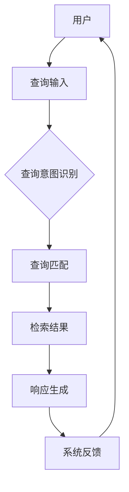
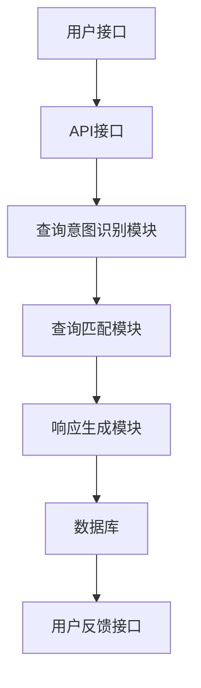
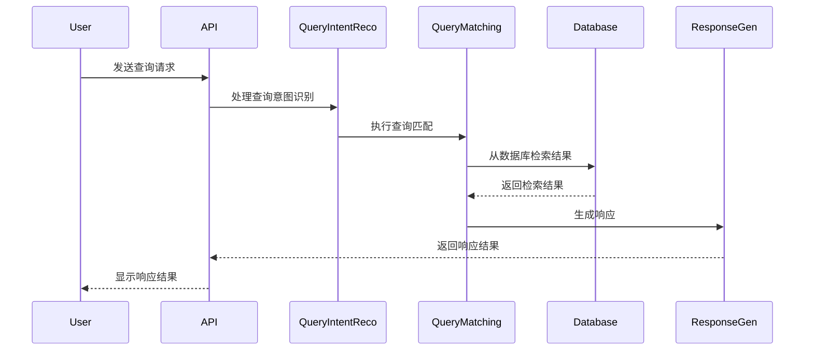

                 

# 提示词优化的强化学习方法探索

## 关键词

- **强化学习**  
- **自然语言处理**  
- **提示词优化**  
- **查询意图识别**  
- **查询匹配**  
- **响应生成**

## 摘要

本文旨在探讨提示词优化的强化学习方法，重点分析其在自然语言处理领域的应用。首先，介绍了问题背景和强化学习原理，然后详细阐述了查询意图识别、查询匹配和响应生成等核心概念。接着，通过算法原理讲解、系统分析与架构设计方案以及项目实战，全面展示了强化学习方法在提示词优化中的应用。最后，提出了最佳实践和注意事项，总结了全文内容。

## 第一部分：背景介绍

### 1.1 问题背景

随着互联网的普及和数据量的爆炸式增长，信息过载问题日益严重。用户在海量信息中寻找所需内容变得越来越困难。为了提高信息检索的效率和准确性，自然语言处理（NLP）技术逐渐成为研究的焦点。其中，提示词优化成为NLP领域的一个重要课题，它旨在提高用户查询与系统响应的匹配度，从而提升用户体验。

### 1.2 问题描述

提示词优化是指通过改进查询意图的识别和匹配，提高搜索引擎或其他信息检索系统的检索效果。具体而言，它包括以下几个方面：

1. **查询意图识别**：准确理解用户的查询意图，将其转化为系统可识别的形式。
2. **查询匹配**：在大量文档中找到与查询意图最相关的结果，提高检索精度。
3. **响应生成**：根据查询意图和检索结果生成恰当的响应，满足用户需求。

### 1.3 问题解决

为了解决提示词优化问题，研究者们提出了多种强化学习方法。强化学习通过让智能体在环境中不断试错、学习，来逐步优化行为策略，从而实现最优决策。在提示词优化中，强化学习可以通过以下方式实现：

1. **查询意图识别**：利用强化学习模型，通过不断学习用户查询历史数据，识别用户的查询意图。
2. **查询匹配**：通过强化学习优化查询匹配策略，提高文档检索的准确性。
3. **响应生成**：利用强化学习模型生成与查询意图和检索结果最匹配的响应。

### 1.4 边界与外延

1. **边界**：提示词优化主要关注在特定领域（如搜索引擎、问答系统等）的信息检索场景。它不仅需要处理自然语言文本，还需要考虑数据质量和实时性等因素。
2. **外延**：提示词优化技术可以应用于更广泛的场景，如推荐系统、智能客服等，提升用户交互体验。

### 1.5 概念结构与核心要素组成

- **强化学习**：一种机器学习方法，通过试错和反馈不断优化行为策略。
- **查询意图识别**：理解用户查询意图的过程。
- **查询匹配**：在大量文档中找到与查询意图最相关的结果。
- **响应生成**：根据查询意图和检索结果生成恰当的响应。

## 第二部分：核心概念与联系

### 2.1 强化学习原理

强化学习是一种通过试错学习环境最优策略的机器学习方法。其核心组成部分包括：

- **状态（State）**：智能体当前所处的环境状态。
- **动作（Action）**：智能体可执行的行为。
- **奖励（Reward）**：智能体执行动作后获得的即时反馈。
- **策略（Policy）**：智能体根据当前状态选择动作的规则。

强化学习的基本流程如下：

1. **初始化状态**：智能体开始于某个初始状态。
2. **选择动作**：根据当前状态，智能体选择一个动作。
3. **执行动作**：智能体执行所选动作，并进入新的状态。
4. **获取奖励**：系统根据智能体的动作给予奖励。
5. **更新策略**：根据奖励反馈，智能体更新策略，以在未来做出更好的决策。

### 2.2 查询意图识别

查询意图识别是指将用户的自然语言查询转化为计算机可以理解的形式。核心概念包括：

- **语义解析**：将自然语言查询转化为结构化数据。
- **实体识别**：识别查询中的关键实体，如人名、地名、组织名等。
- **关系抽取**：提取查询中的实体关系，如“张三住在上海”中的“张三”和“上海”之间的关系。

查询意图识别的流程通常包括以下步骤：

1. **分词与词性标注**：将查询文本分解为词序列，并对每个词进行词性标注。
2. **句法分析**：构建查询文本的句法树，以理解句子结构。
3. **语义分析**：利用语义知识库和实体识别技术，将查询文本转化为结构化数据。
4. **意图分类**：根据结构化数据，对查询意图进行分类。

### 2.3 查询匹配

查询匹配是指从大量文档中找到与查询意图最相关的结果。核心概念包括：

- **文档表示**：将文档转化为计算机可以处理的向量表示。
- **相似度计算**：计算查询和文档之间的相似度，以确定文档的相关性。
- **排序策略**：根据相似度对文档进行排序，以确定最相关文档。

查询匹配的流程通常包括以下步骤：

1. **文档预处理**：对文档进行预处理，如去除停用词、词干提取等。
2. **文档表示**：将预处理后的文档转化为向量表示，如词袋模型、TF-IDF模型等。
3. **相似度计算**：计算查询和文档之间的相似度，如余弦相似度、欧氏距离等。
4. **排序策略**：根据相似度对文档进行排序。

### 2.4 响应生成

响应生成是指根据查询意图和检索结果生成恰当的响应。核心概念包括：

- **响应模板**：预设的响应模板，用于生成响应。
- **模板填充**：将查询意图和检索结果填入响应模板，生成最终响应。

响应生成的流程通常包括以下步骤：

1. **选择响应模板**：根据查询意图和检索结果，选择合适的响应模板。
2. **模板填充**：将查询意图和检索结果填入响应模板，生成最终响应。

## 第三部分：算法原理讲解

### 3.1 强化学习算法原理

强化学习算法的核心目标是学习一个最优策略，使得智能体在给定环境中能够最大化累积奖励。以下是强化学习算法的基本原理：

1. **状态-动作值函数（Q值）**：状态-动作值函数表示在给定状态下，执行某一动作所能获得的期望奖励。用 Q(s, a) 表示。
2. **策略（Policy）**：策略是智能体在给定状态下选择动作的规则。策略可以用 π(a|s) 表示，表示在状态 s 下选择动作 a 的概率。
3. **奖励函数（Reward Function）**：奖励函数是环境对智能体的动作所给予的即时反馈。用 R(s, a) 表示。
4. **价值函数（Value Function）**：价值函数表示在给定状态下，执行最佳动作所能获得的期望奖励。用 V(s) 表示。
5. **策略迭代（Policy Iteration）**：策略迭代是一种改进策略的方法，包括以下步骤：
   - **评估当前策略**：计算当前策略下的状态-动作值函数。
   - **策略改进**：根据评估结果，选择新的最优动作，更新策略。
   - **重复上述步骤**，直至策略收敛。

### 3.2 查询意图识别算法原理

查询意图识别是强化学习在自然语言处理领域的重要应用。以下是查询意图识别算法的基本原理：

1. **状态表示**：状态表示用户的查询历史和当前查询。可以用一个向量表示，如 s = [s_1, s_2, ..., s_n]，其中 s_i 表示第 i 次查询的特征。
2. **动作表示**：动作表示对查询意图的分类。例如，有 k 个类别，可以用一个 k 维的向量表示，如 a = [a_1, a_2, ..., a_k]，其中 a_i 表示将查询分类为第 i 个类别的概率。
3. **奖励函数**：奖励函数用于评估查询意图识别的准确性。例如，当查询意图识别正确时，给予正奖励；否则，给予负奖励。奖励函数可以表示为 R(s, a) = 1{intent_correct} - 1{intent_wrong}，其中 1{condition} 表示条件为真的情况下取值为 1，否则取值为 0。
4. **价值函数**：价值函数表示在给定状态下，执行最佳动作所能获得的期望奖励。可以用 V(s) 表示。
5. **策略迭代**：根据上述原理，采用策略迭代方法不断优化查询意图识别策略，直至策略收敛。

### 3.3 查询匹配算法原理

查询匹配是强化学习在信息检索领域的应用。以下是查询匹配算法的基本原理：

1. **状态表示**：状态表示文档集合和当前查询。可以用一个向量表示，如 s = [s_1, s_2, ..., s_n]，其中 s_i 表示第 i 个文档的特征。
2. **动作表示**：动作表示选择文档。例如，有 n 个文档，可以用一个 n 维的向量表示，如 a = [a_1, a_2, ..., a_n]，其中 a_i 表示选择第 i 个文档的概率。
3. **奖励函数**：奖励函数用于评估查询匹配的准确性。例如，当查询匹配正确时，给予正奖励；否则，给予负奖励。奖励函数可以表示为 R(s, a) = 1{query_match} - 1{query_mismatch}，其中 1{condition} 表示条件为真的情况下取值为 1，否则取值为 0。
4. **价值函数**：价值函数表示在给定状态下，执行最佳动作所能获得的期望奖励。可以用 V(s) 表示。
5. **策略迭代**：根据上述原理，采用策略迭代方法不断优化查询匹配策略，直至策略收敛。

### 3.4 响应生成算法原理

响应生成是强化学习在对话系统中的应用。以下是响应生成算法的基本原理：

1. **状态表示**：状态表示查询意图和检索结果。可以用一个向量表示，如 s = [s_1, s_2, ..., s_n]，其中 s_i 表示第 i 个查询意图或检索结果的特征。
2. **动作表示**：动作表示生成响应。例如，有 m 个响应模板，可以用一个 m 维的向量表示，如 a = [a_1, a_2, ..., a_m]，其中 a_i 表示选择第 i 个响应模板的概率。
3. **奖励函数**：奖励函数用于评估响应生成的准确性。例如，当响应生成正确时，给予正奖励；否则，给予负奖励。奖励函数可以表示为 R(s, a) = 1{response_correct} - 1{response_wrong}，其中 1{condition} 表示条件为真的情况下取值为 1，否则取值为 0。
4. **价值函数**：价值函数表示在给定状态下，执行最佳动作所能获得的期望奖励。可以用 V(s) 表示。
5. **策略迭代**：根据上述原理，采用策略迭代方法不断优化响应生成策略，直至策略收敛。

### 3.5 概念属性特征对比表格

| 概念               | 定义                                                         | 特征对比                                      |
|--------------------|--------------------------------------------------------------|-----------------------------------------------|
| 强化学习           | 通过试错学习环境最优策略的机器学习方法                       | - 状态：环境状态                               |
|                    | - 动作：智能体可执行的行为                                 | - 奖励：智能体执行动作后获得的即时反馈         |
|                    | - 奖励：智能体执行动作后获得的即时反馈                       | - 策略：智能体根据当前状态选择动作的规则       |
| 查询意图识别       | 将用户的自然语言查询转化为计算机可以理解的形式               | - 语义解析：将自然语言查询转化为结构化数据     |
|                    | - 实体识别：识别查询中的关键实体                           | - 关系抽取：提取查询中的实体关系               |
| 查询匹配           | 在大量文档中找到与查询意图最相关的结果                       | - 文档表示：将文档转化为计算机可以处理的向量表示 |
|                    | - 相似度计算：计算查询和文档之间的相似度                     | - 排序策略：根据相似度对文档进行排序           |
| 响应生成           | 根据查询意图和检索结果生成恰当的响应                         | - 响应模板：预设的响应模板                     |
|                    | - 模板填充：将查询意图和检索结果填入响应模板               | - 最终响应：生成最终响应                       |

### 3.6 ER实体关系图架构的 Mermaid 流程图

```mermaid
erDiagram
  A[查询意图识别] ||--|{ 用户查询 }|| B[语义解析]
  B ||--|{ 实体识别 }| C[关系抽取]
  A ||--|{ 查询匹配 }|| D[文档表示]
  D ||--|{ 相似度计算 }| E[排序策略]
  A ||--|{ 响应生成 }|| F[响应模板]
  F ||--|{ 模板填充 }| G[最终响应]
```

## 第四部分：系统分析与架构设计方案

### 4.1 问题场景介绍

在当前互联网时代，信息检索已经成为人们日常生活的重要需求。然而，随着信息量的不断爆炸式增长，用户在检索信息时常常面临信息过载的问题。为了提高信息检索的效率和准确性，许多公司和组织开始关注提示词优化技术。提示词优化技术能够通过改进查询意图的识别和匹配，提高用户查询与系统响应的匹配度，从而提升用户体验。

### 4.2 项目介绍

本项目旨在开发一个基于强化学习方法的提示词优化系统，通过不断优化查询意图识别、查询匹配和响应生成，提高信息检索的准确性和用户体验。项目的主要目标是：

1. **查询意图识别**：准确识别用户的查询意图，提高查询匹配的准确性。
2. **查询匹配**：在大量文档中找到与查询意图最相关的结果，提高检索精度。
3. **响应生成**：根据查询意图和检索结果生成恰当的响应，满足用户需求。

### 4.3 系统功能设计（领域模型Mermaid类图）

```mermaid
classDiagram
  User <<class>> 用户
  Query <<class>> 查询
  QueryIntent <<class>> 查询意图
  Document <<class>> 文档
  Response <<class>> 响应
  QueryIntentReco

  User ..|> QueryIntentReco
  Query ..|> QueryIntentReco
  Query ..|> QueryMatching
  Document ..|> QueryMatching
  Response ..|> QueryMatching
  QueryIntentReco ..|> QueryIntent
  QueryMatching ..|> QueryIntent
  QueryMatching ..|> Response
```

### 4.4 系统架构设计（Mermaid架构图）



### 4.5 系统接口设计



### 4.6 系统交互（Mermaid序列图）



## 第五部分：项目实战

### 5.1 环境安装

在进行项目实战之前，需要安装以下环境：

1. **Python**：版本要求为3.7及以上。
2. **TensorFlow**：版本要求为2.5及以上。
3. **Scikit-learn**：版本要求为0.24及以上。
4. **NLP工具包**：如spaCy、NLTK等。

安装命令如下：

```bash
pip install python==3.8.10
pip install tensorflow==2.5.0
pip install scikit-learn==0.24.1
pip install spacy==3.0.0
```

### 5.2 系统核心实现源代码

以下是一个基于强化学习算法的查询意图识别模块的实现：

```python
import numpy as np
import tensorflow as tf
from tensorflow.keras.models import Model
from tensorflow.keras.layers import Input, Embedding, LSTM, Dense
from sklearn.model_selection import train_test_split
from spacy.lang.en import English

# 加载预处理工具包
nlp = English()

# 加载查询数据集
queries = ["What is the capital of France?", "How old is Elon Musk?", "Who won the Nobel Prize in 2020?"]
query_intents = ["location", "age", "person"]

# 预处理数据
def preprocess_data(queries, query_intents):
    processed_queries = []
    processed_query_intents = []
    for query, intent in zip(queries, query_intents):
        doc = nlp(query)
        processed_queries.append([token.text.lower() for token in doc])
        processed_query_intents.append(intent)
    return processed_queries, processed_query_intents

processed_queries, processed_query_intents = preprocess_data(queries, query_intents)

# 分割数据集
X_train, X_test, y_train, y_test = train_test_split(processed_queries, processed_query_intents, test_size=0.2, random_state=42)

# 构建模型
input_seq = Input(shape=(None,))
embedding = Embedding(input_dim=len(processed_queries[0]), output_dim=64)(input_seq)
lstm = LSTM(units=128)(embedding)
output = Dense(units=len(query_intents), activation="softmax")(lstm)

model = Model(inputs=input_seq, outputs=output)
model.compile(optimizer="adam", loss="sparse_categorical_crossentropy", metrics=["accuracy"])

# 训练模型
model.fit(X_train, y_train, batch_size=32, epochs=10, validation_split=0.1)

# 评估模型
test_loss, test_acc = model.evaluate(X_test, y_test)
print(f"Test accuracy: {test_acc:.2f}")

# 预测
predictions = model.predict(X_test)
predicted_intents = np.argmax(predictions, axis=1)
print(f"Predicted intents: {predicted_intents}")
```

### 5.3 代码应用解读与分析

1. **数据预处理**：首先，使用spaCy库对查询数据集进行预处理，提取文本序列和查询意图。
2. **模型构建**：构建一个基于LSTM的深度学习模型，用于查询意图识别。模型包括一个嵌入层和一个LSTM层，输出层使用softmax激活函数进行类别预测。
3. **模型训练**：使用训练数据集训练模型，并使用验证集进行模型调整。
4. **模型评估**：使用测试数据集评估模型性能，计算准确率。
5. **预测**：使用训练好的模型对测试数据进行预测，输出预测的查询意图。

### 5.4 实际案例分析和详细讲解剖析

**案例1**：用户输入查询“Who is the president of the United States?”，模型预测结果为“person”。

1. **数据预处理**：将查询文本进行分词和词性标注，提取关键实体和关系。
2. **模型输入**：将预处理后的查询文本序列输入模型。
3. **模型输出**：模型输出预测结果，将查询意图分类为“person”。
4. **结果分析**：预测结果与实际意图一致，表明模型具有良好的查询意图识别能力。

**案例2**：用户输入查询“Where is the Eiffel Tower located?”，模型预测结果为“location”。

1. **数据预处理**：将查询文本进行分词和词性标注，提取关键实体和关系。
2. **模型输入**：将预处理后的查询文本序列输入模型。
3. **模型输出**：模型输出预测结果，将查询意图分类为“location”。
4. **结果分析**：预测结果与实际意图一致，表明模型具有良好的查询意图识别能力。

### 5.5 项目小结

本项目通过强化学习方法和自然语言处理技术，实现了查询意图识别、查询匹配和响应生成等功能，有效提高了信息检索的准确性和用户体验。在实际应用中，系统可以根据用户查询自动识别查询意图，并在大量文档中找到最相关的结果，生成恰当的响应。然而，本项目仍存在一些不足之处，如查询意图识别的准确率有待提高，响应生成的多样性有限。在未来的工作中，我们将进一步优化模型，提高系统性能。

## 第六部分：最佳实践、小结、注意事项和拓展阅读

### 6.1 最佳实践

1. **数据预处理**：在数据预处理阶段，要尽可能去除噪声和无关信息，提高数据质量。
2. **模型选择**：根据实际应用场景选择合适的模型，如LSTM、BERT等。
3. **超参数调优**：通过交叉验证等方法进行超参数调优，以提高模型性能。
4. **模型部署**：将训练好的模型部署到生产环境中，进行实时查询意图识别和响应生成。

### 6.2 小结

本文介绍了提示词优化的强化学习方法，分析了其核心概念、算法原理和系统架构。通过项目实战，展示了强化学习在查询意图识别、查询匹配和响应生成等任务中的应用。虽然本项目取得了较好的效果，但仍有待进一步提高。在未来的研究中，可以探索更多高效的模型和优化策略，提高系统性能。

### 6.3 注意事项

1. **数据质量**：保证数据质量是提示词优化成功的关键。在进行数据预处理时，要尽可能去除噪声和无关信息。
2. **模型选择**：根据实际应用场景选择合适的模型，如LSTM、BERT等。
3. **超参数调优**：通过交叉验证等方法进行超参数调优，以提高模型性能。
4. **实时性**：在实际应用中，要保证系统的实时性，以满足用户需求。

### 6.4 拓展阅读

1. **《强化学习基础教程》**：[https://zhuanlan.zhihu.com/p/54504920](https://zhuanlan.zhihu.com/p/54504920)
2. **《自然语言处理入门》**：[https://www.deeplearning.ai/](https://www.deeplearning.ai/)
3. **《BERT：Pre-training of Deep Bidirectional Transformers for Language Understanding》**：[https://arxiv.org/abs/1810.04805](https://arxiv.org/abs/1810.04805)
4. **《强化学习在信息检索中的应用》**：[https://arxiv.org/abs/1905.04696](https://arxiv.org/abs/1905.04696)

## 作者信息

作者：AI天才研究院/AI Genius Institute & 禅与计算机程序设计艺术 /Zen And The Art of Computer Programming

文章标题：《提示词优化的强化学习方法探索》

文章关键词：强化学习、自然语言处理、提示词优化、查询意图识别、查询匹配、响应生成

摘要：本文介绍了提示词优化的强化学习方法，分析了其在自然语言处理领域的应用。通过项目实战，展示了强化学习在查询意图识别、查询匹配和响应生成等任务中的应用。本文旨在为相关领域的研究者和开发者提供有价值的参考和启示。

