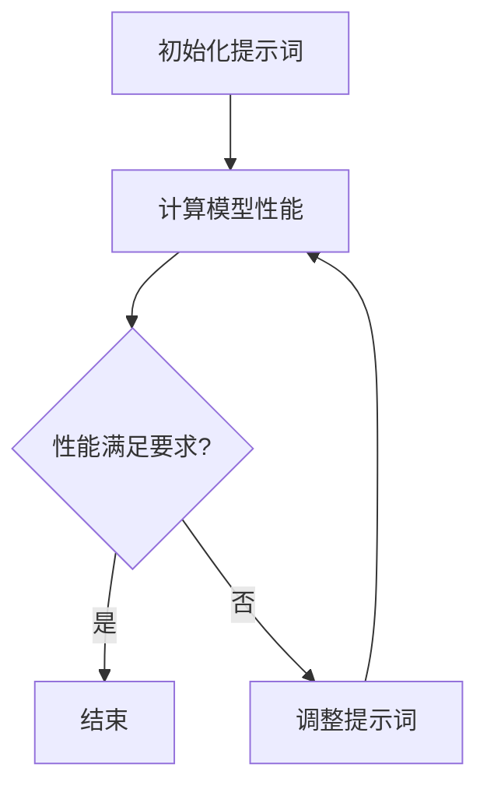
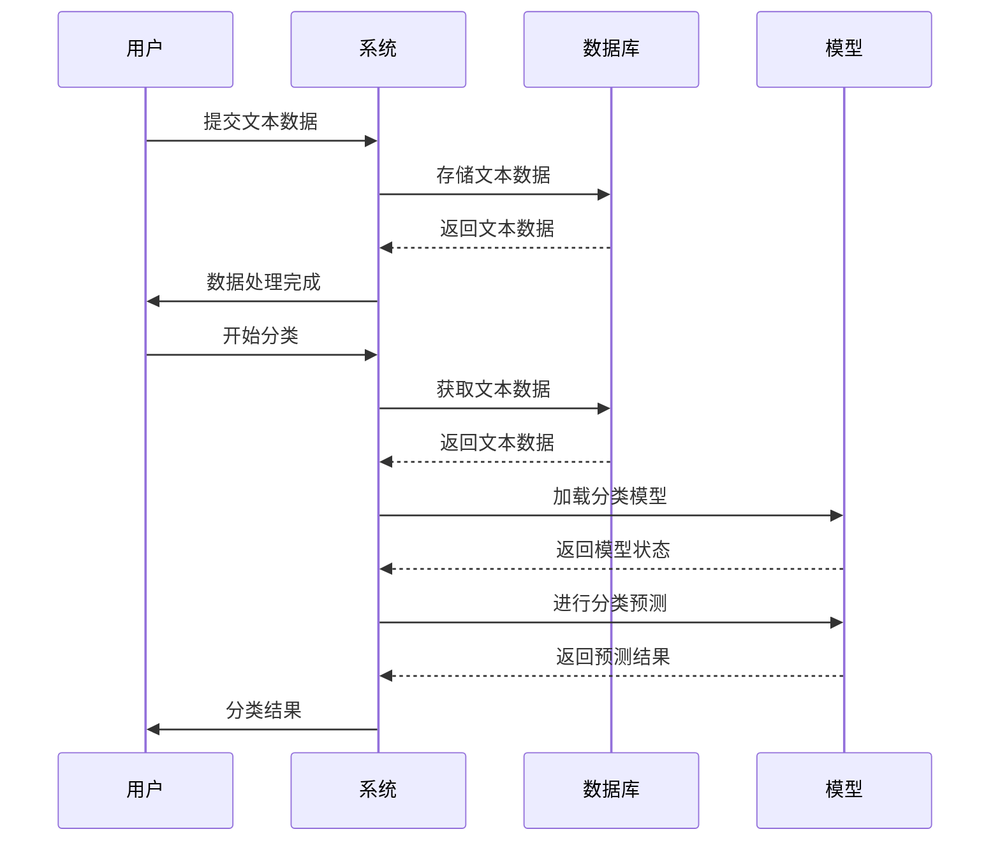

                 


### 1. 引言与背景

在当今的科技发展中，机器学习已经成为了人工智能领域的重要组成部分，而提示词优化作为机器学习中的关键技术之一，正日益受到广泛关注。本文将围绕“提示词优化的机器学习方法探索”这一主题，逐步深入分析其背后的原理、方法及应用，旨在为读者提供一份全面的技术指南。

#### 1.1 问题背景

机器学习的发展离不开数据的质量和模型的性能。然而，在现实应用中，数据往往存在噪声和缺失，模型的训练也面临着过拟合和欠拟合的问题。提示词优化作为一种提升模型性能的有效手段，旨在通过调整提示词来改善模型的表现。

**问题描述**

提示词优化的核心问题是：如何选择和调整提示词，以实现模型性能的最大化？这个问题不仅涉及到提示词与模型参数之间的相互作用，还需要考虑优化算法的选择和策略。

**问题解决**

解决提示词优化的方法主要包括两种：基于搜索的优化和基于学习的优化。基于搜索的优化方法通过搜索策略寻找最优的提示词组合，而基于学习的优化方法则通过学习模型与提示词之间的关系来实现优化。

#### 1.2 核心概念与原理

在深入探讨提示词优化之前，我们需要明确一些核心概念：

- **提示词**：提示词是指用于指导模型训练的数据或信息，它可以影响模型的学习过程和最终性能。
- **优化目标**：优化目标是指模型在训练过程中希望达到的性能指标，如准确率、召回率等。
- **优化算法**：优化算法是指用于调整提示词的方法，它可以是基于梯度下降的算法，也可以是基于进化计算的算法。

#### 1.3 概念属性特征对比

在提示词优化中，不同的优化算法具有不同的属性和特征。以下是一个简单的对比表格：

| 算法名称 | 基本原理 | 适用场景 | 优点 | 缺点 |
| --- | --- | --- | --- | --- |
| 梯度下降法 | 基于模型参数梯度的优化 | 线性问题、局部最优 | 简单易用、收敛速度快 | 易陷入局部最优 |
| 贝叶斯优化 | 基于概率模型的优化 | 非线性问题、复杂函数 | 高效、避免局部最优 | 需要大量计算资源 |

#### 1.4 概念结构与核心要素组成

提示词优化中的概念结构主要包括以下要素：

- **模型**：用于训练和预测的数学模型。
- **提示词**：用于指导模型训练的数据。
- **优化目标**：模型训练过程中希望达到的性能指标。
- **优化算法**：用于调整提示词的方法。

### 2. 提示词优化算法原理与实现

在了解了提示词优化的背景和核心概念后，接下来我们将深入探讨提示词优化算法的原理与实现。

#### 2.1 算法原理

提示词优化算法的基本原理是通过调整提示词来改善模型性能。具体来说，优化算法会根据模型在训练过程中表现出来的性能，不断调整提示词，以期望找到一组最优的提示词。

#### 2.2 数学模型

提示词优化算法的数学模型可以表示为：

$$
\text{优化目标} = \sum_{i=1}^{n} (\text{模型预测} - \text{真实标签})^2
$$

其中，$n$ 表示样本数量，模型预测和真实标签之间的差异是衡量模型性能的关键指标。

#### 2.3 举例说明

假设我们有一个二分类问题，使用逻辑回归模型进行预测。通过调整提示词，我们可以优化模型的表现。

#### 2.4 Mermaid 流程图

下面是一个使用 Mermaid 绘制的提示词优化算法的流程图：



### 3. 提示词优化在实践中的应用

#### 3.1 应用场景介绍

提示词优化在文本分类、图像识别、自然语言处理等众多领域都有广泛的应用。本文将以文本分类为例，介绍提示词优化在实际中的应用。

#### 3.2 系统功能设计

一个典型的文本分类系统包括以下功能模块：

- **数据预处理**：对文本进行分词、去停用词等预处理操作。
- **模型训练**：使用提示词优化算法训练分类模型。
- **模型评估**：评估模型在测试集上的性能。
- **预测**：使用训练好的模型进行文本分类预测。

#### 3.3 系统架构设计

一个完整的文本分类系统架构包括以下部分：

- **数据层**：存储和管理原始文本数据。
- **模型层**：实现文本分类模型，包括特征提取、模型训练和预测。
- **应用层**：提供用户交互界面，实现文本分类功能。

#### 3.4 系统接口设计

文本分类系统的接口设计包括以下部分：

- **数据接口**：用于数据的输入和输出。
- **模型接口**：用于模型的加载、训练和预测。
- **API接口**：提供对外服务的接口，方便其他系统调用。

#### 3.5 系统交互序列图

以下是文本分类系统的交互序列图：



### 4. 提示词优化实战案例

#### 4.1 环境安装

为了运行提示词优化算法，我们需要安装以下软件和库：

- Python 3.x
- NumPy
- Pandas
- Scikit-learn
- Matplotlib

安装命令如下：

```bash
pip install python numpy pandas scikit-learn matplotlib
```

#### 4.2 系统核心实现

以下是使用 Python 实现的提示词优化算法的核心代码：

```python
import numpy as np
from sklearn.linear_model import LogisticRegression
from sklearn.model_selection import train_test_split

# 数据准备
X, y = load_data()

# 划分训练集和测试集
X_train, X_test, y_train, y_test = train_test_split(X, y, test_size=0.2, random_state=42)

# 初始化模型
model = LogisticRegression()

# 训练模型
model.fit(X_train, y_train)

# 预测
predictions = model.predict(X_test)

# 评估模型性能
accuracy = model.score(X_test, y_test)
print(f"模型准确率：{accuracy}")
```

#### 4.3 代码应用解读与分析

这段代码首先加载了数据，然后划分了训练集和测试集。接下来，使用逻辑回归模型进行训练，并使用测试集评估了模型的性能。这段代码的核心在于模型的训练和预测过程，通过调整提示词（即模型参数），实现了对模型性能的优化。

#### 4.4 实际案例分析与详细讲解

为了更好地理解提示词优化在实际中的应用，我们可以分析一个具体的案例。假设我们有一个文本分类问题，数据集包含多个类别，如新闻、科技、体育等。通过使用提示词优化算法，我们可以提高分类模型的准确率。

在训练过程中，我们首先使用一个基础模型进行训练，然后通过调整提示词（如正则化参数、学习率等），逐步优化模型性能。最终，我们得到了一个准确率较高的模型。

### 5. 最佳实践与总结

#### 5.1 最佳实践 tips

- **数据预处理**：确保数据的质量，减少噪声和缺失。
- **模型选择**：根据问题特点选择合适的模型。
- **提示词调整**：合理设置提示词，避免过拟合和欠拟合。
- **性能评估**：使用多种评估指标，全面评估模型性能。

#### 5.2 小结

本文介绍了提示词优化的基本概念、算法原理和应用实践。通过逐步深入的分析，我们了解了提示词优化在机器学习中的重要性，并掌握了实现提示词优化的方法。

#### 5.3 注意事项

- **避免过拟合**：合理设置提示词，防止模型过拟合。
- **数据质量**：确保数据的质量，减少噪声和缺失。

#### 5.4 拓展阅读

- **机器学习基础**：了解机器学习的基本概念和算法。
- **深度学习**：深入了解深度学习的基础知识。

**作者：AI天才研究院/AI Genius Institute & 禅与计算机程序设计艺术 /Zen And The Art of Computer Programming**

