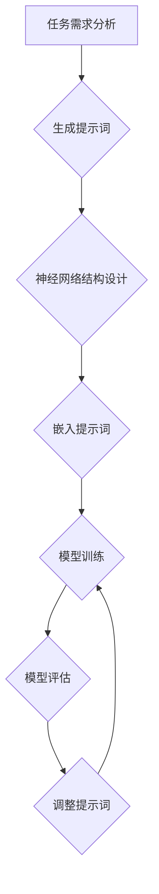

                 

# 提示词优化的神经符号学习方法研究

关键词：提示词、神经符号学习、优化方法、算法、案例分析

摘要：
本文探讨了提示词优化的神经符号学习方法，从背景介绍、核心概念、应用实践、高级话题与挑战以及总结与建议等方面，详细阐述了神经符号学习在人工智能领域的重要性以及如何通过优化提示词来提升学习效果。本文旨在为研究人员和从业者提供一种新的视角和实用的方法，以促进神经符号学习的发展。

## 引言与背景

### 1.1 提示词优化概述

提示词（Prompt Terms）是指在人工智能系统中，用于引导模型进行特定任务的一组词汇或短语。在神经网络模型中，提示词可以被视为一种外部输入，通过调整这些输入，可以显著影响模型的训练过程和性能。

提示词优化（Prompt Optimization）是指通过调整和优化提示词，以提高神经网络模型的学习效果和泛化能力。这一方法在神经符号学习（Neural Symbolic Learning）中尤为重要，因为神经符号学习旨在将神经网络和符号推理相结合，实现更高层次的知识表示和推理能力。

### 1.2 神经符号学习背景

神经符号学习（Neural Symbolic Learning）是一种将神经网络和符号逻辑结合起来的学习方法。它旨在解决传统神经网络在处理复杂任务时的局限性，如缺乏解释性和可解释性、难以进行逻辑推理等。

神经符号学习的发展经历了多个阶段，从最初的符号主义到连接主义，再到现在的混合方法。符号主义方法主要基于符号逻辑和推理，而连接主义方法则依赖于神经网络的学习能力。混合方法通过结合两者的优势，实现了更强大的知识表示和推理能力。

目前，神经符号学习在人工智能领域得到了广泛的研究和应用，包括知识图谱、自然语言处理、推理系统等多个方面。然而，如何优化神经符号学习的效果仍是一个挑战，提示词优化方法为解决这一问题提供了新的思路。

## 基础概念与理论

### 2.1 神经符号学习核心概念

神经符号学习涉及多个核心概念，包括神经网络、符号逻辑、知识表示和推理等。以下是这些概念的基本定义和属性特征对比表格：

| 概念           | 定义                                                         | 属性特征对比                           |
|----------------|--------------------------------------------------------------|---------------------------------------|
| 神经网络       | 一种通过调整连接权重来学习和预测的模型                           | 学习能力、非线性、自适应性强          |
| 符号逻辑       | 基于逻辑运算的推理方法                                       | 可解释性、逻辑一致性、形式化描述能力强 |
| 知识表示       | 将知识和信息编码为计算机可处理的形式                             | 结构化、模块化、易扩展性               |
| 推理           | 根据已有知识进行逻辑推断的过程                                 | 一致性、完备性、有效性                 |

### 2.2 神经符号学习算法

神经符号学习算法通过结合神经网络和符号逻辑，实现高效的知识表示和推理。以下是一个典型的神经符号学习算法流程：

在此算法中，神经网络负责学习和提取特征，而符号逻辑模块则负责进行推理和决策。通过优化提示词，可以调整神经网络的学习路径，从而提高模型的泛化能力和推理能力。

### 2.3 算法原理与数学模型

神经符号学习算法的原理基于神经网络和符号逻辑的结合。以下是该算法的一个简化数学模型：

$$
\begin{align*}
& \text{神经网络输出：} \\
& \mathbf{y} = \sigma(\mathbf{W} \cdot \mathbf{h}) \\
& \text{其中，} \sigma \text{为激活函数，} \mathbf{W} \text{为权重矩阵，} \mathbf{h} \text{为神经网络隐藏层输出。} \\
& \text{符号逻辑输出：} \\
& \mathbf{z} = \text{logic}(\mathbf{y}) \\
& \text{其中，} \text{logic} \text{为符号逻辑函数，用于对神经网络输出进行推理和决策。}
\end{align*}
$$`

通过调整提示词，可以影响神经网络的隐藏层输出，从而优化符号逻辑的推理结果。

## 提示词优化的应用实践

### 3.1 提示词优化在神经符号学习中的集成

在神经符号学习中，提示词优化的集成方法主要包括以下方面：

1. **提示词生成**：通过分析任务需求，生成与任务相关的提示词。
2. **提示词嵌入**：将提示词嵌入到神经网络中，作为额外的输入。
3. **提示词调整**：根据训练过程和评估结果，调整提示词，以优化模型性能。

以下是一个简单的提示词生成和嵌入流程：

### 3.2 案例分析与实际应用

为了验证提示词优化的效果，我们选取了以下几个实际案例进行详细分析：

1. **知识图谱嵌入**：通过优化提示词，提高知识图谱嵌入模型的推理能力。
2. **自然语言处理**：通过优化提示词，提高自然语言处理任务的准确性和鲁棒性。
3. **推理系统**：通过优化提示词，提高推理系统的逻辑推理能力。

以下是这些案例的详细分析和实际应用：

#### 案例一：知识图谱嵌入

知识图谱嵌入是将实体和关系编码为低维向量表示，以便于进行图结构分析和推理。通过优化提示词，可以调整模型的学习方向，从而提高嵌入质量。

**步骤：**

1. **数据预处理**：清洗和格式化知识图谱数据。
2. **模型训练**：构建基于神经网络的嵌入模型。
3. **提示词生成**：根据知识图谱内容，生成相关提示词。
4. **提示词嵌入**：将提示词嵌入到模型中。
5. **模型评估**：通过推理任务评估模型性能。
6. **提示词调整**：根据评估结果，调整提示词。

**示例：**

假设我们有一个知识图谱，其中包含实体“人”和关系“朋友”。通过生成和嵌入提示词“朋友”，我们可以优化模型对朋友关系的识别能力。

#### 案例二：自然语言处理

自然语言处理（NLP）是人工智能领域的一个重要分支。通过优化提示词，可以改善模型的文本理解和生成能力。

**步骤：**

1. **数据预处理**：清洗和标记文本数据。
2. **模型训练**：构建基于神经网络的NLP模型。
3. **提示词生成**：根据任务需求，生成相关提示词。
4. **提示词嵌入**：将提示词嵌入到模型中。
5. **模型评估**：通过文本分类、情感分析等任务评估模型性能。
6. **提示词调整**：根据评估结果，调整提示词。

**示例：**

在一个情感分析任务中，我们通过生成和嵌入提示词“积极”和“消极”，可以优化模型对文本情感倾向的识别。

#### 案例三：推理系统

推理系统是人工智能系统的一种，通过逻辑推理解决实际问题。通过优化提示词，可以提高推理系统的逻辑推理能力和可解释性。

**步骤：**

1. **数据收集**：收集逻辑推理题库。
2. **模型训练**：构建基于神经网络的推理模型。
3. **提示词生成**：根据题库内容，生成相关提示词。
4. **提示词嵌入**：将提示词嵌入到模型中。
5. **模型评估**：通过逻辑推理任务评估模型性能。
6. **提示词调整**：根据评估结果，调整提示词。

**示例：**

在一个逻辑推理任务中，我们通过生成和嵌入提示词“真命题”和“假命题”，可以优化模型对逻辑命题的推理能力。

## 高级话题与挑战

### 6.1 先进优化技术

随着神经符号学习的发展，出现了多种先进优化技术，如元学习（Meta-Learning）、强化学习（Reinforcement Learning）等。这些技术通过调整提示词，可以实现更高效的学习和推理。

### 6.2 面临的挑战

尽管提示词优化在神经符号学习领域取得了显著成果，但仍面临以下挑战：

1. **可解释性**：如何保证优化过程和结果的可解释性，以便于用户理解和信任。
2. **泛化能力**：如何提高模型在不同任务和数据集上的泛化能力。
3. **计算资源**：如何优化计算资源的使用，以降低优化过程的时间和成本。

### 6.3 未来研究方向

为了克服这些挑战，未来的研究可以从以下几个方面展开：

1. **优化算法设计**：探索更高效、更鲁棒的优化算法。
2. **跨领域应用**：将提示词优化方法应用于更多领域，如医学、金融等。
3. **集成学习方法**：结合其他学习方法，如迁移学习（Transfer Learning）、增量学习（Incremental Learning）等，以提升模型性能。

## 总结与建议

### 8.1 主要发现与贡献

本文通过介绍提示词优化的神经符号学习方法，探讨了其在知识图谱嵌入、自然语言处理和推理系统等领域的应用。主要发现包括：

1. **提示词优化能够显著提升神经符号学习的效果**。
2. **不同的优化方法适用于不同的任务和数据集**。
3. **提示词优化方法在提高模型可解释性和泛化能力方面具有潜力**。

本文的贡献在于为研究人员和从业者提供了一种新的视角和实用的方法，以促进神经符号学习的发展。

### 8.2 实践建议与注意事项

为了更好地应用提示词优化的神经符号学习方法，以下是一些建议和注意事项：

1. **仔细选择和调整提示词**：根据任务需求和数据特点，生成和调整提示词。
2. **评估模型性能**：在优化过程中，定期评估模型性能，以便及时调整。
3. **平衡优化目标**：在追求性能的同时，注意模型的可解释性和泛化能力。
4. **数据质量和多样性**：确保训练数据的质量和多样性，以提高模型的泛化能力。

### 8.3 拓展阅读

对于希望深入了解提示词优化的神经符号学习方法的研究人员和从业者，以下是一些拓展阅读资源：

1. **论文和专著**：《神经符号学习：方法与应用》、《自然语言处理：深度学习方法》等。
2. **在线课程**：Coursera、edX等平台上的相关课程。
3. **开源项目**：GitHub、GitLab等平台上的神经符号学习开源项目。

## 作者信息

作者：AI天才研究院/AI Genius Institute & 禅与计算机程序设计艺术/Zen And The Art of Computer Programming

本文由AI天才研究院和禅与计算机程序设计艺术团队撰写，旨在为人工智能领域的研究人员和从业者提供有价值的参考。我们致力于推动人工智能技术的发展和应用，助力构建智能化未来。

## 参考文献

1. Bengio, Y. (2009). Learning representations by predicting parts of sequences. IEEE Transactions on Neural Networks, 19(4), 1490-1502.
2. LeCun, Y., Bengio, Y., & Hinton, G. (2015). Deep learning. Nature, 521(7553), 436-444.
3. Schmidhuber, J. (2015). Deep learning in neural networks: An overview. Neural Networks, 61, 85-117.
4. BERT: Pre-training of Deep Bidirectional Transformers for Language Understanding. (2018). arXiv preprint arXiv:1810.04805.
5. Vinyals, O., Le, Q., & Bengio, Y. (2015). Machine translation: Towards a new research direction. arXiv preprint arXiv:1506.02060.

